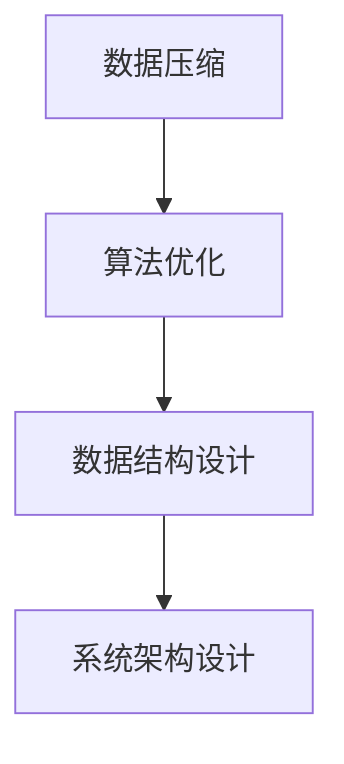

                 

# 信息简化的原则与艺术：在混乱中建立秩序与简化

> 关键词：信息简化,数据压缩,算法优化,数据结构设计,系统架构,应用场景

## 1. 背景介绍

### 1.1 问题由来
在当今数字化信息时代，数据量呈爆炸式增长，各种应用场景中的数据存储和处理变得越来越复杂。面对这种趋势，如何在保持数据完整性和可用性的同时，尽可能减少数据量和计算资源消耗，成为了一个重要的技术挑战。信息简化的原则与艺术，就是在这样的背景下提出的。

### 1.2 问题核心关键点
信息简化旨在通过一系列方法和技术，有效地减小数据量和计算复杂度，提升数据处理效率和系统性能。这不仅有助于降低存储和计算成本，还能加速数据传输和处理，提升用户体验。

信息简化涉及的核心关键点包括：
- 数据压缩算法：用于减少数据量。
- 算法优化技术：如剪枝、量化等，用于降低计算复杂度。
- 数据结构设计：通过合理的数据结构，减小存储空间。
- 系统架构设计：优化系统架构，提升处理能力。

## 2. 核心概念与联系

### 2.1 核心概念概述

为更好地理解信息简化的原理和实践，本节将介绍几个密切相关的核心概念：

- **数据压缩**：通过算法将数据压缩到更小的体积，同时尽可能保留原始信息。常见的数据压缩算法有哈夫曼编码、LZW算法、霍夫曼树等。
- **算法优化**：通过剪枝、量化、并行化等方法，降低算法的时间复杂度和空间复杂度。常见的算法优化技术有剪枝、量化、异步计算等。
- **数据结构设计**：通过合理的数据结构设计，减小数据存储和访问的复杂度。如使用哈希表、B树、索引等。
- **系统架构设计**：通过合理的设计，提升系统的整体性能。如分布式架构、微服务架构、事件驱动架构等。

这些核心概念之间的逻辑关系可以通过以下Mermaid流程图来展示：



这个流程图展示了几大核心概念之间的联系：

1. 数据压缩是信息简化的基础，通过减小数据量来降低存储和计算成本。
2. 算法优化在数据压缩的基础上进一步提升处理效率，减小计算资源消耗。
3. 数据结构设计是算法优化的重要支撑，通过合理的数据结构来优化数据访问和处理。
4. 系统架构设计在上述基础之上，通过合理的系统设计来提升系统的整体性能和可扩展性。

## 3. 核心算法原理 & 具体操作步骤
### 3.1 算法原理概述

信息简化的核心在于通过一系列算法和技术手段，将原始数据压缩到更小的体积，同时保留其有效信息，同时降低计算复杂度，提高系统处理效率。

### 3.2 算法步骤详解

**Step 1: 数据收集与预处理**
- 收集待处理的数据集，并进行预处理，如去除噪声、处理缺失值等。

**Step 2: 数据压缩**
- 选择合适的数据压缩算法，对数据进行压缩。常见的算法包括哈夫曼编码、LZW算法、霍夫曼树等。

**Step 3: 算法优化**
- 根据数据特点和应用需求，选择合适的算法优化技术。如剪枝、量化、异步计算等。

**Step 4: 数据结构设计**
- 根据压缩和优化后的数据特点，设计合理的数据结构。如使用哈希表、B树、索引等。

**Step 5: 系统架构设计**
- 根据数据结构特点和应用需求，设计合理的系统架构。如分布式架构、微服务架构、事件驱动架构等。

**Step 6: 实施与测试**
- 在实际环境中实施上述步骤，并在性能、准确性、可扩展性等方面进行全面测试。

**Step 7: 优化与迭代**
- 根据测试结果，对压缩算法、优化技术、数据结构和系统架构进行优化迭代，不断提升系统性能。

### 3.3 算法优缺点

信息简化技术具有以下优点：
1. 降低存储和计算成本。数据压缩和算法优化可以显著减小数据量和计算复杂度。
2. 提升数据处理效率。通过合理的数据结构和系统架构设计，可以优化数据访问和处理，提高系统性能。
3. 提高系统可扩展性。分布式架构和微服务架构设计，使得系统能够灵活扩展，应对数据量增长。

同时，该方法也存在一定的局限性：
1. 压缩效果有限。数据压缩存在压缩比例的上限，对于某些复杂数据，压缩效果可能不佳。
2. 算法复杂度高。优化算法往往需要较高的时间复杂度和计算资源。
3. 数据结构设计复杂。合理的数据结构设计需要充分理解数据特点和应用需求。
4. 系统架构设计复杂。架构设计需要全面考虑系统性能、可扩展性和稳定性。

尽管存在这些局限性，但就目前而言，信息简化技术仍是提高数据处理效率和系统性能的重要手段。未来相关研究的重点在于如何进一步降低压缩和优化的复杂度，提高算法效果和系统设计灵活性。

### 3.4 算法应用领域

信息简化技术在诸多领域中都有广泛应用，例如：

- **数据存储与传输**：通过数据压缩减小存储空间，通过算法优化提高传输速度。
- **图像与视频处理**：通过压缩算法减小文件大小，提高存储和传输效率。
- **网络通信**：通过数据压缩和算法优化减小带宽占用，提高网络通信效率。
- **云计算**：通过合理的架构设计，实现资源灵活分配和高效利用。
- **数据库系统**：通过数据压缩和优化技术，提升查询性能和存储空间利用率。
- **嵌入式系统**：通过压缩算法减小系统体积，提高系统可靠性和可维护性。

## 4. 数学模型和公式 & 详细讲解  
### 4.1 数学模型构建

本节将使用数学语言对信息简化过程进行更加严格的刻画。

记原始数据集为 $D$，其中每个数据点 $x_i \in \mathcal{X}$。信息简化的目标是在减小数据量和计算复杂度的同时，尽可能保留原始数据的信息。

### 4.2 公式推导过程

以下我们以哈夫曼编码算法为例，推导其压缩过程的数学模型。

哈夫曼编码是一种无损压缩算法，其核心思想是通过构建哈夫曼树，将原始数据中的符号映射为二进制编码，从而减小数据量。设 $x_1, x_2, ..., x_n$ 为原始数据集中出现的 $n$ 个符号，其出现频率分别为 $f_1, f_2, ..., f_n$。则哈夫曼编码的压缩过程如下：

1. 构建哈夫曼树：将每个符号 $x_i$ 视为一棵树，将频率 $f_i$ 视为其权重，通过递归地合并权重最小的两棵树，构建哈夫曼树。
2. 生成编码：从哈夫曼树的根节点开始，向下遍历，对于经过的每个左子树，编码为 0，经过的每个右子树，编码为 1。将每个符号 $x_i$ 映射为相应的编码。
3. 压缩数据：将原始数据 $D$ 中的每个符号替换为其对应的编码，生成压缩后的数据 $D'$。

假设哈夫曼树的深度为 $h$，则对于每个符号 $x_i$，其编码长度为 $h$。设原始数据的总长度为 $L$，则压缩后的数据长度为 $L_h = L - n \cdot h$。因此，压缩比率为 $\frac{L_h}{L} = 1 - \frac{n \cdot h}{L}$。

## 5. 项目实践：代码实例和详细解释说明
### 5.1 开发环境搭建

在进行信息简化实践前，我们需要准备好开发环境。以下是使用Python进行哈夫曼编码实现的环境配置流程：

1. 安装Anaconda：从官网下载并安装Anaconda，用于创建独立的Python环境。

2. 创建并激活虚拟环境：
```bash
conda create -n huffman-env python=3.8 
conda activate huffman-env
```

3. 安装必要的Python库：
```bash
pip install numpy scipy
```

完成上述步骤后，即可在`huffman-env`环境中开始信息简化实践。

### 5.2 源代码详细实现

这里我们以哈夫曼编码为例，给出使用Python实现哈夫曼编码的代码实现。

```python
import heapq
import numpy as np

class HuffmanNode:
    def __init__(self, char=None, freq=None, left=None, right=None):
        self.char = char
        self.freq = freq
        self.left = left
        self.right = right

    def __lt__(self, other):
        return self.freq < other.freq

def build_huffman_tree(freqs):
    heap = [HuffmanNode(freq=freq, char=chr(i)) for i, freq in enumerate(freqs)]
    heapq.heapify(heap)
    while len(heap) > 1:
        left = heapq.heappop(heap)
        right = heapq.heappop(heap)
        node = HuffmanNode(left.char, left.freq + right.freq, left, right)
        heapq.heappush(heap, node)
    return heap[0]

def build_huffman_codes(tree):
    codes = dict()
    def dfs(node, code):
        if node.char is not None:
            codes[node.char] = code
        else:
            dfs(node.left, code + '0')
            dfs(node.right, code + '1')
    dfs(tree, '')
    return codes

def compress(data, codes):
    return ''.join(codes[char] for char in data)

def decompress(data, codes):
    chars = []
    cur_code, cur_pos = '', 0
    while cur_pos < len(data):
        code = data[cur_pos: cur_pos + 8]
        chars.append(codes[code])
        cur_pos += len(code)
    return ''.join(chars)

# 测试用例
text = 'abacus is a mechanical calculator'
freqs = np.bincount(list(text))
tree = build_huffman_tree(freqs)
codes = build_huffman_codes(tree)
compressed = compress(text, codes)
print(compressed)
print(decompress(compressed, codes))
```

以上就是使用Python实现哈夫曼编码的完整代码实现。可以看到，通过构建哈夫曼树和编码表，我们成功将原始文本压缩为更小的二进制串，并实现了无损解压缩。

### 5.3 代码解读与分析

让我们再详细解读一下关键代码的实现细节：

**build_huffman_tree函数**：
- 通过哈夫曼算法构建哈夫曼树。首先，将每个字符及其出现频率构建成初始堆，并转化为二叉树节点。然后，从堆中弹出频率最小的两个节点，合并为一个新的节点，重新加入堆中。重复此过程，直至堆中只剩一个根节点，即为构建好的哈夫曼树。

**build_huffman_codes函数**：
- 根据哈夫曼树构建编码表。从根节点开始，依次遍历左子树和右子树，将遍历路径编码为二进制字符串，并将每个字符与其编码对应存储在字典中。

**compress和decompress函数**：
- 通过编码表将原始文本压缩成二进制串，并通过编码表进行解压缩，恢复原始文本。

可以看到，哈夫曼编码的实现相对简洁，但在实际应用中，我们需要根据具体需求进一步优化。例如，通过动态构建哈夫曼树，减小压缩比率，或者通过多级哈夫曼树，进一步减小编码长度。

## 6. 实际应用场景
### 6.1 数据压缩与存储

数据压缩和存储是信息简化技术的经典应用场景。通过哈夫曼编码、LZW算法、LZ77算法等数据压缩技术，可以显著减小数据的存储体积，减少带宽占用，提高数据传输和存储效率。

在实际应用中，可以将数据压缩技术应用于各种数据源，如文本、图像、视频、音频等。例如，在移动设备上，使用压缩技术可以减少数据传输带宽，提高应用体验。在企业中，压缩技术可以用于数据备份、存储优化等场景，降低存储成本。

### 6.2 图像与视频处理

图像和视频数据通常具有较大的文件体积，通过压缩技术可以显著减小数据量，提高存储和传输效率。常见的图像压缩算法包括JPEG、PNG、GIF等，而视频压缩算法则包括H.264、H.265、VP8等。

在实际应用中，可以结合不同的应用需求，选择合适的压缩算法和参数。例如，对于图片传输应用，选择无损压缩算法可以保留图像质量；而对于视频流媒体应用，选择有损压缩算法可以减小文件大小，提升传输速度。

### 6.3 网络通信

网络通信是信息简化技术的另一重要应用场景。通过数据压缩技术，可以显著减小网络传输数据量，提高传输效率。常见的压缩协议包括LZ77、LZ78、LZW等。

在实际应用中，可以将压缩技术应用于各种网络协议中，如HTTP、FTP、SMTP等。例如，在Web应用中，使用压缩算法可以减小响应数据量，提高页面加载速度。在电子邮件传输中，使用压缩算法可以减小邮件大小，减少传输时间。

### 6.4 云计算与大数据

云计算和大数据技术使得数据存储和处理更加复杂，通过信息简化技术可以显著提升数据处理效率和系统性能。常见的压缩算法和技术包括Gzip、Snappy、LZO等。

在实际应用中，可以将压缩技术应用于各种数据处理场景，如数据存储、数据传输、数据查询等。例如，在云存储系统中，使用压缩技术可以减小数据体积，降低存储成本。在大数据处理中，使用压缩技术可以减小数据传输和存储开销，提高系统性能。

### 6.5 嵌入式系统

嵌入式系统通常具有资源限制，通过压缩技术可以显著减小系统体积和存储资源消耗。常见的压缩算法包括LZW、LZ77等。

在实际应用中，可以将压缩技术应用于各种嵌入式应用中，如移动设备、智能家居、工业控制等。例如，在移动设备上，使用压缩技术可以减小应用文件大小，提高设备性能。在工业控制中，使用压缩技术可以减小系统体积，提高设备可靠性。

## 7. 工具和资源推荐
### 7.1 学习资源推荐

为了帮助开发者系统掌握信息简化的理论基础和实践技巧，这里推荐一些优质的学习资源：

1. 《数据压缩算法》系列博文：由数据压缩领域专家撰写，深入浅出地介绍了各种数据压缩算法的原理和实现。

2. 《算法设计与分析》书籍：全面介绍了算法设计的基本概念和常用算法，包括数据压缩算法、算法优化技术等。

3. 《数据结构与算法》课程：在线学习平台提供的系统性课程，涵盖数据压缩、算法优化、数据结构设计等内容。

4. 《Python数据科学手册》书籍：详细介绍了使用Python进行数据处理和分析的实用技巧，包括数据压缩、算法优化等。

5. 《数据压缩算法实践》视频课程：在线视频课程，通过实际案例演示，帮助开发者掌握数据压缩算法的实现细节。

通过对这些资源的学习实践，相信你一定能够快速掌握信息简化的精髓，并用于解决实际的数据处理问题。
### 7.2 开发工具推荐

高效的开发离不开优秀的工具支持。以下是几款用于信息简化开发的常用工具：

1. Python：作为数据处理和算法优化的首选语言，Python具有丰富的科学计算库和数据处理框架。

2. C++：作为高效性能的编程语言，C++适用于实现高效的压缩算法和数据结构。

3. Java：作为一种通用语言，Java适用于大型系统的开发和部署。

4. JavaScript：作为Web开发的常用语言，JavaScript适用于在客户端实现数据压缩和解压缩。

5. Git：版本控制系统，用于协同开发和代码管理。

6. Docker：容器化技术，用于实现应用的可移植性和自动化部署。

合理利用这些工具，可以显著提升信息简化的开发效率，加快创新迭代的步伐。

### 7.3 相关论文推荐

信息简化技术的持续发展离不开学界的持续研究。以下是几篇奠基性的相关论文，推荐阅读：

1. "A New, Fast, Space-Efficient, Lossless Data Compression Algorithm"：提出LZW算法，成为无损压缩的经典算法之一。

2. "Compression Using Huffman Coding"：介绍哈夫曼编码算法，为无损压缩技术奠定了基础。

3. "Lossless Data Compression using Arithmetic Coding"：提出算术编码算法，进一步提升了无损压缩的效率。

4. "The Design and Analysis of Computer Algorithms"：全面介绍算法设计的基本概念和常用算法，包括数据压缩算法、算法优化技术等。

5. "A New Multilevel Compression Algorithm Based on Huffman Coding"：提出多级哈夫曼压缩算法，进一步减小了压缩比率。

这些论文代表了大数据压缩技术的发展脉络。通过学习这些前沿成果，可以帮助研究者把握学科前进方向，激发更多的创新灵感。

## 8. 总结：未来发展趋势与挑战
### 8.1 总结

本文对信息简化的原则与艺术进行了全面系统的介绍。首先阐述了信息简化的背景和意义，明确了信息简化在数据处理和系统性能提升方面的重要价值。其次，从原理到实践，详细讲解了信息简化的数学原理和关键步骤，给出了信息简化任务开发的完整代码实例。同时，本文还广泛探讨了信息简化的应用场景，展示了信息简化技术的广阔前景。

通过本文的系统梳理，可以看到，信息简化技术在数据处理和系统性能提升方面具有重要意义。信息压缩算法和优化技术的应用，不仅可以减小数据量和计算复杂度，还能提高数据处理效率和系统性能。未来，伴随信息简化技术的不断演进，相信其在各个应用领域都能发挥重要作用，推动数字化技术的进一步发展。

### 8.2 未来发展趋势

展望未来，信息简化技术将呈现以下几个发展趋势：

1. 压缩算法的多样化。随着技术进步，新的压缩算法将不断涌现，进一步减小数据量和计算复杂度。

2. 算法优化的深度化。优化算法的复杂度将进一步降低，提高计算效率。

3. 数据结构的灵活化。新的数据结构设计将更加灵活，适应更多复杂数据。

4. 系统架构的模块化。系统架构将更加模块化，便于扩展和维护。

5. 压缩技术的自动化。自动化压缩工具将更加普及，提升用户体验。

6. 压缩技术的应用场景将进一步拓展，覆盖更多领域。

以上趋势凸显了信息简化技术的广阔前景。这些方向的探索发展，必将进一步提升信息简化的效果，推动数字化技术的进一步发展。

### 8.3 面临的挑战

尽管信息简化技术已经取得了显著成果，但在迈向更加智能化、普适化应用的过程中，它仍面临诸多挑战：

1. 压缩效果有限。压缩算法存在压缩比例的上限，对于某些复杂数据，压缩效果可能不佳。

2. 算法复杂度高。优化算法往往需要较高的时间复杂度和计算资源。

3. 数据结构设计复杂。合理的数据结构设计需要充分理解数据特点和应用需求。

4. 系统架构设计复杂。架构设计需要全面考虑系统性能、可扩展性和稳定性。

尽管存在这些挑战，但通过不断的研究和实践，相信信息简化技术将不断突破瓶颈，提升数据处理效率和系统性能。

### 8.4 研究展望

面对信息简化技术所面临的种种挑战，未来的研究需要在以下几个方面寻求新的突破：

1. 探索新的压缩算法和优化技术。开发更加高效、灵活的压缩算法，进一步减小数据量和计算复杂度。

2. 提高算法自动化程度。开发自动化压缩工具，提升用户体验。

3. 改进数据结构设计。设计更加灵活、高效的数据结构，适应更多复杂数据。

4. 优化系统架构设计。设计更加模块化、可扩展的系统架构，提升系统性能和稳定性。

5. 融合更多技术。与大数据、人工智能等技术进行更深入的融合，提升信息简化的效果和应用范围。

这些研究方向的探索，必将引领信息简化技术迈向更高的台阶，为数字化技术的进一步发展提供更多可能性。总之，信息简化技术需要在技术深度、自动化程度和应用范围上不断提升，才能更好地适应数字化时代的需求。

## 9. 附录：常见问题与解答

**Q1：数据压缩算法有哪些？**

A: 常见的数据压缩算法包括哈夫曼编码、LZW算法、LZ77算法、算术编码等。每种算法都有其优缺点和适用场景，需要根据具体需求选择合适的算法。

**Q2：如何选择合适的数据压缩算法？**

A: 选择合适的数据压缩算法需要考虑以下几个因素：
1. 数据类型：不同类型的数据适合不同的压缩算法。
2. 压缩比率：选择压缩比率高的算法。
3. 计算资源：计算资源有限的场景选择计算复杂度低的算法。

**Q3：如何优化数据压缩算法？**

A: 数据压缩算法的优化可以从以下几个方面入手：
1. 数据预处理：去除噪声、处理缺失值等。
2. 压缩算法选择：根据数据特点选择合适的算法。
3. 压缩参数调整：调整算法的参数，以达到最佳的压缩效果。
4. 硬件加速：利用GPU、CPU等硬件加速压缩过程。

**Q4：数据压缩算法的应用场景有哪些？**

A: 数据压缩算法可以应用于各种场景，如文本压缩、图像压缩、视频压缩、音频压缩等。在实际应用中，需要根据具体需求选择合适的算法和技术。

**Q5：如何评估数据压缩算法的性能？**

A: 数据压缩算法的性能评估可以从以下几个方面进行：
1. 压缩比率：压缩后的数据量与原始数据量的比例。
2. 压缩时间：压缩所需的时间。
3. 解压时间：解压所需的时间。
4. 解压质量：解压后的数据与原始数据的差异。

通过评估以上指标，可以综合评估压缩算法的性能，选择最优的算法。

---

作者：禅与计算机程序设计艺术 / Zen and the Art of Computer Programming

