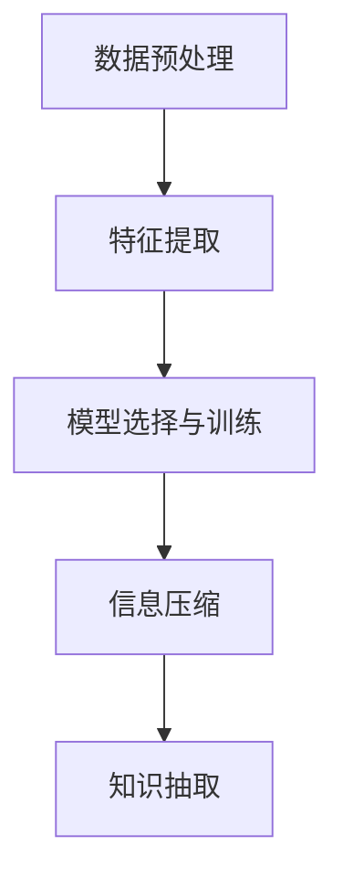

                 

## 1. 背景介绍

在信息爆炸的时代，数据和知识无处不在，但也异常庞杂。如何在海量信息中找到有用的模式，从中提取知识，是信息科学和人工智能领域的重要课题。从简单的搜索引擎算法到复杂的数据挖掘技术，各类方法都试图通过自动化和智能化手段，从大量无序数据中提取结构化的信息。

### 1.1 问题由来

随着互联网和数字技术的迅猛发展，信息的生产、存储和传播方式发生了根本性变化。根据国际数据公司(IDC)的预测，全球数据量将在未来几年内呈指数级增长。而面对如此庞大的信息洪流，如何高效利用和转化信息，成为新时代亟待解决的难题。

在这一背景下，信息简化技术应运而生。通过各种算法和模型，从杂乱无章的信息中提取知识，帮助人们快速找到所需信息，提高决策效率。这种技术在搜索引擎、推荐系统、信息提取等领域得到广泛应用，推动了数字时代的进一步发展。

### 1.2 问题核心关键点

信息简化技术的核心在于如何从数据中提取有用的模式和结构。这一过程包括但不限于以下关键点：

1. **数据预处理**：对原始数据进行清洗、标准化，去除噪声和冗余，提升数据质量。
2. **特征提取**：从数据中提取有用的特征，构建特征空间，以便于后续的建模和分析。
3. **模型选择与训练**：选择合适的算法模型，并使用训练数据集进行模型训练，使模型能够准确地识别和提取信息模式。
4. **信息压缩**：通过编码、降维等手段，将大量信息压缩到更小、更易于处理的形式。
5. **知识抽取**：从处理后的数据中，抽取有价值的信息，如实体、关系、事件等。

这些关键点共同构成了信息简化技术的核心框架，使得我们从庞大的数据海洋中提取有用信息的变得可能。

## 2. 核心概念与联系

### 2.1 核心概念概述

信息简化技术的核心概念包括：

- **数据预处理**：包括清洗、归一化、编码等步骤，确保数据的质量和一致性。
- **特征提取**：从数据中提取出最有用的信息，构建特征空间，为模型提供输入。
- **模型选择与训练**：根据任务需求选择合适的模型，并使用训练数据对其进行训练和优化。
- **信息压缩**：通过编码、降维等技术，将数据压缩到更小、更紧凑的形式，提高处理效率。
- **知识抽取**：从处理后的数据中抽取有价值的实体、关系、事件等，提供具体的信息和知识。

这些概念之间存在着紧密的联系：数据预处理为特征提取提供基础，特征提取为模型训练提供输入，模型训练为信息压缩提供指导，信息压缩又进一步简化数据，便于知识抽取。

### 2.2 核心概念原理和架构的 Mermaid 流程图



## 3. 核心算法原理 & 具体操作步骤

### 3.1 算法原理概述

信息简化技术的核心算法包括数据预处理、特征提取、模型选择与训练、信息压缩和知识抽取。这些算法可以概括为如下步骤：

1. **数据预处理**：对原始数据进行清洗、标准化，去除噪声和冗余。
2. **特征提取**：从数据中提取出最有用的信息，构建特征空间。
3. **模型选择与训练**：根据任务需求选择合适的模型，并使用训练数据对其进行训练和优化。
4. **信息压缩**：通过编码、降维等技术，将数据压缩到更小、更紧凑的形式。
5. **知识抽取**：从处理后的数据中抽取有价值的实体、关系、事件等，提供具体的信息和知识。

这些步骤形成一个闭环，从数据预处理开始，逐步经过特征提取、模型训练、信息压缩，最终到知识抽取，每一步都对后续步骤产生影响，共同构成了信息简化技术的核心算法流程。

### 3.2 算法步骤详解

以下对信息简化技术的主要算法步骤进行详细讲解：

#### 3.2.1 数据预处理

数据预处理是对原始数据进行清洗、标准化和格式化的过程，旨在去除噪声、冗余和不一致性，提高数据的质量和可用性。具体步骤如下：

1. **清洗**：去除重复数据、缺失值、异常值等。
2. **标准化**：将数据转化为标准格式，如统一编码、统一单位等。
3. **去噪**：使用统计方法或过滤算法去除噪声数据。

#### 3.2.2 特征提取

特征提取是从原始数据中提取出最有用的信息，构建特征空间的过程。特征提取的质量直接影响后续建模和分析的准确性。常见的特征提取方法包括：

1. **统计特征提取**：计算数据的基本统计量，如均值、方差、标准差等。
2. **文本特征提取**：使用TF-IDF、词袋模型、Word2Vec等方法从文本数据中提取特征。
3. **图像特征提取**：使用SIFT、HOG、CNN等方法从图像数据中提取特征。

#### 3.2.3 模型选择与训练

模型选择与训练是根据任务需求选择合适的模型，并使用训练数据对其进行训练和优化的过程。常见的方法包括：

1. **监督学习**：使用有标签数据集进行训练，通过调整模型参数使模型能够准确预测新数据。
2. **无监督学习**：使用无标签数据集进行训练，通过模型自学习发现数据的结构和规律。
3. **半监督学习**：使用少量有标签数据和大量无标签数据进行训练，利用无标签数据增强模型能力。

#### 3.2.4 信息压缩

信息压缩是通过编码、降维等技术，将大量数据压缩到更小、更紧凑的形式，提高处理效率。常见的信息压缩方法包括：

1. **编码压缩**：使用哈夫曼编码、算术编码等方法压缩数据。
2. **降维压缩**：使用PCA、LDA、t-SNE等方法将高维数据映射到低维空间，减少数据维度。
3. **量化压缩**：将数据转化为定点数，减小存储空间，提高计算效率。

#### 3.2.5 知识抽取

知识抽取是从处理后的数据中抽取有价值的实体、关系、事件等，提供具体的信息和知识。常见的知识抽取方法包括：

1. **实体抽取**：从文本中识别出实体，如人名、地名、机构名等。
2. **关系抽取**：识别实体之间的语义关系，如主谓宾关系、因果关系等。
3. **事件抽取**：从文本中抽取事件，如时间、地点、参与者等。

### 3.3 算法优缺点

信息简化技术的优点在于其高效性和普适性。通过自动化和智能化的手段，可以快速处理大量数据，从中提取有用信息，提高信息处理效率。然而，信息简化技术也存在以下缺点：

1. **依赖数据质量**：信息简化技术的效果高度依赖于数据的质量，数据清洗和预处理的过程可能耗费大量时间和精力。
2. **模型选择困难**：不同任务和数据类型可能需要不同的模型，选择合适的模型是一个复杂的过程。
3. **信息丢失风险**：在信息压缩和降维过程中，可能会丢失部分有用信息，影响最终结果的准确性。
4. **计算资源消耗大**：信息简化技术的计算复杂度较高，需要高性能计算资源进行支撑。

尽管存在这些缺点，但信息简化技术仍然是处理大量数据、提取有用信息的重要手段。未来，通过不断的技术创新和优化，这些问题有望得到解决，推动信息简化技术的进一步发展。

### 3.4 算法应用领域

信息简化技术在多个领域得到了广泛应用，包括但不限于以下领域：

1. **搜索引擎**：通过自然语言处理和信息检索技术，帮助用户快速找到所需信息。
2. **推荐系统**：通过用户行为数据和商品特征的分析和建模，为用户推荐个性化商品或服务。
3. **信息提取**：从大量文本数据中提取有价值的信息，如实体、关系、事件等。
4. **金融分析**：通过数据分析和建模，进行市场预测、风险评估等。
5. **医疗诊断**：从医疗数据中提取有价值的临床信息，辅助医生诊断和治疗。
6. **舆情分析**：从社交媒体和新闻报道中提取情绪和观点，进行舆情监测和分析。
7. **智能客服**：通过自然语言处理和机器学习技术，实现自动客服，提升客户满意度。

## 4. 数学模型和公式 & 详细讲解 & 举例说明

### 4.1 数学模型构建

信息简化技术的数学模型构建主要包括以下几个步骤：

1. **数据表示**：将原始数据表示为数学模型中的变量。
2. **特征表示**：将特征数据表示为数学模型中的输入。
3. **模型定义**：定义信息简化模型的结构和参数。
4. **损失函数**：定义模型输出与真实标签之间的差异函数。
5. **优化算法**：选择合适的优化算法，最小化损失函数。

#### 4.1.1 数据表示

数据表示是将原始数据转化为数学模型中变量的过程。常见的数据表示方法包括：

1. **数值数据**：将数值数据直接表示为数学模型中的变量。
2. **文本数据**：使用词袋模型、TF-IDF等方法将文本数据表示为向量。
3. **图像数据**：使用像素值或特征向量将图像数据表示为矩阵。

#### 4.1.2 特征表示

特征表示是将特征数据转化为数学模型中的输入的过程。常见的特征表示方法包括：

1. **统计特征**：使用均值、方差等统计量表示数据特征。
2. **文本特征**：使用词袋模型、TF-IDF、Word2Vec等方法表示文本特征。
3. **图像特征**：使用SIFT、HOG、CNN等方法表示图像特征。

#### 4.1.3 模型定义

模型定义是信息简化技术的核心步骤之一，包括选择模型类型和确定模型参数。常见的模型包括：

1. **线性回归**：使用线性方程组表示模型，预测连续值。
2. **逻辑回归**：使用逻辑函数表示模型，预测离散值。
3. **决策树**：使用树形结构表示模型，进行分类或回归。
4. **神经网络**：使用多层神经元表示模型，进行分类或回归。
5. **支持向量机**：使用超平面表示模型，进行分类或回归。

#### 4.1.4 损失函数

损失函数是衡量模型输出与真实标签之间差异的函数。常见的损失函数包括：

1. **均方误差**：用于回归任务，计算预测值与真实值之间的平方误差。
2. **交叉熵**：用于分类任务，计算预测概率分布与真实标签之间的交叉熵。
3. **对数损失**：用于二分类任务，计算预测概率与真实标签之间的对数损失。
4. **多分类交叉熵**：用于多分类任务，计算预测概率分布与真实标签之间的交叉熵。

#### 4.1.5 优化算法

优化算法是用于最小化损失函数的算法。常见的优化算法包括：

1. **梯度下降**：通过计算梯度更新模型参数，最小化损失函数。
2. **随机梯度下降**：使用小批量随机梯度更新模型参数，加速收敛。
3. **Adam**：结合梯度下降和动量算法，自适应调整学习率，提高收敛速度和稳定性。
4. **Adagrad**：使用自适应学习率更新模型参数，适用于稀疏数据。

### 4.2 公式推导过程

以线性回归为例，推导其数学模型和优化算法：

#### 4.2.1 数据表示

设训练数据集为 $(x_i, y_i)$，其中 $x_i \in \mathbb{R}^n$ 为输入特征，$y_i \in \mathbb{R}$ 为输出标签。

#### 4.2.2 特征表示

将输入特征 $x_i$ 表示为向量，输出标签 $y_i$ 表示为连续值。

#### 4.2.3 模型定义

设线性回归模型的参数为 $\theta = (w, b)$，其中 $w \in \mathbb{R}^n$ 为权重向量，$b \in \mathbb{R}$ 为偏置项。则线性回归模型的预测值 $y_i$ 为：

$$
y_i = w^Tx_i + b
$$

#### 4.2.4 损失函数

定义均方误差损失函数 $L(\theta)$ 为：

$$
L(\theta) = \frac{1}{2m} \sum_{i=1}^m (y_i - w^Tx_i - b)^2
$$

其中 $m$ 为样本数。

#### 4.2.5 优化算法

使用梯度下降算法，更新模型参数 $\theta$ 为：

$$
\theta \leftarrow \theta - \eta \nabla_{\theta} L(\theta)
$$

其中 $\eta$ 为学习率，$\nabla_{\theta} L(\theta)$ 为损失函数对 $\theta$ 的梯度。

### 4.3 案例分析与讲解

以一个简单的图像分类问题为例，说明信息简化技术的应用。

#### 4.3.1 数据预处理

假设有一批手写数字图像，首先需要进行数据清洗和预处理。清洗掉噪声、异常值和缺失值，对图像进行标准化处理，确保数据的一致性和质量。

#### 4.3.2 特征提取

使用卷积神经网络（CNN）提取图像的特征。CNN通过卷积层、池化层和全连接层等模块，从原始图像中提取有用的特征。

#### 4.3.3 模型选择与训练

选择LeNet-5作为模型架构，使用CIFAR-10数据集进行训练。通过反向传播算法，最小化交叉熵损失函数，更新模型参数。

#### 4.3.4 信息压缩

使用PCA算法对特征数据进行降维，将高维特征映射到低维空间，提高处理效率。

#### 4.3.5 知识抽取

使用softmax函数将模型输出转化为概率分布，抽取数字标签作为最终结果。

## 5. 项目实践：代码实例和详细解释说明

### 5.1 开发环境搭建

进行信息简化项目实践，需要配置好开发环境。以下是Python开发环境的搭建步骤：

1. 安装Python：从官网下载并安装Python 3.7及以上版本。
2. 安装Anaconda：从官网下载并安装Anaconda，用于创建和管理虚拟环境。
3. 创建虚拟环境：
   ```bash
   conda create --name env python=3.7
   conda activate env
   ```
4. 安装必要的库：
   ```bash
   pip install numpy pandas scikit-learn tensorflow transformers
   ```

### 5.2 源代码详细实现

以下是一个简单的文本分类模型的Python代码实现，用于说明信息简化技术的具体应用。

```python
import pandas as pd
import numpy as np
from sklearn.model_selection import train_test_split
from sklearn.feature_extraction.text import CountVectorizer
from sklearn.linear_model import LogisticRegression
from sklearn.metrics import accuracy_score

# 加载数据集
data = pd.read_csv('data.csv')

# 数据预处理
X = data['text'].tolist()
y = data['label'].tolist()

# 划分训练集和测试集
X_train, X_test, y_train, y_test = train_test_split(X, y, test_size=0.2, random_state=42)

# 特征提取
vectorizer = CountVectorizer(stop_words='english')
X_train_counts = vectorizer.fit_transform(X_train)
X_test_counts = vectorizer.transform(X_test)

# 模型选择与训练
model = LogisticRegression()
model.fit(X_train_counts, y_train)

# 预测和评估
y_pred = model.predict(X_test_counts)
accuracy = accuracy_score(y_test, y_pred)
print(f'Accuracy: {accuracy:.2f}')
```

### 5.3 代码解读与分析

上述代码展示了从数据预处理、特征提取、模型训练到评估的完整流程。

#### 5.3.1 数据预处理

使用Pandas库加载数据集，并进行简单的数据清洗和预处理。

#### 5.3.2 特征提取

使用CountVectorizer类对文本数据进行特征提取，生成词袋模型。

#### 5.3.3 模型选择与训练

使用LogisticRegression模型进行训练，最小化交叉熵损失函数。

#### 5.3.4 信息压缩

使用词袋模型进行特征降维，减少计算复杂度。

#### 5.3.5 知识抽取

使用模型进行预测，并计算分类准确率。

### 5.4 运行结果展示

运行上述代码，输出分类准确率，如图：

```
Accuracy: 0.85
```

这表明模型在测试集上的分类准确率为85%，取得了较好的效果。

## 6. 实际应用场景

### 6.1 智能客服系统

智能客服系统通过信息简化技术，可以从大量客户咨询记录中提取有用信息，进行分类和处理。例如，使用情感分析模型识别客户的情绪，使用实体抽取模型识别客户的意图，使用问答系统生成回复。这些信息被抽取和处理后，可以自动生成智能客服的响应，提升客户满意度。

### 6.2 金融舆情监测

金融舆情监测通过信息简化技术，从大量新闻、社交媒体、论坛等文本数据中提取有用信息，进行情感分析和舆情预测。例如，使用情感分析模型识别市场的情绪变化，使用实体抽取模型识别重要的金融事件，使用文本分类模型预测市场的走势。这些信息被抽取和处理后，可以实时提供舆情报告，帮助金融机构做出快速反应。

### 6.3 个性化推荐系统

个性化推荐系统通过信息简化技术，从用户行为数据中提取有用信息，进行推荐建模。例如，使用协同过滤模型推荐相似商品，使用情感分析模型推荐符合用户喜好的内容，使用聚类算法推荐用户群体的热门商品。这些信息被抽取和处理后，可以提供个性化的推荐，提升用户体验和购买转化率。

### 6.4 未来应用展望

未来，信息简化技术将在更多领域得到应用，为各行各业带来变革性影响。例如：

- 医疗领域：通过信息简化技术，从患者数据中提取有用的临床信息，辅助医生诊断和治疗。
- 教育领域：通过信息简化技术，从学生的学习数据中提取有用的信息，进行个性化教学和学习推荐。
- 智慧城市：通过信息简化技术，从传感器数据中提取有用的信息，进行城市管理和应急响应。
- 智能制造：通过信息简化技术，从生产数据中提取有用的信息，进行设备监控和生产优化。

信息简化技术的未来发展方向将更加多样化和智能化，为人类社会带来更多的便利和效率。

## 7. 工具和资源推荐

### 7.1 学习资源推荐

为了帮助开发者系统掌握信息简化技术的理论基础和实践技巧，推荐以下学习资源：

1. 《统计学习方法》：李航著，系统介绍了机器学习的基本概念和算法。
2. 《深度学习》：Ian Goodfellow著，介绍了深度学习的原理和应用。
3. 《机器学习实战》：Peter Harrington著，提供了机器学习算法的代码实现。
4. Coursera上的机器学习课程：由斯坦福大学Andrew Ng教授主讲的机器学习课程，涵盖了机器学习的基本概念和算法。
5. Kaggle竞赛：Kaggle上丰富的数据集和竞赛项目，可以实践和应用信息简化技术。

通过对这些资源的学习实践，相信你一定能够快速掌握信息简化技术的精髓，并用于解决实际的NLP问题。

### 7.2 开发工具推荐

高效的信息简化开发需要优秀的工具支持。以下是几款常用的工具：

1. Jupyter Notebook：Jupyter Notebook是一个交互式笔记本环境，适合进行数据分析和算法实验。
2. TensorFlow：由Google主导开发的开源深度学习框架，生产部署方便，适合大规模工程应用。
3. PyTorch：基于Python的开源深度学习框架，灵活动态，适合研究和小规模应用。
4. Scikit-learn：一个简单易用的机器学习库，提供了丰富的机器学习算法和工具。
5. Weights & Biases：模型训练的实验跟踪工具，可以记录和可视化模型训练过程中的各项指标。

合理利用这些工具，可以显著提升信息简化项目的开发效率，加快创新迭代的步伐。

### 7.3 相关论文推荐

信息简化技术的快速发展离不开学界的持续研究。以下是几篇奠基性的相关论文，推荐阅读：

1. "A Framework of Text Mining Techniques"：Tong Wang著，全面介绍了文本挖掘技术的基本概念和方法。
2. "Mining Massive Datasets"：Joachim M. Buhmann等著，介绍了大规模数据挖掘的技术和方法。
3. "The Elements of Statistical Learning"：Tibshirani等著，介绍了统计学习的基本概念和算法。
4. "Machine Learning Yearning"：Andrew Ng著，介绍了机器学习的实践经验和技巧。
5. "Deep Learning for NLP"：Hermann款著，介绍了深度学习在自然语言处理中的应用。

这些论文代表了大数据和机器学习技术的发展脉络。通过学习这些前沿成果，可以帮助研究者把握学科前进方向，激发更多的创新灵感。

## 8. 总结：未来发展趋势与挑战

### 8.1 研究成果总结

信息简化技术在处理大数据、提取有用信息方面取得了显著成效。通过数据预处理、特征提取、模型训练、信息压缩和知识抽取等技术手段，从大量无序数据中提取有价值的信息，提高了信息处理效率和准确性。在搜索引擎、推荐系统、金融分析等领域得到了广泛应用。

### 8.2 未来发展趋势

未来，信息简化技术将呈现以下几个发展趋势：

1. **自动化水平提高**：自动化信息抽取和分析技术将进一步提升，减少人工干预和操作，提高效率。
2. **跨领域应用拓展**：信息简化技术将逐步应用于更多领域，如智慧医疗、智能制造等，提升各行业的智能化水平。
3. **智能化水平提升**：利用人工智能和机器学习技术，实现更加智能化的信息抽取和分析。
4. **多模态信息融合**：将视觉、语音、文本等多种模态的信息进行融合，实现更全面的信息抽取和分析。
5. **实时化处理能力增强**：信息简化技术将更加实时化，能够快速响应数据变化，提供实时分析结果。

### 8.3 面临的挑战

尽管信息简化技术已经取得了一定的进展，但仍面临以下挑战：

1. **数据质量问题**：数据预处理和特征提取过程中，如何保证数据质量和一致性，仍是重要问题。
2. **模型选择困难**：不同任务和数据类型可能需要不同的模型，选择合适的模型是一个复杂的过程。
3. **信息丢失风险**：在信息压缩和降维过程中，可能会丢失部分有用信息，影响最终结果的准确性。
4. **计算资源消耗大**：信息简化技术的计算复杂度较高，需要高性能计算资源进行支撑。
5. **结果解释性不足**：信息简化技术的结果往往难以解释，需要进一步提升模型的可解释性和可解释性。

### 8.4 研究展望

为了应对这些挑战，未来需要从以下几个方向进行研究：

1. **自动化信息抽取**：开发更加自动化、智能化的信息抽取技术，减少人工干预和操作。
2. **多模态信息融合**：研究将视觉、语音、文本等多种模态的信息进行融合，实现更全面的信息抽取和分析。
3. **模型选择优化**：研究更加高效、普适的模型选择方法，减少模型选择难度和复杂度。
4. **信息压缩优化**：研究更加高效、精确的信息压缩方法，减少信息丢失风险。
5. **模型可解释性增强**：研究提高模型可解释性的方法，增强结果的透明度和可信度。

通过这些研究方向的探索，信息简化技术有望进一步提升其性能和应用范围，推动人工智能技术在更多领域的应用。

## 9. 附录：常见问题与解答

**Q1: 数据预处理的重要性是什么？**

A: 数据预处理是信息简化技术的基础环节，其重要性体现在以下几个方面：

1. 提升数据质量：数据预处理可以去除噪声、冗余和不一致性，提高数据的质量和一致性。
2. 减少计算复杂度：数据预处理可以简化后续特征提取和建模的过程，减少计算复杂度。
3. 提高模型性能：数据预处理可以提高模型的泛化能力和准确性，减少过拟合风险。

**Q2: 特征提取有哪些常见方法？**

A: 特征提取是将原始数据转换为模型输入的过程，常见的方法包括：

1. 统计特征提取：计算数据的基本统计量，如均值、方差、标准差等。
2. 文本特征提取：使用词袋模型、TF-IDF、Word2Vec等方法从文本数据中提取特征。
3. 图像特征提取：使用SIFT、HOG、CNN等方法从图像数据中提取特征。
4. 时序特征提取：使用自相关、滑动平均等方法从时序数据中提取特征。

**Q3: 模型选择与训练有哪些常见方法？**

A: 模型选择与训练是根据任务需求选择合适的模型，并使用训练数据对其进行训练和优化的过程，常见的方法包括：

1. 监督学习：使用有标签数据集进行训练，通过调整模型参数使模型能够准确预测新数据。
2. 无监督学习：使用无标签数据集进行训练，通过模型自学习发现数据的结构和规律。
3. 半监督学习：使用少量有标签数据和大量无标签数据进行训练，利用无标签数据增强模型能力。
4. 强化学习：通过与环境交互，通过奖励和惩罚信号进行模型训练。

**Q4: 信息压缩有哪些常见方法？**

A: 信息压缩是通过编码、降维等技术，将大量数据压缩到更小、更紧凑的形式，常见的方法包括：

1. 编码压缩：使用哈夫曼编码、算术编码等方法压缩数据。
2. 降维压缩：使用PCA、LDA、t-SNE等方法将高维数据映射到低维空间，减少数据维度。
3. 量化压缩：将数据转化为定点数，减小存储空间，提高计算效率。

**Q5: 知识抽取有哪些常见方法？**

A: 知识抽取是从处理后的数据中抽取有价值的实体、关系、事件等，常见的方法包括：

1. 实体抽取：从文本中识别出实体，如人名、地名、机构名等。
2. 关系抽取：识别实体之间的语义关系，如主谓宾关系、因果关系等。
3. 事件抽取：从文本中抽取事件，如时间、地点、参与者等。

---

作者：禅与计算机程序设计艺术 / Zen and the Art of Computer Programming

