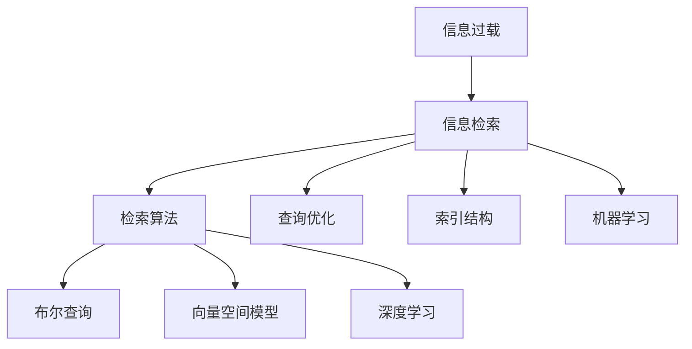

                 

## 1. 背景介绍

### 1.1 问题由来

在互联网的浪潮下，我们每天都在被海量的信息所包围。从文字、图片、视频到音频，从新闻、广告、社交媒体到网络博客，每一个设备上都能看到信息的影子。而传统的信息检索系统，在信息量增长远超指数级的同时，其处理能力却无法同步增长。因此，如何在庞大的信息海洋中，快速准确地找到所需信息，成为了信息检索技术的一大挑战。

随着信息量的不断增长，信息检索技术的演化步伐也日益加快。从经典的布尔查询到高级的机器学习技术，再到深度学习和神经网络，信息检索技术经历了从简单的文本匹配到复杂的数据处理的全过程。但无论是基于规则的算法还是机器学习模型，信息检索技术始终无法解决信息过载的问题。

### 1.2 问题核心关键点

当前信息检索面临的主要问题包括：

1. **信息爆炸**：互联网上每天都在产生新的信息，其数量已远远超过人类处理能力。
2. **结构化和非结构化数据融合**：信息存在于多种形式的数据中，如图像、文本、音频等，如何融合多种数据，提供统一的检索体验，仍是一个挑战。
3. **语义理解**：传统的关键词匹配无法处理复杂的语义关系，需要更深入的语义理解。
4. **个性化推荐**：随着信息量的增长，如何根据用户偏好和历史行为，提供个性化的信息检索体验，需要更智能的推荐算法。
5. **处理速度**：随着信息量的增长，传统的信息检索系统无法提供实时响应，需要高效处理海量数据。

### 1.3 问题研究意义

研究信息过载和信息搜索技术，对提高信息检索效率，降低信息获取成本，具有重要意义。

1. **提升信息检索效率**：通过改进信息检索算法，可以在信息过载的环境中快速找到所需信息。
2. **降低信息获取成本**：减少用户在信息海洋中盲目寻找的时间，节省大量时间和资源。
3. **提供个性化体验**：根据用户兴趣和行为，提供更符合个人需求的检索结果。
4. **支持智能决策**：帮助用户从海量信息中筛选出最相关、最有价值的内容，支持智能决策。
5. **加速技术创新**：提高信息检索技术的能力，为其他领域的技术创新提供基础支持。

## 2. 核心概念与联系

### 2.1 核心概念概述

要理解信息过载与信息搜索技术，首先需了解几个关键概念：

- **信息过载**：在特定时间内，信息量远远超过人们的处理能力，导致用户无法有效利用信息的情况。
- **信息检索**：通过计算机技术从信息库中查找符合特定要求的信息的过程。
- **信息检索技术**：包括检索算法、查询优化、索引结构、机器学习等方法，旨在提高检索效率和准确性。

通过这些核心概念，可以构建起一个完整的检索框架：



这个流程图展示了信息检索的全过程，从信息过载到检索算法，再到查询优化、索引结构、机器学习，每个环节都需要精心设计和优化。

## 3. 核心算法原理 & 具体操作步骤

### 3.1 算法原理概述

信息检索技术的核心是高效的检索算法。传统的信息检索算法主要基于关键字匹配，随着数据量的增长，这种算法已经无法满足用户需求。而现代的信息检索技术，尤其是机器学习和深度学习技术，通过自动学习数据特征，提升了检索的准确性和效率。

基于机器学习的检索算法，可以分为有监督学习和无监督学习两类。有监督学习算法需要大量的标注数据来训练模型，无监督学习算法则可以直接从数据中学习特征，无需标注数据。

### 3.2 算法步骤详解

以下是信息检索技术的主要操作步骤：

1. **数据预处理**：将原始数据转换成模型可以处理的格式。这包括文本清洗、分词、去除停用词、特征提取等步骤。
2. **构建索引**：将预处理后的数据存储到索引结构中，以便快速检索。
3. **模型训练**：通过标注数据或未标注数据训练模型，使其能够对检索任务进行预测。
4. **检索与排序**：根据用户查询，从索引中检索出相关文档，并根据相关性排序。
5. **个性化推荐**：根据用户历史行为和偏好，提供个性化的检索结果。

### 3.3 算法优缺点

基于机器学习的检索算法具有以下优点：

1. **高效性**：在处理大规模数据时，机器学习算法具有优势。
2. **准确性**：通过自动学习数据特征，提升检索准确性。
3. **适应性**：能够自动适应新数据，适应性较强。

同时，这些算法也存在一些缺点：

1. **数据需求高**：有监督学习算法需要大量标注数据，无监督学习算法虽然不需要标注数据，但需要大量的未标注数据。
2. **计算复杂**：机器学习算法训练和推理成本较高，需要高性能计算资源。
3. **解释性差**：模型内部机制复杂，难以解释。
4. **泛化能力有限**：模型容易过拟合，泛化能力一般。

### 3.4 算法应用领域

信息检索技术在多个领域得到了广泛应用：

- **搜索引擎**：如百度、谷歌等搜索引擎，基于信息检索技术实现关键词搜索。
- **推荐系统**：如Netflix、Amazon等，通过信息检索技术推荐相关产品。
- **社交网络**：如微信、Facebook等，根据用户兴趣和行为推荐内容。
- **医疗健康**：通过检索技术，查找医疗文献、药物信息等。
- **金融保险**：通过检索技术，查找市场数据、金融报告等。

## 4. 数学模型和公式 & 详细讲解 & 举例说明

### 4.1 数学模型构建

信息检索模型主要分为文本检索模型和多媒体检索模型。这里以文本检索模型为例，介绍其数学模型构建。

文本检索模型基于向量空间模型，其核心思想是将文本表示为向量，利用向量之间的距离进行相似性度量。设文本 $d$ 的词袋模型为 $\vec{d}$，则文本向量表示为：

$$
\vec{d} = \left( \vec{w}_1, \vec{w}_2, \ldots, \vec{w}_n \right)
$$

其中 $\vec{w}_i$ 为词 $w_i$ 的权重。根据TF-IDF算法，可以得到：

$$
w_i = tf_i \times idf_i
$$

其中 $tf_i$ 为词 $w_i$ 在文本 $d$ 中的出现频率，$idf_i$ 为词 $w_i$ 的逆文档频率。文本向量的长度为 $n$，表示词汇表的大小。

设查询 $q$ 的词袋模型为 $\vec{q}$，则查询向量表示为：

$$
\vec{q} = \left( \vec{q}_1, \vec{q}_2, \ldots, \vec{q}_n \right)
$$

### 4.2 公式推导过程

根据余弦相似度公式，计算文本向量 $\vec{d}$ 和查询向量 $\vec{q}$ 之间的相似度：

$$
similarity = \frac{\vec{d} \cdot \vec{q}}{\|\vec{d}\| \times \|\vec{q}\|}
$$

其中 $\cdot$ 表示向量的点积，$\| \cdot \|$ 表示向量的范数。

将文本向量表示为矩阵形式，设文本矩阵为 $D$，查询矩阵为 $Q$，则相似度矩阵 $S$ 为：

$$
S = D \times Q^T
$$

### 4.3 案例分析与讲解

以搜索引擎为例，分析其信息检索技术。

搜索引擎的检索过程可以分为以下几个步骤：

1. **网页抓取**：从互联网上抓取网页内容。
2. **预处理**：对网页进行预处理，包括分词、去除停用词、建立词袋模型等。
3. **构建索引**：将预处理后的网页内容存储到倒排索引中，方便快速检索。
4. **模型训练**：使用标注数据训练检索模型，如LDA模型、BM25模型等。
5. **用户查询**：用户输入查询关键词。
6. **检索与排序**：根据用户查询，从索引中检索出相关网页，并根据相关性排序。
7. **个性化推荐**：根据用户历史行为，推荐相关网页。

## 5. 项目实践：代码实例和详细解释说明

### 5.1 开发环境搭建

为了实现信息检索功能，需要搭建一个包含数据处理、模型训练、索引构建、检索排序、推荐系统等组件的环境。以下是一个简单的Python环境搭建流程：

1. **安装Python**：下载并安装Python 3.x版本。
2. **安装PyTorch**：使用pip安装PyTorch，并设置GPU加速。
3. **安装Pandas**：安装Pandas库，用于数据处理。
4. **安装Scikit-learn**：安装Scikit-learn库，用于机器学习模型训练。
5. **安装Elasticsearch**：安装Elasticsearch，用于构建倒排索引。
6. **安装Flask**：安装Flask，用于搭建Web服务器。

### 5.2 源代码详细实现

以下是一个简单的信息检索系统代码实现：

```python
import pandas as pd
from sklearn.feature_extraction.text import CountVectorizer
from sklearn.metrics.pairwise import cosine_similarity
from sklearn.decomposition import TruncatedSVD
from sklearn.linear_model import LogisticRegression
from sklearn.pipeline import Pipeline
from sklearn.preprocessing import TfidfTransformer
from flask import Flask, request, jsonify

app = Flask(__name__)

# 加载数据
data = pd.read_csv('data.csv')

# 数据预处理
vectorizer = CountVectorizer(stop_words='english')
X = vectorizer.fit_transform(data['text'])

# 特征提取
tfidf_transformer = TfidfTransformer()
X_tfidf = tfidf_transformer.fit_transform(X)

# 构建索引
svd = TruncatedSVD(n_components=100)
X_svd = svd.fit_transform(X_tfidf)

# 训练模型
model = LogisticRegression()
model.fit(X_svd, data['label'])

# 模型预测
def predict(query):
    query_vector = vectorizer.transform([query])
    query_tfidf = tfidf_transformer.transform(query_vector)
    query_svd = svd.transform(query_tfidf)
    scores = model.predict_proba(query_svd)
    return scores[0]

# Web服务接口
@app.route('/search', methods=['POST'])
def search():
    query = request.json['query']
    scores = predict(query)
    results = []
    for i, score in enumerate(scores):
        doc = {'id': data['id'][i], 'score': score}
        results.append(doc)
    return jsonify(results)

if __name__ == '__main__':
    app.run(debug=True)
```

### 5.3 代码解读与分析

以上代码实现了一个简单的信息检索系统，包括数据加载、预处理、特征提取、模型训练、预测和Web服务接口。其工作流程如下：

1. **数据加载**：从CSV文件中加载数据，并进行初步清洗。
2. **数据预处理**：使用CountVectorizer对文本进行分词、去除停用词，构建词袋模型。
3. **特征提取**：使用TF-IDF算法对词袋模型进行转换，并使用TruncatedSVD算法进行降维。
4. **模型训练**：使用Logistic Regression模型对降维后的特征进行训练，得到预测函数。
5. **模型预测**：使用训练好的模型对用户查询进行预测，得到相关性分数。
6. **Web服务接口**：使用Flask搭建Web服务接口，用户可以向接口发送查询请求，获取相关性分数最高的文档。

### 5.4 运行结果展示

运行以上代码，可以在本地搭建一个简单的信息检索Web服务，输入查询字符串，服务器返回与查询最相关的文档。例如，输入查询字符串 "AI research"，服务器返回相关性分数最高的文档，这些文档包含了与AI研究相关的信息。

## 6. 实际应用场景

### 6.1 搜索引擎

搜索引擎是信息检索技术的典型应用。例如，百度、谷歌等搜索引擎通过检索技术，快速匹配用户查询，提供最相关的网页。

### 6.2 推荐系统

推荐系统也是信息检索技术的常见应用。例如，Netflix、Amazon等平台，通过检索技术，为用户推荐相关产品。

### 6.3 社交网络

社交网络中，通过检索技术，根据用户兴趣和行为，推荐相关内容。例如，微信、Facebook等社交平台，根据用户浏览历史和好友推荐，提供个性化内容。

### 6.4 医疗健康

医疗健康领域，通过检索技术，查找医疗文献、药物信息等。例如，PubMed、WebMD等平台，提供医学文献检索和药物信息查询。

### 6.5 金融保险

金融保险领域，通过检索技术，查找市场数据、金融报告等。例如，彭博社、华尔街日报等平台，提供金融数据和市场分析。

## 7. 工具和资源推荐

### 7.1 学习资源推荐

1. **《Introduction to Information Retrieval》书籍**：由Christopher Manning、Prabhakar Raghavan和Jeffrey U. Smith合著，是一本经典的检索教材，涵盖信息检索的理论和实践。
2. **CS235《信息检索》课程**：斯坦福大学开设的信息检索课程，涵盖文本检索、多媒体检索、信息检索评估等内容。
3. **《Machine Learning for Information Retrieval》书籍**：由David P. McDonald和Daniel H. Wang合著，详细介绍了机器学习在信息检索中的应用。
4. **ArXiv预印本**：ArXiv上大量的信息检索论文，涵盖最新的研究成果和前沿技术。

### 7.2 开发工具推荐

1. **Elasticsearch**：开源的分布式搜索和分析引擎，提供高效的倒排索引和分布式查询功能。
2. **TensorFlow**：由Google开发的开源机器学习框架，提供高效的深度学习模型训练。
3. **PyTorch**：由Facebook开发的开源机器学习框架，提供灵活的深度学习模型构建和训练。
4. **Flask**：轻量级的Web框架，方便搭建信息检索的Web服务。
5. **NLTK**：自然语言处理工具包，提供文本处理、分词、停用词去除等功能。

### 7.3 相关论文推荐

1. **BM25: A Modern Approach to Automatic Relevance Determination**：由Robert N. Terrell和Gerard Salton提出，是一种常用的文本检索模型。
2. **Latent Semantic Indexing**：由Saul ParzkOWSKI提出，是一种常用的文本索引技术。
3. **Deep Learning for Text Retrieval**：由Dengyao Wang、Jun Xu和Zheng-Yan Zha提出，介绍深度学习在信息检索中的应用。

## 8. 总结：未来发展趋势与挑战

### 8.1 总结

本文对信息过载与信息搜索技术进行了全面系统的介绍。首先阐述了信息过载问题以及信息检索技术的研究背景和意义，明确了信息检索在提高信息检索效率、降低信息获取成本、提供个性化体验、支持智能决策等方面的重要作用。其次，从原理到实践，详细讲解了信息检索的数学模型和核心算法，提供了完整的代码实例。同时，本文还探讨了信息检索在多个领域的实际应用，展示了信息检索技术的广泛应用前景。

通过本文的系统梳理，可以看到，信息检索技术在信息过载时代具有重要的应用价值。未来，随着机器学习和深度学习技术的不断发展，信息检索技术必将进一步提升检索效率和准确性，为信息检索带来新的突破。

### 8.2 未来发展趋势

展望未来，信息检索技术的发展趋势如下：

1. **深度学习技术的应用**：深度学习技术在信息检索中的应用将更加广泛，提升检索的准确性和效率。
2. **多模态检索的融合**：将文本、图像、音频等多种形式的数据融合，提升检索的全面性和准确性。
3. **智能推荐系统的发展**：推荐系统将与信息检索技术紧密结合，提供更个性化的信息检索体验。
4. **分布式计算的优化**：信息检索系统将利用分布式计算技术，提高检索性能和扩展性。
5. **实时处理能力的提升**：实时处理能力将成为信息检索技术的重要发展方向，支持实时检索和推荐。

### 8.3 面临的挑战

尽管信息检索技术已经取得了巨大的进步，但在未来发展过程中，仍面临一些挑战：

1. **数据处理能力**：如何高效处理大规模数据，减少数据处理时间，提升检索速度。
2. **模型复杂度**：深度学习模型虽然效果好，但模型复杂度高，训练和推理成本高。
3. **隐私保护**：如何保护用户隐私，防止个人信息泄露。
4. **跨语言检索**：如何处理跨语言检索问题，提供多语言支持。
5. **语义理解**：如何更好地理解文本语义，提升检索准确性。

### 8.4 研究展望

面对信息检索技术面临的挑战，未来的研究需要在以下几个方面寻求新的突破：

1. **高效数据处理技术**：开发更高效的数据处理算法，提升数据处理速度。
2. **轻量级模型设计**：设计更轻量级的深度学习模型，降低计算成本。
3. **隐私保护技术**：研究隐私保护算法，保护用户隐私。
4. **跨语言检索方法**：研究跨语言检索算法，提供多语言支持。
5. **语义理解技术**：研究语义理解算法，提升检索准确性。

## 9. 附录：常见问题与解答

### 9.1 问题1：信息检索技术如何处理大规模数据？

答案：信息检索技术通过建立倒排索引、分布式计算等方法，可以高效处理大规模数据。倒排索引将文本转换为数据结构，方便快速检索。分布式计算将数据分布到多台机器上，提高计算效率。

### 9.2 问题2：信息检索技术的准确性如何保证？

答案：信息检索技术的准确性可以通过训练深度学习模型、优化检索算法等方式提高。深度学习模型可以自动学习数据特征，提升检索准确性。检索算法可以通过优化相似度计算方式，提高检索结果的相关性。

### 9.3 问题3：信息检索技术如何支持个性化推荐？

答案：信息检索技术可以通过学习用户历史行为和偏好，提供个性化的检索结果。推荐系统可以通过模型预测用户感兴趣的内容，结合信息检索技术，提升推荐准确性。

### 9.4 问题4：信息检索技术如何处理跨语言检索？

答案：信息检索技术可以通过多语言模型、语言翻译技术等方式处理跨语言检索问题。多语言模型可以同时处理多种语言的文本，语言翻译技术可以将不同语言的文本转换为同一种语言，方便检索。

### 9.5 问题5：信息检索技术如何解决隐私保护问题？

答案：信息检索技术可以通过匿名化、差分隐私等方法解决隐私保护问题。匿名化可以将用户信息进行脱敏处理，防止个人信息泄露。差分隐私可以在保护用户隐私的前提下，提供高效的检索服务。

---

作者：禅与计算机程序设计艺术 / Zen and the Art of Computer Programming

