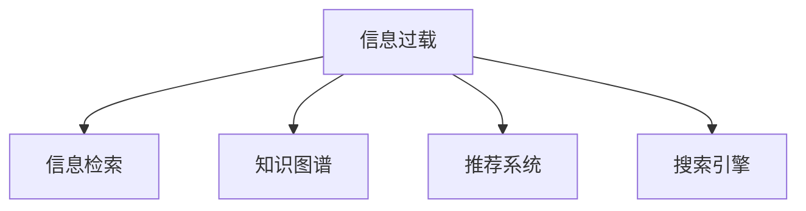

                 

# 信息过载与信息搜索指南：在庞大的信息海洋中找到你需要的信息

> 关键词：信息过载,信息搜索,知识管理,大数据,人工智能,搜索引擎

## 1. 背景介绍

### 1.1 问题由来
在数字化、网络化时代，信息无处不在。从海量的网页、文献、博客到社交媒体、新闻报道、视频资料，人们面临的信息量呈现出指数级增长。互联网的普及让人们随时随地都能获取到丰富的知识，但这也导致了信息过载问题日益凸显：人们在搜索、筛选和利用信息时，常常感到无从下手，难以找到真正有用的信息。

### 1.2 问题核心关键点
信息过载的根源在于信息量的爆炸性增长和信息获取、处理技术的滞后。当信息量远远超出了人们或系统的处理能力时，就会产生信息过载。解决信息过载的关键在于：

1. 提升信息获取、处理、筛选和利用的效率。
2. 设计更智能、高效的信息搜索和推荐系统。
3. 将信息进行结构化和组织，构建知识图谱和检索系统。

本文将从信息搜索和知识管理两个方面，探讨如何在大数据时代有效管理和利用信息，帮助用户在庞大的信息海洋中找到真正需要的信息。

## 2. 核心概念与联系

### 2.1 核心概念概述

为更好地理解如何在大数据时代管理信息，本节将介绍几个密切相关的核心概念：

- 信息过载（Information Overload）：指信息量超出了人们或系统处理能力的状况。导致用户难以在短时间内筛选出有用信息，影响工作效率和生活质量。
- 信息检索（Information Retrieval, IR）：通过特定的算法和技术，从大量文本数据中检索出与用户查询相关的文档。传统的信息检索多基于关键词匹配，难以理解查询的语义。
- 知识图谱（Knowledge Graph）：一种结构化的数据表示方法，通过节点（实体）和边（关系）将知识有机组织起来，便于查询、推理和利用。
- 推荐系统（Recommendation System）：基于用户行为数据和物品属性，预测用户可能感兴趣的物品，并进行推荐。推荐系统广泛应用于电商、音乐、视频等个性化服务领域。
- 搜索引擎（Search Engine）：一种信息检索系统，通过算法自动检索互联网上的网页，并提供给用户查询结果。现代搜索引擎如Google、Bing等，已集成了机器学习、自然语言处理等技术，提供更智能的搜索体验。

这些核心概念之间的逻辑关系可以通过以下Mermaid流程图来展示：



这个流程图展示了几类核心概念及其之间的关系：

1. 信息过载产生背景，导致对信息检索、知识图谱、推荐系统和搜索引擎的需求。
2. 信息检索通过关键词匹配等方式，检索出相关信息。
3. 知识图谱通过结构化的方式，组织和关联实体及其关系，便于检索和推理。
4. 推荐系统通过用户行为数据，预测用户兴趣并进行推荐。
5. 搜索引擎通过算法检索，提供给用户查询结果。

## 3. 核心算法原理 & 具体操作步骤
### 3.1 算法原理概述

解决信息过载问题，主要依赖于信息检索、知识图谱、推荐系统和搜索引擎等技术。以下将详细讲解这些核心算法的原理及操作步骤。

### 3.2 算法步骤详解

#### 3.2.1 信息检索算法

信息检索的核心任务是从大量文档库中，找出与用户查询最相关的文档。常用算法包括：

- **布尔检索**：通过布尔逻辑运算符（AND, OR, NOT）组合关键词，检索出匹配文档。

- **向量空间模型**：将文档表示为高维空间中的向量，计算查询向量与文档向量的相似度，选出最相似的文档。

- **隐含语义索引**：通过潜在的语义空间表示文档，计算查询和文档之间的语义相似度。

#### 3.2.2 知识图谱构建算法

知识图谱的构建需要首先确定实体和关系，然后使用算法将其组织成结构化的知识库。常用算法包括：

- **基于规则的方法**：根据预定义的规则和约束，构建知识图谱。

- **基于统计的方法**：通过统计大量数据，自动发现实体和关系，构建知识图谱。

- **基于神经网络的方法**：利用深度学习技术，从非结构化数据中学习实体和关系。

#### 3.2.3 推荐系统算法

推荐系统通常包含以下核心步骤：

- **用户建模**：收集用户的历史行为数据（如点击、购买等），构建用户画像。

- **物品建模**：对物品的属性和特征进行建模，如评分、标签等。

- **协同过滤**：基于用户和物品的相似度，预测用户可能感兴趣的物品。

- **内容推荐**：通过物品的属性和特征，生成推荐结果。

#### 3.2.4 搜索引擎算法

搜索引擎的核心算法包括：

- **PageRank算法**：通过计算网页的PageRank值，排序搜索结果。

- **倒排索引**：将文档库中的词与文档ID进行映射，快速定位包含特定关键词的文档。

- **查询扩展**：通过同义词、短语、相关词等扩展查询，提高搜索结果的相关性。

### 3.3 算法优缺点

#### 3.3.1 信息检索算法的优缺点

**优点**：
- 简单高效，适用于小规模数据集。
- 易于实现和部署。

**缺点**：
- 难以理解查询的语义，匹配结果不够精准。
- 无法处理复杂的语义关系和实体关联。

#### 3.3.2 知识图谱构建算法的优缺点

**优点**：
- 结构化的知识表示，便于查询和推理。
- 支持复杂语义关系和实体关联。

**缺点**：
- 构建过程复杂，需要大量人工干预。
- 难以处理动态变化的数据和关系。

#### 3.3.3 推荐系统算法的优缺点

**优点**：
- 能够个性化推荐用户感兴趣的内容。
- 基于用户行为数据，精准度较高。

**缺点**：
- 需要大量用户数据，难以覆盖所有用户。
- 冷启动问题，新用户或物品难以推荐。

#### 3.3.4 搜索引擎算法的优缺点

**优点**：
- 能快速定位包含特定关键词的文档。
- 支持复杂的查询扩展。

**缺点**：
- 难以处理大规模数据集。
- 匹配结果不够精准。

### 3.4 算法应用领域

信息检索、知识图谱、推荐系统和搜索引擎等算法，在多个领域中得到了广泛应用：

- **电子商务**：利用推荐系统推荐商品，提升用户体验。
- **社交媒体**：利用知识图谱构建社交网络，推荐相关内容。
- **医疗健康**：利用搜索引擎获取医疗信息，构建知识图谱辅助诊断。
- **新闻媒体**：利用信息检索获取最新资讯，推荐相关文章。
- **金融保险**：利用推荐系统推荐投资产品，构建知识图谱分析市场动态。

## 4. 数学模型和公式 & 详细讲解 & 举例说明

### 4.1 数学模型构建

#### 4.1.1 信息检索的数学模型

信息检索的核心是计算查询与文档之间的相似度。常用的相似度计算方法包括余弦相似度、Jaccard相似度等。

假设查询为 $q$，文档集合为 $D$，文档中包含的词为 $t$。用向量空间模型表示查询和文档：

$$
q = \sum_{i=1}^n q_i t_i
$$
$$
d = \sum_{i=1}^n d_i t_i
$$

其中 $q_i$ 和 $d_i$ 分别表示查询和文档中词 $t_i$ 的权重。计算查询和文档的余弦相似度为：

$$
\text{similarity}(q, d) = \frac{q \cdot d}{\|q\| \cdot \|d\|}
$$

#### 4.1.2 知识图谱的数学模型

知识图谱通常由节点（实体）和边（关系）组成。假设知识图谱 $G=(V,E)$，其中 $V$ 表示实体节点集合，$E$ 表示关系边集合。

每个节点 $v_i$ 表示一个实体，包括属性（如名称、描述、类别等）和关系（如父类、子类、属性等）。关系边 $e_{ij}$ 表示节点 $v_i$ 和 $v_j$ 之间的语义关系。

知识图谱的构建可以通过以下数学模型进行：

$$
G = (V, E, \phi)
$$

其中 $\phi: V \times V \rightarrow [0,1]$ 表示节点间的相似度函数。

### 4.2 公式推导过程

#### 4.2.1 信息检索公式推导

假设查询 $q$ 和文档 $d_i$ 表示为向量：

$$
q = (q_1, q_2, ..., q_n)
$$
$$
d_i = (d_{i1}, d_{i2}, ..., d_{in})
$$

余弦相似度公式可以简化为：

$$
\text{similarity}(q, d_i) = \frac{q \cdot d_i}{\|q\| \cdot \|d_i\|}
$$

将查询和文档表示为词袋模型（Bag of Words, BOW）：

$$
q = \sum_{i=1}^n q_i t_i
$$
$$
d_i = \sum_{i=1}^n d_i t_i
$$

计算余弦相似度为：

$$
\text{similarity}(q, d_i) = \frac{\sum_{i=1}^n q_i d_i}{\sqrt{\sum_{i=1}^n q_i^2} \cdot \sqrt{\sum_{i=1}^n d_i^2}}
$$

#### 4.2.2 知识图谱公式推导

知识图谱的构建需要首先定义节点的相似度函数 $\phi$。常用的相似度函数包括余弦相似度、Jaccard相似度等。

假设节点 $v_i$ 和 $v_j$ 表示为向量：

$$
v_i = (v_{i1}, v_{i2}, ..., v_{in})
$$
$$
v_j = (v_{j1}, v_{j2}, ..., v_{jn})
$$

计算节点之间的相似度为：

$$
\phi(v_i, v_j) = \frac{v_i \cdot v_j}{\|v_i\| \cdot \|v_j\|}
$$

## 5. 项目实践：代码实例和详细解释说明

### 5.1 开发环境搭建

在进行信息搜索和推荐系统开发前，我们需要准备好开发环境。以下是使用Python进行PyTorch开发的环境配置流程：

1. 安装Anaconda：从官网下载并安装Anaconda，用于创建独立的Python环境。

2. 创建并激活虚拟环境：
```bash
conda create -n pytorch-env python=3.8 
conda activate pytorch-env
```

3. 安装PyTorch：根据CUDA版本，从官网获取对应的安装命令。例如：
```bash
conda install pytorch torchvision torchaudio cudatoolkit=11.1 -c pytorch -c conda-forge
```

4. 安装TensorFlow：
```bash
conda install tensorflow
```

5. 安装各类工具包：
```bash
pip install numpy pandas scikit-learn matplotlib tqdm jupyter notebook ipython
```

完成上述步骤后，即可在`pytorch-env`环境中开始信息搜索和推荐系统开发的实践。

### 5.2 源代码详细实现

我们以推荐系统为例，使用TensorFlow实现一个简单的协同过滤算法。推荐系统通常使用用户-物品矩阵 $R$ 进行推荐，其中 $R_{ui}$ 表示用户 $u$ 对物品 $i$ 的评分。假设用户有 $m$ 个，物品有 $n$ 个，评分矩阵为 $R \in \mathbb{R}^{m \times n}$。

我们构建协同过滤模型时，假设用户和物品的评分都通过向量表示。用户向量 $u$ 和物品向量 $v$ 可以表示为：

$$
u = \sum_{i=1}^n \alpha_i v_i
$$
$$
v = \sum_{i=1}^m \beta_i u_i
$$

其中 $\alpha_i$ 和 $\beta_i$ 为权重系数。协同过滤的目标是最小化用户评分与推荐评分的差异：

$$
\min_{\alpha_i, \beta_i} \sum_{u=1}^m \sum_{i=1}^n (R_{ui} - \alpha_i \beta_i)^2
$$

使用梯度下降等优化算法，更新权重系数 $\alpha_i$ 和 $\beta_i$，使得推荐评分尽可能接近真实评分。

以下是Python代码实现：

```python
import tensorflow as tf

# 假设评分矩阵
R = tf.constant([[1, 2, 3], [2, 3, 4], [3, 4, 5]], dtype=tf.float32)

# 用户向量
u = tf.Variable(tf.zeros((3, 3)))

# 物品向量
v = tf.Variable(tf.zeros((3, 3)))

# 权重系数
alpha = tf.Variable(tf.zeros((3, 3)))
beta = tf.Variable(tf.zeros((3, 3)))

# 优化目标
loss = tf.reduce_sum(tf.square(R - tf.matmul(u, v) * tf.matmul(v, alpha) * tf.matmul(alpha, u)))

# 优化器
optimizer = tf.optimizers.Adam()

# 梯度下降
optimizer.minimize(loss)

# 运行优化器
optimizer.apply_gradients(zip(tf.gradients(loss, [u, v, alpha, beta]), [u, v, alpha, beta]))
```

在代码中，我们首先定义了评分矩阵 $R$，用户向量 $u$，物品向量 $v$，以及权重系数 $\alpha$ 和 $\beta$。然后，定义了优化目标和优化器，通过梯度下降算法更新权重系数，使得推荐评分与真实评分尽可能接近。最后，使用 `apply_gradients` 方法运行优化器。

### 5.3 代码解读与分析

这里我们详细解读一下代码的关键部分：

- `tf.constant`：定义常量矩阵，用于表示评分矩阵 $R$。

- `tf.Variable`：定义变量，用于表示用户向量 $u$、物品向量 $v$、权重系数 $\alpha$ 和 $\beta$。

- `tf.reduce_sum`：计算优化目标函数。

- `tf.matmul`：矩阵乘法，用于计算推荐评分。

- `tf.square`：平方差，用于计算评分差异。

- `tf.optimizers.Adam`：定义优化器，使用 Adam 算法。

- `tf.gradients`：计算梯度，用于更新权重系数。

- `apply_gradients`：运行优化器，更新权重系数。

## 6. 实际应用场景

### 6.1 智能推荐系统

智能推荐系统在电商、音乐、视频等领域已广泛应用，极大地提升了用户体验和平台收益。推荐系统根据用户行为数据和物品属性，预测用户可能感兴趣的物品，并进行推荐。

例如，Amazon的推荐系统能够根据用户浏览、点击、购买历史，推荐相似商品和相关商品。Netflix的推荐系统则根据用户观看历史和评分，推荐相关影片。这些推荐系统通过不断迭代优化，能够提供个性化的推荐内容，提升用户的粘性和满意度。

### 6.2 搜索引擎优化

搜索引擎优化（Search Engine Optimization, SEO）是提升网站在搜索引擎中排名的重要手段。优化搜索引擎的算法，可以提高网站在搜索结果中的位置，增加流量和曝光度。

例如，Google的PageRank算法能够计算网页的重要性，排序搜索结果。Hits系统则通过倒排索引快速定位包含特定关键词的网页。在实际应用中，网站管理员可以优化网站内容、关键词布局、链接建设等，提升搜索引擎排名。

### 6.3 信息检索系统

信息检索系统通过算法从大量文档库中，快速定位用户需要的信息。例如，Google、Bing等搜索引擎能够处理海量的网页数据，提供高效的信息检索服务。

在实际应用中，信息检索系统需要处理大规模数据集，同时满足实时性、准确性的要求。常用的信息检索算法包括布尔检索、向量空间模型、隐含语义索引等。

## 7. 工具和资源推荐

### 7.1 学习资源推荐

为了帮助开发者系统掌握信息检索和推荐系统的理论基础和实践技巧，这里推荐一些优质的学习资源：

1. 《深度学习》课程：斯坦福大学开设的深度学习课程，涵盖深度学习的基础理论和实践应用。

2. 《信息检索与知识管理》书籍：详细讲解信息检索和知识管理的理论和算法，适合深入学习。

3. 《推荐系统实践》书籍：讲解推荐系统的基本原理和实现方法，适合动手实践。

4. HuggingFace官方文档：提供详细的模型介绍和代码示例，是学习深度学习模型的必备资源。

5. CSAPP课程：斯坦福大学开设的操作系统课程，讲解计算机系统基础，对理解信息检索和推荐系统的底层机制有帮助。

通过对这些资源的学习实践，相信你一定能够快速掌握信息检索和推荐系统的精髓，并用于解决实际的业务问题。

### 7.2 开发工具推荐

高效的开发离不开优秀的工具支持。以下是几款用于信息检索和推荐系统开发的常用工具：

1. TensorFlow：由Google主导开发的深度学习框架，生产部署方便，适合大规模工程应用。

2. PyTorch：基于Python的开源深度学习框架，灵活动态的计算图，适合快速迭代研究。

3. Elasticsearch：分布式搜索引擎，能够处理大规模数据集，支持丰富的查询语言和插件。

4. Apache Spark：大数据处理框架，支持分布式计算和机器学习任务。

5. Scikit-learn：Python机器学习库，提供丰富的算法和工具，方便模型构建和评估。

6. Jupyter Notebook：交互式编程环境，支持Python、R等语言，适合科研和开发。

合理利用这些工具，可以显著提升信息检索和推荐系统的开发效率，加快创新迭代的步伐。

### 7.3 相关论文推荐

信息检索和推荐系统的研究源于学界的持续研究。以下是几篇奠基性的相关论文，推荐阅读：

1. "A Theoretical Framework for Ranking Document Search Results"：提出PageRank算法，奠定了搜索排序的基础。

2. "The Collaborative Filtering Problem"：提出协同过滤算法，开启了推荐系统的发展。

3. "Latent Semantic Indexing: A Technique for automatic retrieval of information from unstructured text"：提出隐含语义索引（LSI）算法，广泛应用于信息检索。

4. "Neural Collaborative Filtering"：提出神经网络推荐模型，提升推荐系统的精度和可解释性。

5. "Semantic Search with Convolutional Neural Networks"：提出卷积神经网络用于信息检索，提升检索效果。

这些论文代表了大规模信息检索和推荐系统的研究脉络。通过学习这些前沿成果，可以帮助研究者把握学科前进方向，激发更多的创新灵感。

## 8. 总结：未来发展趋势与挑战

### 8.1 总结

本文对信息检索和推荐系统的理论基础和实践应用进行了全面系统的介绍。首先，从信息过载问题的背景入手，明确了信息检索、知识图谱、推荐系统和搜索引擎等技术的核心价值。其次，详细讲解了信息检索算法、知识图谱构建算法、推荐系统算法和搜索引擎算法的原理及操作步骤。最后，提供了具体的代码实例和实际应用场景，展示了这些技术在电商、新闻、搜索等领域的广泛应用。

通过本文的系统梳理，可以看到，信息检索和推荐系统在大数据时代，对于有效管理和利用信息，帮助用户在庞大的信息海洋中找到真正需要的信息，发挥着至关重要的作用。未来，伴随技术不断进步和应用场景的不断拓展，这些技术必将在更多领域发挥更大的作用。

### 8.2 未来发展趋势

展望未来，信息检索和推荐系统将呈现以下几个发展趋势：

1. 深度学习在推荐系统中的应用将进一步扩大。深度神经网络能够处理复杂的非线性关系，提升推荐系统的精度和可解释性。

2. 知识图谱的构建和应用将更加广泛。知识图谱能够整合多源异构数据，构建统一的语义空间，提升信息检索和推荐的效果。

3. 自然语言处理与信息检索和推荐系统深度融合。通过理解查询的语义和意图，提升搜索结果的相关性和推荐内容的个性化。

4. 用户行为数据的利用将更加全面。通过多维度数据融合，构建更加完整、精准的用户画像，提升推荐系统的鲁棒性和精准度。

5. 推荐系统的多任务学习将成为新趋势。推荐系统不仅能够提供个性化推荐，还能够进行推荐结果的多任务学习，如商品分类、用户分类等。

6. 推荐系统的跨领域应用将更加广泛。推荐系统不仅可以用于电商、音乐等领域，还可以应用于医疗、金融、社交网络等新领域。

### 8.3 面临的挑战

尽管信息检索和推荐系统已经取得了瞩目成就，但在迈向更加智能化、普适化应用的过程中，仍面临诸多挑战：

1. 数据质量和多样性不足。大量数据中存在噪声和异常，导致模型效果下降。如何提高数据质量，增加数据多样性，是未来的重要课题。

2. 算法的复杂性和可解释性不足。复杂模型如深度神经网络，难以解释其内部工作机制。如何提高算法的可解释性和透明性，将是未来的重要研究方向。

3. 计算资源和成本的限制。大规模数据集的处理和计算，需要大量的算力和存储资源。如何优化算法，降低计算成本，提高系统效率，将是未来的重要课题。

4. 隐私和安全问题。用户数据隐私和安全问题日益突出。如何在保护用户隐私的同时，提升系统性能，将是未来的重要课题。

5. 跨领域知识整合不足。现有推荐系统往往局限于单一领域，难以跨领域整合知识。如何将多领域知识融合，提升推荐系统的泛化能力，将是未来的重要课题。

### 8.4 研究展望

面对信息检索和推荐系统所面临的种种挑战，未来的研究需要在以下几个方面寻求新的突破：

1. 探索无监督和半监督信息检索和推荐方法。摆脱对大规模标注数据的依赖，利用自监督学习、主动学习等无监督和半监督范式，最大限度利用非结构化数据，实现更加灵活高效的检索和推荐。

2. 研究参数高效和计算高效的信息检索和推荐范式。开发更加参数高效的模型，在固定大部分预训练参数的情况下，只更新极少量的任务相关参数。同时优化模型计算图，减少前向传播和反向传播的资源消耗，实现更加轻量级、实时性的部署。

3. 引入因果分析和博弈论工具。将因果分析方法引入检索和推荐模型，识别出模型决策的关键特征，增强输出解释的因果性和逻辑性。借助博弈论工具刻画人机交互过程，主动探索并规避模型的脆弱点，提高系统稳定性。

4. 纳入伦理道德约束。在模型训练目标中引入伦理导向的评估指标，过滤和惩罚有偏见、有害的输出倾向。同时加强人工干预和审核，建立模型行为的监管机制，确保输出符合人类价值观和伦理道德。

这些研究方向的探索，必将引领信息检索和推荐系统技术迈向更高的台阶，为构建安全、可靠、可解释、可控的智能系统铺平道路。面向未来，信息检索和推荐系统需要与其他人工智能技术进行更深入的融合，如知识表示、因果推理、强化学习等，多路径协同发力，共同推动自然语言理解和智能交互系统的进步。只有勇于创新、敢于突破，才能不断拓展信息检索和推荐系统的边界，让智能技术更好地造福人类社会。

## 9. 附录：常见问题与解答

**Q1：信息检索和推荐系统是否适用于所有应用场景？**

A: 信息检索和推荐系统在许多应用场景中得到了广泛应用，如电商、音乐、新闻等。但对于一些特殊领域，如医疗、金融、法律等，需要结合领域知识进行定制化开发，才能取得更好的效果。此外，对于一些时效性、个性化要求非常高的应用场景，如实时搜索、个性化推荐等，信息检索和推荐系统也需要针对性的改进优化。

**Q2：信息检索和推荐系统需要多少数据才能训练出一个高质量的模型？**

A: 高质量的信息检索和推荐系统通常需要大量的标注数据和用户行为数据进行训练。不同领域和场景下，数据需求各不相同。一般来说，数据量越大，模型的泛化能力和性能越好。但对于一些特定领域，如金融、医疗等，获取高质量数据可能较为困难，需要结合领域知识进行数据预处理和增强。

**Q3：信息检索和推荐系统如何处理冷启动问题？**

A: 冷启动问题是指新用户或物品没有历史行为数据，无法推荐。常见的方法包括：
1. 利用已有数据和先验知识进行预训练，提升模型的泛化能力。
2. 采用基于内容的推荐方法，通过物品属性和特征进行推荐。
3. 使用基于模型的协同过滤方法，如低秩矩阵分解等，提高推荐系统的鲁棒性。
4. 结合领域知识，构建专门的推荐模型，提升推荐效果。

**Q4：信息检索和推荐系统如何提高检索和推荐的精准度？**

A: 提高检索和推荐的精准度通常需要以下几个方面的优化：
1. 构建高质量的数据集，增加数据多样性和覆盖率。
2. 优化算法模型，引入深度神经网络、知识图谱等高级技术。
3. 结合用户反馈和行为数据，进行动态调整和优化。
4. 引入多任务学习和跨领域知识，提升模型的泛化能力。
5. 定期更新模型，处理动态变化的数据和需求。

**Q5：信息检索和推荐系统的计算效率如何提升？**

A: 提升信息检索和推荐系统的计算效率，可以从以下几个方面入手：
1. 采用分布式计算和并行处理，提升大规模数据集的处理速度。
2. 优化算法模型，减少计算量和时间复杂度。
3. 使用加速计算技术，如GPU、TPU等高性能设备，提升计算速度。
4. 采用模型压缩和稀疏化存储技术，减小计算和存储资源占用。
5. 引入缓存和预处理技术，加速数据访问和模型推理。

这些方法结合使用，可以有效提升信息检索和推荐系统的计算效率，满足实时性和高性能的要求。

---

作者：禅与计算机程序设计艺术 / Zen and the Art of Computer Programming

