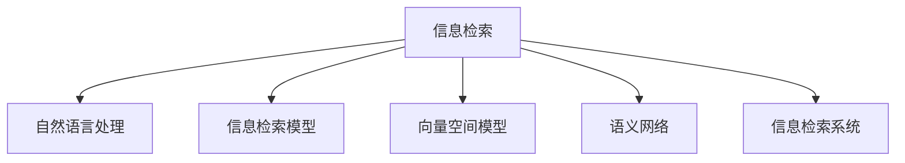

                 

## 1. 背景介绍

随着互联网技术的迅猛发展，信息量呈指数级增长。我们每天都在接触到海量的新闻、文章、视频、博客等数字内容，无论是用于个人知识积累还是学术研究，都需要从中快速、准确地筛选出有价值的信息。然而，信息的过载给信息搜索和获取带来了巨大的挑战。

### 1.1 问题由来
随着信息量的激增，传统的信息检索技术已经难以应对大量的信息流。比如，谷歌等搜索引擎虽然可以提供丰富的搜索结果，但搜索结果中往往夹杂着大量的无用信息，导致用户需要花费大量时间进行信息筛选。因此，高效的信息搜索策略与技术变得至关重要。

### 1.2 问题核心关键点
信息搜索的核心是如何在海量信息中找到需要的信息。这需要结合搜索算法、用户查询意图、数据结构等因素，才能真正做到高效搜索。以下是信息搜索的核心问题：
1. 数据处理：如何快速处理海量数据？
2. 查询优化：如何理解用户查询意图？
3. 结果排序：如何对搜索结果进行排序，使最相关的信息排在最前面？
4. 个性化搜索：如何根据用户行为和历史信息，定制化搜索结果？
5. 搜索引擎架构：如何设计搜索引擎的架构，高效处理数据和搜索请求？

这些核心问题共同构成了信息搜索技术的关键。

## 2. 核心概念与联系

### 2.1 核心概念概述

为更好地理解信息搜索的原理与技术，本节将介绍几个密切相关的核心概念：

- **信息检索**：通过计算机技术，从大量数据中快速定位与用户查询相关联的信息。常见技术包括全文检索、关键词检索、语义检索等。
- **自然语言处理**：研究如何使计算机理解和处理自然语言。
- **信息检索模型**：如BM25、Okapi模型、LATAN模型等，用于评估文档与查询的相关度，从而进行文档排序。
- **向量空间模型**：将文本表示为向量，在向量空间中进行文档相似度计算。
- **语义网络**：一种表示概念之间关系的网络结构，用于辅助自然语言处理和信息检索。
- **信息检索系统**：如搜索引擎、数据库检索系统等，涵盖数据存储、索引、查询处理等功能。

这些核心概念之间的逻辑关系可以通过以下Mermaid流程图来展示：



这个流程图展示了几大核心概念之间的关系：

1. 信息检索依赖于自然语言处理，使计算机能够理解和处理用户查询和文档。
2. 信息检索模型是信息检索的核心，用于评估文档与查询的相关性。
3. 向量空间模型是信息检索的基础，通过将文档转换为向量进行相似度计算。
4. 语义网络扩展了文档表示的方式，使语义检索成为可能。
5. 信息检索系统将上述技术整合，实现高效的检索服务。

这些概念共同构成了信息搜索技术的基础框架，帮助计算机快速定位所需的信息。

## 3. 核心算法原理 & 具体操作步骤

### 3.1 算法原理概述

信息搜索的原理是通过算法对大量数据进行快速处理和索引，并根据用户查询意图和文档内容，生成最相关的搜索结果。其核心算法包括：

- **倒排索引**：通过将文档中的每个词映射到一个或多个文档中，实现快速的文档查找。
- **TF-IDF算法**：根据词频和文档频率计算词的权重，用于评估文档与查询的相关性。
- **BM25算法**：一种改进的TF-IDF算法，适用于长文本和大规模数据集。
- **LATAN算法**：一种基于机器学习的排名算法，用于提高搜索结果的相关性。

这些算法共同构成了信息搜索的核心技术。

### 3.2 算法步骤详解

信息搜索的具体步骤可以分为以下几个关键阶段：

**Step 1: 数据预处理**
- 将原始数据进行分词、清洗、去除停用词等处理。
- 将文档转换为向量，形成倒排索引。

**Step 2: 查询处理**
- 解析用户查询，去除停用词和特殊字符。
- 将查询转换为向量形式。

**Step 3: 文档检索**
- 根据查询向量与文档向量的相似度，检索出相关文档。
- 根据文档相关性排序，生成搜索结果。

**Step 4: 结果展示**
- 对搜索结果进行页面排版，显示给用户。
- 提供多页分页和搜索结果排序等功能。

### 3.3 算法优缺点

信息搜索技术在提高信息获取效率方面具有以下优点：

- 高效处理大规模数据集。倒排索引和向量空间模型使得信息检索在短时间内处理海量数据成为可能。
- 评估查询文档的相关性。信息检索模型和TF-IDF等算法，通过计算文档与查询的相似度，帮助用户快速定位所需信息。
- 结果排序优化。LATAN等机器学习算法可以提升搜索结果的排序准确性，使得最相关的信息排在最前面。

然而，信息搜索也存在以下局限：

- 数据预处理复杂。大规模数据的预处理需要大量时间和计算资源，特别是在分词、清洗等步骤上。
- 查询优化困难。用户查询意图的多样性增加了查询处理的复杂度，需要通过复杂算法来理解。
- 结果多样性问题。不同用户对相同查询的期望可能不同，搜索结果的多样性可能导致信息的不一致性。
- 信息过载问题。即使在信息检索过程中，用户仍可能面临大量无用信息，难以快速定位到所需信息。

### 3.4 算法应用领域

信息搜索技术已经被广泛应用于各种信息获取场景中，例如：

- 搜索引擎：如谷歌、百度、必应等，通过全文检索和关键词检索，帮助用户找到所需网页。
- 数据库查询：通过SQL语句检索数据库中的数据，提供结构化数据的检索服务。
- 图书馆管理系统：通过书名、作者、关键词等检索图书，提供图书借阅和检索服务。
- 购物平台：通过商品名称、品牌、描述等检索商品，提供商品推荐和价格比较服务。
- 知识图谱：通过语义网络对概念进行连接，提供语义检索服务。

这些应用场景展示了信息搜索技术的广泛应用，几乎涵盖了所有信息获取和检索场景。

## 4. 数学模型和公式 & 详细讲解 & 举例说明

### 4.1 数学模型构建

信息检索的数学模型通常包括向量空间模型和信息检索模型。以BM25算法为例，其核心公式如下：

$$
W(t,d)=\big[(k_{1}+1)f(t,d)+k_{1}\log(\frac{|\mathcal{D}|}{df(t)})\big]\times IDF(t)
$$

其中，$W(t,d)$为词$t$在文档$d$中的权重，$f(t,d)$为词$t$在文档$d$中出现的频率，$df(t)$为包含词$t$的文档数，$|\mathcal{D}|$为文档总数，$IDF(t)$为词$t$的逆文档频率。

### 4.2 公式推导过程

BM25算法是对TF-IDF算法的一种改进，其核心在于：

1. 将TF-IDF公式中的$f(t,d)$替换为$f(t,d)=(1-b+b\times\frac{f_{q}(t)}{|\mathcal{D}|})f(t,d)$，其中$f_{q}(t)$为查询中词$t$出现的频率。
2. 引入平滑项$IDF(t)=\frac{N}{df(t)}\times(\frac{k_{1}+1}{k_{1}+df(t)})(1+\frac{k_{2}(q\times|d|)}{(k_{2}+|\mathcal{D}|)\times IDF(t_{avg})})$，其中$IDF(t_{avg})$为平均逆文档频率。

通过这些推导，BM25算法在处理长文本和大规模数据集时，能够更好地评估词的权重，提升文档的相关性排序。

### 4.3 案例分析与讲解

以谷歌的PageRank算法为例，其核心思想是通过计算网页的“重要性”，即网页被其他网页引用的次数，来评估网页的排名。PageRank公式如下：

$$
PR_i=\sum_{j}(\frac{PR_j}{C_j}\times A_{ij})
$$

其中，$PR_i$为网页$i$的PageRank值，$C_j$为网页$j$的链接数，$A_{ij}$为网页$j$到网页$i$的链接权重。

PageRank算法通过迭代计算，使得重要网页的PageRank值越来越高，从而提升其在搜索结果中的排名。

## 5. 项目实践：代码实例和详细解释说明

### 5.1 开发环境搭建

在进行信息搜索的开发实践前，我们需要准备好开发环境。以下是使用Python进行ElasticSearch开发的环境配置流程：

1. 安装ElasticSearch：从官网下载并安装ElasticSearch，安装时注意选择合适的主机配置。
2. 安装Python Elasticsearch模块：`pip install elasticsearch`
3. 安装Flask框架：`pip install flask`

完成上述步骤后，即可在Python中启动ElasticSearch服务，进行信息搜索的实践开发。

### 5.2 源代码详细实现

以下是一个使用Flask框架实现信息搜索的Python代码实现。

```python
from flask import Flask, request
from elasticsearch import Elasticsearch
from elasticsearch_dsl import Search

app = Flask(__name__)

es = Elasticsearch([{'host': 'localhost', 'port': 9200}])

@app.route('/search', methods=['GET'])
def search():
    query_string = request.args.get('q')
    if not query_string:
        return 'Please provide a search query.'

    search = Search(using=es, index='books')
    search = search.query('query_string', query=query_string)
    search = search[0:10]
    results = search.execute()

    return 'Search results: {}'.format(results)

if __name__ == '__main__':
    app.run()
```

这个代码实现了一个简单的信息搜索API，通过查询字符串，从ElasticSearch中检索出相关文档，并返回前10条结果。

### 5.3 代码解读与分析

让我们再详细解读一下关键代码的实现细节：

**Flask框架**：
- `Flask`是Python的Web框架，用于构建简单的Web应用。
- 通过Flask，我们可以轻松地构建RESTful API，支持HTTP请求和响应。

**ElasticSearch**：
- `ElasticSearch`是开源的分布式搜索和分析引擎，支持实时搜索和索引管理。
- 通过Python的ElasticSearch模块，可以轻松地在Python中实现ElasticSearch的API调用。

**查询字符串处理**：
- 在API的请求中，通过`request.args.get('q')`获取用户查询字符串。
- 如果查询字符串为空，则返回错误提示。

**信息检索**：
- 使用`elasticsearch_dsl`库中的`Search`类，构建ElasticSearch查询对象。
- 查询字符串传入`query_string`参数，用于构建查询条件。
- 通过`[0:10]`取出前10条结果，限制返回文档数量。

**结果展示**：
- 将检索到的结果格式化输出，返回给用户。

可以看到，ElasticSearch和Flask的结合使用，使得信息搜索的开发变得简洁高效。开发者可以通过少量代码实现完整的搜索功能，而不必深入研究ElasticSearch的底层实现。

当然，在工业级的系统实现中，还需要考虑更多的细节，如并发请求处理、搜索结果排序、分页展示等。但核心的信息搜索范式基本与此类似。

## 6. 实际应用场景

### 6.1 智能推荐系统

信息搜索技术在智能推荐系统中得到了广泛应用。传统的推荐系统往往只能基于用户的浏览记录和评分数据进行推荐，难以捕捉用户的深层偏好。而基于信息搜索的推荐系统，可以基于用户查询的历史记录，找到更多相关的商品或内容，从而提升推荐效果。

例如，亚马逊的推荐系统便采用了基于信息搜索的技术，通过分析用户的搜索历史，提供个性化的推荐商品。这种推荐方式能够捕捉用户的深度需求，极大地提升了用户体验。

### 6.2 内容审核系统

内容审核系统通过信息搜索技术，自动审核和过滤掉不健康、不当的内容。在搜索引擎的算法中，通过将含有敏感词汇的文档排除在搜索结果之外，从而实现内容过滤的功能。

例如，百度便采用了基于关键词过滤的审核系统，自动过滤掉含有违法和不当词汇的网页。这种技术不仅提高了审核效率，还提升了搜索结果的正面性。

### 6.3 知识图谱构建

信息搜索技术在知识图谱构建中也有广泛应用。知识图谱通过语义网络将不同概念进行连接，用于辅助自然语言处理和信息检索。

例如，百度百科采用了基于信息搜索的语义网络构建技术，通过自动提取网页中的实体关系，构建知识图谱，提供知识查询和检索服务。这种技术大大提升了知识的检索效率和准确性，使得用户能够更便捷地获取所需知识。

### 6.4 未来应用展望

随着信息搜索技术的不断发展，未来将在更多领域得到应用，为人类认知智能的进化带来深远影响。

在智慧城市治理中，信息搜索技术将广泛应用于城市事件监测、舆情分析、应急指挥等环节，提高城市管理的自动化和智能化水平，构建更安全、高效的未来城市。

在智能医疗领域，基于信息搜索的医疗问答、病历分析、药物研发等应用将提升医疗服务的智能化水平，辅助医生诊疗，加速新药开发进程。

在智能教育领域，信息搜索技术可应用于作业批改、学情分析、知识推荐等方面，因材施教，促进教育公平，提高教学质量。

此外，在企业生产、社会治理、文娱传媒等众多领域，基于信息搜索的人工智能应用也将不断涌现，为经济社会发展注入新的动力。

## 7. 工具和资源推荐

### 7.1 学习资源推荐

为了帮助开发者系统掌握信息搜索的理论基础和实践技巧，这里推荐一些优质的学习资源：

1. 《信息检索：原理与实践》系列博文：由信息搜索专家撰写，深入浅出地介绍了信息检索原理、主要算法和应用实例。
2. CS244《信息检索与文档管理》课程：斯坦福大学开设的信息检索课程，涵盖信息检索的基础理论和主要算法，适合深入学习。
3. 《Information Retrieval: An Introduction》书籍：信息检索领域的经典教材，系统介绍了信息检索的基本概念和主要算法。
4. SIGIR官方文档：信息检索领域顶级会议ACM SIGIR的官方文档，包含大量前沿研究和技术资源。
5. ArXiv.org：信息检索领域的主要预印本库，涵盖大量最新的学术研究成果和技术进展。

通过对这些资源的学习实践，相信你一定能够快速掌握信息搜索的精髓，并用于解决实际的检索问题。

### 7.2 开发工具推荐

高效的信息搜索开发离不开优秀的工具支持。以下是几款常用的开发工具：

1. Elasticsearch：开源的分布式搜索和分析引擎，支持实时搜索和索引管理。
2. Apache Solr：Apache基金会下的搜索服务器，支持各种搜索引擎功能。
3. Apache Lucene：Lucene是ElasticSearch和Solr的底层实现，支持基本的全文检索功能。
4. Google Custom Search Engine：谷歌提供的自定义搜索引擎服务，支持个性化搜索。
5. Scrapy：Python的开源爬虫框架，用于抓取网页和数据。
6. Selenium：Python的开源自动化测试框架，支持网页自动化操作。

合理利用这些工具，可以显著提升信息搜索的开发效率，加快创新迭代的步伐。

### 7.3 相关论文推荐

信息搜索技术的发展离不开学界的持续研究。以下是几篇奠基性的相关论文，推荐阅读：

1. Jaccard系数：一种基于文档相似度的信息检索方法，广泛应用于文本检索中。
2. Okapi BM25算法：一种改进的TF-IDF算法，适用于长文本和大规模数据集。
3. LATAN算法：一种基于机器学习的排名算法，用于提高搜索结果的相关性。
4. TF-IDF算法：一种基于词频和文档频率的权重计算方法，广泛应用于文本检索中。
5. PageRank算法：一种基于网页链接权重的排名算法，广泛应用于搜索引擎中。

这些论文代表了大信息搜索技术的发展脉络。通过学习这些前沿成果，可以帮助研究者把握学科前进方向，激发更多的创新灵感。

## 8. 总结：未来发展趋势与挑战

### 8.1 总结

本文对信息搜索的原理与技术进行了全面系统的介绍。首先阐述了信息过载的问题，明确了信息搜索在信息获取中的重要性。其次，从原理到实践，详细讲解了信息检索的数学模型和关键步骤，给出了信息搜索任务开发的完整代码实例。同时，本文还广泛探讨了信息搜索技术在智能推荐、内容审核、知识图谱构建等多个行业领域的应用前景，展示了信息搜索技术的广泛应用。

通过本文的系统梳理，可以看到，信息搜索技术正在成为信息获取领域的重要范式，极大地提高了信息检索的效率和准确性，为信息获取和知识管理带来了革命性变化。未来，伴随信息搜索技术的持续演进，相信人工智能技术将在更广阔的领域中大放异彩，深刻影响人类的生产生活方式。

### 8.2 未来发展趋势

展望未来，信息搜索技术将呈现以下几个发展趋势：

1. 搜索算法的多样化。除了传统的TF-IDF、BM25等算法，未来将涌现更多高效的检索算法，如基于深度学习的检索方法，能够更好地处理语义丰富、结构复杂的文本。
2. 实时搜索和流计算。随着数据量的激增，实时搜索和流计算技术将越来越重要，支持快速响应搜索请求，实现动态更新搜索结果。
3. 跨模态检索。将文本、图像、视频等多模态数据进行融合，提供更全面、准确的检索服务。
4. 个性化搜索。通过分析用户行为和历史数据，定制化搜索结果，提供更加个性化的搜索体验。
5. 语义搜索。结合知识图谱、语义网络等技术，进行更深入的语义理解，提升搜索结果的相关性。
6. 智能搜索。通过引入自然语言处理、机器学习等技术，提升搜索算法智能化水平，提升搜索结果的准确性和相关性。

这些趋势将引领信息搜索技术迈向更高的台阶，为构建智能搜索系统提供新的思路和方法。

### 8.3 面临的挑战

尽管信息搜索技术已经取得了瞩目成就，但在迈向更加智能化、普适化应用的过程中，它仍面临诸多挑战：

1. 数据预处理复杂。大规模数据的预处理需要大量时间和计算资源，特别是在分词、清洗等步骤上。
2. 查询优化困难。用户查询意图的多样性增加了查询处理的复杂度，需要通过复杂算法来理解。
3. 结果多样性问题。不同用户对相同查询的期望可能不同，搜索结果的多样性可能导致信息的不一致性。
4. 信息过载问题。即使在信息检索过程中，用户仍可能面临大量无用信息，难以快速定位到所需信息。
5. 系统扩展性问题。随着数据量的增加，系统需要具备良好的扩展性，避免单点故障和性能瓶颈。
6. 系统安全性问题。信息搜索系统需要具备良好的安全性，防止数据泄露和恶意攻击。

这些挑战亟待解决，需要在技术、工程、业务等多个维度进行全面优化，才能真正实现高效、可靠、安全的信息搜索服务。

### 8.4 研究展望

未来的信息搜索研究需要在以下几个方面寻求新的突破：

1. 探索更高效的算法。引入深度学习、图神经网络等技术，设计更高效的搜索算法，提升搜索速度和准确性。
2. 引入语义信息。结合知识图谱、语义网络等技术，提升搜索结果的相关性，进行更深入的语义理解。
3. 引入多模态数据。将文本、图像、视频等多模态数据进行融合，提供更全面、准确的检索服务。
4. 引入机器学习。通过机器学习算法，提升搜索结果的相关性和排序准确性。
5. 引入个性化算法。通过分析用户行为和历史数据，定制化搜索结果，提供更加个性化的搜索体验。

这些研究方向的探索，必将引领信息搜索技术迈向更高的台阶，为构建智能搜索系统提供新的思路和方法。只有勇于创新、敢于突破，才能不断拓展信息搜索的边界，让信息获取更加高效便捷。

## 9. 附录：常见问题与解答

**Q1：如何优化搜索结果的相关性？**

A: 优化搜索结果的相关性需要结合多种技术，如TF-IDF、BM25、LATAN等算法，以及个性化推荐算法。具体方法包括：
1. 引入TF-IDF算法，通过计算词频和逆文档频率，提升文档的相关性权重。
2. 引入BM25算法，通过平滑项和查询频率等参数，提升查询文档的相关性。
3. 引入LATAN算法，通过机器学习算法，提升搜索结果的排序准确性。
4. 引入个性化推荐算法，通过分析用户行为和历史数据，提供更加个性化的搜索结果。

**Q2：如何提高信息搜索系统的性能？**

A: 提高信息搜索系统的性能需要综合考虑数据预处理、查询处理、结果排序等多个环节。具体方法包括：
1. 优化数据预处理流程，提高数据处理的效率和准确性。
2. 优化查询处理算法，准确理解用户查询意图，提高查询处理的效率和准确性。
3. 优化结果排序算法，提升搜索结果的相关性和排序准确性。
4. 引入并行处理技术，提高系统的并发处理能力，提升响应速度。
5. 引入缓存技术，提高数据访问速度，减少系统延迟。
6. 引入索引优化技术，提高数据的查询速度和效率。

**Q3：如何在信息搜索系统中实现个性化推荐？**

A: 实现个性化推荐需要在信息搜索系统中引入推荐算法，并结合用户行为和历史数据。具体方法包括：
1. 收集用户行为数据，包括查询历史、点击行为、评分数据等。
2. 基于用户行为数据，构建用户画像，了解用户兴趣和偏好。
3. 结合用户画像，在信息检索中引入推荐算法，提供个性化的搜索结果。
4. 引入协同过滤、基于内容的推荐算法，提升推荐效果。
5. 引入推荐系统评估指标，如精度、召回率等，评估推荐效果。

这些方法可以帮助信息搜索系统更好地理解用户需求，提供更加个性化的搜索结果。

---

作者：禅与计算机程序设计艺术 / Zen and the Art of Computer Programming

