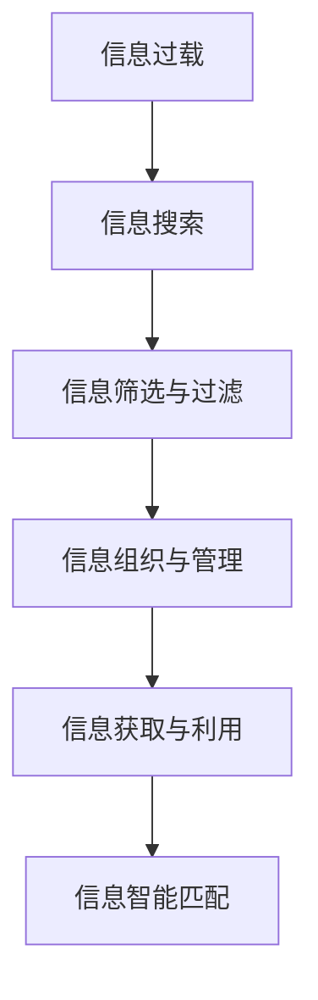

                 

# 信息过载与信息搜索策略与技术：在庞大的信息海洋中找到所需信息

## 1. 背景介绍

随着互联网的发展，信息爆炸成为一个不可避免的趋势。全球范围内，每年生成的信息量呈指数级增长，这使得我们面对的信息量前所未有地庞大。在这样的背景下，信息搜索的重要性日益凸显。无论是在学术研究、商业决策还是日常学习中，准确、高效地搜索并获取所需信息，都是一项基本但至关重要的技能。

### 1.1 信息过载的定义

信息过载（Information Overload）是指在一个固定的时间内，一个人接收到的信息超过其处理能力的现象。这种过载不仅限于信息量的增加，更重要的是，信息的真实性、相关性以及有用性难以被有效区分。面对海量的信息，如何从中筛选出真正有价值的知识，成为摆在面前的重大挑战。

### 1.2 问题由来

1. **信息量的激增**：互联网和社交媒体的发展使得信息产生和传播的速度大大加快，信息量急剧增加。
2. **信息质量参差不齐**：信息来源多样化，信息质量参差不齐，假信息、误导性信息泛滥。
3. **信息散乱分布**：信息分布在多个平台和媒体，缺乏统一的组织和管理。
4. **信息获取门槛低**：几乎任何人都可以轻松地发布信息，导致信息过载现象加剧。

### 1.3 问题核心关键点

1. **信息筛选与过滤**：在海量信息中，如何准确地筛选出有用的信息。
2. **信息组织与管理**：如何将信息组织成一个有序、可搜索的知识体系。
3. **信息获取与利用**：如何高效地获取信息，并将其转化为知识或行动。
4. **信息智能匹配**：如何实现个性化、智能化的信息推荐和搜索。

## 2. 核心概念与联系

### 2.1 核心概念概述

- **信息过载**：在一个固定的时间内，一个人接收到的信息超过其处理能力的现象。
- **信息搜索**：通过一定的策略和技术手段，在信息海洋中寻找并获取所需信息的过程。
- **信息筛选与过滤**：从海量信息中去除无关、重复、低质量的信息，保留有用、高质量的内容。
- **信息组织与管理**：将信息进行分类、整理、存储，形成有序的知识体系。
- **信息获取与利用**：通过搜索引擎、阅读器等工具，高效地获取所需信息，并将其转化为知识或行动。
- **信息智能匹配**：利用人工智能技术，实现个性化、智能化的信息推荐和搜索。

这些核心概念之间相互关联，共同构成了信息搜索与管理的整体框架。

### 2.2 核心概念原理和架构的 Mermaid 流程图



这个流程图展示了信息过载到最终获取和利用信息的过程。

## 3. 核心算法原理 & 具体操作步骤

### 3.1 算法原理概述

信息搜索与检索的核心算法是倒排索引（Inverted Index）。倒排索引是一种用于快速检索文本信息的数据结构，它将文档中的每个词都映射到一个包含该词出现的文档列表。这种结构使得检索时间复杂度大大降低，从传统的线性时间复杂度降低到对数级别。

### 3.2 算法步骤详解

1. **构建倒排索引**：对文本进行分词、去停用词、词干提取等预处理，然后建立倒排索引表。
2. **匹配查询词**：将用户输入的查询词与倒排索引表中的词进行匹配，获取所有包含该词的文档列表。
3. **相关性排序**：根据文档与查询词的相关性，对文档进行排序，通常使用TF-IDF（词频-逆文档频率）算法。
4. **返回搜索结果**：将排序后的文档列表返回给用户，用户进一步浏览和选择。

### 3.3 算法优缺点

**优点**：
- **高效检索**：倒排索引显著降低了检索时间复杂度。
- **准确性高**：通过TF-IDF等算法，提高了相关性排序的准确性。
- **可扩展性好**：倒排索引结构适用于大规模数据集。

**缺点**：
- **处理复杂**：构建倒排索引需要较复杂的预处理和索引构建过程。
- **内存占用大**：索引文件占用的内存空间较大，不适用于内存有限的设备。
- **更新困难**：对索引的更新操作较为复杂，需保证索引的一致性。

### 3.4 算法应用领域

1. **搜索引擎**：如Google、百度等搜索引擎，广泛应用倒排索引算法进行搜索。
2. **数据库查询**：如MySQL、PostgreSQL等关系型数据库，可以使用倒排索引提高查询效率。
3. **文本挖掘**：如文本分类、聚类、实体识别等任务，倒排索引是重要的基础工具。
4. **推荐系统**：如Amazon、Netflix等在线平台，通过倒排索引实现个性化推荐。

## 4. 数学模型和公式 & 详细讲解

### 4.1 数学模型构建

倒排索引的数学模型可以表示为：
$$
I = \{ (w, \{d_1, d_2, ..., d_n\}) \}
$$
其中，$w$ 是查询词，$d_1, d_2, ..., d_n$ 是与 $w$ 相关的文档列表。

### 4.2 公式推导过程

以Google搜索为例，其倒排索引的构建过程包括：
1. **分词与预处理**：对文本进行分词、去停用词、词干提取等预处理操作。
2. **建立索引表**：对每个词建立索引表，记录其在不同文档中的出现位置和频率。
3. **生成倒排索引**：将文档与索引表中的词进行关联，形成倒排索引。

### 4.3 案例分析与讲解

以搜索“人工智能”相关的信息为例：
1. **分词与预处理**：将“人工智能”分解为“人工”和“智能”两个词，并进行词干提取和去停用词。
2. **建立索引表**：对“人工”和“智能”分别建立索引表，记录其在不同文档中的出现位置和频率。
3. **生成倒排索引**：将包含“人工”和“智能”的文档与索引表关联，生成倒排索引。
4. **匹配查询词**：当用户输入“人工智能”时，将查询词与倒排索引表中的词进行匹配。
5. **相关性排序**：根据TF-IDF算法，计算文档与查询词的相关性得分，对文档进行排序。
6. **返回搜索结果**：将排序后的文档列表返回给用户，用户进一步浏览和选择。

## 5. 项目实践：代码实例和详细解释说明

### 5.1 开发环境搭建

在进行信息搜索项目开发时，需要搭建好开发环境。以下是使用Python进行信息搜索开发的开发环境配置流程：

1. 安装Anaconda：从官网下载并安装Anaconda，用于创建独立的Python环境。
2. 创建并激活虚拟环境：
```bash
conda create -n info-search-env python=3.8 
conda activate info-search-env
```
3. 安装必要的Python包：
```bash
pip install pandas numpy scikit-learn nltk gensim whoosh
```

完成上述步骤后，即可在`info-search-env`环境中开始信息搜索项目开发。

### 5.2 源代码详细实现

以下是一个基于Python和Whoosh库的信息搜索系统实现，用于演示搜索引擎的构建过程。

首先，我们需要安装并配置Whoosh库，Whoosh是一个纯Python的全文搜索库，可以用于构建高效的搜索引擎。

```bash
pip install whoosh
```

然后，我们定义一个简单的文本分词器和索引器：

```python
from whoosh.fields import Schema, TEXT, ID
from whoosh.index import create_in
from whoosh.qparser import QueryParser
from whoosh import writing

# 定义文本字段
schema = Schema(text=TEXT(stored=True), id=ID(stored=True))

# 创建索引目录
index_dir = 'indexdir'
if not index_dir:
    index_dir = whoosh.index.create_in(index_dir, schema)

# 创建文档索引器
writer = index_dir.writer()
writer.map_open = open
writer.append = writer.add_document

# 添加文档
writer.add_document(id=u'001', text=u'这是一篇测试文档。')
writer.add_document(id=u'002', text=u'这是另一篇测试文档。')
writer.commit()
```

接下来，我们可以查询文档：

```python
# 打开索引
index = whoosh.index.open_dir(index_dir)

# 查询文档
with index.searcher(weighting=whoosh scoring.TF_IDF()) as searcher:
    results = searcher.search(QueryParser('text', index.schema).parse(u'测试'))
    for result in results:
        print(result['id'], result['text'])
```

以上是使用Whoosh库构建简单搜索引擎的基本流程。

### 5.3 代码解读与分析

**Whoosh库**：
- **Schema**：定义索引的结构，包括文本字段和文档ID字段。
- **index**：创建索引对象，用于管理文档和搜索。
- **QueryParser**：解析查询语句，将其转化为查询对象。
- **searcher**：打开索引，进行搜索操作。

**代码实现**：
1. **创建索引和文档**：使用`create_in`方法创建索引目录，使用`writer`方法添加文档。
2. **查询文档**：使用`searcher`方法打开索引，使用`search`方法执行查询操作。
3. **输出结果**：遍历搜索结果，输出文档ID和文本内容。

## 6. 实际应用场景

### 6.1 搜索引擎

搜索引擎是信息搜索与检索的经典应用场景。Google、Bing、百度等主流搜索引擎广泛采用倒排索引算法，支持复杂的查询语句和个性化的搜索推荐。

### 6.2 数据库查询

关系型数据库如MySQL、PostgreSQL等也广泛应用倒排索引技术。通过建立倒排索引，数据库可以快速响应查询，提高查询效率。

### 6.3 文本挖掘

文本挖掘是信息搜索与检索的重要应用领域，包括文本分类、聚类、实体识别等任务。通过构建倒排索引，可以快速检索文本中的关键词和短语。

### 6.4 推荐系统

推荐系统如Amazon、Netflix等，通过构建用户和物品的倒排索引，实现个性化推荐。通过查询用户兴趣和物品特征，推荐系统能够提供精准的推荐结果。

## 7. 工具和资源推荐

### 7.1 学习资源推荐

为了帮助开发者系统掌握信息搜索与检索的理论基础和实践技巧，这里推荐一些优质的学习资源：

1. **《搜索引擎设计与实现》**：由Jeff Dean等大牛所著，介绍了搜索引擎的基本原理和实际应用。
2. **《Python全文搜索与检索》**：由Whoosh官方文档，详细介绍了Whoosh库的使用方法和API。
3. **《信息检索与信息检索系统》**：由G. Salton等专家所著，系统讲解了信息检索的理论与技术。
4. **《自然语言处理与信息检索》**：由Daniel Jurafsky和James H. Martin所著，讲解了NLP技术在信息检索中的应用。

通过对这些资源的学习实践，相信你一定能够快速掌握信息搜索与检索的精髓，并用于解决实际的信息搜索问题。

### 7.2 开发工具推荐

高效的开发离不开优秀的工具支持。以下是几款用于信息搜索开发的常用工具：

1. **Whoosh**：纯Python的全文搜索库，支持高效的文档索引和搜索。
2. **Elasticsearch**：基于Lucene的分布式搜索引擎，支持大规模数据集和高并发查询。
3. **Solr**：Apache基金会推出的开源搜索引擎，支持RESTful API和多种数据源。
4. **Apache Spark**：大数据处理引擎，支持分布式搜索和索引构建。
5. **Django-Whoosh**：基于Django框架的搜索引擎，提供了便捷的文档管理和搜索接口。

合理利用这些工具，可以显著提升信息搜索的开发效率，加快创新迭代的步伐。

### 7.3 相关论文推荐

信息搜索与检索的发展源于学界的持续研究。以下是几篇奠基性的相关论文，推荐阅读：

1. **《倒排索引技术》**：由G. Salton等专家所著，介绍了倒排索引的基本原理和应用场景。
2. **《搜索引擎的核心技术》**：由David B. McIlroy所著，讲解了搜索引擎的核心算法和技术。
3. **《基于TF-IDF的信息检索》**：由J. Zhang等专家所著，介绍了TF-IDF算法在信息检索中的应用。
4. **《基于NoSQL的数据库索引技术》**：由M. Pan等专家所著，讲解了NoSQL数据库的索引技术和应用。

这些论文代表了大数据索引技术的发展脉络。通过学习这些前沿成果，可以帮助研究者把握学科前进方向，激发更多的创新灵感。

## 8. 总结：未来发展趋势与挑战

### 8.1 总结

本文对信息搜索与检索方法进行了全面系统的介绍。首先阐述了信息过载的定义和问题由来，明确了信息搜索的重要性。其次，从原理到实践，详细讲解了倒排索引算法的基本流程和实现细节，给出了信息搜索系统开发的完整代码实例。同时，本文还广泛探讨了信息搜索方法在搜索引擎、数据库查询、文本挖掘、推荐系统等多个领域的应用前景，展示了信息搜索与检索的广泛价值。

通过本文的系统梳理，可以看到，信息搜索与检索技术在信息获取和应用中扮演着至关重要的角色。倒排索引算法的高效检索和准确性，使得其在搜索引擎、数据库、文本挖掘等领域得到了广泛应用。未来，伴随信息量的进一步增长和技术的不断进步，信息搜索技术必将在更广阔的应用领域中发挥重要作用，深刻影响人类的信息获取和知识构建。

### 8.2 未来发展趋势

展望未来，信息搜索与检索技术将呈现以下几个发展趋势：

1. **个性化搜索**：利用深度学习等技术，实现更加智能化的搜索结果排序和推荐。
2. **跨媒体搜索**：将文本、图片、视频等多模态信息进行统一搜索，提高信息获取的全面性和准确性。
3. **实时搜索**：利用流处理和大数据技术，实现实时搜索和查询，满足用户即时信息需求。
4. **分布式搜索**：通过分布式索引和计算，实现大规模数据集的高效搜索和处理。
5. **语义搜索**：利用自然语言处理技术，实现基于语义的智能搜索，提高搜索结果的相关性和可理解性。
6. **隐私保护**：在搜索过程中，保护用户隐私和数据安全，确保数据使用的合规性和道德性。

以上趋势凸显了信息搜索与检索技术的广阔前景。这些方向的探索发展，必将进一步提升信息搜索的准确性和智能化，为信息获取和知识构建提供更强的支撑。

### 8.3 面临的挑战

尽管信息搜索与检索技术已经取得了显著成果，但在迈向更加智能化、普适化应用的过程中，仍面临诸多挑战：

1. **数据量和质量**：随着信息量的增长，如何保证数据的准确性和高质量，是一个重要的问题。
2. **计算资源**：大规模数据的搜索和索引构建需要强大的计算资源，如何高效利用计算资源，是一个技术挑战。
3. **技术复杂性**：信息搜索与检索技术涉及多个领域，包括自然语言处理、数据库管理、分布式计算等，技术复杂性较高。
4. **隐私保护**：如何在保证搜索结果质量的同时，保护用户隐私和数据安全，是一个重要的道德和法律问题。

### 8.4 未来突破

面对信息搜索与检索技术所面临的挑战，未来的研究需要在以下几个方面寻求新的突破：

1. **深度学习应用**：利用深度学习技术，实现更加智能化的搜索结果排序和推荐，提高搜索的个性化和相关性。
2. **多模态融合**：将文本、图片、视频等多模态信息进行统一搜索，提高信息获取的全面性和准确性。
3. **实时处理**：利用流处理和大数据技术，实现实时搜索和查询，满足用户即时信息需求。
4. **分布式架构**：通过分布式索引和计算，实现大规模数据集的高效搜索和处理，提高搜索效率和稳定性。
5. **语义搜索**：利用自然语言处理技术，实现基于语义的智能搜索，提高搜索结果的相关性和可理解性。
6. **隐私保护技术**：利用隐私保护技术，保护用户隐私和数据安全，确保数据使用的合规性和道德性。

这些研究方向的探索，必将引领信息搜索与检索技术迈向更高的台阶，为信息获取和知识构建提供更强的支撑。面向未来，信息搜索与检索技术还需要与其他人工智能技术进行更深入的融合，如知识表示、因果推理、强化学习等，多路径协同发力，共同推动自然语言理解和智能交互系统的进步。只有勇于创新、敢于突破，才能不断拓展信息搜索的边界，让信息搜索技术更好地服务于人类社会。

## 9. 附录：常见问题与解答

**Q1: 什么是倒排索引？**

A: 倒排索引是一种用于快速检索文本信息的数据结构，它将文档中的每个词都映射到一个包含该词出现的文档列表。这种结构使得检索时间复杂度大大降低，从传统的线性时间复杂度降低到对数级别。

**Q2: 信息搜索与检索的核心算法是什么？**

A: 信息搜索与检索的核心算法是倒排索引。倒排索引将文档中的每个词都映射到一个包含该词出现的文档列表，使得检索时间复杂度大大降低，从传统的线性时间复杂度降低到对数级别。

**Q3: 信息搜索与检索的应用场景有哪些？**

A: 信息搜索与检索在搜索引擎、数据库查询、文本挖掘、推荐系统等多个领域得到了广泛应用。搜索引擎如Google、Bing、百度等，广泛采用倒排索引算法进行搜索。数据库如MySQL、PostgreSQL等，也广泛应用倒排索引技术。文本挖掘任务如文本分类、聚类、实体识别等，倒排索引是重要的基础工具。推荐系统如Amazon、Netflix等，通过倒排索引实现个性化推荐。

**Q4: 信息搜索与检索的技术难点有哪些？**

A: 信息搜索与检索面临的技术难点包括：
1. 数据量和质量：随着信息量的增长，如何保证数据的准确性和高质量，是一个重要的问题。
2. 计算资源：大规模数据的搜索和索引构建需要强大的计算资源，如何高效利用计算资源，是一个技术挑战。
3. 技术复杂性：信息搜索与检索技术涉及多个领域，包括自然语言处理、数据库管理、分布式计算等，技术复杂性较高。
4. 隐私保护：如何在保证搜索结果质量的同时，保护用户隐私和数据安全，是一个重要的道德和法律问题。

**Q5: 信息搜索与检索的未来发展趋势有哪些？**

A: 信息搜索与检索的未来发展趋势包括：
1. 个性化搜索：利用深度学习等技术，实现更加智能化的搜索结果排序和推荐。
2. 跨媒体搜索：将文本、图片、视频等多模态信息进行统一搜索，提高信息获取的全面性和准确性。
3. 实时搜索：利用流处理和大数据技术，实现实时搜索和查询，满足用户即时信息需求。
4. 分布式搜索：通过分布式索引和计算，实现大规模数据集的高效搜索和处理。
5. 语义搜索：利用自然语言处理技术，实现基于语义的智能搜索，提高搜索结果的相关性和可理解性。
6. 隐私保护技术：利用隐私保护技术，保护用户隐私和数据安全，确保数据使用的合规性和道德性。

这些发展趋势凸显了信息搜索与检索技术的广阔前景，将进一步提升信息获取和知识构建的智能化和高效化。

---

作者：禅与计算机程序设计艺术 / Zen and the Art of Computer Programming

