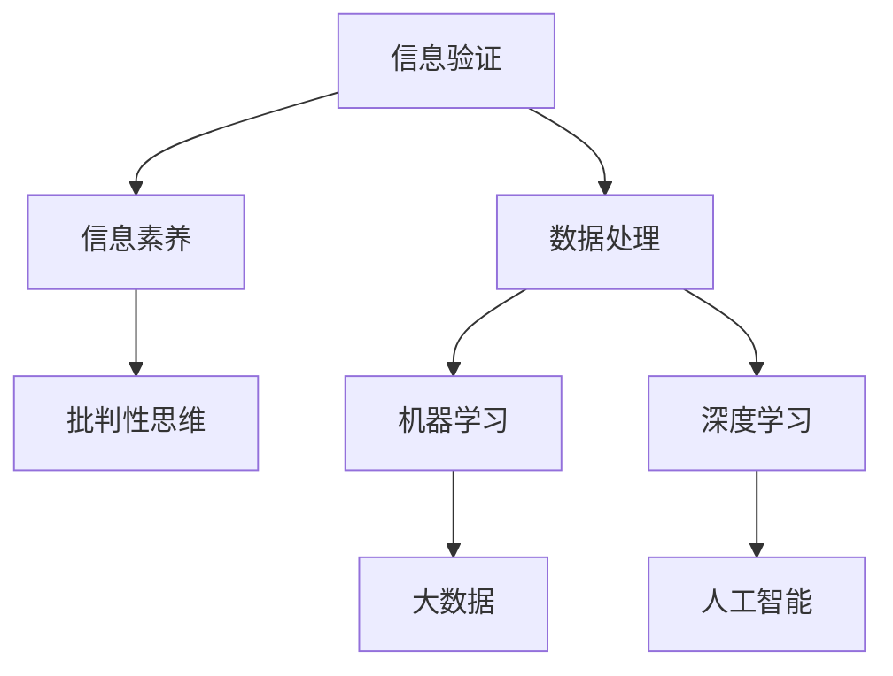

                 

# 信息验证和信息素养能力：为数字时代培养批判性思维和信息素养能力

> 关键词：信息验证, 信息素养, 批判性思维, 数据处理, 机器学习, 深度学习, 大数据, 人工智能

## 1. 背景介绍

### 1.1 问题由来
随着信息技术的飞速发展，互联网已成为人们获取信息、交流思想、进行决策的重要平台。然而，由于信息量巨大、真伪难辨，人们容易受到虚假信息、误导性内容的干扰，导致认知偏差、判断失误。因此，如何培养和提升信息验证与信息素养能力，成为数字时代的关键课题。

### 1.2 问题核心关键点
信息验证和信息素养能力，是指个体在面对海量信息时，能够通过系统化的知识、方法与工具，辨别信息的真伪，并有效筛选、整合、应用信息，从而做出准确、科学、合理决策的能力。这一能力在当前信息爆炸时代显得尤为关键。

### 1.3 问题研究意义
1. 保障信息安全：信息素养能力的提升，有助于提高个体对网络信息的识别和抵御能力，有效防范虚假信息、网络攻击，保护个人隐私和信息安全。
2. 增强决策质量：通过提高信息验证能力，个体能够更准确地理解和利用信息，提升决策的科学性和可靠性。
3. 促进知识创新：信息素养能力有助于个体高效整合和应用各类知识资源，激发创新思维，推动知识传播与创新发展。
4. 适应数字时代：面对大数据、人工智能等技术变革，信息素养能力是实现数字时代知识社会化的重要基础。
5. 促进社会和谐：信息素养能力有助于培养公众的理性思考与批判性思维，提升社会舆论的健康性与理性，构建和谐社会。

## 2. 核心概念与联系

### 2.1 核心概念概述

为更好地理解信息验证与信息素养能力的培养方法，本节将介绍几个密切相关的核心概念：

- 信息验证(Information Verification)：指个体对获取的信息进行真实性、准确性、完整性的检查和评估过程，以确保信息真实可靠。
- 信息素养(Information Literacy)：指个体在信息搜集、分析、应用等方面的综合能力，包括信息意识、信息知识、信息技能和信息伦理等。
- 批判性思维(Critical Thinking)：指个体对信息进行深度分析和理性判断的能力，涉及逻辑推理、证据评估、观点辩驳等。
- 数据处理(Data Processing)：指对原始数据进行清洗、转换、整合、分析等操作，以生成可用信息的过程。
- 机器学习(Machine Learning)：指通过数据训练模型，使其能够自主学习、优化和预测新数据的能力。
- 深度学习(Deep Learning)：指通过多层神经网络结构对数据进行复杂特征提取和深层次分析的能力。
- 大数据(Big Data)：指通过收集、存储、分析海量数据，从中提取有价值信息的过程。
- 人工智能(Artificial Intelligence)：指通过算法和模型，模拟人类智能，实现复杂问题解决和信息处理的能力。

这些核心概念之间的逻辑关系可以通过以下Mermaid流程图来展示：



这个流程图展示了几组概念之间的关联关系：

1. 信息验证是信息素养能力的基础，保障信息的真实可靠。
2. 信息素养能力涵盖了信息意识、知识、技能和伦理等方面，支持批判性思维。
3. 批判性思维是信息素养能力中的核心，涉及逻辑推理和证据评估。
4. 数据处理、机器学习和深度学习等技术是信息验证和素养能力的重要工具。
5. 大数据和人工智能技术在信息处理和验证中起到关键作用。

## 3. 核心算法原理 & 具体操作步骤
### 3.1 算法原理概述

信息验证与信息素养能力的培养，本质上是一个多层次、多维度的复杂过程。其核心在于通过系统化的知识、技术和工具，提高个体对信息的甄别与利用能力。这一过程可以概括为以下几个步骤：

1. **信息获取**：通过搜索引擎、专业数据库等途径获取相关主题的信息。
2. **信息预处理**：对获取的信息进行文本清洗、分词、去重等预处理操作。
3. **信息验证**：通过比对多个来源、分析信息逻辑一致性、使用元数据等方法验证信息真伪。
4. **信息整合**：通过归纳总结、分类组织、数据可视化等方法整合信息，形成结构化的知识体系。
5. **信息应用**：将整合后的信息应用于决策分析、问题解决等实际场景中。

### 3.2 算法步骤详解

以下是一个基于机器学习的信息验证与信息素养能力培养的具体步骤详解：

**Step 1: 信息获取与预处理**
- 使用爬虫技术或第三方数据接口获取与主题相关的网页和数据集。
- 对获取的文本进行预处理，包括去除停用词、标点符号，分词、去除噪声等。

**Step 2: 信息验证**
- 设计信息验证模型，如自然语言处理(NLP)中的语义分析、知识图谱等。
- 通过多来源信息比对、异常检测、关键词提取等技术，识别和标记可能的虚假信息。
- 使用机器学习模型对标注信息进行训练，提高验证模型的准确性。

**Step 3: 信息整合**
- 采用数据仓库或分布式存储系统，存储验证后的信息数据。
- 通过数据清洗、归档、分类等操作，形成结构化的信息库。
- 使用数据可视化工具，如Tableau、Power BI等，生成图表、报表等展示信息结构。

**Step 4: 信息应用**
- 根据实际需求，设计应用场景，如决策支持、问题解答等。
- 通过API接口或数据挖掘技术，从信息库中提取所需信息。
- 结合业务逻辑，构建信息应用系统，进行决策分析和问题解决。

### 3.3 算法优缺点

信息验证与信息素养能力的培养方法，具有以下优点：

1. 系统化：通过系统化的知识和工具，提高信息处理的效率和准确性。
2. 自动化：使用机器学习、深度学习等技术，自动化信息验证与整合过程。
3. 客观性：基于数据和算法，减少主观判断带来的偏差。
4. 可扩展性：算法和技术可以应用于不同领域和场景，具有广泛的应用前景。
5. 持续性：通过模型训练和优化，不断提升信息验证与素养能力。

同时，该方法也存在一定的局限性：

1. 数据依赖性：依赖于高质量的数据集和标注样本，数据获取和预处理成本较高。
2. 模型复杂性：需要使用复杂的机器学习模型，对技术要求较高。
3. 多模态处理：不同类型的数据（如文本、图像、视频）需要不同的验证和整合方法，技术难度大。
4. 结果可解释性：机器学习模型往往呈现"黑箱"特性，难以解释其内部决策过程。
5. 伦理和安全：信息验证和素养能力的培养，涉及数据隐私、伦理安全等复杂问题，需谨慎处理。

尽管存在这些局限性，但就目前而言，基于机器学习的信息验证与信息素养能力培养方法，仍是当前研究和应用的主流范式。未来相关研究将继续在降低数据依赖、提升模型可解释性、处理多模态数据等方面寻求突破。

### 3.4 算法应用领域

基于机器学习的信息验证与信息素养能力培养方法，已在多个领域得到应用：

- 新闻媒体：用于新闻事实验证、信息可信度评估等。
- 金融领域：用于投资分析、风险评估、欺诈检测等。
- 医学健康：用于病历分析、药物研发、医疗知识库构建等。
- 教育培训：用于智能辅助教学、知识图谱构建等。
- 法律应用：用于法律文档解析、法律知识图谱构建等。
- 公共管理：用于社会舆情分析、公共安全预警等。

这些应用场景展示了信息验证与信息素养能力培养方法的广泛应用前景。随着技术的不断进步，这些方法将进一步拓展到更多领域，提升各行各业的信息处理与决策能力。

## 4. 数学模型和公式 & 详细讲解  
### 4.1 数学模型构建

以下将使用数学语言对信息验证与信息素养能力的培养方法进行更加严格的刻画。

记待验证的信息集为 $D=\{d_1, d_2, ..., d_N\}$，其中 $d_i$ 表示第 $i$ 条信息。

信息验证模型的目标是最小化错误分类概率 $P(e)$，即：

$$
P(e) = \min_{\theta} \sum_{i=1}^N P(e|d_i, \theta)
$$

其中 $\theta$ 为模型的参数，$P(e|d_i, \theta)$ 表示在给定信息 $d_i$ 和模型参数 $\theta$ 的情况下，错误分类（即虚假信息）的概率。

信息验证模型通常基于分类算法，如逻辑回归、支持向量机、随机森林等，构建分类器 $f(d_i; \theta)$。其中 $\theta$ 为模型参数，$P(e|d_i, \theta) = P(f(d_i; \theta) \neq true(d_i))$，即分类器输出错误分类的概率。

### 4.2 公式推导过程

以下推导逻辑回归模型在信息验证中的应用。

假设信息集 $D$ 中，每条信息 $d_i$ 属于类别 $y_i \in \{true, false\}$，即 $d_i$ 为真实信息或虚假信息。

设 $\mathbf{x}_i$ 为信息 $d_i$ 的特征向量，$n$ 为特征维度。信息验证模型的目标是最小化分类误差：

$$
\min_{\theta} \frac{1}{N} \sum_{i=1}^N L(f(d_i; \theta), y_i)
$$

其中 $L$ 为损失函数，如交叉熵损失。

对于逻辑回归模型，分类器的输出为：

$$
f(d_i; \theta) = \sigma(\mathbf{w}^T\mathbf{x}_i + b)
$$

其中 $\mathbf{w} \in \mathbb{R}^n$ 为模型参数，$\sigma$ 为逻辑函数。

交叉熵损失函数为：

$$
L(f(d_i; \theta), y_i) = -y_i \log f(d_i; \theta) - (1-y_i) \log (1-f(d_i; \theta))
$$

结合上述模型和损失函数，优化目标为：

$$
\min_{\mathbf{w}, b} \frac{1}{N} \sum_{i=1}^N L(f(d_i; \theta), y_i)
$$

根据梯度下降算法，求解最优参数 $\mathbf{w}^*, b^*$，使得分类误差最小化。

### 4.3 案例分析与讲解

假设某新闻平台需要对一篇新闻文章进行真实性验证。使用逻辑回归模型对文章的关键词、来源、引用次数等信息进行处理，得到一个验证分数 $f(d)$，表示文章为真实信息的概率。当 $f(d) > 0.5$ 时，判定文章为真实信息，否则为虚假信息。

### 5. 项目实践：代码实例和详细解释说明
### 5.1 开发环境搭建

在进行信息验证与信息素养能力培养的实践前，我们需要准备好开发环境。以下是使用Python进行Scikit-learn开发的环境配置流程：

1. 安装Anaconda：从官网下载并安装Anaconda，用于创建独立的Python环境。

2. 创建并激活虚拟环境：
```bash
conda create -n info-ver env python=3.8 
conda activate info-ver
```

3. 安装Scikit-learn：
```bash
pip install scikit-learn
```

4. 安装各类工具包：
```bash
pip install numpy pandas scikit-learn matplotlib tqdm jupyter notebook ipython
```

完成上述步骤后，即可在`info-ver`环境中开始实践。

### 5.2 源代码详细实现

我们以新闻真实性验证为例，给出使用Scikit-learn库对逻辑回归模型进行训练的PyTorch代码实现。

首先，定义数据处理函数：

```python
import pandas as pd
from sklearn.feature_extraction.text import TfidfVectorizer
from sklearn.linear_model import LogisticRegression
from sklearn.metrics import accuracy_score

def load_data(file_path):
    data = pd.read_csv(file_path)
    return data['text'], data['label']

def preprocess_data(texts, labels):
    vectorizer = TfidfVectorizer(stop_words='english')
    X = vectorizer.fit_transform(texts)
    y = labels
    return X, y

def train_model(X, y, learning_rate=0.01, epochs=10):
    model = LogisticRegression()
    model.fit(X, y)
    return model

def evaluate_model(model, X_test, y_test):
    y_pred = model.predict(X_test)
    accuracy = accuracy_score(y_test, y_pred)
    return accuracy
```

然后，加载数据集并进行预处理：

```python
texts, labels = load_data('news_data.csv')
X, y = preprocess_data(texts, labels)
```

接着，训练逻辑回归模型：

```python
model = train_model(X, y)
```

最后，评估模型性能：

```python
X_test, y_test = load_data('news_test.csv')
accuracy = evaluate_model(model, X_test, y_test)
print(f"Accuracy: {accuracy:.2f}")
```

以上就是使用Scikit-learn对逻辑回归模型进行新闻真实性验证的完整代码实现。可以看到，得益于Scikit-learn的强大封装，我们可以用相对简洁的代码完成模型训练和评估。

### 5.3 代码解读与分析

让我们再详细解读一下关键代码的实现细节：

**load_data函数**：
- 加载CSV文件，返回文本和标签。

**preprocess_data函数**：
- 使用TfidfVectorizer对文本进行向量化处理，提取关键词信息。
- 使用LogisticRegression训练模型。

**train_model函数**：
- 训练逻辑回归模型，并返回模型。

**evaluate_model函数**：
- 使用模型对测试集进行预测，并计算准确率。

**新闻真实性验证流程**：
- 使用load_data函数加载训练和测试数据。
- 使用preprocess_data函数对文本进行向量化处理。
- 使用train_model函数训练模型。
- 使用evaluate_model函数评估模型性能。

可以看到，Scikit-learn提供了完善的机器学习模型封装，使得信息验证与素养能力培养的代码实现变得简洁高效。开发者可以将更多精力放在数据处理、模型改进等高层逻辑上，而不必过多关注底层的实现细节。

当然，工业级的系统实现还需考虑更多因素，如模型保存和部署、超参数自动搜索、更灵活的任务适配层等。但核心的验证与素养能力培养方法基本与此类似。

## 6. 实际应用场景
### 6.1 新闻媒体

新闻媒体在信息真实性验证中扮演着重要角色。虚假信息在网络媒体中泛滥，严重干扰了公众的知情权和决策能力。基于机器学习的信息验证方法，可以帮助新闻平台快速、准确地辨别虚假信息，提升新闻质量和可信度。

在技术实现上，可以收集新闻媒体的历史报道数据，将其划分为真实新闻和虚假新闻，使用逻辑回归、支持向量机等算法训练模型，对新发布的新闻进行自动验证。对于有疑问的新闻，还可以引入人工审核机制，提升验证结果的准确性。

### 6.2 金融领域

金融领域的信息验证和信息素养能力培养，对于防范金融风险、保障金融稳定具有重要意义。金融数据包含大量复杂信息，容易受到噪音和误导性信息的干扰。通过机器学习模型，对金融数据进行深度分析，可以有效识别欺诈交易、异常行为等潜在风险，保障金融安全。

在应用场景上，可以针对不同金融产品设计相应的验证模型。例如，对于股票交易，可以使用时间序列分析、异常检测等技术，对交易数据进行验证；对于信用评分，可以使用逻辑回归、随机森林等模型，对用户信用信息进行评估。

### 6.3 医学健康

在医学健康领域，信息验证与素养能力培养同样至关重要。医疗数据通常涉及敏感的个人隐私信息，需要通过严格的信息验证，保障数据的安全性和真实性。通过机器学习模型，对医疗数据进行分析和验证，可以提高诊疗的准确性和可信度。

在实践上，可以构建基于医疗知识图谱的信息验证系统，通过自然语言处理技术，对病人的病历、检验报告等数据进行深度分析，识别虚假信息和不一致数据，提高诊疗的科学性和合理性。

### 6.4 未来应用展望

随着机器学习和大数据技术的发展，基于信息验证与素养能力培养的方法将在更多领域得到应用，为各行各业带来变革性影响。

在智慧城市治理中，信息验证和素养能力培养技术可以帮助城市管理者快速响应舆情，提升应急处理能力。通过构建基于大数据的信息验证系统，可以对各类信息进行实时监测和分析，及时发现异常情况，保障城市运行的稳定性和安全性。

在教育培训领域，通过信息验证和素养能力培养技术，可以提升教师的信息素养，帮助学生更好地理解和学习知识。例如，通过构建基于知识图谱的验证系统，对教材、习题等教学资源进行深度分析，识别和过滤误导性信息，提高教学质量和效果。

在公共管理领域，信息验证和素养能力培养技术可以用于舆情分析和舆论引导。通过构建基于大数据的信息验证系统，可以对网络舆情进行实时监测和分析，及时发现和应对虚假信息，保障社会稳定和公共安全。

此外，在科学研究、环境保护、公共卫生等领域，信息验证和素养能力培养技术也将发挥重要作用，推动相关领域的科学发展和公共决策的合理化。

## 7. 工具和资源推荐
### 7.1 学习资源推荐

为了帮助开发者系统掌握信息验证与信息素养能力的培养方法，这里推荐一些优质的学习资源：

1. 《机器学习实战》系列博文：由大模型技术专家撰写，深入浅出地介绍了机器学习的基本概念和实用技巧，适合初学者入门。

2. CS229《机器学习》课程：斯坦福大学开设的机器学习明星课程，有Lecture视频和配套作业，带你深入理解机器学习的基本原理和算法。

3. 《深度学习》书籍：Ian Goodfellow等著，全面介绍了深度学习的原理、模型和应用，是深度学习领域的经典之作。

4. Weights & Biases：模型训练的实验跟踪工具，可以记录和可视化模型训练过程中的各项指标，方便对比和调优。与主流深度学习框架无缝集成。

5. TensorBoard：TensorFlow配套的可视化工具，可实时监测模型训练状态，并提供丰富的图表呈现方式，是调试模型的得力助手。

通过对这些资源的学习实践，相信你一定能够快速掌握信息验证与素养能力的培养精髓，并用于解决实际的信息处理和决策问题。

### 7.2 开发工具推荐

高效的开发离不开优秀的工具支持。以下是几款用于信息验证与素养能力培养开发的常用工具：

1. Python：作为机器学习领域的主流编程语言，Python提供了丰富的第三方库和框架，支持各类模型和算法的实现。

2. Scikit-learn：提供了便捷的机器学习模型封装，支持逻辑回归、支持向量机、随机森林等多种算法。

3. TensorFlow：由Google主导开发的深度学习框架，支持大规模模型的训练和部署，适合复杂的模型结构。

4. PyTorch：基于Python的深度学习框架，具有灵活的计算图机制，适合快速迭代研究。

5. Keras：基于TensorFlow和Theano的高级深度学习框架，提供了便捷的模型构建和训练接口。

合理利用这些工具，可以显著提升信息验证与素养能力培养任务的开发效率，加快创新迭代的步伐。

### 7.3 相关论文推荐

信息验证与信息素养能力的研究源于学界的持续研究。以下是几篇奠基性的相关论文，推荐阅读：

1. "A Survey of Text Classification Techniques"：综述了文本分类领域的主要技术和算法，提供了丰富的参考和案例。

2. "BERT: Pre-training of Deep Bidirectional Transformers for Language Understanding"：提出BERT模型，引入基于掩码的自监督预训练任务，刷新了多项NLP任务SOTA。

3. "Attention is All You Need"：提出了Transformer结构，开启了NLP领域的预训练大模型时代。

4. "Scikit-learn: Machine Learning in Python"：介绍了Scikit-learn库的使用方法和实践技巧，适合入门和进阶学习。

5. "Deep Learning"：Ian Goodfellow等著，全面介绍了深度学习的原理、模型和应用，是深度学习领域的经典之作。

这些论文代表了大语言模型微调技术的发展脉络。通过学习这些前沿成果，可以帮助研究者把握学科前进方向，激发更多的创新灵感。

## 8. 总结：未来发展趋势与挑战

### 8.1 总结

本文对基于机器学习的信息验证与信息素养能力培养方法进行了全面系统的介绍。首先阐述了信息验证与信息素养能力的研究背景和意义，明确了在信息爆炸时代提高个体信息处理能力的必要性。其次，从原理到实践，详细讲解了信息验证与素养能力培养的数学模型和关键步骤，给出了信息验证任务开发的完整代码实例。同时，本文还广泛探讨了信息验证与素养能力培养在新闻媒体、金融、医学等多个行业领域的应用前景，展示了方法的全方位价值。

通过本文的系统梳理，可以看到，基于机器学习的信息验证与信息素养能力培养方法，正在成为信息处理和决策分析的重要工具，为各行各业提供了强有力的信息处理能力。未来，伴随机器学习和大数据技术的不断进步，这一方法必将在更多领域得到应用，提升社会的决策水平和信息素养能力。

### 8.2 未来发展趋势

展望未来，信息验证与信息素养能力培养技术将呈现以下几个发展趋势：

1. 数据驱动性增强。随着大数据技术的不断发展，信息验证与素养能力培养将更多地依赖于数据驱动的算法和模型。

2. 多模态信息融合。当前的信息验证与素养能力培养主要聚焦于文本数据，未来将拓展到图像、视频、音频等多模态数据，实现更为全面和准确的信息处理。

3. 自动化水平提升。借助机器学习、深度学习等技术，信息验证与素养能力培养将实现更高程度的自动化和智能化。

4. 模型解释性增强。通过引入可解释性技术，如LIME、SHAP等，提高信息验证与素养能力培养模型的可解释性和可信度。

5. 伦理与安全重视。在模型训练和应用中，将引入更多伦理和安全约束，如数据隐私保护、模型公平性等，保障信息处理过程的合法性和合理性。

6. 跨领域应用拓展。信息验证与素养能力培养技术将在更多领域得到应用，如金融、教育、医疗等，推动各行各业的数字化转型。

以上趋势凸显了信息验证与素养能力培养技术的前景和潜力。这些方向的探索发展，必将进一步提升信息处理与决策能力，为数字时代的知识社会化提供坚实基础。

### 8.3 面临的挑战

尽管信息验证与信息素养能力培养技术已经取得了瞩目成就，但在迈向更加智能化、普适化应用的过程中，它仍面临着诸多挑战：

1. 数据获取难度。高质量数据集的获取成本较高，尤其是对小众领域的深度学习模型，数据获取更加困难。

2. 模型复杂性。复杂模型往往具有较高的计算需求，训练和推理耗时较长，需要高性能计算资源。

3. 结果可解释性。深度学习模型往往呈现"黑箱"特性，难以解释其内部决策过程。

4. 多模态处理。不同类型的数据（如文本、图像、视频）需要不同的验证和整合方法，技术难度大。

5. 伦理与安全。信息验证与素养能力培养涉及数据隐私、伦理安全等复杂问题，需谨慎处理。

尽管存在这些挑战，但就目前而言，基于机器学习的信息验证与信息素养能力培养方法，仍是当前研究和应用的主流范式。未来相关研究将继续在降低数据依赖、提升模型可解释性、处理多模态数据等方面寻求突破。

### 8.4 未来突破

面对信息验证与信息素养能力培养所面临的种种挑战，未来的研究需要在以下几个方面寻求新的突破：

1. 探索无监督和半监督验证方法。摆脱对大规模标注数据的依赖，利用自监督学习、主动学习等无监督和半监督范式，最大限度利用非结构化数据，实现更加灵活高效的验证。

2. 研究参数高效与计算高效的验证方法。开发更加参数高效的验证方法，在固定大部分模型参数的同时，只更新极少量的验证参数。同时优化验证模型的计算图，减少前向传播和反向传播的资源消耗，实现更加轻量级、实时性的部署。

3. 引入更多先验知识。将符号化的先验知识，如知识图谱、逻辑规则等，与神经网络模型进行巧妙融合，引导验证过程学习更准确、合理的语言模型。

4. 结合因果分析和博弈论工具。将因果分析方法引入验证模型，识别出模型决策的关键特征，增强输出解释的因果性和逻辑性。借助博弈论工具刻画人机交互过程，主动探索并规避模型的脆弱点，提高系统稳定性。

5. 纳入伦理道德约束。在模型训练目标中引入伦理导向的评估指标，过滤和惩罚有偏见、有害的输出倾向。同时加强人工干预和审核，建立模型行为的监管机制，确保输出符合人类价值观和伦理道德。

这些研究方向的探索，必将引领信息验证与素养能力培养技术迈向更高的台阶，为构建安全、可靠、可解释、可控的智能系统铺平道路。面向未来，信息验证与素养能力培养技术还需要与其他人工智能技术进行更深入的融合，如知识表示、因果推理、强化学习等，多路径协同发力，共同推动自然语言理解和智能交互系统的进步。只有勇于创新、敢于突破，才能不断拓展语言模型的边界，让智能技术更好地造福人类社会。

## 9. 附录：常见问题与解答

**Q1：信息验证与信息素养能力培养是否适用于所有信息类型？**

A: 信息验证与信息素养能力培养方法适用于大部分结构化、半结构化、非结构化的信息类型，包括文本、图片、音频、视频等。但对于某些特殊类型的信息，如时序数据、图形数据等，需要采用专门的验证方法。

**Q2：如何有效提升信息验证的准确性？**

A: 有效提升信息验证的准确性，需要综合考虑以下几个方面：
1. 数据质量：确保数据集的高质量，标注样本的多样性和代表性。
2. 模型选择：选择合适的验证模型和算法，如逻辑回归、支持向量机、随机森林等。
3. 特征工程：对数据进行有效的特征提取和处理，如文本向量化、时间序列特征提取等。
4. 验证策略：引入多来源数据、异常检测等策略，提高验证模型的鲁棒性。

**Q3：信息验证与素养能力培养在实际应用中面临哪些资源瓶颈？**

A: 信息验证与素养能力培养在实际应用中面临以下资源瓶颈：
1. 计算资源：复杂模型的训练和推理需要高性能计算资源，如GPU、TPU等。
2. 数据存储：大量数据需要高效的存储和检索机制，如分布式数据库、云计算等。
3. 模型部署：模型需要高效的部署和推理平台，如TensorFlow Serving、FaaS等。
4. 人机交互：需要良好的用户体验界面，如Web前端、移动应用等。

**Q4：如何实现信息验证与素养能力培养的自动化？**

A: 实现信息验证与素养能力培养的自动化，需要综合考虑以下几个方面：
1. 自动化模型训练：使用自动化机器学习工具，如AutoML、Hyperopt等，自动搜索最优模型和超参数。
2. 自动化数据处理：利用ETL工具，自动化数据清洗、转换、集成等操作。
3. 自动化模型部署：使用自动化部署工具，如Kubernetes、Fargate等，实现模型的快速部署和扩展。
4. 自动化监控告警：使用自动化监控工具，如Prometheus、Grafana等，实时监控模型运行状态，设置异常告警阈值。

**Q5：如何评估信息验证与素养能力培养的效果？**

A: 评估信息验证与素养能力培养的效果，通常需要综合考虑以下几个指标：
1. 准确率：模型对真实信息的识别准确率。
2. 召回率：模型对真实信息的召回率。
3. F1分数：准确率和召回率的调和平均数，综合评估模型的性能。
4. AUC-ROC曲线：通过绘制ROC曲线，评估模型的分类效果。
5. 混淆矩阵：通过混淆矩阵，直观展示模型的分类结果。

**Q6：信息验证与素养能力培养在实际应用中需要注意哪些伦理问题？**

A: 信息验证与素养能力培养在实际应用中需要注意以下几个伦理问题：
1. 数据隐私：确保数据处理过程符合隐私保护法规，如GDPR、CCPA等。
2. 公平性：确保模型对不同群体、不同种族等均等对待，避免偏见和歧视。
3. 透明性：确保模型的决策过程透明，可解释性强，便于审查和监管。
4. 安全性：确保模型的输出安全可靠，避免恶意攻击和滥用。

通过系统地评估和解决这些伦理问题，可以确保信息验证与素养能力培养技术的应用合法、合理、可靠。

