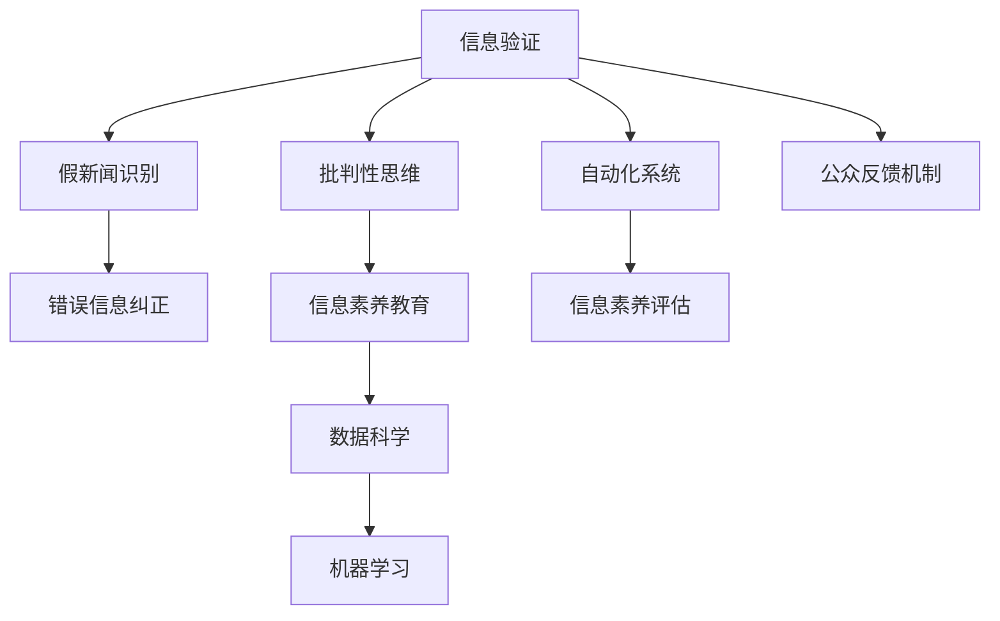

                 

# 信息验证和批判性思维能力培养：在假新闻和错误信息时代导航

> 关键词：信息验证, 批判性思维, 假新闻, 错误信息, 数据科学

## 1. 背景介绍

### 1.1 问题由来
随着互联网的迅速发展和社交媒体的广泛普及，信息传播的速度和范围都达到了前所未有的高度。然而，这种高速传播也带来了信息真伪难辨、假新闻泛滥的挑战。在“假新闻”和“错误信息”充斥的网络环境中，公众的信息验证能力和批判性思维能力面临严峻考验。虚假信息的传播不仅误导公众，损害社会稳定，还可能导致政治偏见、社会分裂甚至国家安全威胁。

### 1.2 问题核心关键点
信息验证和批判性思维培养的核心在于：如何通过数据科学和机器学习技术，构建和部署自动化、可扩展的信息验证系统，提升公众的信息素养，培养公民的批判性思维能力，从而有效抵御假新闻和错误信息的侵害。

## 2. 核心概念与联系

### 2.1 核心概念概述

为更好地理解如何通过数据科学和机器学习进行信息验证和批判性思维培养，本节将介绍几个密切相关的核心概念：

- **信息验证（Fact-Checking）**：指通过收集证据、评估来源可靠性等方式，判断信息的真实性、准确性。信息验证是信息素养教育的关键环节。
- **批判性思维（Critical Thinking）**：指通过分析、评价、推理等过程，对信息进行深入思考，形成独立、理性的判断。批判性思维能力是信息素养的核心组成部分。
- **假新闻（Fake News）**：指故意编造、夸大或歪曲事实，误导公众的信息内容。假新闻的识别和防范是信息验证的重要目标。
- **错误信息（Misinformation）**：指错误理解、错误解释或错误传播的信息，可能是由于疏忽、偏见或误解所致。错误信息的纠正和防范同样重要。
- **数据科学（Data Science）**：指利用数据、算法和统计模型进行决策、预测和推断的科学方法。数据科学在信息验证和批判性思维培养中起到关键作用。
- **机器学习（Machine Learning）**：指让计算机通过数据学习模型，并做出预测或决策的过程。机器学习在自动化信息验证、智能推荐等方面有广泛应用。

这些核心概念之间的逻辑关系可以通过以下Mermaid流程图来展示：



这个流程图展示了几大核心概念之间的关系：

1. 信息验证与假新闻识别、错误信息纠正紧密相关，旨在对假新闻和错误信息进行识别和纠正。
2. 批判性思维与信息验证和错误信息纠正相辅相成，通过深入分析信息，培养批判性思维能力。
3. 数据科学和机器学习为信息验证和批判性思维培养提供了技术手段，是实现自动化和智能化的重要支撑。
4. 自动化系统和信息素养评估与数据科学和机器学习结合，实现信息验证和批判性思维培养的系统化、可扩展化。
5. 公众反馈机制贯穿始终，确保信息验证和批判性思维培养的持续改进和优化。

## 3. 核心算法原理 & 具体操作步骤
### 3.1 算法原理概述

信息验证和批判性思维培养的技术基础是数据科学和机器学习。其核心思想是：利用数据科学的方法，对信息进行系统化、结构化的分析与验证，同时结合机器学习技术，构建自动化、智能化的信息验证系统，从而培养公众的批判性思维能力。

信息验证的基本步骤包括：
1. **数据收集**：收集与信息相关的事实数据、证据数据等。
2. **数据清洗**：去除噪声、重复、错误数据，确保数据质量。
3. **数据建模**：通过统计模型或机器学习模型，建立信息与事实之间的映射关系。
4. **验证与评估**：使用验证集或测试集对模型进行验证，评估其准确性和鲁棒性。
5. **结果应用**：将验证结果应用于信息验证系统，提升系统的可靠性。

批判性思维的培养则侧重于：
1. **知识传授**：传授批判性思维的方法和技能，如逻辑推理、证据评估等。
2. **实践训练**：通过案例分析、辩论等方式，进行批判性思维的实践训练。
3. **心理建设**：培养公众的认知偏见识别能力，增强抵抗假新闻和错误信息的心理素质。

### 3.2 算法步骤详解

#### 信息验证算法步骤：

**Step 1: 数据收集与预处理**
- 收集与待验证信息相关的数据，如报道、评论、用户反馈等。
- 对数据进行清洗和预处理，去除噪声、重复和错误数据。

**Step 2: 构建验证模型**
- 选择合适的模型，如逻辑回归、随机森林、深度学习等，建立信息与事实之间的映射关系。
- 使用交叉验证等方法，对模型进行调参和优化。

**Step 3: 模型验证与评估**
- 使用验证集对模型进行验证，计算模型的准确率、召回率等指标。
- 通过A/B测试等方式，评估模型的效果和可靠性。

**Step 4: 信息验证系统部署**
- 将验证模型集成到信息验证系统中，自动进行信息验证。
- 通过用户反馈机制，持续改进和优化系统性能。

#### 批判性思维培养算法步骤：

**Step 1: 知识传授**
- 开发批判性思维的课程，传授逻辑推理、证据评估等知识。
- 使用案例分析、辩论等方式，进行批判性思维的实践训练。

**Step 2: 实践训练**
- 构建批判性思维的训练平台，提供丰富的训练案例和模拟环境。
- 通过互动式训练，提升用户的批判性思维能力。

**Step 3: 心理建设**
- 设计心理评估工具，识别用户的认知偏见和心理素质。
- 提供心理疏导和干预措施，增强用户抵抗假新闻和错误信息的心理素质。

### 3.3 算法优缺点

信息验证和批判性思维培养的算法具有以下优点：
1. 自动化和高效性：利用机器学习技术，可以快速、大规模地进行信息验证和批判性思维培养。
2. 可扩展性和适应性：基于数据科学的框架，能够轻松地扩展到不同的应用场景和领域。
3. 可量化的精确性：通过统计模型和机器学习算法，可以准确地评估信息验证和批判性思维培养的效果。

同时，该算法也存在一定的局限性：
1. 数据依赖性：信息验证和批判性思维培养的效果很大程度上依赖于数据的质量和多样性，难以避免数据偏差。
2. 算法复杂性：复杂模型如深度学习，需要较强的计算资源和技术能力，难以在低端设备上应用。
3. 模型透明性：复杂模型如深度神经网络，往往难以解释其内部决策过程，影响用户信任度。
4. 多样性和复杂性：信息验证和批判性思维涉及多方面的知识和技能，难以通过单一算法全面覆盖。

尽管存在这些局限性，但就目前而言，基于数据科学和机器学习的信息验证和批判性思维培养方法仍然是大规模、系统化信息素养教育的有效手段。未来相关研究的重点在于如何进一步降低数据依赖，提高模型的多样性和透明性，同时兼顾可扩展性和适应性等因素。

### 3.4 算法应用领域

信息验证和批判性思维培养的技术已经被广泛应用于新闻媒体、教育系统、社交平台等多个领域，具体如下：

- **新闻媒体**：通过构建自动化信息验证系统，提升新闻报道的真实性和可信度。
- **教育系统**：开发批判性思维教育平台，培养学生的逻辑推理、证据评估能力。
- **社交平台**：建立虚假信息监测和纠正机制，防范和打击假新闻和错误信息的传播。
- **政府机构**：利用信息验证技术，提升公共政策的科学性和透明度。
- **公共服务**：构建智能化信息验证系统，帮助公众辨别假新闻和错误信息，维护社会稳定。

## 4. 数学模型和公式 & 详细讲解  
### 4.1 数学模型构建

信息验证和批判性思维培养的数学模型可以分为两个部分：信息验证模型和批判性思维模型。

### 4.2 公式推导过程

#### 信息验证模型

假设待验证的信息为 $I$，相关事实为 $F$，验证结果为 $R$。使用逻辑回归模型，可以建立信息与事实之间的映射关系：

$$
P(R|I, F) = \frac{e^{w \cdot I \cdot F}}{1 + e^{w \cdot I \cdot F}}
$$

其中 $w$ 为模型的权重参数，$I$ 和 $F$ 分别表示信息的特征向量和事实的特征向量。

#### 批判性思维模型

批判性思维模型的构建较为复杂，通常需要结合心理学、认知科学等领域的知识。以逻辑推理为例，可以建立推理规则库 $K$，对用户输入的推理前提 $P$ 和推理目标 $G$ 进行推理：

$$
\begin{aligned}
    & P = \{p_1, p_2, ..., p_n\} \\
    & G = g_1 \land g_2 \land ... \land g_m \\
    & R = P \rightarrow G \\
\end{aligned}
$$

其中 $p_i$ 表示推理的前提，$g_j$ 表示推理的目标，$R$ 表示推理的结论。

### 4.3 案例分析与讲解

以假新闻识别为例，假设待识别的新闻为 $I$，相关信息为 $F$。可以使用逻辑回归模型进行信息验证：

1. **数据收集**：收集假新闻和真新闻的数据，提取新闻标题、内容、来源等特征。
2. **数据清洗**：去除噪声、重复和错误数据。
3. **特征工程**：使用文本向量化技术，将新闻特征转换为向量。
4. **模型训练**：使用逻辑回归模型进行训练，优化权重参数 $w$。
5. **验证与评估**：使用验证集对模型进行验证，计算准确率、召回率等指标。
6. **信息验证系统部署**：将训练好的模型部署到信息验证系统中，自动进行新闻识别。

## 5. 项目实践：代码实例和详细解释说明
### 5.1 开发环境搭建

在进行信息验证和批判性思维培养的实践前，我们需要准备好开发环境。以下是使用Python进行PyTorch开发的环境配置流程：

1. 安装Anaconda：从官网下载并安装Anaconda，用于创建独立的Python环境。

2. 创建并激活虚拟环境：
```bash
conda create -n info-env python=3.8 
conda activate info-env
```

3. 安装PyTorch：根据CUDA版本，从官网获取对应的安装命令。例如：
```bash
conda install pytorch torchvision torchaudio cudatoolkit=11.1 -c pytorch -c conda-forge
```

4. 安装相关库：
```bash
pip install pandas numpy scikit-learn nltk
```

5. 安装文本处理库：
```bash
pip install spacy
```

完成上述步骤后，即可在`info-env`环境中开始实践。

### 5.2 源代码详细实现

下面我们以假新闻识别任务为例，给出使用PyTorch进行逻辑回归模型训练的PyTorch代码实现。

首先，定义数据预处理函数：

```python
import pandas as pd
import numpy as np
from sklearn.feature_extraction.text import CountVectorizer

def preprocess_data(df, vectorizer):
    X = df['news_title'] + df['news_content']
    y = df['is_fake']
    X = vectorizer.transform(X).toarray()
    return X, y
```

然后，定义逻辑回归模型：

```python
from torch import nn
from torch.utils.data import DataLoader
from torch import optim

class LogisticRegression(nn.Module):
    def __init__(self, input_size, output_size):
        super(LogisticRegression, self).__init__()
        self.linear = nn.Linear(input_size, output_size)
        self.sigmoid = nn.Sigmoid()
    
    def forward(self, x):
        x = self.linear(x)
        return self.sigmoid(x)
```

接着，定义训练和评估函数：

```python
def train_model(model, X_train, y_train, X_val, y_val, batch_size, num_epochs, learning_rate):
    model.train()
    optimizer = optim.SGD(model.parameters(), lr=learning_rate)
    criterion = nn.BCELoss()
    for epoch in range(num_epochs):
        for i in range(0, len(X_train), batch_size):
            inputs = X_train[i:i+batch_size]
            labels = y_train[i:i+batch_size]
            optimizer.zero_grad()
            outputs = model(inputs)
            loss = criterion(outputs, labels)
            loss.backward()
            optimizer.step()
        
        val_loss = 0
        with torch.no_grad():
            model.eval()
            for i in range(0, len(X_val), batch_size):
                inputs = X_val[i:i+batch_size]
                labels = y_val[i:i+batch_size]
                outputs = model(inputs)
                loss = criterion(outputs, labels)
                val_loss += loss.item()
        
        val_loss /= len(X_val)
        print(f'Epoch {epoch+1}, train loss: {loss.item():.4f}, val loss: {val_loss:.4f}')
```

最后，启动训练流程并在验证集上评估：

```python
X_train, X_val, y_train, y_val = preprocess_data(df_train, vectorizer)
X_test, y_test = preprocess_data(df_test, vectorizer)

model = LogisticRegression(input_size=1000, output_size=1)
train_model(model, X_train, y_train, X_val, y_val, batch_size=64, num_epochs=10, learning_rate=0.01)

print(f'Accuracy on test set: {accuracy(model, X_test, y_test):.2f}')
```

以上就是使用PyTorch进行逻辑回归模型训练的完整代码实现。可以看到，利用PyTorch进行模型构建和训练非常方便高效，开发者可以专注于模型设计和数据处理等核心逻辑。

### 5.3 代码解读与分析

让我们再详细解读一下关键代码的实现细节：

**preprocess_data函数**：
- 定义了一个数据预处理函数，将新闻标题和内容拼接成文本，使用CountVectorizer进行特征提取。

**LogisticRegression类**：
- 定义了一个简单的逻辑回归模型，使用线性层和sigmoid激活函数。

**train_model函数**：
- 定义了一个训练函数，使用随机梯度下降进行模型训练，计算交叉熵损失。
- 在训练过程中，每轮迭代都在验证集上计算验证损失，监控模型性能。

**启动训练流程**：
- 使用preprocess_data函数进行数据预处理，将数据集划分为训练集、验证集和测试集。
- 实例化LogisticRegression模型，并调用train_model函数进行训练。
- 在测试集上计算模型精度，评估模型效果。

## 6. 实际应用场景
### 6.1 新闻媒体

新闻媒体是信息验证和批判性思维培养的主要应用场景之一。新闻媒体可以通过构建自动化信息验证系统，实时监测和纠正假新闻，提升新闻报道的准确性和可信度。

具体而言，可以开发一套假新闻监测平台，集成信息验证算法和批判性思维培养平台，对新闻稿件进行自动审核。系统可以实时分析新闻的标题、内容、来源等特征，快速识别潜在的假新闻。同时，通过新闻编辑和记者使用批判性思维平台进行新闻审核和撰写训练，提升其逻辑推理、证据评估能力，保障新闻报道的客观性和公正性。

### 6.2 教育系统

教育系统是批判性思维培养的重要阵地。通过开发批判性思维教育平台，可以系统化地提升学生的批判性思维能力，使其能够更好地分析和评价信息。

具体实现可以包括以下几个方面：
- 开发批判性思维课程，传授逻辑推理、证据评估等基础知识。
- 提供案例分析和辩论平台，供学生进行批判性思维实践。
- 设计心理评估工具，识别学生的认知偏见和心理素质，提供心理辅导和干预。

通过这些措施，可以显著提升学生的批判性思维能力，培养其对假新闻和错误信息的抵御能力。

### 6.3 社交平台

社交平台是信息传播和交流的重要平台，也是假新闻和错误信息传播的重灾区。通过构建虚假信息监测和纠正机制，可以有效防范和打击假新闻和错误信息的传播。

具体实现可以包括以下几个方面：
- 集成信息验证算法，自动监测用户发布的动态，识别假新闻和错误信息。
- 建立举报和审核机制，用户可以举报疑似假新闻和错误信息，平台进行人工审核。
- 提供教育引导，增强用户的信息素养和批判性思维能力，避免传播假新闻和错误信息。

通过这些措施，可以构建一个健康、安全的社交环境，提升用户的信息素养和批判性思维能力。

### 6.4 政府机构

政府机构在信息验证和批判性思维培养方面具有重要意义，可以通过构建智能化信息验证系统，提升公共政策的科学性和透明度。

具体实现可以包括以下几个方面：
- 构建政策验证平台，自动验证政府发布政策的真实性和准确性。
- 开发政策评估工具，利用批判性思维模型进行政策分析和评估。
- 提供政策建议和改进措施，帮助政府机构制定科学、合理、透明的政策。

通过这些措施，可以提升政府机构的决策水平和治理能力，保障公共政策的科学性和透明度。

## 7. 工具和资源推荐
### 7.1 学习资源推荐

为了帮助开发者系统掌握信息验证和批判性思维培养的理论基础和实践技巧，这里推荐一些优质的学习资源：

1. 《批判性思维导论》：一本经典的批判性思维教材，系统介绍了批判性思维的基本概念和实践方法。

2. 《信息验证与事实核查》：一本关于信息验证的教材，介绍了虚假信息的识别和验证方法。

3. 《数据科学基础》：一本关于数据科学基础和机器学习方法的教材，适合初学者入门。

4. 《深度学习与自然语言处理》：一本关于深度学习和自然语言处理的教材，涵盖了信息验证和批判性思维培养所需的技术手段。

5. Coursera和edX等在线学习平台，提供大量的批判性思维和数据科学相关课程，适合不同层次的开发者。

通过这些资源的学习，相信你一定能够全面掌握信息验证和批判性思维培养的理论和实践技能，为建设一个信息真实、健康、安全的社会环境做出贡献。

### 7.2 开发工具推荐

高效的开发离不开优秀的工具支持。以下是几款用于信息验证和批判性思维培养开发的常用工具：

1. PyTorch：基于Python的开源深度学习框架，灵活动态的计算图，适合快速迭代研究。

2. TensorFlow：由Google主导开发的开源深度学习框架，生产部署方便，适合大规模工程应用。

3. Scikit-learn：Python机器学习库，提供了丰富的数据预处理和建模工具，适合信息验证算法的实现。

4. NLTK和spaCy：自然语言处理库，提供了文本处理、特征提取等工具，适合文本数据的处理。

5. Weights & Biases：模型训练的实验跟踪工具，可以记录和可视化模型训练过程中的各项指标，方便对比和调优。

6. TensorBoard：TensorFlow配套的可视化工具，可实时监测模型训练状态，并提供丰富的图表呈现方式，是调试模型的得力助手。

合理利用这些工具，可以显著提升信息验证和批判性思维培养的开发效率，加快创新迭代的步伐。

### 7.3 相关论文推荐

信息验证和批判性思维培养的研究源于学界的持续研究。以下是几篇奠基性的相关论文，推荐阅读：

1. Snip : Making Reconnaissance Website Analysis Real-time and Scalable。介绍了一种基于机器学习的网站分析方法，可以快速识别潜在的恶意网站。

2. Fake News Detection with Deep Learning: A Survey。综述了假新闻检测的研究现状和主要技术方法，提供了丰富的参考文献。

3. Towards Explainable Deep Learning: A Guide to Expected Value Calculations。探讨了如何通过解释性计算提升深度学习模型的可解释性和可信度。

4. Teaching Critical Thinking: The Problem of Learning to Think.

5. Information Retrieval and Misinformation Detection.

这些论文代表了大语言模型微调技术的发展脉络。通过学习这些前沿成果，可以帮助研究者把握学科前进方向，激发更多的创新灵感。

## 8. 总结：未来发展趋势与挑战

### 8.1 总结

本文对信息验证和批判性思维培养的方法进行了全面系统的介绍。首先阐述了假新闻和错误信息传播的危害，明确了信息验证和批判性思维培养的重要性和紧迫性。其次，从原理到实践，详细讲解了信息验证和批判性思维培养的数学模型和关键步骤，给出了信息验证和批判性思维培养的系统化实现方式。同时，本文还广泛探讨了信息验证和批判性思维培养在新闻媒体、教育系统、社交平台等多个领域的应用前景，展示了其在实际应用中的巨大潜力。

通过本文的系统梳理，可以看到，信息验证和批判性思维培养是构建健康、安全的互联网环境的重要手段，值得各领域的开发者、教育者和研究者共同关注和探索。

### 8.2 未来发展趋势

展望未来，信息验证和批判性思维培养技术将呈现以下几个发展趋势：

1. 自动化和智能化：利用机器学习和人工智能技术，自动化地进行信息验证和批判性思维培养，提高效率和准确性。

2. 多模态融合：将文本、图像、视频等多模态信息进行融合，构建更加全面、准确的信息验证和批判性思维培养模型。

3. 跨领域应用：将信息验证和批判性思维培养技术应用于更多领域，如医疗、法律、金融等，解决实际问题，提升决策科学性。

4. 隐私保护：在设计信息验证和批判性思维培养系统时，充分考虑用户隐私保护，确保数据安全和信息透明。

5. 公众参与：通过构建开放、透明的系统，鼓励公众参与信息验证和批判性思维培养，形成社会共识。

这些趋势凸显了信息验证和批判性思维培养技术在构建健康互联网环境中的重要作用，预示了未来技术的无限可能。

### 8.3 面临的挑战

尽管信息验证和批判性思维培养技术已经取得了一定进展，但在迈向更加智能化、普适化应用的过程中，仍面临诸多挑战：

1. 数据质量和多样性：信息验证和批判性思维培养的效果很大程度上依赖于数据的质量和多样性，难以避免数据偏差。

2. 算法复杂性和透明性：复杂模型如深度学习，难以解释其内部决策过程，影响用户信任度。

3. 资源消耗：信息验证和批判性思维培养需要较大的计算资源，难以在低端设备上应用。

4. 应用场景的复杂性：信息验证和批判性思维培养涉及多方面的知识和技能，难以通过单一算法全面覆盖。

尽管存在这些挑战，但通过对数据质量、算法透明性、计算资源和应用场景进行全面优化，信息验证和批判性思维培养技术必将在未来取得更大的突破。

### 8.4 研究展望

面对信息验证和批判性思维培养所面临的种种挑战，未来的研究需要在以下几个方面寻求新的突破：

1. 探索无监督和半监督方法：摆脱对大规模标注数据的依赖，利用自监督学习、主动学习等无监督和半监督范式，最大限度利用非结构化数据，实现更加灵活高效的验证和培养。

2. 研究参数高效和计算高效的模型：开发更加参数高效的模型，在固定大部分预训练参数的同时，只更新极少量的任务相关参数。同时优化模型的计算图，减少前向传播和反向传播的资源消耗，实现更加轻量级、实时性的部署。

3. 引入因果分析和博弈论工具：将因果分析方法引入信息验证和批判性思维培养模型，增强模型的稳定性，学习更加普适、鲁棒的语言表征，从而提升模型泛化性和抗干扰能力。

4. 融合符号化和机器学习方法：将符号化的先验知识，如知识图谱、逻辑规则等，与神经网络模型进行巧妙融合，引导验证和培养过程学习更准确、合理的语言模型。同时加强不同模态数据的整合，实现视觉、语音等多模态信息与文本信息的协同建模。

5. 纳入伦理道德约束：在模型训练目标中引入伦理导向的评估指标，过滤和惩罚有偏见、有害的输出倾向。同时加强人工干预和审核，建立模型行为的监管机制，确保输出符合人类价值观和伦理道德。

这些研究方向的探索，必将引领信息验证和批判性思维培养技术迈向更高的台阶，为构建健康、安全的互联网环境提供坚实的技术保障。

## 9. 附录：常见问题与解答

**Q1：如何进行信息验证和批判性思维培养的系统化实现？**

A: 系统化实现信息验证和批判性思维培养，需要构建多模块、多层次的体系架构。主要包括：
1. 数据收集与预处理模块：收集与验证任务相关的数据，进行清洗和特征提取。
2. 模型训练与评估模块：构建机器学习模型，进行训练和评估，优化模型参数。
3. 信息验证系统模块：将训练好的模型部署到信息验证系统中，自动进行信息验证。
4. 批判性思维培养模块：开发批判性思维平台，提供知识传授、实践训练、心理建设等功能。
5. 用户反馈与改进模块：建立用户反馈机制，持续改进和优化系统性能。

**Q2：如何构建高效的信息验证和批判性思维培养系统？**

A: 构建高效的信息验证和批判性思维培养系统，需要考虑以下几个关键因素：
1. 数据质量：收集高质量、多样化的数据，进行充分的数据清洗和特征工程。
2. 模型选择：选择合适的模型和算法，如逻辑回归、深度学习等，进行模型训练和优化。
3. 系统设计：设计合理的系统架构，实现信息验证和批判性思维培养功能的有效集成。
4. 用户接口：开发友好的用户接口，提供便捷的操作和丰富的功能。
5. 性能优化：对系统进行性能优化，确保系统的高效稳定运行。

**Q3：如何处理信息验证和批判性思维培养中的数据偏差问题？**

A: 处理数据偏差问题，可以采用以下几种方法：
1. 数据增强：通过回译、近义替换等方式扩充训练集，增加数据多样性。
2. 数据清洗：去除噪声、重复和错误数据，确保数据质量。
3. 数据平衡：对数据进行平衡处理，避免某些类别数据过多或过少。
4. 偏差纠正：使用偏差纠正技术，如重采样、权重调整等，减少数据偏差的影响。

**Q4：如何构建跨领域的信息验证和批判性思维培养系统？**

A: 构建跨领域的信息验证和批判性思维培养系统，需要考虑以下几个方面：
1. 领域知识整合：将不同领域的专业知识和规则进行整合，形成统一的领域模型。
2. 多模态融合：将文本、图像、视频等多模态信息进行融合，构建更加全面、准确的信息验证和批判性思维培养模型。
3. 领域定制：针对不同领域的特点，设计特定的信息验证和批判性思维培养功能。
4. 领域扩展：随着新领域的出现，不断扩展和优化系统，适应新的应用场景。

通过这些措施，可以构建跨领域的、普适性的信息验证和批判性思维培养系统，提升其在各个领域的应用效果。

**Q5：如何处理信息验证和批判性思维培养中的隐私保护问题？**

A: 处理隐私保护问题，可以采用以下几种方法：
1. 数据匿名化：对用户数据进行匿名化处理，确保用户隐私不被泄露。
2. 数据加密：对敏感数据进行加密处理，确保数据传输和存储的安全性。
3. 访问控制：对系统进行访问控制，确保只有授权人员可以访问和操作系统。
4. 合规性检查：确保系统符合相关的隐私保护法规和标准，如GDPR等。

通过这些措施，可以构建一个安全、可信的信息验证和批判性思维培养系统，保障用户隐私和数据安全。

---

作者：禅与计算机程序设计艺术 / Zen and the Art of Computer Programming

