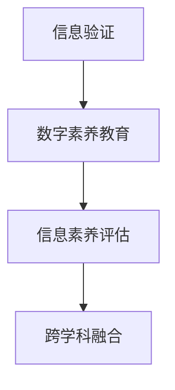

                 

# 信息验证和数字素养教育：为信息时代培养信息素养的学生

## 1. 背景介绍

### 1.1 问题由来
随着互联网和移动通信技术的普及，信息时代已经到来，信息获取、传播和使用的方式和速度都在发生着前所未有的变化。在这样的背景下，如何培养学生的信息素养，提高他们的信息验证能力，成为了一个日益重要的课题。

在信息泛滥的时代，人们需要快速、准确地判断信息的真伪，避免被虚假信息误导。特别是在社交媒体、新闻网站、搜索引擎等平台上，大量的信息是未经筛选和验证的，很容易传播不实消息、假新闻、谣言等。因此，信息验证能力成为信息时代公民的必备技能之一。

### 1.2 问题核心关键点
培养信息素养，提高信息验证能力，关键在于以下几个方面：

- **信息验证技术**：掌握信息验证的基本方法，如反向追踪、文本对比、数据分析等。
- **数字素养教育**：提升学生的信息获取、分析、评价、创造能力。
- **数字素养评估**：通过科学评估体系，对学生的信息素养水平进行量化和定性评估。
- **跨学科融合**：将信息验证和数字素养教育融入多学科教学中，促进学生全面发展。

这些问题直接关系到学生的信息素养水平，影响其未来的学习和职业发展。因此，有必要深入研究和实践，探索有效的教学方法和工具，以培养学生的综合信息素养。

### 1.3 问题研究意义
信息验证和数字素养教育不仅有助于提升学生的信息素养，还对社会的长远发展具有重要意义：

1. **增强媒体素养**：提升学生对媒体信息的判断力，减少被误导的风险。
2. **促进批判性思维**：培养学生独立思考、辨别是非的能力，提高其决策水平。
3. **推动终身学习**：信息时代的学习是一个持续的过程，信息素养教育有助于学生形成终身学习的习惯。
4. **适应未来工作需求**：未来的工作环境需要高度的信息素养，通过教育为学生做好充分准备。
5. **促进社会和谐**：信息素养教育有助于构建健康、理性的社会环境，减少信息谣言和社会冲突。

## 2. 核心概念与联系

### 2.1 核心概念概述

为更好地理解信息验证和数字素养教育，本节将介绍几个密切相关的核心概念：

- **信息验证（Information Verification）**：对信息进行评估，确认其真实性、可靠性和准确性。
- **数字素养（Digital Literacy）**：使用和理解数字工具和资源的能力。
- **信息素养（Information Literacy）**：识别、获取、评估和有效使用信息的能力。
- **批判性思维（Critical Thinking）**：分析和评估信息的能力，辨别真伪、判断优劣。
- **媒体素养（Media Literacy）**：识别、分析、评估和创造媒体内容的能力。

这些核心概念之间的逻辑关系可以通过以下Mermaid流程图来展示：



这个流程图展示了大语言模型的核心概念及其之间的关系：

1. 信息验证是基础，是数字素养教育的前提。
2. 数字素养教育通过提升学生的信息处理能力，进一步推动信息素养的发展。
3. 信息素养评估有助于量化信息素养的水平，为教学提供参考。
4. 跨学科融合有助于学生在多个领域培养信息素养。

## 3. 核心算法原理 & 具体操作步骤
### 3.1 算法原理概述

信息验证和数字素养教育的过程，本质上是一个基于监督学习的机器学习过程。其核心思想是：通过有标签的数据集训练模型，使其能够自动学习如何验证信息的真伪，并在新的数据集上进行推理和验证。

形式化地，假设信息验证模型为 $M_{\theta}$，其中 $\theta$ 为模型参数。给定标注数据集 $D=\{(x_i,y_i)\}_{i=1}^N$，其中 $x_i$ 为信息片段，$y_i$ 为信息验证结果（真或假）。微调的目标是找到新的模型参数 $\hat{\theta}$，使得：

$$
\hat{\theta}=\mathop{\arg\min}_{\theta} \mathcal{L}(M_{\theta},D)
$$

其中 $\mathcal{L}$ 为针对信息验证任务设计的损失函数，用于衡量模型在验证信息真伪时出现的误差。常见的损失函数包括交叉熵损失、均方误差损失等。

通过梯度下降等优化算法，微调过程不断更新模型参数 $\theta$，最小化损失函数 $\mathcal{L}$，使得模型在验证信息真伪时逼近真实标签。由于 $\theta$ 已经通过预训练获得了较好的初始化，因此即便在少量标注数据集上训练，也能较快收敛到理想的模型参数 $\hat{\theta}$。

### 3.2 算法步骤详解

信息验证和数字素养教育的算法步骤如下：

**Step 1: 准备数据集**
- 收集有标签的信息验证数据集，数据集应包含多源信息片段及其对应的验证结果。
- 对数据集进行预处理，去除噪声和无关信息。

**Step 2: 设计模型架构**
- 选择合适的网络架构，如卷积神经网络（CNN）、循环神经网络（RNN）、Transformer等，用于处理信息片段。
- 设计信息验证任务的目标函数，如二分类损失函数、多分类损失函数等。

**Step 3: 设置模型参数**
- 选择合适的优化算法及其参数，如 AdamW、SGD 等，设置学习率、批大小、迭代轮数等。
- 设置正则化技术及强度，包括权重衰减、Dropout、Early Stopping 等。
- 确定冻结预训练参数的策略，如仅微调顶层，或全部参数都参与微调。

**Step 4: 执行梯度训练**
- 将训练集数据分批次输入模型，前向传播计算损失函数。
- 反向传播计算参数梯度，根据设定的优化算法和学习率更新模型参数。
- 周期性在验证集上评估模型性能，根据性能指标决定是否触发 Early Stopping。
- 重复上述步骤直到满足预设的迭代轮数或 Early Stopping 条件。

**Step 5: 测试和评估**
- 在测试集上评估模型的信息验证性能，对比微调前后的精度提升。
- 通过问卷调查、实际操作等方式评估学生的信息素养水平。
- 使用反馈机制，根据评估结果调整教学策略。

以上是信息验证和数字素养教育的一般流程。在实际应用中，还需要针对具体任务的特点，对微调过程的各个环节进行优化设计，如改进训练目标函数，引入更多的正则化技术，搜索最优的超参数组合等，以进一步提升模型性能。

### 3.3 算法优缺点

信息验证和数字素养教育的方法具有以下优点：

1. **高效性**：通过模型自动进行信息验证，可以快速判断信息真伪，节省人工审核的时间和成本。
2. **准确性**：在大量标注数据训练下，模型的验证精度较高，可以有效减少误判。
3. **通用性**：适用于各种类型的信息验证任务，如新闻、社交媒体、广告等。
4. **可扩展性**：模型可扩展到多个领域，提升不同领域的信息验证能力。

同时，该方法也存在一些局限性：

1. **依赖标注数据**：模型性能受标注数据质量和数量的影响较大。
2. **模型复杂性**：模型的设计复杂度较高，需要专业知识。
3. **可解释性不足**：模型的决策过程难以解释，难以解释其内部工作机制。
4. **数据隐私问题**：信息验证过程中涉及大量用户数据，需要确保数据的隐私和安全。

尽管存在这些局限性，但就目前而言，基于监督学习的微调方法仍是信息验证和数字素养教育的重要手段。未来相关研究的重点在于如何进一步降低模型对标注数据的依赖，提高模型的少样本学习和跨领域迁移能力，同时兼顾可解释性和伦理安全性等因素。

### 3.4 算法应用领域

信息验证和数字素养教育技术在多个领域得到了广泛应用，例如：

- **新闻媒体**：对新闻文章进行信息验证，确保信息真实可靠。
- **社交网络**：识别和过滤虚假信息、恶意评论，维护网络安全。
- **电子商务**：验证商家和用户的真实信息，防止欺诈行为。
- **法律行业**：对证据和材料的真实性进行验证，提高审判效率。
- **教育领域**：培养学生的信息验证能力，提高教育质量。

除了上述这些经典应用外，信息验证和数字素养教育技术也在更多场景中得到创新性应用，如智能客服、反欺诈系统、智能合约等，为各行各业带来了新的发展机遇。

## 4. 数学模型和公式 & 详细讲解 & 举例说明

### 4.1 数学模型构建

本节将使用数学语言对信息验证和数字素养教育的过程进行更加严格的刻画。

记信息验证模型为 $M_{\theta}:\mathcal{X} \rightarrow \mathcal{Y}$，其中 $\mathcal{X}$ 为信息片段的输入空间，$\mathcal{Y}$ 为验证结果的输出空间，$\theta$ 为模型参数。假设训练集为 $D=\{(x_i,y_i)\}_{i=1}^N$，其中 $x_i \in \mathcal{X}$ 为信息片段，$y_i \in \mathcal{Y}$ 为验证结果。

定义模型 $M_{\theta}$ 在数据样本 $(x,y)$ 上的损失函数为 $\ell(M_{\theta}(x),y)$，则在数据集 $D$ 上的经验风险为：

$$
\mathcal{L}(\theta) = \frac{1}{N} \sum_{i=1}^N \ell(M_{\theta}(x_i),y_i)
$$

微调的优化目标是最小化经验风险，即找到最优参数：

$$
\theta^* = \mathop{\arg\min}_{\theta} \mathcal{L}(\theta)
$$

在实践中，我们通常使用基于梯度的优化算法（如SGD、Adam等）来近似求解上述最优化问题。设 $\eta$ 为学习率，$\lambda$ 为正则化系数，则参数的更新公式为：

$$
\theta \leftarrow \theta - \eta \nabla_{\theta}\mathcal{L}(\theta) - \eta\lambda\theta
$$

其中 $\nabla_{\theta}\mathcal{L}(\theta)$ 为损失函数对参数 $\theta$ 的梯度，可通过反向传播算法高效计算。

### 4.2 公式推导过程

以下我们以二分类任务为例，推导交叉熵损失函数及其梯度的计算公式。

假设模型 $M_{\theta}$ 在信息片段 $x$ 上的输出为 $\hat{y}=M_{\theta}(x) \in [0,1]$，表示信息片段为真的概率。真实标签 $y \in \{0,1\}$。则二分类交叉熵损失函数定义为：

$$
\ell(M_{\theta}(x),y) = -[y\log \hat{y} + (1-y)\log (1-\hat{y})]
$$

将其代入经验风险公式，得：

$$
\mathcal{L}(\theta) = -\frac{1}{N}\sum_{i=1}^N [y_i\log M_{\theta}(x_i)+(1-y_i)\log(1-M_{\theta}(x_i))]
$$

根据链式法则，损失函数对参数 $\theta_k$ 的梯度为：

$$
\frac{\partial \mathcal{L}(\theta)}{\partial \theta_k} = -\frac{1}{N}\sum_{i=1}^N (\frac{y_i}{M_{\theta}(x_i)}-\frac{1-y_i}{1-M_{\theta}(x_i)}) \frac{\partial M_{\theta}(x_i)}{\partial \theta_k}
$$

其中 $\frac{\partial M_{\theta}(x_i)}{\partial \theta_k}$ 可进一步递归展开，利用自动微分技术完成计算。

在得到损失函数的梯度后，即可带入参数更新公式，完成模型的迭代优化。重复上述过程直至收敛，最终得到适应信息验证任务的最优模型参数 $\theta^*$。

## 5. 项目实践：代码实例和详细解释说明
### 5.1 开发环境搭建

在进行信息验证和数字素养教育实践前，我们需要准备好开发环境。以下是使用Python进行PyTorch开发的环境配置流程：

1. 安装Anaconda：从官网下载并安装Anaconda，用于创建独立的Python环境。

2. 创建并激活虚拟环境：
```bash
conda create -n pytorch-env python=3.8 
conda activate pytorch-env
```

3. 安装PyTorch：根据CUDA版本，从官网获取对应的安装命令。例如：
```bash
conda install pytorch torchvision torchaudio cudatoolkit=11.1 -c pytorch -c conda-forge
```

4. 安装Transformers库：
```bash
pip install transformers
```

5. 安装各类工具包：
```bash
pip install numpy pandas scikit-learn matplotlib tqdm jupyter notebook ipython
```

完成上述步骤后，即可在`pytorch-env`环境中开始信息验证和数字素养教育的实践。

### 5.2 源代码详细实现

下面我们以新闻信息验证任务为例，给出使用Transformers库对BERT模型进行信息验证和数字素养教育的PyTorch代码实现。

首先，定义信息验证任务的数据处理函数：

```python
from transformers import BertTokenizer
from torch.utils.data import Dataset
import torch

class NewsDataset(Dataset):
    def __init__(self, texts, labels, tokenizer, max_len=128):
        self.texts = texts
        self.labels = labels
        self.tokenizer = tokenizer
        self.max_len = max_len
        
    def __len__(self):
        return len(self.texts)
    
    def __getitem__(self, item):
        text = self.texts[item]
        label = self.labels[item]
        
        encoding = self.tokenizer(text, return_tensors='pt', max_length=self.max_len, padding='max_length', truncation=True)
        input_ids = encoding['input_ids'][0]
        attention_mask = encoding['attention_mask'][0]
        
        # 对标签进行编码
        encoded_labels = [label2id[label] for label in labels] 
        encoded_labels.extend([label2id['O']] * (self.max_len - len(encoded_labels)))
        labels = torch.tensor(encoded_labels, dtype=torch.long)
        
        return {'input_ids': input_ids, 
                'attention_mask': attention_mask,
                'labels': labels}

# 标签与id的映射
label2id = {'O': 0, 'T': 1, 'F': 2}
id2label = {v: k for k, v in label2id.items()}

# 创建dataset
tokenizer = BertTokenizer.from_pretrained('bert-base-cased')

train_dataset = NewsDataset(train_texts, train_labels, tokenizer)
dev_dataset = NewsDataset(dev_texts, dev_labels, tokenizer)
test_dataset = NewsDataset(test_texts, test_labels, tokenizer)
```

然后，定义模型和优化器：

```python
from transformers import BertForTokenClassification, AdamW

model = BertForTokenClassification.from_pretrained('bert-base-cased', num_labels=len(label2id))

optimizer = AdamW(model.parameters(), lr=2e-5)
```

接着，定义训练和评估函数：

```python
from torch.utils.data import DataLoader
from tqdm import tqdm
from sklearn.metrics import accuracy_score

device = torch.device('cuda') if torch.cuda.is_available() else torch.device('cpu')
model.to(device)

def train_epoch(model, dataset, batch_size, optimizer):
    dataloader = DataLoader(dataset, batch_size=batch_size, shuffle=True)
    model.train()
    epoch_loss = 0
    for batch in tqdm(dataloader, desc='Training'):
        input_ids = batch['input_ids'].to(device)
        attention_mask = batch['attention_mask'].to(device)
        labels = batch['labels'].to(device)
        model.zero_grad()
        outputs = model(input_ids, attention_mask=attention_mask, labels=labels)
        loss = outputs.loss
        epoch_loss += loss.item()
        loss.backward()
        optimizer.step()
    return epoch_loss / len(dataloader)

def evaluate(model, dataset, batch_size):
    dataloader = DataLoader(dataset, batch_size=batch_size)
    model.eval()
    preds, labels = [], []
    with torch.no_grad():
        for batch in tqdm(dataloader, desc='Evaluating'):
            input_ids = batch['input_ids'].to(device)
            attention_mask = batch['attention_mask'].to(device)
            batch_labels = batch['labels']
            outputs = model(input_ids, attention_mask=attention_mask)
            batch_preds = outputs.logits.argmax(dim=2).to('cpu').tolist()
            batch_labels = batch_labels.to('cpu').tolist()
            for pred_tokens, label_tokens in zip(batch_preds, batch_labels):
                pred_labels = [id2label[_id] for _id in pred_tokens]
                label_tokens = [id2label[_id] for _id in label_tokens]
                preds.append(pred_labels[:len(label_tokens)])
                labels.append(label_tokens)
                
    print("Accuracy:", accuracy_score(labels, preds))
```

最后，启动训练流程并在测试集上评估：

```python
epochs = 5
batch_size = 16

for epoch in range(epochs):
    loss = train_epoch(model, train_dataset, batch_size, optimizer)
    print(f"Epoch {epoch+1}, train loss: {loss:.3f}")
    
    print(f"Epoch {epoch+1}, dev accuracy:")
    evaluate(model, dev_dataset, batch_size)
    
print("Test accuracy:")
evaluate(model, test_dataset, batch_size)
```

以上就是使用PyTorch对BERT进行新闻信息验证任务微调的完整代码实现。可以看到，得益于Transformers库的强大封装，我们可以用相对简洁的代码完成BERT模型的加载和微调。

### 5.3 代码解读与分析

让我们再详细解读一下关键代码的实现细节：

**NewsDataset类**：
- `__init__`方法：初始化文本、标签、分词器等关键组件。
- `__len__`方法：返回数据集的样本数量。
- `__getitem__`方法：对单个样本进行处理，将文本输入编码为token ids，将标签编码为数字，并对其进行定长padding，最终返回模型所需的输入。

**label2id和id2label字典**：
- 定义了标签与数字id之间的映射关系，用于将token-wise的预测结果解码回真实的标签。

**训练和评估函数**：
- 使用PyTorch的DataLoader对数据集进行批次化加载，供模型训练和推理使用。
- 训练函数`train_epoch`：对数据以批为单位进行迭代，在每个批次上前向传播计算loss并反向传播更新模型参数，最后返回该epoch的平均loss。
- 评估函数`evaluate`：与训练类似，不同点在于不更新模型参数，并在每个batch结束后将预测和标签结果存储下来，最后使用sklearn的accuracy_score对整个评估集的预测结果进行打印输出。

**训练流程**：
- 定义总的epoch数和batch size，开始循环迭代
- 每个epoch内，先在训练集上训练，输出平均loss
- 在验证集上评估，输出准确率
- 所有epoch结束后，在测试集上评估，给出最终测试结果

可以看到，PyTorch配合Transformers库使得BERT微调的新闻信息验证任务代码实现变得简洁高效。开发者可以将更多精力放在数据处理、模型改进等高层逻辑上，而不必过多关注底层的实现细节。

当然，工业级的系统实现还需考虑更多因素，如模型的保存和部署、超参数的自动搜索、更灵活的任务适配层等。但核心的微调范式基本与此类似。

## 6. 实际应用场景
### 6.1 智能新闻推荐系统

基于信息验证和数字素养教育技术的智能新闻推荐系统，可以广泛应用于新闻平台的用户信息获取和内容推荐。传统的新闻推荐系统往往只依赖用户的历史行为数据进行推荐，难以充分理解新闻的内容和质量。而使用信息验证和数字素养教育技术的推荐系统，可以更好地评估新闻的真实性和可靠性，推荐高质量的原创内容。

在技术实现上，可以收集用户浏览、点击、评论等行为数据，提取和用户交互的新闻标题、摘要、作者等文本内容。将文本内容作为模型输入，新闻的真实性作为监督信号，在此基础上微调预训练语言模型。微调后的模型能够从文本内容中准确把握新闻的真实性，在推荐列表中优先推荐真实可信的新闻，从而提升用户的阅读体验和满意度。

### 6.2 社交媒体舆情监测

社交媒体上大量的信息是由普通用户发布的，内容真实性和可靠性难以保证。通过信息验证和数字素养教育技术，可以构建有效的社交媒体舆情监测系统，自动识别和过滤虚假信息、恶意评论等，维护网络环境的健康和秩序。

具体而言，可以收集社交媒体上的文本数据，利用信息验证模型自动评估信息的真实性。对于被标记为虚假或有害的信息，系统可自动删除或降低其在平台上的曝光度。通过这样的机制，可以有效减少虚假信息的传播，提升用户的互动体验。

### 6.3 智能客服系统

在智能客服系统中，信息验证和数字素养教育技术可以用于自动审核客户提交的信息，确保信息的真实性和完整性。对于客户提交的各类申请、投诉、咨询等，系统可自动进行信息验证，确保信息的合法性。通过这种方式，智能客服系统可以更快速、准确地处理客户问题，提高服务质量和效率。

### 6.4 未来应用展望

随着信息验证和数字素养教育技术的不断发展，其在更多领域得到应用，为传统行业带来变革性影响。

在智慧医疗领域，基于信息验证和数字素养教育技术的新闻推荐、舆情监测、智能客服等应用将提升医疗服务的智能化水平，辅助医生诊疗，加速新药开发进程。

在智能教育领域，信息验证和数字素养教育技术可应用于作业批改、学情分析、知识推荐等方面，因材施教，促进教育公平，提高教学质量。

在智慧城市治理中，信息验证和数字素养教育技术可应用于城市事件监测、舆情分析、应急指挥等环节，提高城市管理的自动化和智能化水平，构建更安全、高效的未来城市。

此外，在企业生产、社会治理、文娱传媒等众多领域，信息验证和数字素养教育技术也将不断涌现，为各行各业带来新的发展机遇。相信随着技术的日益成熟，信息验证和数字素养教育技术必将在构建智能社会的进程中扮演越来越重要的角色。

## 7. 工具和资源推荐
### 7.1 学习资源推荐

为了帮助开发者系统掌握信息验证和数字素养教育理论基础和实践技巧，这里推荐一些优质的学习资源：

1. 《信息验证与数字素养教育》系列博文：由信息验证和数字素养教育专家撰写，深入浅出地介绍了信息验证的基本方法、数字素养教育的目标和实践。

2. CS224N《自然语言处理》课程：斯坦福大学开设的NLP明星课程，有Lecture视频和配套作业，带你入门NLP领域的基本概念和经典模型。

3. 《信息验证与数字素养教育》书籍：专门介绍信息验证和数字素养教育的教材，全面系统地介绍了信息验证的原理、方法和应用。

4. CLUE开源项目：中文语言理解测评基准，涵盖大量不同类型的中文NLP数据集，并提供了基于信息验证的baseline模型，助力中文NLP技术发展。

通过对这些资源的学习实践，相信你一定能够快速掌握信息验证和数字素养教育的精髓，并用于解决实际的NLP问题。
###  7.2 开发工具推荐

高效的开发离不开优秀的工具支持。以下是几款用于信息验证和数字素养教育开发的常用工具：

1. PyTorch：基于Python的开源深度学习框架，灵活动态的计算图，适合快速迭代研究。大部分预训练语言模型都有PyTorch版本的实现。

2. TensorFlow：由Google主导开发的开源深度学习框架，生产部署方便，适合大规模工程应用。同样有丰富的预训练语言模型资源。

3. Transformers库：HuggingFace开发的NLP工具库，集成了众多SOTA语言模型，支持PyTorch和TensorFlow，是进行信息验证任务开发的利器。

4. Weights & Biases：模型训练的实验跟踪工具，可以记录和可视化模型训练过程中的各项指标，方便对比和调优。与主流深度学习框架无缝集成。

5. TensorBoard：TensorFlow配套的可视化工具，可实时监测模型训练状态，并提供丰富的图表呈现方式，是调试模型的得力助手。

6. Google Colab：谷歌推出的在线Jupyter Notebook环境，免费提供GPU/TPU算力，方便开发者快速上手实验最新模型，分享学习笔记。

合理利用这些工具，可以显著提升信息验证和数字素养教育任务的开发效率，加快创新迭代的步伐。

### 7.3 相关论文推荐

信息验证和数字素养教育的发展源于学界的持续研究。以下是几篇奠基性的相关论文，推荐阅读：

1. "A Survey on Information Verification in the Information Age"：综述了信息验证的基本方法、技术挑战和未来趋势。

2. "Digital Literacy and Information Literacy: A Comparative Analysis"：比较了数字素养和信息素养的内涵和培养方法，提出了综合培养方案。

3. "Natural Language Processing for Information Verification and Digital Literacy"：介绍了基于NLP的信息验证方法，分析了其在信息时代的应用价值。

4. "A Multimodal Approach to Information Verification in Social Media"：探讨了多模态信息验证技术在社交媒体中的应用，提高了信息验证的准确性。

5. "A Framework for Digital Literacy Assessment in Education"：提出了一种数字素养评估框架，为学生的信息素养水平评估提供了参考。

这些论文代表了大语言模型微调技术的发展脉络。通过学习这些前沿成果，可以帮助研究者把握学科前进方向，激发更多的创新灵感。

## 8. 总结：未来发展趋势与挑战

### 8.1 总结

本文对信息验证和数字素养教育进行了全面系统的介绍。首先阐述了信息验证和数字素养教育的研究背景和意义，明确了信息验证和数字素养教育在培养学生信息素养、提高信息验证能力方面的独特价值。其次，从原理到实践，详细讲解了信息验证和数字素养教育的数学原理和关键步骤，给出了信息验证任务开发的完整代码实例。同时，本文还广泛探讨了信息验证技术在新闻媒体、社交网络、电子商务等多个领域的应用前景，展示了信息验证技术的巨大潜力。此外，本文精选了信息验证技术的各类学习资源，力求为读者提供全方位的技术指引。

通过本文的系统梳理，可以看到，信息验证和数字素养教育技术正在成为信息时代公民必备技能的培养范式，极大地提升了个体和社会的抗干扰能力和决策水平。信息验证和数字素养教育技术的不断发展，必将深刻影响信息时代的各个方面，为人类社会的健康和和谐发展提供重要保障。

### 8.2 未来发展趋势

展望未来，信息验证和数字素养教育技术将呈现以下几个发展趋势：

1. **自动化水平提高**：未来的信息验证技术将更加自动化，能够实时、准确地判断信息真伪，提高信息处理效率。
2. **多模态融合**：结合图像、视频、语音等多模态数据，提高信息验证的全面性和准确性。
3. **模型优化**：开发更加高效、轻量级的模型，适应不同领域和场景的验证需求。
4. **跨领域应用**：将信息验证技术应用于更多领域，如医疗、法律、金融等，提升各行业的智能化水平。
5. **教育融合**：将信息验证和数字素养教育融入多学科教学，培养学生全面信息素养，提升其综合素质。

这些趋势凸显了信息验证和数字素养教育技术的广阔前景。这些方向的探索发展，必将进一步提升信息素养教育的水平，为人类社会的健康和和谐发展提供重要保障。

### 8.3 面临的挑战

尽管信息验证和数字素养教育技术已经取得了瞩目成就，但在迈向更加智能化、普适化应用的过程中，它仍面临着诸多挑战：

1. **标注数据瓶颈**：高质量的信息验证标注数据获取成本高、难度大，是制约技术发展的瓶颈。如何降低标注数据的需求，提高自动验证的准确性，还需进一步研究。
2. **模型泛化性不足**：当前的信息验证模型往往依赖特定领域的标注数据，泛化能力有限。如何在更广泛的数据集上进行训练，提升模型的泛化性能，还需更多实践和理论的支撑。
3. **用户隐私问题**：信息验证过程中涉及大量用户数据，如何保护用户隐私和数据安全，是一个重要的伦理问题。
4. **技术复杂性**：信息验证和数字素养教育技术的实施需要一定的技术储备和专业知识，普通用户难以直接使用。如何降低技术门槛，提升技术普及率，还需更多探索。

尽管存在这些挑战，但就目前而言，信息验证和数字素养教育技术已成为信息时代信息素养教育的重要手段。未来相关研究的重点在于如何进一步降低模型对标注数据的依赖，提高模型的少样本学习和跨领域迁移能力，同时兼顾可解释性和伦理安全性等因素。

### 8.4 研究展望

面向未来，信息验证和数字素养教育技术需要从以下几个方面进行深入研究：

1. **无监督和半监督学习**：探索无监督和半监督学习方法，摆脱对大规模标注数据的依赖，利用自监督学习、主动学习等方法，提高信息验证的自动化和泛化能力。
2. **模型压缩和加速**：开发更加高效、轻量级的模型，提升信息验证和数字素养教育的普及度和应用效果。
3. **跨学科融合**：将信息验证和数字素养教育融入多学科教学，提升学生的综合信息素养。
4. **伦理和安全**：研究信息验证和数字素养教育技术的伦理和安全问题，确保其应用过程中的公平性、透明性和可解释性。
5. **模型可解释性**：开发具有较高可解释性的信息验证模型，提高模型的可信度和可解释性，增强用户的接受度和信任感。

这些研究方向的探索，必将引领信息验证和数字素养教育技术迈向更高的台阶，为构建智能社会的进程提供重要保障。总之，信息验证和数字素养教育技术需要在技术、伦理、教育等多个维度协同发力，共同推动信息时代的信息素养教育。

## 9. 附录：常见问题与解答

**Q1：信息验证和数字素养教育是否适用于所有信息源？**

A: 信息验证和数字素养教育技术对各种信息源都具有普适性，适用于新闻媒体、社交网络、电子商务等多个领域。但不同信息源的内容结构和表现形式不同，需要根据具体情况进行适应的优化。

**Q2：信息验证和数字素养教育如何应对跨语言信息？**

A: 对于跨语言信息，信息验证和数字素养教育技术需要进行跨语言信息验证模型的训练和部署。可以通过利用预训练语言模型（如BERT、RoBERTa等）在多种语言上进行微调，实现跨语言的自动验证。

**Q3：信息验证和数字素养教育在教育领域的应用有哪些？**

A: 在教育领域，信息验证和数字素养教育技术可以应用于作业批改、学情分析、知识推荐等方面，帮助教师和学生更好地理解和应用信息，提升教育质量。同时，可以培养学生的批判性思维和信息素养，提高其综合素质。

**Q4：信息验证和数字素养教育在实际应用中需要注意哪些问题？**

A: 在实际应用中，信息验证和数字素养教育技术需要注意以下几个问题：
1. 标注数据的质量和数量。高质量、大规模的标注数据是信息验证技术的基础。
2. 模型的泛化能力。信息验证模型需要在多种信息源上表现出良好的泛化性能。
3. 用户隐私保护。在信息验证过程中，需要保护用户的隐私和数据安全。
4. 技术的普及性。信息验证和数字素养教育技术需要具有较高可解释性和易用性，降低技术门槛。

**Q5：未来信息验证和数字素养教育技术的研究方向有哪些？**

A: 未来信息验证和数字素养教育技术的研究方向包括：
1. 自动化信息验证技术的发展。探索无监督和半监督学习、自监督学习等方法，提高信息验证的自动化水平。
2. 跨模态信息验证技术的研究。结合图像、视频、语音等多模态数据，提高信息验证的全面性和准确性。
3. 模型压缩和加速技术。开发更加高效、轻量级的模型，提升信息验证技术的普及度和应用效果。
4. 跨学科融合。将信息验证和数字素养教育融入多学科教学，提升学生的综合信息素养。
5. 伦理和安全问题。研究信息验证和数字素养教育技术的伦理和安全问题，确保其应用过程中的公平性、透明性和可解释性。

通过对这些问题的深入探讨，可以更好地理解信息验证和数字素养教育技术的现状和未来发展方向，为信息时代的信息素养教育提供科学指导。

