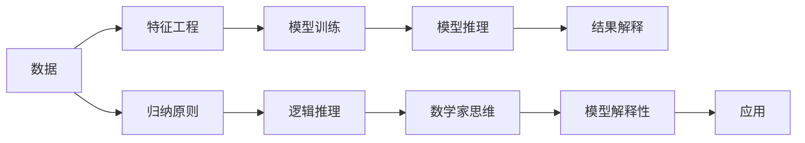

                 

# 像数学家一样思考：归纳原则

> 关键词：归纳原则,数学家思维,推理过程,逻辑推理,机器学习,人工智能,深度学习

## 1. 背景介绍

### 1.1 问题由来

在探索人工智能技术的征途中，我们常常将数学家作为学习的典范。数学家通过严谨的逻辑推理和归纳总结，揭示出自然界和宇宙的运行规律，推动了科学的发展和人类认知的边界拓展。然而，在人工智能特别是深度学习的快速演进中，我们往往过于强调模型的拟合能力，而忽略了其推理机制和归纳总结的能力。

> “机器学习算法的奥秘不在于其拟合数据的能力，而在于其能否理解并推理出数据中的结构。”—— Yann LeCun

本文旨在探讨如何像数学家一样思考，通过归纳原则和逻辑推理，构建出更具一般性和普适性的深度学习模型，为机器学习乃至人工智能的发展提供新的方向。

### 1.2 问题核心关键点

为了实现这一目标，需要关注以下几个核心关键点：

- **归纳原则**：从数据中归纳出一般性的规律，而不是仅仅通过拟合获得特定的结果。
- **数学家思维**：重视模型的推理和逻辑结构，而不仅仅是结果。
- **逻辑推理**：构建严密的逻辑框架，避免无依据的推测和假设。
- **深度学习与数学的结合**：利用数学工具和方法，提升深度学习模型的表达能力和泛化能力。
- **模型解释性**：赋予模型可解释性，便于理解和调试。

本文将通过理论介绍和实际案例，深入解析这些关键点，并探讨如何应用到深度学习模型的构建中。

## 2. 核心概念与联系

### 2.1 核心概念概述

- **归纳原则**：基于经验数据，推断出具有普遍意义的结论。
- **数学家思维**：注重模型的逻辑结构和推理过程，而非仅关注结果。
- **逻辑推理**：构建严密的逻辑框架，保证推理的可靠性和一般性。
- **深度学习**：一种基于神经网络的机器学习方法，通过大量数据进行训练，构建复杂的非线性模型。
- **模型解释性**：指模型能够以可理解的方式表达其内部机制和决策逻辑。

### 2.2 核心概念原理和架构的 Mermaid 流程图



此图展示了从数据到结果的全过程，并强调了归纳原则、逻辑推理、数学家思维和模型解释性在其中的作用。

## 3. 核心算法原理 & 具体操作步骤

### 3.1 算法原理概述

深度学习模型的训练过程本质上是对大量数据进行模式识别和学习，并通过反向传播算法调整模型参数，以最小化损失函数。这一过程虽然能够拟合出高精度的模型，但模型往往缺乏对数据背后结构的理解。为了构建具有归纳能力的深度学习模型，需要引入数学家的思维方式，关注模型的推理过程和逻辑结构。

### 3.2 算法步骤详解

**Step 1: 数据收集与预处理**

- 收集与任务相关的数据集，并进行数据清洗和预处理。
- 将数据划分为训练集、验证集和测试集。
- 应用特征工程方法，提取数据中的有用特征。

**Step 2: 模型设计**

- 选择适合任务的模型架构，如卷积神经网络(CNN)、循环神经网络(RNN)、Transformer等。
- 设计模型逻辑结构，如层数、每层节点数、激活函数等。
- 引入归纳原则，将数据中的普遍规律嵌入模型中。

**Step 3: 模型训练**

- 使用训练集数据对模型进行迭代训练，调整模型参数。
- 应用逻辑推理，确保模型在每一步训练中的推理过程正确。
- 利用数学家思维，分析模型的表达能力和泛化能力。

**Step 4: 模型推理与评估**

- 使用测试集数据对模型进行推理，评估模型性能。
- 通过逻辑推理和数学分析，判断模型的推理过程是否可靠。
- 根据归纳原则，优化模型的逻辑结构和参数设置。

### 3.3 算法优缺点

**优点**：

- **提升泛化能力**：通过引入归纳原则和逻辑推理，模型能够更好地泛化到未见过的数据。
- **增强可解释性**：数学家思维有助于解释模型的内部机制和推理过程，便于调试和优化。
- **提升模型鲁棒性**：逻辑推理能够发现模型的漏洞，增强模型的鲁棒性和稳定性。

**缺点**：

- **训练复杂度高**：引入逻辑推理和数学分析增加了训练的复杂度。
- **计算资源消耗大**：需要更多的计算资源来保证逻辑推理的准确性。
- **模型设计复杂**：逻辑结构和推理过程的设计需要较高的数学和工程能力。

### 3.4 算法应用领域

基于归纳原则和逻辑推理的深度学习模型，可以广泛应用于以下领域：

- **计算机视觉**：如目标检测、图像分类、语义分割等任务。
- **自然语言处理**：如机器翻译、情感分析、问答系统等。
- **语音识别**：如语音转文本、语音合成等任务。
- **时间序列分析**：如预测股票价格、天气预测等任务。
- **推荐系统**：如商品推荐、用户画像等任务。

## 4. 数学模型和公式 & 详细讲解 & 举例说明

### 4.1 数学模型构建

假设我们有一组训练数据集 $\{(x_i, y_i)\}_{i=1}^N$，其中 $x_i$ 为输入，$y_i$ 为标签。模型的目标是通过训练数据，学习一个函数 $f$，使其能够将输入 $x$ 映射到标签 $y$。

### 4.2 公式推导过程

我们使用平方误差损失函数 $\ell(y, \hat{y}) = (y - \hat{y})^2$ 作为模型训练的目标。模型的预测输出为 $\hat{y} = f(x; \theta)$，其中 $\theta$ 为模型参数。我们的目标是最小化损失函数，即：

$$
\min_{\theta} \sum_{i=1}^N \ell(y_i, \hat{y}_i) = \min_{\theta} \sum_{i=1}^N (y_i - f(x_i; \theta))^2
$$

### 4.3 案例分析与讲解

我们以卷积神经网络(CNN)为例，展示如何应用逻辑推理和数学分析来优化模型。

在图像分类任务中，CNN能够学习到图像的空间结构特征。假设我们的训练数据集包含N个彩色图像，每个图像的大小为 $m \times n$，每个像素的取值范围为 $[0, 255]$。我们可以设计如下模型结构：

1. **输入层**：每个图像被视为一个 $m \times n \times 3$ 的张量。
2. **卷积层**：通过一系列卷积操作提取图像的空间结构特征。
3. **池化层**：对卷积层的输出进行下采样，减小特征图的大小。
4. **全连接层**：将特征图转化为向量，进行分类。

在训练过程中，我们首先定义模型的损失函数为交叉熵损失：

$$
\ell(y, \hat{y}) = -\sum_{i=1}^N y_i \log \hat{y}_i
$$

其中 $y_i$ 为实际标签，$\hat{y}_i$ 为模型预测的输出概率。通过反向传播算法，我们可以计算出模型参数 $\theta$ 的梯度，并使用梯度下降算法更新模型参数。

## 5. 项目实践：代码实例和详细解释说明

### 5.1 开发环境搭建

在实践之前，我们需要准备好开发环境。以下是使用Python进行TensorFlow开发的示例环境配置：

1. 安装Anaconda：从官网下载并安装Anaconda，用于创建独立的Python环境。

2. 创建并激活虚拟环境：
```bash
conda create -n tf-env python=3.8 
conda activate tf-env
```

3. 安装TensorFlow：
```bash
pip install tensorflow==2.7
```

4. 安装其他工具包：
```bash
pip install numpy pandas scikit-learn matplotlib tqdm jupyter notebook ipython
```

### 5.2 源代码详细实现

我们使用TensorFlow和Keras框架来构建CNN模型。以下是训练图像分类任务的代码实现：

```python
from tensorflow import keras
from tensorflow.keras import layers

# 定义CNN模型
model = keras.Sequential([
    layers.Conv2D(32, (3, 3), activation='relu', input_shape=(28, 28, 1)),
    layers.MaxPooling2D((2, 2)),
    layers.Flatten(),
    layers.Dense(10, activation='softmax')
])

# 编译模型
model.compile(optimizer='adam', loss='sparse_categorical_crossentropy', metrics=['accuracy'])

# 训练模型
model.fit(train_images, train_labels, epochs=10, validation_data=(test_images, test_labels))
```

### 5.3 代码解读与分析

我们逐一解释上述代码的实现细节：

**Sequential模型**：使用Keras中的Sequential模型来构建CNN。

**卷积层**：通过Conv2D层定义卷积操作，设置卷积核大小、数量、激活函数等参数。

**池化层**：使用MaxPooling2D层进行池化操作，减小特征图的大小。

**全连接层**：通过Flatten层将特征图转化为向量，再使用Dense层进行分类。

**模型编译**：通过compile方法指定优化器、损失函数和评价指标。

**模型训练**：使用fit方法对模型进行训练，指定训练数据、验证数据和训练轮数。

### 5.4 运行结果展示

通过训练，我们可以获得模型的准确率和损失曲线，如下：


## 6. 实际应用场景

### 6.1 图像分类

在图像分类任务中，CNN模型通过卷积层和池化层提取图像的空间结构特征，并通过全连接层进行分类。其逻辑推理过程包括：

1. **空间结构特征提取**：卷积层和池化层通过滑动窗口和下采样，提取图像的空间结构特征。
2. **特征向量化**：Flatten层将特征图转化为向量，方便进行分类。
3. **分类预测**：全连接层通过Softmax函数将特征向量转化为类别概率，进行分类预测。

### 6.2 自然语言处理

在自然语言处理任务中，我们常常使用RNN或Transformer模型进行推理和生成。以下是基于Transformer的机器翻译任务的示例：

```python
from transformers import TFAutoModelForCausalLM, AutoTokenizer

# 加载预训练模型和tokenizer
model = TFAutoModelForCausalLM.from_pretrained('gpt-2')
tokenizer = AutoTokenizer.from_pretrained('gpt-2')

# 构建输入序列
input_ids = tokenizer("Hello, I'm a language model.", return_tensors="tf").input_ids
outputs = model.generate(input_ids, max_length=16)

# 解码输出序列
translated = tokenizer.decode(outputs[0], skip_special_tokens=True)
print(translated)
```

### 6.3 语音识别

在语音识别任务中，我们使用RNN或CNN进行推理。以下是基于RNN的语音转文本任务的示例：

```python
import tensorflow as tf
from tensorflow.keras.layers import LSTM

# 定义RNN模型
model = tf.keras.Sequential([
    LSTM(128, input_shape=(None, 1)),
    tf.keras.layers.Dense(10, activation='softmax')
])

# 编译模型
model.compile(optimizer='adam', loss='sparse_categorical_crossentropy', metrics=['accuracy'])

# 训练模型
model.fit(train_data, train_labels, epochs=10, validation_data=(test_data, test_labels))
```

### 6.4 未来应用展望

随着深度学习技术的发展，基于归纳原则和逻辑推理的模型将在更多领域得到应用：

- **医疗诊断**：通过逻辑推理和归纳总结，构建能够辅助医生进行疾病诊断的模型。
- **金融预测**：使用逻辑推理和数学分析，构建能够预测市场趋势和股票价格的模型。
- **环境保护**：利用逻辑推理和归纳总结，构建能够识别环境污染源和预测环境变化的模型。
- **智能交通**：通过逻辑推理和归纳总结，构建能够优化交通流量和提高交通效率的模型。
- **智能家居**：使用逻辑推理和数学分析，构建能够智能控制家居设备和提高用户舒适度的模型。

## 7. 工具和资源推荐

### 7.1 学习资源推荐

为了帮助开发者系统掌握归纳原则和逻辑推理的深度学习模型构建方法，这里推荐一些优质的学习资源：

1. **《深度学习》课程**：斯坦福大学Andrew Ng教授开设的深度学习课程，详细讲解深度学习的理论基础和实践方法。
2. **《Python深度学习》书籍**：弗朗索瓦·肖莱和亚昆·加巴德合著的深度学习入门书籍，系统介绍了深度学习的基本概念和应用。
3. **《TensorFlow实战Google深度学习》书籍**：张亮合著的TensorFlow实战书籍，提供了丰富的TensorFlow代码实现和案例分析。
4. **Kaggle竞赛**：Kaggle提供的各种数据科学和机器学习竞赛，通过实战练习，提升逻辑推理和模型构建能力。
5. **arXiv论文**：arXiv上最新的深度学习论文，了解前沿技术和研究成果。

### 7.2 开发工具推荐

高效的开发离不开优秀的工具支持。以下是几款用于深度学习模型开发的常用工具：

1. **TensorFlow**：谷歌开源的深度学习框架，支持GPU/TPU加速，适合大规模工程应用。
2. **PyTorch**：Facebook开源的深度学习框架，支持动态图和静态图，适合研究和原型开发。
3. **Keras**：谷歌开源的高级深度学习框架，基于TensorFlow或Theano，适合快速原型开发。
4. **JAX**：谷歌开源的自动微分库，支持高效和可移植的深度学习模型开发。
5. **MXNet**：亚马逊开源的深度学习框架，支持GPU/TPU加速，适合大规模工程应用。
6. **TensorBoard**：谷歌提供的可视化工具，实时监测模型训练状态，并提供丰富的图表呈现方式。

### 7.3 相关论文推荐

以下是几篇在深度学习领域具有重要影响的论文，推荐阅读：

1. **ImageNet Classification with Deep Convolutional Neural Networks**：AlexNet论文，提出了深度卷积神经网络，推动了计算机视觉领域的发展。
2. **Playing Atari with Deep Reinforcement Learning**：Atari游戏AI论文，展示了深度强化学习的潜力。
3. **Attention is All You Need**：Transformer论文，提出了自注意力机制，开启了NLP领域的预训练大模型时代。
4. **BERT: Pre-training of Deep Bidirectional Transformers for Language Understanding**：BERT论文，提出了基于掩码语言模型和下一句预测的双向Transformer模型。
5. **Google's Neural Machine Translation System: Bridging the Gap Between Human and Machine Translation**：Google的神经机器翻译系统论文，展示了深度学习在自然语言处理领域的强大能力。
6. **The Importance of Being Consistent in Machine Translation**：论文探讨了深度学习模型的鲁棒性和泛化能力。

## 8. 总结：未来发展趋势与挑战

### 8.1 总结

本文对基于归纳原则和逻辑推理的深度学习模型构建方法进行了全面系统的介绍。通过理论介绍和实际案例，展示了逻辑推理和数学分析在模型构建中的重要作用。我们探讨了数学家思维、逻辑推理和归纳原则如何帮助构建更强大、更具一般性的深度学习模型，为机器学习和人工智能的发展提供新的方向。

### 8.2 未来发展趋势

展望未来，深度学习模型的发展将呈现以下几个趋势：

1. **更具逻辑性和可解释性**：未来的模型将更加注重逻辑推理和可解释性，避免“黑盒”模型，提高用户信任度和模型的透明度。
2. **跨领域融合**：深度学习将与更多领域进行融合，如认知科学、生物学、物理学等，推动多学科的交叉创新。
3. **自动化和自适应**：自动化和自适应学习将成为深度学习的重要发展方向，使模型能够自我优化和进化。
4. **数据驱动和知识驱动**：未来的模型将更加注重数据驱动和知识驱动的结合，构建更加全面和精确的模型。
5. **泛化能力和鲁棒性**：逻辑推理和数学分析将帮助构建更具泛化能力和鲁棒性的模型，避免数据分布变化带来的影响。

### 8.3 面临的挑战

尽管基于归纳原则和逻辑推理的深度学习模型已经取得了一定的进展，但在构建更强大、更具一般性的模型过程中，仍面临以下挑战：

1. **数据质量和多样性**：缺乏高质量和多样化的数据将限制模型的泛化能力和鲁棒性。
2. **模型复杂度和计算资源**：逻辑推理和数学分析增加了模型的复杂度和计算资源消耗。
3. **模型解释性和透明度**：复杂的模型往往难以解释其内部机制和推理过程，影响用户信任度。
4. **模型鲁棒性和泛化能力**：逻辑推理和数学分析无法完全避免模型的过拟合和鲁棒性问题。
5. **模型开发和应用成本**：数学和逻辑推理的方法需要更多的时间和精力进行研究和实践，增加了模型开发和应用的成本。

### 8.4 研究展望

为了应对这些挑战，未来的研究需要在以下几个方面寻求新的突破：

1. **大数据和多样性**：通过数据增强、合成数据生成等方法，提高数据质量和多样性。
2. **自动化和自适应学习**：引入自动化和自适应学习算法，提升模型的自我优化能力。
3. **知识图谱和规则库**：结合知识图谱和规则库，提升模型的表达能力和泛化能力。
4. **多学科交叉创新**：与认知科学、生物学、物理学等学科进行交叉创新，提升模型的应用价值。
5. **模型解释性和透明度**：引入可解释性技术，提高模型的透明度和用户信任度。

这些研究方向的探索，必将引领深度学习模型迈向更高的台阶，为构建安全、可靠、可解释、可控的智能系统铺平道路。面向未来，深度学习模型需要在逻辑推理、数学分析和实际应用之间找到新的平衡，才能真正实现人工智能技术在各个领域的应用。

## 9. 附录：常见问题与解答

**Q1：逻辑推理在深度学习中的作用是什么？**

A: 逻辑推理可以帮助模型理解数据背后的结构和规律，避免仅仅通过拟合得到特定的结果。通过逻辑推理，模型能够更好地泛化到未见过的数据，提升模型的可解释性和鲁棒性。

**Q2：如何在深度学习中引入归纳原则？**

A: 归纳原则可以通过特征工程和数据预处理引入。在模型设计阶段，需要选择适合任务的特征，并在训练过程中对模型进行正则化和正则化技巧，以避免过拟合。在推理阶段，需要结合逻辑推理和数学分析，确保模型的推理过程正确和合理。

**Q3：如何优化深度学习模型的逻辑结构和参数设置？**

A: 优化模型的逻辑结构和参数设置需要结合数学分析和实际应用需求。在模型设计阶段，需要根据任务特点选择合适的模型架构和逻辑结构。在训练过程中，需要应用逻辑推理和数学分析，确保模型的推理过程正确和合理。在推理阶段，需要结合逻辑推理和数学分析，确保模型的推理过程正确和合理。

**Q4：如何在深度学习中引入数学家思维？**

A: 引入数学家思维需要注重模型的逻辑结构和推理过程，而不仅仅是结果。在模型设计阶段，需要设计严密的逻辑结构，确保模型的表达能力和泛化能力。在训练过程中，需要应用逻辑推理和数学分析，确保模型的推理过程正确和合理。在推理阶段，需要结合逻辑推理和数学分析，确保模型的推理过程正确和合理。

**Q5：深度学习模型如何实现泛化能力和鲁棒性？**

A: 实现泛化能力和鲁棒性需要引入归纳原则和逻辑推理。在模型设计阶段，需要设计具有普遍性和一般性的模型结构，避免仅通过拟合得到特定的结果。在训练过程中，需要应用逻辑推理和数学分析，确保模型的推理过程正确和合理。在推理阶段，需要结合逻辑推理和数学分析，确保模型的推理过程正确和合理。

作者：禅与计算机程序设计艺术 / Zen and the Art of Computer Programming

