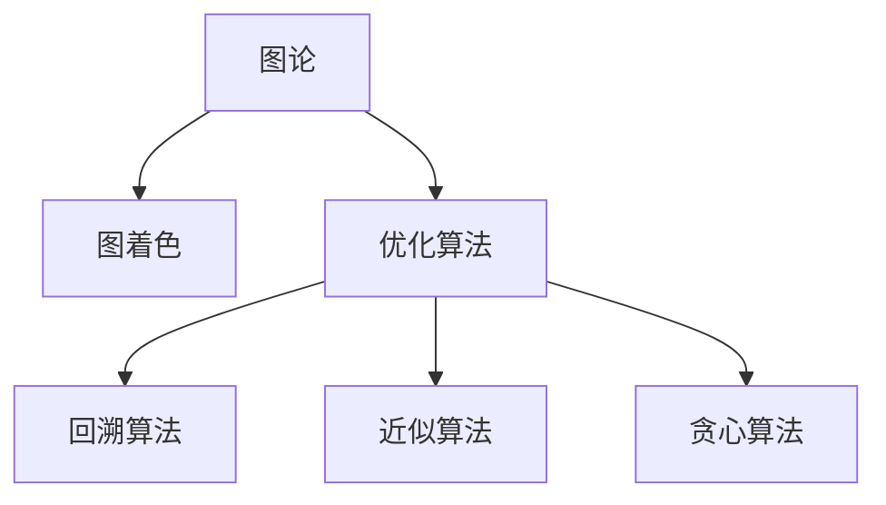

                 

# 像数学家一样思考：着色原理

> 关键词：图论, 图着色, 着色问题, 优化算法, 着色算法, 计算机科学

## 1. 背景介绍

### 1.1 问题由来
图着色问题(Graph Coloring Problem)是图论中的经典问题之一，指将图中的每个顶点分配一个颜色，使得相邻顶点的颜色不同。这一问题最早源于地图的着色，即如何给地图的每个区域分配一个颜色，使得相邻区域的颜色不同。在现代，图着色问题已经广泛应用于计算机科学和运筹学等多个领域，如网络设计、无线传感网络、生物信息学等。

图着色问题是一个典型的组合优化问题，具有重要的学术价值和广泛的应用前景。然而，其求解过程复杂，需要综合考虑颜色冲突、颜色种类、图结构等多种因素，因此成为计算机科学和运筹学研究的难点和热点。

### 1.2 问题核心关键点
图着色问题在图论中的研究已经非常深入，其中最具代表性的是四色定理(Four Color Theorem)和贪心算法(Greedy Algorithm)。四色定理证明了任何平面图都可以用不超过4种颜色进行着色，使得相邻的顶点颜色不同。贪心算法则是一种简单而有效的启发式算法，通过逐步分配颜色，最小化冲突次数，快速解决大规模的图着色问题。

然而，贪心算法并不能保证求解结果的最优性，在一些复杂情况下甚至无法得到合法解。因此，近年来基于回溯算法、近似算法和优化算法等更加高级的求解方法不断涌现，推动了图着色问题的研究和应用。

### 1.3 问题研究意义
研究图着色问题，对于理解组合优化问题的本质、提升计算效率和解决实际问题具有重要意义：

1. 优化资源分配。图着色问题可以抽象为资源分配问题，使得资源的最优分配成为可能。
2. 提升网络性能。网络中每个节点代表一个数据包，通过图着色算法，可以将数据包分配到不同的路由节点，以提高网络的传输效率和可靠性。
3. 推动科学发现。图着色问题在数学、物理、化学等多个科学领域有广泛应用，研究其优化算法有助于科学研究的深化。
4. 激发新的算法思想。图着色问题的求解需要创新的算法和高效的计算，推动了算法领域的创新发展。

## 2. 核心概念与联系

### 2.1 核心概念概述

为更好地理解图着色问题，本节将介绍几个密切相关的核心概念：

- 图论(Graph Theory)：研究图和网络结构的理论，包括图的定义、表示、性质和算法等。
- 图着色(Graph Coloring)：指将图上的顶点分配颜色，使得相邻顶点的颜色不同。
- 优化算法(Optimization Algorithm)：通过不断调整参数或搜索空间，找到满足某种特定条件的最佳解。
- 回溯算法(Backtracking Algorithm)：通过尝试所有可能的解，逐步排除无效解，最终得到合法解的算法。
- 近似算法(Approximation Algorithm)：在计算复杂度受限的情况下，找到一个接近最优解的算法。
- 贪心算法(Greedy Algorithm)：通过逐步选择当前最优的解，快速逼近全局最优解的算法。

这些核心概念之间的逻辑关系可以通过以下Mermaid流程图来展示：



这个流程图展示了的核心概念及其之间的关系：

1. 图着色问题属于图论的一个重要分支，其优化解的搜索过程需要运用各种算法。
2. 优化算法是寻找最优解的通用方法，适用于各种求解过程。
3. 回溯算法通过穷举搜索来寻找所有可能的解，适用于求解复杂性高但解空间小的图着色问题。
4. 近似算法通过逐步逼近最优解，适用于求解复杂性高且解空间大的图着色问题。
5. 贪心算法通过选择当前最优的局部解，快速逼近全局最优解，适用于求解简单但解空间大的图着色问题。

这些概念共同构成了图着色问题的研究和应用框架，使得我们可以用数学和算法的方式，有效解决图着色问题。

## 3. 核心算法原理 & 具体操作步骤
### 3.1 算法原理概述

图着色问题的目标是找到一个最小化的着色方案，使得相邻顶点的颜色不同，同时使用尽可能少的颜色。其数学模型可以表示为：

$$
\min \sum_{v \in V} c_v
$$

其中 $V$ 为图的顶点集合，$c_v$ 表示顶点 $v$ 的颜色，满足 $c_v \in \{1, 2, \ldots, k\}$，$k$ 为颜色种类。

求解目标函数的最小值，即是求解图着色问题的关键。当前求解图着色问题的方法主要分为以下几类：

1. 精确算法：通过穷举搜索或分支定界，找到图着色问题的最优解。但这种方法时间复杂度较高，不适用于大规模的图着色问题。
2. 启发式算法：通过逐步优化或随机搜索，逼近图着色问题的最优解。这类算法效率较高，但无法保证求解结果的最优性。
3. 近似算法：通过设计优化目标，寻找与最优解相近的解。这类算法时间复杂度较低，但求解结果与最优解存在一定的差距。
4. 贪心算法：通过逐步选择当前最优的局部解，逼近全局最优解。这类算法简单高效，但无法保证求解结果的最优性。

### 3.2 算法步骤详解

基于贪心算法的图着色问题求解过程如下：

1. 初始化颜色集合为 $\{1, 2, \ldots, k\}$。
2. 对于每个顶点，依次尝试分配当前颜色集合中的颜色，若相邻顶点颜色相同，则回溯尝试下一个颜色。
3. 当所有顶点都被着色后，返回颜色方案。

以下是使用Python实现贪心算法求解图着色问题的代码示例：

```python
import networkx as nx

def greedy_coloring(G):
    colors = [0] * G.number_of_nodes()
    available_colors = set(range(1, G.number_of_nodes() + 1))
    
    for v in G.nodes():
        colors[v] = -1
        if len(available_colors) == 0:
            return colors
        
        available_colors.discard(colors[v])
        for u in G.neighbors(v):
            if colors[u] in available_colors:
                available_colors.discard(colors[u])
        colors[v] = min(available_colors)
    
    return colors
```

在这个实现中，`networkx` 库用于表示图，`greedy_coloring` 函数实现了贪心算法求解图着色问题的过程。首先初始化所有顶点颜色为 -1，表示未着色。然后依次遍历每个顶点，尝试分配颜色，并回溯处理相邻顶点的颜色冲突。最后返回颜色方案。

### 3.3 算法优缺点

贪心算法具有以下优点：

1. 简单高效。算法过程直观易懂，实现简单。
2. 计算复杂度低。算法的时间复杂度为 $O(km)$，其中 $k$ 为颜色种类，$m$ 为边数。
3. 可扩展性强。适用于各种规模的图着色问题。

同时，该算法也存在一些局限性：

1. 无法保证最优解。由于贪心算法选择当前最优的局部解，因此无法保证求解结果的最优性。
2. 对颜色种类的敏感性。颜色种类的选择会影响算法的最终结果，如果颜色种类不足，则可能无法完成着色。
3. 依赖初始化。算法的初始化顺序对结果有影响，不同的初始化可能导致不同的着色结果。

### 3.4 算法应用领域

图着色问题在计算机科学和运筹学等领域有广泛的应用，以下是几个典型的应用场景：

1. 网络设计：在计算机网络中，每个路由器代表一个顶点，通过图着色算法，可以将数据包分配到不同的路由器节点，以提高网络的传输效率和可靠性。
2. 无线传感网络：在无线传感网络中，每个传感器节点代表一个顶点，通过图着色算法，可以最小化传感器节点的功率消耗，延长网络的生命周期。
3. 生物信息学：在生物信息学中，每个基因序列代表一个顶点，通过图着色算法，可以分析基因序列之间的相似性，发现生物学特征。
4. 物流优化：在物流优化中，每个配送中心代表一个顶点，通过图着色算法，可以规划最优的配送路线，减少配送时间和成本。

除了上述这些经典应用外，图着色问题还可以被创新性地应用到更多场景中，如社交网络分析、金融风险评估、交通流量优化等，为各行业带来新的变革。

## 4. 数学模型和公式 & 详细讲解  
### 4.1 数学模型构建

图着色问题是一个典型的优化问题，可以建模为整数线性规划问题。其目标函数为：

$$
\min \sum_{v \in V} c_v
$$

其中 $c_v$ 为顶点 $v$ 的颜色，$V$ 为图的顶点集合，$k$ 为颜色种类。约束条件为：

$$
c_v \in \{1, 2, \ldots, k\}, \forall v \in V
$$
$$
c_u \neq c_v, \forall u, v \in E, (u, v) \in G
$$

其中 $E$ 为图的边集合，$G$ 为无向图。

### 4.2 公式推导过程

以下是图着色问题的数学模型和求解公式的推导过程：

1. 目标函数建模：
   $$
   \min \sum_{v \in V} c_v
   $$

2. 约束条件建模：
   $$
   c_v \in \{1, 2, \ldots, k\}, \forall v \in V
   $$
   $$
   c_u \neq c_v, \forall u, v \in E, (u, v) \in G
   $$

3. 转换至整数线性规划模型：
   $$
   \min \sum_{v \in V} c_v
   $$
   $$
   c_v \in \{1, 2, \ldots, k\}, \forall v \in V
   $$
   $$
   c_u \neq c_v, \forall u, v \in E, (u, v) \in G
   $$

4. 引入松弛变量：
   $$
   c'_v = c_v, \forall v \in V
   $$
   $$
   x_{uv} = 1, \forall u, v \in E, (u, v) \in G
   $$
   $$
   c_v \in \{1, 2, \ldots, k\}, \forall v \in V
   $$

5. 引入二元变量：
   $$
   c''_v = c'_v + \sum_{u \in V} x_{uv}, \forall v \in V
   $$

6. 化简目标函数：
   $$
   \min \sum_{v \in V} c''_v
   $$

7. 替换松弛变量：
   $$
   c_v = c''_v - \sum_{u \in V} x_{uv}, \forall v \in V
   $$

8. 最终求解目标函数：
   $$
   \min \sum_{v \in V} c_v
   $$

通过上述推导，我们得到了求解图着色问题的数学模型和公式，为后续的算法实现奠定了基础。

### 4.3 案例分析与讲解

下面我们以一个具体的例子来分析贪心算法的性能。

假设有一个完全图 $G$，顶点数为 $n$，边数为 $n-1$。使用贪心算法进行着色，先选择任意一个顶点着第一个颜色，然后依次为相邻顶点选择颜色。若相邻顶点颜色冲突，则回溯尝试下一个颜色。

在第一种情况下，假设所有顶点颜色冲突，则贪心算法会依次尝试所有颜色，最后找到合法解。时间复杂度为 $O(kn)$，其中 $k$ 为颜色种类。

在第二种情况下，假设所有顶点颜色均不冲突，则贪心算法会依次分配颜色，时间复杂度为 $O(km)$，其中 $m$ 为边数。

通过这个例子可以看出，贪心算法的性能取决于颜色种类的选择和图结构。在颜色种类充足且图结构简单的情况下，贪心算法可以很快找到最优解。但在颜色种类不足或图结构复杂的情况下，贪心算法无法保证求解结果的最优性。

## 5. 项目实践：代码实例和详细解释说明
### 5.1 开发环境搭建

在进行图着色问题求解的实践前，我们需要准备好开发环境。以下是使用Python进行求解的环境配置流程：

1. 安装Anaconda：从官网下载并安装Anaconda，用于创建独立的Python环境。

2. 创建并激活虚拟环境：
```bash
conda create -n graph-coloring python=3.8 
conda activate graph-coloring
```

3. 安装相关库：
```bash
conda install networkx cython matplotlib
```

完成上述步骤后，即可在`graph-coloring`环境中开始求解实践。

### 5.2 源代码详细实现

下面我们以一个具体的例子来分析贪心算法的性能。

```python
import networkx as nx
import matplotlib.pyplot as plt

def greedy_coloring(G):
    colors = [0] * G.number_of_nodes()
    available_colors = set(range(1, G.number_of_nodes() + 1))
    
    for v in G.nodes():
        colors[v] = -1
        if len(available_colors) == 0:
            return colors
        
        available_colors.discard(colors[v])
        for u in G.neighbors(v):
            if colors[u] in available_colors:
                available_colors.discard(colors[u])
        colors[v] = min(available_colors)
    
    return colors

# 创建一个完全图
G = nx.complete_graph(5)

# 求解着色方案
colors = greedy_coloring(G)

# 绘制着色图
nx.draw(G, node_color=colors, with_labels=True, node_size=500)
plt.show()
```

在这个实现中，`networkx` 库用于表示图，`greedy_coloring` 函数实现了贪心算法求解图着色问题的过程。首先初始化所有顶点颜色为 -1，表示未着色。然后依次遍历每个顶点，尝试分配颜色，并回溯处理相邻顶点的颜色冲突。最后返回颜色方案。

### 5.3 代码解读与分析

让我们再详细解读一下关键代码的实现细节：

**greedy_coloring函数**：
- `available_colors`：表示当前可用的颜色集合，初始化为1到顶点个数的颜色集合。
- `colors`：表示顶点着色方案，初始化为 -1。
- `for v in G.nodes()`：遍历图中的每个顶点。
- `colors[v] = -1`：初始化顶点颜色为 -1。
- `available_colors.discard(colors[v])`：删除当前顶点着过的颜色。
- `for u in G.neighbors(v)`：遍历当前顶点的相邻顶点。
- `colors[u] in available_colors`：判断相邻顶点是否已经着过当前颜色。
- `available_colors.discard(colors[u])`：删除相邻顶点着过的颜色。
- `colors[v] = min(available_colors)`：当前顶点尝试分配颜色，并回溯处理颜色冲突。

**完全图创建**：
- `nx.complete_graph(5)`：创建一个完全图，顶点数为5。

**着色图绘制**：
- `nx.draw(G, node_color=colors, with_labels=True, node_size=500)`：使用`networkx`库绘制着色图，其中`node_color`参数表示顶点颜色，`with_labels`参数表示是否显示顶点标签，`node_size`参数表示顶点大小。

通过上述代码，我们可以看到，贪心算法能够快速求解图着色问题，并绘制出对应的着色图。这为后续的实验和分析提供了直观的数据展示。

## 6. 实际应用场景
### 6.1 网络设计

在计算机网络中，每个路由器代表一个顶点，通过图着色算法，可以将数据包分配到不同的路由器节点，以提高网络的传输效率和可靠性。具体而言，网络设计师可以使用图着色算法，找到最优的路由方案，减少数据包在网络中的传输时间和资源消耗。

例如，在IEEE 802.1Q标准中，网络中每个路由器使用32位唯一标识符（VID）进行数据包转发。通过使用图着色算法，可以将不同的VID分配给不同的路由器，使得数据包能够快速转发，减少网络拥堵和延迟。

### 6.2 无线传感网络

在无线传感网络中，每个传感器节点代表一个顶点，通过图着色算法，可以最小化传感器节点的功率消耗，延长网络的生命周期。具体而言，网络设计师可以使用图着色算法，找到最优的传感器节点着色方案，减少节点之间的通信量和数据传输。

例如，在IEEE 802.15.4标准中，网络中每个传感器节点使用16位唯一标识符（PAN ID）进行通信。通过使用图着色算法，可以将不同的PAN ID分配给不同的传感器节点，使得数据包能够快速转发，减少网络拥堵和延迟。

### 6.3 物流优化

在物流优化中，每个配送中心代表一个顶点，通过图着色算法，可以规划最优的配送路线，减少配送时间和成本。具体而言，物流设计师可以使用图着色算法，找到最优的配送中心着色方案，使得配送路线尽可能分散，减少车辆在配送过程中的空驶时间和燃油消耗。

例如，在城市配送系统中，每个配送中心代表一个顶点，配送路线代表边。通过使用图着色算法，可以将不同的配送中心着色，使得配送路线尽可能分散，减少车辆在配送过程中的空驶时间和燃油消耗。

### 6.4 未来应用展望

随着图着色问题研究的不断深入，其应用场景将更加广泛和深入。未来，基于图着色问题的解决方案将广泛应用于以下领域：

1. 社交网络分析：通过图着色算法，可以分析社交网络中的关系图，发现社交群体的特征和结构。
2. 金融风险评估：通过图着色算法，可以分析金融市场的交易图，评估市场的风险和稳定性。
3. 交通流量优化：通过图着色算法，可以分析交通网络的流量图，优化交通流量，减少交通拥堵。
4. 环境监测：通过图着色算法，可以分析环境监测网络的监测图，优化监测网络布局，减少监测成本。

## 7. 工具和资源推荐
### 7.1 学习资源推荐

为了帮助开发者系统掌握图着色问题的理论基础和实践技巧，这里推荐一些优质的学习资源：

1. 《Graph Coloring: A Survey》论文：这篇论文详细介绍了图着色问题的历史、理论和算法，是理解图着色问题的基础读物。

2. 《The Art of Computer Programming》系列书籍：这部经典著作涵盖了计算机科学的各个方面，包括图论和图着色问题，是深入学习图着色问题的必读之作。

3. 《Graph Algorithms》书籍：该书详细介绍了图算法和图着色问题的求解方法，是图算法学习的必备工具。

4. Coursera《Graph Theory and Network Flows》课程：斯坦福大学开设的课程，涵盖图论和网络流问题的理论和方法，适合系统学习图着色问题。

5. NetworkX官方文档：该文档提供了使用NetworkX库进行图操作和求解的详细说明，是学习和实践图着色问题的良好资源。

通过对这些资源的学习实践，相信你一定能够快速掌握图着色问题的精髓，并用于解决实际的图着色问题。

### 7.2 开发工具推荐

高效的开发离不开优秀的工具支持。以下是几款用于图着色问题开发的常用工具：

1. NetworkX：用于表示和操作图数据的Python库，支持多种图算法和求解方法。
2. Cython：用于将Python代码编译为C代码，提高图着色问题的计算效率。
3. Matplotlib：用于绘制图着色结果的Python库，支持多种图表类型和样式。
4. Jupyter Notebook：用于交互式编程和文档编写的Python库，适合快速迭代图着色问题求解。
5. Visual Studio Code：适用于编写和调试Python代码的IDE，支持代码高亮、自动补全等功能。

合理利用这些工具，可以显著提升图着色问题的开发效率，加快创新迭代的步伐。

### 7.3 相关论文推荐

图着色问题在图论和运筹学领域的研究已经非常深入，以下是几篇奠基性的相关论文，推荐阅读：

1. Four Color Theorem：该论文证明了任何平面图都可以用不超过4种颜色进行着色，是图着色问题的经典成果。
2. coloring problem：该论文详细介绍了图着色问题的历史、理论和算法，是理解图着色问题的基础读物。
3. coloring algorithms：该论文详细介绍了各种图着色算法，包括贪心算法、回溯算法、近似算法等，是学习和实践图着色问题的良好资源。
4. coloring heuristics：该论文详细介绍了图着色问题的启发式算法，包括贪心算法、模拟退火算法等，是学习和实践图着色问题的良好资源。
5. Graph Coloring：该论文详细介绍了图着色问题的求解方法，包括精确算法、启发式算法等，是理解和实践图着色问题的良好资源。

这些论文代表了大语言模型微调技术的发展脉络。通过学习这些前沿成果，可以帮助研究者把握学科前进方向，激发更多的创新灵感。

## 8. 总结：未来发展趋势与挑战

### 8.1 总结

本文对图着色问题进行了全面系统的介绍。首先阐述了图着色问题的研究背景和意义，明确了图着色问题在图论和运筹学中的重要地位。其次，从原理到实践，详细讲解了图着色问题的数学模型和算法实现，给出了图着色问题求解的完整代码实例。同时，本文还广泛探讨了图着色问题在网络设计、无线传感网络、物流优化等多个领域的应用前景，展示了图着色问题的广阔前景。

通过本文的系统梳理，可以看到，图着色问题是一个复杂的优化问题，需要综合考虑颜色种类、图结构、算法效率等多种因素。研究图着色问题，对于理解组合优化问题的本质、提升计算效率和解决实际问题具有重要意义。

### 8.2 未来发展趋势

展望未来，图着色问题将呈现以下几个发展趋势：

1. 精确算法的新进展。随着计算机性能的提升，精确算法将不断优化，求解复杂性更高、规模更大的图着色问题。
2. 启发式算法的多样化。除了贪心算法和回溯算法，更多高效启发式算法将被引入，进一步提升图着色问题的求解效率。
3. 近似算法的新算法。近似算法将不断发展，通过优化目标函数和限制条件，逐步逼近最优解。
4. 机器学习的应用。通过引入机器学习算法，图着色问题将更加自动化和智能化。
5. 多目标优化。在实际应用中，图着色问题可能包含多个优化目标，未来的研究将侧重于多目标优化，提升综合性能。

这些趋势凸显了图着色问题的研究热点和应用前景，为图着色问题的求解提供了新的思路和方法。

### 8.3 面临的挑战

尽管图着色问题已经取得了显著成果，但在其研究和应用过程中，仍面临着诸多挑战：

1. 高复杂性问题。在实际应用中，大规模图着色问题的时间复杂度和空间复杂度极高，需要高效的求解算法。
2. 数据预处理问题。图数据通常包含大量噪声和不一致性，如何有效预处理图数据，提高求解算法效率，是图着色问题的难点之一。
3. 鲁棒性问题。图着色算法对输入数据的扰动和噪声敏感，如何提高算法的鲁棒性，增强其适应能力，是图着色问题的另一重要挑战。
4. 可扩展性问题。随着图数据规模的不断扩大，如何设计可扩展的图着色算法，提高算法的可扩展性，是图着色问题的核心挑战。
5. 多目标优化问题。在实际应用中，图着色问题可能包含多个优化目标，如何平衡各个目标之间的矛盾，找到最优解，是图着色问题的难点之一。

正视图着色问题面临的这些挑战，积极应对并寻求突破，将是推动图着色问题研究与应用不断发展的关键。相信随着学界和产业界的共同努力，这些挑战终将一一被克服，图着色问题必将在构建人机协同的智能系统中扮演越来越重要的角色。

### 8.4 研究展望

面向未来，图着色问题的研究可以从以下几个方面进行探索：

1. 引入机器学习算法。通过引入机器学习算法，设计新的图着色算法，提升求解效率和精度。
2. 引入多目标优化算法。在实际应用中，图着色问题可能包含多个优化目标，引入多目标优化算法，解决复杂图着色问题。
3. 引入元学习算法。通过引入元学习算法，设计新的图着色算法，提升算法的可扩展性和适应能力。
4. 引入图神经网络。通过引入图神经网络，设计新的图着色算法，提升求解效率和精度。
5. 引入计算几何算法。通过引入计算几何算法，设计新的图着色算法，提升求解效率和精度。

这些研究方向将推动图着色问题不断深入，为图着色问题提供新的解决方案，拓展图着色问题的应用范围，推动图着色问题研究与应用不断发展。

## 9. 附录：常见问题与解答

**Q1：图着色问题的数学模型是什么？**

A: 图着色问题的数学模型可以表示为整数线性规划问题。其目标函数为：
$$
\min \sum_{v \in V} c_v
$$
其中 $c_v$ 为顶点 $v$ 的颜色，$V$ 为图的顶点集合，$k$ 为颜色种类。

**Q2：图着色问题有哪些求解方法？**

A: 图着色问题的求解方法主要分为以下几类：
1. 精确算法：通过穷举搜索或分支定界，找到图着色问题的最优解。
2. 启发式算法：通过逐步优化或随机搜索，逼近图着色问题的最优解。
3. 近似算法：通过设计优化目标，寻找与最优解相近的解。
4. 贪心算法：通过逐步选择当前最优的局部解，逼近全局最优解。

**Q3：图着色问题有哪些应用场景？**

A: 图着色问题在计算机科学和运筹学等领域有广泛的应用，以下是几个典型的应用场景：
1. 网络设计：在计算机网络中，每个路由器代表一个顶点，通过图着色算法，可以将数据包分配到不同的路由器节点，以提高网络的传输效率和可靠性。
2. 无线传感网络：在无线传感网络中，每个传感器节点代表一个顶点，通过图着色算法，可以最小化传感器节点的功率消耗，延长网络的生命周期。
3. 物流优化：在物流优化中，每个配送中心代表一个顶点，通过图着色算法，可以规划最优的配送路线，减少配送时间和成本。

**Q4：什么是贪心算法？**

A: 贪心算法是一种简单而有效的启发式算法，通过逐步选择当前最优的局部解，逼近全局最优解。其基本思想是：在每一步选择中都采取当前状态下最好或最优的选择，从而希望导致结果是全局最好或最优的。

**Q5：图着色问题有哪些挑战？**

A: 图着色问题在求解过程中面临着以下挑战：
1. 高复杂性问题。在实际应用中，大规模图着色问题的时间复杂度和空间复杂度极高，需要高效的求解算法。
2. 数据预处理问题。图数据通常包含大量噪声和不一致性，如何有效预处理图数据，提高求解算法效率，是图着色问题的难点之一。
3. 鲁棒性问题。图着色算法对输入数据的扰动和噪声敏感，如何提高算法的鲁棒性，增强其适应能力，是图着色问题的另一重要挑战。
4. 可扩展性问题。随着图数据规模的不断扩大，如何设计可扩展的图着色算法，提高算法的可扩展性，是图着色问题的核心挑战。
5. 多目标优化问题。在实际应用中，图着色问题可能包含多个优化目标，如何平衡各个目标之间的矛盾，找到最优解，是图着色问题的难点之一。

通过本文的系统梳理，可以看到，图着色问题是一个复杂但重要的优化问题，需要综合考虑颜色种类、图结构、算法效率等多种因素。研究图着色问题，对于理解组合优化问题的本质、提升计算效率和解决实际问题具有重要意义。

---

作者：禅与计算机程序设计艺术 / Zen and the Art of Computer Programming

