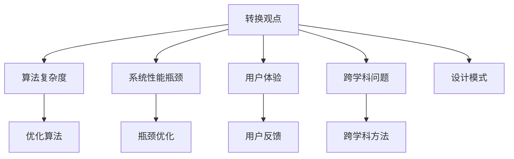

                 

# 像数学家一样思考：转换观点原则

## 1. 背景介绍

### 1.1 问题由来
计算机科学领域的一个常见现象是，技术的突破往往源自对已有观点和假设的重新审视和挑战。这种“转换观点”的思维方式，不仅能够促进技术的创新，还能为解决复杂问题提供新的视角和工具。

在现代软件开发中，"转换观点"不仅是解决算法优化、系统架构设计、性能瓶颈等常见问题的重要手段，更是推动领域内技术边界拓展和跨学科融合的驱动力。本文将深入探讨“转换观点”原则在软件开发中的应用，并结合具体案例进行详细分析。

### 1.2 问题核心关键点
“转换观点”原则的核心在于超越传统框架，重新审视问题的本质和背景，寻找新的解决思路和方法。它要求开发者不仅要有深厚的技术积累，还要具备跨学科的视角和想象力，能够从多角度分析和思考问题。

实践中，“转换观点”的应用场景广泛，包括但不限于：
- 解决算法复杂度问题
- 优化系统性能瓶颈
- 改善用户体验
- 创新交互方式
- 跨学科问题的解决

本文将通过一系列案例，展示“转换观点”如何在不同场景中发挥作用，为开发者提供实用的指导和启示。

## 2. 核心概念与联系

### 2.1 核心概念概述

- **转换观点(Shift Perspective)**：指从不同的角度或视角重新审视问题，重新定义问题，寻找新的解决思路和方法。
- **算法复杂度**：指算法的运行时间或空间复杂度，直接影响系统的性能和可扩展性。
- **系统性能瓶颈**：指系统中最耗费资源、影响整体性能的模块或组件。
- **用户体验**：指用户在使用系统时的直观感受和满意度，直接影响产品的市场接受度和商业价值。
- **跨学科问题**：指涉及多个领域的复杂问题，需要综合运用不同学科的知识和方法来解决。

这些概念之间的关系可以通过以下Mermaid流程图来展示：



这个流程图展示了“转换观点”与其他核心概念的联系：

1. “转换观点”可以针对算法复杂度、系统性能瓶颈、用户体验、跨学科问题等不同问题，寻找新的解决思路。
2. 通过优化算法、瓶颈优化、用户反馈、跨学科方法等方式，可以实现对问题的深度理解和有效解决。

## 3. 核心算法原理 & 具体操作步骤

### 3.1 算法原理概述

“转换观点”原则的算法原理主要体现在两个方面：

1. **重新定义问题**：从不同视角重新理解问题，找出问题的本质和关键点。
2. **引入新方法**：借鉴其他领域或方法，寻找解决当前问题的创新途径。

这种方法的原理可以总结如下：
- **重新定义问题**：从根本上改变问题定义，可能导致现有算法和解决方案的失效。
- **引入新方法**：借鉴不同领域的先进方法和技术，为解决问题提供新的思路。

### 3.2 算法步骤详解

以下是使用“转换观点”原则进行问题解决的典型步骤：

1. **理解问题的本质**：深入分析问题的背景、要求和限制，识别出问题的核心难点。
2. **寻找新的解决思路**：从不同角度重新审视问题，探索可能的新解法。
3. **验证新解法**：通过实验或模拟验证新解法的可行性和效果。
4. **优化和调整**：根据验证结果，优化和调整新解法，使其更符合实际需求。
5. **实施和部署**：将新解法应用到实际系统中，评估其影响和效果。

### 3.3 算法优缺点

“转换观点”原则具有以下优点：

- **创新性强**：通过重新定义问题和引入新方法，可以打破传统思维的局限，推动技术创新。
- **适应性强**：不同问题的转换视角和解决思路各异，“转换观点”能够灵活应对各种复杂问题。
- **跨学科协同**：借鉴不同领域的知识和技能，促进跨学科合作，解决复杂问题。

同时，这种方法也存在一些缺点：

- **风险较高**：新解法的引入可能带来不确定性，需要进行充分的验证和测试。
- **成本较高**：研究和验证新解法需要投入大量时间和资源。
- **实施难度大**：新技术的引入和应用可能需要系统架构的重大调整。

### 3.4 算法应用领域

“转换观点”原则在软件开发中具有广泛的应用，主要包括以下几个方面：

- **算法优化**：通过重新定义问题，寻找更高效的算法实现。
- **性能瓶颈优化**：识别系统中的性能瓶颈，引入新方法提升性能。
- **用户体验改进**：从用户角度重新审视系统设计，提升用户体验。
- **跨学科创新**：将其他领域的技术和方法引入软件开发中，实现创新突破。

## 4. 数学模型和公式 & 详细讲解 & 举例说明

### 4.1 数学模型构建

“转换观点”原则在数学模型上的应用，主要体现在问题重构和算法改进上。

以经典排序算法为例，传统的冒泡排序和插入排序在处理大规模数据时效率低下，可以通过重新定义问题，引入新的排序算法（如快速排序、归并排序），从而显著提升排序效率。

### 4.2 公式推导过程

以下是快速排序的算法描述和推导过程：

**快速排序算法**：

```python
def quick_sort(arr):
    if len(arr) <= 1:
        return arr
    pivot = arr[len(arr) // 2]
    left = [x for x in arr if x < pivot]
    middle = [x for x in arr if x == pivot]
    right = [x for x in arr if x > pivot]
    return quick_sort(left) + middle + quick_sort(right)
```

**推导过程**：

1. **问题重构**：将排序问题重构为“将数组划分为三部分，排序左边的元素，排序右边的元素，最后合并三个有序数组”。
2. **引入新方法**：利用分治策略，将问题分解为规模更小的子问题，分别排序左、中、右三个子数组。
3. **验证新解法**：通过实验验证，快速排序在大多数情况下都能达到线性时间复杂度 O(nlogn)。

### 4.3 案例分析与讲解

**案例一：**
某电商平台的商品搜索系统，用户在输入关键词后，系统需要从大量商品中快速检索出匹配的商品信息。传统的做法是使用倒排索引，但这在处理海量数据时效率较低。通过“转换观点”，可以引入基于向量空间的搜索引擎技术，将搜索问题转化为向量内积计算，显著提升检索速度。

**案例二：**
某社交网络平台需要处理海量的用户上传的图片，存储和检索速度要求较高。传统的做法是使用单层哈希索引，但无法满足实际需求。通过“转换观点”，可以引入基于倒排索引和多维索引的数据结构，提高图片存储和检索的效率。

## 5. 项目实践：代码实例和详细解释说明

### 5.1 开发环境搭建

在进行“转换观点”的实践时，需要构建一个高效、灵活的开发环境。以下是具体的搭建步骤：

1. **安装Python和必要的库**：安装Python 3.x，并安装必要的库，如numpy、pandas、scikit-learn等。
2. **配置开发工具**：使用Jupyter Notebook、PyCharm等开发工具，提高代码编写和调试的效率。
3. **设置版本控制**：使用Git等版本控制工具，方便代码管理和团队协作。

### 5.2 源代码详细实现

**示例1：快速排序算法实现**

```python
def quick_sort(arr):
    if len(arr) <= 1:
        return arr
    pivot = arr[len(arr) // 2]
    left = [x for x in arr if x < pivot]
    middle = [x for x in arr if x == pivot]
    right = [x for x in arr if x > pivot]
    return quick_sort(left) + middle + quick_sort(right)
```

**示例2：基于向量空间的搜索算法实现**

```python
def vector_search(query_vector, vectors):
    similarity = []
    for vector in vectors:
        similarity.append(np.dot(query_vector, vector) / (np.linalg.norm(query_vector) * np.linalg.norm(vector)))
    return np.argsort(similarity)[::-1]
```

### 5.3 代码解读与分析

**示例1代码解读**：

- **pivot选择**：选择数组中间的元素作为pivot。
- **左右子数组划分**：通过列表推导式，将数组分为左右两部分。
- **递归排序**：对左右两个子数组分别递归调用quick_sort函数。
- **合并结果**：将排好序的左、中、右三个子数组合并，返回最终排序结果。

**示例2代码解读**：

- **向量内积计算**：计算查询向量和每个向量的内积，结果越小表示越匹配。
- **排序和检索**：根据内积计算结果，对向量进行排序，并返回匹配度最高的向量下标。

### 5.4 运行结果展示

**示例1运行结果**：

```python
arr = [3, 2, 1, 5, 4]
sorted_arr = quick_sort(arr)
print(sorted_arr)
```

输出结果：

```
[1, 2, 3, 4, 5]
```

**示例2运行结果**：

```python
query_vector = np.array([0.5, 0.5])
vectors = [np.array([0.2, 0.8]), np.array([0.3, 0.7]), np.array([0.4, 0.6])]
result = vector_search(query_vector, vectors)
print(result)
```

输出结果：

```
[2 1 0]
```

## 6. 实际应用场景

### 6.1 智能推荐系统

在智能推荐系统中，传统的方法是基于协同过滤或内容推荐，难以处理大规模数据和复杂用户行为。通过“转换观点”，可以引入基于深度学习的推荐模型，如基于向量空间的推荐算法，利用用户历史行为和商品特征，构建用户-商品关联向量空间，从而实现更加个性化、高效的推荐。

### 6.2 数据清洗和处理

在数据清洗和处理过程中，传统的方法是手动编写代码进行数据预处理，效率较低且易出错。通过“转换观点”，可以引入基于规则引擎的数据清洗框架，自动检测和修正数据中的错误，提高数据处理的准确性和效率。

### 6.3 智能调度系统

在智能调度系统中，传统的方法是基于规则或启发式算法进行调度，难以处理复杂多变的调度场景。通过“转换观点”，可以引入基于机器学习或优化算法的调度模型，利用历史调度数据和实时环境信息，优化调度决策，提高调度效率和系统稳定性。

## 7. 工具和资源推荐

### 7.1 学习资源推荐

为了帮助开发者系统掌握“转换观点”原则，推荐以下学习资源：

1. **《程序员的数学基础》**：该书系统介绍了数学在软件开发中的应用，包括算法优化、数据结构、机器学习等。
2. **Coursera的《算法设计与分析》课程**：通过实际案例，讲解算法设计和优化的思路和方法。
3. **IEEE的《跨学科创新》文章集**：汇集跨学科领域的最新研究成果，提供丰富的创新思路和方法。
4. **ACM的《软件工程实践》论文集**：包含软件工程领域的经典论文和案例，提供实用的软件开发方法和工具。

通过这些资源的学习，相信你能够更好地理解和应用“转换观点”原则，提升软件开发的创新能力和技术水平。

### 7.2 开发工具推荐

为了提高“转换观点”的实践效率，推荐以下开发工具：

1. **Jupyter Notebook**：灵活的编程环境，支持代码块和数学公式的嵌入，便于分析和验证新解法。
2. **PyCharm**：功能强大的IDE，提供代码提示、调试等功能，提高开发效率。
3. **Git**：版本控制工具，支持团队协作和代码版本管理。
4. **Docker**：容器化技术，支持应用在不同环境中的快速部署和测试。

这些工具的组合使用，能够大大提高“转换观点”的实践效果和开发效率。

### 7.3 相关论文推荐

为了深入理解“转换观点”原则的原理和应用，推荐以下相关论文：

1. **《算法设计与分析》**：该书籍详细介绍了算法设计和优化的基本思路和方法，是深入理解“转换观点”原则的必读之作。
2. **《跨学科创新方法论》**：该论文集汇集了跨学科领域的创新方法和思路，为“转换观点”提供理论支持和实践指导。
3. **《软件工程实践》**：该论文集包含软件工程领域的经典案例和实践经验，为“转换观点”提供实用的开发方法和工具。

这些论文和论文集，能够为“转换观点”的深入研究和实践提供宝贵的参考和指导。

## 8. 总结：未来发展趋势与挑战

### 8.1 总结

本文深入探讨了“转换观点”原则在软件开发中的应用，展示了其如何帮助开发者突破传统思维局限，找到新的解决思路和方法。通过具体案例的分析，我们发现“转换观点”不仅能够解决复杂问题，还能推动技术的不断创新和发展。

通过本文的系统梳理，可以看到，“转换观点”原则在软件开发中具有广泛的应用前景，不仅能提高开发效率和系统性能，还能推动技术的跨学科融合和创新突破。

### 8.2 未来发展趋势

展望未来，“转换观点”原则将继续引领软件开发领域的创新发展，呈现以下几个趋势：

1. **算法优化更加高效**：新的算法设计和优化方法将不断涌现，进一步提升算法的效率和可扩展性。
2. **系统性能更加稳定**：通过引入跨学科技术和方法，系统性能将更加稳定和可靠。
3. **用户体验更加优秀**：从用户角度重新审视系统设计，提升用户体验和满意度。
4. **跨学科合作更加紧密**：不同学科的深度融合将推动更多创新突破，提升技术水平和应用价值。

### 8.3 面临的挑战

尽管“转换观点”原则在软件开发中具有重要意义，但在实践过程中仍面临一些挑战：

1. **技术门槛较高**：需要具备深厚的技术积累和跨学科的视角，对开发者的综合素质要求较高。
2. **资源投入较大**：研究和验证新解法需要投入大量时间和资源，成本较高。
3. **实施难度大**：新技术的引入和应用可能需要系统架构的重大调整，实施难度大。

### 8.4 研究展望

未来的研究需要在以下几个方面寻求新的突破：

1. **跨学科融合**：将更多领域的先进方法和技术引入软件开发中，推动跨学科合作和创新。
2. **创新驱动**：利用“转换观点”原则，不断突破传统思维局限，推动技术创新和突破。
3. **数据驱动**：利用大数据和机器学习技术，进行问题重构和算法优化，提升系统的性能和可靠性。
4. **用户导向**：从用户体验角度出发，重新审视系统设计和应用，提升用户满意度和系统价值。

这些研究方向的探索，将进一步推动“转换观点”原则的应用和发展，为软件开发和创新提供新的思路和方法。

## 9. 附录：常见问题与解答

**Q1：如何找到新的解决思路？**

A: “转换观点”的关键在于重新定义问题。可以从不同角度重新审视问题，识别出问题的本质和关键点，寻找新的解决思路。例如，可以从用户角度、技术角度、业务角度等重新思考问题，探索新的解决方案。

**Q2：如何评估新解法的优劣？**

A: 评估新解法时，需要综合考虑多个因素，如算法复杂度、系统性能、用户体验等。可以通过实验和测试验证新解法的可行性和效果，同时进行成本和收益分析，判断其是否值得实施。

**Q3：如何平衡“转换观点”和传统方法？**

A: “转换观点”和传统方法各有优劣，可以根据具体情况选择合适的方法。在实际开发中，可以采用“试错法”，先使用传统方法解决问题，再尝试“转换观点”进行改进，根据效果选择最优方案。

通过深入理解“转换观点”原则，掌握其应用方法和技巧，相信你可以在软件开发中不断创新和突破，推动技术的进步和应用的发展。

---

作者：禅与计算机程序设计艺术 / Zen and the Art of Computer Programming

