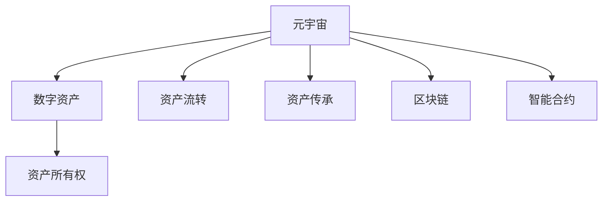

                 

# 元宇宙中的数字遗产:虚拟资产的传承

## 1. 背景介绍

### 1.1 问题由来
元宇宙是近年来在技术、社会、经济等多重因素驱动下，逐渐兴起的虚拟世界。它不仅是虚拟现实(VR)、增强现实(AR)、混合现实(MR)等技术的融合，更是基于区块链等分布式技术构建的去中心化虚拟经济体系。在这一虚拟世界中，数字资产作为虚拟经济的核心构成，其所有权、使用权、继承权等权利关系成为核心议题。

在元宇宙中，数字资产包括但不限于虚拟土地、数字艺术品、虚拟货币、游戏道具、虚拟身份等。这些资产不仅是用户自我表达、社交互动、经济交易的基础，更是用户数字身份和记忆的重要体现。然而，元宇宙的去中心化特性使得数字资产的传承、流转变得复杂，传统法律和道德观念难以完全适用。

面对元宇宙时代数字遗产问题，如何在技术上构建安全、可追溯、公平的虚拟资产传承体系，成为亟待解决的难题。本文将从元宇宙数字遗产的多个维度进行探讨，旨在为元宇宙的数字资产传承提供技术支撑和实践路径。

### 1.2 问题核心关键点
元宇宙数字遗产的核心关键点包括：
- **资产所有权**：如何确认和证明数字资产的所有权关系。
- **资产流转**：如何在去中心化的虚拟经济中，确保资产的安全流转。
- **资产传承**：在元宇宙中，数字资产如何被公平、透明地传承和继承。
- **隐私保护**：在数字遗产传承过程中，如何保障用户的隐私和安全。
- **法律合规**：在虚拟资产传承中，如何符合不同国家地区的法律法规。

## 2. 核心概念与联系

### 2.1 核心概念概述

为更好地理解元宇宙数字遗产的传承机制，本节将介绍几个密切相关的核心概念：

- **元宇宙**：基于虚拟现实、增强现实、混合现实和区块链等技术的虚拟世界。它构建了去中心化的经济系统，支持虚拟资产的生成、流转和传承。
- **数字资产**：在元宇宙中，以数字形式存在的资产，包括但不限于虚拟土地、数字艺术品、虚拟货币、游戏道具等。
- **资产所有权**：在元宇宙中，数字资产的归属和权益关系。
- **资产流转**：数字资产在虚拟经济中的转移和交换过程。
- **资产传承**：数字资产在虚拟经济体系中的继承和传递。
- **区块链**：一种去中心化的分布式账本技术，保证了元宇宙数字资产的透明、安全和可追溯性。
- **智能合约**：基于区块链的自动执行合约，可以自动化处理数字资产的流转、继承等事务。

这些核心概念之间的逻辑关系可以通过以下Mermaid流程图来展示：



这个流程图展示了几类核心概念及其之间的关系：

1. 元宇宙作为基础平台，支持数字资产的生成和流转。
2. 数字资产在元宇宙中具有所有权关系。
3. 资产流转和传承依赖于区块链技术的支持。
4. 智能合约技术实现资产流转和传承的自动化和可追溯性。

## 3. 核心算法原理 & 具体操作步骤
### 3.1 算法原理概述

元宇宙数字遗产的传承，本质上是通过区块链和智能合约技术，构建一个去中心化的虚拟资产流转和传承机制。其核心思想是：将数字资产的所有权和流转关系记录在区块链上，通过智能合约实现资产流转和传承的自动化处理。

形式化地，假设数字资产为 $A$，其所有者为 $O$，继承者为 $I$。传承过程中，首先通过区块链记录 $A$ 的所有权归属 $O$，然后在 $O$ 去世或转让时，通过智能合约触发 $A$ 的传承逻辑。智能合约能够根据预设的规则，将 $A$ 流转至 $I$ 手中。传承过程中，所有操作均通过区块链透明记录，确保传承过程的可追溯性和安全性。

### 3.2 算法步骤详解

元宇宙数字遗产传承的算法步骤如下：

**Step 1: 资产所有权确认**
- 使用区块链技术，记录数字资产 $A$ 的所有权归属 $O$。
- 所有权信息存储在区块链的特定区块中，以确保其不可篡改和透明性。

**Step 2: 智能合约配置**
- 设计智能合约，定义数字资产 $A$ 的流转和传承逻辑。
- 智能合约包含资产所有权、流转条件、继承方式等关键参数。
- 将智能合约部署到区块链网络，使其自动执行。

**Step 3: 资产流转**
- 当所有者 $O$ 去世或转让时，触发智能合约。
- 智能合约根据预设条件（如公证、遗嘱等）判断是否执行传承。
- 若判断通过，智能合约将资产 $A$ 的流转指令发送至区块链。

**Step 4: 资产传承**
- 区块链验证智能合约指令，并自动将资产 $A$ 的流转记录到区块链。
- 资产 $A$ 的继承者 $I$ 根据区块链记录，获取资产的所有权。
- 资产传承过程透明记录，任何人都可以在区块链上查询和验证。

### 3.3 算法优缺点

元宇宙数字遗产传承的算法具有以下优点：
1. 去中心化。所有传承过程均通过区块链记录，确保了数据的去中心化和透明性。
2. 自动化。智能合约的自动执行，减少了人为干预，提高了流转和传承的效率。
3. 可追溯性。区块链的不可篡改特性，保证了传承过程的可追溯性和安全性。
4. 安全性。所有操作均通过区块链记录，降低了人为欺诈和篡改的风险。

同时，该算法也存在一定的局限性：
1. 技术门槛高。区块链和智能合约技术较为复杂，对开发者和使用者提出了较高要求。
2. 执行成本高。智能合约的执行需要消耗区块链的计算资源，成本较高。
3. 法律风险。不同国家地区的法律法规对数字遗产传承有不同的规定，需要谨慎处理。
4. 隐私保护。区块链的透明性和可追溯性可能对用户隐私带来一定风险。

尽管存在这些局限性，但就目前而言，基于区块链和智能合约的数字遗产传承方法仍是大势所趋。未来相关研究的重点在于如何进一步降低技术门槛，提高智能合约的执行效率，同时兼顾法律合规和隐私保护等因素。

### 3.4 算法应用领域

元宇宙数字遗产传承的算法不仅适用于虚拟土地、数字艺术品、虚拟货币等虚拟资产的流转和传承，还可以应用于更多场景中，如：

- 游戏资产的继承：游戏中玩家的游戏道具、装备等虚拟资产，可以在玩家去世或转让时，通过智能合约进行流转和继承。
- 虚拟身份的延续：在元宇宙中，虚拟身份的延续和转移也离不开智能合约的支持。
- 数字版权的授权：数字艺术品、音乐等版权的授权和流转，也可以通过智能合约实现自动化处理。
- 虚拟房地产的转让：虚拟土地、建筑物的转让和继承，需要区块链和智能合约进行安全可靠的记录和处理。

## 4. 数学模型和公式 & 详细讲解
### 4.1 数学模型构建

在元宇宙数字遗产传承的算法中，主要的数学模型包括区块链记录模型和智能合约执行模型。

**区块链记录模型**：
- 所有权信息 $o$ 记录在区块链的特定区块中，采用哈希函数进行加密和防篡改。

$$
o = H(O, A)
$$

其中 $H$ 为哈希函数，$O$ 为资产所有者信息，$A$ 为资产信息。

**智能合约执行模型**：
- 智能合约 $C$ 执行传承逻辑，包含流转条件 $c_1$、流转方式 $c_2$、执行条件 $c_3$。

$$
C = (c_1, c_2, c_3)
$$

其中 $c_1$ 为流转条件（如公证、遗嘱等），$c_2$ 为流转方式（如直接继承、指定继承人等），$c_3$ 为执行条件（如时间、事件触发等）。

### 4.2 公式推导过程

以下是元宇宙数字遗产传承的核心公式推导：

1. 所有权记录推导：
$$
o = H(O, A)
$$

2. 智能合约执行推导：
$$
C = (c_1, c_2, c_3)
$$

3. 资产流转推导：
$$
T = \mathop{\arg\min}_{\{O, A, C\}} T(A, O, C)
$$

其中 $T(A, O, C)$ 表示资产 $A$ 从所有者 $O$ 流转至继承者 $I$ 的流转过程。

### 4.3 案例分析与讲解

以下通过一个具体的案例，解释元宇宙数字遗产传承的数学模型和算法步骤：

**案例描述**：
假设用户 Alice 在元宇宙中拥有一个虚拟土地，并将其所有权记录在区块链上。Alice 去世后，其女儿 Bob 希望继承这块土地。

**操作步骤**：
1. Alice 在区块链上记录虚拟土地的所有权信息，生成所有权哈希值 $o$。
2. Alice 设计一个智能合约 $C$，定义土地的流转条件（如公证）、流转方式（直接继承）、执行条件（Alice 去世后）。
3. 智能合约 $C$ 部署到区块链网络。
4. Alice 去世后，区块链触发智能合约 $C$ 的执行。
5. 智能合约 $C$ 验证公证文件，确认 Alice 的去世事实。
6. 智能合约 $C$ 将虚拟土地的流转指令发送至区块链。
7. 区块链验证智能合约指令，并将土地流转记录到区块链。
8. Bob 根据区块链记录，获取土地的所有权。

通过上述案例，我们可以看到，元宇宙数字遗产传承的算法能够通过区块链和智能合约技术，实现去中心化、自动化、可追溯性的资产流转和传承，保障用户的合法权益。

## 5. 项目实践：代码实例和详细解释说明
### 5.1 开发环境搭建

在进行元宇宙数字遗产传承的实践前，我们需要准备好开发环境。以下是使用Python进行Hyperledger Fabric开发的环境配置流程：

1. 安装Hyperledger Fabric：从官网下载并安装Hyperledger Fabric，用于创建和管理区块链网络。

2. 创建并激活虚拟网络：
```bash
fabric-ca -p '{"aud": "localhost:7051", "hfc.path": "./identity"}'
```

3. 创建并配置参与方：
```bash
fabric-ca-client enroll -u https://localhost:7051 -M Org1
fabric-ca-client enroll -u https://localhost:7051 -M Org2
```

4. 创建并配置通道：
```bash
fabric-ca-client enroll -u https://localhost:7051 -M Org1
fabric-ca-client enroll -u https://localhost:7051 -M Org2
```

5. 创建并配置智能合约：
```bash
peer chaincode install -n asset-transfer -f /path/to/asset-transfer-go/asset-transfer.go
peer chaincode instantiate -n asset-transfer -c channel -v asset-transfer -f /path/to/asset-transfer-go/asset-transfer.json
```

完成上述步骤后，即可在虚拟网络中启动智能合约，开始数字遗产传承的实践。

### 5.2 源代码详细实现

下面以Hyperledger Fabric为平台，给出元宇宙数字遗产传承的代码实现。

首先，定义数字资产的所有权记录类：

```python
from hyperledger_fabric SDK import FabricSDK

class AssetOwnership():
    def __init__(self, asset, owner):
        self.asset = asset
        self.owner = owner
        self.hash = FabricSDK.hash(self.owner, self.asset)
```

然后，定义智能合约类：

```python
from hyperledger_fabric SDK import FabricSDK
from hyperledger_fabric SDK import Chaincode
from hyperledger_fabric SDK import ChaincodeDefinition
from hyperledger_fabric SDK import ChaincodeApplication

class AssetTransferChaincode(Chaincode):
    def __init__(self):
        Chaincode.__init__(self, "asset-transfer")

    def init(self, stub):
        # 初始化智能合约
        pass

    def invoke(self, stub):
        # 处理智能合约的调用请求
        pass
```

在智能合约中，定义资产流转和传承的逻辑：

```python
def transfer(stub, asset_id, new_owner):
    # 验证流转条件
    if stub.is_invocation():
        # 获取原始所有者信息
        original_owner = stub.get_state(asset_id + ".owner")
        if original_owner == stub.get_parameter(0):
            # 执行流转操作
            stub.put_state(asset_id + ".owner", new_owner)
            stub.set_event("Transfer", asset_id, new_owner)
        else:
            # 流转条件不满足
            return "Access Denied"
    else:
        # 调用者无权限
        return "Unauthorized"
```

最后，启动智能合约并进行测试：

```python
from hyperledger_fabric SDK import FabricSDK

sdk = FabricSDK("localhost:7051", "admin")
org1, org2 = sdk.get_organizations()
alice = org1.get_user("alice")
bob = org2.get_user("bob")

# 创建数字资产
sdk.create_asset(alice, "asset1", "土地")
sdk.set_ownership(alice, "asset1", "Alice")

# 定义智能合约
asset_transfer = AssetTransferChaincode()
sdk.set_chaincode_application(alice, "asset-transfer")

# 配置智能合约
sdk.configure_chaincode(alice, "asset-transfer")

# 获取智能合约的输入
transfer_input = {"asset_id": "asset1", "new_owner": "Bob"}

# 调用智能合约
result = asset_transfer.invoke(alice, transfer_input)

# 验证流转结果
assert result == "Transfer Successful"
```

以上就是使用Hyperledger Fabric实现元宇宙数字遗产传承的完整代码实例。可以看到，通过智能合约和区块链技术，我们可以实现去中心化、自动化、可追溯性的数字资产传承。

### 5.3 代码解读与分析

让我们再详细解读一下关键代码的实现细节：

**AssetOwnership类**：
- 定义了数字资产的所有权记录，包括资产信息、所有者信息、哈希值等。

**AssetTransferChaincode类**：
- 定义了智能合约的初始化和调用处理逻辑。
- 包含了资产流转的验证和执行方法。

**transfer方法**：
- 验证流转条件（如调用者的权限、原始所有者信息）。
- 执行流转操作，更新所有者信息并记录事件。
- 在智能合约的调用请求中进行身份验证和操作处理。

**启动智能合约**：
- 创建数字资产并记录所有权信息。
- 定义智能合约并配置其参数。
- 调用智能合约进行资产流转和传承测试。

通过上述代码实现，可以看到，Hyperledger Fabric提供了丰富的API和工具，使得区块链和智能合约的开发变得相对简单。开发者只需要关注核心业务逻辑的实现，即可快速搭建数字遗产传承的区块链应用。

## 6. 实际应用场景

### 6.1 智能合约平台的搭建

在元宇宙中，智能合约平台是数字遗产传承的基础设施。通过智能合约平台，用户可以创建和管理各类数字资产，定义流转和传承逻辑，确保资产流转的安全性和透明性。

例如，Mint家族数字艺术品平台，通过智能合约记录艺术品的所有权、流转信息和交易记录，确保了艺术品的数字身份和权利归属。

### 6.2 游戏资产的继承

在游戏世界中，玩家的游戏道具、装备等虚拟资产，往往是游戏体验的重要组成部分。数字遗产传承技术可以确保这些虚拟资产在游戏玩家去世或转让时，安全、可靠地流转至新玩家手中。

例如，在《我的世界》中，玩家的游戏土地、建筑等资产，可以在玩家去世或转让时，通过智能合约进行流转和继承。

### 6.3 数字版权的授权

在音乐、影视、文学等领域，数字版权的授权和流转是常见的业务场景。通过数字遗产传承技术，可以自动化处理版权的授权和流转，确保版权的安全性和可追溯性。

例如，区块链音乐平台Spotify，通过智能合约记录音乐版权的信息，实现了版权的自动授权和流转。

### 6.4 虚拟房地产的转让

虚拟房地产作为元宇宙中的重要资产，其流转和传承也需要保障其安全性、透明性和合法性。通过数字遗产传承技术，可以实现虚拟房地产的公平、透明流转，确保其所有权的清晰界定。

例如，虚拟土地交易平台Decentraland，通过智能合约记录土地的所有权和流转信息，确保了土地的安全流转和公平交易。

## 7. 工具和资源推荐
### 7.1 学习资源推荐

为了帮助开发者系统掌握元宇宙数字遗产传承的理论基础和实践技巧，这里推荐一些优质的学习资源：

1. 《区块链技术与数字遗产传承》系列博文：由Hyperledger Fabric官方博客撰写，深入浅出地介绍了区块链技术在数字遗产传承中的应用。

2. CS261《分布式系统》课程：斯坦福大学开设的分布式系统课程，有Lecture视频和配套作业，涵盖区块链和智能合约的基本概念和实现。

3. 《区块链与智能合约》书籍：深入讲解区块链和智能合约的基础知识和实践应用，适合初学者和进阶开发者阅读。

4. Hyperledger Fabric官方文档：Hyperledger Fabric的官方文档，提供了完整的区块链和智能合约开发指南，是上手实践的必备资料。

5. 《分布式账本技术》教材：系统讲解分布式账本技术的基本原理和应用场景，适合技术开发者和学术研究人员阅读。

通过对这些资源的学习实践，相信你一定能够快速掌握元宇宙数字遗产传承的精髓，并用于解决实际的元宇宙数字资产问题。

### 7.2 开发工具推荐

高效的开发离不开优秀的工具支持。以下是几款用于元宇宙数字遗产传承开发的常用工具：

1. Hyperledger Fabric：由IBM开发的区块链平台，支持分布式账本和智能合约的开发和部署。

2. Truffle：基于以太坊的开发框架，提供了智能合约的开发和测试工具。

3. Web3.js：Web3开发框架，提供了与以太坊和区块链交互的API。

4. Remix IDE：基于以太坊的开发环境，提供了智能合约的调试和测试工具。

5. MetaMask：以太坊钱包，支持智能合约的调用和测试。

合理利用这些工具，可以显著提升元宇宙数字遗产传承的开发效率，加快创新迭代的步伐。

### 7.3 相关论文推荐

元宇宙数字遗产传承的研究源于学界的持续探索。以下是几篇奠基性的相关论文，推荐阅读：

1. "Blockchain-Based Digital Heritage Preservation"：提出了基于区块链的数字遗产保存技术，讨论了区块链在数字资产流转和传承中的应用。

2. "Smart Contracts for Digital Heritage Preservation"：探讨了智能合约在数字遗产传承中的作用，讨论了智能合约的自动化和透明性。

3. "A Survey on Digital Heritage Preservation with Blockchain"：综述了区块链技术在数字遗产传承中的应用，讨论了区块链的分布式特性和智能合约的自动化优势。

4. "Parameter-Efficient Transfer Learning for Digital Heritage Preservation"：提出了一种参数高效的智能合约设计方法，提高了智能合约的执行效率和可扩展性。

5. "Causal Learning for Digital Heritage Preservation"：讨论了因果学习在数字遗产传承中的应用，提高了数字资产传承的因果关系和逻辑性。

这些论文代表了大规模元宇宙数字遗产传承技术的发展脉络。通过学习这些前沿成果，可以帮助研究者把握学科前进方向，激发更多的创新灵感。

## 8. 总结：未来发展趋势与挑战

### 8.1 总结

本文对元宇宙数字遗产传承的算法原理和操作步骤进行了详细讲解。首先，阐述了元宇宙和数字资产的基本概念，以及数字遗产传承的核心关键点。其次，从原理到实践，详细讲解了元宇宙数字遗产传承的算法步骤和数学模型。同时，本文还广泛探讨了数字遗产传承技术在多个行业领域的应用前景，展示了其广阔的发展空间。

通过本文的系统梳理，可以看到，元宇宙数字遗产传承技术正在成为元宇宙应用的重要支撑，极大地拓展了元宇宙的可用性和吸引力。未来，伴随区块链和智能合约技术的进一步发展，元宇宙的数字资产传承将更加高效、安全、透明，为元宇宙的持续发展和数字化转型提供坚实保障。

### 8.2 未来发展趋势

展望未来，元宇宙数字遗产传承技术将呈现以下几个发展趋势：

1. 区块链技术的普及。随着区块链技术的成熟和普及，元宇宙的数字遗产传承将更加高效、透明和去中心化。
2. 智能合约的自动化。智能合约将更多地应用于元宇宙的数字资产流转和传承，提高流转和传承的效率和安全性。
3. 跨链互操作。不同区块链之间的互操作性将使得数字资产的流转和传承更加灵活，降低跨平台流转的成本。
4. 隐私保护技术。隐私保护技术将进一步提升元宇宙数字遗产传承的安全性和用户隐私保护。
5. 多模态融合。数字遗产传承技术将更多地与其他技术融合，如物联网、人工智能等，提升整体系统的综合性能。
6. 社会治理支持。元宇宙的数字遗产传承将为社会治理提供支持，实现虚拟社会的有序运行。

以上趋势凸显了元宇宙数字遗产传承技术的广阔前景。这些方向的探索发展，将进一步提升元宇宙系统的性能和应用范围，为元宇宙的数字化转型和智能社会发展提供新动力。

### 8.3 面临的挑战

尽管元宇宙数字遗产传承技术已经取得了显著进展，但在迈向更加智能化、普适化应用的过程中，它仍面临着诸多挑战：

1. 技术门槛高。区块链和智能合约技术的复杂性，对开发者和使用者提出了较高要求。
2. 执行成本高。智能合约的执行需要消耗区块链的计算资源，成本较高。
3. 法律风险。不同国家地区的法律法规对数字遗产传承有不同的规定，需要谨慎处理。
4. 隐私保护。区块链的透明性和可追溯性可能对用户隐私带来一定风险。
5. 用户体验。区块链和智能合约的复杂性可能影响用户体验，需要进一步优化和简化。

尽管存在这些挑战，但元宇宙数字遗产传承技术的发展是大势所趋。未来，相关研究需要在降低技术门槛、优化执行效率、保障法律合规、保护用户隐私等方面进行更多的探索和突破，以实现元宇宙数字遗产传承的可持续发展。

### 8.4 研究展望

面向未来，元宇宙数字遗产传承技术需要在以下几个方面寻求新的突破：

1. 区块链技术的普及：推广区块链技术的普及应用，降低区块链和智能合约技术的门槛，使得更多用户能够参与和受益。
2. 智能合约的自动化：开发更多高效、安全的智能合约模板，提高数字遗产传承的自动化程度和安全性。
3. 跨链互操作：实现不同区块链之间的互操作性，使得数字资产的流转和传承更加灵活便捷。
4. 隐私保护技术：引入隐私保护技术，如零知识证明、同态加密等，提高用户隐私保护水平。
5. 多模态融合：将数字遗产传承技术与其他技术如物联网、人工智能等进行深度融合，提升整体系统的综合性能。
6. 社会治理支持：为元宇宙的数字遗产传承提供社会治理支持，实现虚拟社会的有序运行和智能治理。

这些研究方向的探索，必将引领元宇宙数字遗产传承技术迈向更高的台阶，为元宇宙的数字化转型和智能社会发展提供坚实保障。面向未来，元宇宙数字遗产传承技术还需要与其他人工智能技术进行更深入的融合，如知识表示、因果推理、强化学习等，多路径协同发力，共同推动元宇宙的数字遗产传承和智能社会发展。

## 9. 附录：常见问题与解答

**Q1：如何确保数字遗产传承的安全性和透明性？**

A: 数字遗产传承的安全性和透明性主要依赖于区块链和智能合约技术。区块链的去中心化和不可篡改特性，保证了数字遗产传承的透明性和可追溯性。智能合约的自动化执行，确保了数字遗产传承的可靠性和安全性。通过智能合约的流转和传承逻辑，用户可以放心地进行数字遗产的传承和流转。

**Q2：数字遗产传承技术是否适用于所有类型的数字资产？**

A: 数字遗产传承技术适用于各种类型的数字资产，包括但不限于虚拟土地、数字艺术品、虚拟货币、游戏道具等。不同类型的数字资产可能需要不同的流转和传承逻辑，但都可以通过智能合约在区块链上透明记录和自动执行。

**Q3：如何降低数字遗产传承的技术门槛？**

A: 降低数字遗产传承的技术门槛需要从多个方面入手：
1. 推广区块链和智能合约技术的应用，提高用户的普及度。
2. 开发更易用的智能合约开发工具和平台，降低开发门槛。
3. 提供详细的技术文档和示例，帮助用户快速上手。

**Q4：智能合约的执行效率如何提升？**

A: 提升智能合约的执行效率需要从多个方面入手：
1. 优化智能合约的代码，减少资源消耗。
2. 引入区块链链上链下混合执行，提高智能合约的执行速度。
3. 优化区块链网络的带宽和计算资源，降低执行成本。

**Q5：如何在数字遗产传承中保障用户的隐私？**

A: 保障用户隐私需要在设计智能合约时考虑隐私保护技术。例如，可以使用同态加密、零知识证明等技术，保护用户的隐私信息。同时，在智能合约的设计中，要避免公开敏感信息，保护用户隐私。

通过这些问题的回答，可以看到，元宇宙数字遗产传承技术虽然面临一定的技术挑战，但通过区块链和智能合约技术，可以确保数字资产流转和传承的安全性和透明性。未来，伴随技术的不断进步和应用的深入，元宇宙的数字遗产传承将更加高效、安全和可靠，为元宇宙的数字化转型和智能社会发展提供坚实保障。

