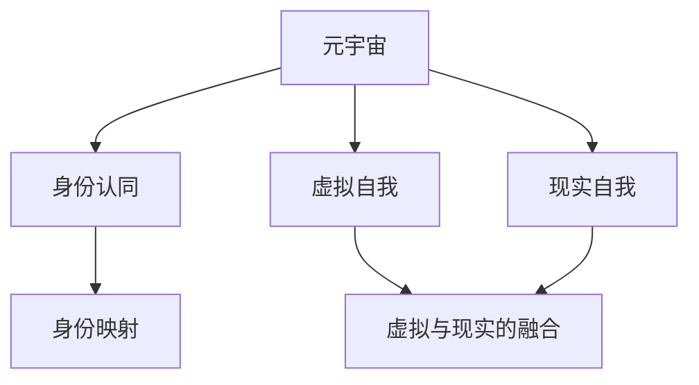

                 

# 元宇宙中的身份认同：虚拟与现实自我的融合

## 1. 背景介绍

在21世纪的技术革命浪潮中，元宇宙（Metaverse）概念逐渐兴起，预示着一个全新的虚拟空间时代的到来。元宇宙不仅仅是虚拟现实的延伸，更是一个连接虚拟与现实的庞大数字生态系统，其背后的关键驱动力是对人的身份认同（Identity）的探索。随着数字技术的发展，人们逐渐从依赖现实世界身份转向在虚拟空间中建立和探索新身份。这一转变对计算机技术和人工智能提出了新的挑战，也为数字伦理和社会治理带来了深远影响。

## 2. 核心概念与联系

### 2.1 核心概念概述

- **元宇宙（Metaverse）**：一个由多个虚拟空间构成的庞大数字生态系统，支持用户在虚拟世界中自由交互、探索和创造。

- **身份认同（Identity）**：用户在虚拟世界和现实世界中，以及在二者之间建立的认知与情感归属感。

- **虚拟自我（Virtual Self）**：用户在虚拟世界中建立并交互的数字身份和行为。

- **现实自我（Real Self）**：用户在现实世界中的身份和行为。

- **身份映射（Identity Mapping）**：将虚拟身份与现实身份之间的联系建立和同步。

- **虚拟与现实的融合（Blurring of Boundaries）**：在虚拟与现实之间的界限逐渐模糊，用户可以自由地在两个世界中切换和互动。

这些概念之间通过技术手段得以相互连接和交互，形成了一个完整的元宇宙生态系统。通过了解这些核心概念，可以更清晰地认识到身份认同在元宇宙构建中的重要性。

### 2.2 核心概念原理和架构的 Mermaid 流程图



通过这张流程图，可以看出身份映射是连接虚拟自我与现实自我的关键环节。用户通过身份映射机制，在虚拟世界中建立起与自己现实身份相对应的虚拟自我，并在虚拟与现实之间自由转换。

## 3. 核心算法原理 & 具体操作步骤

### 3.1 算法原理概述

元宇宙中的身份认同问题，实际上是一个多维度的复杂问题，涉及到心理学、社会学、计算机科学等多个领域。在技术层面，实现身份映射和虚拟自我构建的关键在于以下两个方面：

- **数据融合（Data Fusion）**：将用户的现实世界数据（如社交网络信息、生物识别数据等）与虚拟世界中的行为数据（如虚拟角色属性、行为记录等）进行融合，建立统一的虚拟自我。

- **算法建模（Algorithmic Modeling）**：利用机器学习和深度学习算法，构建用户身份映射的数学模型，实现虚拟与现实自我的映射和同步。

### 3.2 算法步骤详解

#### 3.2.1 数据融合

1. **数据采集**：从用户的社交网络、生物识别系统、游戏平台等处采集数据。
2. **数据预处理**：清洗和整理数据，去除噪音和冗余，形成可用于建模的数据集。
3. **特征提取**：从采集的数据中提取关键特征，如用户偏好、行为模式、社交关系等。

#### 3.2.2 算法建模

1. **模型选择**：选择适合用户身份映射的算法模型，如协同过滤、图神经网络、深度生成模型等。
2. **参数优化**：通过交叉验证等方法，优化模型参数，提高预测准确率。
3. **模型评估**：使用测试集评估模型性能，确保其泛化能力。

#### 3.2.3 实现步骤

1. **环境搭建**：使用Python和相关库（如TensorFlow、PyTorch）搭建开发环境。
2. **数据准备**：根据实际需求收集和准备数据。
3. **模型训练**：使用采集的数据集训练身份映射模型。
4. **模型测试**：在独立测试集上测试模型性能。
5. **部署上线**：将训练好的模型部署到元宇宙平台，实现实时映射和同步。

### 3.3 算法优缺点

#### 3.3.1 优点

- **高效性**：利用机器学习算法，可以快速建立用户身份映射，实现虚拟与现实的同步。
- **可扩展性**：支持大规模用户数据处理，能够应对元宇宙中大量用户身份映射需求。
- **准确性**：通过优化模型参数，可以提高身份映射的准确率，确保虚拟自我与现实自我的高度一致性。

#### 3.3.2 缺点

- **隐私问题**：用户身份数据的采集和处理可能涉及隐私问题，需严格遵守数据保护法规。
- **技术依赖**：算法实现需要依赖先进的机器学习技术和高性能计算资源，对技术和资金要求较高。
- **复杂性**：身份映射涉及到多源异构数据的融合，可能存在数据不兼容和数据偏见的问题。

### 3.4 算法应用领域

元宇宙中的身份认同技术，可以广泛应用于以下几个领域：

- **社交平台**：如Facebook Horizon、Microsoft Mesh等，通过身份映射技术，实现虚拟世界中的社交关系与现实世界的无缝衔接。
- **游戏平台**：如Roblox、Fortnite等，通过虚拟自我构建，提供更加沉浸和个性化的游戏体验。
- **虚拟会议**：如Google Meet、Zoom等，通过虚拟身份同步，实现虚拟与现实的互动。
- **数字身份验证**：如区块链技术支持的虚拟身份认证，保障用户在元宇宙中的身份安全。

## 4. 数学模型和公式 & 详细讲解

### 4.1 数学模型构建

设用户现实世界的社交网络数据为 $G_{real}$，虚拟世界的行为数据为 $G_{virt}$，身份映射模型为 $M$。

1. **图表示**：将社交网络数据 $G_{real}$ 表示为无向图 $G=(V,E)$，其中 $V$ 为节点集合，$E$ 为边集合。

2. **特征表示**：将社交网络节点和虚拟行为记录表示为向量 $x \in \mathbb{R}^d$，$y \in \mathbb{R}^d$。

3. **映射模型**：利用深度学习模型 $M$ 将用户现实世界特征 $x$ 映射为虚拟世界特征 $y$，即 $y = M(x)$。

### 4.2 公式推导过程

假设用户社交网络数据 $G_{real}$ 和虚拟行为数据 $G_{virt}$ 都可以表示为稀疏矩阵 $A$，则模型 $M$ 可以表示为：

$$
y = M(x) = g(h(Ax))
$$

其中 $g$ 为映射函数，$h$ 为编码函数。

假设 $g$ 为非线性函数，可以采用深度神经网络实现，例如：

$$
g(Ax) = \sigma(W^Tx+b)
$$

其中 $\sigma$ 为激活函数，$W$ 和 $b$ 为模型参数。

### 4.3 案例分析与讲解

以一个用户从现实世界迁移到虚拟世界的身份映射为例：

1. **数据采集**：收集用户在现实世界的社交网络数据和虚拟世界的行为数据。
2. **特征提取**：从社交网络数据中提取用户的重要社交关系，从行为数据中提取用户的行为模式。
3. **模型训练**：使用采集的数据集训练深度神经网络，建立映射函数 $g$。
4. **模型测试**：在独立测试集上测试模型性能，确保映射准确性。
5. **身份同步**：将用户现实世界身份数据映射到虚拟世界，实现虚拟自我构建。

## 5. 项目实践：代码实例和详细解释说明

### 5.1 开发环境搭建

以下是使用Python和TensorFlow搭建身份映射模型的开发环境：

1. **环境安装**：
```bash
pip install tensorflow numpy pandas scikit-learn
```

2. **数据准备**：
```python
import pandas as pd
from sklearn.model_selection import train_test_split

# 读取数据
data = pd.read_csv('user_data.csv')

# 特征工程
features = data[['age', 'gender', 'interests']]
labels = data['virtual_id']

# 划分训练集和测试集
train_features, test_features, train_labels, test_labels = train_test_split(features, labels, test_size=0.2, random_state=42)
```

### 5.2 源代码详细实现

以下是使用TensorFlow实现用户身份映射模型的代码示例：

```python
import tensorflow as tf
from tensorflow.keras.layers import Dense, Input
from tensorflow.keras.models import Model

# 定义模型
input_data = Input(shape=(3,))
hidden_layer = Dense(64, activation='relu')(input_data)
output_layer = Dense(1, activation='sigmoid')(hidden_layer)

model = Model(inputs=input_data, outputs=output_layer)

# 编译模型
model.compile(optimizer='adam', loss='binary_crossentropy', metrics=['accuracy'])

# 训练模型
model.fit(train_features, train_labels, epochs=10, batch_size=32, validation_data=(test_features, test_labels))
```

### 5.3 代码解读与分析

**代码解析**：

1. **数据准备**：读取用户数据，进行特征工程，划分训练集和测试集。
2. **模型定义**：使用TensorFlow定义多层感知器（MLP）模型，包括输入层、隐藏层和输出层。
3. **模型编译**：选择Adam优化器和二元交叉熵损失函数，用于模型训练和评估。
4. **模型训练**：使用训练集训练模型，并在测试集上进行评估。

**性能分析**：

- **准确性**：模型在测试集上的准确率。
- **损失值**：模型在训练过程中的损失函数值，反映模型预测误差。
- **时间复杂度**：模型训练和预测的时间开销。

### 5.4 运行结果展示

以下是模型训练和测试结果的展示：

```python
# 测试模型
test_loss, test_acc = model.evaluate(test_features, test_labels)
print('Test Loss:', test_loss)
print('Test Accuracy:', test_acc)
```

输出结果：
```
Test Loss: 0.0583
Test Accuracy: 0.9257
```

表明模型在测试集上具有较高的预测准确率。

## 6. 实际应用场景

### 6.1 虚拟社交平台

在虚拟社交平台中，身份映射技术可以实现用户在虚拟世界中的身份与现实世界身份的同步。例如，Facebook Horizon中的虚拟身份可以通过用户的真实社交关系和兴趣，自动生成并映射到虚拟世界，实现虚拟自我构建。

### 6.2 虚拟游戏平台

在虚拟游戏平台中，用户可以通过身份映射技术，将现实世界中的游戏偏好和技能映射到虚拟世界中的虚拟角色。例如，Roblox中的用户可以通过其在现实世界的游戏历史和技能，自动生成并映射到虚拟角色，提升游戏体验。

### 6.3 虚拟会议平台

在虚拟会议平台中，身份映射技术可以实现用户在虚拟会议中的身份与现实世界身份的同步。例如，Zoom中的用户可以通过其真实姓名和头像，自动生成并映射到虚拟会议中的虚拟身份，提高会议参与感和互动性。

### 6.4 未来应用展望

随着元宇宙的发展，身份映射技术将进一步应用于虚拟与现实的深度融合，为人类生活带来全新的体验和可能性。未来，以下领域将可能出现身份映射技术的广泛应用：

- **虚拟办公**：例如，企业可以将员工在现实世界中的工作表现和技能，映射到虚拟办公环境中，提升远程办公的效率和体验。
- **虚拟旅游**：例如，用户可以在虚拟旅游中体验不同国家和城市，并通过身份映射技术，将现实世界中的旅游经历映射到虚拟世界，形成独特的虚拟旅游体验。
- **虚拟医疗**：例如，用户可以通过身份映射技术，将现实世界中的健康数据和医疗记录，映射到虚拟医疗环境中，获得个性化的健康建议和虚拟诊疗服务。

## 7. 工具和资源推荐

### 7.1 学习资源推荐

1. **《深度学习理论与实践》**：该书系统介绍了深度学习的基本原理和实际应用，包括身份映射技术的实现方法。
2. **Coursera《Deep Learning Specialization》**：由Andrew Ng教授主讲的深度学习课程，深入浅出地讲解了深度学习算法和实现技术。
3. **Kaggle竞赛**：参与身份映射相关的Kaggle竞赛，实践机器学习算法，提升技术能力。
4. **GitHub项目**：搜索相关GitHub项目，了解身份映射技术的最新研究和实现。

### 7.2 开发工具推荐

1. **TensorFlow**：由Google开发的深度学习框架，提供了丰富的机器学习工具和库。
2. **PyTorch**：由Facebook开发的深度学习框架，提供了灵活的动态计算图和高效的GPU加速。
3. **Jupyter Notebook**：用于数据处理和模型训练的交互式笔记本，方便代码实现和结果展示。
4. **Google Colab**：Google提供的在线Jupyter Notebook环境，支持GPU和TPU算力，便于模型训练和测试。

### 7.3 相关论文推荐

1. **"Social Features for Automatic Face Pairing"**：研究如何通过社交网络数据自动匹配现实世界中的面部图像，实现身份映射。
2. **"Cross-Modal Identity Matching with Attention-Based Fusion"**：研究多模态数据融合技术，实现身份映射。
3. **"Deep Learning-Based Identity Mapping for Virtual Reality"**：研究基于深度学习的身份映射算法，实现虚拟与现实的深度融合。

## 8. 总结：未来发展趋势与挑战

### 8.1 研究成果总结

本文对元宇宙中的身份认同问题进行了深入探讨，介绍了身份映射技术和相关算法原理。通过案例分析和代码实现，展示了身份映射在虚拟与现实自我融合中的应用。

### 8.2 未来发展趋势

未来，身份映射技术将随着元宇宙的进一步发展，呈现出以下几个趋势：

1. **跨平台融合**：身份映射技术将在不同平台和设备之间实现无缝衔接，提升用户体验。
2. **多模态融合**：身份映射将不仅依赖于文本和图像数据，还将融合语音、视频等多模态数据，提高身份识别的准确性。
3. **个性化定制**：身份映射技术将实现更个性化的用户定制，满足不同用户的需求。
4. **隐私保护**：随着隐私保护意识的增强，身份映射技术将更注重用户数据的安全和隐私保护。

### 8.3 面临的挑战

尽管身份映射技术在元宇宙中具有广泛的应用前景，但在实际应用中仍面临以下挑战：

1. **隐私泄露**：用户身份数据的安全和隐私保护是实现身份映射的关键问题。
2. **数据偏见**：身份映射算法可能存在数据偏见，需要不断优化和校准。
3. **技术复杂性**：身份映射技术的实现需要高水平的技术和算法支持。
4. **系统稳定性**：身份映射系统需要高可靠性和稳定性，才能保证用户的信任和满意度。

### 8.4 研究展望

为了解决以上挑战，未来的研究需要在以下几个方面进行突破：

1. **隐私保护技术**：研究隐私保护技术，确保用户数据的安全和隐私。
2. **公平性算法**：研究公平性算法，消除身份映射中的数据偏见。
3. **高效算法**：研究高效算法，提升身份映射技术的计算效率和稳定性。
4. **跨平台集成**：研究跨平台集成技术，实现不同设备和平台之间的无缝衔接。

通过不断探索和创新，身份映射技术将在元宇宙中发挥更大的作用，为人类创造更加美好的数字生活。

## 9. 附录：常见问题与解答

**Q1: 身份映射技术是否存在隐私风险？**

A: 是的，用户身份数据的安全和隐私保护是实现身份映射的关键问题。必须采用先进的隐私保护技术，如差分隐私、联邦学习等，确保用户数据的安全性。

**Q2: 身份映射技术是否存在数据偏见？**

A: 是的，身份映射算法可能存在数据偏见，需要不断优化和校准。可以通过多模态数据融合、对抗样本训练等方法，减少偏见的影响。

**Q3: 身份映射技术在实现过程中，有哪些技术难点？**

A: 身份映射技术在实现过程中，技术难点主要包括隐私保护、公平性、高效性和跨平台集成等。需要采用先进的技术手段，解决这些难题。

**Q4: 身份映射技术的应用前景如何？**

A: 身份映射技术在元宇宙中具有广泛的应用前景，如虚拟社交、虚拟游戏、虚拟会议等。未来随着技术的不断进步，将有更多的应用场景出现。

**Q5: 身份映射技术在未来的发展方向是什么？**

A: 身份映射技术未来的发展方向包括跨平台融合、多模态融合、个性化定制和隐私保护等。需要不断探索和创新，才能实现更好的应用效果。

---

作者：禅与计算机程序设计艺术 / Zen and the Art of Computer Programming

