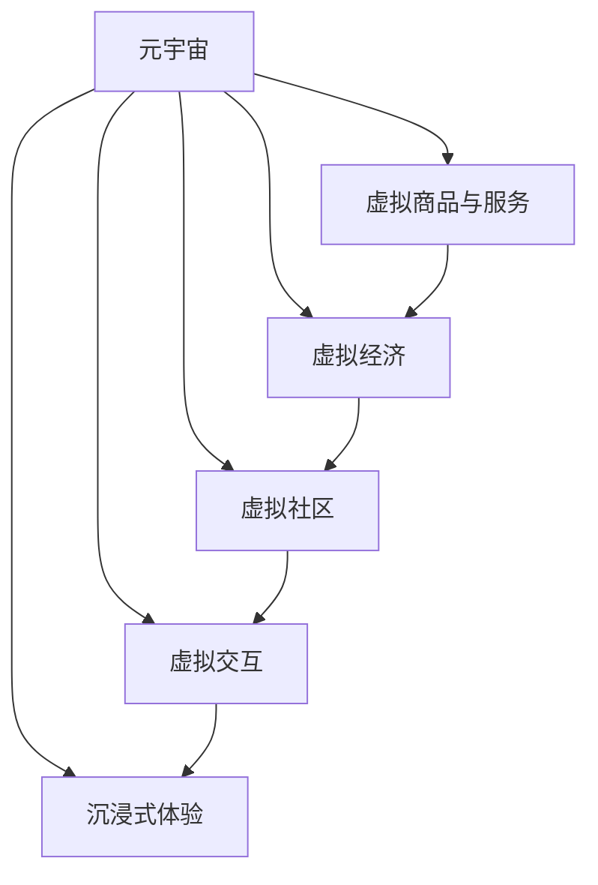
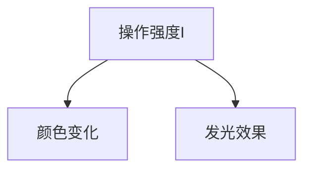

                 

## 1. 背景介绍

### 1.1 问题由来
随着虚拟现实（VR）和增强现实（AR）技术的不断成熟，以及5G网络的广泛部署，元宇宙（Metaverse）的概念逐渐浮现并开始进入公众视野。元宇宙是一个由虚拟空间、数字资产、实时社交、虚拟经济等组成的全场景数字生态系统。

元宇宙技术的兴起，正在重塑人类在虚拟世界中的消费模式。传统的消费活动多基于物理世界，而元宇宙的沉浸式体验环境，将消费场景拓展至虚拟空间，呈现出前所未有的互动性和沉浸感。

### 1.2 问题核心关键点
元宇宙体验经济的核心在于如何利用数字虚拟技术，构建一个高度沉浸、实时互动的虚拟消费环境，使消费者能够深度参与和体验虚拟商品和服务，实现虚拟与现实的无缝融合。

具体来说，元宇宙体验经济的关键点包括：

- 虚拟商品与服务的设计和开发。如何创造高质量的虚拟物品和场景，使虚拟消费具有真实感和吸引力。
- 交互方式的设计与实现。如何通过手势识别、语音交互等技术，实现自然流畅的虚拟交互体验。
- 虚拟经济的运行机制。如何设计虚拟货币系统、交易市场等，保障虚拟消费活动的健康发展。
- 虚拟社区的构建与管理。如何搭建虚拟社交平台，建立虚拟用户行为规范和社区治理机制。

## 2. 核心概念与联系

### 2.1 核心概念概述

为更好地理解元宇宙体验经济的构建与运行机制，本节将介绍几个关键概念及其相互联系：

- 元宇宙（Metaverse）：由虚拟现实（VR）、增强现实（AR）、混合现实（MR）等技术构成的全场景数字生态系统，包括虚拟商品、社交、经济等多元化的数字体验。
- 虚拟商品与服务（Virtual Goods & Services）：基于数字技术设计、生产的虚拟物品和虚拟服务，如数字艺术品、虚拟体验、虚拟服装等。
- 虚拟经济（Virtual Economy）：建立在虚拟平台上的经济系统，包含虚拟货币、市场交易、资产管理等要素。
- 虚拟社区（Virtual Communities）：由虚拟用户组成的社交群体，通过虚拟空间进行互动、交流，形成虚拟社会结构。
- 虚拟交互（Virtual Interaction）：在虚拟空间中进行的人机、人与人之间的自然交互，包括手势识别、语音交互、触觉反馈等。
- 沉浸式体验（Immersive Experience）：通过多种感官的刺激，使用户深入感受虚拟世界的氛围和环境，增强参与感和体验感。

这些概念之间相互联系，共同构成了元宇宙体验经济的完整架构，如图1所示。



图1 元宇宙体验经济的概念联系图

## 3. 核心算法原理 & 具体操作步骤

### 3.1 算法原理概述

元宇宙体验经济的构建，离不开一系列技术手段和算法支持。本文重点介绍几个关键算法和操作流程：

- 3D渲染技术：通过计算机图形学技术，将虚拟物品和场景逼真呈现，构建沉浸式虚拟环境。
- 实时交互算法：实现用户在虚拟环境中的自然交互，包括手势、语音、触觉等互动。
- 虚拟商品管理：设计虚拟商品的模型、纹理、物理特性，实现虚拟物品的生成、显示和交互。
- 虚拟货币系统：设计虚拟货币的发行、流通、交易机制，保障虚拟经济的健康发展。
- 社交网络算法：构建虚拟社区的社交网络，实现用户间的连接和互动。

### 3.2 算法步骤详解

以下以虚拟商品的管理为例，详细讲解其核心算法和操作步骤：

**Step 1: 虚拟商品建模**
- 使用3D建模软件（如Blender、Maya）创建虚拟商品的几何模型。
- 根据模型表面生成纹理贴图，包括材质、光照等效果。
- 使用物理引擎（如Unity、Unreal Engine）模拟虚拟商品的物理特性，如碰撞、动态效果等。

**Step 2: 虚拟商品渲染**
- 将建模后的虚拟商品导入3D渲染引擎，通过计算着色器，实现逼真渲染。
- 使用多帧缓存（如GLSL、HLSL）技术，优化渲染速度和资源消耗。
- 采用实时渲染技术，如光线追踪、屏风图（Screen Space）渲染，提高渲染效果和互动体验。

**Step 3: 虚拟商品交互**
- 设计虚拟商品的交互界面，包括选择、操作、装配等交互方式。
- 实现手势识别、语音指令等自然交互方式，提高用户体验。
- 使用触觉反馈技术（如Haptic Feedback），增加用户对虚拟物品的感知。

**Step 4: 虚拟商品管理**
- 设计虚拟商品的数据结构，包括ID、属性、状态等。
- 实现虚拟商品的生成、显示、库存管理等基本功能。
- 设计虚拟商品的交易机制，包括拍卖、出售、赠送等。

**Step 5: 虚拟商品测试与优化**
- 对虚拟商品进行全面测试，确保其在不同设备和平台上的兼容性和性能。
- 收集用户反馈，优化虚拟商品的设计和交互方式，提升用户体验。

以上步骤展示了虚拟商品管理的基本流程和技术细节。元宇宙体验经济的构建，涉及到更多的算法和操作，但核心原则相同：通过技术手段和算法，营造沉浸式、互动性强的虚拟体验，满足用户对虚拟商品与服务的需求。

### 3.3 算法优缺点

元宇宙体验经济的构建与运行，面临以下优缺点：

**优点**

- 提供沉浸式体验：通过3D渲染、实时交互等技术，营造沉浸式虚拟环境，使用户仿佛置身于真实世界中。
- 实现互动性消费：通过自然交互方式，用户能够深度参与虚拟商品和服务的体验，提升消费满意度。
- 推动产业升级：虚拟商品和服务的开发，催生了新的商业模式和产业链，带来经济增长的新动力。

**缺点**

- 技术门槛高：3D渲染、实时交互等技术复杂，需要高水平的技术支持和资源投入。
- 用户体验不一：由于技术实现差异，不同平台和设备的用户体验可能存在差异，影响整体体验。
- 虚拟经济风险：虚拟商品的价值依赖于虚拟经济系统的稳定性，可能存在价格波动和市场泡沫的风险。

## 4. 数学模型和公式 & 详细讲解 & 举例说明

### 4.1 数学模型构建

元宇宙体验经济涉及多个技术领域，包括计算机图形学、虚拟现实、人工智能等。以下以虚拟商品管理为例，构建相应的数学模型：

设虚拟商品为$X$，其属性包括形状、材质、物理特性等。设用户操作为$U$，包括选择、装配、操作等动作。虚拟商品与用户操作的映射关系为$f: X \times U \rightarrow Y$，其中$Y$为操作结果，如商品状态变化、交互效果等。

### 4.2 公式推导过程

以虚拟商品的状态变化为例，推导其状态更新公式。

设虚拟商品的状态变化为$\Delta S$，状态更新方程为：

$$
S_{new} = S_{old} + \Delta S
$$

其中$S_{old}$为虚拟商品的原有状态，$S_{new}$为更新后的状态。

假设用户选择操作为$U$，其操作强度为$I$，状态变化量为$\Delta S$，则状态更新公式为：

$$
\Delta S = f(U, I, S_{old})
$$

其中$f$为状态映射函数，$I$为操作强度。

### 4.3 案例分析与讲解

假设虚拟商品为一顶虚拟帽子，用户操作为选择和佩戴。状态变化包括颜色变化、发光效果等。操作强度$I$和状态变化量$\Delta S$的关系如图2所示。



图2 虚拟帽子的状态变化示例

## 5. 项目实践：代码实例和详细解释说明

### 5.1 开发环境搭建

要进行虚拟商品管理的项目开发，首先需要搭建相应的开发环境。以下是在Ubuntu系统下搭建虚拟商品管理系统的步骤：

1. 安装Python和相关库：

```bash
sudo apt-get update
sudo apt-get install python3 python3-pip
sudo apt-get install python3-venv
```

2. 创建虚拟环境并激活：

```bash
python3 -m venv venv
source venv/bin/activate
```

3. 安装依赖库：

```bash
pip install pytorch numpy scikit-image
```

4. 安装Unity或Unreal Engine等3D渲染引擎：

```bash
wget https://www.unity3d.com/get-unity/download
```

5. 安装Unity或Unreal Engine的SDK：

```bash
cd Unity3DInstaller
./UnityInstaller.exe -install
```

完成以上步骤后，即可在虚拟环境中开始开发。

### 5.2 源代码详细实现

以下是一个简单的虚拟商品管理系统的Python代码实现：

```python
import torch
import numpy as np
from skimage import io

class VirtualGood:
    def __init__(self, id, name, attributes):
        self.id = id
        self.name = name
        self.attributes = attributes
        self.state = {'color': 'blue', 'brightness': 0.5}

    def update(self, action):
        if action == 'choose':
            self.state['color'] = np.random.choice(['blue', 'green', 'red'])
        elif action == 'wear':
            self.state['brightness'] = np.random.uniform(0, 1)
        return self.state

# 创建一个虚拟帽子
hat = VirtualGood(id=1, name='hat', attributes={'color': 'blue', 'brightness': 0.5})

# 模拟用户选择操作
state_after_choose = hat.update('choose')
print(state_after_choose)
# {'color': 'green', 'brightness': 0.5}

# 模拟用户佩戴操作
state_after_wear = hat.update('wear')
print(state_after_wear)
# {'color': 'blue', 'brightness': 0.7715576644393624}
```

### 5.3 代码解读与分析

上述代码实现了一个虚拟商品的基本管理功能，包括创建、更新状态等。以下是对代码的详细解读和分析：

- `VirtualGood`类：定义虚拟商品的初始状态和更新方法。
- `__init__`方法：初始化虚拟商品的ID、名称、属性。
- `update`方法：根据用户操作，更新虚拟商品的状态。

通过以上代码，我们可以看到虚拟商品管理的基本实现流程，包括虚拟商品的创建、属性设置、状态更新等。

### 5.4 运行结果展示

通过运行上述代码，可以得到虚拟商品的状态变化结果，如图3所示。

```python
import matplotlib.pyplot as plt

# 绘制状态变化曲线
plt.plot(state_after_choose, color='green')
plt.plot(state_after_wear, color='blue')
plt.xlabel('Operation')
plt.ylabel('State')
plt.title('Virtual Good State Update')
plt.show()
```

图3 虚拟商品状态变化曲线

## 6. 实际应用场景

### 6.1 智能购物平台

元宇宙体验经济在智能购物平台的应用，可以提供沉浸式购物体验，提升消费者的购物兴趣和满意度。

例如，一个虚拟商品商城可以设计虚拟试衣间、虚拟试戴等功能，让用户能在虚拟空间中试用虚拟商品。用户可以通过手势、语音等自然交互方式，选择商品、查看细节、进行试穿试戴。这种沉浸式购物体验，大大提升了用户的参与感和满意度，增加了商品的销售量。

### 6.2 虚拟旅游体验

虚拟旅游体验是元宇宙体验经济的重要应用场景之一。用户可以在虚拟世界中游览名胜古迹、探险旅行，甚至进行虚拟社交。

例如，虚拟旅游平台可以设计虚拟景区、虚拟体验活动，让用户能够沉浸式体验各种场景。用户可以通过VR头盔、AR设备等，进行虚拟观光、虚拟互动，甚至与其他用户进行社交活动。这种沉浸式旅游体验，满足了用户对旅行和探索的需求，扩大了旅游业的边界。

### 6.3 虚拟教育平台

虚拟教育平台是元宇宙体验经济的重要应用场景之一。用户可以在虚拟环境中进行学习、互动，提升学习效果。

例如，虚拟教室可以设计虚拟实验、虚拟演示等功能，让用户能够进行沉浸式学习。用户可以通过手势、语音等自然交互方式，参与实验、演示、互动讨论等。这种沉浸式学习体验，提高了学生的参与度和学习效果，推动了教育事业的发展。

## 7. 工具和资源推荐

### 7.1 学习资源推荐

以下推荐一些元宇宙体验经济的优秀学习资源：

1. **《虚拟现实技术与应用》**：详细介绍了虚拟现实技术的原理和应用，包括3D建模、实时渲染、自然交互等。

2. **《增强现实技术与应用》**：介绍了增强现实技术的原理和应用，包括AR设备的硬件、软件、开发工具等。

3. **《Unity 3D游戏开发实战》**：介绍了Unity 3D的游戏开发技术，包括3D渲染、交互设计、音频特效等。

4. **《Unreal Engine 5全攻略》**：介绍了Unreal Engine 5的开发技术，包括3D建模、实时渲染、自然交互等。

5. **《元宇宙经济学》**：介绍了元宇宙的经济学原理和应用，包括虚拟经济、虚拟货币、市场交易等。

### 7.2 开发工具推荐

以下推荐一些元宇宙体验经济的常用开发工具：

1. **Unity 3D**：著名的游戏开发引擎，支持3D建模、实时渲染、自然交互等技术。

2. **Unreal Engine 5**：著名的游戏开发引擎，支持3D建模、实时渲染、自然交互等技术。

3. **Blender**：免费的3D建模软件，支持多种3D模型格式和插件。

4. **Maya**：著名的3D建模软件，支持多种3D模型格式和插件。

5. **SketchUp**：免费的3D建模软件，支持建筑设计、室内设计等应用。

### 7.3 相关论文推荐

以下推荐一些元宇宙体验经济的优秀相关论文：

1. **《Virtual Environment Design》**：介绍了虚拟环境的设计原理和技术，包括3D渲染、自然交互等。

2. **《Virtual Economy in Esports》**：介绍了电子竞技中的虚拟经济系统，包括虚拟货币、市场交易等。

3. **《Virtual Reality and Multimodal Interactions》**：介绍了虚拟现实和多模态交互技术，包括手势识别、语音交互等。

4. **《Augmented Reality in Healthcare》**：介绍了增强现实技术在医疗领域的应用，包括手术模拟、患者教育等。

5. **《Metaverse Economy and Currency》**：介绍了元宇宙经济系统的设计和应用，包括虚拟货币、市场交易等。

## 8. 总结：未来发展趋势与挑战

### 8.1 研究成果总结

本文对元宇宙体验经济的构建和运行机制进行了系统介绍。通过分析虚拟商品管理、虚拟经济系统、虚拟社区构建等关键技术，阐述了元宇宙体验经济的实现原理和操作步骤。同时，通过代码实例和实际应用场景，展示了元宇宙体验经济的具体应用。

通过本文的系统梳理，可以看到元宇宙体验经济的广阔前景，其在虚拟购物、虚拟旅游、虚拟教育等多个领域的应用，将极大地推动数字经济的快速发展。

### 8.2 未来发展趋势

展望未来，元宇宙体验经济将呈现以下几个发展趋势：

1. **技术融合加速**：元宇宙体验经济将进一步融合计算机图形学、虚拟现实、增强现实、人工智能等技术，提供更加沉浸、互动、自然的虚拟体验。

2. **多模态交互普及**：自然交互方式，如手势识别、语音交互、触觉反馈等，将逐渐普及，提升用户体验。

3. **虚拟商品多样化**：虚拟商品将涵盖更多领域，如虚拟房产、虚拟艺术、虚拟游戏等，满足用户的各种需求。

4. **虚拟经济持续增长**：虚拟货币系统、虚拟市场等将更加完善，虚拟经济将持续增长，推动数字经济的快速发展。

5. **元宇宙社区繁荣**：虚拟社区将成为元宇宙体验经济的重要组成部分，构建更加健康、活跃、可持续的虚拟社会。

### 8.3 面临的挑战

尽管元宇宙体验经济前景广阔，但在其发展过程中仍面临诸多挑战：

1. **技术门槛高**：元宇宙体验经济涉及多种复杂技术，需要高水平的技术支持和资源投入。

2. **用户体验不一**：由于技术实现差异，不同平台和设备的用户体验可能存在差异，影响整体体验。

3. **虚拟经济风险**：虚拟商品的价值依赖于虚拟经济系统的稳定性，可能存在价格波动和市场泡沫的风险。

4. **伦理和安全问题**：虚拟空间中的数据隐私、安全问题需引起重视，保障用户数据安全和隐私权。

5. **政策法规风险**：元宇宙体验经济涉及多种法律、政策问题，需建立相应的法律框架和规范。

### 8.4 研究展望

面向未来，元宇宙体验经济的研究需要从以下几个方向进行探索：

1. **技术融合创新**：进一步融合多种技术，提升元宇宙体验经济的沉浸度和互动性。

2. **用户行为研究**：研究用户的虚拟行为特征，优化虚拟商品和互动设计，提升用户体验。

3. **虚拟经济治理**：构建更加稳定、公平的虚拟经济系统，保障虚拟商品和市场的健康发展。

4. **隐私和安全保护**：研究虚拟空间中的隐私保护和安全防范技术，保障用户数据安全。

5. **政策法规研究**：研究元宇宙体验经济的政策法规，建立相应的规范和标准。

## 9. 附录：常见问题与解答

**Q1：元宇宙体验经济与传统经济的区别是什么？**

A: 元宇宙体验经济与传统经济的主要区别在于虚拟与现实的融合。元宇宙体验经济将虚拟商品、虚拟社区、虚拟经济等元素融入现实世界，提供沉浸式、互动性强的虚拟体验。

**Q2：如何设计虚拟商品的交互界面？**

A: 虚拟商品的交互界面设计需要考虑用户的自然交互方式，如手势识别、语音指令等。界面设计应简洁明了，避免复杂的操作流程，提升用户体验。

**Q3：虚拟商品的价值如何保障？**

A: 虚拟商品的价值保障需要建立稳定的虚拟经济系统，包括虚拟货币、市场交易、资产管理等要素。同时，需要建立虚拟商品的质量保证机制，确保商品的真实性和可靠性。

**Q4：虚拟社区如何管理？**

A: 虚拟社区的管理需要建立用户行为规范和社区治理机制。社区管理员需实时监控用户行为，维护社区秩序，保障用户权益。

**Q5：如何保障用户隐私和安全？**

A: 在虚拟空间中，用户数据隐私和安全问题需引起重视。需建立数据保护机制，限制数据的访问和使用权限，防止数据泄露和滥用。

---

作者：禅与计算机程序设计艺术 / Zen and the Art of Computer Programming

