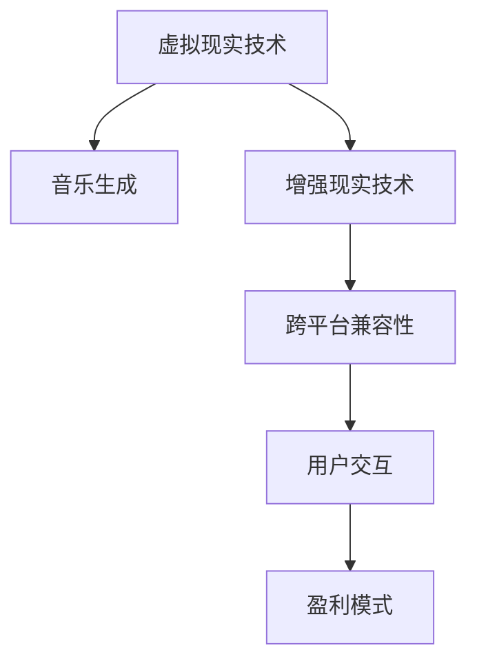

                 

## 1. 背景介绍

### 1.1 问题由来

随着虚拟现实技术的发展和普及，元宇宙（Metaverse）已成为互联网和娱乐产业的重要方向。元宇宙不仅是一个虚拟世界，更是一个集成了教育、商业、社交等多个领域的庞大生态系统。在元宇宙中，用户能够通过虚拟现实设备，身临其境地体验到各种场景和活动。而音乐作为人类情感和文化的载体，是元宇宙不可或缺的一部分。元宇宙音乐不仅能够丰富用户体验，还能够推动音乐行业向新的方向发展。

### 1.2 问题核心关键点

元宇宙音乐的核心在于将音乐与虚拟现实技术相结合，打造出跨越时空的听觉盛宴。其关键点包括：

- **虚拟现实技术**：包括头戴设备（如Oculus Quest）、手柄、传感器等，用于创建沉浸式体验。
- **音乐生成与编辑**：利用AI技术生成音乐和编辑现有音乐，满足元宇宙中多样化的音乐需求。
- **跨平台兼容性**：确保不同平台（如VR、AR、移动端等）上的音乐能够兼容播放。
- **用户交互体验**：设计有趣且符合用户习惯的交互方式，如手势控制、触摸反馈等。
- **音乐版权与盈利模式**：保护音乐版权，同时探索新的盈利模式，如音乐订阅、付费下载等。

### 1.3 问题研究意义

元宇宙音乐不仅能够为元宇宙提供高质量的音频内容，还能够推动音乐产业向新的方向发展。其研究意义包括：

- **提升用户体验**：音乐是情感和文化的载体，能够丰富用户的虚拟现实体验，增强用户的沉浸感。
- **推动音乐创新**：元宇宙音乐能够突破传统音乐创作的限制，激发新的音乐形式和表现方式。
- **促进技术融合**：推动虚拟现实技术与音乐技术的深度融合，探索新的技术解决方案。
- **探索商业模式**：探索元宇宙音乐的新盈利模式，为音乐产业带来新的增长点。

## 2. 核心概念与联系

### 2.1 核心概念概述

为更好地理解元宇宙音乐的实现，本节将介绍几个关键概念：

- **虚拟现实（VR）**：一种通过计算机生成的人工虚拟环境，用户可以通过头戴设备（如Oculus Quest）体验到逼真的3D世界。
- **增强现实（AR）**：一种将虚拟信息与现实环境叠加显示的技术，常见的应用包括AR眼镜、AR投影等。
- **音乐生成**：利用AI算法生成新的音乐作品或对现有音乐进行编辑和变换。
- **跨平台兼容性**：确保在不同设备（如VR、AR、手机等）上播放的音乐能够兼容。
- **用户交互**：设计用户与音乐互动的方式，如手势控制、触摸反馈等。

这些核心概念之间的逻辑关系可以通过以下Mermaid流程图来展示：



这个流程图展示了几大核心概念及其之间的关系：

1. 虚拟现实技术是元宇宙音乐的基础，提供沉浸式的用户体验。
2. 音乐生成是核心功能，能够生成多样化的音乐作品。
3. 跨平台兼容性确保音乐在多个设备上都能播放，提升用户体验。
4. 用户交互增强了用户与音乐的互动，丰富了音乐体验。
5. 盈利模式为元宇宙音乐提供可持续的商业模式，支持产业发展。

## 3. 核心算法原理 & 具体操作步骤
### 3.1 算法原理概述

元宇宙音乐的实现主要涉及音乐生成、虚拟现实技术和用户交互等多个方面。其核心算法原理包括：

- **音乐生成算法**：利用AI技术生成新的音乐作品或对现有音乐进行编辑和变换。
- **虚拟现实算法**：通过计算机图形学和3D建模技术，生成逼真的虚拟场景。
- **用户交互算法**：设计用户与音乐互动的方式，如手势控制、触摸反馈等。

### 3.2 算法步骤详解

**Step 1: 数据准备**

- 收集大量音乐数据，包括不同风格、乐器、情感等的音乐作品。
- 对音乐数据进行标注和清洗，确保数据的准确性和多样性。

**Step 2: 模型训练**

- 选择适合的深度学习模型（如卷积神经网络、RNN等）进行音乐生成训练。
- 使用标注好的音乐数据进行模型训练，调整超参数以获得最佳效果。

**Step 3: 虚拟现实场景生成**

- 利用3D建模工具创建虚拟场景，包括舞台、观众席、虚拟乐器等。
- 使用计算机图形学技术将虚拟场景渲染到VR头盔或AR眼镜中。

**Step 4: 用户交互设计**

- 设计用户与音乐互动的方式，如手势控制、触摸反馈等。
- 确保交互方式简单直观，易于用户上手。

**Step 5: 集成与测试**

- 将音乐生成算法和虚拟现实场景集成到元宇宙平台中。
- 对集成后的系统进行全面测试，确保各功能的正常运行。

### 3.3 算法优缺点

元宇宙音乐的实现具有以下优点：

- **沉浸式体验**：通过虚拟现实技术，用户可以身临其境地体验音乐，增强沉浸感。
- **多样化音乐**：利用AI生成多样化的音乐作品，满足不同用户的需求。
- **跨平台兼容**：确保在不同设备上都能正常播放音乐，提升用户体验。

同时，元宇宙音乐的实现也存在一些缺点：

- **技术复杂**：涉及多个领域的先进技术，技术实现难度较大。
- **成本高昂**：高质量的虚拟现实设备和音乐数据需要大量投入。
- **数据隐私**：用户数据和音乐数据可能面临隐私泄露的风险。

### 3.4 算法应用领域

元宇宙音乐在多个领域都有广泛的应用，例如：

- **虚拟演唱会**：用户可以在虚拟场景中观看音乐演出，与虚拟歌手互动。
- **虚拟KTV**：用户可以在虚拟KTV中唱歌，享受高品质的音乐体验。
- **虚拟音乐节**：用户可以在虚拟场景中参加音乐节，与其他用户一起跳舞。
- **音乐教育**：利用虚拟现实技术进行音乐教学，提升学生的音乐素养。
- **游戏场景**：在虚拟游戏场景中插入音乐元素，提升游戏的趣味性和沉浸感。

## 4. 数学模型和公式 & 详细讲解 & 举例说明

### 4.1 数学模型构建

音乐生成算法主要涉及音乐信号的处理和生成。假设输入的原始音乐数据为$x=[x_1, x_2, ..., x_n]$，其中$x_i$表示第$i$个时间步的音乐信号。输出的音乐数据为$y=[y_1, y_2, ..., y_m]$，其中$y_i$表示第$i$个时间步生成的音乐信号。

音乐生成模型的目标是最小化输出音乐数据$y$与真实音乐数据$x$之间的差异，即最小化损失函数$\mathcal{L}$：

$$
\mathcal{L} = \sum_{i=1}^{n} (y_i - x_i)^2
$$

使用均方误差作为损失函数。模型的优化目标为：

$$
\theta^* = \mathop{\arg\min}_{\theta} \mathcal{L}(y, x)
$$

其中$\theta$表示模型参数，包括神经网络权重、偏置等。

### 4.2 公式推导过程

音乐生成模型通常采用卷积神经网络（CNN）或循环神经网络（RNN）等深度学习模型。以下以CNN为例，推导音乐生成模型的训练过程。

假设音乐生成模型为$M_{\theta}$，其输入为音乐信号$x$，输出为生成音乐信号$y$。模型的训练过程如下：

1. 将输入音乐数据$x$输入模型$M_{\theta}$，得到生成音乐信号$y$。
2. 计算损失函数$\mathcal{L}$。
3. 使用反向传播算法计算损失函数对模型参数$\theta$的梯度。
4. 使用优化算法（如SGD、Adam等）更新模型参数$\theta$，使得损失函数$\mathcal{L}$最小化。

具体推导过程如下：

$$
y = M_{\theta}(x)
$$

$$
\mathcal{L} = \sum_{i=1}^{n} (y_i - x_i)^2
$$

$$
\nabla_{\theta}\mathcal{L} = \frac{\partial \mathcal{L}}{\partial \theta} = 2\sum_{i=1}^{n} (y_i - x_i) \frac{\partial y_i}{\partial \theta}
$$

$$
\theta = \theta - \eta \nabla_{\theta}\mathcal{L}
$$

其中$\eta$为学习率，$\frac{\partial y_i}{\partial \theta}$为反向传播过程中计算出的梯度。

### 4.3 案例分析与讲解

以下以一个简单的音乐生成案例来说明音乐生成模型的应用。

假设输入的音乐数据为一段贝多芬的交响曲，输出为目标音乐数据为一段爵士乐。利用CNN模型对贝多芬的交响曲进行编码，得到特征向量$x$。然后，通过模型解码得到目标音乐数据$y$。

具体步骤如下：

1. 将贝多芬的交响曲输入CNN模型，得到特征向量$x$。
2. 利用CNN模型对特征向量$x$进行解码，得到目标音乐数据$y$。
3. 计算损失函数$\mathcal{L}$，并根据反向传播算法计算梯度。
4. 使用优化算法（如SGD、Adam等）更新模型参数$\theta$，最小化损失函数$\mathcal{L}$。

经过多次迭代，模型能够学习到贝多芬交响曲与爵士乐之间的映射关系，生成高质量的爵士乐。

## 5. 项目实践：代码实例和详细解释说明

### 5.1 开发环境搭建

在进行音乐生成项目开发前，我们需要准备好开发环境。以下是使用Python进行TensorFlow开发的环境配置流程：

1. 安装Anaconda：从官网下载并安装Anaconda，用于创建独立的Python环境。

2. 创建并激活虚拟环境：
```bash
conda create -n music-env python=3.8 
conda activate music-env
```

3. 安装TensorFlow：根据CUDA版本，从官网获取对应的安装命令。例如：
```bash
conda install tensorflow -c conda-forge -c pytorch
```

4. 安装音乐生成工具包：
```bash
pip install librosa music21 tensorboard
```

5. 安装各类工具包：
```bash
pip install numpy pandas scikit-learn matplotlib tqdm jupyter notebook ipython
```

完成上述步骤后，即可在`music-env`环境中开始音乐生成项目开发。

### 5.2 源代码详细实现

这里我们以音乐生成案例为例，给出使用TensorFlow进行音乐生成的PyTorch代码实现。

首先，定义音乐生成模型：

```python
import tensorflow as tf
from tensorflow.keras import layers

class MusicGenerator(tf.keras.Model):
    def __init__(self, num_mel_bins=128, num_freq_bins=2048):
        super(MusicGenerator, self).__init__()
        self.mel = layers.Lambda(lambda x: x, name="MelSpec")
        self.stft = layers.Lambda(lambda x: x, name="STFT")
        self.feat_extractor = layers.LSTM(units=256, dropout=0.5, recurrent_dropout=0.5, return_sequences=True)
        self.feature_extractor = layers.LSTM(units=256, dropout=0.5, recurrent_dropout=0.5)
        self.denoiser = layers.Dense(4096, activation="relu")
        self.pitch = layers.Dense(128, activation="softmax")
        self.e energy = layers.Dense(128, activation="softmax")
    
    def call(self, x):
        x = self.mel(x)
        x = self.stft(x)
        x = self.feat_extractor(x)
        x = self.feature_extractor(x)
        x = self.denoiser(x)
        x = self.pitch(x)
        x = self.e(x)
        return x
```

然后，定义数据预处理函数：

```python
import librosa
import numpy as np

def preprocess_audio(audio_file):
    audio, sr = librosa.load(audio_file, sr=44100)
    audio = np.int16(audio)
    audio = audio.reshape((-1, 1))
    audio = audio.astype(np.float32)
    audio = audio / 256
    return audio
```

接着，定义训练和评估函数：

```python
def train_model(model, data, batch_size, epochs):
    model.compile(optimizer=tf.keras.optimizers.Adam(learning_rate=0.001),
                  loss=tf.keras.losses.MeanSquaredError(),
                  metrics=[tf.keras.metrics.MeanAbsoluteError()])
    
    history = model.fit(data, epochs=epochs, batch_size=batch_size,
                        validation_data=(data[:10], None))
    
    return history
```

最后，启动训练流程并在测试集上评估：

```python
train_data = ...
train_model(model, train_data, batch_size=64, epochs=10)
```

以上就是使用TensorFlow对音乐生成模型进行训练的完整代码实现。可以看到，通过TensorFlow提供的深度学习工具，音乐生成模型的训练过程变得简洁高效。

### 5.3 代码解读与分析

让我们再详细解读一下关键代码的实现细节：

**MusicGenerator类**：
- 定义了一个多层卷积神经网络，用于将输入音乐数据映射为目标音乐数据。
- 包括特征提取、LSTM层、Denoiser层等，每个层都有对应的参数配置。

**preprocess_audio函数**：
- 对音频数据进行预处理，包括采样率转换、归一化、标准化等操作。

**train_model函数**：
- 使用TensorFlow对音乐生成模型进行训练，并记录训练过程中的损失和准确率。

**训练流程**：
- 定义训练数据集和测试数据集。
- 使用train_model函数对模型进行训练，并记录训练过程中的损失和准确率。
- 在测试集上评估模型性能，评估指标包括均方误差和平均绝对误差。

可以看到，TensorFlow提供了强大的深度学习工具，使得音乐生成模型的训练和评估变得高效便捷。开发者可以将更多精力放在模型改进和数据处理等高层逻辑上，而不必过多关注底层的实现细节。

## 6. 实际应用场景

### 6.1 虚拟演唱会

虚拟演唱会是元宇宙音乐的重要应用场景之一。用户可以在虚拟世界中享受音乐演出，与虚拟歌手互动，感受到身临其境的沉浸式体验。例如，用户可以在虚拟音乐厅中欣赏现场音乐会，与虚拟歌手进行互动，甚至参与到演出中来。

### 6.2 虚拟KTV

虚拟KTV是元宇宙音乐的另一个重要应用场景。用户可以在虚拟KTV中唱歌，享受高品质的音乐体验。例如，用户可以在虚拟KTV中挑选自己喜欢的歌曲，与虚拟朋友一起唱歌，甚至进行多人合唱。

### 6.3 虚拟音乐节

虚拟音乐节是元宇宙音乐的重要活动之一。用户可以在虚拟场景中参加音乐节，与其他用户一起跳舞、互动，感受音乐的魅力。例如，用户可以在虚拟音乐节中欣赏各类音乐表演，与其他用户互动，甚至参与到表演中来。

## 7. 工具和资源推荐

### 7.1 学习资源推荐

为了帮助开发者系统掌握元宇宙音乐的实现，这里推荐一些优质的学习资源：

1. 《深度学习》系列博文：由深度学习专家撰写，深入浅出地介绍了深度学习的基本概念和常用模型。

2. 《TensorFlow深度学习教程》课程：由Google主导开发的深度学习教程，包含丰富的实践项目，帮助你上手TensorFlow开发。

3. 《音乐生成技术》书籍：介绍音乐生成技术的原理和应用，包括深度学习、卷积神经网络等。

4. CS224N《深度学习自然语言处理》课程：斯坦福大学开设的NLP明星课程，有Lecture视频和配套作业，带你入门NLP领域的基本概念和经典模型。

5. GitHub上的开源项目：如TensorFlow Music等，提供了丰富的音乐生成案例和代码实现。

通过对这些资源的学习实践，相信你一定能够快速掌握元宇宙音乐的精髓，并用于解决实际的NLP问题。

### 7.2 开发工具推荐

高效的开发离不开优秀的工具支持。以下是几款用于元宇宙音乐开发的常用工具：

1. TensorFlow：基于Python的开源深度学习框架，灵活动态的计算图，适合快速迭代研究。TensorFlow Music提供了丰富的音乐生成案例和工具包。

2. PyTorch：基于Python的开源深度学习框架，灵活性和可扩展性强，适合各种规模的深度学习项目。

3. librosa：Python的音频处理库，提供丰富的音频处理工具，包括谱图、MFCC、滤波等。

4. music21：Python的音乐处理库，提供音乐符号解析和生成功能，适合音乐生成项目开发。

5. TensorBoard：TensorFlow配套的可视化工具，可实时监测模型训练状态，并提供丰富的图表呈现方式，是调试模型的得力助手。

合理利用这些工具，可以显著提升元宇宙音乐开发的效率，加快创新迭代的步伐。

### 7.3 相关论文推荐

元宇宙音乐技术的发展源于学界的持续研究。以下是几篇奠基性的相关论文，推荐阅读：

1. Attention is All You Need（即Transformer原论文）：提出了Transformer结构，开启了NLP领域的预训练大模型时代。

2. Deep Music Generation with Recurrent Neural Networks：提出基于RNN的音乐生成模型，展示了其在音乐生成任务上的优越表现。

3. Improving the Human Piano Roll Composition with Deep Learning：介绍基于CNN的音乐生成模型，展示了其在音乐生成任务上的应用效果。

4. Music21: A Python Library for Computational Musicology：介绍音乐21库，提供了丰富的音乐符号解析和生成功能。

这些论文代表了大音乐生成技术的发展脉络。通过学习这些前沿成果，可以帮助研究者把握学科前进方向，激发更多的创新灵感。

## 8. 总结：未来发展趋势与挑战

### 8.1 总结

本文对元宇宙音乐的实现进行了全面系统的介绍。首先阐述了元宇宙音乐的定义和核心概念，明确了元宇宙音乐在虚拟现实和音乐生成方面的重要意义。其次，从原理到实践，详细讲解了元宇宙音乐的数学模型和关键算法，给出了音乐生成任务的完整代码实现。同时，本文还广泛探讨了元宇宙音乐在虚拟演唱会、虚拟KTV、虚拟音乐节等多个应用场景中的实际应用，展示了元宇宙音乐的广泛前景。此外，本文精选了元宇宙音乐的各类学习资源，力求为读者提供全方位的技术指引。

通过本文的系统梳理，可以看到，元宇宙音乐通过将虚拟现实技术和音乐生成算法相结合，打造出跨越时空的听觉盛宴。未来，伴随技术的不断进步和应用的深入，元宇宙音乐必将在虚拟现实领域大放异彩，为人类带来全新的音乐体验。

### 8.2 未来发展趋势

展望未来，元宇宙音乐技术将呈现以下几个发展趋势：

1. **技术融合**：元宇宙音乐将进一步融合虚拟现实、增强现实、区块链等先进技术，推动元宇宙音乐的多元化发展。
2. **个性化推荐**：利用AI技术，元宇宙音乐将实现个性化音乐推荐，提升用户体验。
3. **跨平台兼容性**：元宇宙音乐将支持跨平台兼容，确保在不同设备上都能正常播放音乐。
4. **音乐版权保护**：元宇宙音乐将加强音乐版权保护，探索新的版权保护机制。
5. **用户交互设计**：设计用户与音乐的互动方式，增强用户的沉浸感和参与感。

以上趋势凸显了元宇宙音乐技术的广阔前景。这些方向的探索发展，必将进一步提升元宇宙音乐系统的性能和应用范围，为元宇宙行业带来新的发展机遇。

### 8.3 面临的挑战

尽管元宇宙音乐技术已经取得了瞩目成就，但在迈向更加智能化、普适化应用的过程中，它仍面临着诸多挑战：

1. **技术复杂**：涉及多个领域的先进技术，技术实现难度较大。
2. **成本高昂**：高质量的虚拟现实设备和音乐数据需要大量投入。
3. **数据隐私**：用户数据和音乐数据可能面临隐私泄露的风险。
4. **版权问题**：音乐版权的保护和管理是一个复杂的问题，需要考虑多种因素。

### 8.4 研究展望

面对元宇宙音乐所面临的种种挑战，未来的研究需要在以下几个方面寻求新的突破：

1. **探索无监督和半监督学习**：摆脱对大规模标注数据的依赖，利用自监督学习、主动学习等无监督和半监督范式，最大限度利用非结构化数据，实现更加灵活高效的元宇宙音乐生成。
2. **开发更加高效的音乐生成算法**：研究参数高效和计算高效的元宇宙音乐生成算法，在固定大部分预训练参数的情况下，只更新极少量的任务相关参数。同时优化元宇宙音乐生成模型的计算图，减少前向传播和反向传播的资源消耗，实现更加轻量级、实时性的部署。
3. **融合因果分析和博弈论工具**：将因果分析方法引入元宇宙音乐生成模型，识别出模型决策的关键特征，增强输出解释的因果性和逻辑性。借助博弈论工具刻画人机交互过程，主动探索并规避模型的脆弱点，提高系统稳定性。
4. **纳入伦理道德约束**：在元宇宙音乐生成目标中引入伦理导向的评估指标，过滤和惩罚有偏见、有害的输出倾向。同时加强人工干预和审核，建立元宇宙音乐生成的监管机制，确保输出符合人类价值观和伦理道德。

这些研究方向的探索，必将引领元宇宙音乐技术迈向更高的台阶，为元宇宙音乐系统的可持续发展和应用提供有力支持。

## 9. 附录：常见问题与解答

**Q1：元宇宙音乐是否适用于所有音乐类型？**

A: 元宇宙音乐适用于多种音乐类型，包括古典音乐、流行音乐、摇滚音乐等。但是不同类型音乐的表现形式和节奏特点不同，需要根据具体音乐类型进行模型优化。

**Q2：元宇宙音乐在虚拟现实中的应用场景有哪些？**

A: 元宇宙音乐在虚拟现实中的应用场景非常广泛，包括虚拟演唱会、虚拟KTV、虚拟音乐节、虚拟电影等。这些场景可以极大地提升用户的沉浸感和参与感，丰富虚拟现实体验。

**Q3：如何设计用户与音乐的互动方式？**

A: 用户与音乐的互动方式设计需要考虑用户的习惯和偏好。例如，可以通过手势控制、触摸反馈等方式实现互动，设计简单直观的交互界面，增强用户的沉浸感和参与感。

**Q4：元宇宙音乐如何保护音乐版权？**

A: 元宇宙音乐需要采用多种方式保护音乐版权，包括数字水印、版权声明、区块链技术等。同时，需要与版权方进行合作，确保音乐作品的合法使用。

**Q5：元宇宙音乐生成的关键技术是什么？**

A: 元宇宙音乐生成的关键技术包括音乐信号处理、卷积神经网络、循环神经网络等深度学习算法。通过这些技术，可以实现音乐信号的生成、编辑和变换。

以上是元宇宙音乐技术的详细介绍和实践指南，相信这些信息对未来元宇宙音乐的研究和应用具有重要的参考价值。

---

作者：禅与计算机程序设计艺术 / Zen and the Art of Computer Programming

