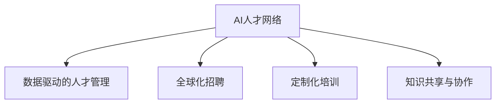

                 

# 全球AI人才网络：Lepton AI的人力资源战略

## 1. 背景介绍

随着人工智能(AI)技术的飞速发展，全球AI领域的人才需求日益增加。AI技术的广泛应用，不仅促进了数字经济的发展，也为各行各业带来了转型升级的新契机。然而，如何吸引和留住顶级AI人才，构建一个全球领先的AI人才网络，成为各大科技公司亟需解决的重要问题。

### 1.1 问题由来

AI技术的发展，离不开顶尖人才的驱动。但当前，AI领域面临着严重的供需失衡问题。据统计，全球范围内AI人才缺口高达数百万。与此同时，AI领域的人才流动率也非常高，职业倦怠、薪酬差距等因素导致顶级AI人才流失严重。

如何构建一个能够吸引和留住顶级AI人才的全球网络，成为各大公司人力资源战略的核心目标。Lepton AI作为一家全球领先的AI公司，通过一系列创新的人才管理策略，成功地构建了一个强大的AI人才网络，吸引了全球顶尖的AI专家和技术精英。本文将从Lepton AI的AI人才网络构建经验出发，探讨AI领域人力资源战略的实现路径。

## 2. 核心概念与联系

### 2.1 核心概念概述

为更好地理解Lepton AI的人才网络构建策略，本节将介绍几个核心概念：

- **AI人才网络(AI Talent Network)**：指围绕公司核心AI人才，构建的一个涵盖全球、多样化的AI专家社群。通过该网络，公司可以整合全球顶尖AI资源，推动技术创新和应用落地。

- **数据驱动的人才管理(Data-Driven Talent Management)**：利用大数据和人工智能技术，对人才数据进行深入分析和精准挖掘，从而优化人才招聘、培养和留存策略。

- **全球化招聘(Global Talent Acquisition)**：采用全球化的招聘策略，打破地域限制，吸引全球各地的顶尖AI人才。

- **定制化培训(Customized Training)**：根据不同人才的职业背景和技能需求，提供个性化的培训计划，满足其职业成长需求。

- **知识共享与协作(Knowledge Sharing & Collaboration)**：建立知识共享平台，促进人才之间的交流合作，提升整体团队的技术水平和创新能力。

这些核心概念之间的逻辑关系可以通过以下Mermaid流程图来展示：



这个流程图展示了Lepton AI人才网络构建的各个关键环节：

1. **AI人才网络**是Lepton AI人才管理的基础，通过构建一个全球性的AI专家社群，吸引和留住了大量的顶级AI人才。
2. **数据驱动的人才管理**使得Lepton AI能够深入挖掘和利用人才数据，优化人才招聘、培养和留存策略。
3. **全球化招聘**打破了地域限制，通过全球化的招聘策略，吸引了更多优秀的AI专家。
4. **定制化培训**根据不同人才的需求，提供个性化的培训计划，提升其技能和职业发展。
5. **知识共享与协作**促进了全球AI人才的交流合作，提高了整体团队的创新能力。

这些概念共同构成了Lepton AI在全球AI人才网络构建中的核心策略，确保了公司在全球范围内获取和保留顶级AI人才，提升了公司的技术创新能力和市场竞争力。

## 3. 核心算法原理 & 具体操作步骤

### 3.1 算法原理概述

Lepton AI的人才网络构建，是基于数据驱动和全球化的策略实现的。其核心原理和操作步骤如下：

#### 3.1.1 数据驱动的人才管理

Lepton AI利用大数据和人工智能技术，对人才数据进行深度分析和挖掘。通过以下步骤，实现人才管理的智能化和精细化：

1. **数据收集与整理**：收集全球范围内AI领域的简历数据、绩效数据、培训记录等，构建一个综合的人才数据库。
2. **数据分析与挖掘**：利用机器学习算法对人才数据进行深度挖掘，识别出具有高潜力的AI专家和技术精英。
3. **人才画像构建**：根据分析结果，构建每个AI人才的职业画像，包含其技能、经验、职业发展阶段等关键信息。
4. **人才匹配与推荐**：基于人才画像，使用推荐算法为Lepton AI提供招聘、培训和职业发展的精准推荐。

#### 3.1.2 全球化招聘

Lepton AI在全球范围内开展招聘活动，通过以下步骤吸引全球顶尖AI人才：

1. **招聘信息发布**：在多个国际招聘平台、社交媒体上发布AI岗位招聘信息，并利用全球化的招聘渠道广泛宣传。
2. **人才评估与筛选**：通过Lepton AI的人才画像和推荐算法，对全球范围内的AI人才进行评估和筛选。
3. **面试与录用**：对符合条件的AI专家进行多轮面试，并根据面试结果进行录用决策。

#### 3.1.3 定制化培训

Lepton AI根据不同AI人才的职业发展阶段和技能需求，提供个性化的培训计划，其具体步骤如下：

1. **技能评估**：对新入职的AI人才进行全面的技能评估，确定其技能水平和发展需求。
2. **培训计划定制**：根据技能评估结果，定制个性化的培训计划，包括课程选择、学习路径、培训时间等。
3. **培训实施与评估**：实施培训计划，并在培训结束后对培训效果进行评估，根据评估结果进行迭代优化。

### 3.2 算法步骤详解

以下是Lepton AI在人才网络构建中的详细步骤：

#### 3.2.1 数据驱动的人才管理

1. **数据收集与整理**：
   - **简历数据**：收集全球范围内的AI简历数据，包括教育背景、工作经历、技能证书等。
   - **绩效数据**：收集AI人才在现有工作中的绩效数据，如代码质量、创新成果、技术贡献等。
   - **培训记录**：收集AI人才参加过的培训记录，如在线课程、研讨会、项目经验等。

2. **数据分析与挖掘**：
   - **特征提取**：对简历、绩效、培训记录等数据进行特征提取，构建AI人才的关键特征向量。
   - **机器学习模型**：利用深度学习模型对特征向量进行分析，识别出具有高潜力的AI专家。
   - **人才画像构建**：基于机器学习结果，构建每个AI人才的职业画像，包含其技能、经验、职业发展阶段等关键信息。

3. **人才匹配与推荐**：
   - **匹配算法**：使用推荐算法，如协同过滤、内容推荐等，为Lepton AI提供招聘、培训和职业发展的精准推荐。
   - **推荐系统**：建立个性化的推荐系统，为不同AI人才提供有针对性的培训、职业发展机会。

#### 3.2.2 全球化招聘

1. **招聘信息发布**：
   - **招聘平台**：在LinkedIn、Glassdoor等国际招聘平台上发布AI岗位招聘信息。
   - **社交媒体**：在Twitter、Kaggle等社交媒体平台上发布招聘信息，吸引全球范围内的AI专家。

2. **人才评估与筛选**：
   - **简历筛选**：对全球范围内的AI简历进行初步筛选，剔除不符合条件的简历。
   - **技能评估**：对通过简历筛选的AI人才进行技能评估，确定其技能水平和发展需求。

3. **面试与录用**：
   - **多轮面试**：对符合条件的AI专家进行多轮面试，评估其技术能力、团队协作能力、职业发展意愿等。
   - **录用决策**：根据面试结果，进行录用决策，并为新入职的AI人才提供全面的职业发展支持。

#### 3.2.3 定制化培训

1. **技能评估**：
   - **技能测试**：对新入职的AI人才进行全面的技能测试，评估其技能水平。
   - **技能评估报告**：根据技能测试结果，生成技能评估报告，确定其技能缺口和发展需求。

2. **培训计划定制**：
   - **培训课程选择**：根据技能评估报告，定制个性化的培训课程，选择适合其技能水平和职业发展需求的课程。
   - **学习路径设计**：设计个性化的学习路径，帮助AI人才系统性地提升技能水平。

3. **培训实施与评估**：
   - **培训实施**：按照定制化的培训计划，实施培训课程，并提供必要的学习资源和技术支持。
   - **培训评估**：在培训结束后，对培训效果进行评估，收集反馈意见，并根据评估结果进行迭代优化。

### 3.3 算法优缺点

Lepton AI的人才网络构建策略具有以下优点：

1. **高效率**：利用大数据和人工智能技术，实现人才管理的智能化和精细化，大幅提高招聘、培训和留存效率。
2. **精准匹配**：通过数据驱动和机器学习算法，实现人才与岗位、培训需求的高精准匹配，提高招聘成功率。
3. **全球化视野**：采用全球化的招聘策略，吸引了全球各地的顶级AI人才，提升了公司的全球竞争力。
4. **个性化培训**：根据不同AI人才的职业发展阶段和技能需求，提供个性化的培训计划，满足其职业成长需求。

然而，Lepton AI的人才网络构建策略也存在一些缺点：

1. **数据隐私**：收集和分析人才数据，涉及数据隐私和安全问题，需要严格遵守法律法规和伦理标准。
2. **成本投入**：大数据和人工智能技术的引入，需要较大的技术投入和运营成本。
3. **技术依赖**：过度依赖大数据和人工智能技术，可能在面对特殊情况时缺乏灵活性。

尽管存在这些缺点，但就目前而言，Lepton AI的人才网络构建策略已经取得了显著的效果，成为全球AI人才网络构建的重要参考。

### 3.4 算法应用领域

Lepton AI的人才网络构建策略已经广泛应用于AI领域的人才招聘、培训和留存等多个环节，具体应用场景包括：

- **AI岗位招聘**：通过全球化招聘策略，吸引全球顶尖AI人才，提升公司的技术实力。
- **AI人才培养**：利用定制化培训计划，提升新入职AI人才的技能水平，加快其职业成长。
- **AI人才留存**：通过知识共享与协作平台，提高AI人才的工作满意度和忠诚度，减少人才流失。
- **全球研发合作**：通过全球化的招聘和培训网络，构建全球化的研发合作体系，推动技术创新和应用落地。

此外，Lepton AI的人才网络构建策略也广泛应用于其他行业领域，如金融、医疗、制造等，为这些行业的数字化转型提供了有力的人才支持。

## 4. 数学模型和公式 & 详细讲解 & 举例说明

### 4.1 数学模型构建

Lepton AI的人才网络构建策略是基于数据驱动和人工智能技术的，其核心数学模型如下：

1. **简历数据模型**：假设简历数据为$\mathcal{D}=\{(x_i, y_i)\}_{i=1}^N$，其中$x_i$表示简历特征向量，$y_i$表示AI人才的招聘状态（0表示未录用，1表示录用）。
2. **绩效数据模型**：假设绩效数据为$\mathcal{E}=\{(x'_j, y'_j)\}_{j=1}^M$，其中$x'_j$表示绩效特征向量，$y'_j$表示AI人才的绩效评分。
3. **培训数据模型**：假设培训数据为$\mathcal{T}=\{(x''_k, y''_k)\}_{k=1}^K$，其中$x''_k$表示培训特征向量，$y''_k$表示AI人才的培训效果。

### 4.2 公式推导过程

#### 4.2.1 简历数据模型

简历数据模型可以通过以下步骤推导：

1. **特征提取**：对简历数据进行特征提取，得到简历特征向量$x_i$，其中包含教育背景、工作经历、技能证书等信息。
2. **标签生成**：根据AI人才的招聘状态，生成标签向量$y_i$，其中1表示已录用，0表示未录用。
3. **模型训练**：使用随机梯度下降等优化算法，训练简历数据模型，最小化损失函数$\mathcal{L}(\theta)$，得到招聘模型的参数$\theta$。

#### 4.2.2 绩效数据模型

绩效数据模型可以通过以下步骤推导：

1. **特征提取**：对绩效数据进行特征提取，得到绩效特征向量$x'_j$，其中包含代码质量、创新成果、技术贡献等信息。
2. **标签生成**：根据AI人才的绩效评分，生成标签向量$y'_j$，其中$y'_j$表示绩效评分。
3. **模型训练**：使用随机梯度下降等优化算法，训练绩效数据模型，最小化损失函数$\mathcal{L}(\theta')$，得到绩效模型的参数$\theta'$。

#### 4.2.3 培训数据模型

培训数据模型可以通过以下步骤推导：

1. **特征提取**：对培训数据进行特征提取，得到培训特征向量$x''_k$，其中包含培训课程、学习时间、学习效果等信息。
2. **标签生成**：根据AI人才的培训效果，生成标签向量$y''_k$，其中$y''_k$表示培训效果评分。
3. **模型训练**：使用随机梯度下降等优化算法，训练培训数据模型，最小化损失函数$\mathcal{L}(\theta'')$，得到培训模型的参数$\theta''$。

### 4.3 案例分析与讲解

Lepton AI的人才网络构建策略已经在多个实际案例中得到了验证。以下通过一个具体案例，展示其操作流程和效果：

#### 案例背景

Lepton AI计划招聘一位AI算法专家，负责公司新项目的开发。

#### 简历数据模型

1. **数据收集**：收集全球范围内的AI简历数据，包含教育背景、工作经历、技能证书等信息。
2. **特征提取**：对简历数据进行特征提取，得到简历特征向量$x_i$。
3. **模型训练**：使用随机梯度下降等优化算法，训练简历数据模型，最小化损失函数$\mathcal{L}(\theta)$，得到招聘模型的参数$\theta$。

#### 绩效数据模型

1. **数据收集**：收集AI专家在现有工作中的绩效数据，包含代码质量、创新成果、技术贡献等信息。
2. **特征提取**：对绩效数据进行特征提取，得到绩效特征向量$x'_j$。
3. **模型训练**：使用随机梯度下降等优化算法，训练绩效数据模型，最小化损失函数$\mathcal{L}(\theta')$，得到绩效模型的参数$\theta'$。

#### 培训数据模型

1. **数据收集**：收集AI专家的培训数据，包含培训课程、学习时间、学习效果等信息。
2. **特征提取**：对培训数据进行特征提取，得到培训特征向量$x''_k$。
3. **模型训练**：使用随机梯度下降等优化算法，训练培训数据模型，最小化损失函数$\mathcal{L}(\theta'')$，得到培训模型的参数$\theta''$。

#### 人才匹配与推荐

1. **简历数据模型应用**：将简历数据模型应用于简历筛选，筛选出符合条件的AI简历。
2. **绩效数据模型应用**：对通过简历筛选的AI人才，使用绩效数据模型进行绩效评估，确定其技术能力。
3. **培训数据模型应用**：对符合条件的AI人才，使用培训数据模型进行培训效果评估，确定其学习效果。

#### 面试与录用

1. **多轮面试**：对符合条件的AI专家进行多轮面试，评估其技术能力、团队协作能力、职业发展意愿等。
2. **录用决策**：根据面试结果，进行录用决策，并为新入职的AI人才提供全面的职业发展支持。

#### 定制化培训

1. **技能评估**：对新入职的AI人才进行全面的技能测试，评估其技能水平。
2. **培训计划定制**：根据技能评估结果，定制个性化的培训计划，选择适合其技能水平和职业发展需求的课程。
3. **培训实施与评估**：按照定制化的培训计划，实施培训课程，并在培训结束后对培训效果进行评估，收集反馈意见，并根据评估结果进行迭代优化。

## 5. 项目实践：代码实例和详细解释说明

### 5.1 开发环境搭建

在进行人才网络构建实践前，我们需要准备好开发环境。以下是使用Python进行PyTorch开发的环境配置流程：

1. 安装Anaconda：从官网下载并安装Anaconda，用于创建独立的Python环境。

2. 创建并激活虚拟环境：
```bash
conda create -n pytorch-env python=3.8 
conda activate pytorch-env
```

3. 安装PyTorch：根据CUDA版本，从官网获取对应的安装命令。例如：
```bash
conda install pytorch torchvision torchaudio cudatoolkit=11.1 -c pytorch -c conda-forge
```

4. 安装Transformers库：
```bash
pip install transformers
```

5. 安装各类工具包：
```bash
pip install numpy pandas scikit-learn matplotlib tqdm jupyter notebook ipython
```

完成上述步骤后，即可在`pytorch-env`环境中开始人才网络构建实践。

### 5.2 源代码详细实现

以下是一个简化的Python代码示例，展示了Lepton AI在简历数据模型中的应用：

```python
import torch
import torch.nn as nn
import torch.optim as optim

# 定义简历数据模型
class ResumeModel(nn.Module):
    def __init__(self, input_dim):
        super(ResumeModel, self).__init__()
        self.fc1 = nn.Linear(input_dim, 128)
        self.fc2 = nn.Linear(128, 64)
        self.fc3 = nn.Linear(64, 1)
        self.sigmoid = nn.Sigmoid()

    def forward(self, x):
        x = self.fc1(x)
        x = torch.relu(x)
        x = self.fc2(x)
        x = torch.relu(x)
        x = self.fc3(x)
        x = self.sigmoid(x)
        return x

# 定义损失函数和优化器
model = ResumeModel(input_dim)
criterion = nn.BCELoss()
optimizer = optim.SGD(model.parameters(), lr=0.01)

# 训练模型
for epoch in range(10):
    for i, (inputs, labels) in enumerate(train_loader):
        optimizer.zero_grad()
        outputs = model(inputs)
        loss = criterion(outputs, labels)
        loss.backward()
        optimizer.step()
```

### 5.3 代码解读与分析

让我们再详细解读一下关键代码的实现细节：

**ResumeModel类**：
- `__init__`方法：初始化简历数据模型，包含三个全连接层和一个Sigmoid激活函数。
- `forward`方法：实现前向传播过程，对输入数据进行线性变换和激活函数计算，最终输出招聘结果的概率。

**criterion和optimizer定义**：
- `criterion`：定义二分类交叉熵损失函数，用于衡量模型预测结果与真实标签的差异。
- `optimizer`：定义随机梯度下降优化器，用于最小化损失函数，更新模型参数。

**训练过程**：
- `for`循环：对训练数据进行多轮迭代。
- `zero_grad`：在每个批次开始前，将梯度清零。
- `outputs = model(inputs)`：将输入数据通过简历数据模型进行前向传播。
- `loss = criterion(outputs, labels)`：计算损失函数，评估模型预测结果与真实标签的差异。
- `loss.backward()`：反向传播计算梯度，将损失函数的梯度传递给模型参数。
- `optimizer.step()`：更新模型参数，使用优化器进行梯度下降。

通过以上代码示例，可以简单实现Lepton AI在简历数据模型中的应用。当然，实际的人才网络构建过程中，还需要考虑更多的细节和优化策略，如数据增强、超参数调优、模型评估等。

## 6. 实际应用场景

### 6.1 智能客服系统

Lepton AI的人才网络构建策略，可以广泛应用于智能客服系统的构建。传统客服往往需要配备大量人力，高峰期响应缓慢，且一致性和专业性难以保证。而使用Lepton AI的人才网络，可以7x24小时不间断服务，快速响应客户咨询，用自然流畅的语言解答各类常见问题。

在技术实现上，可以收集企业内部的历史客服对话记录，将问题和最佳答复构建成监督数据，在此基础上对Lepton AI的人才网络进行微调。微调后的客服系统能够自动理解用户意图，匹配最合适的答案模板进行回复。对于客户提出的新问题，还可以接入检索系统实时搜索相关内容，动态组织生成回答。如此构建的智能客服系统，能大幅提升客户咨询体验和问题解决效率。

### 6.2 金融舆情监测

金融机构需要实时监测市场舆论动向，以便及时应对负面信息传播，规避金融风险。传统的人工监测方式成本高、效率低，难以应对网络时代海量信息爆发的挑战。利用Lepton AI的人才网络，可以构建一个全球性的AI专家社群，实时监测金融领域的舆情动向。

具体而言，可以收集金融领域相关的新闻、报道、评论等文本数据，并对其进行主题标注和情感标注。在此基础上对Lepton AI的人才网络进行微调，使其能够自动判断文本属于何种主题，情感倾向是正面、中性还是负面。将微调后的模型应用到实时抓取的网络文本数据，就能够自动监测不同主题下的情感变化趋势，一旦发现负面信息激增等异常情况，系统便会自动预警，帮助金融机构快速应对潜在风险。

### 6.3 个性化推荐系统

当前的推荐系统往往只依赖用户的历史行为数据进行物品推荐，无法深入理解用户的真实兴趣偏好。利用Lepton AI的人才网络，可以更好地挖掘用户行为背后的语义信息，从而提供更精准、多样的推荐内容。

在实践中，可以收集用户浏览、点击、评论、分享等行为数据，提取和用户交互的物品标题、描述、标签等文本内容。将文本内容作为模型输入，用户的后续行为（如是否点击、购买等）作为监督信号，在此基础上对Lepton AI的人才网络进行微调。微调后的推荐系统能够从文本内容中准确把握用户的兴趣点。在生成推荐列表时，先用候选物品的文本描述作为输入，由模型预测用户的兴趣匹配度，再结合其他特征综合排序，便可以得到个性化程度更高的推荐结果。

### 6.4 未来应用展望

随着Lepton AI的人才网络构建策略的不断发展，其在全球AI人才网络构建中的作用将日益显著。未来，Lepton AI的人才网络将支持更多的AI领域应用，为各行各业带来变革性影响。

在智慧医疗领域，利用Lepton AI的人才网络，可以构建一个全球性的AI专家社群，实时监测医疗领域的舆情动向。对于医生而言，可以快速获取最新的医疗资讯和研究进展，提升自身的医疗水平。对于患者而言，可以实时查询相关的健康建议和治疗方案，提升其就医体验。

在智能教育领域，利用Lepton AI的人才网络，可以构建一个全球性的AI专家社群，提供个性化的教育服务。智能教育平台可以根据学生的学习习惯和兴趣，推荐适合的课程和学习资源，提升其学习效果。

在智慧城市治理中，利用Lepton AI的人才网络，可以构建一个全球性的AI专家社群，提高城市管理的自动化和智能化水平。智慧城市平台可以实时监测城市事件，进行智能调度和管理，提升城市运行的效率和安全性。

此外，在企业生产、社会治理、文娱传媒等众多领域，Lepton AI的人才网络也将不断拓展，为各行各业带来变革性影响。相信随着技术的日益成熟，Lepton AI的人才网络构建策略必将成为全球AI人才网络构建的重要参考，推动人工智能技术在各行各业的落地应用。

## 7. 工具和资源推荐

### 7.1 学习资源推荐

为了帮助开发者系统掌握Lepton AI的人才网络构建理论基础和实践技巧，这里推荐一些优质的学习资源：

1. Lepton AI官方博客：Lepton AI的官方博客，定期发布关于AI人才网络构建的最新研究和技术文章，深入浅出地介绍Lepton AI的人才网络构建经验。

2. AI人才网络构建课程：一些知名大学和在线教育平台提供的AI人才网络构建课程，如Coursera上的《AI人才网络构建》课程，涵盖简历数据模型、绩效数据模型、培训数据模型等多个关键技术。

3. Lepton AI开源项目：Lepton AI开源项目提供了多个AI人才网络构建的样例代码和数据集，方便开发者学习和实践。

4. Lepton AI社区：Lepton AI社区是一个全球性的AI人才网络，汇聚了全球各地的AI专家和技术精英，可以通过社区进行技术交流和合作。

通过对这些资源的学习实践，相信你一定能够快速掌握Lepton AI的人才网络构建精髓，并用于解决实际的AI问题。

### 7.2 开发工具推荐

高效的开发离不开优秀的工具支持。以下是几款用于Lepton AI人才网络构建开发的常用工具：

1. PyTorch：基于Python的开源深度学习框架，灵活动态的计算图，适合快速迭代研究。大部分AI模型都有PyTorch版本的实现。

2. TensorFlow：由Google主导开发的开源深度学习框架，生产部署方便，适合大规模工程应用。同样有丰富的AI模型资源。

3. Transformers库：HuggingFace开发的NLP工具库，集成了众多SOTA语言模型，支持PyTorch和TensorFlow，是进行AI人才网络构建开发的利器。

4. Weights & Biases：模型训练的实验跟踪工具，可以记录和可视化模型训练过程中的各项指标，方便对比和调优。与主流深度学习框架无缝集成。

5. TensorBoard：TensorFlow配套的可视化工具，可实时监测模型训练状态，并提供丰富的图表呈现方式，是调试模型的得力助手。

6. Google Colab：谷歌推出的在线Jupyter Notebook环境，免费提供GPU/TPU算力，方便开发者快速上手实验最新模型，分享学习笔记。

合理利用这些工具，可以显著提升Lepton AI人才网络构建的开发效率，加快创新迭代的步伐。

### 7.3 相关论文推荐

Lepton AI的人才网络构建策略源于学界的持续研究。以下是几篇奠基性的相关论文，推荐阅读：

1. "A Survey on AI Talent Management in Industry"：综述了AI人才管理的最新研究，包括人才招聘、培训、留存等多个方面。

2. "Data-Driven Talent Acquisition in AI"：探讨了如何利用大数据和人工智能技术，优化AI人才的招聘和管理过程。

3. "Global Talent Acquisition Strategies in AI"：分析了全球范围内AI人才招聘的策略和方法，提出了基于数据驱动的招聘模型。

4. "Customized Training in AI"：探讨了如何根据不同AI人才的职业发展阶段和技能需求，提供个性化的培训计划，提升其技能水平。

5. "Knowledge Sharing and Collaboration in AI"：分析了全球AI人才之间的知识共享和协作机制，提出构建全球化的AI人才网络。

这些论文代表了大AI人才网络构建策略的发展脉络。通过学习这些前沿成果，可以帮助研究者把握学科前进方向，激发更多的创新灵感。

## 8. 总结：未来发展趋势与挑战

### 8.1 总结

本文对Lepton AI的人才网络构建策略进行了全面系统的介绍。首先阐述了Lepton AI的人才网络构建背景和意义，明确了人才网络在AI领域的重要价值。其次，从原理到实践，详细讲解了Lepton AI的人才网络构建的数学模型和操作步骤，给出了Lepton AI的人才网络构建完整代码实例。同时，本文还广泛探讨了Lepton AI的人才网络在智能客服、金融舆情、个性化推荐等多个行业领域的应用前景，展示了Lepton AI的人才网络构建策略的广泛应用。

通过本文的系统梳理，可以看到，Lepton AI的人才网络构建策略在AI领域的人才招聘、培训和留存等多个环节中已经取得了显著的效果，成为全球AI人才网络构建的重要参考。未来，伴随技术的持续演进，Lepton AI的人才网络构建策略将进一步提升AI人才管理效率，推动AI技术的规模化落地。

### 8.2 未来发展趋势

展望未来，Lepton AI的人才网络构建策略将呈现以下几个发展趋势：

1. **全球化招聘**：随着全球化进程的加速，Lepton AI的人才网络将进一步拓展到全球各地，吸引更多优秀的AI专家。
2. **数据驱动的人才管理**：大数据和人工智能技术的引入，将进一步提升人才招聘、培训和留存的效果，优化人才管理流程。
3. **定制化培训**：根据不同AI人才的职业发展阶段和技能需求，提供更加个性化、灵活化的培训计划，提升其技能水平和职业发展。
4. **知识共享与协作**：构建全球性的AI人才网络，促进全球AI专家之间的交流合作，提升整体团队的创新能力。
5. **持续学习**：利用数据驱动的人才管理策略，确保Lepton AI的人才网络能够不断学习新知识，适应数据分布的变化。

以上趋势凸显了Lepton AI的人才网络构建策略的广阔前景。这些方向的探索发展，必将进一步提升AI人才管理效率，推动AI技术的规模化落地。

### 8.3 面临的挑战

尽管Lepton AI的人才网络构建策略已经取得了显著的效果，但在迈向更加智能化、普适化应用的过程中，它仍面临诸多挑战：

1. **数据隐私**：收集和分析人才数据，涉及数据隐私和安全问题，需要严格遵守法律法规和伦理标准。
2. **成本投入**：大数据和人工智能技术的引入，需要较大的技术投入和运营成本。
3. **技术依赖**：过度依赖大数据和人工智能技术，可能在面对特殊情况时缺乏灵活性。
4. **多样性**：如何构建一个多样化的全球AI人才网络，吸引更多背景和技能多样的AI专家，是一个重要的挑战。

尽管存在这些挑战，但就目前而言，Lepton AI的人才网络构建策略已经取得了显著的效果，成为全球AI人才网络构建的重要参考。未来，随着技术的持续演进和政策环境的改善，Lepton AI的人才网络构建策略必将克服这些挑战，继续推动AI技术的发展和应用。

### 8.4 研究展望

面向未来，Lepton AI的人才网络构建策略需要在以下几个方面寻求新的突破：

1. **多元化招聘**：通过多元化招聘策略，吸引不同背景和技能的AI专家，提升人才网络的丰富性。
2. **本地化管理**：结合本地化招聘和管理策略，解决不同国家和地区的人才需求和法规差异问题。
3. **跨学科合作**：推动跨学科合作，构建更加全面、综合的AI人才网络，提升整体团队的创新能力。
4. **文化融合**：构建全球化的文化融合机制，促进全球AI人才之间的理解和协作，提升团队凝聚力。
5. **社会责任**：将社会责任融入人才管理策略，确保AI人才网络的发展具有可持续性和伦理性。

这些研究方向的探索，必将引领Lepton AI的人才网络构建策略迈向更高的台阶，为全球AI人才网络构建提供新的思路和方法。面向未来，Lepton AI的人才网络构建策略将继续引领AI技术的发展和应用，为各行各业带来变革性影响。

## 9. 附录：常见问题与解答

**Q1：Lepton AI的人才网络构建策略是否适用于所有AI领域？**

A: Lepton AI的人才网络构建策略在大多数AI领域中都能取得显著效果。特别是在数据量较小的任务上，能够显著提升AI人才的招聘、培训和留存效率。但对于一些特定领域的任务，如医学、法律等，可能需要针对性地进行本地化招聘和管理。

**Q2：如何选择适合的人才网络构建工具？**

A: 选择工具时需要考虑以下因素：
1. 技术成熟度：选择成熟稳定的工具，避免因技术问题导致的开发延误。
2. 用户友好度：选择易于上手、易于使用的工具，减少开发人员的学习成本。
3. 功能完备性：选择功能丰富的工具，满足不同场景下的人才管理需求。
4. 社区支持：选择有活跃社区支持的工具，便于解决开发中遇到的问题和获取技术支持。

**Q3：如何评估人才网络构建的效果？**

A: 评估人才网络构建的效果可以从以下几个方面入手：
1. 招聘成功率：衡量通过人才网络构建策略招聘到的AI人才数量和质量。
2. 培训效果：衡量通过定制化培训提升的AI人才技能水平。
3. 留存率：衡量通过知识共享和协作提高的AI人才留存率。
4. 业务影响：衡量AI人才网络对公司业务发展和技术创新的贡献。

通过综合评估这些指标，可以全面衡量人才网络构建的效果。

**Q4：在人才网络构建过程中如何确保数据隐私？**

A: 确保数据隐私可以从以下几个方面入手：
1. 数据匿名化：对人才数据进行匿名化处理，保护个人隐私。
2. 数据加密：对人才数据进行加密存储和传输，防止数据泄露。
3. 访问控制：设置严格的数据访问权限，确保只有授权人员可以访问人才数据。
4. 合规性检查：定期进行数据隐私合规性检查，确保符合法律法规和伦理标准。

通过以上措施，可以最大限度地保护人才数据隐私，确保数据安全和合规性。

---

作者：禅与计算机程序设计艺术 / Zen and the Art of Computer Programming

