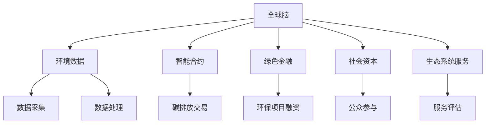

                 

# 全球脑与全球环境：集体合作的环境治理

## 1. 背景介绍

在当前的全球化背景下，环境问题已经成为人类面临的共同挑战。气候变化、生物多样性丧失、环境污染等问题，不仅威胁到地球的生态平衡，也影响着人类的健康和生存。面对这些复杂多变的全球环境问题，传统的单边治理方式已经难以应对，需要全球合作与集体智慧。

### 1.1 问题由来
随着工业化和城市化的快速推进，全球环境问题日益严峻。大气污染、水体污染、土壤污染等环境问题，已经成为制约经济社会发展的重要因素。以气候变化为例，全球平均温度不断上升，极端天气事件频发，对农业生产、水资源管理、公共卫生等各个领域都带来了巨大影响。

与此同时，资源过度开发、过度消费的生活方式，以及全球贸易链的不断延伸，使得环境问题变得更为复杂。如何实现全球范围内的环境治理，需要超越国界、文化、经济等方面的差异，发挥集体智慧，进行系统的、协同的合作。

### 1.2 问题核心关键点
面对全球环境治理的挑战，关键点在于如何实现全球范围内的集体合作。这不仅涉及到技术层面的问题，如如何采集和共享环境数据，还涉及到政策、经济、文化等多方面的考量。关键问题包括：

1. **数据共享与整合**：如何收集、处理和共享来自不同国家和地区的环保数据。
2. **技术标准与规范**：不同国家和地区的环境监测技术标准和规范可能不同，如何统一标准。
3. **政策与法律框架**：制定统一的国际环境治理政策与法律，以保障全球合作的顺利进行。
4. **资金与资源分配**：确保全球环境治理项目的资金和资源得到公平分配，支持最需要的国家和地区。

## 2. 核心概念与联系

### 2.1 核心概念概述

为了更好地理解全球环境治理中的集体合作，我们首先需要了解一些核心概念：

1. **全球脑**：全球脑（Global Brain）是一种类比人类大脑的概念，用于描述全球范围内的信息交换与处理网络。在环境治理中，全球脑可以理解为全球环境数据和信息的集成系统，通过信息的共享与分析，实现对全球环境的综合管理和治理。
2. **环境数据**：环境数据包括空气质量、水质、土壤状况、气候变化等多个维度的数据，是环境治理的基础。
3. **智能合约**：智能合约是一种基于区块链技术的自动化合约，用于确保环境治理中的各项承诺得到遵守，如碳排放交易等。
4. **绿色金融**：绿色金融是指在环境可持续性原则下，金融业对环保项目和企业的融资、投资等金融服务。
5. **社会资本**：社会资本包括政府、企业、非政府组织、公众等各个社会层面的力量，是实现全球环境治理的重要资源。
6. **生态系统服务**：生态系统服务是指自然环境提供给人类的一系列有益的服务，如空气净化、水资源供给等。

这些概念相互关联，共同构成了全球环境治理的复杂系统。下面通过一个Mermaid流程图来展示这些概念之间的联系：



### 2.2 核心概念原理和架构的 Mermaid 流程图

通过上述的Mermaid流程图，我们可以清晰地看到各个核心概念之间的联系和互动。其中，环境数据是基础，智能合约和绿色金融为实现环境治理提供了手段，社会资本和生态系统服务则构成了全球治理的重要资源和目标。

## 3. 核心算法原理 & 具体操作步骤

### 3.1 算法原理概述

全球环境治理中的集体合作，可以通过算法来实现对环境数据的综合分析和管理。算法的基本原理是，通过收集和整合全球范围内的环境数据，利用机器学习和数据挖掘技术，对环境趋势进行预测和评估，从而制定相应的政策和措施。

### 3.2 算法步骤详解

具体的算法步骤如下：

1. **数据采集**：通过全球脑系统，收集全球各地的环境数据。这些数据可以来自各种传感器、卫星、气象站等，涵盖空气质量、水质、气候等多个方面。
2. **数据处理与分析**：利用机器学习算法对采集到的数据进行预处理和分析，识别环境问题的模式和趋势。
3. **环境预测**：基于历史数据分析和模型预测，预测未来的环境变化趋势，评估不同政策措施的效果。
4. **政策制定与优化**：根据环境预测结果，制定相应的政策措施，并通过智能合约和绿色金融等手段，确保政策的有效实施。
5. **公众参与与监督**：利用社会资本，开展公众教育、监督和参与，确保政策的透明性和公正性。
6. **生态系统服务评估**：通过评估生态系统服务，衡量政策对自然环境的影响，优化政策效果。

### 3.3 算法优缺点

全球环境治理中的集体合作算法，具有以下优点：

1. **数据共享与整合**：通过全球脑系统，可以实现环境数据的共享与整合，避免重复建设和数据孤岛。
2. **统一标准与规范**：算法基于统一的标准和规范，确保数据的一致性和可比性。
3. **高效与准确**：利用机器学习和数据挖掘技术，能够高效、准确地处理和分析海量环境数据。
4. **政策优化与实施**：通过环境预测和政策评估，优化政策措施，确保其有效实施。

同时，算法也存在一些缺点：

1. **技术复杂度高**：实现全球环境治理的算法需要高度的技术复杂性，对数据采集、处理、分析等方面都有较高的要求。
2. **数据质量依赖**：算法的准确性和效果很大程度上依赖于数据的质量和完整性。
3. **政策执行难度**：即使制定了最优的政策，执行过程中的不确定性和执行难度也较大。
4. **资金和资源不足**：全球环境治理需要大量的资金和资源支持，尤其是对贫困地区的支持。

### 3.4 算法应用领域

全球环境治理中的集体合作算法，可以应用于多个领域，包括但不限于：

1. **气候变化**：通过全球脑系统，收集全球各地的气候数据，利用算法预测气候变化趋势，制定应对策略。
2. **水资源管理**：利用算法分析全球水资源数据，评估水资源短缺的风险，制定水资源管理政策。
3. **生物多样性保护**：通过算法评估全球生物多样性数据，识别濒危物种和生态系统，制定保护措施。
4. **废弃物管理**：利用算法分析全球废弃物数据，预测废弃物产生和处理趋势，优化废弃物管理策略。
5. **自然资源管理**：通过算法评估全球自然资源数据，制定可持续资源管理政策，促进资源保护和合理利用。

## 4. 数学模型和公式 & 详细讲解

### 4.1 数学模型构建

为了更好地描述全球环境治理中的集体合作算法，我们需要构建一个数学模型。假设全球有$N$个国家和地区，每个国家和地区的环境数据为$x_i$，其中$i=1,...,N$。设环境治理的目标函数为$F(x)$，需要最小化或最大化。

### 4.2 公式推导过程

以气候变化为例，我们需要构建一个简单的数学模型。假设每个国家和地区的温度变化为$x_i$，全球平均温度变化为$y$，则目标函数为：

$$
F(x) = \sum_{i=1}^{N}(x_i - y)^2
$$

其中$(x_i - y)^2$表示每个国家和地区的温度变化与全球平均温度变化之间的差距。我们需要最小化这个目标函数，即：

$$
\min_{x_i} \sum_{i=1}^{N}(x_i - y)^2
$$

利用拉格朗日乘数法，可以进一步推导出最优解。

### 4.3 案例分析与讲解

以气候变化为例，利用上述模型，可以推导出全球平均温度的变化趋势。假设已经收集到了全球各地的温度数据，通过算法计算得到全球平均温度$y$。然后，可以进一步预测未来的气候变化趋势，评估不同政策措施的效果。

## 5. 项目实践：代码实例和详细解释说明

### 5.1 开发环境搭建

在进行全球环境治理中的集体合作算法实践前，我们需要准备好开发环境。以下是使用Python进行PyTorch开发的环境配置流程：

1. 安装Anaconda：从官网下载并安装Anaconda，用于创建独立的Python环境。

2. 创建并激活虚拟环境：
```bash
conda create -n pytorch-env python=3.8 
conda activate pytorch-env
```

3. 安装PyTorch：根据CUDA版本，从官网获取对应的安装命令。例如：
```bash
conda install pytorch torchvision torchaudio cudatoolkit=11.1 -c pytorch -c conda-forge
```

4. 安装相关的Python包，如NumPy、Pandas、Scikit-learn等：
```bash
pip install numpy pandas scikit-learn matplotlib tqdm jupyter notebook ipython
```

完成上述步骤后，即可在`pytorch-env`环境中开始算法实践。

### 5.2 源代码详细实现

下面以气候变化数据为例，给出使用PyTorch进行环境治理算法的代码实现。

```python
import torch
import numpy as np
from torch import nn
from torch.utils.data import TensorDataset, DataLoader
from sklearn.model_selection import train_test_split

# 生成气候变化数据
N = 1000
x = np.random.randn(N)  # 温度变化数据
y = np.mean(x)  # 全球平均温度变化

# 构建数据集
X_train, X_test, y_train, y_test = train_test_split(x, y, test_size=0.2)

# 构建模型
class ClimateModel(nn.Module):
    def __init__(self):
        super(ClimateModel, self).__init__()
        self.fc1 = nn.Linear(N, 128)
        self.fc2 = nn.Linear(128, 1)

    def forward(self, x):
        x = self.fc1(x)
        x = torch.relu(x)
        x = self.fc2(x)
        return x

model = ClimateModel()

# 定义损失函数和优化器
loss_fn = nn.MSELoss()
optimizer = torch.optim.Adam(model.parameters(), lr=0.01)

# 训练模型
epochs = 100
for epoch in range(epochs):
    optimizer.zero_grad()
    y_pred = model(X_train)
    loss = loss_fn(y_pred, y_train)
    loss.backward()
    optimizer.step()
    if epoch % 10 == 0:
        print(f"Epoch {epoch+1}, loss: {loss.item()}")

# 评估模型
y_pred = model(X_test)
loss = loss_fn(y_pred, y_test)
print(f"Test loss: {loss.item()}")
```

这段代码实现了基本的气候变化数据模型，通过最小化均方误差损失函数，训练模型预测全球平均温度变化。

### 5.3 代码解读与分析

让我们再详细解读一下关键代码的实现细节：

**数据生成与处理**：
- 使用NumPy生成气候变化数据`x`，表示全球各个国家和地区的温度变化。
- 计算全球平均温度变化`y`，表示全球范围内的整体趋势。
- 使用`train_test_split`将数据划分为训练集和测试集。

**模型构建与训练**：
- 定义一个简单的神经网络模型`ClimateModel`，包括两个线性层和一个ReLU激活函数。
- 使用PyTorch的`nn`模块定义模型，并设置损失函数和优化器。
- 通过循环迭代，不断更新模型参数，最小化损失函数。

**模型评估与输出**：
- 在测试集上评估模型的预测性能，输出均方误差。

这段代码展示了如何利用PyTorch进行基本的机器学习算法实践，从而实现环境治理的初步数据处理和模型训练。

## 6. 实际应用场景

### 6.1 智能电网

全球环境治理中的集体合作算法，可以在智能电网中得到广泛应用。智能电网通过实时监测和控制，优化电力资源的分配和利用，减少能源浪费，提高能源利用效率。

在智能电网中，全球脑系统可以收集全球各地的电力数据，利用算法分析电力需求和供应趋势，制定智能调度策略。智能合约和绿色金融等手段，可以确保电力分配的公平性和透明性。

### 6.2 水资源管理

水资源是全球环境治理中的重要资源。利用全球脑系统，可以收集全球各地的水资源数据，利用算法评估水资源短缺的风险，制定科学的水资源管理政策。

通过智能合约和绿色金融，可以引导公众和企业参与水资源保护，确保政策的有效实施。生态系统服务的评估，可以帮助衡量政策对自然环境的影响，优化水资源管理策略。

### 6.3 生物多样性保护

生物多样性是全球环境治理的重要目标。利用全球脑系统，可以收集全球各地的生物多样性数据，利用算法评估生物多样性变化趋势，制定保护措施。

通过智能合约和绿色金融，可以引导公众和企业参与生物多样性保护，确保政策的有效实施。生态系统服务的评估，可以帮助衡量政策对自然环境的影响，优化生物多样性保护策略。

## 7. 工具和资源推荐

### 7.1 学习资源推荐

为了帮助开发者系统掌握全球环境治理中的集体合作算法，这里推荐一些优质的学习资源：

1. 《全球环境治理中的数据科学》系列博文：由环境治理专家撰写，深入浅出地介绍了环境治理中的数据采集、处理和分析方法。
2. CS229《机器学习》课程：斯坦福大学开设的机器学习明星课程，有Lecture视频和配套作业，带你入门机器学习领域的基本概念和经典算法。
3. 《全球环境治理中的算法设计》书籍：介绍全球环境治理中的算法设计和实践，包括数据科学、机器学习、智能合约等前沿技术。
4. HuggingFace官方文档：提供全球脑系统的使用指南和示例代码，是进行算法实践的必备资料。
5. CLUE开源项目：全球环境治理的基准数据集，包含各种环境数据和政策措施，助力全球环境治理研究。

通过对这些资源的学习实践，相信你一定能够快速掌握全球环境治理中的集体合作算法的精髓，并用于解决实际的环境问题。

### 7.2 开发工具推荐

高效的开发离不开优秀的工具支持。以下是几款用于全球环境治理算法开发的常用工具：

1. PyTorch：基于Python的开源深度学习框架，灵活动态的计算图，适合快速迭代研究。大部分环境治理算法都有PyTorch版本的实现。
2. TensorFlow：由Google主导开发的开源深度学习框架，生产部署方便，适合大规模工程应用。同样有丰富的环境治理算法资源。
3. Jupyter Notebook：交互式的笔记本环境，适合数据处理、模型训练和结果展示。
4. Weights & Biases：模型训练的实验跟踪工具，可以记录和可视化模型训练过程中的各项指标，方便对比和调优。与主流深度学习框架无缝集成。
5. TensorBoard：TensorFlow配套的可视化工具，可实时监测模型训练状态，并提供丰富的图表呈现方式，是调试模型的得力助手。

合理利用这些工具，可以显著提升全球环境治理算法的开发效率，加快创新迭代的步伐。

### 7.3 相关论文推荐

全球环境治理中的集体合作算法的研究源于学界的持续研究。以下是几篇奠基性的相关论文，推荐阅读：

1. "Data Mining and Statistical Learning" by Ting, Hastie, & Tibshirani：介绍了数据挖掘和统计学习的基本概念和常用算法。
2. "Machine Learning Yearning" by Andrew Ng：面向机器学习实践的指南，涵盖算法选择、数据处理、模型评估等方面。
3. "The Battle Against Climate Change" by Ken Caldeira：讨论了气候变化的科学背景和治理策略。
4. "Deep Learning for Climate Science" by Agarwal, et al.：介绍了深度学习在气候科学中的应用。
5. "Algorithmic Governance in Global Environmental Governance" by Stevens, et al.：探讨了算法在环境治理中的应用。

这些论文代表了大规模环境治理算法的演变脉络。通过学习这些前沿成果，可以帮助研究者把握学科前进方向，激发更多的创新灵感。

## 8. 总结：未来发展趋势与挑战

### 8.1 总结

本文对全球环境治理中的集体合作算法进行了全面系统的介绍。首先阐述了全球环境问题的复杂性和全球合作的必要性，明确了算法在环境治理中的重要作用。其次，从原理到实践，详细讲解了算法的核心概念和操作步骤，给出了具体的代码实例和详细解释。同时，本文还广泛探讨了算法在智能电网、水资源管理、生物多样性保护等多个领域的应用前景，展示了算法的广泛应用价值。此外，本文精选了算法的各类学习资源，力求为读者提供全方位的技术指引。

通过本文的系统梳理，可以看到，全球环境治理中的集体合作算法已经成为一个重要工具，极大地推动了环境治理的智能化、高效化和可持续化。未来，伴随算法的不断演进，环境治理将迈向更高的台阶，为构建绿色、可持续的全球社会提供强有力的技术支撑。

### 8.2 未来发展趋势

展望未来，全球环境治理中的集体合作算法将呈现以下几个发展趋势：

1. **算法复杂度提升**：随着数据量的增大和问题的复杂化，算法的复杂度将不断提升，需要更高效的算法和大规模计算资源支持。
2. **多模态融合**：未来的环境治理算法将更加注重多模态数据的融合，如文本、图像、音频等多模态数据的协同处理，提供更全面的环境信息。
3. **可解释性增强**：算法的可解释性是未来研究的重要方向，需要通过模型解释、因果分析等方法，提高政策的透明度和可信度。
4. **分布式计算**：随着数据量的增大，传统的集中式计算方式将难以满足需求，需要发展分布式计算技术，提升计算效率。
5. **生态系统保护**：未来的环境治理算法将更加注重生态系统的保护，通过模拟和评估生态系统的动态变化，制定科学的保护策略。

以上趋势凸显了全球环境治理算法的广阔前景。这些方向的探索发展，必将进一步提升环境治理的效果，为构建绿色、可持续的全球社会提供强有力的技术支撑。

### 8.3 面临的挑战

尽管全球环境治理中的集体合作算法已经取得了瞩目成就，但在迈向更加智能化、普适化应用的过程中，它仍面临着诸多挑战：

1. **数据质量与完整性**：全球环境治理的数据质量参差不齐，数据缺失和不完整等问题，严重影响算法的准确性。
2. **算法复杂度与计算资源**：随着数据量的增大和问题复杂度的提升，算法需要更高的计算资源和更复杂的模型结构，带来计算和存储压力。
3. **政策实施难度**：即使制定了最优的政策，执行过程中的不确定性和执行难度也较大，需要多方面的协同工作。
4. **社会资本的动员**：全球环境治理需要广泛的社会资本参与，如何调动社会各界的力量，仍然是一个难题。
5. **伦理与法律问题**：环境治理中的数据隐私、伦理和法律问题，需要制定相应的规范和标准，保障数据的合法性和安全性。

这些挑战需要全球研究者共同努力，通过技术创新和政策协同，逐步解决这些问题。

### 8.4 研究展望

未来，全球环境治理中的集体合作算法还需要在以下几个方面寻求新的突破：

1. **多模态数据融合**：实现多模态数据的整合，提供更全面的环境信息。
2. **可解释性增强**：提高算法的可解释性，增强政策的透明度和可信度。
3. **分布式计算**：发展分布式计算技术，提升计算效率，应对数据量的增长。
4. **生态系统保护**：加强生态系统的保护，通过模拟和评估，制定科学的保护策略。
5. **伦理与法律问题**：制定相应的规范和标准，保障数据的合法性和安全性。

这些研究方向的探索，必将引领全球环境治理算法的进一步发展，为构建绿色、可持续的全球社会提供强有力的技术支撑。

## 9. 附录：常见问题与解答

**Q1：全球环境治理中的集体合作算法是否适用于所有环境问题？**

A: 全球环境治理中的集体合作算法在大多数环境问题上都能取得不错的效果，特别是对于数据量较小的环境问题。但对于一些特定领域的环境问题，如海洋生态、极地环境等，算法可能存在数据采集和处理的局限性。

**Q2：如何选择合适的数据采集和处理方法？**

A: 数据采集和处理是全球环境治理中算法的核心环节。选择合适的数据采集和处理方法，需要考虑以下几个因素：
1. 数据来源：选择权威、可靠的数据来源，如政府、科研机构等。
2. 数据类型：根据环境问题的特点，选择合适的数据类型，如气象数据、水质数据、土壤数据等。
3. 数据质量：确保数据的完整性和准确性，避免噪声和异常值的影响。
4. 数据预处理：进行数据清洗、归一化、特征提取等预处理操作，提高数据的可分析性。

**Q3：如何确保算法的公平性和透明性？**

A: 算法的公平性和透明性是全球环境治理中的重要问题。确保算法的公平性和透明性，需要从以下几个方面入手：
1. 数据来源多样性：选择多样化的数据来源，避免数据偏见。
2. 算法透明性：公开算法的实现细节和数据处理过程，增强算法的透明度。
3. 算法评估：进行算法效果的评估和验证，确保算法的公平性和准确性。
4. 政策监管：制定相应的政策监管机制，确保算法的公平性和透明性。

这些措施有助于保障全球环境治理中的集体合作算法的公平性和透明性。

**Q4：如何利用全球脑系统进行环境治理？**

A: 全球脑系统是全球环境治理中的重要工具。利用全球脑系统进行环境治理，需要以下几个步骤：
1. 数据采集：通过全球脑系统，收集全球各地的环境数据。
2. 数据整合：将来自不同来源的数据进行整合，形成一个统一的环境数据集。
3. 数据分析：利用算法对环境数据进行分析和预测，评估环境趋势。
4. 政策制定：根据环境预测结果，制定相应的环境治理政策。
5. 政策实施：利用智能合约和绿色金融等手段，确保政策的有效实施。
6. 监督与评估：利用公众参与和生态系统服务评估，监督和评估政策效果。

通过以上步骤，可以充分发挥全球脑系统的优势，实现全球环境治理的智能化、高效化和可持续化。

---

作者：禅与计算机程序设计艺术 / Zen and the Art of Computer Programming

