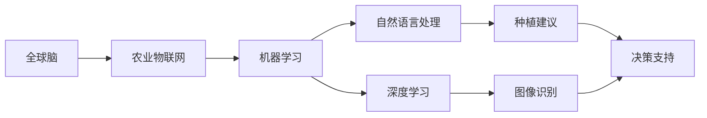

                 

# 全球脑与农业革命:智慧种植的未来

## 1. 背景介绍

在快速发展的全球化浪潮下，粮食安全、农业可持续性等议题愈发重要。人工智能（AI）和大数据技术为农业革命注入了新的动力，赋予了全球脑智慧农业的全新维度。智慧种植不仅是提高农作物产量和质量的重要手段，更是改善生态环境、增强农民福祉的必由之路。本文将从农业革命与AI的结合点出发，探索全球脑与智慧种植的未来。

## 2. 核心概念与联系

### 2.1 核心概念概述

智慧种植利用先进的AI技术，对农业生产过程进行全面监控、优化和预测。其核心概念包括：

- **全球脑（Global Brain）**：指的是将全球农业数据收集和处理后，形成的庞大的、动态的、共享的知识库，为智慧种植提供决策支持和智能方案。
- **农业物联网（Agriculture Internet of Things, AIoT）**：利用传感器、摄像头、无人机等设备，实时监测和采集农田环境数据，实现对农业生产的精准控制。
- **机器学习（Machine Learning, ML）**：通过对历史数据进行分析，构建模型预测作物生长状态、病虫害趋势、土壤肥力等，辅助农业决策。
- **自然语言处理（Natural Language Processing, NLP）**：分析农民的日常记录、专家建议等文本信息，提供个性化种植建议。
- **深度学习（Deep Learning, DL）**：处理复杂的图像、视频数据，通过神经网络模型识别和分类农田图像，评估作物健康。

这些核心概念的交互协同，构筑了智慧种植的完整生态系统。

### 2.2 核心概念原理和架构的 Mermaid 流程图



## 3. 核心算法原理 & 具体操作步骤

### 3.1 算法原理概述

智慧种植的算法原理基于数据驱动的农业模型，具体包括：

1. **数据采集**：利用传感器、摄像头等设备收集农田的土壤、气象、光照、湿度等实时数据。
2. **数据处理**：通过清洗、归一化、特征提取等预处理步骤，提高数据的可用性。
3. **模型训练**：构建基于历史数据的机器学习模型，如回归、分类、聚类等，用于预测作物状态和病虫害趋势。
4. **模型优化**：使用优化算法（如梯度下降）训练模型，优化模型参数，提升预测精度。
5. **决策支持**：结合专家知识库和机器学习结果，为农民提供精准的种植建议。

### 3.2 算法步骤详解

智慧种植的算法步骤分为以下几步：

1. **数据准备**：收集农田的多种数据，包括气象、土壤、作物生长状态等，整理为可用于训练模型的格式。
2. **特征工程**：对原始数据进行特征提取，形成模型所需的特征向量。
3. **模型训练**：选择适合的数据集和模型，如随机森林、神经网络等，进行模型训练。
4. **结果评估**：使用交叉验证等方法评估模型性能，调整模型参数以提高准确率。
5. **模型部署**：将训练好的模型部署到田间设备或移动应用中，实现实时预测和决策支持。

### 3.3 算法优缺点

智慧种植算法的优点：

- **精准预测**：基于大数据分析和深度学习模型，能精准预测作物生长状态和病虫害趋势。
- **动态调整**：实时监测农田环境，根据变化调整种植策略，优化资源配置。
- **提高产量**：通过科学种植，提高作物产量和质量，降低农药和化肥的使用。

算法缺点：

- **数据依赖**：需要收集大量的农田数据，数据质量和数量直接影响模型效果。
- **模型复杂**：深度学习模型结构复杂，训练和推理耗时较长，需要高性能计算资源。
- **技术门槛**：对技术实施者有较高要求，需要具备数据处理、模型训练等多方面的专业知识。

### 3.4 算法应用领域

智慧种植技术在多个农业领域均有应用：

1. **精准农业**：利用传感器和无人机采集农田数据，通过机器学习模型进行分析和预测，精准施策。
2. **智能灌溉**：根据土壤湿度和气象数据，智能调节灌溉系统，避免水资源浪费。
3. **病虫害防治**：通过图像识别技术，实时监测和预测病虫害，早期预警，及时防治。
4. **作物健康评估**：使用深度学习模型，从农田图像中识别作物健康状态，及时干预。

## 4. 数学模型和公式 & 详细讲解 & 举例说明

### 4.1 数学模型构建

智慧种植的数学模型主要包括：

1. **回归模型**：用于预测作物产量、生长状态等数值型变量，如线性回归、支持向量回归等。
2. **分类模型**：用于识别作物状态、病虫害类型等，如逻辑回归、随机森林等。
3. **聚类模型**：用于将农田数据分组，进行数据细分和分析，如K-means聚类。

### 4.2 公式推导过程

以线性回归模型为例，公式推导如下：

$$
y = \beta_0 + \beta_1 x_1 + \beta_2 x_2 + ... + \beta_n x_n + \epsilon
$$

其中，$y$为因变量（如作物产量），$x_i$为自变量（如土壤湿度、温度等），$\beta_i$为回归系数，$\epsilon$为误差项。

通过最小二乘法（Least Squares Method）求解$\beta_i$：

$$
\beta = (X^T X)^{-1} X^T Y
$$

其中，$X$为自变量矩阵，$Y$为因变量向量。

### 4.3 案例分析与讲解

以小麦种植为例，构建线性回归模型预测小麦产量。首先收集小麦种植的土壤、气象数据，构建自变量和因变量矩阵。然后使用最小二乘法求解$\beta_i$，得到一个线性回归模型。最后使用新数据对模型进行验证和测试，得出预测结果。

## 5. 项目实践：代码实例和详细解释说明

### 5.1 开发环境搭建

- **编程语言**：Python
- **深度学习框架**：TensorFlow或PyTorch
- **数据处理库**：Pandas、NumPy
- **机器学习库**：scikit-learn
- **农业物联网设备**：传感器、摄像头、无人机
- **数据存储**：MySQL或Hadoop

### 5.2 源代码详细实现

```python
import pandas as pd
import numpy as np
from sklearn.linear_model import LinearRegression
from sklearn.model_selection import train_test_split

# 数据读取和预处理
data = pd.read_csv('crop_data.csv')
X = data.drop(['yield'], axis=1)
y = data['yield']
X = np.array(X).reshape(-1, X.shape[1])

# 数据分割
X_train, X_test, y_train, y_test = train_test_split(X, y, test_size=0.2, random_state=42)

# 模型训练
model = LinearRegression()
model.fit(X_train, y_train)

# 结果评估
train_score = model.score(X_train, y_train)
test_score = model.score(X_test, y_test)
print(f'训练集得分: {train_score:.3f}, 测试集得分: {test_score:.3f}')

# 模型部署
# 将训练好的模型保存到文件或数据库中，供田间设备调用
```

### 5.3 代码解读与分析

- **数据预处理**：将原始数据进行清洗和归一化，提高数据质量。
- **模型训练**：使用线性回归模型进行训练，通过最小二乘法求解回归系数。
- **结果评估**：使用均方误差（MSE）和决定系数（R^2）评估模型性能。
- **模型部署**：将训练好的模型保存到文件或数据库，方便实时调用。

### 5.4 运行结果展示

使用上述代码，我们可以构建一个简单的线性回归模型，并得到模型评估结果。在实际应用中，可以将模型部署到田间设备或移动应用中，实现实时预测和决策支持。

## 6. 实际应用场景

### 6.1 精准农业

精准农业利用传感器、无人机等物联网设备，采集农田实时数据，通过机器学习模型进行分析和预测，实现精准施肥、灌溉、病虫害防治等。如某公司开发了一套精准农业系统，通过无人机拍摄农田图像，利用深度学习模型识别作物健康状态，实时调整灌溉和施肥策略，大幅提升了作物产量和质量。

### 6.2 智能灌溉

智能灌溉系统利用土壤湿度传感器、气象数据，构建回归模型预测农田需水量，智能调节灌溉系统。某农场通过智能灌溉系统，将灌溉用水量减少了30%，提高了农田水资源利用率。

### 6.3 病虫害防治

利用图像识别技术，实时监测和预测病虫害，早期预警，及时防治。某农药公司开发了基于深度学习的病虫害识别模型，广泛应用于农场的病虫害防治，减少了农药使用量，保护了环境。

### 6.4 未来应用展望

智慧种植技术的未来展望包括：

1. **全链路自动化**：实现从种子到餐桌的全链路自动化生产，提升农业生产效率。
2. **无人化操作**：无人机和自动驾驶技术的应用，将显著减少人工成本。
3. **区块链溯源**：利用区块链技术，实现农产品的透明追溯和食品安全保障。
4. **环境友好**：通过精准施策和智能调控，减少化肥和农药的使用，保护生态环境。

## 7. 工具和资源推荐

### 7.1 学习资源推荐

- **书籍**：
  - 《智慧农业》：介绍全球脑与农业革命的理论和实践。
  - 《深度学习与农业应用》：介绍深度学习在农业中的应用实例。
- **在线课程**：
  - Coursera《农业数据分析》：涵盖农业数据处理和机器学习的基本知识。
  - edX《智慧农业技术》：介绍智慧农业技术及其应用。

### 7.2 开发工具推荐

- **数据处理工具**：Jupyter Notebook、RapidMiner
- **深度学习框架**：TensorFlow、PyTorch
- **农业物联网设备**：Sensirion、Yamaha
- **数据可视化工具**：Tableau、Power BI

### 7.3 相关论文推荐

- **论文1**：《利用深度学习实现精准农业：图像识别与自动灌溉》
- **论文2**：《基于机器学习的大数据分析与农业决策支持》
- **论文3**：《全球脑在农业中的应用研究与实践》

## 8. 总结：未来发展趋势与挑战

### 8.1 研究成果总结

智慧种植技术利用大数据、AI等前沿技术，实现了农业生产的智能化、自动化和精准化。通过全球脑的构建和智慧种植的实施，农业生产效率和效益显著提升，生态环境得到了有效保护。

### 8.2 未来发展趋势

1. **智能化升级**：智慧种植将进一步结合物联网、人工智能等技术，实现全链路智能化升级。
2. **可持续发展**：智慧种植将更加注重环保和可持续发展，减少化肥和农药的使用，提升资源利用率。
3. **农民赋能**：通过智能设备和平台，提高农民的操作水平和生产效率，改善农民生活质量。

### 8.3 面临的挑战

1. **数据质量和完整性**：农业数据的收集和处理需要大量的资源和时间，数据质量和完整性对模型效果有重要影响。
2. **技术复杂性**：智慧种植涉及多种技术和领域，技术门槛较高，需要跨学科合作和专业人才。
3. **政策法规**：智慧种植的实施需要与政府政策法规相结合，确保数据安全和隐私保护。

### 8.4 研究展望

未来，智慧种植将进一步向智能化、可持续化、个性化方向发展。通过全球脑的构建和智慧种植的实施，农业生产将更加高效、环保和人性化，实现农业的全面升级。

## 9. 附录：常见问题与解答

**Q1：智慧种植的实施需要哪些关键技术和资源？**

A: 智慧种植的实施需要以下关键技术和资源：
- **数据采集技术**：传感器、摄像头、无人机等物联网设备。
- **数据处理技术**：数据清洗、归一化、特征提取等预处理技术。
- **机器学习技术**：回归、分类、聚类等模型，以及模型训练、优化和评估技术。
- **云计算和大数据技术**：存储和处理海量农业数据，实现大规模并行计算。
- **智能设备和平台**：自动灌溉系统、智能施肥系统、无人机等。

**Q2：智慧种植的农业物联网设备如何选择？**

A: 智慧种植的农业物联网设备选择应考虑以下因素：
- **功能**：设备的功能是否满足农业生产的需求，如实时监测、自动控制等。
- **可靠性**：设备的可靠性和稳定性，是否能够在恶劣环境下正常工作。
- **成本**：设备的成本是否在可接受范围内，是否具有较高的性价比。
- **兼容性**：设备是否能够与其他物联网设备和系统兼容，实现数据共享和协同工作。

**Q3：智慧种植的机器学习模型如何选择？**

A: 智慧种植的机器学习模型选择应考虑以下因素：
- **任务类型**：根据具体的农业生产任务，选择适合的机器学习模型，如回归模型、分类模型等。
- **数据特性**：根据数据的特点，选择适合的机器学习算法，如线性回归、决策树、随机森林等。
- **模型性能**：根据模型的预测精度、泛化能力等评估指标，选择最优模型。

**Q4：智慧种植的智能设备如何部署？**

A: 智慧种植的智能设备部署应考虑以下步骤：
- **设备选择**：根据农业生产需求，选择合适的智能设备，如传感器、摄像头、无人机等。
- **设备安装**：在农田、温室等特定环境中，安装和配置智能设备，确保设备的正常工作。
- **数据采集**：开启设备的数据采集功能，实时采集农田环境数据。
- **数据处理**：将采集的数据进行清洗、归一化、特征提取等预处理步骤。
- **模型训练**：利用预处理后的数据，构建和训练机器学习模型，实现预测和决策支持。

**Q5：智慧种植的未来发展方向有哪些？**

A: 智慧种植的未来发展方向包括：
- **全链路自动化**：实现从种子到餐桌的全链路自动化生产，提升农业生产效率。
- **无人化操作**：无人机和自动驾驶技术的应用，将显著减少人工成本。
- **区块链溯源**：利用区块链技术，实现农产品的透明追溯和食品安全保障。
- **环境友好**：通过精准施策和智能调控，减少化肥和农药的使用，保护生态环境。
- **可持续发展**：智慧种植将更加注重环保和可持续发展，实现资源的高效利用。

作者：禅与计算机程序设计艺术 / Zen and the Art of Computer Programming

