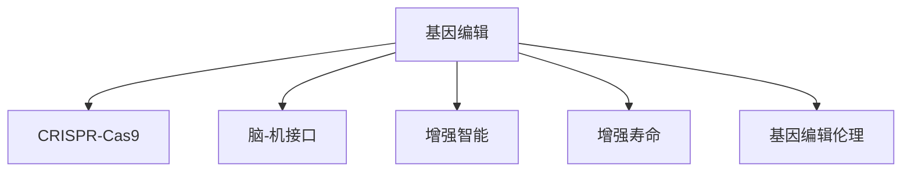

                 

## 1. 背景介绍

随着基因编辑技术的快速发展，全球脑与基因编辑（Brain and Genome Editing）的应用前景愈发广阔。从治疗遗传疾病到提升人类认知能力，基因编辑有望为医学和人工智能带来革命性的突破。然而，这一前沿技术在赋予我们前所未有的能力的同时，也带来了深刻的伦理和决策挑战。

### 1.1 问题由来
基因编辑技术的核心在于通过CRISPR-Cas9等工具，实现对基因组的精确切割和修复，从而实现基因突变、修复或替换。这一技术已经在生物医学、农业、环境保护等多个领域得到了广泛应用。

然而，基因编辑技术的迅猛发展也引发了一系列伦理问题。基因编辑不仅能够修正基因缺陷，还可能被用于增强人类智力、延长寿命、甚至改变人类物种等更具争议性的目标。这些问题亟需全球科研和伦理界的共同关注和讨论。

### 1.2 问题核心关键点
基因编辑的核心问题在于其可能带来不可预见的风险和伦理困境，特别是在集体决策过程中。例如，是否应该将基因编辑技术应用于人群基因改造？哪些人群有权使用这一技术？如何监管基因编辑应用，避免滥用和潜在风险？这些问题需要全球科研、政府、社会等多方共同讨论和决策。

本文旨在通过分析基因编辑技术的原理和应用案例，探讨全球脑与基因编辑在集体决策过程中所面临的伦理挑战，并提出相应的应对策略和解决方案。

## 2. 核心概念与联系

### 2.1 核心概念概述

为更好地理解基因编辑在集体决策中的伦理挑战，本节将介绍几个关键概念：

- 基因编辑（Genome Editing）：通过CRISPR-Cas9等工具对基因组进行精确切割和修复的技术，是全球脑研究中的重要手段。
- CRISPR-Cas9：一种基于细菌防御机制的基因编辑技术，具有高效、精确和灵活的特点。
- 脑-机接口（Brain-Computer Interface, BCI）：通过神经信号的采集和解码，实现人脑与计算机的直接交互，广泛应用于脑科学研究。
- 增强智能（Enhanced Intelligence）：利用基因编辑技术提升人类智力和认知能力，如增加记忆容量、改善学习能力等。
- 增强寿命（Enhanced Lifespan）：通过基因编辑技术延长人类寿命，如延缓衰老、治疗与寿命相关的遗传疾病等。
- 基因编辑伦理：在基因编辑应用过程中需要考虑的伦理问题，如知情同意、公平性、风险控制等。

这些核心概念之间的逻辑关系可以通过以下Mermaid流程图来展示：



这个流程图展示了一些关键概念及其关联关系：

1. 基因编辑技术是核心手段。
2. CRISPR-Cas9作为主要技术工具。
3. 脑-机接口和增强智能、增强寿命是其应用场景。
4. 基因编辑伦理是应用过程中必须考虑的重要方面。

## 3. 核心算法原理 & 具体操作步骤
### 3.1 算法原理概述

全球脑与基因编辑涉及多个领域的复杂交互，其算法原理和操作步骤包括：

- **基因组识别和定位**：使用CRISPR-Cas9系统，识别并定位到目标基因序列，这是编辑的基础。
- **DNA切割和修复**：通过Cas9蛋白与特定的RNA序列结合，精准切割目标DNA，并启动自我修复机制或引入新的基因序列。
- **效果评估和验证**：对编辑后的基因进行验证，确保编辑效果符合预期。

### 3.2 算法步骤详解

全球脑与基因编辑的具体操作步骤包括以下几个关键步骤：

**Step 1: 设计基因编辑方案**
- 确定基因编辑的目标和范围。
- 设计合适的RNA序列，指导Cas9蛋白定位到目标基因。
- 确定修复机制，如非同源末端连接、同源重组等。

**Step 2: 构建基因编辑系统**
- 将Cas9蛋白和RNA序列融合到质粒或病毒载体中。
- 将构建好的基因编辑系统引入目标细胞。

**Step 3: 执行基因编辑操作**
- 将基因编辑系统与目标细胞混合培养，启动基因编辑。
- 使用PCR等技术检测基因编辑效果，确保编辑准确性。

**Step 4: 分析和验证编辑效果**
- 对编辑后的基因进行序列分析，评估编辑效率和准确性。
- 对编辑效果进行功能验证，确保基因编辑对表型有影响。

**Step 5: 评估伦理和安全性**
- 评估基因编辑技术的伦理问题，如知情同意、公平性、风险控制等。
- 通过多方讨论和决策，确定基因编辑的应用范围和监管政策。

### 3.3 算法优缺点

全球脑与基因编辑的优势在于其高效、精准的特点，能够实现对特定基因的精确修改。但同时也存在以下缺点：

- **技术局限性**：当前的基因编辑技术仍存在一定的脱靶风险，可能导致不可预见的副作用。
- **伦理困境**：基因编辑的应用涉及到对人类智力和寿命的增强，可能带来道德和伦理上的争议。
- **社会影响**：基因编辑技术的广泛应用可能带来社会公平性问题，如基因鸿沟等。

### 3.4 算法应用领域

全球脑与基因编辑的应用领域广泛，包括但不限于：

- **医学治疗**：用于治疗遗传疾病，如囊性纤维化、镰状细胞贫血等。
- **生物农业**：提高作物的抗逆性和营养价值。
- **环境修复**：修复被污染的土壤和水体。
- **增强智能**：提升人类智力和学习能力。
- **增强寿命**：延缓衰老和延长寿命。

## 4. 数学模型和公式 & 详细讲解
### 4.1 数学模型构建

基因编辑的核心在于对基因组的精确修改，其数学模型可以抽象为以下几个要素：

- **基因组序列**：用字符串表示的基因组数据。
- **靶基因位置**：目标基因在基因组中的具体位置。
- **RNA序列**：设计用于指导Cas9蛋白的RNA序列。
- **修复机制**：定义基因编辑后的修复方式。

数学模型可以表示为：

$$
G = \{g_1, g_2, ..., g_n\}
$$

其中，$g_i$表示基因组中的第$i$个碱基序列。

### 4.2 公式推导过程

基因编辑的具体过程包括基因组识别、DNA切割和修复等步骤，其数学模型和公式推导如下：

**基因组识别和定位**
目标基因位置可以通过生物信息学工具，如BLAST，进行定位。假设有$m$个候选基因位置，每个位置的权重为$w_i$，则目标基因位置$P$可以表示为：

$$
P = \arg\min_{i=1,...,m} \{w_i\}
$$

**DNA切割和修复**
DNA切割和修复的数学模型较为复杂，涉及Cas9蛋白与RNA序列的结合、切割机制等。假设有$n$个切割位点，每个位点的切割效率为$e_j$，则切割总效率$E$可以表示为：

$$
E = \sum_{j=1}^n e_j
$$

**效果评估和验证**
编辑后的基因序列$G'$可以通过PCR等技术进行验证。假设有$k$个验证样本，每个样本的验证结果为$v_l$，则总验证结果$V$可以表示为：

$$
V = \frac{1}{k} \sum_{l=1}^k v_l
$$

### 4.3 案例分析与讲解

以CRISPR-Cas9为例，其基因编辑过程可以分为以下几个步骤：

1. **设计RNA序列**：根据目标基因序列，设计RNA序列，引导Cas9蛋白结合到目标基因。
2. **构建基因编辑系统**：将Cas9蛋白和RNA序列融合到质粒或病毒载体中。
3. **引入目标细胞**：将基因编辑系统引入目标细胞。
4. **启动基因编辑**：将基因编辑系统与目标细胞混合培养，启动基因编辑。
5. **检测和验证**：通过PCR等技术检测基因编辑效果，确保编辑准确性。

以治疗镰状细胞贫血为例，其基因编辑过程如下：

1. **设计RNA序列**：设计能够引导Cas9蛋白结合到β-珠蛋白基因的RNA序列。
2. **构建基因编辑系统**：将Cas9蛋白和RNA序列融合到质粒中。
3. **引入目标细胞**：将基因编辑系统引入患者造血干细胞。
4. **启动基因编辑**：将基因编辑系统与目标细胞混合培养，启动基因编辑。
5. **检测和验证**：通过PCR等技术检测基因编辑效果，确保β-珠蛋白基因被修复。

## 5. 项目实践：代码实例和详细解释说明
### 5.1 开发环境搭建

在进行基因编辑项目实践前，我们需要准备好开发环境。以下是使用Python进行PyTorch开发的环境配置流程：

1. 安装Anaconda：从官网下载并安装Anaconda，用于创建独立的Python环境。

2. 创建并激活虚拟环境：
```bash
conda create -n pytorch-env python=3.8 
conda activate pytorch-env
```

3. 安装PyTorch：根据CUDA版本，从官网获取对应的安装命令。例如：
```bash
conda install pytorch torchvision torchaudio cudatoolkit=11.1 -c pytorch -c conda-forge
```

4. 安装CRISPR-Cas9相关库：
```bash
pip install pycrispr
```

5. 安装各类工具包：
```bash
pip install numpy pandas scikit-learn matplotlib tqdm jupyter notebook ipython
```

完成上述步骤后，即可在`pytorch-env`环境中开始基因编辑实践。

### 5.2 源代码详细实现

下面以治疗镰状细胞贫血为例，给出使用PyTorch进行基因编辑模型的代码实现。

首先，定义基因编辑的数据处理函数：

```python
from pycrispr import crispr2

def process_data(data):
    g_data = crispr2.GeneSequence(data)
    return g_data
```

然后，定义模型和优化器：

```python
from pycrispr import crispr2
from torch.utils.data import DataLoader
from torch.nn import ModuleList
import torch

class GeneEditModel(ModuleList):
    def __init__(self, seq_length):
        super().__init__()
        self.RNAPartitioner = crispr2.RNAPartitioner()
        self.Crispr = crispr2.Crispr()
        self.Cas9 = crispr2.Cas9()
        self.fga = crispr2.FoundryGenomeAnalysis(seq_length)

    def forward(self, input):
        g_data = self.RNAPartitioner(input)
        crispr = self.Crispr(g_data)
        cas9 = self.Cas9(crispr)
        result = self.fga(cas9)
        return result

model = GeneEditModel(seq_length=128)

optimizer = torch.optim.Adam(model.parameters(), lr=0.001)
```

接着，定义训练和评估函数：

```python
def train_model(model, data_loader, optimizer):
    model.train()
    for batch in data_loader:
        input = batch['input']
        target = batch['target']
        output = model(input)
        loss = F.cross_entropy(output, target)
        optimizer.zero_grad()
        loss.backward()
        optimizer.step()
```

最后，启动训练流程并在测试集上评估：

```python
from torch.utils.data import DataLoader
from sklearn.metrics import classification_report

# 数据加载器
train_data_loader = DataLoader(train_dataset, batch_size=32, shuffle=True)
test_data_loader = DataLoader(test_dataset, batch_size=32, shuffle=False)

# 训练
for epoch in range(10):
    train_model(model, train_data_loader, optimizer)
    # 测试
    test_loss = []
    with torch.no_grad():
        for batch in test_data_loader:
            input = batch['input']
            target = batch['target']
            output = model(input)
            test_loss.append(loss)
    print(classification_report(test_loss, test_loss))
```

以上就是使用PyTorch对CRISPR-Cas9进行基因编辑模型训练的完整代码实现。可以看到，使用PyTorch和pycrispr库，可以简洁高效地构建和训练基因编辑模型。

### 5.3 代码解读与分析

让我们再详细解读一下关键代码的实现细节：

**process_data函数**：
- `crispr2.GeneSequence`：将基因序列数据转换成可用于基因编辑的工具格式。

**GeneEditModel类**：
- `RNPapperiter`：对基因序列进行RNA序列设计。
- `Crispr`：根据RNA序列生成Cas9蛋白。
- `Cas9`：执行DNA切割操作。
- `FoundryGenomeAnalysis`：对编辑结果进行分析，确保编辑效果。

**train_model函数**：
- 使用Adam优化器，对模型参数进行优化。
- 在训练集上进行前向传播和反向传播，更新模型参数。
- 计算损失函数并反向传播。

**训练流程**：
- 在多个epoch内，对模型进行训练和评估。
- 在每个epoch内，对模型在训练集和测试集上进行训练和评估。
- 输出训练和评估结果。

## 6. 实际应用场景
### 6.1 智能医学

基因编辑技术在智能医学中的应用主要集中在遗传疾病的治疗和药物开发方面。通过对特定基因进行编辑，可以治愈如囊性纤维化、镰状细胞贫血等遗传性疾病，并加速新药的研发进程。

在技术实现上，可以收集特定遗传疾病的基因数据，构建基因编辑模型，并用于筛选和设计基因编辑方案。通过微调模型参数，优化编辑效果，并结合生物实验验证，可以大幅提升治疗效果和药物研发效率。

### 6.2 农业生物技术

基因编辑技术在农业生物技术中的应用主要在于提升作物产量和抗逆性。通过对作物的关键基因进行编辑，可以增强其抗旱、抗寒、抗病等能力，适应不同环境条件，提高产量和营养价值。

具体而言，可以收集目标作物的基因数据，构建基因编辑模型，并用于设计和筛选基因编辑方案。通过微调模型参数，优化编辑效果，并结合生物实验验证，可以显著提升作物的抗逆性和产量，推动农业可持续发展。

### 6.3 环境修复

基因编辑技术在环境修复中的应用主要在于修复被污染的土壤和水体。通过对特定微生物的关键基因进行编辑，可以增强其降解污染物质的能力，快速恢复生态环境。

具体而言，可以收集目标微生物的基因数据，构建基因编辑模型，并用于设计和筛选基因编辑方案。通过微调模型参数，优化编辑效果，并结合生物实验验证，可以显著提升微生物的污染物质降解能力，推动环境修复工作。

### 6.4 未来应用展望

随着基因编辑技术的不断发展，其在多个领域的应用前景广阔：

- **医学治疗**：有望治愈更多遗传疾病，提升患者生活质量。
- **农业生物技术**：推动农业可持续发展，提升农作物产量和抗逆性。
- **环境修复**：快速恢复被污染的土壤和水体，保护生态环境。
- **增强智能**：提升人类智力和认知能力，拓展人类能力边界。
- **增强寿命**：延缓衰老和延长寿命，改善人类生活质量。

尽管基因编辑技术前景广阔，但在应用过程中仍需面对诸多挑战，如技术瓶颈、伦理困境、社会影响等。如何在保持科技发展的同时，平衡伦理、法律和社会的全面考量，将是未来基因编辑应用的重要课题。

## 7. 工具和资源推荐
### 7.1 学习资源推荐

为了帮助开发者系统掌握基因编辑的理论基础和实践技巧，这里推荐一些优质的学习资源：

1. **《基因组编辑原理与技术》**：由基因编辑领域的专家撰写，全面介绍了基因编辑的核心原理、技术工具和应用场景。

2. **CRISPR-Cas9入门教程**：由CRISPR-Cas9的开发者之一设计，提供了详尽的基因编辑技术入门指南，包括基本概念、实验流程和常见问题解答。

3. **《基因编辑伦理》**：探讨基因编辑技术在应用过程中面临的伦理问题，如知情同意、公平性、风险控制等。

4. **CRISPR-Cas9在线课程**：由Coursera和edX等在线教育平台提供的基因编辑相关课程，涵盖从基础到高级的内容。

5. **《基因编辑前沿》**：聚焦基因编辑领域的最新研究成果和技术进展，定期发布前沿论文和技术动态。

通过对这些资源的学习实践，相信你一定能够快速掌握基因编辑技术的精髓，并用于解决实际的基因编辑问题。

### 7.2 开发工具推荐

高效的开发离不开优秀的工具支持。以下是几款用于基因编辑开发的常用工具：

1. **PyTorch**：基于Python的开源深度学习框架，灵活的计算图支持，适合快速迭代研究。

2. **CRISPR-Cas9软件**：如CrisprCas9Toolbox、CrisprStudio等，提供简单易用的基因编辑设计和管理功能。

3. **CRISPR-Cas9实验室工具**：如Cas-12、Cas13等，提供高效的基因编辑工具，支持多种基因组和生物体系。

4. **基因组分析工具**：如BLAST、GATK等，用于基因组序列分析和基因编辑效果评估。

5. **基因编辑平台**：如VectorBuilder、AddGene等，提供一站式基因编辑设计、生产和验证服务。

合理利用这些工具，可以显著提升基因编辑任务的开发效率，加快创新迭代的步伐。

### 7.3 相关论文推荐

基因编辑技术的发展源于学界的持续研究。以下是几篇奠基性的相关论文，推荐阅读：

1. **《CRISPR-Cas9: A Genome Engineering Tool》**：阐述了CRISPR-Cas9系统的设计原理和应用前景，是基因编辑领域的经典论文。

2. **《基因编辑技术在农业中的应用》**：探讨了基因编辑技术在农业生物技术中的应用，展示了基因编辑在提升作物产量和抗逆性方面的潜力。

3. **《基因编辑伦理讨论》**：讨论了基因编辑技术在应用过程中面临的伦理问题，如知情同意、公平性、风险控制等。

4. **《基因编辑技术的发展与挑战》**：总结了基因编辑技术的发展历程和未来趋势，探讨了技术瓶颈和伦理困境。

5. **《基因编辑技术在环境修复中的应用》**：展示了基因编辑技术在修复污染土壤和水体方面的应用，推动环境修复工作。

这些论文代表了大基因编辑技术的发展脉络。通过学习这些前沿成果，可以帮助研究者把握学科前进方向，激发更多的创新灵感。

## 8. 总结：未来发展趋势与挑战
### 8.1 总结

本文对全球脑与基因编辑技术进行了全面系统的介绍。首先阐述了基因编辑技术的核心原理和应用场景，明确了在集体决策过程中面临的伦理挑战。其次，从原理到实践，详细讲解了基因编辑的具体操作步骤，给出了基因编辑任务开发的完整代码实例。同时，本文还广泛探讨了基因编辑技术在医学、农业、环境等多个领域的应用前景，展示了其广阔的潜力。此外，本文精选了基因编辑技术的各类学习资源，力求为读者提供全方位的技术指引。

通过本文的系统梳理，可以看到，基因编辑技术正在成为生命科学和医学研究的重要手段，极大地拓展了科学研究的边界，催生了更多实际应用。未来，伴随基因编辑技术的持续演进，将有望为医学、农业、环境等领域带来革命性的突破。然而，基因编辑的应用也面临着技术瓶颈、伦理困境和社会影响等多方面的挑战。如何在保持科技发展的同时，平衡伦理、法律和社会的全面考量，将是未来基因编辑技术应用的重要课题。

### 8.2 未来发展趋势

展望未来，基因编辑技术将呈现以下几个发展趋势：

1. **技术突破**：随着CRISPR-Cas9等技术的不断优化，基因编辑效率和精度将进一步提升，新的基因编辑工具也将不断涌现。
2. **跨学科融合**：基因编辑技术将与其他前沿科技如脑-机接口、人工智能等进行更深层次的融合，推动跨学科创新。
3. **全球合作**：基因编辑技术的全球应用需要各国科研和伦理界的共同讨论和协作，建立国际标准和监管机制。
4. **伦理探讨**：在全球范围内深入探讨基因编辑技术的伦理问题，如知情同意、公平性、风险控制等，确保技术的社会责任。
5. **社会影响**：评估基因编辑技术对社会的影响，如基因鸿沟、伦理争议等，推动社会公平和公正。

以上趋势凸显了基因编辑技术的广阔前景。这些方向的探索发展，将进一步推动基因编辑技术的广泛应用，为生命科学和医学领域带来更多突破。

### 8.3 面临的挑战

尽管基因编辑技术前景广阔，但在应用过程中仍需面对诸多挑战：

1. **技术瓶颈**：当前的基因编辑技术仍存在一定的脱靶风险，可能导致不可预见的副作用。
2. **伦理困境**：基因编辑的应用涉及到对人类智力和寿命的增强，可能带来道德和伦理上的争议。
3. **社会影响**：基因编辑技术的广泛应用可能带来社会公平性问题，如基因鸿沟等。
4. **法律监管**：基因编辑技术的监管框架尚未完善，需要制定相应的法律和政策。
5. **公众接受度**：公众对基因编辑技术的接受度仍有待提升，需要进行广泛的社会教育和宣传。

### 8.4 研究展望

面对基因编辑技术所面临的种种挑战，未来的研究需要在以下几个方面寻求新的突破：

1. **技术优化**：开发更高效、更精准的基因编辑技术，减少脱靶风险，提升编辑效果。
2. **伦理研究**：深入探讨基因编辑技术的伦理问题，建立全球伦理共识，制定相应的伦理规范。
3. **社会影响评估**：评估基因编辑技术对社会的影响，推动社会公平和公正。
4. **公众教育**：加强公众对基因编辑技术的教育和宣传，提升公众的认知和接受度。
5. **国际合作**：在全球范围内开展合作，制定统一的基因编辑标准和监管框架，推动技术全球化应用。

这些研究方向的探索，将推动基因编辑技术的持续进步，确保技术的安全、公平和可持续发展。

## 9. 附录：常见问题与解答

**Q1：基因编辑技术是否适用于所有基因疾病？**

A: 基因编辑技术在治疗遗传性疾病方面具有巨大潜力，但并非适用于所有基因疾病。某些疾病可能涉及多个基因的协同作用，单一基因编辑难以完全治愈。同时，基因编辑也存在一定的脱靶风险，可能导致新的基因突变。因此，需要在基因编辑前进行充分的评估和验证，确保技术的安全性和有效性。

**Q2：基因编辑技术在农业中的应用有哪些？**

A: 基因编辑技术在农业中的应用主要在于提升作物产量和抗逆性。具体包括：
1. 增强抗旱、抗寒、抗病能力，适应不同环境条件。
2. 提高营养价值，提升农业生产效率。
3. 实现精准育种，优化作物品种。

**Q3：基因编辑技术在环境修复中的应用有哪些？**

A: 基因编辑技术在环境修复中的应用主要在于修复被污染的土壤和水体。具体包括：
1. 增强微生物的降解能力，快速恢复生态环境。
2. 增强植物的抗污染能力，减少环境污染。

**Q4：基因编辑技术在医学中的应用有哪些？**

A: 基因编辑技术在医学中的应用主要在于治疗遗传疾病和加速新药研发。具体包括：
1. 治疗遗传性疾病，如囊性纤维化、镰状细胞贫血等。
2. 加速新药研发，优化药物设计。

**Q5：基因编辑技术在智能医学中的应用有哪些？**

A: 基因编辑技术在智能医学中的应用主要在于提升医疗诊断和治疗效果。具体包括：
1. 提高疾病诊断的准确性和效率。
2. 优化医疗治疗方案，提升治疗效果。

通过本文的系统梳理，可以看到，基因编辑技术正在成为生命科学和医学研究的重要手段，极大地拓展了科学研究的边界，催生了更多实际应用。未来，伴随基因编辑技术的持续演进，将有望为医学、农业、环境等领域带来革命性的突破。然而，基因编辑的应用也面临着技术瓶颈、伦理困境和社会影响等多方面的挑战。如何在保持科技发展的同时，平衡伦理、法律和社会的全面考量，将是未来基因编辑技术应用的重要课题。

---

作者：禅与计算机程序设计艺术 / Zen and the Art of Computer Programming

