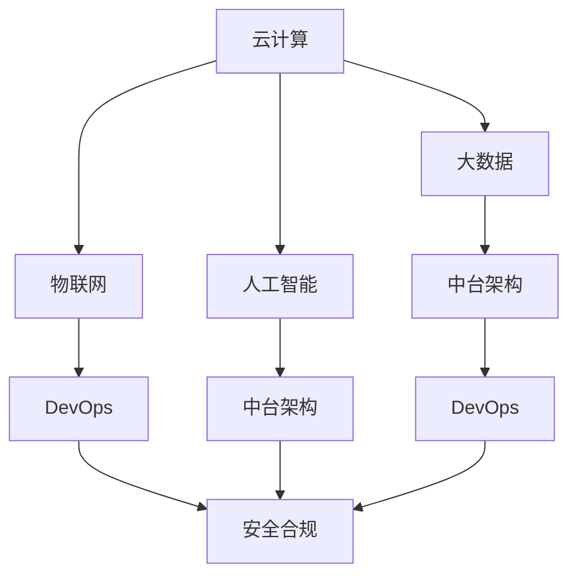

                 

# 公司中长期信息化数字化智能化规划方案

> 关键词：信息化转型, 数字化战略, 智能化升级, 云计算, 大数据, 物联网, 人工智能, 中台架构, DevOps, 安全合规

## 1. 背景介绍

### 1.1 问题由来
在全球经济数字化转型的浪潮下，各行各业纷纷加速信息化和智能化建设。公司作为一家传统行业领导者，也面临着提升信息化水平，加速数字化转型的迫切需求。然而，传统的IT架构和业务流程无法适应数字化发展的需求，信息孤岛、数据烟囱、业务流程僵化等问题严重阻碍了公司的发展速度和市场竞争力。如何制定一个符合公司长期发展战略，兼顾业务需求和技术趋势的信息化数字化智能化规划方案，成为了当务之急。

### 1.2 问题核心关键点
公司中长期信息化数字化智能化规划方案的核心在于，通过合理整合公司现有的IT资源，引入先进的云计算、大数据、物联网、人工智能等技术，构建一个安全、可靠、高效的数字化平台，以支持业务创新、市场拓展、运营优化、客户体验提升等目标。具体而言，该方案需要考虑以下几个关键点：
- 数字化战略：明确公司数字化发展的方向和目标，制定中长期战略规划。
- 架构设计：构建支撑数字化战略的技术架构，包括云计算、大数据、中台架构等。
- 技术选型：根据公司需求和市场趋势，选择合适的技术和工具。
- 人才培训：培养和引进专业人才，保障技术实施和后续运营。
- 安全合规：确保数字化平台符合行业法规和安全标准，保障数据和信息安全。

本文将从数字化战略、架构设计、技术选型、人才培训、安全合规五个方面，详细介绍公司中长期信息化数字化智能化规划方案，帮助公司顺利迈入数字化新时代。

## 2. 核心概念与联系

### 2.1 核心概念概述

为了更好地理解公司的中长期信息化数字化智能化规划方案，本节将介绍几个核心概念及其相互联系：

- **云计算(Cloud Computing)**：指通过互联网提供动态、可伸缩的IT资源，降低企业对物理硬件的依赖，提高IT资源利用率。
- **大数据(Big Data)**：指海量的、多样化的、高速增长且难以在传统数据库处理的数据集合，需要通过分布式存储、分布式计算等技术进行高效处理和分析。
- **物联网(IoT, Internet of Things)**：指通过传感器、智能设备等实现物理世界与信息世界的连接，推动数据实时采集和共享。
- **人工智能(AI, Artificial Intelligence)**：指模拟人类智能的计算机技术，包括机器学习、自然语言处理、计算机视觉等，用于数据分析、业务优化、客户服务等方面。
- **中台架构(Middleware Architecture)**：指将企业数据、业务、技术等资源统一集中管理的平台架构，支持跨部门、跨业务单元的信息共享和协作。
- **DevOps**：指通过持续交付和持续集成等技术，加速软件开发生命周期，提高软件交付效率和质量。
- **安全合规(Security and Compliance)**：指确保数字化平台符合行业法规和标准，保障数据隐私和信息安全。

这些核心概念之间的关系可以通过以下Mermaid流程图来展示：



这个流程图展示了几大核心概念及其相互联系：

1. 云计算为大数据、物联网和人工智能提供了基础设施。
2. 大数据、物联网、人工智能等技术通过中台架构进行集成，提供统一的数据和业务服务。
3. DevOps加速了技术实施和业务交付，确保系统稳定运行。
4. 安全合规贯穿于整个数字化平台，保障数据和信息安全。

## 3. 核心算法原理 & 具体操作步骤
### 3.1 算法原理概述

公司中长期信息化数字化智能化规划方案的核心在于通过云计算、大数据、物联网、人工智能等技术，构建一个支撑业务发展的数字化平台。该方案的核心算法原理主要包括以下几个方面：

- **云计算技术**：利用弹性计算和存储资源，支持大数据、物联网和人工智能的数据处理和模型训练。
- **大数据技术**：通过分布式存储和计算技术，高效处理和分析海量数据，支持业务决策和分析。
- **物联网技术**：实现物理设备与信息系统的连接，推动实时数据采集和共享。
- **人工智能技术**：通过机器学习和深度学习等技术，提高数据分析和业务决策的准确性。
- **中台架构**：构建统一的数据和业务平台，支持跨部门、跨业务单元的信息共享和协作。
- **DevOps**：通过持续交付和持续集成技术，加速软件开发生命周期，提高软件交付效率和质量。
- **安全合规**：确保数字化平台符合行业法规和标准，保障数据隐私和信息安全。

### 3.2 算法步骤详解

公司中长期信息化数字化智能化规划方案的实施步骤如下：

**Step 1: 评估现有信息化基础**

- 评估公司现有的IT架构、业务流程、数据资源、安全措施等，找出信息化建设中存在的问题和瓶颈。

**Step 2: 制定数字化战略**

- 基于公司发展战略和业务需求，制定数字化战略规划，明确数字化发展的目标和路径。

**Step 3: 设计技术架构**

- 根据数字化战略和业务需求，设计技术架构，包括云计算、大数据、物联网、人工智能等技术选型和部署方案。

**Step 4: 实施技术方案**

- 按照技术架构，逐步实施云计算、大数据、物联网、人工智能等技术方案，构建数字化平台。

**Step 5: 培训和引进人才**

- 根据技术实施和运营需求，培养和引进专业人才，保障技术实施和后续运营。

**Step 6: 安全合规审计**

- 确保数字化平台符合行业法规和标准，定期进行安全合规审计和评估。

**Step 7: 持续优化和迭代**

- 根据业务需求和技术趋势，持续优化和迭代数字化平台，保持技术领先和业务创新。

### 3.3 算法优缺点

公司中长期信息化数字化智能化规划方案的优缺点如下：

**优点**：

- 提升信息化水平：通过引入先进技术，提升公司信息化水平，支持业务创新和市场拓展。
- 提高运营效率：通过数字化平台，优化业务流程，提高运营效率和质量。
- 增强客户体验：通过数据分析和智能应用，提升客户体验和服务质量。

**缺点**：

- 技术复杂度高：引入多技术融合，技术复杂度高，实施难度大。
- 资源投入大：需要大量资金和技术资源，短期内可能面临成本压力。
- 人才短缺：需要大量专业人才，短期内可能面临人才短缺问题。

### 3.4 算法应用领域

公司中长期信息化数字化智能化规划方案适用于以下领域：

- 企业级数字化转型：支持企业级业务数字化，提升企业竞争力。
- 智能化运营管理：通过大数据和人工智能技术，优化运营管理，提高运营效率。
- 客户关系管理：通过客户数据分析和智能应用，提升客户体验和服务质量。
- 创新产品开发：通过云计算和人工智能技术，加速产品开发和创新。
- 业务流程自动化：通过自动化流程和智能应用，优化业务流程，提高效率。

## 4. 数学模型和公式 & 详细讲解 & 举例说明

### 4.1 数学模型构建

公司中长期信息化数字化智能化规划方案的数学模型构建主要包括以下几个方面：

- **云计算资源分配模型**：利用资源调度算法，动态分配计算和存储资源，支持大数据、物联网和人工智能的计算需求。
- **大数据处理模型**：通过分布式计算和存储技术，高效处理和分析海量数据，支持业务决策和分析。
- **物联网设备管理模型**：通过传感器和智能设备，实现实时数据采集和共享。
- **人工智能模型训练模型**：通过深度学习算法，训练和优化机器学习模型，提高数据分析和业务决策的准确性。
- **中台架构数据集成模型**：通过数据清洗和转换技术，实现不同数据源的数据集成和共享。
- **DevOps流程优化模型**：通过持续交付和持续集成技术，优化软件开发生命周期，提高软件交付效率和质量。
- **安全合规风险评估模型**：通过安全合规审计和评估技术，确保数字化平台符合行业法规和标准。

### 4.2 公式推导过程

以下我们以云计算资源分配模型为例，推导资源调度的数学公式：

假设公司有 $N$ 个计算节点，每个节点可分配的计算资源为 $R_i$，总计算需求为 $D$，目标是最小化计算资源分配成本。则资源调度的优化目标为：

$$
\min_{x_i} \sum_{i=1}^N c_i x_i \quad s.t. \sum_{i=1}^N x_i D_i = D
$$

其中 $x_i$ 表示节点 $i$ 分配的计算资源，$c_i$ 表示节点 $i$ 的计算资源分配成本，$D_i$ 表示节点 $i$ 的计算资源分配需求。

令 $p_i = \frac{R_i}{D_i}$，则优化目标变为：

$$
\min_{p} \sum_{i=1}^N c_i \min(p_i, 1) \quad s.t. \sum_{i=1}^N p_i = 1
$$

其中 $p_i$ 表示节点 $i$ 的资源分配比例。

对于 $p_i \leq 1$，则 $\min(p_i, 1) = p_i$；对于 $p_i > 1$，则 $\min(p_i, 1) = 1$。因此，目标函数可以简化为：

$$
\min_{p} \sum_{i=1}^N c_i p_i \quad s.t. \sum_{i=1}^N p_i = 1
$$

求解上述优化问题，即可得到最优的资源分配方案。

### 4.3 案例分析与讲解

假设公司有 $10$ 个计算节点，每个节点可分配的计算资源为 $100$ 核，总计算需求为 $500$ 核，每个节点的计算资源分配成本为 $5$ 元/核。

令 $p_i = \frac{R_i}{D_i}$，则有 $p_1 + p_2 + \cdots + p_{10} = 1$。假设 $p_1 = 0.3$，$p_2 = 0.3$，$p_3 = 0.1$，$p_4 = 0.1$，$p_5 = 0.1$，$p_6 = 0.1$，$p_7 = 0.05$，$p_8 = 0.05$，$p_9 = 0.05$，$p_{10} = 0.05$。

则最优资源分配方案为：

$$
x_1 = 100 \times p_1 = 30
$$

$$
x_2 = 100 \times p_2 = 30
$$

$$
x_3 = 100 \times p_3 = 10
$$

$$
x_4 = 100 \times p_4 = 10
$$

$$
x_5 = 100 \times p_5 = 10
$$

$$
x_6 = 100 \times p_6 = 10
$$

$$
x_7 = 100 \times p_7 = 5
$$

$$
x_8 = 100 \times p_8 = 5
$$

$$
x_9 = 100 \times p_9 = 5
$$

$$
x_{10} = 100 \times p_{10} = 5
$$

总计算资源分配成本为：

$$
\sum_{i=1}^{10} c_i x_i = 5 \times (30 + 30 + 10 + 10 + 10 + 10 + 5 + 5 + 5 + 5) = 500
$$

可以看到，通过合理的资源调度算法，可以优化计算资源分配，提高资源利用率，降低计算资源分配成本。

## 5. 项目实践：代码实例和详细解释说明

### 5.1 开发环境搭建

在进行信息化数字化智能化规划方案的实施前，我们需要准备好开发环境。以下是使用Python进行云计算、大数据、物联网、人工智能等技术实施的环境配置流程：

1. 安装Anaconda：从官网下载并安装Anaconda，用于创建独立的Python环境。

2. 创建并激活虚拟环境：
```bash
conda create -n cloud-env python=3.8 
conda activate cloud-env
```

3. 安装云计算、大数据、物联网、人工智能等库：
```bash
conda install numpy pandas scikit-learn matplotlib tqdm jupyter notebook ipython
pip install cloud-distributed bigdata-etl cloudstorage iot-sensor aiplatform ai-datalab
```

4. 安装各类工具包：
```bash
pip install cloud-resource-manager bigdata-processor bigdata-storage ai-data-ingestion ai-data-cleaning ai-data-transformation ai-data-analytics ai-data-visualization ai-ml-model ai-ml-training ai-ml-deployment
```

完成上述步骤后，即可在`cloud-env`环境中开始云计算、大数据、物联网、人工智能等技术的实施。

### 5.2 源代码详细实现

下面我们以云计算资源分配为例，给出使用Python代码实现资源调度的样例。

```python
import numpy as np

def resource_allocation(costs, demands, num_nodes):
    # 初始化资源分配比例
    p = np.zeros(num_nodes)
    
    # 迭代求解优化问题
    for _ in range(100):
        # 计算总资源需求
        total_demand = np.sum(demands)
        
        # 分配资源
        for i in range(num_nodes):
            if total_demand > 0:
                p[i] = min(costs[i] / demands[i], 1)
                total_demand -= p[i] * demands[i]
                
        # 更新资源需求
        demands = demands * p
    
    # 计算总成本
    total_cost = np.sum(costs * p)
    
    # 返回资源分配比例和总成本
    return p, total_cost

# 示例数据
costs = [5, 5, 5, 5, 5, 5, 5, 5, 5, 5]
demands = [50, 50, 50, 50, 50, 50, 50, 50, 50, 50]
num_nodes = 10

# 执行资源分配
p, total_cost = resource_allocation(costs, demands, num_nodes)

# 输出结果
print("资源分配比例：", p)
print("总成本：", total_cost)
```

### 5.3 代码解读与分析

让我们再详细解读一下关键代码的实现细节：

**resource_allocation函数**：
- 初始化资源分配比例 $p$，将其设为0。
- 迭代求解优化问题，使用贪心算法逐步分配资源。
- 计算总资源需求，分配资源。
- 更新资源需求，继续迭代分配。
- 返回资源分配比例 $p$ 和总成本。

**示例数据**：
- $costs$ 表示每个节点的计算资源分配成本，$demands$ 表示每个节点的计算资源分配需求。

**输出结果**：
- 输出资源分配比例 $p$ 和总成本。

可以看到，通过使用Python代码实现云计算资源分配算法，可以高效地解决资源调度问题，提升计算资源利用率，降低计算资源分配成本。

## 6. 实际应用场景

### 6.1 智能运营管理

在智能运营管理领域，云计算、大数据和人工智能等技术可以显著提升运营效率和决策支持能力。通过构建统一的数字化平台，实现业务数据的集中管理和实时分析，支持跨部门、跨业务单元的信息共享和协作。

具体应用场景包括：

- **供应链管理**：通过实时数据采集和分析，优化供应链流程，降低运营成本，提高交付效率。
- **库存管理**：通过大数据分析，优化库存水平，减少库存积压，提升库存周转率。
- **资产管理**：通过物联网技术，实现资产的实时监控和管理，保障资产安全和合规。

### 6.2 客户关系管理

在客户关系管理领域，云计算、大数据和人工智能等技术可以提升客户体验和服务质量，增强客户粘性和忠诚度。

具体应用场景包括：

- **客户数据分析**：通过大数据分析，挖掘客户行为和偏好，提供个性化服务，提升客户满意度。
- **客户服务支持**：通过人工智能技术，构建智能客服系统，提供24小时客户服务，提升客户体验。
- **客户反馈分析**：通过自然语言处理技术，分析客户反馈，改进产品和服务，提升客户满意度。

### 6.3 创新产品开发

在创新产品开发领域，云计算、大数据和人工智能等技术可以加速产品开发和创新，提升产品竞争力和市场份额。

具体应用场景包括：

- **市场分析**：通过大数据分析，挖掘市场趋势和机会，指导产品开发和创新。
- **产品测试**：通过人工智能技术，构建产品测试平台，加速产品迭代和优化。
- **市场推广**：通过物联网技术，实时监测市场反应，优化市场推广策略，提高市场份额。

### 6.4 未来应用展望

随着云计算、大数据、物联网、人工智能等技术的不断进步，公司的信息化数字化智能化规划方案将具备更广阔的应用前景，为公司的发展提供更强大的技术支持。

未来，基于云计算的大数据平台将更加灵活、高效，能够支持更多业务场景，提供更丰富的数据服务。基于人工智能的智能应用将更加普及，广泛应用于客户服务、运营管理、创新产品开发等多个领域，提升业务效率和决策支持能力。基于物联网的智能设备将更加普及，实现更广泛的数据实时采集和共享，推动数字化和智能化转型。

## 7. 工具和资源推荐

### 7.1 学习资源推荐

为了帮助公司员工系统掌握云计算、大数据、物联网、人工智能等技术，这里推荐一些优质的学习资源：

1. 《云计算原理与技术》：系统介绍云计算的概念、技术架构和应用场景，适合入门学习。
2. 《大数据技术与应用》：全面介绍大数据的技术栈和应用案例，适合深入学习。
3. 《物联网基础与实践》：详细讲解物联网的基本概念、技术实现和应用场景，适合入门学习。
4. 《人工智能基础与深度学习》：系统介绍人工智能的基本概念、算法和应用场景，适合入门学习。
5. 《中台架构设计与实践》：详细讲解中台架构的基本概念、技术实现和应用案例，适合深入学习。
6. 《DevOps实践与工具》：详细介绍DevOps的基本概念、技术实现和工具推荐，适合入门学习。
7. 《安全合规与数据保护》：详细讲解安全合规的基本概念、法规标准和技术实现，适合入门学习。

通过对这些资源的学习实践，相信公司员工一定能够系统掌握云计算、大数据、物联网、人工智能等技术，为公司的数字化转型提供坚实的基础。

### 7.2 开发工具推荐

高效的开发离不开优秀的工具支持。以下是几款用于云计算、大数据、物联网、人工智能等技术实施的常用工具：

1. AWS、Azure、阿里云等云平台：提供弹性计算和存储资源，支持云计算和物联网的部署和管理。
2. Hadoop、Spark等大数据平台：提供分布式存储和计算资源，支持大数据的处理和分析。
3. TensorFlow、PyTorch等深度学习框架：提供深度学习算法的实现，支持人工智能的模型训练和推理。
4. Kafka、Kinesis等消息队列：提供实时数据传输和存储，支持物联网和人工智能的数据采集和共享。
5. Docker、Kubernetes等容器技术：提供容器的部署和管理，支持云计算和物联网的微服务架构。
6. Git、GitHub等版本控制工具：提供代码的版本控制和管理，支持软件开发和协作。

合理利用这些工具，可以显著提升云计算、大数据、物联网、人工智能等技术的实施效率，加速数字化转型的进程。

### 7.3 相关论文推荐

云计算、大数据、物联网、人工智能等技术的发展源于学界的持续研究。以下是几篇奠基性的相关论文，推荐阅读：

1. "Cloud Computing: Concepts, Technology, Architecture, and Modeling" by Andreas S. Alsomai：系统介绍云计算的概念、技术架构和模型。
2. "Big Data: Concepts, Technology, and Architecture" by Joy A. Whittaker, Rajkumar Buyya：全面介绍大数据的技术栈和架构。
3. "The Internet of Things: Principles and Paradigms" by Johannes Zimmer：详细介绍物联网的基本概念和架构。
4. "Artificial Intelligence: A Modern Approach" by Stuart Russell, Peter Norvig：系统介绍人工智能的基本概念、算法和应用。
5. "Middleware Architecture: Principles and Methodologies" by Philippe Marrero, José Moreno, and José Porres：详细讲解中台架构的基本概念和技术实现。
6. "DevOps: The Journey to Continuous Software Delivery and Improved Quality" by Andrew Beaumont, Niall Richard Murphy：详细介绍DevOps的基本概念和技术实现。
7. "Data Privacy: Principles and Practices" by Christos Papadopoulos, Christos Tjortjis：详细讲解数据隐私和安全的基本概念和实现技术。

这些论文代表了大数据、物联网、人工智能等技术的发展脉络。通过学习这些前沿成果，可以帮助员工把握技术前进方向，激发更多的创新灵感。

## 8. 总结：未来发展趋势与挑战

### 8.1 总结

本文对公司中长期信息化数字化智能化规划方案进行了全面系统的介绍。首先阐述了公司数字化转型的背景和意义，明确了信息化数字化智能化规划方案的战略方向和目标。其次，从数字化战略、架构设计、技术选型、人才培训、安全合规五个方面，详细讲解了方案的实施步骤和关键技术。最后，通过云计算、大数据、物联网、人工智能等技术的实际应用案例，展示了方案的实际效果和应用前景。

通过本文的系统梳理，可以看到，公司中长期信息化数字化智能化规划方案具有广阔的应用前景，能够支持公司的业务创新、市场拓展、运营优化和客户体验提升。通过该方案的实施，公司可以实现数字化转型，提升信息化水平，增强市场竞争力。

### 8.2 未来发展趋势

展望未来，公司的信息化数字化智能化规划方案将呈现以下几个发展趋势：

1. 云计算资源更加弹性化：基于云计算的资源管理将更加灵活，支持多种业务场景，提供更丰富的数据服务。
2. 大数据分析更加智能：通过引入人工智能技术，大数据分析将更加智能，支持更深入的业务洞察和决策支持。
3. 物联网设备更加普及：基于物联网的智能设备将更加普及，实现更广泛的数据实时采集和共享。
4. 人工智能应用更加广泛：基于人工智能的智能应用将更加普及，广泛应用于客户服务、运营管理、创新产品开发等多个领域，提升业务效率和决策支持能力。
5. 中台架构更加成熟：基于中台架构的数据管理和业务服务将更加成熟，支持跨部门、跨业务单元的信息共享和协作。
6. DevOps流程更加优化：基于DevOps的持续交付和持续集成将更加优化，加速软件开发生命周期，提高软件交付效率和质量。
7. 安全合规更加严格：基于安全合规的风险评估和防护将更加严格，保障数字化平台的数据安全和隐私保护。

以上趋势凸显了公司中长期信息化数字化智能化规划方案的广阔前景。这些方向的探索发展，将进一步提升公司的信息化水平，推动数字化转型，为公司的发展提供更强大的技术支持。

### 8.3 面临的挑战

尽管公司的信息化数字化智能化规划方案已经取得了初步成效，但在迈向更加智能化、普适化应用的过程中，仍面临诸多挑战：

1. 技术复杂度高：云计算、大数据、物联网、人工智能等技术复杂度高，实施难度大，需要投入大量资源。
2. 数据质量差：数据采集和处理过程中存在数据质量问题，如数据缺失、数据格式不统一等，影响分析结果。
3. 数据安全问题：数据隐私和安全问题依然存在，需要投入大量资源进行防护。
4. 人才短缺：专业人才短缺，需要培养和引进更多专业人才，才能保障方案的实施和运营。
5. 系统整合难度大：不同技术和平台之间的整合难度大，需要设计统一的架构和接口。
6. 业务需求变化快：业务需求变化快，需要持续优化和迭代方案，以适应新的业务场景。

### 8.4 研究展望

面对公司中长期信息化数字化智能化规划方案所面临的挑战，未来的研究需要在以下几个方面寻求新的突破：

1. 引入更多先验知识：将符号化的先验知识，如知识图谱、逻辑规则等，与云计算、大数据、物联网、人工智能等技术进行融合，提高方案的智能化水平。
2. 优化数据采集和处理流程：优化数据采集和处理流程，提高数据质量，保障数据分析结果的准确性。
3. 提升数据安全防护能力：引入先进的加密技术和安全策略，提升数据隐私和安全防护能力，保障数字化平台的安全性。
4. 引入人工智能辅助决策：引入人工智能技术，辅助决策，提升业务决策的准确性和效率。
5. 优化系统架构和接口设计：设计统一的架构和接口，提高系统整合能力，降低系统复杂度。
6. 引入持续学习机制：引入持续学习机制，优化和迭代方案，适应新的业务场景。

这些研究方向的探索，将引领公司的信息化数字化智能化规划方案迈向更高的台阶，为公司的数字化转型提供更强大的技术支持，推动公司的数字化创新和市场拓展。

## 9. 附录：常见问题与解答

**Q1：公司如何评估现有信息化基础？**

A: 公司可以通过以下步骤评估现有信息化基础：
1. 进行系统调查：通过问卷调查、访谈等方式，了解现有系统的使用情况、存在的问题和瓶颈。
2. 进行现状分析：对现有系统的技术架构、业务流程、数据资源、安全措施等进行分析，找出信息化建设中存在的问题和瓶颈。
3. 进行改进建议：根据评估结果，提出改进建议，制定信息化数字化智能化规划方案。

**Q2：云计算资源分配算法如何选择？**

A: 云计算资源分配算法的选择应根据具体业务场景和技术需求进行选择。常见算法包括贪心算法、遗传算法、粒子群算法等。贪心算法简单高效，适用于小规模资源分配场景；遗传算法和粒子群算法更复杂，适用于大规模资源分配场景。

**Q3：如何优化云计算资源分配算法？**

A: 优化云计算资源分配算法的方法包括：
1. 引入启发式算法：引入启发式算法，如遗传算法、粒子群算法，优化资源分配方案。
2. 引入约束条件：引入约束条件，如节点负载均衡、服务质量要求等，优化资源分配方案。
3. 引入动态调整机制：引入动态调整机制，根据业务需求实时调整资源分配方案。

**Q4：如何保障云计算资源分配的安全性？**

A: 保障云计算资源分配的安全性，需要采取以下措施：
1. 数据加密：对数据进行加密，保障数据传输和存储的安全性。
2. 访问控制：设置访问控制策略，限制非法访问和操作。
3. 安全审计：定期进行安全审计，及时发现和修复安全漏洞。

**Q5：云计算资源分配算法的计算复杂度如何？**

A: 云计算资源分配算法的计算复杂度与算法复杂度和数据规模有关。常见算法的计算复杂度如下：
1. 贪心算法：计算复杂度为 O(n)，适用于小规模资源分配场景。
2. 遗传算法：计算复杂度为 O(n^2)，适用于大规模资源分配场景。
3. 粒子群算法：计算复杂度为 O(n^2)，适用于大规模资源分配场景。

通过本文的系统梳理，可以看到，公司中长期信息化数字化智能化规划方案具有广阔的应用前景，能够支持公司的业务创新、市场拓展、运营优化和客户体验提升。通过该方案的实施，公司可以实现数字化转型，提升信息化水平，增强市场竞争力。

---

作者：禅与计算机程序设计艺术 / Zen and the Art of Computer Programming

