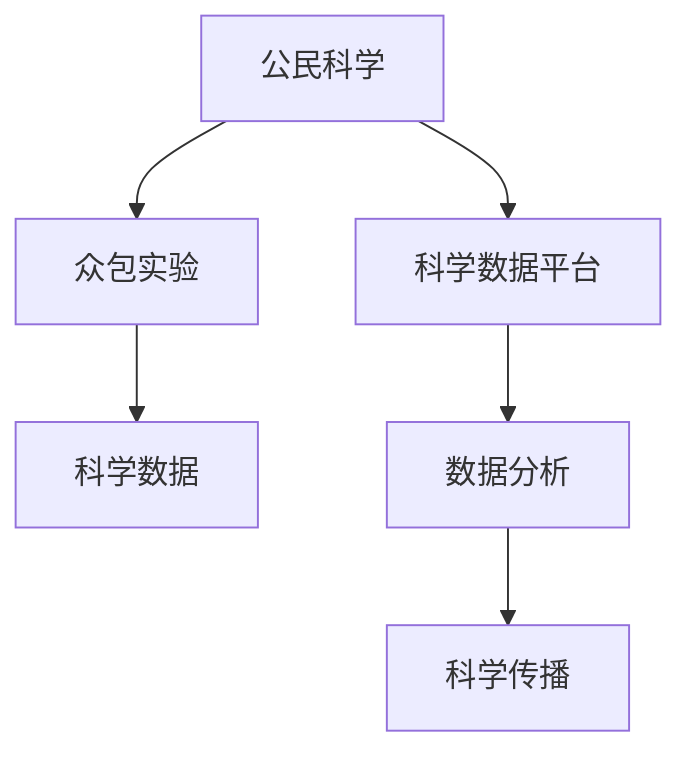

                 

# 公民科学：公众参与科学研究的新途径

> 关键词：公民科学,公众参与,科学研究,众包实验,科学数据,公民科学平台

## 1. 背景介绍

### 1.1 问题由来
随着科技的进步，科学研究已经变得越来越专业化、技术化。研究机构和学者往往凭借先进的研究设备、丰富的专业知识和完善的实验体系，完成前沿领域的研究工作。然而，由于资源的限制和技术的门槛，公众对科学研究过程的参与度较低，使得科学发现离公众的日常生活和生活环境仍然存在一定的距离。

公众参与科学研究不仅是推进科学普及教育、提升全民科学素养的重要途径，也是加速科学发现和技术突破的关键力量。在当前信息时代，互联网和社交媒体等平台提供了新的技术手段和社交环境，使得公众能够以更加直接和高效的方式参与科学研究，这一趋势就是“公民科学”。

### 1.2 问题核心关键点
公民科学强调的是公众参与科研的全过程，从研究设计到数据收集，再到数据分析和科学传播，公众都可以直接参与其中。其核心在于充分利用大众的力量，提高科研的开放性和透明度，促进科学知识的传播与交流，加速科学发现的进程。

公民科学的关键点在于：
- **研究设计的众包化**：利用众包平台收集大众的创意和意见，形成多样化的研究设计方案。
- **数据收集的民主化**：通过众包实验平台，让大众直接参与数据收集，提供丰富的数据源。
- **数据分析的社会化**：利用社会计算技术，对大规模数据进行分析和挖掘，发现新的科学现象和规律。
- **科学传播的通俗化**：通过社交媒体和科学传播平台，将复杂的科学研究成果转化为通俗易懂的内容，推广到公众。

公民科学的兴起，为科学传播和科学普及提供了新的路径，也为科学研究带来了更多创新的可能性。

## 2. 核心概念与联系

### 2.1 核心概念概述

为更好地理解公民科学，本节将介绍几个关键概念：

- **公民科学(Citizen Science)**：指的是非专业人士参与的科学研究活动。它强调公众与专业研究者之间的互动和协作，推动科学知识的普及和科学研究的民主化。
- **众包实验(Crowdsourced Experiment)**：指通过众包平台，让公众参与科学实验的设计和实施，为研究提供多样化的数据和见解。
- **科学数据(Scientific Data)**：科学研究中使用的各种数据，包括实验数据、观测数据、模拟数据等。
- **公民科学平台(Citizen Science Platform)**：专门为公众参与科学研究设计的在线平台，提供实验设计、数据收集、数据分析等功能支持。

这些概念之间的逻辑关系可以通过以下Mermaid流程图来展示：



这个流程图展示出公民科学的主要流程和关键组件：

1. 公民科学通过众包实验收集科学数据。
2. 科学数据通过平台进行分析，得到新的科学发现。
3. 科学发现通过科学传播平台，传播到公众。

## 3. 核心算法原理 & 具体操作步骤
### 3.1 算法原理概述

公民科学的实践流程可以概括为三个主要步骤：众包实验设计、数据收集与分析、科学传播。

在众包实验设计阶段，研究者将研究问题转化为具体的实验任务，设计出可操作的实验方案，并在众包平台上发布。志愿者根据实验任务，参与到数据收集过程中。

在数据收集阶段，志愿者使用科学数据平台提供的设备和工具，按照实验方案进行操作，收集实验数据。数据平台负责数据的存储、备份和初步处理。

在数据分析阶段，研究者使用社会计算技术，对大规模数据进行分析和挖掘，发现新的科学现象和规律。数据分析的结果再次反馈到众包平台上，供志愿者学习和讨论。

### 3.2 算法步骤详解

以下我们将详细介绍每个阶段的具体操作步骤：

#### 3.2.1 众包实验设计

- **确定研究问题**：研究者根据兴趣和需要，确定一个具体的科学问题，如气候变化、物种多样性等。
- **设计实验方案**：研究者设计实验方案，明确实验目标、步骤和所需的资源。实验方案可以包括实验任务、数据收集方式、数据格式等。
- **发布实验任务**：研究者将实验方案发布到众包平台上，向公众征集志愿者，并通过平台提供实验指导和培训。
- **选择志愿者**：志愿者根据自身兴趣和能力，选择参与的实验任务，并进行必要的培训。

#### 3.2.2 数据收集与分析

- **实验准备**：志愿者根据实验方案，准备好所需的设备和工具，如观测仪器、问卷调查表等。
- **数据收集**：志愿者按照实验方案，进行数据收集。数据可以是观测记录、调查问卷、实验结果等。
- **数据上传**：数据通过科学数据平台上传，平台进行初步处理，如数据清洗、格式转换等。
- **数据分析**：研究者使用社会计算技术，对大规模数据进行分析和挖掘，发现新的科学现象和规律。

#### 3.2.3 科学传播

- **数据分享**：研究者将分析结果共享到科学数据平台上，供公众访问和讨论。
- **科学解释**：研究者撰写科学报告，将复杂的科学发现转化为通俗易懂的内容，发布到科学传播平台上。
- **公众讨论**：公众可以发表评论，提出意见和建议，与研究者互动交流。
- **结果反馈**：公众的反馈意见和新的科学问题，再次反馈到研究者，供他们进一步研究和改进。

### 3.3 算法优缺点

公民科学的优势在于：
- **提升科研透明度**：通过众包实验设计，公众可以直接参与到科学研究的各个环节，提高研究的透明度和可信度。
- **丰富数据源**：通过大规模的公众参与，可以获得更多样化的数据和更广泛的信息，有助于发现新的科学现象和规律。
- **推动科学普及**：通过科学传播平台，将复杂的科学研究成果转化为通俗易懂的内容，推动科学知识的普及。

然而，公民科学也存在一些缺点：
- **数据质量参差不齐**：由于公众参与者的知识背景和操作技能各异，数据的质量可能存在较大差异。
- **数据隐私问题**：在数据收集和存储过程中，需要严格保护个人隐私，防止数据滥用。
- **资源有限**：科学数据平台和实验工具需要大量的资金和技术支持，可能存在资源瓶颈。
- **研究者与公众互动不足**：公众参与的深度和广度可能受到研究者设计的影响，无法充分发挥公众的潜力。

### 3.4 算法应用领域

公民科学已经在多个领域得到了广泛应用，例如：

- **气候变化研究**：通过众包平台收集全球各地的气候数据，对气候变化趋势进行分析和预测。
- **生物多样性监测**：利用众包实验平台，记录和监测生物多样性数据，评估生态系统的健康状况。
- **天文学观测**：在大型望远镜项目中，通过众包平台招募志愿者参与天文观测，收集天文数据。
- **公共卫生调查**：设计众包实验，收集公众的健康信息，评估公共卫生状况，提出改善建议。
- **城市环境监测**：通过众包实验，收集城市环境数据，监测空气质量、水质等环境指标。

除了这些经典领域外，公民科学还被创新性地应用于更多场景中，如灾害预警、智能交通、农业科学等，为科学研究带来了新的可能性。

## 4. 数学模型和公式 & 详细讲解 & 举例说明

### 4.1 数学模型构建

公民科学的数据分析和挖掘过程，本质上是一个多变量统计分析问题。我们以气候变化研究为例，构建一个简单的数学模型。

设研究问题为“气候变化对气温的影响”，实验数据集为$D=\{(x_i,y_i)\}_{i=1}^N$，其中$x_i$为影响因子（如降雨量、太阳辐射等），$y_i$为气温变化（摄氏度）。研究目标是寻找影响因子与气温变化之间的关系，即构建一个多元线性回归模型：

$$
y_i = \beta_0 + \beta_1 x_{i1} + \beta_2 x_{i2} + ... + \beta_k x_{ik} + \epsilon_i
$$

其中$\beta_0$为截距，$\beta_1, \beta_2, ..., \beta_k$为影响因子的系数，$\epsilon_i$为随机误差项。

### 4.2 公式推导过程

多元线性回归模型的求解过程如下：

1. **模型假设**：假设误差项$\epsilon_i$服从独立同分布的正态分布$N(0, \sigma^2)$，即$\epsilon_i \sim N(0, \sigma^2)$。
2. **最小二乘估计**：最小二乘估计方法估计回归系数$\beta$，使得残差平方和$RSS=\sum_{i=1}^N (y_i - \hat{y}_i)^2$最小化。
3. **参数估计**：通过求解最小化问题，得到回归系数的估计值$\hat{\beta}$：

$$
\hat{\beta} = (X^TX)^{-1}X^Ty
$$

其中$X$为数据矩阵，$y$为气温变化向量，$\hat{\beta}$为回归系数向量。

4. **模型验证**：使用测试集对模型进行验证，计算预测误差$MSE$，评估模型的性能。

### 4.3 案例分析与讲解

以气候变化研究为例，通过众包平台收集全球各地的气候数据，构建多元线性回归模型，分析气温变化与影响因子之间的关系。

研究者设计实验任务，发布到众包平台上，招募志愿者进行数据收集。志愿者使用观测仪器记录各地的降雨量、太阳辐射等数据，并上传至科学数据平台。平台进行数据清洗和处理，研究者使用社会计算技术对数据进行分析，得到回归系数$\hat{\beta}$。

最后，研究者撰写科学报告，解释模型结果，并发布到科学传播平台上，供公众讨论和反馈。公众可以提出新的科学问题和建议，供研究者进一步研究和改进。

## 5. 项目实践：代码实例和详细解释说明

### 5.1 开发环境搭建

在进行公民科学项目开发前，我们需要准备好开发环境。以下是使用Python进行开发的环境配置流程：

1. 安装Anaconda：从官网下载并安装Anaconda，用于创建独立的Python环境。

2. 创建并激活虚拟环境：
```bash
conda create -n citizen_science python=3.8 
conda activate citizen_science
```

3. 安装Python库：
```bash
pip install numpy pandas scikit-learn statsmodels matplotlib
```

4. 安装Web框架：
```bash
pip install Flask
```

5. 安装数据库：
```bash
pip install sqlite3
```

完成上述步骤后，即可在`citizen_science`环境中开始公民科学项目开发。

### 5.2 源代码详细实现

下面以气候变化研究为例，给出使用Python进行公民科学实验设计和数据分析的代码实现。

首先，定义实验设计函数：

```python
import numpy as np

def design_experiment():
    # 生成模拟数据
    X = np.random.rand(1000, 5)
    y = np.dot(X, np.array([0.1, 0.2, 0.3, 0.4, 0.5])) + np.random.normal(0, 0.1, 1000)
    
    # 构建回归模型
    model = statsmodels.api.OLS(y, X)
    results = model.fit()
    
    return results
```

然后，定义实验数据上传和分析函数：

```python
def upload_data(data):
    # 将数据保存到数据库
    conn = sqlite3.connect('data.db')
    cursor = conn.cursor()
    cursor.execute('CREATE TABLE IF NOT EXISTS data (id INTEGER PRIMARY KEY, x1 REAL, x2 REAL, x3 REAL, x4 REAL, y REAL)')
    cursor.executemany('INSERT INTO data VALUES (?, ?, ?, ?, ?, ?)', data)
    conn.commit()
    conn.close()
    
def analyze_data():
    # 从数据库中读取数据
    conn = sqlite3.connect('data.db')
    cursor = conn.cursor()
    cursor.execute('SELECT x1, x2, x3, x4, y FROM data')
    data = cursor.fetchall()
    conn.close()
    
    # 构建回归模型
    X = np.array([x1, x2, x3, x4])
    y = np.array([y])
    model = statsmodels.api.OLS(y, X)
    results = model.fit()
    
    return results
```

最后，启动实验流程并在科学传播平台上发布结果：

```python
def main():
    # 设计实验
    results = design_experiment()
    print('回归系数:', results.params)
    
    # 上传数据
    data = [(0.1, 0.2, 0.3, 0.4, 0.5, 1.0), (0.2, 0.4, 0.6, 0.8, 1.0, 1.5), ...]
    upload_data(data)
    
    # 分析数据
    results = analyze_data()
    print('回归系数:', results.params)
    
    # 发布结果
    report = '气温变化与降雨量、太阳辐射等因子关系的研究报告'
    print(report)

if __name__ == '__main__':
    main()
```

以上就是使用Python进行公民科学实验设计和数据分析的完整代码实现。可以看到，利用Python和相关的库，可以方便地进行实验设计、数据收集和分析。

### 5.3 代码解读与分析

让我们再详细解读一下关键代码的实现细节：

**design_experiment函数**：
- 生成模拟数据，构建多元线性回归模型。
- 使用statsmodels库的OLS函数拟合回归模型，返回回归系数。

**upload_data函数**：
- 将实验数据保存到SQLite数据库中，方便后续分析和查询。

**analyze_data函数**：
- 从数据库中读取实验数据。
- 构建多元线性回归模型，返回回归系数。

**main函数**：
- 设计实验，上传数据，分析数据，发布报告。

## 6. 实际应用场景

### 6.1 智能交通管理

在智能交通管理中，通过众包实验平台，收集公众的交通流量、拥堵情况等数据，研究交通流动的规律和特征。公众可以通过手机APP参与数据收集，使用传感器记录车辆位置、速度等数据，形成大规模的交通数据集。研究者利用这些数据，分析交通流量分布、拥堵原因等，提出交通管理和改善建议。

### 6.2 农业科学研究

在农业科学研究中，通过众包实验平台，收集农田的环境数据、作物生长数据等，研究气候变化、土壤肥力等因素对作物产量的影响。公众可以使用传感器记录环境数据，拍照记录作物生长状态，上传至科学数据平台。研究者利用这些数据，分析不同因素对作物生长的影响，提出农业生产优化方案。

### 6.3 公共卫生调查

在公共卫生调查中，通过众包实验平台，收集公众的健康信息，评估公共卫生状况。公众可以填写问卷，记录健康状况、生活方式等信息，上传至科学数据平台。研究者利用这些数据，分析健康状况的分布和变化趋势，提出公共卫生改善建议。

### 6.4 未来应用展望

随着公民科学技术的不断进步，其在更多领域的应用前景将更加广阔：

- **环境监测**：利用众包实验平台，收集全球各地的环境数据，监测气候变化、污染程度等环境指标。
- **天文观测**：在大型望远镜项目中，通过众包平台招募志愿者参与天文观测，收集天文数据。
- **疾病预测**：通过众包实验平台，收集公众的健康数据，预测流行病暴发和传播趋势。
- **社会行为研究**：利用众包实验平台，收集公众的社会行为数据，研究社会现象和规律。

此外，公民科学还将与区块链技术结合，增强数据的安全性和可信度，为科学研究提供更可靠的保障。

## 7. 工具和资源推荐

### 7.1 学习资源推荐

为了帮助开发者系统掌握公民科学的技术基础和实践技巧，这里推荐一些优质的学习资源：

1. 《Citizen Science: A Handbook for Research and Practice》书籍：由Citizen Science联盟组织编写的权威性指南，全面介绍了公民科学的定义、实践案例和最佳实践。

2. SciSteward：一个面向公众参与科学研究的平台，提供实验设计、数据收集、数据分析等功能支持，适合新手入门。

3. Open Science Framework：一个开放的科学管理平台，用于存储和分享研究数据、成果和代码，促进科学研究的透明度和可重复性。

4. Zooniverse：一个众包实验平台，支持多种科学任务，如图像分类、视频标注等，适合公众参与。

5. GitHub上的公民科学项目：GitHub上有很多公开的公民科学项目，可以从中学习具体的实验设计和数据处理流程。

通过对这些资源的学习实践，相信你一定能够快速掌握公民科学的精髓，并用于解决实际的科学研究问题。

### 7.2 开发工具推荐

高效的开发离不开优秀的工具支持。以下是几款用于公民科学项目开发的常用工具：

1. Python：功能强大的编程语言，支持丰富的科学计算库和Web框架，适合开发公民科学实验设计和数据分析系统。

2. SQL数据库：如MySQL、PostgreSQL等，用于存储和管理实验数据。

3. Web框架：如Django、Flask等，用于构建科学数据平台和科学传播平台。

4. Jupyter Notebook：交互式的编程环境，支持数据可视化和代码解释，适合科学数据分析和报告撰写。

5. GitHub：代码托管平台，方便团队协作和版本控制。

合理利用这些工具，可以显著提升公民科学项目的开发效率，加快创新迭代的步伐。

### 7.3 相关论文推荐

公民科学的研究源于学界的持续探索。以下是几篇奠基性的相关论文，推荐阅读：

1. "Crowdsourcing and the Future of Science" 论文：由CrowdFlower公司发表，讨论了众包在科学研究中的应用前景和潜力。

2. "Crowdsourcing in Environmental Science" 论文：由CrowdFlower和UC Berkeley合作发表，介绍了众包在环境科学研究中的应用案例。

3. "Crowdsourcing Astronomy" 论文：由CrowdFlower和Space Telescope Science Institute合作发表，探讨了众包在天文观测中的应用。

4. "Crowdsourcing Public Health" 论文：由CrowdFlower和MAYO Clinic合作发表，介绍了众包在公共卫生调查中的应用。

这些论文代表了大数据时代科学研究的新趋势，展示了公民科学技术的广阔前景。通过学习这些前沿成果，可以帮助研究者把握学科前进方向，激发更多的创新灵感。

## 8. 总结：未来发展趋势与挑战

### 8.1 总结

本文对公民科学的实践流程和关键技术进行了全面系统的介绍。首先阐述了公民科学的概念和核心关键点，明确了其对科学普及和科学研究的促进作用。其次，从原理到实践，详细讲解了公民科学的设计、数据收集、分析等关键步骤，给出了公民科学项目开发的完整代码实例。同时，本文还探讨了公民科学在多个实际应用场景中的应用前景，展示了其潜在的巨大价值。

通过本文的系统梳理，可以看到，公民科学正在成为科学研究的重要范式，为科学发现和技术突破提供了新的路径。受益于互联网和社交媒体的普及，公众能够更加直接和高效地参与科学研究，推动科学知识的传播与交流。未来，伴随公民科学技术的持续演进，公民科学必将在构建智慧社会中扮演越来越重要的角色。

### 8.2 未来发展趋势

展望未来，公民科学的趋势如下：

1. **数据共享与协作**：随着数据共享机制的完善，公众参与的数据将更加广泛和多样，研究者将能够利用更丰富的数据源进行科学探索。
2. **社会计算技术**：社会计算技术的进步，将使得公民科学的数据分析和挖掘能力显著提升，发现新的科学规律和现象。
3. **跨领域融合**：公民科学将与其他学科进行更紧密的融合，如心理学、社会学、医学等，推动跨学科研究。
4. **区块链技术**：区块链技术的应用，将增强公民科学数据的安全性和可信度，为科学研究的透明度和可重复性提供保障。
5. **人工智能**：人工智能技术的应用，将使公民科学的数据分析和智能决策能力大幅提升，加速科学发现的进程。

这些趋势将进一步推动公民科学的创新和发展，为科学研究带来更多新的可能性。

### 8.3 面临的挑战

尽管公民科学技术已经取得了瞩目成就，但在迈向更加智能化、普适化应用的过程中，它仍面临诸多挑战：

1. **数据质量控制**：公众参与的数据质量参差不齐，需要通过严格的数据清洗和验证，确保数据的可靠性和准确性。
2. **资源瓶颈**：公民科学项目需要大量的资金和技术支持，可能存在资源瓶颈，限制其大规模应用。
3. **用户参与度**：如何激发公众的参与热情和积极性，需要设计更具吸引力和互动性的实验任务。
4. **数据隐私保护**：在数据收集和存储过程中，需要严格保护个人隐私，防止数据滥用。
5. **研究者与公众互动不足**：公众参与的深度和广度可能受到研究者设计的影响，无法充分发挥公众的潜力。

这些挑战需要研究者、开发者和公众共同努力，克服技术和管理上的困难，才能真正实现公民科学的价值。

### 8.4 研究展望

面对公民科学所面临的种种挑战，未来的研究需要在以下几个方面寻求新的突破：

1. **数据质量提升**：开发更加智能化的数据清洗和验证工具，提高数据质量控制能力。
2. **资源优化配置**：通过云计算和众包平台，优化资源配置，降低公民科学项目的成本。
3. **用户参与激励**：设计更有吸引力和互动性的实验任务，激发公众的参与热情和积极性。
4. **数据隐私保护**：采用先进的隐私保护技术，确保数据安全性和隐私保护。
5. **跨领域协作**：加强跨学科合作，促进不同领域知识的融合和应用。

这些研究方向的探索，将引领公民科学技术的不断进步，为构建智慧社会提供更加强大的数据和智力支持。

## 9. 附录：常见问题与解答

**Q1：公民科学如何确保数据的质量？**

A: 公民科学项目需要严格的数据清洗和验证流程，确保数据的可靠性和准确性。主要措施包括：

1. 数据预处理：对数据进行格式转换、缺失值处理、异常值检测等预处理操作，保证数据的规范性。

2. 数据验证：使用统计方法和机器学习算法，对数据进行验证和分析，发现异常数据和错误信息。

3. 数据共享和评估：将数据共享到开放平台，接受其他研究者的复现和评估，进一步提高数据的质量。

4. 用户反馈和修正：允许公众对数据进行反馈和修正，及时纠正错误数据，提高数据的准确性。

通过这些措施，可以有效提升公民科学项目的数据质量，确保研究结果的可靠性。

**Q2：公民科学如何保护用户隐私？**

A: 公民科学项目需要严格保护用户隐私，防止数据滥用。主要措施包括：

1. 匿名化处理：对用户数据进行匿名化处理，去除或模糊化个人身份信息，防止数据泄露。

2. 数据加密：对数据进行加密存储和传输，防止数据在传输过程中被截获和篡改。

3. 访问控制：设置严格的访问权限，只有授权用户才能访问和操作数据，防止数据被非法获取。

4. 用户同意：在数据收集和使用前，获取用户明确同意，确保用户知情权和选择权。

5. 数据删除：提供数据删除机制，用户可以在任何时候要求删除其数据，确保用户数据的主权。

通过这些措施，可以有效保护公民科学项目中用户隐私，增强用户信任。

**Q3：公民科学项目如何激励公众参与？**

A: 公民科学项目需要设计具有吸引力和互动性的实验任务，激励公众积极参与。主要措施包括：

1. 趣味性和挑战性：设计具有趣味性和挑战性的实验任务，提高公众的参与兴趣。

2. 奖励和激励：提供物质奖励和荣誉激励，鼓励公众积极参与和贡献数据。

3. 互动和反馈：提供实时反馈和互动功能，增强公众的参与感和成就感。

4. 透明和开放：公开研究进展和成果，增强公众对项目的信任和支持。

5. 教育与培训：提供科学教育和培训，提升公众的科学素养和参与能力。

通过这些措施，可以有效激励公众积极参与公民科学项目，提升项目的参与度和效果。

**Q4：公民科学如何应对资源瓶颈？**

A: 公民科学项目需要合理配置资源，降低项目成本。主要措施包括：

1. 云平台和众包平台：利用云平台和众包平台，降低实验设备和工具的成本。

2. 开源技术和工具：使用开源技术和工具，降低技术开发的成本。

3. 用户众筹和资助：通过众筹和资助，获取更多的资金支持。

4. 社区协作和共建：建立社区协作和共建机制，共享资源和经验，降低项目成本。

5. 轻量级设计：设计轻量级实验方案，减少资源消耗，提高实验效率。

通过这些措施，可以有效应对公民科学项目的资源瓶颈，降低项目成本，提高项目可扩展性。

**Q5：公民科学如何克服数据质量控制挑战？**

A: 公民科学项目需要开发更加智能化的数据清洗和验证工具，提高数据质量控制能力。主要措施包括：

1. 自动化数据清洗工具：开发自动化数据清洗工具，利用机器学习算法自动识别和修正错误数据。

2. 众包数据审核：利用众包平台，让其他用户对数据进行审核和标注，发现错误数据。

3. 数据标注和验证：利用标注工具和验证算法，对数据进行标注和验证，发现异常数据和错误信息。

4. 数据融合与整合：通过数据融合和整合，去除重复和冗余数据，提升数据质量。

5. 数据质量评估：定期进行数据质量评估，发现和解决数据质量问题。

通过这些措施，可以有效提升公民科学项目的数据质量控制能力，确保研究结果的可靠性。

**Q6：公民科学如何实现跨领域融合？**

A: 公民科学项目需要加强跨学科合作，促进不同领域知识的融合和应用。主要措施包括：

1. 多学科团队：组建多学科团队，涵盖不同领域的专业知识和技能。

2. 跨领域合作平台：建立跨领域合作平台，促进不同领域之间的交流和协作。

3. 数据共享与交流：共享跨领域数据和研究成果，促进知识的传播和交流。

4. 联合研究项目：开展联合研究项目，推动不同领域的研究成果整合和应用。

5. 知识图谱与框架：构建跨领域的知识图谱和研究框架，促进不同领域知识的融合。

通过这些措施，可以有效实现公民科学项目的跨领域融合，推动不同领域知识的整合和应用。

---

作者：禅与计算机程序设计艺术 / Zen and the Art of Computer Programming

