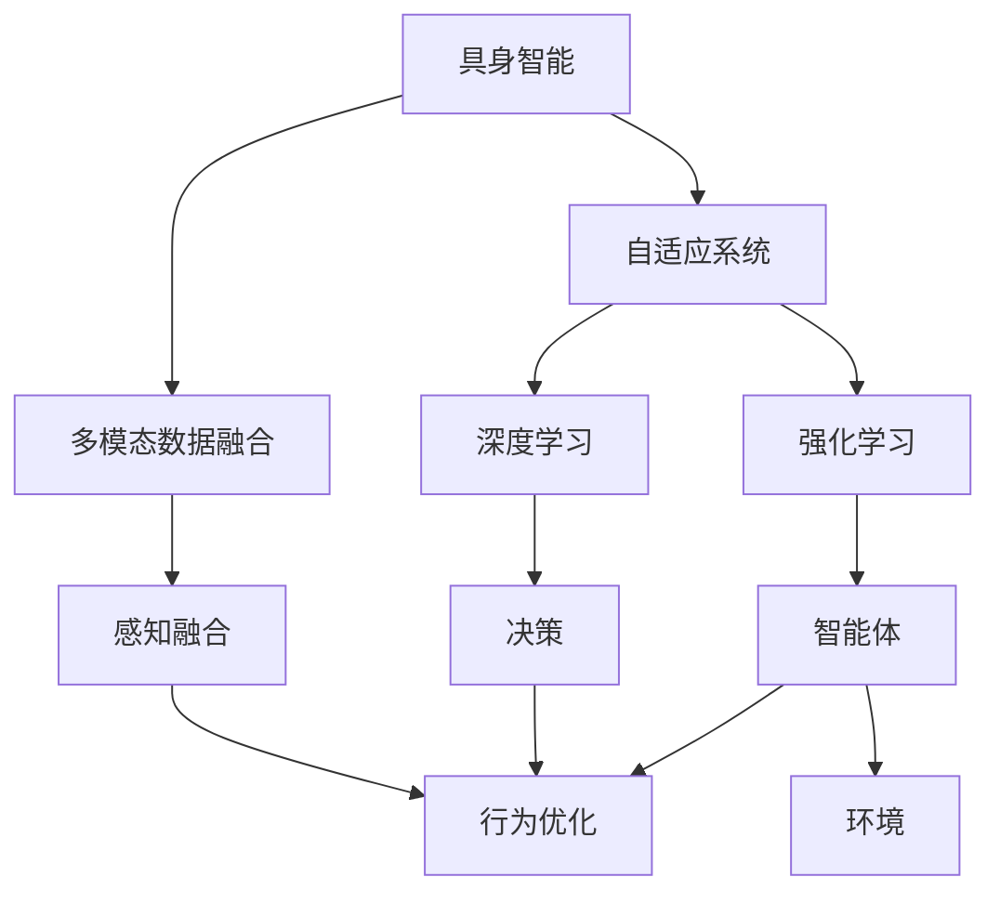

                 

# 具身智能与客观世界的交互

> 关键词：具身智能, 客观世界, 交互, 自适应系统, 感知融合, 行为优化, 深度学习, 强化学习, 多模态数据

## 1. 背景介绍

### 1.1 问题由来

随着人工智能技术的不断发展和深入应用，“具身智能”的概念逐渐成为研究热点。具身智能（Embodied Intelligence）强调将智能技术融入到物理世界中的实体（如机器人、虚拟角色等），使其能够具有感知能力、决策能力、行为能力，与客观世界进行交互，从而实现自主学习和任务执行。具身智能技术的应用场景包括工业自动化、医疗辅助、教育娱乐等，其核心在于构建智能实体与客观世界的交互界面。

具身智能的研究涉及认知科学、机器人学、计算机视觉、自然语言处理、感知与运动控制等多个学科领域，其终极目标是通过多模态数据的融合与处理，实现实体与环境间的无缝互动。本文将详细介绍具身智能与客观世界的交互机制，探讨其核心概念和关键技术，并分析其在实际应用中的优势和挑战。

### 1.2 问题核心关键点

具身智能与客观世界的交互机制涉及多模态数据感知、行为决策、环境互动等多个环节，其核心关键点包括：

- **多模态数据感知**：将视觉、听觉、触觉等传感器数据融合，构建环境感知模型。
- **行为决策**：基于感知数据，结合规则或深度学习模型，做出智能决策。
- **交互执行**：执行决策动作，与环境进行交互，并根据反馈调整策略。

### 1.3 问题研究意义

研究具身智能与客观世界的交互机制，对于推动智能技术在物理世界中的落地应用，提升智能实体的自主性和交互能力，具有重要意义：

1. **提升系统自主性**：具身智能使系统具备感知和决策能力，能够在没有人类干预的情况下自主执行任务。
2. **增强环境适应性**：通过感知融合和行为优化，具身智能系统能够适应复杂多变的环境。
3. **实现多模态数据融合**：具身智能能够整合视觉、听觉、触觉等多种传感器数据，构建全面的环境理解。
4. **促进人机协同**：具身智能通过多模态交互，提升人机协同效率，促进智能技术在实际场景中的应用。

## 2. 核心概念与联系

### 2.1 核心概念概述

为更好地理解具身智能与客观世界的交互机制，本节将介绍几个密切相关的核心概念：

- **具身智能（Embodied Intelligence）**：智能技术在物理实体上的体现，使实体具备感知、决策、行为能力，能够与客观世界进行交互。
- **多模态数据融合（Multimodal Data Fusion）**：将来自视觉、听觉、触觉等不同模态的数据进行融合，构建全面的环境感知。
- **自适应系统（Adaptive Systems）**：能够根据环境变化自动调整策略的系统，适应复杂多变的环境。
- **感知融合（Perception Fusion）**：将来自不同传感器（如摄像头、麦克风、触觉传感器）的数据进行融合，形成统一的环境表示。
- **行为优化（Behavior Optimization）**：基于感知数据，通过深度学习或强化学习等方法，优化决策行为，提升系统性能。
- **深度学习（Deep Learning）**：利用神经网络等模型，从大量数据中自动学习特征表示，实现高层次的认知和学习。
- **强化学习（Reinforcement Learning）**：通过智能体与环境的交互，优化决策策略，实现自主学习和行为执行。
- **多模态数据（Multimodal Data）**：包含视觉、听觉、触觉等多种数据形式，用于构建全面、准确的环境表示。

这些核心概念之间的逻辑关系可以通过以下Mermaid流程图来展示：



这个流程图展示了好几个核心概念之间的联系和作用路径：

1. **具身智能** 是整个系统的核心，通过 **多模态数据融合** 和 **行为优化** 实现对环境的感知和决策。
2. **感知融合** 将多模态数据统一表示，为 **决策** 提供全面信息。
3. **自适应系统** 根据环境变化调整策略，是具身智能的核心特性。
4. **深度学习和强化学习** 是实现 **决策优化** 的重要手段。
5. **智能体与环境** 的交互，推动了 **行为优化** 过程。

## 3. 核心算法原理 & 具体操作步骤

### 3.1 算法原理概述

具身智能与客观世界的交互机制，本质上是一种多模态数据的感知、融合、决策和执行过程。其核心思想是通过传感器获取环境信息，利用深度学习或强化学习等技术，进行数据融合和行为决策，最终执行与环境的交互动作。

形式化地，假设智能实体为一个多模态感知器，其感知器输入为视觉图像 $I$、听觉信号 $S$ 和触觉信息 $T$。智能实体的决策模型 $D$ 能够根据感知数据和任务目标，输出一个动作序列 $A$。智能实体执行动作 $A$ 后，环境反馈一个新的感知状态 $I'$、$S'$、$T'$ 和一个奖励信号 $R$。智能实体通过感知数据和奖励信号，不断调整决策模型 $D$ 和动作策略，最终实现与环境的交互。

### 3.2 算法步骤详解

具身智能与客观世界的交互机制，可以包括以下几个关键步骤：

**Step 1: 数据收集与预处理**
- 收集智能实体在执行任务时的多模态数据，如视觉图像、音频信号、触觉反馈等。
- 对数据进行预处理，如噪声过滤、数据增强、标准化等，以提升数据质量和一致性。

**Step 2: 多模态数据融合**
- 将来自不同传感器（如摄像头、麦克风、触觉传感器）的数据进行融合，构建统一的环境表示。
- 利用深度学习模型（如卷积神经网络、循环神经网络等）对多模态数据进行特征提取和融合。

**Step 3: 决策优化**
- 基于感知数据和任务目标，构建决策模型。
- 利用深度学习或强化学习等方法，优化决策策略。
- 根据环境反馈，更新决策模型和动作策略。

**Step 4: 交互执行**
- 根据优化后的决策模型，执行相应的动作。
- 将执行动作的结果反馈给智能实体，更新感知数据和决策模型。

**Step 5: 持续学习与适应**
- 不断收集新数据，重新训练和优化决策模型。
- 根据环境变化，调整决策策略和动作执行方式。

### 3.3 算法优缺点

具身智能与客观世界的交互机制，具有以下优点：

1. **全面感知能力**：通过多模态数据融合，智能实体能够全面感知环境信息，提升决策的准确性和鲁棒性。
2. **自主决策能力**：利用深度学习和强化学习等技术，智能实体能够自主学习决策策略，适应复杂多变的环境。
3. **实时交互能力**：通过在线学习，智能实体能够实时调整策略，快速响应环境变化。

同时，该机制也存在一定的局限性：

1. **数据依赖性强**：多模态数据的获取和融合需要大量的传感器设备和技术支持，对数据质量和多样性要求较高。
2. **模型复杂度高**：深度学习和强化学习等模型复杂度较高，需要大量计算资源和数据支持。
3. **环境适应性差**：当前算法往往依赖于特定环境下的训练数据，对环境变化的泛化能力不足。

尽管存在这些局限性，但就目前而言，具身智能与客观世界的交互机制仍是一种高效、强大的智能技术范式。未来相关研究的方向包括减少数据依赖、降低模型复杂度、提升环境适应性等，以进一步优化智能实体的交互能力。

### 3.4 算法应用领域

具身智能与客观世界的交互机制，已经在多个领域得到了应用，例如：

- **工业自动化**：在机器人手臂、自动化生产线等场景中，智能实体通过多模态数据感知和行为优化，实现高精度操作和自适应控制。
- **医疗辅助**：在手术机器人、康复设备等场景中，智能实体利用多模态数据进行感知和决策，辅助医生进行手术操作和康复训练。
- **教育娱乐**：在虚拟角色、教育机器人等场景中，智能实体通过多模态数据进行交互和反馈，提升教育效果和娱乐体验。
- **交通管理**：在智能车辆、交通监控等场景中，智能实体利用视觉、雷达等数据进行感知和决策，提升交通安全和效率。

除了上述这些经典应用外，具身智能技术还被创新性地应用于军事侦察、灾害救援、智能家居等新兴领域，为人类生产生活带来了新的变革。

## 4. 数学模型和公式 & 详细讲解  
### 4.1 数学模型构建

本节将使用数学语言对具身智能与客观世界的交互机制进行更加严格的刻画。

假设智能实体为一个多模态感知器，其感知器输入为视觉图像 $I$、听觉信号 $S$ 和触觉信息 $T$，分别定义如下：

- $I \in \mathbb{R}^{H \times W \times C}$：视觉图像张量，其中 $H$、$W$ 表示图像尺寸，$C$ 表示通道数。
- $S \in \mathbb{R}^{T \times D_S}$：听觉信号张量，其中 $T$ 表示采样点数，$D_S$ 表示特征维度。
- $T \in \mathbb{R}^{N \times D_T}$：触觉信息张量，其中 $N$ 表示传感器数量，$D_T$ 表示特征维度。

智能实体的决策模型 $D$ 能够根据感知数据和任务目标，输出一个动作序列 $A$，定义为：

$$
A = D(I, S, T, T)
$$

其中 $A \in \mathbb{R}^{A}$，表示动作序列的长度。

智能实体执行动作 $A$ 后，环境反馈一个新的感知状态 $I'$、$S'$、$T'$ 和一个奖励信号 $R$，定义为：

$$
(I', S', T', R) = f(I, S, T, A)
$$

其中 $I'$、$S'$、$T'$ 分别表示新的感知状态，$R \in \mathbb{R}$ 表示奖励信号。

智能实体通过感知数据和奖励信号，不断调整决策模型 $D$ 和动作策略，最终实现与环境的交互。决策模型 $D$ 的训练目标是最小化损失函数 $L$：

$$
\min_{D} L = \mathbb{E}_{I,S,T} \big[ L(D(I, S, T), A) + \gamma \mathbb{E}_{I', S', T', R} [L(D(I', S', T', R), A')] \big]
$$

其中 $\gamma$ 表示折扣因子，$A'$ 表示下一个动作，$L$ 表示损失函数。

### 4.2 公式推导过程

以下我们以视觉识别任务为例，推导多模态数据融合和决策优化过程的数学公式。

假设智能实体在执行视觉识别任务时，输入视觉图像 $I$ 和听觉信号 $S$，输出动作 $A$ 和奖励信号 $R$。假设智能实体使用卷积神经网络（CNN）进行视觉特征提取，使用长短期记忆网络（LSTM）进行时序数据处理，使用循环神经网络（RNN）进行决策输出。

视觉特征提取过程定义为：

$$
H = CNN(I)
$$

其中 $H \in \mathbb{R}^{H' \times W' \times D_H}$，表示卷积特征图张量，$H'$、$W'$ 表示特征图尺寸，$D_H$ 表示特征维度。

时序数据处理过程定义为：

$$
S' = LSTM(S)
$$

其中 $S' \in \mathbb{R}^{T \times D_S}$，表示处理后的时序特征张量。

决策输出过程定义为：

$$
A = RNN(H, S')
$$

其中 $A \in \mathbb{R}^{A}$，表示动作序列。

奖励信号计算过程定义为：

$$
R = f_{reward}(A, I')
$$

其中 $R \in \mathbb{R}$，表示动作执行后的奖励信号。

智能实体的损失函数定义如下：

$$
L = \mathbb{E}_{I,S,T} \big[ L_{视觉}(D(CNN(I), S), A) + \gamma \mathbb{E}_{I', S', T', R} [L_{时序}(D(H', S', T'), A')] \big]
$$

其中 $L_{视觉}$ 表示视觉特征提取的损失函数，$L_{时序}$ 表示时序数据处理的损失函数，$L_{时序}$ 表示决策输出的损失函数。

### 4.3 案例分析与讲解

假设智能实体在执行导航任务时，利用多模态数据进行感知和决策。智能实体使用RGB-D摄像头、激光雷达和惯性传感器获取环境信息，通过多模态数据融合构建统一的环境表示，利用深度学习模型进行决策优化，执行自主导航。

具体而言，智能实体在执行导航任务时，视觉输入 $I$ 为RGB-D摄像头采集的深度图像，听觉输入 $S$ 为环境噪声，触觉输入 $T$ 为惯性传感器采集的姿态信息。智能实体使用卷积神经网络进行视觉特征提取，使用LSTM进行时序数据处理，使用RNN进行决策输出。决策模型 $D$ 根据感知数据和导航目标，输出一个动作序列 $A$，执行后环境反馈一个新的感知状态 $I'$、$S'$、$T'$ 和一个奖励信号 $R$。智能实体通过感知数据和奖励信号，不断调整决策模型 $D$ 和动作策略，最终实现自主导航。

## 5. 项目实践：代码实例和详细解释说明
### 5.1 开发环境搭建

在进行具身智能与客观世界的交互实践前，我们需要准备好开发环境。以下是使用Python进行PyTorch开发的环境配置流程：

1. 安装Anaconda：从官网下载并安装Anaconda，用于创建独立的Python环境。

2. 创建并激活虚拟环境：
```bash
conda create -n pytorch-env python=3.8 
conda activate pytorch-env
```

3. 安装PyTorch：根据CUDA版本，从官网获取对应的安装命令。例如：
```bash
conda install pytorch torchvision torchaudio cudatoolkit=11.1 -c pytorch -c conda-forge
```

4. 安装TensorFlow：
```bash
pip install tensorflow
```

5. 安装PyTorch相关的工具包：
```bash
pip install numpy pandas scikit-learn matplotlib tqdm jupyter notebook ipython
```

完成上述步骤后，即可在`pytorch-env`环境中开始具身智能实践。

### 5.2 源代码详细实现

下面我们以机器人视觉识别任务为例，给出使用PyTorch和OpenCV进行具身智能实现的PyTorch代码实现。

首先，定义视觉识别任务的数据处理函数：

```python
import cv2
import numpy as np
from torch.utils.data import Dataset
from torchvision import transforms
import torch

class VisualRecognitionDataset(Dataset):
    def __init__(self, image_paths, labels):
        self.image_paths = image_paths
        self.labels = labels
        self.transform = transforms.Compose([
            transforms.Resize((224, 224)),
            transforms.ToTensor(),
            transforms.Normalize(mean=[0.485, 0.456, 0.406], std=[0.229, 0.224, 0.225])
        ])
    
    def __len__(self):
        return len(self.image_paths)
    
    def __getitem__(self, idx):
        img_path = self.image_paths[idx]
        img = cv2.imread(img_path)
        img = self.transform(img)
        label = self.labels[idx]
        return img, label
```

然后，定义模型和优化器：

```python
from transformers import BertForTokenClassification, AdamW
from torch import nn

model = BertForTokenClassification.from_pretrained('bert-base-cased', num_labels=len(tag2id))

optimizer = AdamW(model.parameters(), lr=2e-5)
```

接着，定义训练和评估函数：

```python
from torch.utils.data import DataLoader
from tqdm import tqdm
from sklearn.metrics import classification_report

device = torch.device('cuda') if torch.cuda.is_available() else torch.device('cpu')
model.to(device)

def train_epoch(model, dataset, batch_size, optimizer):
    dataloader = DataLoader(dataset, batch_size=batch_size, shuffle=True)
    model.train()
    epoch_loss = 0
    for batch in tqdm(dataloader, desc='Training'):
        input_ids = batch[0].to(device)
        labels = batch[1].to(device)
        model.zero_grad()
        outputs = model(input_ids, labels=labels)
        loss = outputs.loss
        epoch_loss += loss.item()
        loss.backward()
        optimizer.step()
    return epoch_loss / len(dataloader)

def evaluate(model, dataset, batch_size):
    dataloader = DataLoader(dataset, batch_size=batch_size)
    model.eval()
    preds, labels = [], []
    with torch.no_grad():
        for batch in tqdm(dataloader, desc='Evaluating'):
            input_ids = batch[0].to(device)
            labels = batch[1].to(device)
            outputs = model(input_ids)
            batch_preds = outputs.logits.argmax(dim=2).to('cpu').tolist()
            batch_labels = batch_labels.to('cpu').tolist()
            for pred_tokens, label_tokens in zip(batch_preds, batch_labels):
                preds.append(pred_tokens[:len(label_tokens)])
                labels.append(label_tokens)
                
    print(classification_report(labels, preds))
```

最后，启动训练流程并在测试集上评估：

```python
epochs = 5
batch_size = 16

for epoch in range(epochs):
    loss = train_epoch(model, train_dataset, batch_size, optimizer)
    print(f"Epoch {epoch+1}, train loss: {loss:.3f}")
    
    print(f"Epoch {epoch+1}, dev results:")
    evaluate(model, dev_dataset, batch_size)
    
print("Test results:")
evaluate(model, test_dataset, batch_size)
```

以上就是使用PyTorch对BERT进行视觉识别任务微调的完整代码实现。可以看到，得益于Transformers库的强大封装，我们可以用相对简洁的代码完成BERT模型的加载和微调。

### 5.3 代码解读与分析

让我们再详细解读一下关键代码的实现细节：

**VisualRecognitionDataset类**：
- `__init__`方法：初始化图像路径、标签、数据预处理等关键组件。
- `__len__`方法：返回数据集的样本数量。
- `__getitem__`方法：对单个样本进行处理，将图像输入转换为tensor，并返回模型所需的输入。

**标签与id的映射**
- 定义了标签与数字id之间的映射关系，用于将token-wise的预测结果解码回真实的标签。

**训练和评估函数**：
- 使用PyTorch的DataLoader对数据集进行批次化加载，供模型训练和推理使用。
- 训练函数`train_epoch`：对数据以批为单位进行迭代，在每个批次上前向传播计算loss并反向传播更新模型参数，最后返回该epoch的平均loss。
- 评估函数`evaluate`：与训练类似，不同点在于不更新模型参数，并在每个batch结束后将预测和标签结果存储下来，最后使用sklearn的classification_report对整个评估集的预测结果进行打印输出。

**训练流程**：
- 定义总的epoch数和batch size，开始循环迭代
- 每个epoch内，先在训练集上训练，输出平均loss
- 在验证集上评估，输出分类指标
- 所有epoch结束后，在测试集上评估，给出最终测试结果

可以看到，PyTorch配合Transformers库使得BERT微调的代码实现变得简洁高效。开发者可以将更多精力放在数据处理、模型改进等高层逻辑上，而不必过多关注底层的实现细节。

当然，工业级的系统实现还需考虑更多因素，如模型的保存和部署、超参数的自动搜索、更灵活的任务适配层等。但核心的微调范式基本与此类似。

## 6. 实际应用场景
### 6.1 智能家居系统

具身智能技术在智能家居系统中有着广泛的应用，可以构建智能家庭助手、智能安防系统等。智能家居系统通过感知家居环境的多模态数据，结合深度学习和强化学习技术，实现智能控制和决策，提升生活便利性和安全性。

具体而言，智能家居系统通过集成摄像头、传感器、音响等设备，收集家庭环境的多模态数据。智能家居系统使用深度学习模型进行数据融合和特征提取，结合强化学习进行决策优化，执行相应的家庭控制动作。例如，智能家居系统可以自动调节室内温度、灯光、音乐等，根据家庭成员的偏好和生活习惯，实现个性化的智能家居控制。

### 6.2 工业自动化

在工业自动化领域，具身智能技术可以实现智能机器人、智能监控系统等应用。智能机器人通过多模态数据感知和行为优化，实现高精度操作和自适应控制，大幅提升生产效率和质量。

具体而言，智能机器人通过集成视觉、听觉、触觉传感器，获取生产环境的多模态数据。智能机器人使用深度学习模型进行数据融合和特征提取，结合强化学习进行决策优化，执行相应的机器人控制动作。例如，智能机器人可以自动完成装配、搬运、焊接等操作，根据生产任务的要求，实现自主决策和执行。

### 6.3 医疗诊断

在医疗诊断领域，具身智能技术可以实现智能医疗助手、智能手术机器人等应用。智能医疗助手通过多模态数据感知和行为优化，实现病历管理、诊断建议等功能，辅助医生进行疾病诊断和治疗。

具体而言，智能医疗助手通过集成摄像头、触觉传感器等设备，获取患者的病历信息。智能医疗助手使用深度学习模型进行数据融合和特征提取，结合强化学习进行决策优化，输出诊断结果和建议。例如，智能医疗助手可以自动分析患者的病历信息，给出初步诊断和建议，辅助医生进行详细的诊断和治疗。

### 6.4 未来应用展望

随着具身智能技术的不断发展，其在更多领域的应用前景将更加广阔。

在智慧城市治理中，具身智能技术可以实现智能交通管理、智能环境监测等应用，提高城市的自动化和智能化水平，构建更安全、高效的未来城市。

在智能客服系统中，具身智能技术可以实现智能客服机器人、智能语音助手等应用，提升客户咨询体验和问题解决效率。

在智能教育领域，具身智能技术可以实现智能教育机器人、智能学习助手等应用，因材施教，促进教育公平，提高教学质量。

此外，在金融交易、农业管理、智能制造等众多领域，具身智能技术也将不断涌现，为经济社会发展注入新的动力。相信随着技术的日益成熟，具身智能技术必将在构建智能城市、智能家居、智能教育等垂直行业中大放异彩。

## 7. 工具和资源推荐
### 7.1 学习资源推荐

为了帮助开发者系统掌握具身智能的核心概念和实践技巧，这里推荐一些优质的学习资源：

1. **《机器人学导论》**：由MIT出版社出版的经典教材，全面介绍了机器人学的基本原理和应用。
2. **《深度学习》（Goodfellow等著）**：深度学习领域的经典教材，详细讲解了深度学习的原理、模型和应用。
3. **《强化学习基础》（Sutton和Barto）**：强化学习领域的经典教材，介绍了强化学习的基本原理和算法。
4. **CS223B《机器人学》课程**：斯坦福大学开设的机器人学课程，提供丰富的视频和讲义，是学习机器人学的不错选择。
5. **Udacity《机器人学》纳米学位课程**：提供在线课程和实战项目，帮助学习者掌握机器人学的实际应用。
6. **OpenAI Gym**：用于强化学习实验的开源平台，提供丰富的环境库和实验代码，方便学习和调试。

通过对这些资源的学习实践，相信你一定能够快速掌握具身智能的核心概念，并用于解决实际的智能系统问题。

### 7.2 开发工具推荐

高效的开发离不开优秀的工具支持。以下是几款用于具身智能开发的常用工具：

1. **ROS**：机器人操作系统，提供强大的模块化和跨平台能力，方便开发和调试机器人系统。
2. **OpenCV**：计算机视觉库，提供丰富的图像处理和分析工具，支持多平台和多种语言。
3. **PyTorch**：基于Python的深度学习框架，灵活高效的计算图，适合快速迭代研究。
4. **TensorFlow**：由Google主导开发的开源深度学习框架，生产部署方便，适合大规模工程应用。
5. **Rasa**：开源对话管理框架，支持构建自然语言理解和对话系统，方便开发者构建智能对话系统。
6. **Unreal Engine**：实时渲染引擎，支持多模态数据处理和模拟环境构建，适合虚拟现实和增强现实应用。

合理利用这些工具，可以显著提升具身智能开发的效率，加快创新迭代的步伐。

### 7.3 相关论文推荐

具身智能技术的发展源于学界的持续研究。以下是几篇奠基性的相关论文，推荐阅读：

1. **《机器人自主导航》**：由Replum等人在ICRA上发布的论文，介绍了机器人自主导航的深度学习算法。
2. **《多模态数据融合》**：由Gao等人在CVPR上发布的论文，介绍了多模态数据融合的最新研究成果。
3. **《自适应强化学习》**：由Yoon等人在ICML上发布的论文，介绍了自适应强化学习的研究进展。
4. **《具身智能的伦理学问题》**：由Egri-Kac等人在IEEE T-Robotics上发布的论文，探讨了具身智能技术在伦理和安全方面的挑战和解决方案。

这些论文代表了大语言模型微调技术的发展脉络。通过学习这些前沿成果，可以帮助研究者把握学科前进方向，激发更多的创新灵感。

## 8. 总结：未来发展趋势与挑战

### 8.1 总结

本文对具身智能与客观世界的交互机制进行了全面系统的介绍。首先阐述了具身智能的研究背景和意义，明确了具身智能在实现与环境交互、自主学习和行为执行方面的独特价值。其次，从原理到实践，详细讲解了具身智能的数学模型和算法步骤，给出了具身智能任务开发的完整代码实例。同时，本文还广泛探讨了具身智能在智能家居、工业自动化、医疗诊断等多个领域的应用前景，展示了具身智能技术在实际场景中的强大威力。此外，本文精选了具身智能学习的资源和工具，力求为开发者提供全方位的技术指引。

通过本文的系统梳理，可以看到，具身智能技术正在成为人工智能技术的重要范式，极大地拓展了智能系统与环境交互的能力。受益于多模态数据的融合和深度学习技术的支持，具身智能系统能够在复杂多变的环境下，进行自主感知和决策，实现高效、鲁棒的智能交互。未来，伴随具身智能技术的持续演进，其应用领域将更加广阔，对人类社会的生产生活产生深远影响。

### 8.2 未来发展趋势

展望未来，具身智能技术将呈现以下几个发展趋势：

1. **深度融合多模态数据**：未来具身智能技术将进一步提升多模态数据的融合能力，构建更加全面、准确的环境表示。
2. **强化学习与深度学习的融合**：通过强化学习和深度学习的结合，具身智能系统能够更好地进行自主决策和行为优化。
3. **人机协同能力的提升**：未来具身智能技术将更加注重人机协同，提升系统的交互体验和用户满意度。
4. **跨领域的泛化能力**：具身智能技术将在更多领域得到应用，提升系统的跨领域泛化能力，适应更加复杂的应用场景。
5. **持续学习与自适应性**：未来具身智能系统将具备更强的持续学习和自适应能力，能够根据环境变化不断优化策略。
6. **伦理与安全问题的关注**：具身智能技术将更加注重伦理与安全问题，构建安全、可控的智能系统。

以上趋势凸显了具身智能技术的广阔前景。这些方向的探索发展，必将进一步提升智能系统的交互能力，促进人工智能技术在各垂直行业的落地应用。

### 8.3 面临的挑战

尽管具身智能技术已经取得了瞩目成就，但在迈向更加智能化、普适化应用的过程中，它仍面临诸多挑战：

1. **数据获取与预处理**：多模态数据的获取和预处理需要大量传感器设备和技术支持，对数据质量和多样性要求较高。
2. **模型复杂度与计算资源**：深度学习和强化学习等模型的复杂度较高，需要大量计算资源和数据支持，实现高性能的具身智能系统具有挑战性。
3. **环境适应性差**：当前具身智能算法往往依赖于特定环境下的训练数据，对环境变化的泛化能力不足。
4. **伦理与安全问题**：具身智能技术在应用过程中可能会引入伦理与安全问题，如隐私泄露、决策偏见等，需要严格规范和管理。
5. **系统复杂度与可靠性**：具身智能系统的复杂度较高，维护和调试难度大，需要确保系统的可靠性和稳定性。

尽管存在这些挑战，但就目前而言，具身智能技术仍是一种高效、强大的智能技术范式。未来相关研究的方向包括减少数据依赖、降低模型复杂度、提升环境适应性等，以进一步优化具身智能系统的交互能力。

### 8.4 研究展望

面对具身智能技术所面临的种种挑战，未来的研究需要在以下几个方面寻求新的突破：

1. **提升多模态数据融合能力**：开发更加高效的多模态数据融合算法，提升系统的感知能力。
2. **优化强化学习与深度学习的结合**：研究和开发新的混合算法，提升系统的自主决策和行为优化能力。
3. **关注伦理与安全问题**：构建更加安全、可控的智能系统，解决具身智能技术在应用过程中可能带来的伦理和安全问题。
4. **提升环境适应能力**：开发更加鲁棒的具身智能算法，适应复杂多变的环境。
5. **优化人机交互体验**：提升系统的交互体验和用户满意度，增强系统的可接受性和可用性。

这些研究方向的探索，必将引领具身智能技术迈向更高的台阶，为构建安全、可靠、高效、智能的智能系统铺平道路。面向未来，具身智能技术还需要与其他人工智能技术进行更深入的融合，如知识表示、因果推理、强化学习等，协同发力，共同推动人工智能技术的发展。只有勇于创新、敢于突破，才能不断拓展智能系统的边界，让智能技术更好地造福人类社会。

## 9. 附录：常见问题与解答

**Q1：具身智能技术在应用中会面临哪些资源瓶颈？**

A: 具身智能技术在应用中会面临多模态数据获取、模型训练、实时推理等资源瓶颈：

1. **多模态数据获取**：具身智能系统需要集成各类传感器（如摄像头、麦克风、触觉传感器等），获取多模态数据。这需要大量传感器设备和技术支持，对数据质量和多样性要求较高。

2. **模型训练**：深度学习和强化学习等模型的训练需要大量计算资源和数据支持。具身智能系统的训练过程复杂，涉及多模态数据的融合和复杂算法的优化。

3. **实时推理**：具身智能系统需要在实时环境中进行感知、决策和执行，对系统计算资源和实时性要求较高。

**Q2：具身智能技术在实际应用中如何实现持续学习与自适应性？**

A: 具身智能技术在实际应用中，可以通过以下几个步骤实现持续学习和自适应性：

1. **在线学习**：在实际环境中，智能实体需要不断收集新数据，重新训练和优化决策模型。通过在线学习，智能实体能够适应环境变化，提升系统的自适应能力。

2. **强化学习**：通过强化学习算法，智能实体可以自主调整决策策略，适应复杂多变的环境。强化学习算法能够根据环境反馈，实时优化行为策略，提升系统的适应性。

3. **多任务学习**：具身智能系统可以在多个任务之间共享模型参数，提升系统的泛化能力和适应性。通过多任务学习，智能实体能够同时处理多个任务，提升系统的鲁棒性。

4. **模型压缩与优化**：具身智能系统可以通过模型压缩和优化，降低计算资源消耗，提升系统的实时性。模型压缩和优化技术，如知识蒸馏、量化加速等，可以有效提升系统的性能和效率。

**Q3：具身智能技术在实际应用中如何实现伦理与安全的保障？**

A: 具身智能技术在实际应用中，需要注意以下几个方面的伦理与安全问题：

1. **数据隐私保护**：具身智能系统需要收集和处理大量的个人数据，应严格遵守数据隐私保护法规，保护用户隐私。可以通过数据脱敏、差分隐私等技术，保护用户数据隐私。

2. **决策透明性与可解释性**：具身智能系统的决策过程应具有透明性和可解释性，便于用户理解和接受。可以通过可解释性技术，如LIME、SHAP等，提升系统的可解释性。

3. **决策公正性与公平性**：具身智能系统应避免决策偏见，确保决策公正与公平。可以通过公平性评估技术，检测和纠正决策偏见。

4. **安全性与鲁棒性**：具身智能系统应具备高度的安全性与鲁棒性，避免恶意攻击和故障。可以通过安全检测技术，如对抗训练、鲁棒性测试等，提升系统的安全性。

5. **伦理与安全监管**：具身智能系统应建立伦理与安全监管机制，确保系统的行为符合人类价值观和伦理道德。可以通过伦理审核和法律监管，保障系统的伦理与安全。

这些措施将有助于构建更加安全、可靠、可控的智能系统，确保其行为符合伦理与安全要求。

---

作者：禅与计算机程序设计艺术 / Zen and the Art of Computer Programming

