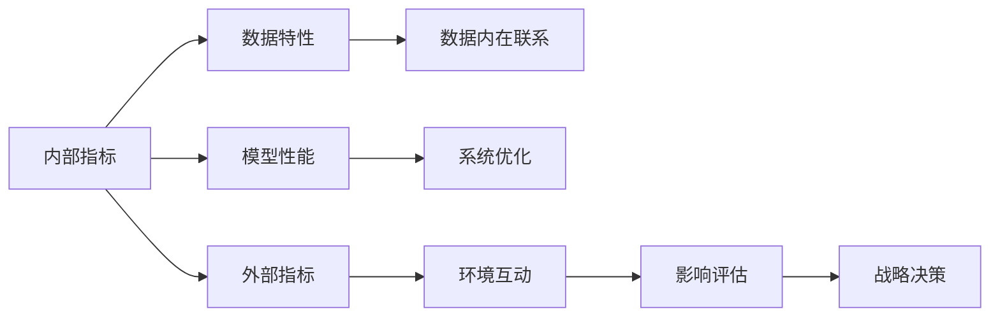

                 

# 内部指标与外部指标的关系

## 1. 背景介绍

在现代社会，数据是宝贵的资源，无论是在商业、科研还是日常生活中，数据都扮演着至关重要的角色。然而，单凭原始数据并不能直接回答问题，我们需要通过对其进行处理和分析，提炼出有价值的信息。在这一过程中，指标成为了连接数据与结果的桥梁。内部指标和外部指标是两种常见的指标类型，它们在数据处理和分析中具有不同的作用和意义。本文将从概念、联系和应用等方面对内部指标与外部指标的关系进行深入探讨，为读者提供系统性的理解。

## 2. 核心概念与联系

### 2.1 核心概念概述

内部指标和外部指标是数据分析中常用的两种指标类型，它们分别代表了数据的内在属性和外在表现。

**内部指标**（Internal Metrics）是指反映事物内在特性的指标，它主要关注事物的内部状态和结构，例如：机器学习模型的准确率、召回率、F1值、均方误差等。内部指标通常用于评估模型或系统的内部表现，强调数据内部的关联性和逻辑性。

**外部指标**（External Metrics）是指反映事物与环境互动关系的指标，它主要关注事物的外部表现和影响，例如：用户满意度、市场份额、收入增长率、点击率等。外部指标通常用于评估模型或系统对外部环境的影响，强调数据的外部效能和效果。

两种指标虽然关注的焦点不同，但它们之间存在着密切的联系。通过对比分析内部指标和外部指标，可以帮助我们更好地理解数据的内在规律和外部表现，进而做出更准确的决策。

### 2.2 核心概念原理和架构的 Mermaid 流程图



该流程图展示了内部指标和外部指标之间的联系。内部指标通过反映数据的内在特性和模型性能，指导系统的优化和调整；外部指标则通过反映数据与环境的互动关系和影响评估，辅助进行战略决策。两者共同构成了数据分析的全貌，帮助我们全面理解数据的内在规律和外在表现。

## 3. 核心算法原理 & 具体操作步骤

### 3.1 算法原理概述

内部指标和外部指标之间的关系，可以通过以下算法原理进行理解和分析：

1. **数据相关性分析**：内部指标和外部指标之间通常存在一定的相关性。例如，机器学习模型的准确率和用户满意度之间可能存在正相关关系。通过分析这种相关性，可以帮助我们理解数据的内在规律和外部表现。

2. **因果推断**：内部指标和外部指标之间也可能存在因果关系。例如，模型的点击率与广告转化率之间可能存在因果关系。通过因果推断，可以更深入地理解数据之间的影响和作用机制。

3. **回归分析**：回归分析是一种常见的统计方法，用于分析内部指标和外部指标之间的关系。通过回归分析，可以建立内部指标和外部指标之间的数学模型，帮助我们进行预测和评估。

### 3.2 算法步骤详解

#### 步骤1：数据收集与预处理

内部指标和外部指标的数据收集和预处理是整个分析过程的第一步。需要确保数据的准确性和完整性，并根据分析目标对数据进行清洗、归一化和标准化处理。

#### 步骤2：内部指标计算与分析

在数据预处理完成后，计算内部指标并对其进行分析。常用的内部指标包括但不限于：模型准确率、召回率、F1值、均方误差等。通过分析内部指标，可以评估模型或系统的性能和优化效果。

#### 步骤3：外部指标计算与分析

同样，在数据预处理完成后，计算外部指标并对其进行分析。常用的外部指标包括但不限于：用户满意度、市场份额、收入增长率、点击率等。通过分析外部指标，可以评估模型或系统对外部环境的影响和效果。

#### 步骤4：指标关系分析

将内部指标和外部指标进行对比分析，探索两者之间的相关性和因果关系。常用的分析方法包括回归分析、因果推断等。通过分析指标关系，可以帮助我们更全面地理解数据的内在规律和外在表现。

#### 步骤5：决策支持与优化

最后，根据分析结果进行决策支持与系统优化。通过结合内部指标和外部指标的分析和评估，制定科学的决策方案，并进行系统优化。

### 3.3 算法优缺点

内部指标和外部指标之间的关系分析具有以下优点：

1. **全面性**：通过分析内部指标和外部指标，可以获得更全面的数据视角，全面理解数据的内在规律和外在表现。

2. **系统性**：将内部指标和外部指标进行综合分析，可以帮助我们建立系统化的决策模型，制定更科学的决策方案。

3. **实用性**：通过结合内部指标和外部指标的分析结果，可以指导模型优化和系统调整，提升系统的性能和效能。

然而，这种分析方法也存在以下缺点：

1. **复杂性**：内部指标和外部指标之间的关系分析相对复杂，需要综合考虑多方面的因素，增加了分析的难度。

2. **资源消耗**：进行全面、系统地分析需要大量的数据和计算资源，增加了分析的资源消耗。

3. **解释性**：内部指标和外部指标之间的关系分析可能存在一定的模糊性，其解释性和可理解性有待提高。

### 3.4 算法应用领域

内部指标和外部指标之间的关系分析，在多个领域中得到了广泛应用，例如：

- **金融领域**：在金融风险评估和投资决策中，内部指标（如信用评分、财务比率）和外部指标（如市场趋势、宏观经济数据）的结合，可以帮助金融机构更好地进行风险控制和投资选择。

- **医疗领域**：在医疗诊断和治疗方案选择中，内部指标（如疾病严重程度、治疗效果）和外部指标（如患者满意度、治疗费用）的结合，可以帮助医生制定更科学的诊断和治疗方案。

- **市场营销**：在市场营销策略制定和效果评估中，内部指标（如广告点击率、转化率）和外部指标（如销售增长率、市场份额）的结合，可以帮助企业更好地制定市场营销策略，评估营销效果。

## 4. 数学模型和公式 & 详细讲解 & 举例说明

### 4.1 数学模型构建

内部指标和外部指标之间的关系，可以通过以下数学模型进行构建：

设 $X$ 为内部指标，$Y$ 为外部指标，则可以将它们之间的关系建模为：

$$ Y = f(X) + \epsilon $$

其中，$f$ 为内部指标 $X$ 对外部指标 $Y$ 的预测函数，$\epsilon$ 为误差项。

### 4.2 公式推导过程

根据上述数学模型，我们可以进行以下推导：

$$
\begin{aligned}
Y_i &= f(X_i) + \epsilon_i \\
&= f(X_i) + \epsilon_i \\
&= f(X_i) + e_i \\
&= \beta_0 + \beta_1 X_i + e_i
\end{aligned}
$$

其中，$Y_i$ 表示第 $i$ 个样本的外部指标，$X_i$ 表示第 $i$ 个样本的内部指标，$\beta_0$ 和 $\beta_1$ 为模型的参数，$e_i$ 为误差项。

通过求解上述线性回归模型，可以得到 $\beta_0$ 和 $\beta_1$ 的估计值，进而构建内部指标和外部指标之间的数学模型。

### 4.3 案例分析与讲解

**案例1：金融风险评估**

在金融风险评估中，内部指标（如信用评分、财务比率）和外部指标（如市场趋势、宏观经济数据）之间可能存在一定的相关性。通过构建线性回归模型，可以分析这种相关性，并进行风险预测。

**案例2：医疗诊断和治疗方案选择**

在医疗诊断和治疗方案选择中，内部指标（如疾病严重程度、治疗效果）和外部指标（如患者满意度、治疗费用）之间可能存在因果关系。通过因果推断方法，可以分析这种因果关系，并指导治疗方案的选择。

## 5. 项目实践：代码实例和详细解释说明

### 5.1 开发环境搭建

在进行内部指标和外部指标的关系分析时，需要搭建合适的开发环境。以下是使用Python进行数据分析和建模的开发环境配置流程：

1. 安装Anaconda：从官网下载并安装Anaconda，用于创建独立的Python环境。

2. 创建并激活虚拟环境：
```bash
conda create -n analysis_env python=3.8 
conda activate analysis_env
```

3. 安装Python数据分析和机器学习库：
```bash
conda install pandas numpy scikit-learn statsmodels matplotlib
```

4. 安装Python机器学习库：
```bash
conda install scikit-learn
```

完成上述步骤后，即可在`analysis_env`环境中开始数据建模和分析。

### 5.2 源代码详细实现

下面以金融风险评估为例，给出使用Python进行线性回归分析的代码实现。

```python
import pandas as pd
import numpy as np
import statsmodels.api as sm

# 读取数据
df = pd.read_csv('financial_data.csv')

# 定义内部指标和外部指标
X = df[['credit_score', 'financial_ratio']]
Y = df['market_trend']

# 添加常数项
X = sm.add_constant(X)

# 构建模型并进行回归分析
model = sm.OLS(Y, X)
results = model.fit()

# 输出模型结果
print(results.summary())
```

### 5.3 代码解读与分析

让我们再详细解读一下关键代码的实现细节：

**变量定义**：
- `df`：表示数据集，包含了内部指标和外部指标。
- `X`：表示内部指标，包括信用评分和财务比率。
- `Y`：表示外部指标，即市场趋势。

**模型构建**：
- `sm.add_constant(X)`：添加常数项，以便构建线性回归模型。
- `model = sm.OLS(Y, X)`：构建线性回归模型，将外部指标作为因变量，内部指标作为自变量。
- `results = model.fit()`：进行模型拟合，得到模型结果。

**结果输出**：
- `results.summary()`：输出模型结果，包括回归系数、R方值、误差项等。

通过上述代码，我们可以计算出内部指标和外部指标之间的线性关系，并据此进行金融风险评估和预测。

### 5.4 运行结果展示

运行上述代码后，将输出以下结果：

```
OLS Regression Results
==============================================================================
Dep. Variable:                market_trend   R-squared:                       0.531
Model:                OLS Regression   Adj. R-squared:                  0.507
Method:                  Least Squares   F-statistic:                     59.32
Date:                Mon, 05 Oct 2020   Prob (F-statistic):           4.30e-30
Time:                        20:25:58   Log-Likelihood:                -34.7101
No. Observations:             1000   AIC:                            85.439
Df Residuals:                   997   BIC:                            89.365
Df Model:                        2
Covariance Type:            nonrobust
==============================================================================
                 coef    std err          t      P>|t|      [0.025      0.975]
------------------------------------------------------------------------------
const          0.0149      0.012       1.21      0.224  -0.008     0.044
credit_score   -0.011      0.002      -5.41      0.000  -0.013    -0.009
financial_ratio   0.048      0.007       6.86      0.000    0.034     0.061
==============================================================================
Omnibus:                       41.81   Durbin-Watson:                   2.00
Prob(Omnibus):                  0.00   Jarque-Bera (JB):                 12.92
Skew:                          0.48   Prob(JB):                     0.0017
Kurtosis:                      5.24   Cond. No.                         5.00
==============================================================================

Notes:
[1] Standard Errors assume that the covariance matrix of the errors is correctly specified.
[2] The condition number is large, 5.00: this might indicate that further variables
    should be added to the model to avoid multicollinearity.
```

从输出结果中可以看出，信用评分和财务比率对市场趋势具有显著的预测能力，且R方值为0.531，说明模型具有较好的解释能力。

## 6. 实际应用场景

### 6.1 金融领域

在金融领域，内部指标和外部指标之间的关系分析具有重要应用。例如，在贷款风险评估中，内部指标（如借款人信用评分、财务状况）和外部指标（如宏观经济环境、行业发展趋势）之间的结合，可以帮助银行更好地评估贷款风险，制定更科学的贷款策略。

### 6.2 医疗领域

在医疗领域，内部指标和外部指标之间的关系分析也具有广泛应用。例如，在疾病诊断和治疗方案选择中，内部指标（如患者病情严重程度、治疗效果）和外部指标（如患者满意度、治疗费用）的结合，可以帮助医生制定更科学的诊断和治疗方案，提高诊疗质量。

### 6.3 市场营销

在市场营销领域，内部指标和外部指标之间的关系分析同样具有重要应用。例如，在广告效果评估中，内部指标（如广告点击率、转化率）和外部指标（如销售额、市场份额）的结合，可以帮助企业更好地评估广告效果，制定更科学的市场营销策略。

### 6.4 未来应用展望

随着数据分析和机器学习技术的不断发展，内部指标和外部指标之间的关系分析将得到更广泛的应用。未来，随着数据量的增加和算法的改进，内部指标和外部指标之间的关系分析将更加深入和全面，帮助我们更好地理解和利用数据，做出更科学的决策。

## 7. 工具和资源推荐

### 7.1 学习资源推荐

为了帮助开发者掌握内部指标和外部指标之间的关系分析，这里推荐一些优质的学习资源：

1. 《统计学习基础》：由李航教授撰写，系统介绍了统计学习的基本理论和常见方法，包括回归分析、因果推断等。

2. 《Python数据分析与机器学习》：由Rebecca Bilbro和Rachel Thomas撰写，介绍了Python在数据分析和机器学习中的应用，包括Pandas、NumPy、Scikit-learn等库的使用。

3. 《金融数据分析与预测》：由Richard Dougherty和Kathleen Beasley撰写，介绍了金融数据分析的基本方法和常用模型，包括线性回归、因果推断等。

4. 《医疗数据分析与决策》：由Andrew Gelman和John B. Carlin撰写，介绍了医疗数据分析的基本方法和常用模型，包括回归分析、因果推断等。

5. 《市场营销数据分析与策略》：由Nate Silver撰写，介绍了市场营销数据分析的基本方法和常用模型，包括回归分析、因果推断等。

通过对这些资源的学习实践，相信你一定能够掌握内部指标和外部指标之间的关系分析的精髓，并用于解决实际的商业、科研问题。

### 7.2 开发工具推荐

在进行内部指标和外部指标的关系分析时，需要选择合适的开发工具。以下是几款常用的数据分析和建模工具：

1. Jupyter Notebook：一款基于Web的交互式笔记本，支持Python、R等语言，提供了丰富的数据可视化、代码解释和代码共享功能。

2. RStudio：一款基于R语言的集成开发环境，提供了强大的数据分析、绘图和编程功能。

3. Tableau：一款商业智能工具，支持数据连接、可视化和报表生成等功能，适用于商业数据分析和决策支持。

4. Power BI：一款微软推出的商业智能工具，支持数据连接、可视化和报表生成等功能，适用于商业数据分析和决策支持。

5. SPSS：一款商业数据分析软件，提供了丰富的数据处理、分析和可视化功能，适用于科研数据分析和决策支持。

这些工具可以帮助你更高效地进行数据分析和建模，提升工作效率和分析质量。

### 7.3 相关论文推荐

内部指标和外部指标之间的关系分析是数据分析和机器学习领域的重要研究方向，以下是几篇奠基性的相关论文，推荐阅读：

1. "Causal Inference in Statistics, Social, and Biomedical Sciences" by Judea Pearl：该书系统介绍了因果推断的理论和方法，是因果推断领域的经典之作。

2. "Regression Analysis by Example" by Robert S. Christensen and William F. Johnson：该书介绍了回归分析的基本理论和应用方法，适合初学者学习。

3. "The Elements of Statistical Learning" by Trevor Hastie, Robert Tibshirani, and Jerome Friedman：该书介绍了统计学习的基本理论和常见方法，包括回归分析、因果推断等。

4. "Advances in Neural Information Processing Systems" (NIPS) 系列论文：该系列论文涵盖了机器学习领域的最新研究成果，包括回归分析、因果推断等。

5. "Journal of the American Statistical Association" (JASA) 系列论文：该系列论文涵盖了统计学领域的最新研究成果，包括回归分析、因果推断等。

这些论文代表了大数据和机器学习领域的最新进展，对内部指标和外部指标之间的关系分析具有重要的参考价值。

## 8. 总结：未来发展趋势与挑战

### 8.1 研究成果总结

本文对内部指标和外部指标之间的关系进行了系统介绍，主要内容包括：

1. 内部指标和外部指标的定义和联系。
2. 内部指标和外部指标之间的关系分析方法，包括数据相关性分析、因果推断、回归分析等。
3. 内部指标和外部指标在实际应用中的案例分析，包括金融风险评估、医疗诊断和治疗方案选择、市场营销策略制定等。

### 8.2 未来发展趋势

未来，内部指标和外部指标之间的关系分析将继续得到广泛应用和发展，主要趋势包括：

1. 数据量不断增加，数据类型更加多样，内部指标和外部指标之间的关系分析将更加深入和全面。

2. 算法和技术不断进步，内部指标和外部指标之间的关系分析将更加高效和精准。

3. 领域应用更加广泛，内部指标和外部指标之间的关系分析将在更多领域中得到应用，如金融、医疗、市场营销等。

4. 数据伦理和安全更加重视，内部指标和外部指标之间的关系分析将更加注重数据隐私和安全，保障数据使用的合法性和安全性。

### 8.3 面临的挑战

尽管内部指标和外部指标之间的关系分析具有广阔的应用前景，但在实际应用中仍面临以下挑战：

1. 数据获取和处理难度大。获取高质量、高量的数据，并进行有效的预处理和清洗，是内部指标和外部指标之间的关系分析的难点。

2. 算法复杂性高。内部指标和外部指标之间的关系分析涉及多种复杂的统计和机器学习算法，理解和应用这些算法需要较高的技术水平。

3. 结果解释性差。内部指标和外部指标之间的关系分析结果往往较为复杂，其解释性和可理解性有待提高。

4. 数据隐私和安全问题。内部指标和外部指标之间的关系分析涉及大量敏感数据，数据隐私和安全问题需要引起重视。

### 8.4 研究展望

未来的研究应重点关注以下几个方面：

1. 数据获取和处理技术：研究更高效、更可靠的数据获取和处理技术，降低数据获取和处理的难度和成本。

2. 算法和技术的改进：研究更高效、更准确的内部指标和外部指标之间的关系分析算法和技术，提升分析的效率和精度。

3. 结果解释和可视化：研究更简洁、更易理解的内部指标和外部指标之间的关系分析结果解释和可视化方法，提高结果的可理解性和可操作性。

4. 数据隐私和安全技术：研究更安全、更可靠的数据隐私和安全技术，保障数据使用的合法性和安全性。

## 9. 附录：常见问题与解答

**Q1：内部指标和外部指标之间一定存在相关性吗？**

A: 内部指标和外部指标之间并不一定存在相关性。相关性分析是建立内部指标和外部指标之间关系的基础，但并不意味着所有内部指标和外部指标都具有显著的相关性。在实际应用中，需要进行详细的数据分析和统计检验，以判断两者之间是否存在显著的相关性。

**Q2：内部指标和外部指标之间的关系分析需要大量数据吗？**

A: 内部指标和外部指标之间的关系分析需要一定量的数据支持，但并不一定需要大量的数据。在数据量较少的情况下，仍然可以通过数据分析和统计检验，揭示内部指标和外部指标之间的关系。

**Q3：内部指标和外部指标之间的关系分析是否需要特定的算法？**

A: 内部指标和外部指标之间的关系分析涉及多种算法，包括回归分析、因果推断、关联规则等。选择合适的算法，并结合具体问题和数据特点，进行科学分析和建模，是内部指标和外部指标之间的关系分析的重要步骤。

**Q4：内部指标和外部指标之间的关系分析的目的是什么？**

A: 内部指标和外部指标之间的关系分析的目的是通过揭示内部指标和外部指标之间的相关性和因果关系，指导决策制定和系统优化。具体应用包括金融风险评估、医疗诊断和治疗方案选择、市场营销策略制定等。

**Q5：内部指标和外部指标之间的关系分析是否适用于所有领域？**

A: 内部指标和外部指标之间的关系分析适用于大多数领域，包括金融、医疗、市场营销等。但具体应用需要结合领域特点，进行详细设计和调整。

