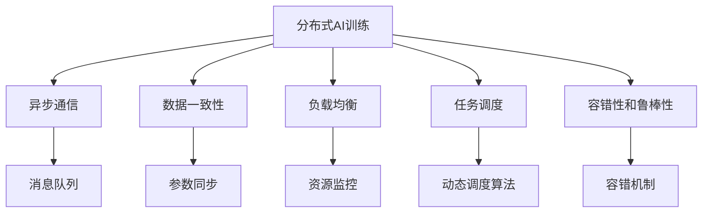

                 

## 1. 背景介绍

### 1.1 问题由来
在过去的几十年中，人工智能（AI）技术的快速发展极大地推动了各行业的智能化升级，其中分布式AI训练技术的突破显得尤为重要。随着模型规模的不断增长，传统的单机单卡训练方式已无法满足大规模数据和复杂模型的需求，分布式训练成为必然选择。然而，分布式AI训练并非简单的扩展，它面临着诸如异步通信、数据一致性、负载均衡、任务调度等一系列技术挑战。同时，该领域的人才需求量巨大，但当前高水平人才稀缺，如何培养和吸引AI专业人才，是实现技术突破的关键。

### 1.2 问题核心关键点
当前，分布式AI训练的技术挑战主要体现在以下几个方面：

1. **异步通信：** 多节点训练时，节点之间的通信效率直接影响整体训练速度，尤其是在数据传输和模型参数更新方面。
2. **数据一致性：** 如何在不同节点之间保持模型参数和数据的一致性，避免因数据或模型状态不一致导致的训练错误。
3. **负载均衡：** 不同节点的计算资源和网络带宽不均等，如何公平分配任务，避免某节点过载或闲置。
4. **任务调度：** 如何在多节点之间高效调度任务，最小化等待时间和任务空闲期，提升整体训练效率。
5. **容错性和鲁棒性：** 如何设计系统以应对硬件故障和网络中断，保证训练的连续性和稳定性。

这些问题并非孤立存在，而是相互关联，需要综合考虑和解决。同时，该领域的人才需求也日益凸显，但当前AI专业人才的培养和引入面临诸多挑战。

### 1.3 问题研究意义
研究分布式AI训练技术，对于推动大规模AI应用落地，提升模型训练效率和稳定性，以及培养和吸引AI专业人才，具有重要意义：

1. **推动大规模AI应用落地：** 分布式训练技术能够支持更大规模的数据处理和更复杂的模型训练，推动AI在更多领域的应用。
2. **提升模型训练效率和稳定性：** 通过优化通信、调度等关键环节，分布式训练能够显著提升训练速度和稳定性，缩短产品上线周期。
3. **培养和吸引AI专业人才：** 分布式AI训练技术的突破需要跨学科知识的融合，培养具有跨领域知识背景的专业人才，是实现技术突破的关键。

## 2. 核心概念与联系

### 2.1 核心概念概述

为了更好地理解分布式AI训练的技术挑战和人才需求，本节将介绍几个核心概念：

- **分布式AI训练**：利用多台计算机或服务器协同工作，共同完成AI模型的训练。相较于单机单卡训练，分布式训练能够显著提升训练效率。
- **异步通信**：在分布式训练中，各节点之间的通信往往无法同步进行，需要通过异步通信机制协调各节点的操作。
- **数据一致性**：在分布式训练中，多个节点之间共享的数据和模型参数必须保持一致，以避免因数据或模型状态不一致导致的训练错误。
- **负载均衡**：在分布式训练中，如何公平分配任务，避免某节点过载或闲置，是确保系统高效运行的重要因素。
- **任务调度**：在分布式训练中，如何高效调度任务，最小化等待时间和任务空闲期，是提升训练效率的关键。
- **容错性和鲁棒性**：在分布式训练中，如何设计系统以应对硬件故障和网络中断，保证训练的连续性和稳定性，是系统可靠性的重要保证。

这些核心概念之间的逻辑关系可以通过以下Mermaid流程图来展示：



这个流程图展示了分布式AI训练的核心概念及其之间的关系：

1. 分布式AI训练依赖于异步通信、数据一致性、负载均衡、任务调度和容错性等关键技术。
2. 异步通信机制通过消息队列协调各节点的操作，是分布式训练的基础。
3. 数据一致性通过参数同步机制，确保不同节点之间的数据和模型参数保持一致。
4. 负载均衡通过资源监控和动态调度算法，公平分配任务，提升系统效率。
5. 容错性和鲁棒性通过容错机制，保证系统的可靠性和稳定性。

这些概念共同构成了分布式AI训练的完整框架，使得大规模AI训练成为可能。

## 3. 核心算法原理 & 具体操作步骤
### 3.1 算法原理概述

分布式AI训练的核心原理是利用多台计算机或服务器的协同工作，共同完成AI模型的训练。具体而言，在分布式训练中，每个节点独立处理一部分数据，然后将结果汇总，更新全局模型参数。这个过程可以通过异步通信、数据一致性、负载均衡、任务调度和容错性等关键技术来实现。

### 3.2 算法步骤详解

分布式AI训练的一般步骤如下：

**Step 1: 数据划分和参数初始化**
- 将训练数据划分为多个子集，每个节点分配一个子集进行训练。
- 初始化全局模型参数，每个节点本地维护一份模型副本。

**Step 2: 分布式训练循环**
- 节点之间通过异步通信机制，交换梯度更新信息。
- 每个节点根据本地梯度和接收到的通信信息，更新本地模型参数。
- 周期性地将本地模型参数汇总，更新全局模型参数。

**Step 3: 同步机制**
- 定义参数同步机制，确保各节点之间的参数和数据一致。
- 在每个训练周期结束时，进行参数同步操作。

**Step 4: 负载均衡和动态调度**
- 实时监控节点状态，动态调整任务分配，避免某节点过载或闲置。
- 使用动态调度算法，确保任务均衡分配。

**Step 5: 容错机制**
- 设计容错机制，确保系统在硬件故障和网络中断的情况下能够继续训练。
- 定期备份模型参数，防止数据丢失。

通过以上步骤，分布式AI训练能够高效、稳定地完成大规模模型的训练任务。

### 3.3 算法优缺点

分布式AI训练具有以下优点：

1. **训练效率高**：通过多节点协同训练，能够显著提升训练速度。
2. **资源利用率高**：能够高效利用多台计算机或服务器的计算资源。
3. **可扩展性强**：能够随着硬件规模的增加，动态扩展训练能力。

同时，分布式AI训练也存在一定的局限性：

1. **通信开销大**：节点之间的通信需要额外的时间和计算资源。
2. **同步开销高**：参数同步操作增加了训练的复杂性和开销。
3. **系统设计复杂**：需要考虑负载均衡、容错性等多方面因素，系统设计复杂。

尽管存在这些局限性，但就目前而言，分布式AI训练仍是大规模AI应用落地的重要技术手段。未来相关研究的重点在于如何进一步降低通信开销，优化参数同步机制，简化系统设计，以提升分布式AI训练的效率和稳定性。

### 3.4 算法应用领域

分布式AI训练技术已经在多个领域得到了广泛应用，以下是几个典型的应用场景：

1. **计算机视觉**：在大规模图像数据上训练深度卷积神经网络（CNN）模型，如ImageNet等数据集。
2. **自然语言处理**：在大规模文本数据上训练语言模型，如BERT、GPT等模型。
3. **推荐系统**：在大规模用户行为数据上训练推荐模型，提升推荐系统的效果和实时性。
4. **医疗数据处理**：在医疗图像、电子病历等大数据集上训练医疗模型，提高诊断和治疗的准确性和效率。
5. **金融分析**：在金融市场数据上训练预测模型，提升金融风险管理和投资策略的准确性。

除了上述这些经典应用外，分布式AI训练还被创新性地应用于更多场景中，如自动驾驶、智慧城市、智能制造等，为各行业数字化转型升级提供新的技术支撑。随着预训练模型和分布式训练方法的不断进步，相信分布式AI训练技术将在更多领域得到应用，为各行各业带来变革性影响。

## 4. 数学模型和公式 & 详细讲解 & 举例说明

### 4.1 数学模型构建

在分布式AI训练中，我们通常采用参数服务器（Parameter Server, PS）架构，其中参数服务器负责存储和更新全局模型参数，各节点独立计算梯度，并定期与参数服务器同步。以下是一个简单的分布式训练模型：

- 假设全局模型参数为 $\theta$，每个节点 $i$ 维护本地模型参数 $\theta_i$。
- 数据集 $D$ 被划分为 $n$ 个子集 $D_1, D_2, \ldots, D_n$，每个节点分配一个子集 $D_i$ 进行训练。
- 节点 $i$ 的训练过程如下：

  1. 对于数据集 $D_i$，计算模型 $f_{\theta_i}(x)$ 的梯度 $g_i = \nabla_{\theta_i}L(f_{\theta_i}(x_i))$。
  2. 将梯度 $g_i$ 发送给参数服务器。
  3. 参数服务器更新全局模型参数 $\theta$，使用梯度下降算法：$\theta \leftarrow \theta - \eta g_i$。
  4. 参数服务器将更新后的模型参数 $\theta$ 发送给节点 $i$。
  5. 节点 $i$ 更新本地模型参数 $\theta_i$，$\theta_i \leftarrow \theta_i + \delta_i$，其中 $\delta_i$ 为节点 $i$ 在本次更新中的梯度贡献。

### 4.2 公式推导过程

为了更好地理解分布式AI训练的过程，以下推导一个简单的分布式梯度下降公式：

假设参数服务器存储全局模型参数 $\theta$，每个节点 $i$ 本地维护模型参数 $\theta_i$。节点 $i$ 在当前时刻 $t$ 的梯度为 $g_i$，参数服务器的模型参数为 $\theta_{ps}$。节点 $i$ 的更新公式为：

$$
\theta_i \leftarrow \theta_i - \eta_i g_i
$$

其中 $\eta_i$ 为节点 $i$ 的学习率。参数服务器在每个训练周期 $t$ 结束时，更新全局模型参数 $\theta_{ps}$：

$$
\theta_{ps} \leftarrow \theta_{ps} - \frac{1}{n} \sum_{i=1}^n \eta_i g_i
$$

### 4.3 案例分析与讲解

以下通过一个简单的图像分类任务，解释分布式AI训练的具体流程：

假设有一个大规模的图像分类任务，数据集 $D$ 被划分为 $n$ 个子集 $D_1, D_2, \ldots, D_n$，每个节点 $i$ 分配一个子集 $D_i$。节点 $i$ 在本地使用一个深度卷积神经网络（CNN）模型进行训练，计算模型 $f_{\theta_i}(x)$ 的梯度 $g_i = \nabla_{\theta_i}L(f_{\theta_i}(x_i))$。每个节点将梯度 $g_i$ 发送给参数服务器，参数服务器使用梯度下降算法更新全局模型参数 $\theta_{ps}$：

$$
\theta_{ps} \leftarrow \theta_{ps} - \frac{1}{n} \sum_{i=1}^n \eta_i g_i
$$

参数服务器将更新后的全局模型参数 $\theta_{ps}$ 发送给所有节点 $i$，节点 $i$ 更新本地模型参数 $\theta_i$：

$$
\theta_i \leftarrow \theta_i - \eta_i g_i
$$

这样，每个节点独立进行梯度计算，然后通过参数服务器协调更新全局模型参数。这种分布式训练方式能够充分利用多台计算机或服务器的计算资源，显著提升训练效率。

## 5. 项目实践：代码实例和详细解释说明
### 5.1 开发环境搭建

在进行分布式AI训练实践前，我们需要准备好开发环境。以下是使用Python和PyTorch进行分布式训练的环境配置流程：

1. 安装Anaconda：从官网下载并安装Anaconda，用于创建独立的Python环境。

2. 创建并激活虚拟环境：
```bash
conda create -n torch-env python=3.8 
conda activate torch-env
```

3. 安装PyTorch：根据CUDA版本，从官网获取对应的安装命令。例如：
```bash
conda install pytorch torchvision torchaudio cudatoolkit=11.1 -c pytorch -c conda-forge
```

4. 安装DistributedDataParallel（DDP）库：
```bash
pip install torch.distributed torch.nn.parallel
```

5. 安装各类工具包：
```bash
pip install numpy pandas scikit-learn matplotlib tqdm jupyter notebook ipython
```

完成上述步骤后，即可在`torch-env`环境中开始分布式训练实践。

### 5.2 源代码详细实现

下面我们以图像分类任务为例，给出使用PyTorch进行分布式训练的代码实现。

首先，定义数据处理函数：

```python
import torch
import torch.distributed as dist
from torch.utils.data import Dataset, DataLoader
from torchvision import datasets, transforms

class ImageDataset(Dataset):
    def __init__(self, data_dir, transform=None):
        self.data_dir = data_dir
        self.transform = transform
        self.train_data = datasets.ImageFolder(root=self.data_dir, transform=self.transform)
        self.train_loader = DataLoader(self.train_data, batch_size=64, shuffle=True)

    def __getitem__(self, idx):
        img, label = self.train_loader[idx]
        return img, label

    def __len__(self):
        return len(self.train_loader)
```

然后，定义模型和优化器：

```python
import torch.nn as nn
import torch.distributed as dist
import torch.optim as optim

class CNNModel(nn.Module):
    def __init__(self):
        super(CNNModel, self).__init__()
        self.conv1 = nn.Conv2d(3, 64, kernel_size=3, stride=1, padding=1)
        self.relu = nn.ReLU()
        self.pool = nn.MaxPool2d(kernel_size=2, stride=2)
        self.fc = nn.Linear(64 * 28 * 28, 10)

    def forward(self, x):
        x = self.conv1(x)
        x = self.relu(x)
        x = self.pool(x)
        x = x.view(-1, 64 * 28 * 28)
        x = self.fc(x)
        return x

model = CNNModel().to('cuda')
```

接着，定义分布式训练函数：

```python
def train_epoch(model, data_loader, optimizer):
    model.train()
    loss_sum = 0.0
    optimizer.zero_grad()
    for i, (img, label) in enumerate(data_loader):
        img = img.to('cuda')
        label = label.to('cuda')
        output = model(img)
        loss = nn.CrossEntropyLoss()(output, label)
        loss.backward()
        optimizer.step()
        loss_sum += loss.item()
    return loss_sum / len(data_loader)
```

最后，启动分布式训练流程：

```python
import torch.distributed as dist

dist.init_process_group(backend='nccl', init_method='env://')

world_size = dist.get_world_size()
device = 'cuda:{}'.format(dist.get_rank())
model = CNNModel().to(device)

train_dataset = ImageDataset('/data/train', transform=transforms.ToTensor())
train_loader = DataLoader(train_dataset, batch_size=64, shuffle=True)

for epoch in range(10):
    train_loss = train_epoch(model, train_loader, optim.SGD(model.parameters(), lr=0.01))
    print(f'Epoch {epoch+1}, train loss: {train_loss:.4f}')
```

以上就是使用PyTorch进行分布式图像分类训练的完整代码实现。可以看到，得益于DistributedDataParallel（DDP）库的强大封装，我们可以用相对简洁的代码完成分布式训练任务。

### 5.3 代码解读与分析

让我们再详细解读一下关键代码的实现细节：

**ImageDataset类**：
- `__init__`方法：初始化数据集路径、变换方式等关键组件，并将数据集划分为训练集。
- `__getitem__`方法：对单个样本进行处理，将图像数据转化为模型所需的张量。
- `__len__`方法：返回数据集的样本数量。

**CnnModel类**：
- `__init__`方法：定义模型结构，包括卷积层、ReLU激活函数、池化层和全连接层。
- `forward`方法：定义模型的前向传播过程。

**train_epoch函数**：
- 对数据进行批处理，遍历训练集，计算损失函数和梯度。
- 使用SGD优化器更新模型参数，记录总损失。

**分布式训练流程**：
- 通过dist.init_process_group初始化分布式环境，设置通信后端和参数初始化方式。
- 获取当前进程的秩和设备编号。
- 使用DDP封装模型，指定设备编号。
- 定义训练集数据集和加载器，开始循环训练。

可以看到，PyTorch配合DistributedDataParallel（DDP）库使得分布式训练的代码实现变得简洁高效。开发者可以将更多精力放在模型改进、数据处理等高层逻辑上，而不必过多关注底层的实现细节。

当然，工业级的系统实现还需考虑更多因素，如模型的保存和部署、超参数的自动搜索、更灵活的分布式调度等。但核心的分布式训练范式基本与此类似。

## 6. 实际应用场景
### 6.1 自动驾驶

自动驾驶技术依赖于对复杂环境的感知和决策。大规模的图像和视频数据训练是实现高性能感知模型的必要步骤。利用分布式AI训练技术，可以在短时间内训练出高精度的自动驾驶感知模型，提升自动驾驶系统的安全性。

在实际应用中，自动驾驶系统需要对传感器数据进行实时处理和分析，以实现路径规划和控制。分布式训练技术能够快速处理大规模数据，提供实时的感知能力，为自动驾驶系统提供可靠的决策支持。

### 6.2 智慧医疗

智慧医疗系统需要处理海量医疗图像、电子病历等数据，以辅助医生进行诊断和治疗。分布式AI训练技术能够在大规模医疗数据上训练高效的医疗模型，提升诊断和治疗的准确性和效率。

在实际应用中，分布式训练技术可以将大规模医疗数据划分为多个子集，由多个节点并行训练，快速获得高精度的医疗模型。这些模型可以应用于图像识别、自然语言处理、推荐系统等多个子领域，提升智慧医疗系统的综合能力。

### 6.3 工业制造

工业制造系统需要处理海量生产数据，以优化生产流程和提升产品质量。分布式AI训练技术能够在大型生产数据集上训练高效的生产模型，提升生产效率和质量控制。

在实际应用中，分布式训练技术可以将生产数据划分为多个子集，由多个节点并行训练，快速获得高精度的生产模型。这些模型可以应用于质量检测、故障预测、设备维护等多个子领域，提升工业制造系统的自动化和智能化水平。

### 6.4 未来应用展望

随着分布式AI训练技术的不断发展，未来将在更多领域得到应用，为各行各业带来变革性影响。

在智慧城市治理中，分布式训练技术可以应用于城市事件监测、舆情分析、应急指挥等环节，提高城市管理的自动化和智能化水平，构建更安全、高效的未来城市。

在智慧教育中，分布式训练技术可以应用于学生学习行为分析、推荐系统、智能辅导等多个子领域，提升教育系统的智能化水平，实现因材施教，促进教育公平。

在智慧零售中，分布式训练技术可以应用于用户行为分析、库存管理、推荐系统等多个子领域，提升零售系统的智能化水平，优化商品推荐和库存管理，提高零售系统的运营效率。

此外，在智能交通、智慧能源、智能安防等众多领域，分布式AI训练技术也将不断涌现，为各行业数字化转型升级提供新的技术支撑。相信随着技术的日益成熟，分布式AI训练必将在更广阔的应用领域大放异彩，深刻影响人类的生产生活方式。

## 7. 工具和资源推荐
### 7.1 学习资源推荐

为了帮助开发者系统掌握分布式AI训练的理论基础和实践技巧，这里推荐一些优质的学习资源：

1. **《分布式深度学习》课程**：由斯坦福大学开设的分布式深度学习课程，讲解分布式训练的原理和实践方法。
2. **《TensorFlow 分布式深度学习》书籍**：Google官方出版的分布式深度学习书籍，介绍了TensorFlow在分布式训练中的应用。
3. **《大规模深度学习训练》书籍**：由Deep Learning A-Z课程的主讲人撰写，介绍了大规模深度学习的训练方法和技术。
4. **PyTorch官方文档**：PyTorch的官方文档，详细介绍了PyTorch在分布式训练中的应用，包括DistributedDataParallel（DDP）等。
5. **Apache Spark官网**：Apache Spark是业界领先的分布式计算框架，提供了丰富的分布式机器学习算法和工具，适用于大规模分布式训练任务。

通过对这些资源的学习实践，相信你一定能够快速掌握分布式AI训练的精髓，并用于解决实际的AI训练问题。

### 7.2 开发工具推荐

高效的开发离不开优秀的工具支持。以下是几款用于分布式AI训练开发的常用工具：

1. **PyTorch**：基于Python的开源深度学习框架，灵活动态的计算图，适合快速迭代研究。支持DistributedDataParallel（DDP）等分布式训练特性。
2. **TensorFlow**：由Google主导开发的开源深度学习框架，生产部署方便，适合大规模工程应用。支持分布式计算和优化器的自动选择。
3. **Apache Spark**：Apache基金会提供的分布式计算框架，支持大规模数据处理和机器学习算法。
4. **Horovod**：Facebook开发的分布式深度学习框架，支持多GPU、多机群等分布式训练。
5. **Joblib**：Python库，提供分布式任务调度功能，适用于中小规模的分布式训练任务。
6. **Gloo**：Facebook开发的分布式通信库，支持多GPU、多节点间的通信和数据同步。

合理利用这些工具，可以显著提升分布式AI训练的开发效率，加快创新迭代的步伐。

### 7.3 相关论文推荐

分布式AI训练技术的发展源于学界的持续研究。以下是几篇奠基性的相关论文，推荐阅读：

1. **Distributed Deep Learning with Hogwild!**：提出Hogwild!算法，解决分布式训练中的通信开销问题。
2. **Communication-Efficient Learning of Deep Networks from Commodity Computers and Data Centers**：提出同步梯度算法，降低通信开销，提升分布式训练效率。
3. **Efficient Distributed Deep Learning**：提出一种基于参数服务器的分布式训练方法，提高训练效率和系统可靠性。
4. **TensorFlow: A System for Large-Scale Machine Learning**：介绍TensorFlow的分布式训练机制，包括Parameter Server、Data Parallelism等。
5. **Horovod: Distributed Training for Deep Learning**：介绍Horovod框架，支持多GPU、多节点间的分布式训练。

这些论文代表了大规模分布式AI训练的发展脉络。通过学习这些前沿成果，可以帮助研究者把握学科前进方向，激发更多的创新灵感。

## 8. 总结：未来发展趋势与挑战

### 8.1 总结

本文对分布式AI训练技术进行了全面系统的介绍。首先阐述了分布式AI训练的技术挑战和人才需求，明确了分布式训练在提升训练效率和系统可靠性方面的重要性。其次，从原理到实践，详细讲解了分布式AI训练的数学模型和关键步骤，给出了分布式图像分类任务的代码实例。同时，本文还广泛探讨了分布式AI训练在自动驾驶、智慧医疗、工业制造等多个领域的应用前景，展示了分布式AI训练技术的广阔前景。最后，本文精选了分布式AI训练的学习资源、开发工具和相关论文，力求为读者提供全方位的技术指引。

通过本文的系统梳理，可以看到，分布式AI训练技术已经成为大规模AI应用落地的重要技术手段。其在提升训练效率、系统可靠性和资源利用率方面具有显著优势，是未来AI技术发展的重要方向。

### 8.2 未来发展趋势

展望未来，分布式AI训练技术将呈现以下几个发展趋势：

1. **异步通信的优化**：异步通信是分布式AI训练中的核心技术之一，未来的研究方向将集中在如何进一步降低通信开销，提高通信效率。
2. **参数同步的优化**：参数同步是分布式训练中的关键步骤，未来的研究将集中在如何进一步优化同步机制，减少同步开销。
3. **负载均衡和动态调度**：未来的分布式训练系统将更加灵活，能够动态调整任务分配，避免节点过载或闲置。
4. **容错性和鲁棒性**：未来的分布式AI训练系统将更加健壮，能够应对硬件故障和网络中断，确保训练的连续性和稳定性。
5. **跨平台和跨硬件支持**：未来的分布式AI训练系统将更加通用，支持多种硬件平台和计算框架。
6. **自动化和智能化的优化**：未来的分布式AI训练系统将更加智能化，能够自动调参、自动优化训练过程。

这些趋势凸显了分布式AI训练技术的广阔前景。这些方向的探索发展，必将进一步提升分布式AI训练的效率和稳定性，推动大规模AI应用落地。

### 8.3 面临的挑战

尽管分布式AI训练技术已经取得了瞩目成就，但在迈向更加智能化、普适化应用的过程中，它仍面临着诸多挑战：

1. **通信开销大**：节点之间的通信需要额外的时间和计算资源，如何进一步降低通信开销，是提升训练效率的关键。
2. **同步开销高**：参数同步操作增加了训练的复杂性和开销，如何优化同步机制，是提升训练效率的重要方向。
3. **系统设计复杂**：分布式AI训练系统需要考虑负载均衡、容错性等多方面因素，系统设计复杂。
4. **资源利用率低**：不同节点的计算资源和网络带宽不均等，如何公平分配任务，是确保系统高效运行的重要因素。
5. **算法和工具缺乏**：虽然存在一些分布式训练框架和工具，但缺乏统一的算法和接口标准，不同框架之间的兼容性较差。
6. **安全性和隐私问题**：分布式训练系统中的数据传输和模型更新可能面临安全性和隐私问题，如何保护数据安全，是分布式训练系统的重要挑战。

这些挑战需要研究者、开发者和用户共同面对和解决，才能实现分布式AI训练技术的突破和普及。

### 8.4 研究展望

面对分布式AI训练所面临的种种挑战，未来的研究需要在以下几个方面寻求新的突破：

1. **异步通信优化**：探索更高效的通信机制，如环形通信、异步聚合等，进一步降低通信开销。
2. **参数同步优化**：引入更多同步算法，如梯度压缩、稀疏化同步等，减少同步开销。
3. **负载均衡和动态调度**：设计更加灵活的调度算法，如基于预测的任务调度，确保任务均衡分配。
4. **容错性和鲁棒性**：设计更加健壮的容错机制，如参数备份、动态任务重启等，确保系统的可靠性和稳定性。
5. **跨平台和跨硬件支持**：开发通用的分布式训练框架和工具，支持多种硬件平台和计算框架。
6. **自动化和智能化的优化**：开发自动化调参工具，提升分布式训练的效率和效果。
7. **安全性和隐私保护**：引入安全机制和隐私保护技术，确保数据和模型安全。

这些研究方向的探索，必将引领分布式AI训练技术迈向更高的台阶，为构建安全、可靠、高效、智能的分布式AI训练系统提供技术支撑。面向未来，分布式AI训练技术还需要与其他AI技术进行更深入的融合，如知识表示、因果推理、强化学习等，多路径协同发力，共同推动分布式AI训练技术的进步。

## 9. 附录：常见问题与解答

**Q1：分布式AI训练是否适用于所有NLP任务？**

A: 分布式AI训练在大多数NLP任务上都能取得不错的效果，特别是对于数据量较大的任务。但对于一些特定领域的任务，如医学、法律等，仅仅依靠通用语料预训练的模型可能难以很好地适应。此时需要在特定领域语料上进一步预训练，再进行分布式训练，才能获得理想效果。此外，对于一些需要时效性、个性化很强的任务，如对话、推荐等，分布式训练方法也需要针对性的改进优化。

**Q2：分布式AI训练中的异步通信如何实现？**

A: 异步通信是分布式AI训练中的核心技术之一。常见的异步通信机制包括消息队列、环形通信等。消息队列通过将节点之间的通信封装为消息，实现节点之间的异步通信。环形通信通过在多个节点之间轮流发送和接收消息，减少通信开销。

**Q3：分布式AI训练中的参数同步如何实现？**

A: 参数同步是分布式训练中的关键步骤。常见的参数同步机制包括Allreduce、Ringallreduce等。Allreduce通过在多个节点之间轮流发送和接收参数更新，实现全局参数的同步。Ringallreduce通过在多个节点之间依次发送和接收参数更新，实现全局参数的同步。

**Q4：分布式AI训练中的负载均衡如何实现？**

A: 负载均衡是分布式训练中的重要技术。常见的负载均衡机制包括静态任务分配、动态任务调度等。静态任务分配通过预定义任务分配策略，确保任务均衡分配。动态任务调度通过实时监控节点状态，动态调整任务分配，避免节点过载或闲置。

**Q5：分布式AI训练中的容错性和鲁棒性如何实现？**

A: 容错性和鲁棒性是分布式训练中的重要保证。常见的容错机制包括参数备份、动态任务重启等。参数备份通过定期备份模型参数，确保系统在硬件故障和网络中断的情况下能够继续训练。动态任务重启通过在发生故障时重新分配任务，确保系统可靠性和稳定性。

通过以上问题的解答，相信你一定能够对分布式AI训练技术有更深入的理解。如果你还有其他问题或疑问，欢迎继续探讨。

---

作者：禅与计算机程序设计艺术 / Zen and the Art of Computer Programming

