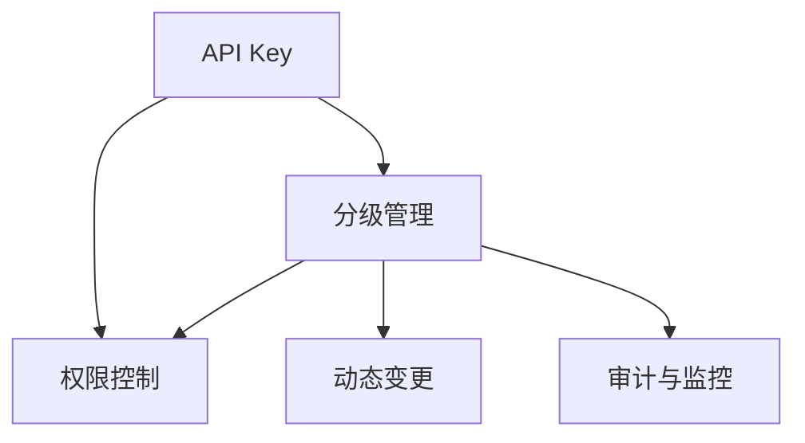

                 

# 分级 API Key 的管理

## 1. 背景介绍

### 1.1 问题由来

在现代互联网应用中，API Key 是一个不可或缺的身份认证手段，它用于验证请求的合法性和可信度，确保只有授权用户或应用才能访问特定资源。然而，随着系统的复杂度和用户数量的增长，如何有效地管理、分配、审计和撤销API Key成为一大挑战。一方面，API Key的滥用和泄露可能带来严重的安全风险；另一方面，密钥的有效管理和动态更新也需要占用大量的人力和时间。

### 1.2 问题核心关键点

API Key 管理面临的主要问题包括：

- 密钥数量繁多，维护工作量大；
- 密钥权限管理复杂，权限粒度控制难度高；
- 密钥泄露风险高，管理与审计要求严格；
- 密钥动态变更频繁，对系统的影响较大；
- 系统扩展性不足，难以支持大规模用户并发。

### 1.3 问题研究意义

高效、安全、易管理的API Key系统对保障应用安全性、提升用户体验具有重要意义：

- 增强系统安全性，防止未经授权的访问；
- 优化用户体验，减少因密钥管理不当带来的不便；
- 节省运维成本，提高系统效率和响应速度。

本文聚焦于API Key的“分级管理”方案，通过对密钥管理策略进行分级和优化，旨在解决上述问题，构建一个高效、安全、易于管理的API Key系统。

## 2. 核心概念与联系

### 2.1 核心概念概述

API Key 管理系统的核心概念包括：

- API Key：用于验证API请求的密钥，通常以字符串形式存在。
- 分级管理：将API Key按照用户角色、权限等级等维度进行划分，实现精细化的密钥管理。
- 权限控制：通过细粒度的权限设定，确保API Key的请求仅限于特定用户或应用。
- 动态变更：根据系统需求和用户行为的变化，动态更新API Key的权限和信息。
- 审计与监控：记录和分析API Key的使用情况，及时发现和应对异常行为。

这些概念之间的关系可以用以下Mermaid流程图来展示：



## 3. 核心算法原理 & 具体操作步骤

### 3.1 算法原理概述

分级API Key管理的核心思想是：根据用户角色、权限等级等因素，将API Key进行细分和隔离，从而实现细粒度的权限控制和动态管理。

具体而言，API Key按照用户身份进行分层，将具有相同权限或用途的API Key聚合在一起，形成一个层级结构。各层级之间存在严格的访问控制，确保密钥只能被授权用户或应用使用。同时，系统通过定期审计和监控，检测并响应异常行为，保证API Key的安全性和系统稳定性。

### 3.2 算法步骤详解

分级API Key管理的详细步骤包括：

**Step 1: 设计密钥层级结构**

根据应用场景和需求，将API Key划分为若干层级。每个层级对应一类用户或应用，具有不同的访问权限。例如，可以设计以下层级：

- 管理员层：拥有系统最高权限，可以管理所有API Key。
- 开发者层：拥有应用开发和调试权限，可以创建和管理API Key。
- 用户层：拥有特定应用或服务的访问权限，只能使用预分配的API Key。

**Step 2: 生成和管理密钥**

- 管理员层：负责生成和管理所有API Key。可以使用加密算法（如RSA、AES）生成密钥，并存储在安全的数据库中。
- 开发者层：可以使用上级管理员分配的密钥，创建新的API Key，并设置相应的访问权限。
- 用户层：只能通过授权的API Key访问特定应用或服务。

**Step 3: 细粒度权限控制**

- 根据用户角色和权限等级，设置API Key的访问权限。例如，管理员可以完全控制所有API Key，开发者只能创建和管理特定的API Key，用户只能使用预先分配的API Key。
- 使用基于角色的访问控制（RBAC）模型，定义API Key的权限规则。例如，某个API Key只能访问特定的URL路径或请求方法。

**Step 4: 动态变更和审计监控**

- 根据系统需求和用户行为的变化，动态更新API Key的权限和信息。例如，某开发者离职后，其管理的API Key需要被立即撤销。
- 记录和审计API Key的使用情况，检测并响应异常行为。例如，检测到某个API Key频繁访问敏感信息或异常路径时，立即触发告警并锁定该API Key。

**Step 5: 异常处理与应急响应**

- 设计系统异常处理机制，保证API Key管理系统的稳定性和可靠性。例如，在API Key生成、管理、撤销等过程中，应设置合适的错误处理和回滚机制。
- 建立应急响应流程，快速定位和解决API Key管理系统的故障或问题。例如，在API Key被非法使用或泄露时，立即切断访问并通知相关人员。

### 3.3 算法优缺点

分级API Key管理的主要优点包括：

- 细粒度权限控制：通过细粒度的权限设定，确保API Key的请求仅限于特定用户或应用，提升系统安全性。
- 动态变更管理：根据系统需求和用户行为的变化，动态更新API Key的权限和信息，确保系统实时性。
- 分级结构清晰：通过分层管理和分配权限，使系统结构更加清晰，管理成本降低。

主要缺点包括：

- 实施成本较高：需要设计和管理多个层级结构，增加了系统复杂度。
- 权限分配复杂：细粒度的权限控制需要大量配置和审核，可能增加运维工作量。
- 系统扩展性差：多个层级结构可能导致系统扩展性不足，难以支持大规模用户并发。

尽管存在这些局限性，分级API Key管理仍然是目前较为主流且有效的密钥管理策略之一，广泛应用于大型互联网应用的API Key管理中。

### 3.4 算法应用领域

分级API Key管理在以下领域得到了广泛应用：

- 互联网应用：大型电商、社交、在线教育等应用，如淘宝、微信、Coursera等。
- 云计算平台：AWS、Azure、阿里云等云平台，提供灵活、安全的API Key管理服务。
- 安全系统：网络安全、身份认证、数据加密等领域，确保数据安全性和隐私保护。

## 4. 数学模型和公式 & 详细讲解

### 4.1 数学模型构建

API Key管理系统的数学模型主要涉及权限控制和审计监控两个方面。以下介绍核心数学模型及其构建过程。

**权限控制模型**

假设系统中有 $N$ 个API Key，每个API Key的权限集合为 $P_i$，其中 $i=1,2,\ldots,N$。权限控制模型可以表示为：

$$
\{P_1, P_2, \ldots, P_N\}
$$

**审计监控模型**

假设系统有 $M$ 个API Key使用记录，每个记录包含请求时间、API Key、请求路径等信息。审计监控模型可以表示为：

$$
\{(T_1, K_1, P_1), (T_2, K_2, P_2), \ldots, (T_M, K_M, P_M)\}
$$

其中，$T_i$ 表示请求时间，$K_i$ 表示API Key，$P_i$ 表示请求路径。

### 4.2 公式推导过程

以权限控制模型为例，假设系统中有两个API Key $A$ 和 $B$，权限集合分别为 $P_A$ 和 $P_B$。则两个API Key的权限交集可以表示为：

$$
P_{A \cap B} = \{p | p \in P_A \land p \in P_B\}
$$

两个API Key的权限并集可以表示为：

$$
P_{A \cup B} = \{p | p \in P_A \lor p \in P_B\}
$$

根据上述定义，可以推导出两个API Key的权限差异：

$$
P_{A - B} = \{p | p \in P_A \land p \notin P_B\}
$$
$$
P_{B - A} = \{p | p \in P_B \land p \notin P_A\}
$$

通过以上数学模型，系统可以实现细粒度的权限控制和审计监控。

### 4.3 案例分析与讲解

假设某电商平台需要管理用户访问API Key，按照以下分级策略进行管理：

- 管理员层：拥有系统最高权限，可以管理所有API Key。
- 开发者层：拥有应用开发和调试权限，可以创建和管理API Key。
- 用户层：拥有特定应用或服务的访问权限，只能使用预分配的API Key。

管理员层和开发者层的API Key使用RSA加密算法生成，存储在安全的数据库中。用户层的API Key由开发者层生成，并在用户注册时分配。

管理员层使用RBAC模型定义权限规则，例如，某个API Key只能访问特定的URL路径或请求方法。开发者层可以使用上级管理员分配的API Key，创建新的API Key，并设置相应的访问权限。用户层只能通过授权的API Key访问特定应用或服务。

系统定期记录和审计API Key的使用情况，检测并响应异常行为。例如，检测到某个API Key频繁访问敏感信息或异常路径时，立即触发告警并锁定该API Key。

## 5. 项目实践：代码实例和详细解释说明

### 5.1 开发环境搭建

API Key管理系统的开发环境主要包括：

- 编程语言：Python 3.x
- 数据库：MySQL或PostgreSQL
- 框架：Flask 或 Django
- 加密库：cryptography

安装所需库后，可以开始开发API Key管理系统。

### 5.2 源代码详细实现

以下是一个使用Flask框架实现的API Key管理系统的示例代码：

```python
from flask import Flask, request, jsonify
from flask_sqlalchemy import SQLAlchemy
from cryptography.fernet import Fernet
import time

app = Flask(__name__)
app.config['SQLALCHEMY_DATABASE_URI'] = 'sqlite:////tmp/test.db'
db = SQLAlchemy(app)

class User(db.Model):
    id = db.Column(db.Integer, primary_key=True)
    name = db.Column(db.String(50), nullable=False)
    keys = db.relationship('APIKey', backref='user', lazy='dynamic')

class APIKey(db.Model):
    id = db.Column(db.Integer, primary_key=True)
    user_id = db.Column(db.Integer, db.ForeignKey('user.id'), nullable=False)
    key = db.Column(db.String(255), nullable=False)
    permissions = db.Column(db.String(255), nullable=False)
    created_at = db.Column(db.DateTime, default=time.time)
    updated_at = db.Column(db.DateTime, default=time.time, onupdate=time.time)

def generate_key():
    key = Fernet.generate_key()
    return key

def check_permissions(api_key, permissions):
    if permissions == 'admin':
        return True
    if permissions == 'developer':
        return check_key_in_user(api_key, 'developer')
    if permissions == 'user':
        return check_key_in_user(api_key, 'user')
    return False

def check_key_in_user(api_key, role):
    user = User.query.filter_by(key=api_key).first()
    if user is not None and user.role == role:
        return True
    return False

@app.route('/generate', methods=['POST'])
def generate_key_handler():
    if not check_permissions('developer'):
        return jsonify({'error': 'You are not authorized to generate API Key.'}), 403
    key = generate_key()
    api_key = APIKey(key=key, permissions='user')
    db.session.add(api_key)
    db.session.commit()
    return jsonify({'api_key': key})

@app.route('/<api_key>', methods=['GET'])
def get_api_key(api_key):
    if not check_permissions(api_key, 'user'):
        return jsonify({'error': 'You are not authorized to access this API Key.'}), 403
    api_key = APIKey.query.filter_by(key=api_key).first()
    if api_key is None:
        return jsonify({'error': 'API Key not found.'}), 404
    return jsonify({'user': api_key.user.name, 'permissions': api_key.permissions, 'created_at': api_key.created_at})

@app.route('/<api_key>/update', methods=['POST'])
def update_api_key(api_key):
    if not check_permissions(api_key, 'developer'):
        return jsonify({'error': 'You are not authorized to update this API Key.'}), 403
    new_permissions = request.form.get('permissions')
    api_key = APIKey.query.filter_by(key=api_key).first()
    if api_key is None:
        return jsonify({'error': 'API Key not found.'}), 404
    api_key.permissions = new_permissions
    api_key.updated_at = time.time()
    db.session.commit()
    return jsonify({'message': 'API Key updated successfully.'})

if __name__ == '__main__':
    db.create_all()
    app.run(debug=True)
```

### 5.3 代码解读与分析

以上代码实现了API Key的生成、获取和更新功能。以下是关键代码的解读：

- 数据库模型定义：使用SQLAlchemy定义用户和API Key的数据库模型，包含id、name、key、permissions、created_at、updated_at等字段。
- API Key生成函数：使用cryptography库生成RSA加密密钥，存储在API Key表中。
- 权限检查函数：根据API Key的权限，检查用户是否具有相应的访问权限。
- API Key生成路由：开发者可以通过POST请求生成API Key，生成后返回API Key字符串。
- API Key获取路由：用户可以通过GET请求获取指定API Key的信息。
- API Key更新路由：开发者可以通过POST请求更新指定API Key的权限。

## 6. 实际应用场景

### 6.1 互联网应用

在大型互联网应用中，API Key管理是保障系统安全性和用户体验的重要手段。例如，某电商平台需要管理用户访问API Key，按照以下分级策略进行管理：

- 管理员层：拥有系统最高权限，可以管理所有API Key。
- 开发者层：拥有应用开发和调试权限，可以创建和管理API Key。
- 用户层：拥有特定应用或服务的访问权限，只能使用预分配的API Key。

通过细粒度的权限控制和动态变更管理，系统能够保障数据安全和用户体验。

### 6.2 云计算平台

云计算平台需要管理大量的API Key，确保数据安全和系统稳定性。例如，AWS提供了基于角色的访问控制（IAM），按照以下分级策略进行管理：

- 管理员层：拥有系统最高权限，可以管理所有API Key。
- 开发者层：拥有应用开发和调试权限，可以创建和管理API Key。
- 用户层：拥有特定应用或服务的访问权限，只能使用预分配的API Key。

系统定期记录和审计API Key的使用情况，检测并响应异常行为，确保API Key的安全性和系统稳定性。

### 6.3 安全系统

网络安全、身份认证、数据加密等领域需要高效、安全的API Key管理。例如，某金融系统需要管理用户访问API Key，按照以下分级策略进行管理：

- 管理员层：拥有系统最高权限，可以管理所有API Key。
- 开发者层：拥有应用开发和调试权限，可以创建和管理API Key。
- 用户层：拥有特定应用或服务的访问权限，只能使用预分配的API Key。

通过细粒度的权限控制和动态变更管理，系统能够保障数据安全和用户隐私。

## 7. 工具和资源推荐

### 7.1 学习资源推荐

为了帮助开发者系统掌握API Key的分级管理策略，这里推荐一些优质的学习资源：

- Flask和Django官方文档：Flask和Django都是常用的Web框架，提供了丰富的API设计和数据库操作功能。
- SQLAlchemy官方文档：SQLAlchemy是Python的ORM库，支持多种数据库，方便开发和管理数据库。
- cryptography官方文档：cryptography是Python的加密库，支持多种加密算法，如RSA、AES等。
- 《Flask Web Development》：Flask Web开发教程，适合初学者入门。
- 《Django Web Development》：Django Web开发教程，适合有一定经验的开发者。

通过对这些资源的学习实践，相信你一定能够快速掌握API Key管理系统的精髓，并用于解决实际的API Key管理问题。

### 7.2 开发工具推荐

高效的开发离不开优秀的工具支持。以下是几款用于API Key管理系统的常用工具：

- Flask和Django：常用的Web框架，方便开发API Key管理系统的后端。
- MySQL和PostgreSQL：常用的关系型数据库，存储和管理API Key信息。
- cryptography：Python的加密库，生成和管理API Key的加密密钥。
- TensorBoard：TensorFlow的可视化工具，方便监控和调试API Key管理系统的性能。
- Weights & Biases：模型训练的实验跟踪工具，记录和分析API Key管理系统的各项指标。

合理利用这些工具，可以显著提升API Key管理系统的开发效率，加快创新迭代的步伐。

### 7.3 相关论文推荐

API Key管理的核心在于细粒度的权限控制和动态变更管理。以下是几篇奠基性的相关论文，推荐阅读：

- "A Survey of Secure API Key Management in Cloud Computing"：该文献综述了云平台中的API Key管理方法，介绍了各种基于角色的访问控制（RBAC）模型。
- "On the Effectiveness of API Key Strategies"：该文献通过实验评估了不同API Key管理策略的优劣，指出分级管理的优势。
- "Designing and Implementing Secure API Keys for Web Applications"：该文献详细介绍了API Key管理的实现方法，包括密钥生成、权限控制和审计监控等。

这些论文代表了API Key管理技术的发展脉络。通过学习这些前沿成果，可以帮助研究者把握学科前进方向，激发更多的创新灵感。

## 8. 总结：未来发展趋势与挑战

### 8.1 研究成果总结

本文对分级API Key管理策略进行了全面系统的介绍，包括理论基础、实现细节和实际应用。通过细粒度的权限控制和动态变更管理，分级API Key管理系统能够在保障数据安全和系统稳定性的同时，提升用户体验和管理效率。

### 8.2 未来发展趋势

未来API Key管理技术将呈现以下几个发展趋势：

- 零信任架构：零信任架构强调对访问请求进行严格验证，不依赖固定的权限和认证方式。API Key管理需要与零信任架构深度结合，实现更加灵活和安全的访问控制。
- 多因素认证：多因素认证可以提高系统安全性，防止未经授权的访问。API Key管理需要引入多因素认证，提升访问验证的可靠性。
- 动态权限调整：根据系统需求和用户行为的变化，动态调整API Key的权限，确保系统实时性。
- 自动化管理：引入自动化工具和流程，减少人工干预和操作，提升API Key管理的效率和可靠性。

### 8.3 面临的挑战

尽管API Key管理技术已经取得了一定的进展，但在实施过程中仍面临诸多挑战：

- 系统复杂度增加：分级管理策略增加了系统的复杂度，可能导致系统设计和实现难度加大。
- 权限管理复杂：细粒度的权限控制需要大量配置和审核，可能增加运维工作量。
- 性能优化不足：API Key管理系统的性能优化不足，可能影响系统响应速度和用户体验。

### 8.4 研究展望

未来API Key管理研究需要在以下几个方面寻求新的突破：

- 引入零信任架构：引入零信任架构的思想，实现更加灵活和安全的访问控制。
- 优化权限管理：开发自动化工具和流程，减少人工干预和操作，提升权限管理的效率和可靠性。
- 提升系统性能：优化API Key管理系统的性能，确保系统响应速度和用户体验。

总之，API Key管理需要不断优化和升级，才能适应更加复杂和多变的系统需求，保障数据安全和系统稳定性。

## 9. 附录：常见问题与解答

**Q1: API Key分级管理对系统复杂度有什么影响？**

A: 分级管理策略增加了系统的复杂度，可能导致系统设计和实现难度加大。需要引入自动化工具和流程，减少人工干预和操作，提升API Key管理的效率和可靠性。

**Q2: 如何提高API Key管理系统的性能？**

A: 可以优化API Key生成、管理和审计的流程，减少不必要的操作和计算。例如，使用异步处理、缓存技术、负载均衡等措施，提升系统响应速度和用户体验。

**Q3: 如何保证API Key的安全性？**

A: 可以引入多因素认证、动态权限调整等措施，确保API Key的安全性和系统稳定性。同时，定期审计和监控API Key的使用情况，及时发现和应对异常行为。

**Q4: 如何在API Key管理系统中实现细粒度权限控制？**

A: 可以使用基于角色的访问控制（RBAC）模型，定义API Key的权限规则。例如，某个API Key只能访问特定的URL路径或请求方法。同时，引入动态权限调整机制，根据系统需求和用户行为的变化，动态更新API Key的权限和信息。

**Q5: 如何设计和实现API Key管理系统的审计和监控功能？**

A: 可以记录和分析API Key的使用情况，检测并响应异常行为。例如，检测到某个API Key频繁访问敏感信息或异常路径时，立即触发告警并锁定该API Key。同时，定期审计API Key的使用情况，记录和分析API Key的访问记录，确保系统安全性和稳定性。

---

作者：禅与计算机程序设计艺术 / Zen and the Art of Computer Programming

