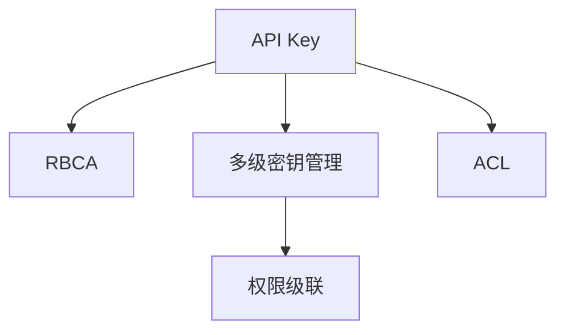

                 

# 分级 API Key 的设置方法

## 1. 背景介绍

### 1.1 问题由来

在当今的互联网环境中，API（应用程序编程接口）已经成为了连接不同系统和服务的重要桥梁。无论是在开发第三方应用、提供云服务，还是在构建企业内部系统，API 都扮演着不可或缺的角色。然而，随着 API 的广泛使用，安全问题变得越来越突出。未经授权的访问、滥用 API 资源等问题不仅会带来严重的业务损失，甚至可能威胁到用户数据的安全。

因此，为了保护 API 资源，API Key 机制被广泛应用。API Key 是一种简单的身份验证方式，通过给每个应用或用户分配唯一的 Key，确保只有经过授权的用户才能访问 API。然而，随着 API 的使用规模不断扩大，单一的 API Key 机制已经难以满足复杂的业务需求。如何在保持安全性的同时，提高 API 的灵活性和扩展性，成为摆在每个开发者和架构师面前的难题。

### 1.2 问题核心关键点

分级 API Key 是一种基于角色的访问控制（Role-Based Access Control, RBAC）机制，通过为不同角色分配不同级别的 API Key，来控制用户对 API 的访问权限。其核心思想是将 API Key 分为多个级别，每个级别对应特定的角色或权限，从而实现细粒度的访问控制。分级 API Key 机制不仅提升了 API 的安全性，还能支持复杂的业务需求，如多用户管理、权限分离、动态控制等。

具体来说，分级 API Key 机制的关键点包括：

- 角色管理：定义不同的角色，每个角色对应一组权限。
- 密钥分配：根据角色的权限分配不同级别的 API Key。
- 权限控制：基于角色进行细粒度的权限控制。
- 审计追踪：记录每个角色的访问行为，方便追踪和审计。

## 2. 核心概念与联系

### 2.1 核心概念概述

为了更好地理解分级 API Key 的原理和架构，本节将介绍几个密切相关的核心概念：

- API Key：API Key 是一种用于身份验证的字符串，用于标识调用 API 的应用或用户。
- RBAC（基于角色的访问控制）：RBAC 是一种常用的访问控制策略，通过定义角色和权限，实现对资源的细粒度控制。
- 多级密钥管理：分级 API Key 机制将 API Key 分为多个级别，每个级别对应特定的角色或权限。
- 权限级联：权限级联是指在高权限用户的基础上，继承和叠加低权限用户的权限。
- 权限控制列表（ACL）：ACL 是一种基于权限的访问控制方式，通过定义一组权限，限制用户对资源的访问。

这些核心概念之间的逻辑关系可以通过以下 Mermaid 流程图来展示：



这个流程图展示了大语言模型的核心概念及其之间的关系：

1. API Key 是身份验证的基础，用于标识调用 API 的应用或用户。
2. RBAC 是一种访问控制策略，定义了角色的权限。
3. 多级密钥管理是将 API Key 分为多个级别，每个级别对应特定的角色或权限。
4. 权限级联是在高权限用户的基础上，继承和叠加低权限用户的权限。
5. ACL 是一种基于权限的访问控制方式，通过定义一组权限，限制用户对资源的访问。

这些核心概念共同构成了分级 API Key 机制的实现基础，使得开发者能够在复杂的业务场景中，灵活地控制 API 的访问权限，提升系统的安全性和灵活性。

## 3. 核心算法原理 & 具体操作步骤
### 3.1 算法原理概述

分级 API Key 机制的核心算法原理基于 RBAC 模型，通过将 API Key 分为多个级别，实现细粒度的访问控制。其基本流程如下：

1. 定义角色：根据业务需求，定义不同角色，并为每个角色分配相应的权限。
2. 分配 API Key：为每个角色分配不同级别的 API Key，用于标识该角色的身份和权限。
3. 权限控制：根据 API Key 的级别，确定用户对资源的访问权限。
4. 权限级联：在高权限用户的基础上，继承和叠加低权限用户的权限。

### 3.2 算法步骤详解

分级 API Key 机制的具体操作步骤如下：

**Step 1: 角色定义**

- 根据业务需求，定义不同的角色，如管理员、普通用户、访客等。
- 为每个角色定义一组权限，如读取、写入、删除等。
- 角色定义的示例代码如下：

```python
class Role:
    def __init__(self, name, permissions):
        self.name = name
        self.permissions = permissions

# 示例角色定义
admin = Role('admin', ['read', 'write', 'delete'])
user = Role('user', ['read', 'write'])
guest = Role('guest', ['read'])
```

**Step 2: API Key 分配**

- 根据角色的权限，分配不同级别的 API Key，每个 API Key 对应一个角色。
- 示例代码如下：

```python
class APIKey:
    def __init__(self, key, role):
        self.key = key
        self.role = role

# 示例 API Key 分配
api_key_1 = APIKey('api_key_1', admin)
api_key_2 = APIKey('api_key_2', user)
api_key_3 = APIKey('api_key_3', guest)
```

**Step 3: 权限控制**

- 在 API 调用时，根据 API Key 的级别，确定用户对资源的访问权限。
- 示例代码如下：

```python
def check_permission(api_key, resource):
    role = api_key.role
    if role == 'admin':
        return True
    elif role == 'user':
        if resource == 'data':
            return True
    elif role == 'guest':
        if resource == 'data':
            return True

# 示例权限控制
api_key = api_key_1
if check_permission(api_key, 'data'):
    print('Access granted')
else:
    print('Access denied')
```

**Step 4: 权限级联**

- 在高权限用户的基础上，继承和叠加低权限用户的权限。
- 示例代码如下：

```python
def merge_permissions(user1, user2):
    permissions = user1.permissions.copy()
    for permission in user2.permissions:
        if permission not in permissions:
            permissions.append(permission)
    return permissions

# 示例权限级联
admin_permissions = admin.permissions
user_permissions = user.permissions
merged_permissions = merge_permissions(admin_permissions, user_permissions)
print(merged_permissions)
```

### 3.3 算法优缺点

分级 API Key 机制具有以下优点：

1. 细粒度控制：分级 API Key 机制可以细粒度地控制用户对资源的访问权限，避免了权限的泛化和滥用。
2. 灵活性高：可以根据业务需求，灵活定义角色和权限，适应不同的业务场景。
3. 安全性高：通过将 API Key 分为多个级别，降低了未经授权访问的风险。
4. 易于维护：分级 API Key 机制简化了权限管理的复杂性，使得权限管理更加直观和易于维护。

同时，分级 API Key 机制也存在一些缺点：

1. 复杂度高：随着业务需求的变化，角色和权限的动态管理需要较高的复杂度。
2. 学习成本高：对初学者来说，分级 API Key 机制的学习成本较高。
3. 性能开销大：对于高并发场景，分级 API Key 机制的性能开销较大，需要优化算法和硬件配置。

### 3.4 算法应用领域

分级 API Key 机制可以广泛应用于各种 API 应用场景，如：

- 第三方应用：通过分级 API Key 机制，可以实现对第三方应用的高效管理和权限控制。
- 云服务：云服务提供商可以利用分级 API Key 机制，对用户进行细粒度的权限管理。
- 企业内部系统：企业内部系统可以通过分级 API Key 机制，实现对内部员工的访问控制。
- 跨平台应用：跨平台应用可以通过分级 API Key 机制，实现不同平台之间的身份认证和权限控制。

除了上述这些常见应用外，分级 API Key 机制还可以创新性地应用到更多场景中，如API 网关、微服务架构、IoT 设备等，为这些领域的系统安全和权限管理提供新的解决方案。

## 4. 数学模型和公式 & 详细讲解 & 举例说明

### 4.1 数学模型构建

分级 API Key 机制的数学模型构建如下：

- 定义角色 $R$ 和权限 $P$，记为 $R = \{r_1, r_2, ..., r_n\}$，$P = \{p_1, p_2, ..., p_m\}$。
- 定义 API Key 与角色的映射关系 $K = \{(k_1, r_1), (k_2, r_2), ..., (k_n, r_n)\}$，其中 $k_i$ 表示 API Key，$r_i$ 表示角色。
- 定义权限控制函数 $f: R \times P \rightarrow \{0, 1\}$，表示角色对权限的控制。

### 4.2 公式推导过程

设 $r$ 表示当前角色，$p$ 表示当前权限，$k$ 表示当前 API Key。根据分级 API Key 机制的权限控制规则，可以推导出如下公式：

$$
\text{Access}(r, p, k) = \bigwedge_{k_i \in K} f(r_i, p)
$$

其中 $\wedge$ 表示逻辑与运算，表示只有当角色 $r_i$ 对权限 $p$ 的控制为 1，API Key $k_i$ 才对权限 $p$ 有访问权限。

### 4.3 案例分析与讲解

以一个简单的示例来说明分级 API Key 机制的应用。

假设一个企业内部系统需要实现细粒度的权限管理，定义了管理员、普通员工和访客三个角色，并为每个角色分配了相应的权限，如读取、写入和删除。

| 角色    | 权限         |
| ------- | ------------ |
| 管理员  | 读取、写入、删除 |
| 普通员工 | 读取、写入    |
| 访客    | 读取         |

根据上述角色和权限的定义，可以设计分级 API Key 的分配策略如下：

| API Key  | 角色    | 权限         |
| -------- | ------- | ------------ |
| admin_key | 管理员  | 读取、写入、删除 |
| user_key  | 普通员工 | 读取、写入    |
| guest_key | 访客    | 读取         |

在实际应用中，当用户使用 API Key 访问某个资源时，系统会根据 API Key 的级别，确定用户的角色和权限，从而实现细粒度的权限控制。例如，当用户使用 admin_key 访问某个资源时，系统会验证 admin_key 对应管理员角色，并检查该角色对资源的权限，判断是否允许访问。

## 5. 项目实践：代码实例和详细解释说明

### 5.1 开发环境搭建

在进行分级 API Key 的实现前，需要先搭建开发环境。以下是使用 Python 进行 Flask 开发的示例环境配置流程：

1. 安装 Python：从官网下载并安装 Python 3.x。
2. 安装 Flask：使用 pip 安装 Flask，示例命令为 `pip install flask`。
3. 创建 Flask 项目：创建一个 Python 文件作为 Flask 应用的入口，示例代码如下：

```python
from flask import Flask

app = Flask(__name__)

@app.route('/')
def hello_world():
    return 'Hello, World!'
```

4. 运行 Flask 应用：使用 Flask 提供的 run() 方法启动应用，示例命令为 `python app.py`。

完成上述步骤后，即可在本地搭建 Flask 应用，开始 API 开发。

### 5.2 源代码详细实现

下面以一个简单的示例来说明如何使用 Flask 实现分级 API Key 机制。

首先，定义角色和权限：

```python
class Role:
    def __init__(self, name, permissions):
        self.name = name
        self.permissions = permissions

# 示例角色定义
admin = Role('admin', ['read', 'write', 'delete'])
user = Role('user', ['read', 'write'])
guest = Role('guest', ['read'])
```

然后，定义 API Key 和权限控制函数：

```python
class APIKey:
    def __init__(self, key, role):
        self.key = key
        self.role = role

def check_permission(api_key, resource):
    role = api_key.role
    if role == 'admin':
        return True
    elif role == 'user':
        if resource == 'data':
            return True
    elif role == 'guest':
        if resource == 'data':
            return True

# 示例 API Key 分配
api_key_1 = APIKey('api_key_1', admin)
api_key_2 = APIKey('api_key_2', user)
api_key_3 = APIKey('api_key_3', guest)
```

最后，定义 Flask 应用，并实现 API 接口：

```python
from flask import Flask, request, jsonify

app = Flask(__name__)

# 定义权限控制
def check_api_permission(api_key):
    role = api_key.role
    if role == 'admin':
        return True
    elif role == 'user':
        if check_permission(api_key, 'data'):
            return True
    elif role == 'guest':
        if check_permission(api_key, 'data'):
            return True

# 定义 API 接口
@app.route('/api/resource', methods=['GET'])
def get_resource():
    api_key = request.headers.get('Authorization')
    if api_key and check_api_permission(APIKey(api_key, admin)):
        # 返回资源数据
        return jsonify({'data': 'Resource data'})
    else:
        return jsonify({'error': 'Access denied'})

if __name__ == '__main__':
    app.run(debug=True)
```

以上代码实现了分级 API Key 机制，其中使用 Flask 框架来封装 HTTP 接口，通过请求头中的 API Key 验证用户的权限，并根据权限控制函数进行细粒度的权限控制。

### 5.3 代码解读与分析

下面是代码中各个部分的详细解读：

**Role 类**：
- `Role` 类定义了角色和权限，每个角色对应一组权限。
- 在示例中，定义了管理员、普通用户和访客三个角色，并为每个角色分配了相应的权限。

**APIKey 类**：
- `APIKey` 类定义了 API Key 与角色的映射关系，每个 API Key 对应一个角色。
- 在示例中，分配了三个 API Key，分别对应管理员、普通用户和访客角色。

**check_permission 函数**：
- `check_permission` 函数用于根据 API Key 的级别，确定用户对资源的访问权限。
- 在示例中，根据 API Key 的级别，判断用户是否对数据资源有访问权限。

**check_api_permission 函数**：
- `check_api_permission` 函数用于根据 API Key 的级别，确定用户对资源的访问权限。
- 在示例中，调用 `check_permission` 函数，判断用户是否对数据资源有访问权限。

**API 接口**：
- `/_api/resource` 接口用于获取资源数据。
- 通过请求头中的 API Key 验证用户的权限，并根据权限控制函数进行细粒度的权限控制。

### 5.4 运行结果展示

启动 Flask 应用，访问 `http://localhost:5000/api/resource`，可以获取到资源数据，示例如下：

```
{
    "data": "Resource data"
}
```

如果访问没有携带 API Key，或携带的 API Key 不合法，则会返回访问被拒绝的错误信息，示例如下：

```
{
    "error": "Access denied"
}
```

## 6. 实际应用场景

### 6.1 智能客服系统

分级 API Key 机制可以应用于智能客服系统的权限管理。智能客服系统需要支持多用户、多渠道的接入，每个用户和渠道的权限可能不同。通过分级 API Key 机制，可以实现对每个用户和渠道的细粒度权限控制，确保系统的安全性。

在实际应用中，可以定义不同的用户和渠道角色，并为每个角色分配相应的权限。例如，管理员可以访问所有客服资源，普通用户只能访问自己负责的资源，访客只能访问公共资源。通过分级 API Key 机制，可以有效地控制每个用户和渠道对客服资源的访问权限，避免未经授权的访问和数据泄露。

### 6.2 金融服务平台

分级 API Key 机制可以应用于金融服务平台的权限管理。金融服务平台需要处理大量的金融数据和交易信息，对数据的安全性和隐私保护要求很高。通过分级 API Key 机制，可以实现对每个用户和渠道的细粒度权限控制，确保数据的机密性和完整性。

在实际应用中，可以定义不同的用户和渠道角色，并为每个角色分配相应的权限。例如，管理员可以访问所有交易数据，普通用户只能访问自己负责的交易数据，访客只能访问公开的交易数据。通过分级 API Key 机制，可以有效地控制每个用户和渠道对交易数据的访问权限，避免数据泄露和滥用。

### 6.3 医疗信息平台

分级 API Key 机制可以应用于医疗信息平台的权限管理。医疗信息平台需要处理大量的病人数据和医疗信息，对数据的隐私保护要求很高。通过分级 API Key 机制，可以实现对每个用户和渠道的细粒度权限控制，确保数据的隐私性和安全性。

在实际应用中，可以定义不同的用户和渠道角色，并为每个角色分配相应的权限。例如，医生可以访问所有病人数据，普通员工只能访问自己负责的病人数据，访客只能访问公开的病人数据。通过分级 API Key 机制，可以有效地控制每个用户和渠道对病人数据的访问权限，避免数据泄露和滥用。

### 6.4 未来应用展望

随着分级 API Key 机制的不断发展和应用，未来将会有更多的创新和突破。以下是对未来发展的展望：

1. 多维度权限控制：分级 API Key 机制可以扩展到更多的维度，如时间、地点、设备等，实现多维度的权限控制。
2. 动态权限管理：分级 API Key 机制可以动态管理用户的权限，根据用户的行为和历史数据，动态调整用户的权限。
3. 权限审计和追踪：分级 API Key 机制可以实现对每个用户的访问行为进行审计和追踪，确保系统的安全性。
4. 多级 API Key 管理：分级 API Key 机制可以扩展到多级 API Key 管理，进一步提高系统的安全性。
5. 分布式权限控制：分级 API Key 机制可以扩展到分布式系统中，实现跨系统的权限控制和访问管理。

## 7. 工具和资源推荐

### 7.1 学习资源推荐

为了帮助开发者系统掌握分级 API Key 机制的理论基础和实践技巧，这里推荐一些优质的学习资源：

1. 《API 安全原理与实践》一书：详细介绍了 API 安全的基础知识和实践方法，包括身份验证、权限控制、认证协议等。
2. Flask 官方文档：Flask 框架的官方文档，提供了完整的 Flask 应用开发指南和 API 设计规范。
3. Flask-RESTful 文档：Flask-RESTful 扩展库的官方文档，提供了 RESTful API 设计的最佳实践和样例代码。
4. 《API 开发实战》一书：深入浅出地介绍了 API 开发的各个环节，包括接口设计、身份验证、权限控制等。
5. GitHub 开源项目：GitHub 上有很多优秀的分级 API Key 机制的实现，可以参考和学习。

通过对这些资源的学习实践，相信你一定能够快速掌握分级 API Key 机制的精髓，并用于解决实际的业务需求。

### 7.2 开发工具推荐

高效的开发离不开优秀的工具支持。以下是几款用于分级 API Key 机制开发的工具：

1. Flask：Python 的轻量级 Web 框架，简单易用，适合快速开发和迭代。
2. Flask-RESTful：Flask 的扩展库，提供 RESTful API 设计的支持，方便实现分级 API Key 机制。
3. API Key 管理工具：如 Keycloak、Okta、Auth0 等，可以方便地管理分级 API Key，实现细粒度权限控制。
4. 权限审计工具：如 Splunk、ELK Stack 等，可以实现对 API Key 的审计和追踪，确保系统的安全性。

合理利用这些工具，可以显著提升分级 API Key 机制的开发效率，加快创新迭代的步伐。

### 7.3 相关论文推荐

分级 API Key 机制的研究源于学界的持续探索。以下是几篇奠基性的相关论文，推荐阅读：

1. "API Key Authentication and Authorization in Cloud Computing"：介绍了 API Key 身份验证和授权的基本原理和实现方法。
2. "RBAC: A Security Model Based on Role"：定义了基于角色的访问控制模型，并介绍了 RBAC 模型的基本概念和实现方法。
3. "API Key Management in Cloud Platforms"：探讨了 API Key 管理的复杂性和挑战，并介绍了多种 API Key 管理的解决方案。
4. "Access Control List (ACL) in Cloud Computing"：介绍了 ACL 访问控制的基本原理和实现方法，并探讨了 ACL 的优缺点。
5. "Fine-Grained Access Control for APIs"：讨论了细粒度访问控制的实现方法，并介绍了几种细粒度访问控制的解决方案。

这些论文代表了大语言模型微调技术的发展脉络。通过学习这些前沿成果，可以帮助研究者把握学科前进方向，激发更多的创新灵感。

## 8. 总结：未来发展趋势与挑战

### 8.1 研究成果总结

本文对分级 API Key 机制进行了全面系统的介绍。首先阐述了分级 API Key 机制的研究背景和意义，明确了其在细粒度权限控制方面的独特价值。其次，从原理到实践，详细讲解了分级 API Key 机制的数学原理和关键步骤，给出了分级 API Key 机制的完整代码实现。同时，本文还广泛探讨了分级 API Key 机制在智能客服、金融服务平台、医疗信息平台等多个行业领域的应用前景，展示了分级 API Key 机制的巨大潜力。此外，本文精选了分级 API Key 机制的学习资源，力求为读者提供全方位的技术指引。

通过本文的系统梳理，可以看到，分级 API Key 机制是一种强大的访问控制机制，能够实现细粒度的权限控制，提升系统的安全性和灵活性。分级 API Key 机制在复杂的业务场景中，提供了有效的解决方案，值得在实际应用中广泛推广。

### 8.2 未来发展趋势

展望未来，分级 API Key 机制将呈现以下几个发展趋势：

1. 多维度权限控制：分级 API Key 机制可以扩展到更多的维度，如时间、地点、设备等，实现多维度的权限控制。
2. 动态权限管理：分级 API Key 机制可以动态管理用户的权限，根据用户的行为和历史数据，动态调整用户的权限。
3. 权限审计和追踪：分级 API Key 机制可以实现对每个用户的访问行为进行审计和追踪，确保系统的安全性。
4. 多级 API Key 管理：分级 API Key 机制可以扩展到多级 API Key 管理，进一步提高系统的安全性。
5. 分布式权限控制：分级 API Key 机制可以扩展到分布式系统中，实现跨系统的权限控制和访问管理。

以上趋势凸显了分级 API Key 机制的广阔前景。这些方向的探索发展，必将进一步提升系统的安全性和灵活性，为未来的业务应用提供更加稳健的保障。

### 8.3 面临的挑战

尽管分级 API Key 机制已经取得了一定的成就，但在迈向更加智能化、普适化应用的过程中，它仍面临诸多挑战：

1. 权限管理复杂度高：随着业务需求的变化，角色和权限的动态管理需要较高的复杂度。
2. 学习成本高：对初学者来说，分级 API Key 机制的学习成本较高。
3. 性能开销大：对于高并发场景，分级 API Key 机制的性能开销较大，需要优化算法和硬件配置。
4. 权限控制细粒度不足：在一些需要极高安全性的场景中，分级 API Key 机制的细粒度控制可能不足。
5. 权限管理复杂度较高：随着系统规模的扩大，权限管理的复杂度会不断增加。

### 8.4 研究展望

面对分级 API Key 机制所面临的挑战，未来的研究需要在以下几个方面寻求新的突破：

1. 探索无监督和半监督权限管理方法：摆脱对大量数据的需求，利用自监督学习、主动学习等无监督和半监督范式，最大限度利用非结构化数据，实现更加灵活高效的权限管理。
2. 研究参数高效和计算高效的权限管理范式：开发更加参数高效的权限管理方法，在固定大部分权限参数的同时，只更新极少量的任务相关参数。同时优化权限管理算法的计算图，减少前向传播和反向传播的资源消耗，实现更加轻量级、实时性的部署。
3. 引入因果和对比学习范式：通过引入因果推断和对比学习思想，增强权限管理模型的建立稳定因果关系的能力，学习更加普适、鲁棒的语言表征，从而提升模型的泛化性和抗干扰能力。
4. 引入更多先验知识：将符号化的先验知识，如知识图谱、逻辑规则等，与神经网络模型进行巧妙融合，引导权限管理过程学习更准确、合理的权限表征。同时加强不同模态数据的整合，实现视觉、语音等多模态信息与文本信息的协同建模。
5. 结合因果分析和博弈论工具：将因果分析方法引入权限管理模型，识别出模型决策的关键特征，增强输出解释的因果性和逻辑性。借助博弈论工具刻画人机交互过程，主动探索并规避模型的脆弱点，提高系统稳定性。
6. 纳入伦理道德约束：在模型训练目标中引入伦理导向的评估指标，过滤和惩罚有偏见、有害的输出倾向。同时加强人工干预和审核，建立模型行为的监管机制，确保输出符合人类价值观和伦理道德。

这些研究方向的探索，必将引领分级 API Key 机制技术迈向更高的台阶，为构建安全、可靠、可解释、可控的智能系统铺平道路。面向未来，分级 API Key 机制还需要与其他人工智能技术进行更深入的融合，如知识表示、因果推理、强化学习等，多路径协同发力，共同推动智能系统的进步。只有勇于创新、敢于突破，才能不断拓展权限管理系统的边界，让智能技术更好地造福人类社会。

## 9. 附录：常见问题与解答

**Q1: 分级 API Key 与传统 API Key 有何区别？**

A: 分级 API Key 与传统 API Key 的最大区别在于细粒度的权限控制。分级 API Key 将 API Key 分为多个级别，每个级别对应特定的角色或权限，实现更细粒度的权限控制。而传统 API Key 通常是单一的，无法实现对不同角色和权限的细粒度控制。

**Q2: 如何设计分级 API Key 的级别和权限？**

A: 设计分级 API Key 的级别和权限需要根据具体业务需求进行。一般建议根据不同的角色和任务，设计多个级别的 API Key，并为每个级别分配相应的权限。例如，管理员、普通用户、访客等。

**Q3: 分级 API Key 机制如何与 RBAC 模型结合？**

A: 分级 API Key 机制与 RBAC 模型结合，可以将角色和权限的映射关系通过 API Key 进行编码，实现细粒度的权限控制。具体来说，通过将 API Key 与角色进行映射，可以将角色的权限信息传递给 API Key，实现基于角色的权限控制。

**Q4: 分级 API Key 机制在分布式系统中的应用场景？**

A: 分级 API Key 机制在分布式系统中也有广泛的应用场景。例如，在微服务架构中，每个服务可以分配不同的 API Key 级别和权限，实现对服务的细粒度控制。在跨平台应用中，通过分级 API Key 机制，可以实现不同平台之间的身份认证和权限控制。

**Q5: 如何优化分级 API Key 机制的性能？**

A: 分级 API Key 机制在高并发场景下，性能开销较大。可以通过优化算法和硬件配置来提高性能。例如，使用缓存机制减少重复计算，使用分布式系统进行负载均衡，使用硬件加速器提高计算效率等。

通过这些问题的回答，相信你能够更好地理解分级 API Key 机制的实现原理和应用场景。希望本文能够为你的学习和实践提供帮助。

