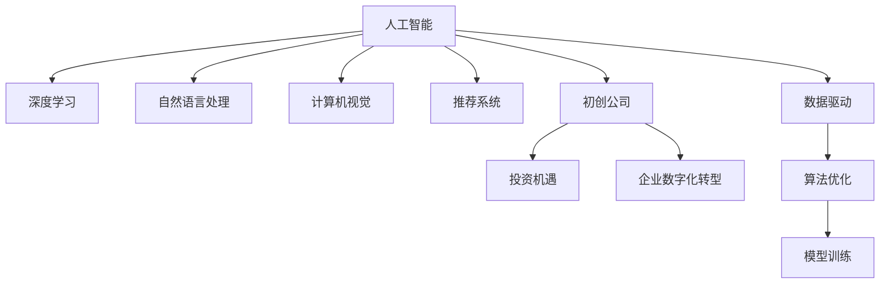

                 

# 创业者在AI浪潮中的机会

> 关键词：人工智能,创业机会,创新技术,企业数字化转型,初创公司,投资机遇,AI创业指南

## 1. 背景介绍

### 1.1 问题由来
近年来，人工智能(AI)技术的迅猛发展已经深刻改变了各行各业的运营模式和市场竞争格局。从深度学习、自然语言处理、计算机视觉等前沿技术，到机器学习、数据挖掘、知识图谱等经典应用，AI正在逐步渗透到生产力的每一个角落。

AI浪潮下的商业机会层出不穷，创业者在面对纷繁复杂的市场变化和竞争压力时，如何抓住机遇，把握趋势，成为了一个亟需解决的重要问题。这篇文章将从核心概念、算法原理、项目实践、实际应用、工具资源和未来展望等多个角度，深入剖析AI浪潮下创业者可以捕捉的诸多机会。

### 1.2 问题核心关键点
面对AI浪潮，创业者可以抓住以下几大核心关键点，作为未来发展的指导方针：

- **创新技术应用**：AI技术的突破性进展，如自然语言处理、计算机视觉、推荐系统等，为创业者提供了诸多创新应用的可能性。
- **企业数字化转型**：AI技术在企业中的应用，如智能客服、智慧工厂、精准营销等，成为提升企业运营效率和市场竞争力的关键。
- **初创公司潜力**：AI创业公司往往能够凭借创新技术和解决方案，迅速占领市场，实现规模化扩展。
- **投资机遇**：AI领域的投资热潮，为创业者提供了充足的资金支持，推动技术创新和商业模式探索。
- **AI创业指南**：了解AI创业的实际操作步骤和成功案例，可以为创业者提供宝贵的经验和指导。

## 2. 核心概念与联系

### 2.1 核心概念概述

为了更好地理解创业者在AI浪潮中面临的机会，本节将介绍几个密切相关的核心概念：

- **人工智能(AI)**：涉及算法、数据、计算等多个方面的综合性技术，旨在通过计算机模拟人类智能行为，实现自动推理、学习和决策。
- **深度学习(Deep Learning)**：利用神经网络模型，通过多层次特征提取和数据拟合，实现模式识别、图像处理、自然语言处理等任务。
- **自然语言处理(NLP)**：涉及文本预处理、语言模型、情感分析、文本生成等技术，使计算机能够理解和处理人类语言。
- **计算机视觉(Computer Vision)**：通过图像处理和模式识别技术，使计算机能够识别和理解视觉信息，广泛应用于智能监控、医学影像分析、自动驾驶等领域。
- **推荐系统(Recommendation Systems)**：通过分析用户行为和偏好，为用户推荐个性化内容或商品，广泛应用于电商、媒体、社交网络等平台。
- **初创公司(Startup)**：指新创立的公司，往往专注于某一领域的创新技术或产品，以快速迭代和市场响应为特点。
- **投资机遇(Investment Opportunities)**：指创业者可以利用AI领域的技术和市场热点，吸引风险投资，推动公司发展。
- **企业数字化转型(Digital Transformation)**：指企业通过引入AI等先进技术，提升运营效率，优化业务流程，实现智能化转型。

这些核心概念之间的逻辑关系可以通过以下Mermaid流程图来展示：



这个流程图展示了一些关键概念之间的联系：

1. AI是核心，通过深度学习、自然语言处理、计算机视觉等技术实现。
2. 初创公司可以基于AI技术进行创新应用，抓住投资机遇。
3. 企业数字化转型通过AI技术提升运营效率。
4. 数据驱动和算法优化是实现AI应用的重要环节。
5. 模型训练是AI技术落地的关键步骤。

## 3. 核心算法原理 & 具体操作步骤
### 3.1 算法原理概述

在AI浪潮中，创业者需要掌握的算法原理主要集中在深度学习、自然语言处理和推荐系统等领域。以下将对这几个核心算法进行概述：

- **深度学习**：通过多层神经网络结构，学习数据中的抽象特征，实现对复杂模式的高效识别和预测。深度学习的核心在于构建多层次的特征表示，通过反向传播算法进行优化。
- **自然语言处理**：涉及文本预处理、语言模型、情感分析、文本生成等技术，使计算机能够理解和处理人类语言。自然语言处理的核心在于构建语言模型，通过序列到序列模型、注意力机制等技术，实现自然语言的理解和生成。
- **推荐系统**：通过分析用户行为和偏好，为用户推荐个性化内容或商品。推荐系统的核心在于构建用户画像，通过协同过滤、矩阵分解、神经网络等技术，实现精准推荐。

创业者需要掌握这些算法的原理和实现细节，以充分利用AI技术的潜力，推动公司的发展。

### 3.2 算法步骤详解

接下来，我们将详细介绍深度学习、自然语言处理和推荐系统的具体操作步骤：

#### 深度学习

**步骤1: 数据准备**：
- 收集并清洗数据，确保数据的质量和多样性。
- 将数据划分为训练集、验证集和测试集。

**步骤2: 模型构建**：
- 选择合适的神经网络结构，如卷积神经网络(CNN)、循环神经网络(RNN)、长短时记忆网络(LSTM)等。
- 定义损失函数和优化器，如交叉熵损失、Adam优化器等。

**步骤3: 模型训练**：
- 使用训练集数据进行模型训练，通过反向传播算法更新模型参数。
- 周期性在验证集上评估模型性能，根据性能指标决定是否触发Early Stopping。
- 重复上述步骤直至满足预设的迭代轮数或Early Stopping条件。

**步骤4: 模型评估**：
- 在测试集上评估模型的泛化能力，使用常见的评估指标如准确率、召回率、F1分数等。
- 根据评估结果调整模型参数，进行进一步训练或调整。

#### 自然语言处理

**步骤1: 数据预处理**：
- 对文本数据进行分词、去除停用词、词干提取等预处理操作。
- 将文本数据转换为模型所需的数值表示，如词嵌入、字符嵌入等。

**步骤2: 语言模型训练**：
- 使用预训练语言模型如BERT、GPT等，进行大规模预训练。
- 在特定任务的数据集上进行微调，如命名实体识别、情感分析、问答系统等。

**步骤3: 模型评估**：
- 使用任务特定的评估指标如精确度、召回率、F1分数等，评估模型的性能。
- 通过与基线模型的比较，判断模型改进的效果。

#### 推荐系统

**步骤1: 数据收集与处理**：
- 收集用户行为数据，如点击、浏览、购买等。
- 将用户行为数据与商品特征数据进行关联，构建用户画像。

**步骤2: 推荐模型训练**：
- 使用协同过滤、矩阵分解、神经网络等技术，构建推荐模型。
- 在训练集上进行模型训练，优化模型参数。

**步骤3: 推荐结果生成**：
- 使用训练好的模型，对新用户和新商品进行推荐。
- 根据推荐结果的用户反馈，进行模型更新和迭代优化。

### 3.3 算法优缺点

深度学习、自然语言处理和推荐系统各有其优缺点：

- **深度学习的优点**：
  - 能够自动提取高层次特征。
  - 适用于复杂模式识别和预测。
  - 应用广泛，如计算机视觉、自然语言处理等。

- **深度学习的缺点**：
  - 模型复杂，需要大量计算资源。
  - 容易出现过拟合，需要大量标注数据。
  - 模型解释性较差，难以理解内部工作机制。

- **自然语言处理的优点**：
  - 能够处理人类语言，实现自动化理解和生成。
  - 适用于情感分析、文本生成等任务。
  - 应用广泛，如智能客服、翻译等。

- **自然语言处理的缺点**：
  - 处理长文本效率较低。
  - 对语言多样性和复杂性处理较弱。
  - 需要大量高质量标注数据。

- **推荐系统的优点**：
  - 能够实现个性化推荐，提升用户体验。
  - 适用于电商、媒体等场景。
  - 模型可解释性强，易于理解。

- **推荐系统的缺点**：
  - 对新用户和商品的推荐效果较差。
  - 对用户行为变化敏感，需要实时更新模型。
  - 数据隐私和安全问题较难解决。

### 3.4 算法应用领域

深度学习、自然语言处理和推荐系统在多个领域都有广泛应用，以下是一些典型的应用场景：

- **深度学习在计算机视觉中的应用**：
  - 图像分类：如识别图像中的物体、场景等。
  - 目标检测：如在图像中定位和标记物体。
  - 人脸识别：如在视频中识别和验证人脸身份。

- **自然语言处理在智能客服中的应用**：
  - 文本分类：如对用户咨询进行主题分类。
  - 情感分析：如分析用户情感倾向。
  - 问答系统：如回答用户提出的具体问题。

- **推荐系统在电商中的应用**：
  - 商品推荐：如根据用户浏览和购买历史推荐商品。
  - 广告推荐：如根据用户兴趣推荐广告。
  - 内容推荐：如推荐新闻、视频等。

## 4. 数学模型和公式 & 详细讲解 & 举例说明

### 4.1 数学模型构建

本节将使用数学语言对深度学习、自然语言处理和推荐系统进行更加严格的刻画。

**深度学习**：
- 假设模型为神经网络，输入为 $x$，输出为 $y$，权重矩阵为 $W$，偏置项为 $b$，激活函数为 $f$。则前向传播过程为：
  $$
  h(x) = f(Wx + b)
  $$
  反向传播过程为：
  $$
  \frac{\partial \mathcal{L}(y, h(x))}{\partial W} = \frac{\partial \mathcal{L}(y, h(x))}{\partial h(x)} \cdot \frac{\partial h(x)}{\partial W}
  $$
  其中 $\mathcal{L}(y, h(x))$ 为损失函数，如均方误差损失、交叉熵损失等。

**自然语言处理**：
- 假设模型为序列到序列模型，输入为 $x$，输出为 $y$，编码器为 $E$，解码器为 $D$。则前向传播过程为：
  $$
  h(x) = E(x)
  $$
  反向传播过程为：
  $$
  \frac{\partial \mathcal{L}(y, h(x))}{\partial E} = \frac{\partial \mathcal{L}(y, D(h(x)))}{\partial D}
  $$

**推荐系统**：
- 假设模型为协同过滤模型，用户为 $U$，商品为 $I$，评分矩阵为 $R$，用户画像向量为 $u$，商品特征向量为 $i$。则模型预测过程为：
  $$
  \hat{r}_{ui} = u^T \cdot i
  $$

### 4.2 公式推导过程

以下我们以深度学习中的卷积神经网络(CNN)为例，推导其前向传播和反向传播的计算公式。

假设输入数据为 $x$，卷积核为 $k$，池化操作为 $p$，激活函数为 $f$，输出数据为 $y$。则前向传播过程为：
$$
h(x) = f(k * x)
$$

其中 $*$ 表示卷积操作，$*$ 表示池化操作。

反向传播过程为：
$$
\frac{\partial \mathcal{L}(y, h(x))}{\partial k} = \frac{\partial \mathcal{L}(y, h(x))}{\partial h(x)} \cdot \frac{\partial h(x)}{\partial k}
$$

其中 $\mathcal{L}(y, h(x))$ 为损失函数，如均方误差损失。

### 4.3 案例分析与讲解

**案例1: 图像分类**：
- 使用卷积神经网络对图像进行分类，将图像输入网络，通过多层次卷积和池化操作提取特征，最后通过全连接层输出分类结果。
- 在训练集上使用交叉熵损失函数进行模型训练，优化器为Adam，学习率为0.001。
- 在验证集上使用混淆矩阵评估模型性能，根据评估结果调整学习率和正则化参数。

**案例2: 情感分析**：
- 使用预训练的BERT模型进行情感分析，将文本输入模型，通过多头注意力机制和池化层提取特征，最后输出情感分类结果。
- 在训练集上使用交叉熵损失函数进行模型训练，优化器为AdamW，学习率为2e-5。
- 在验证集上使用F1分数评估模型性能，根据评估结果调整模型参数和损失函数。

**案例3: 推荐系统**：
- 使用协同过滤模型进行商品推荐，构建用户画像和商品特征矩阵，通过矩阵分解和梯度下降优化模型参数。
- 在训练集上使用均方误差损失函数进行模型训练，优化器为Adagrad，学习率为0.01。
- 在测试集上使用准确率评估模型性能，根据评估结果调整模型参数和用户画像特征。

## 5. 项目实践：代码实例和详细解释说明

### 5.1 开发环境搭建

在进行项目实践前，我们需要准备好开发环境。以下是使用Python进行TensorFlow开发的环境配置流程：

1. 安装Anaconda：从官网下载并安装Anaconda，用于创建独立的Python环境。

2. 创建并激活虚拟环境：
```bash
conda create -n tf-env python=3.8 
conda activate tf-env
```

3. 安装TensorFlow：根据CUDA版本，从官网获取对应的安装命令。例如：
```bash
conda install tensorflow
```

4. 安装各类工具包：
```bash
pip install numpy pandas scikit-learn matplotlib tqdm jupyter notebook ipython
```

完成上述步骤后，即可在`tf-env`环境中开始项目实践。

### 5.2 源代码详细实现

下面我们以图像分类任务为例，给出使用TensorFlow实现卷积神经网络(CNN)的代码实现。

首先，定义CNN模型：

```python
import tensorflow as tf

model = tf.keras.models.Sequential([
    tf.keras.layers.Conv2D(32, (3, 3), activation='relu', input_shape=(28, 28, 1)),
    tf.keras.layers.MaxPooling2D((2, 2)),
    tf.keras.layers.Flatten(),
    tf.keras.layers.Dense(128, activation='relu'),
    tf.keras.layers.Dense(10, activation='softmax')
])
```

接着，定义损失函数和优化器：

```python
loss_fn = tf.keras.losses.SparseCategoricalCrossentropy(from_logits=True)
optimizer = tf.keras.optimizers.Adam(learning_rate=0.001)
```

然后，定义训练和评估函数：

```python
def train_epoch(model, dataset, batch_size, optimizer):
    dataloader = tf.data.Dataset.from_tensor_slices((dataset.images, dataset.labels))
    dataloader = dataloader.shuffle(buffer_size=10000).batch(batch_size).prefetch(tf.data.experimental.AUTOTUNE)
    model.trainable = True
    for batch in dataloader:
        inputs, labels = batch
        with tf.GradientTape() as tape:
            predictions = model(inputs)
            loss = loss_fn(labels, predictions)
        gradients = tape.gradient(loss, model.trainable_variables)
        optimizer.apply_gradients(zip(gradients, model.trainable_variables))

def evaluate(model, dataset, batch_size):
    dataloader = tf.data.Dataset.from_tensor_slices((dataset.images, dataset.labels))
    dataloader = dataloader.batch(batch_size).prefetch(tf.data.experimental.AUTOTUNE)
    model.trainable = False
    correct_predictions = 0
    total_predictions = 0
    for batch in dataloader:
        inputs, labels = batch
        predictions = model(inputs)
        total_predictions += len(labels)
        predictions = tf.argmax(predictions, axis=1)
        correct_predictions += tf.reduce_sum(tf.cast(tf.equal(predictions, labels), tf.float32))
    accuracy = correct_predictions / total_predictions
    return accuracy
```

最后，启动训练流程并在测试集上评估：

```python
epochs = 10
batch_size = 32

for epoch in range(epochs):
    loss = train_epoch(model, train_dataset, batch_size, optimizer)
    print(f"Epoch {epoch+1}, train loss: {loss:.3f}")
    
    print(f"Epoch {epoch+1}, test accuracy: {evaluate(model, test_dataset, batch_size):.3f}")
```

以上就是使用TensorFlow对CNN进行图像分类任务开发的完整代码实现。可以看到，通过TensorFlow提供的高级API，我们可以轻松构建、训练和评估深度学习模型。

### 5.3 代码解读与分析

让我们再详细解读一下关键代码的实现细节：

**Sequential模型定义**：
- 使用Sequential模型定义卷积神经网络的结构，包括卷积层、池化层、全连接层等。
- 在输入层设置图像的形状，如28x28像素，1个通道。
- 在输出层设置分类数，如10个类别。

**损失函数和优化器**：
- 使用SparseCategoricalCrossentropy损失函数，适用于多分类问题。
- 使用Adam优化器，学习率为0.001，自动计算梯度并进行参数更新。

**训练和评估函数**：
- 定义训练函数train_epoch，使用tf.data.Dataset对数据进行批处理和预处理，使用GradientTape自动计算梯度并应用优化器更新参数。
- 定义评估函数evaluate，使用tf.data.Dataset对数据进行批处理和预处理，统计预测正确的样本数和总样本数，计算准确率。

**训练流程**：
- 定义总的epoch数和batch size，开始循环迭代
- 每个epoch内，在训练集上训练，输出平均loss
- 在测试集上评估，输出准确率

可以看到，TensorFlow提供了丰富的API和工具，使得深度学习模型的开发和调试变得非常方便。开发者可以根据任务需求，灵活设计模型的结构和训练流程，快速迭代出高性能的模型。

当然，工业级的系统实现还需考虑更多因素，如模型的保存和部署、超参数的自动搜索、更灵活的任务适配层等。但核心的项目实践流程基本与此类似。

## 6. 实际应用场景

### 6.1 智能客服系统

基于深度学习的智能客服系统，可以广泛应用于各种客户服务场景。传统客服往往需要配备大量人力，高峰期响应缓慢，且服务质量难以保证。而使用深度学习技术构建的智能客服系统，可以7x24小时不间断服务，快速响应客户咨询，用自然流畅的语言解答各类常见问题。

在技术实现上，可以收集企业内部的历史客服对话记录，将问题和最佳答复构建成监督数据，在此基础上对深度学习模型进行训练。训练后的模型能够自动理解用户意图，匹配最合适的答案模板进行回复。对于客户提出的新问题，还可以接入检索系统实时搜索相关内容，动态组织生成回答。如此构建的智能客服系统，能大幅提升客户咨询体验和问题解决效率。

### 6.2 金融舆情监测

金融机构需要实时监测市场舆论动向，以便及时应对负面信息传播，规避金融风险。传统的人工监测方式成本高、效率低，难以应对网络时代海量信息爆发的挑战。基于深度学习的文本分类和情感分析技术，为金融舆情监测提供了新的解决方案。

具体而言，可以收集金融领域相关的新闻、报道、评论等文本数据，并对其进行情感标注。在此基础上对深度学习模型进行训练，使其能够自动判断文本属于何种情感，如正面、负面或中性。将训练后的模型应用到实时抓取的网络文本数据，就能够自动监测不同情感倾向的变化趋势，一旦发现负面信息激增等异常情况，系统便会自动预警，帮助金融机构快速应对潜在风险。

### 6.3 个性化推荐系统

当前的推荐系统往往只依赖用户的历史行为数据进行物品推荐，无法深入理解用户的真实兴趣偏好。基于深度学习的推荐系统可以更好地挖掘用户行为背后的语义信息，从而提供更精准、多样的推荐内容。

在实践中，可以收集用户浏览、点击、评论、分享等行为数据，提取和用户交互的物品标题、描述、标签等文本内容。将文本内容作为模型输入，用户的后续行为（如是否点击、购买等）作为监督信号，在此基础上对深度学习模型进行训练。训练后的模型能够从文本内容中准确把握用户的兴趣点。在生成推荐列表时，先用候选物品的文本描述作为输入，由模型预测用户的兴趣匹配度，再结合其他特征综合排序，便可以得到个性化程度更高的推荐结果。

### 6.4 未来应用展望

随着深度学习技术的不断发展，基于深度学习的AI应用将在更多领域得到应用，为传统行业带来变革性影响。

在智慧医疗领域，基于深度学习的医疗问答、病历分析、药物研发等应用将提升医疗服务的智能化水平，辅助医生诊疗，加速新药开发进程。

在智能教育领域，深度学习技术可应用于作业批改、学情分析、知识推荐等方面，因材施教，促进教育公平，提高教学质量。

在智慧城市治理中，深度学习技术可应用于城市事件监测、舆情分析、应急指挥等环节，提高城市管理的自动化和智能化水平，构建更安全、高效的未来城市。

此外，在企业生产、社会治理、文娱传媒等众多领域，基于深度学习的AI应用也将不断涌现，为经济社会发展注入新的动力。相信随着技术的日益成熟，深度学习技术必将逐步成为各行业的核心竞争力，推动人工智能技术向更广泛的应用领域发展。

## 7. 工具和资源推荐
### 7.1 学习资源推荐

为了帮助创业者系统掌握深度学习理论基础和实践技巧，这里推荐一些优质的学习资源：

1. 《深度学习》书籍：深度学习领域的经典教材，由Yoshua Bengio、Ian Goodfellow、Aaron Courville等作者共同编写，全面介绍了深度学习的基本概念、模型和算法。

2. Coursera《深度学习专项课程》：由Andrew Ng教授讲授的深度学习入门课程，包括5门课程，涵盖深度学习的基础理论和实践应用。

3. DeepLearning.AI《深度学习基础》课程：由李宏毅教授讲授的深度学习课程，深入浅出地介绍了深度学习的基本框架和常用技术。

4. TensorFlow官方文档：TensorFlow的官方文档，提供了丰富的API和工具，帮助开发者快速上手深度学习开发。

5. PyTorch官方文档：PyTorch的官方文档，提供了强大的动态计算图，支持灵活的模型构建和调试。

通过对这些资源的学习实践，相信你一定能够快速掌握深度学习的精髓，并用于解决实际的AI问题。

### 7.2 开发工具推荐

高效的开发离不开优秀的工具支持。以下是几款用于深度学习开发的常用工具：

1. TensorFlow：由Google主导开发的开源深度学习框架，生产部署方便，适合大规模工程应用。

2. PyTorch：基于Python的开源深度学习框架，灵活动态的计算图，适合快速迭代研究。

3. Keras：基于TensorFlow和Theano的高级API，简化深度学习模型的构建和调试。

4. Jupyter Notebook：免费的交互式编程环境，支持Python、R、JavaScript等多种语言，适合数据科学和机器学习开发。

5. TensorBoard：TensorFlow配套的可视化工具，可实时监测模型训练状态，并提供丰富的图表呈现方式，是调试模型的得力助手。

6. Weights & Biases：模型训练的实验跟踪工具，可以记录和可视化模型训练过程中的各项指标，方便对比和调优。

合理利用这些工具，可以显著提升深度学习模型的开发效率，加快创新迭代的步伐。

### 7.3 相关论文推荐

深度学习的发展离不开学界的持续研究。以下是几篇奠基性的相关论文，推荐阅读：

1. ImageNet Classification with Deep Convolutional Neural Networks（ImageNet大规模视觉识别挑战赛的获胜者论文）：提出了卷积神经网络（CNN）的结构，取得了图像分类任务的SOTA。

2. AlexNet: One Million Tiny Images for Training Deep Neural Networks（ImageNet大规模视觉识别挑战赛的获胜者论文）：引入了数据增强和多层卷积结构，显著提升了图像分类的精度。

3. Deep Residual Learning for Image Recognition（ImageNet大规模视觉识别挑战赛的获胜者论文）：提出了残差网络（ResNet）的结构，解决了深度网络训练中的梯度消失问题。

4. Rethinking the Inception Architecture for Computer Vision（ImageNet大规模视觉识别挑战赛的获胜者论文）：提出了Inception模块和全局平均池化等技术，提升了卷积神经网络的结构效率。

5. Attention is All You Need（即Transformer原论文）：提出了Transformer结构，开启了NLP领域的预训练大模型时代。

这些论文代表了大模型和深度学习技术的发展脉络。通过学习这些前沿成果，可以帮助研究者把握学科前进方向，激发更多的创新灵感。

## 8. 总结：未来发展趋势与挑战

### 8.1 总结

本文对基于深度学习的AI浪潮下创业者可以捕捉的诸多机会进行了全面系统的介绍。首先阐述了深度学习、自然语言处理和推荐系统的发展背景和意义，明确了这些技术在AI创业中的应用潜力。其次，从原理到实践，详细讲解了深度学习的数学模型和操作步骤，给出了深度学习项目开发的完整代码实例。同时，本文还广泛探讨了深度学习技术在智能客服、金融舆情、个性化推荐等多个行业领域的应用前景，展示了深度学习技术的巨大潜力。

通过本文的系统梳理，可以看到，基于深度学习的AI技术在各行各业都有广阔的应用前景，为创业者提供了丰富的商业机会。深度学习、自然语言处理和推荐系统等技术的发展，正在逐步改变生产力的各个角落，深刻影响着人类的生产生活方式。

### 8.2 未来发展趋势

展望未来，深度学习技术的发展趋势如下：

1. 模型规模持续增大。随着算力成本的下降和数据规模的扩张，深度学习模型的参数量还将持续增长。超大规模模型蕴含的丰富特征，将带来更强的表达能力和泛化性能。

2. 深度学习范式多样化。除了传统的前馈神经网络，未来将涌现更多深度学习范式，如残差网络、注意力机制、自注意力机制等，进一步提升模型的结构效率和性能。

3. 数据增强技术普及。数据增强技术如数据扩充、对抗生成、迁移学习等，将帮助模型更好地适应多样化的数据分布，提升模型的泛化能力。

4. 无监督学习和半监督学习发展。无监督学习和半监督学习技术，如自监督预训练、对比学习、生成对抗网络等，将减少对大量标注数据的依赖，推动深度学习模型的普及应用。

5. 跨领域知识整合能力提升。未来深度学习模型将能够更好地整合不同模态的信息，如文本、图像、音频等，实现更全面的信息理解和生成。

6. 模型解释性和鲁棒性增强。未来深度学习模型将更加注重可解释性和鲁棒性，提高模型输出的透明度和可信度。

以上趋势凸显了深度学习技术的广阔前景。这些方向的探索发展，必将进一步提升深度学习模型的性能和应用范围，为人类认知智能的进化带来深远影响。

### 8.3 面临的挑战

尽管深度学习技术已经取得了显著的成果，但在迈向更加智能化、普适化应用的过程中，它仍面临诸多挑战：

1. 模型计算资源消耗大。深度学习模型的训练和推理需要大量的计算资源，如GPU、TPU等高性能设备。这将对企业带来较高的成本压力。

2. 模型泛化能力有限。深度学习模型往往容易出现过拟合现象，对新数据和新任务的表现不稳定。如何提升模型的泛化能力，仍是重要的研究课题。

3. 数据隐私和安全问题。深度学习模型的训练需要大量的数据，涉及用户隐私和安全问题。如何保护用户数据隐私，防止数据滥用，是应用深度学习技术的重要前提。

4. 模型解释性和可控性不足。深度学习模型通常被视为"黑盒"系统，难以解释其内部工作机制和决策逻辑。如何提高模型的可解释性和可控性，仍需更多的理论和实践探索。

5. 技术壁垒和人才缺口。深度学习技术的应用需要具备丰富的理论和实践经验，但目前相关人才较为稀缺。如何培养和吸引更多的深度学习人才，是推广深度学习技术的重要挑战。

6. 算法伦理和法律风险。深度学习技术的应用可能带来算法伦理和法律风险，如算法偏见、数据歧视等。如何制定合理的伦理和法律规范，确保深度学习技术的安全和公正应用，也是未来的重要课题。

### 8.4 研究展望

面对深度学习技术所面临的挑战，未来的研究需要在以下几个方面寻求新的突破：

1. 探索无监督和半监督深度学习技术。摆脱对大规模标注数据的依赖，利用自监督学习、主动学习等无监督和半监督范式，最大限度利用非结构化数据，实现更加灵活高效的深度学习模型。

2. 研究参数高效和计算高效的深度学习范式。开发更加参数高效的深度学习模型，在固定大部分预训练参数的同时，只更新极少量的任务相关参数。同时优化深度学习模型的计算图，减少前向传播和反向传播的资源消耗，实现更加轻量级、实时性的部署。

3. 融合因果分析和博弈论工具。将因果分析方法引入深度学习模型，识别出模型决策的关键特征，增强输出解释的因果性和逻辑性。借助博弈论工具刻画人机交互过程，主动探索并规避模型的脆弱点，提高系统稳定性。

4. 纳入伦理道德约束。在深度学习模型训练目标中引入伦理导向的评估指标，过滤和惩罚有偏见、有害的输出倾向。同时加强人工干预和审核，建立模型行为的监管机制，确保输出符合人类价值观和伦理道德。

这些研究方向的探索，必将引领深度学习技术迈向更高的台阶，为构建安全、可靠、可解释、可控的智能系统铺平道路。面向未来，深度学习技术还需要与其他人工智能技术进行更深入的融合，如知识表示、因果推理、强化学习等，多路径协同发力，共同推动人工智能技术的发展。只有勇于创新、敢于突破，才能不断拓展深度学习技术的边界，让智能技术更好地造福人类社会。

## 9. 附录：常见问题与解答

**Q1：深度学习在哪些领域有应用？**

A: 深度学习在图像识别、自然语言处理、语音识别、推荐系统等领域有广泛应用。图像识别方面，可以应用于物体识别、人脸识别、图像分类等任务；自然语言处理方面，可以应用于文本分类、情感分析、机器翻译等任务；语音识别方面，可以应用于语音识别、说话人识别、语音合成等任务；推荐系统方面，可以应用于电商、媒体、社交网络等平台。

**Q2：如何选择合适的深度学习模型？**

A: 选择合适的深度学习模型需要根据具体任务的特点和需求进行评估。常见的模型包括卷积神经网络(CNN)、循环神经网络(RNN)、长短时记忆网络(LSTM)、注意力机制模型等。对于图像分类任务，可以使用CNN；对于序列预测任务，可以使用RNN或LSTM；对于自然语言处理任务，可以使用注意力机制模型。同时，可以使用现有的预训练模型，如BERT、GPT等，进行微调，以提升模型性能。

**Q3：深度学习的训练需要哪些资源？**

A: 深度学习的训练需要高性能计算资源，如GPU、TPU等。同时需要充足的标注数据和计算时间。在实际训练过程中，还需要考虑模型的超参数优化、数据增强、正则化等技术，以提升模型的泛化能力和性能。

**Q4：如何提高深度学习的泛化能力？**

A: 提高深度学习的泛化能力，可以从以下几个方面入手：
1. 增加数据多样性，使用数据增强技术，如数据扩充、对抗生成等。
2. 使用正则化技术，如L2正则、Dropout等，避免过拟合。
3. 使用迁移学习，将预训练模型的知识迁移到新任务上，减少训练时间和资源消耗。
4. 使用无监督学习和半监督学习技术，如自监督预训练、对比学习等，减少对标注数据的依赖。
5. 使用模型集成技术，如Bagging、Boosting等，提升模型的鲁棒性和泛化能力。

**Q5：如何保护用户数据隐私？**

A: 保护用户数据隐私，可以从以下几个方面入手：
1. 使用匿名化技术，对用户数据进行去标识化处理。
2. 使用数据加密技术，对用户数据进行加密保护。
3. 使用差分隐私技术，在数据处理过程中引入噪声，保护用户隐私。
4. 使用联邦学习技术，在模型训练过程中，不将数据上传至中央服务器，保护用户数据隐私。

通过对这些问题的解答，可以帮助创业者更好地理解和应用深度学习技术，推动AI技术在各行业中的应用和普及。

---

作者：禅与计算机程序设计艺术 / Zen and the Art of Computer Programming

