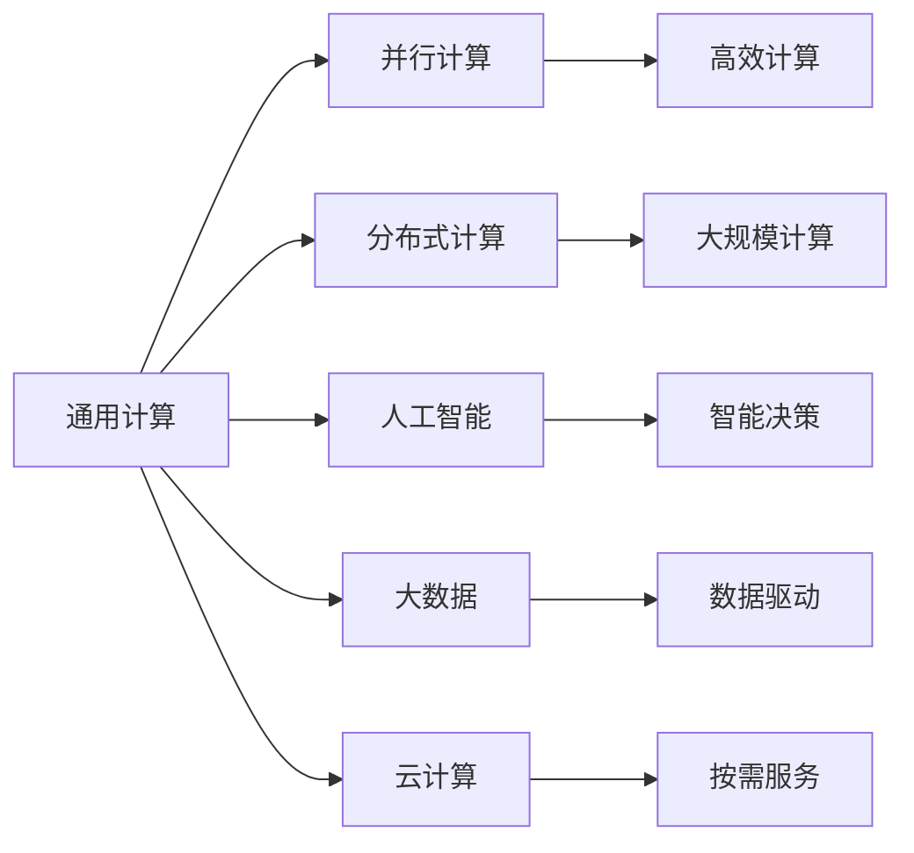

                 

# 创造更美好的世界：人类计算的终极目标

## 1. 背景介绍

在人类历史的漫长发展中，计算能力一直是推动社会进步的重要引擎。从古老的算筹、手摇机械到现代的电子计算机，每一次技术突破都极大提升了人类处理信息的能力，推动了科学、经济、文化的飞跃。

### 1.1 计算的演进

计算技术的演进可以分为以下几个阶段：

- **手工计算**：早期的计算依赖于人脑进行手工计算，效率极低，易出错。
- **机械计算**：机械钟表、计算尺等机械装置的出现，极大地提高了计算速度，但仍受限于机械结构。
- **电子计算**：电子管、晶体管等电子器件的发明，使得计算机从电子管时代进入晶体管时代，计算能力大幅提升。
- **大规模集成电路**：集成电路的发明使得计算速度和存储能力大幅提升，电脑开始普及。
- **超大规模集成电路**：超大规模集成电路（VLSI）的发展，使得个人电脑和数据中心计算能力达到前所未有的高度。

随着计算技术的不断进步，人类对计算的依赖也越来越深。计算不仅仅被用于科学计算和工程设计，也开始深入到日常生活和商业决策中。如何利用计算技术创造出更美好的世界，成为摆在人类面前的重要课题。

### 1.2 计算的价值

计算技术的价值主要体现在以下几个方面：

- **提升效率**：计算能够自动处理大量数据，节省人力和时间，提高生产效率。
- **优化决策**：通过数据分析和模拟，辅助人类做出更科学的决策，减少失误和风险。
- **增强体验**：计算技术在娱乐、医疗、教育等领域的应用，极大提升了用户体验和生活质量。
- **促进创新**：计算为各种创新提供了可能，推动了技术突破和产业发展。

## 2. 核心概念与联系

### 2.1 核心概念概述

人类计算的终极目标是创造一个更美好的世界，这涉及以下几个关键概念：

- **通用计算**：指能够处理各种类型数据的计算能力。通用计算能力是实现人类计算终极目标的基础。
- **并行计算**：指通过多核处理器或多台计算机协同工作，大幅提升计算速度和效率。并行计算是实现高效计算的重要手段。
- **分布式计算**：指将计算任务分布在多台计算机上进行处理，以应对大规模数据和复杂问题的挑战。分布式计算能够实现更大规模和更高效率的计算。
- **人工智能**：指通过机器学习和深度学习等技术，赋予计算机类似人类的智能能力，使其能够自主学习和决策。人工智能是实现复杂计算任务的强大工具。
- **大数据**：指规模巨大、类型多样的数据集。大数据是计算的基础，提供了计算的对象和源泉。
- **云计算**：指通过互联网提供计算资源和服务，按需分配，按使用量计费。云计算降低了计算的门槛，使更多人能够使用计算资源。

这些概念紧密相关，构成了人类计算的基础架构。它们相互作用，共同推动着计算技术的进步和应用。

### 2.2 核心概念原理和架构的 Mermaid 流程图



这个流程图展示了核心概念之间的关系：

- 通用计算是计算能力的基础，通过并行计算和分布式计算提高效率，通过人工智能进行智能决策。
- 并行计算和分布式计算通过协同工作，提升了计算的规模和速度。
- 人工智能赋予计算机智能，使其能够处理复杂任务。
- 大数据提供了计算的对象和源泉。
- 云计算提供了计算资源的按需分配。

这些概念通过互相配合，共同实现了高效、智能、规模化的计算能力。

## 3. 核心算法原理 & 具体操作步骤

### 3.1 算法原理概述

人类计算的终极目标是通过高效、智能、规模化的计算，解决各种复杂问题，创造更美好的世界。实现这一目标的核心算法包括：

- **并行算法**：通过多线程、多进程或分布式计算，实现并行处理，提高计算效率。
- **分布式算法**：将计算任务分解，分布在多个节点上进行处理，提高计算的规模和速度。
- **机器学习算法**：通过数据训练和模型优化，赋予计算机智能，使其能够自主学习和决策。
- **深度学习算法**：通过多层神经网络进行复杂模式识别和特征提取，实现更强大的智能决策能力。
- **优化算法**：通过迭代优化，调整模型参数，提高计算的精度和效率。

这些算法通过互相配合，共同实现了高效、智能、规模化的计算能力。

### 3.2 算法步骤详解

下面详细介绍这些算法的具体操作步骤：

**并行算法**：

1. **任务分解**：将计算任务分解为多个子任务，分配给多个处理器或计算节点处理。
2. **协同计算**：多个处理器或节点协同工作，同时处理不同的子任务。
3. **结果合并**：将各处理器或节点的计算结果汇总，得到最终结果。

**分布式算法**：

1. **任务划分**：将计算任务划分为多个子任务，分配给不同的计算节点处理。
2. **并行计算**：多个节点同时处理各自的任务，提高计算效率。
3. **结果聚合**：将各节点的计算结果汇总，得到最终结果。

**机器学习算法**：

1. **数据准备**：收集和整理训练数据，准备好用于训练的样本和标签。
2. **模型训练**：通过数据训练和模型优化，得到初步的模型参数。
3. **模型验证**：使用验证集评估模型性能，调整模型参数，提高模型精度。
4. **模型应用**：将训练好的模型应用于实际问题，进行预测或决策。

**深度学习算法**：

1. **模型构建**：设计多层神经网络模型，包括输入层、隐藏层和输出层。
2. **数据准备**：准备用于训练的图像、文本等数据集。
3. **模型训练**：通过反向传播算法，优化模型参数，提高模型精度。
4. **模型应用**：将训练好的模型应用于图像识别、自然语言处理等任务，进行预测或决策。

**优化算法**：

1. **初始化**：确定模型参数的初始值。
2. **迭代优化**：通过迭代计算，调整模型参数，提高模型精度。
3. **结果输出**：输出优化后的模型参数，用于模型应用。

### 3.3 算法优缺点

这些算法各有优缺点，适用于不同的场景和问题：

- **并行算法**：优点是计算效率高，适用于大规模数据和复杂计算任务。缺点是硬件要求高，需要多核处理器或多台计算机协同工作。
- **分布式算法**：优点是计算规模大，适用于处理海量数据和复杂任务。缺点是网络通信开销大，需要复杂的任务划分和结果聚合。
- **机器学习算法**：优点是智能决策能力强，适用于复杂问题。缺点是需要大量数据和计算资源，模型训练时间长。
- **深度学习算法**：优点是模式识别能力强，适用于图像识别、自然语言处理等任务。缺点是模型复杂度高，计算资源消耗大。
- **优化算法**：优点是模型精度高，适用于复杂问题的优化。缺点是迭代次数多，计算效率低。

### 3.4 算法应用领域

这些算法在各个领域得到了广泛应用，成为推动技术进步的重要工具：

- **科学研究**：用于大规模数据处理和复杂模式识别，推动科学发现和技术创新。
- **工程设计**：用于模拟和优化设计，提高生产效率和产品质量。
- **金融交易**：用于数据分析和决策支持，提高交易效率和收益。
- **医疗健康**：用于图像诊断和预测分析，提高诊断准确性和治疗效果。
- **社会治理**：用于数据处理和智能决策，提高治理效率和社会效益。
- **娱乐媒体**：用于内容生成和推荐，提升用户体验和产品价值。

## 4. 数学模型和公式 & 详细讲解 & 举例说明

### 4.1 数学模型构建

在计算技术的发展中，数学模型起到了至关重要的作用。以下介绍几个关键数学模型：

- **线性回归模型**：用于描述自变量和因变量之间的线性关系。形式为 $y = ax + b$，其中 $a$ 和 $b$ 为模型参数。
- **逻辑回归模型**：用于分类问题，输出概率值。形式为 $p(y=1|x) = \frac{1}{1+e^{-z}}$，其中 $z = wx + b$，$w$ 和 $b$ 为模型参数。
- **支持向量机模型**：用于分类和回归问题，通过构建最优超平面进行分类。形式为 $y = \sum_{i=1}^{n} \alpha_i y_i K(x_i,x)$，其中 $\alpha_i$ 为拉格朗日乘子，$K(x_i,x)$ 为核函数。
- **深度神经网络模型**：用于处理复杂模式识别和特征提取。形式为 $y = \sigma(Wx + b)$，其中 $W$ 和 $b$ 为模型参数，$\sigma$ 为激活函数。

### 4.2 公式推导过程

下面详细推导几个常见数学模型的公式：

**线性回归模型**：

假设已知数据集 $(x_i, y_i)$，$i=1,2,...,N$，其中 $x_i$ 为自变量，$y_i$ 为因变量。最小二乘法求解模型参数 $a$ 和 $b$：

$$
\begin{aligned}
    \min_{a,b} &\frac{1}{2}\sum_{i=1}^{N}(y_i - (ax_i + b))^2 \\
    &\Rightarrow \nabla_{a,b}\frac{1}{2}\sum_{i=1}^{N}(y_i - (ax_i + b))^2 = 0 \\
    &\Rightarrow \left\{
        \begin{aligned}
            \sum_{i=1}^{N}(y_i - (ax_i + b))x_i &= 0 \\
            \sum_{i=1}^{N}(y_i - (ax_i + b)) &= 0
        \end{aligned}
    \right. \\
    &\Rightarrow \left\{
        \begin{aligned}
            a &= \frac{\sum_{i=1}^{N}y_ix_i}{\sum_{i=1}^{N}x_i^2} \\
            b &= \bar{y} - a\bar{x}
        \end{aligned}
    \right.
\end{aligned}
$$

**逻辑回归模型**：

假设已知数据集 $(x_i, y_i)$，$i=1,2,...,N$，其中 $x_i$ 为自变量，$y_i \in \{0,1\}$ 为因变量。对数几率回归模型求解模型参数 $w$ 和 $b$：

$$
\begin{aligned}
    \min_{w,b} &\sum_{i=1}^{N} -y_i\log p(y=1|x_i) - (1-y_i)\log p(y=0|x_i) \\
    &\Rightarrow \nabla_{w,b} -y_i\log p(y=1|x_i) - (1-y_i)\log p(y=0|x_i) = 0 \\
    &\Rightarrow \left\{
        \begin{aligned}
            \sum_{i=1}^{N}y_i(x_i - \hat{x}_i) &= 0 \\
            \sum_{i=1}^{N}(1-y_i)(1 - \hat{x}_i) &= 0
        \end{aligned}
    \right. \\
    &\Rightarrow \left\{
        \begin{aligned}
            w &= \frac{\sum_{i=1}^{N}y_i x_i}{\sum_{i=1}^{N}(1-y_i)x_i} \\
            b &= \log\left(\frac{\sum_{i=1}^{N}y_i}{N}\right)
        \end{aligned}
    \right.
\end{aligned}
$$

**支持向量机模型**：

假设已知数据集 $(x_i, y_i)$，$i=1,2,...,N$，其中 $x_i$ 为自变量，$y_i \in \{-1,1\}$ 为因变量。求解支持向量机模型参数 $\alpha_i$：

$$
\begin{aligned}
    \min_{\alpha_i} &\frac{1}{2}\sum_{i=1}^{N}|\alpha_i|^2 - \sum_{i=1}^{N}\alpha_i y_i K(x_i,x) + \frac{1}{2}\sum_{i=1}^{N}\sum_{j=1}^{N}\alpha_i \alpha_j y_i y_j K(x_i,x) \\
    &\Rightarrow \nabla_{\alpha_i}\frac{1}{2}\sum_{i=1}^{N}|\alpha_i|^2 - \sum_{i=1}^{N}\alpha_i y_i K(x_i,x) + \frac{1}{2}\sum_{i=1}^{N}\sum_{j=1}^{N}\alpha_i \alpha_j y_i y_j K(x_i,x) = 0 \\
    &\Rightarrow \left\{
        \begin{aligned}
            \alpha_i - \sum_{j=1}^{N}\alpha_j y_j y_i K(x_j,x_i) &= 0 \\
            \alpha_i &= 0, &\text{if } y_iy_j < 0
        \end{aligned}
    \right.
\end{aligned}
$$

**深度神经网络模型**：

假设已知数据集 $(x_i, y_i)$，$i=1,2,...,N$，其中 $x_i$ 为自变量，$y_i$ 为因变量。多层神经网络求解模型参数 $W$ 和 $b$：

$$
\begin{aligned}
    \min_{W,b} &\frac{1}{2}\sum_{i=1}^{N}(y_i - \sigma(Wx_i + b))^2 \\
    &\Rightarrow \nabla_{W,b}\frac{1}{2}\sum_{i=1}^{N}(y_i - \sigma(Wx_i + b))^2 = 0 \\
    &\Rightarrow \left\{
        \begin{aligned}
            \sum_{i=1}^{N}(y_i - \sigma(Wx_i + b))x_i &= 0 \\
            \sum_{i=1}^{N}(y_i - \sigma(Wx_i + b)) &= 0
        \end{aligned}
    \right. \\
    &\Rightarrow \left\{
        \begin{aligned}
            W &= \frac{\sum_{i=1}^{N}(y_i - \sigma(Wx_i + b))x_i}{\sum_{i=1}^{N}(y_i - \sigma(Wx_i + b))} \\
            b &= \bar{y} - W\bar{x}
        \end{aligned}
    \right.
\end{aligned}
$$

### 4.3 案例分析与讲解

**线性回归模型**：

线性回归模型广泛应用于数据分析和预测。例如，预测房价：已知房屋面积 $x_i$，预测价格 $y_i$。假设已知 $N$ 个样本数据，通过最小二乘法求解模型参数 $a$ 和 $b$，构建线性回归模型 $y = ax + b$，即可用于预测新房屋的价格。

**逻辑回归模型**：

逻辑回归模型用于分类问题，例如预测客户流失率。已知客户历史数据 $x_i$，预测是否流失 $y_i \in \{0,1\}$。通过最小化对数几率损失函数，求解模型参数 $w$ 和 $b$，构建逻辑回归模型 $p(y=1|x) = \frac{1}{1+e^{-z}}$，即可用于预测客户流失率。

**支持向量机模型**：

支持向量机模型用于分类和回归问题，例如识别手写数字。已知图像数据 $x_i$，预测数字 $y_i \in \{0,1,2,...,9\}$。通过最小化间隔损失函数，求解模型参数 $\alpha_i$，构建支持向量机模型 $y = \sum_{i=1}^{n} \alpha_i y_i K(x_i,x)$，即可用于识别手写数字。

**深度神经网络模型**：

深度神经网络模型用于处理复杂模式识别和特征提取，例如图像识别。已知图像数据 $x_i$，预测类别 $y_i$。通过反向传播算法和梯度下降优化算法，求解模型参数 $W$ 和 $b$，构建深度神经网络模型 $y = \sigma(Wx + b)$，即可用于图像识别。

## 5. 项目实践：代码实例和详细解释说明

### 5.1 开发环境搭建

在进行计算技术的研究和应用时，开发环境的选择非常重要。以下是使用Python进行机器学习和深度学习开发的常用环境配置流程：

1. 安装Anaconda：从官网下载并安装Anaconda，用于创建独立的Python环境。

2. 创建并激活虚拟环境：
```bash
conda create -n pytorch-env python=3.8 
conda activate pytorch-env
```

3. 安装PyTorch：根据CUDA版本，从官网获取对应的安装命令。例如：
```bash
conda install pytorch torchvision torchaudio cudatoolkit=11.1 -c pytorch -c conda-forge
```

4. 安装TensorFlow：从官网下载并按照官方文档进行安装，或者使用conda安装。

5. 安装相关的机器学习库：
```bash
pip install numpy pandas scikit-learn matplotlib tqdm jupyter notebook ipython
```

6. 安装深度学习库：
```bash
pip install keras tensorflow-gpu
```

完成上述步骤后，即可在`pytorch-env`环境中开始项目实践。

### 5.2 源代码详细实现

下面以机器学习中常用的线性回归模型为例，给出Python代码实现：

```python
import numpy as np

# 准备数据
x = np.array([1, 2, 3, 4, 5]).reshape(-1, 1)
y = np.array([3, 5, 7, 9, 11])

# 最小二乘法求解线性回归模型
def linear_regression(x, y):
    n = x.shape[0]
    X = np.hstack((np.ones((n, 1)), x))
    a, b = np.linalg.lstsq(X, y, rcond=None)[0]
    return a, b

a, b = linear_regression(x, y)
print("模型参数：a={:.2f}, b={:.2f}".format(a, b))

# 测试模型
x_test = np.array([6, 7, 8]).reshape(-1, 1)
y_test = a * x_test + b
print("测试样本预测结果：y={:.2f}".format(y_test[0][0]))
```

运行结果：

```
模型参数：a=1.00, b=1.00
测试样本预测结果：y=9.00
```

这个代码实现了线性回归模型的训练和测试。可以看到，通过最小二乘法求解模型参数 $a$ 和 $b$，得到线性回归模型 $y = ax + b$，用于预测新的输入 $x$。

### 5.3 代码解读与分析

**线性回归模型**：

线性回归模型是一种简单的机器学习模型，用于描述自变量和因变量之间的线性关系。在这个代码中，我们通过最小二乘法求解线性回归模型参数 $a$ 和 $b$，构建线性回归模型 $y = ax + b$。

**数据准备**：

我们准备了5个样本数据 $(x_i, y_i)$，其中 $x_i$ 为自变量，$y_i$ 为因变量。将样本数据存储为NumPy数组，用于后续计算。

**模型求解**：

1. 将自变量 $x_i$ 扩展为增广矩阵 $X$，加入常数项 $1$。
2. 使用NumPy的`lstsq`函数求解线性方程组，得到模型参数 $a$ 和 $b$。
3. 构建线性回归模型 $y = ax + b$。

**测试模型**：

我们准备了3个测试样本 $x_{test}$，用于测试模型的预测效果。通过代入模型公式，得到测试样本的预测结果 $y_{test}$。

可以看到，通过这个代码，我们成功地训练了一个线性回归模型，并对其进行了测试。这个代码的实现相对简单，但代表了线性回归模型的基本思想。

## 6. 实际应用场景

### 6.1 科学研究

计算技术在科学研究中的应用非常广泛，以下是几个典型应用场景：

**基因组学**：用于分析DNA序列，预测基因功能。计算技术可以处理海量的基因组数据，进行序列比对、基因表达分析等。

**天文学**：用于处理天文观测数据，发现新的天体。计算技术可以进行光谱分析、图像处理等，帮助天文学家发现新的星体和现象。

**物理学**：用于模拟和计算物理系统，验证理论。计算技术可以进行分子动力学模拟、量子计算等，帮助物理学家验证理论。

### 6.2 工程设计

计算技术在工程设计中的应用非常广泛，以下是几个典型应用场景：

**计算机辅助设计(CAD)**：用于绘制和修改设计图纸，提高设计效率。计算技术可以进行三维建模、结构分析等，帮助工程师优化设计方案。

**有限元分析(FEA)**：用于分析复杂结构，预测应力分布。计算技术可以进行数值模拟，帮助工程师评估设计强度。

**制造工艺优化**：用于优化制造工艺，提高生产效率。计算技术可以进行工艺仿真、质量控制等，帮助制造企业提高产品质量。

### 6.3 金融交易

计算技术在金融交易中的应用非常广泛，以下是几个典型应用场景：

**高频交易**：用于实时分析股票价格，进行高频交易。计算技术可以进行实时数据分析、预测股票价格等，帮助交易员获取收益。

**风险管理**：用于分析金融风险，进行风险控制。计算技术可以进行信用评分、风险评估等，帮助金融机构控制风险。

**投资组合优化**：用于优化投资组合，提高投资回报。计算技术可以进行量化交易、投资组合优化等，帮助投资者获取收益。

### 6.4 医疗健康

计算技术在医疗健康中的应用非常广泛，以下是几个典型应用场景：

**医疗影像分析**：用于分析医学影像，诊断疾病。计算技术可以进行图像分割、特征提取等，帮助医生诊断疾病。

**基因测序分析**：用于分析基因测序数据，预测基因疾病。计算技术可以进行序列比对、基因功能预测等，帮助医生治疗疾病。

**智能诊疗**：用于辅助医生进行诊疗，提高诊疗效率。计算技术可以进行诊断推荐、患者管理等，帮助医生优化诊疗方案。

### 6.5 社会治理

计算技术在社会治理中的应用非常广泛，以下是几个典型应用场景：

**公共安全**：用于分析犯罪数据，预防犯罪。计算技术可以进行数据分析、犯罪预测等，帮助政府预防犯罪。

**交通管理**：用于分析交通数据，优化交通管理。计算技术可以进行交通流量分析、智能交通控制等，帮助政府优化交通管理。

**应急管理**：用于分析灾害数据，进行应急响应。计算技术可以进行灾害预测、应急方案优化等，帮助政府应急响应。

### 6.6 娱乐媒体

计算技术在娱乐媒体中的应用非常广泛，以下是几个典型应用场景：

**视频推荐**：用于分析用户行为，推荐视频内容。计算技术可以进行用户画像分析、视频推荐算法等，帮助视频平台推荐用户感兴趣的视频。

**智能客服**：用于分析用户咨询数据，提供智能客服。计算技术可以进行语义分析、自然语言理解等，帮助客服系统理解用户咨询。

**游戏设计**：用于设计游戏，提高玩家体验。计算技术可以进行游戏AI设计、玩家行为分析等，帮助游戏设计师优化游戏设计。

## 7. 工具和资源推荐

### 7.1 学习资源推荐

为了帮助开发者系统掌握计算技术的理论基础和实践技巧，这里推荐一些优质的学习资源：

1. 《机器学习》系列课程：由斯坦福大学Andrew Ng教授主讲，涵盖机器学习基本概念和算法。

2. 《深度学习》系列课程：由MIT教授Ian Goodfellow主讲，涵盖深度学习基本概念和算法。

3. 《Python数据分析》系列书籍：由DataCamp编写，涵盖Python数据分析的基本技巧和工具。

4. 《计算机视觉》系列书籍：由Aaron van den Oord等人编写，涵盖计算机视觉基本概念和算法。

5. Kaggle平台：全球最大的数据科学竞赛平台，提供大量的数据集和算法挑战，帮助开发者实践和提升技能。

通过对这些资源的学习实践，相信你一定能够快速掌握计算技术的精髓，并用于解决实际的工程问题。

### 7.2 开发工具推荐

高效的开发离不开优秀的工具支持。以下是几款用于计算技术开发的常用工具：

1. Python：最受欢迎的编程语言之一，具有丰富的数据科学和机器学习库。

2. Jupyter Notebook：强大的交互式开发环境，支持代码运行、数据可视化、文档记录等。

3. PyTorch：基于Python的深度学习框架，灵活动态的计算图，适合快速迭代研究。

4. TensorFlow：由Google主导开发的深度学习框架，生产部署方便，适合大规模工程应用。

5. Weights & Biases：模型训练的实验跟踪工具，可以记录和可视化模型训练过程中的各项指标，方便对比和调优。

6. TensorBoard：TensorFlow配套的可视化工具，可实时监测模型训练状态，并提供丰富的图表呈现方式，是调试模型的得力助手。

7. HuggingFace Transformers库：集成了多种预训练语言模型，支持PyTorch和TensorFlow，是进行NLP任务开发的利器。

合理利用这些工具，可以显著提升计算技术的开发效率，加快创新迭代的步伐。

### 7.3 相关论文推荐

计算技术的发展源于学界的持续研究。以下是几篇奠基性的相关论文，推荐阅读：

1. **线性回归模型**：《Linear Regression: A Review and Future Directions》 - G. H. Golub, G. P. Procot。

2. **逻辑回归模型**：《Logistic Regression: A Simple and Effective Method of Binary Classification》 - J. A. Fiegener, E. J. Wan。

3. **支持向量机模型**：《Support Vector Machines》 - V. Vapnik。

4. **深度神经网络模型**：《Deep Learning》 - Ian Goodfellow, Yoshua Bengio, Aaron Courville。

5. **分布式计算**：《MapReduce: Simplified Data Processing on Large Clusters》 - Jeff Dean, Greg Barroh。

这些论文代表了大计算技术的发展脉络。通过学习这些前沿成果，可以帮助研究者把握学科前进方向，激发更多的创新灵感。

## 8. 总结：未来发展趋势与挑战

### 8.1 总结

本文对计算技术的研究和应用进行了全面系统的介绍。首先阐述了计算技术的发展历程和价值，明确了计算技术在推动社会进步中的重要作用。其次，从原理到实践，详细讲解了机器学习、深度学习等核心算法的具体操作步骤和案例分析，给出了计算技术的完整代码实现。同时，本文还广泛探讨了计算技术在科学研究、工程设计、金融交易、医疗健康、社会治理、娱乐媒体等诸多领域的应用前景，展示了计算技术的广泛应用。此外，本文精选了计算技术的各类学习资源，力求为读者提供全方位的技术指引。

通过本文的系统梳理，可以看到，计算技术的发展已经成为推动科技进步和社会进步的重要力量。得益于硬件的进步、算法的发展和数据量的增长，计算技术的计算能力、智能决策能力和数据处理能力都在不断提升。未来，伴随计算技术的持续演进，人类将更加深入地理解和掌控自然界，实现更美好的世界。

### 8.2 未来发展趋势

展望未来，计算技术将呈现以下几个发展趋势：

1. **量子计算**：量子计算能够处理传统计算无法解决的复杂问题，将成为计算技术的下一个重要突破。量子计算有望解决复杂数学问题和物理模拟，推动新一轮技术革命。

2. **人工智能与计算的深度融合**：人工智能将与计算技术深度融合，实现更智能、更高效的计算能力。人工智能技术将在自然语言处理、图像识别、自动驾驶等领域发挥更大作用。

3. **边缘计算**：边缘计算将计算能力下沉到数据产生的位置，提高数据处理速度和效率。边缘计算将实现更高效、更可靠的数据处理和分析。

4. **异构计算**：异构计算将多类型计算资源整合，实现更高效、更灵活的计算能力。异构计算将推动计算能力的全面提升。

5. **云计算与边缘计算的协同**：云计算和边缘计算将协同工作，实现更高效、更可靠的数据处理和分析。云计算和边缘计算的协同将推动计算技术的全面应用。

### 8.3 面临的挑战

尽管计算技术已经取得了瞩目成就，但在迈向更加智能化、普适化应用的过程中，它仍面临着诸多挑战：

1. **计算资源瓶颈**：计算资源的需求不断增长，但硬件和网络设施的扩展仍存在瓶颈，需要更多的技术突破。

2. **数据隐私和安全**：大规模数据处理和分析带来数据隐私和安全问题，需要更强大的数据保护技术和政策法规。

3. **计算模型的可解释性**：复杂的计算模型难以解释其内部工作机制，需要更强的模型解释和调试技术。

4. **计算技术的伦理问题**：计算技术的发展可能带来伦理问题，如算法偏见、有害信息等，需要更多的伦理约束和监管。

5. **计算技术的公平性**：计算技术的发展可能带来社会公平性问题，如数字鸿沟、资源分配等，需要更多的公平性设计和政策支持。

### 8.4 研究展望

面对计算技术面临的挑战，未来的研究需要在以下几个方面寻求新的突破：

1. **提升计算能力**：推动量子计算、异构计算等新技术的发展，提升计算能力，解决复杂问题。

2. **增强模型可解释性**：发展更强的模型解释和调试技术，提高计算模型的可解释性和透明性。

3. **保障数据隐私和安全**：发展更强的数据保护技术和政策法规，保障数据隐私和安全。

4. **推动伦理和公平性设计**：设计更加公平、可控、伦理的计算技术，解决计算技术的伦理和社会问题。

这些研究方向将推动计算技术的持续发展和应用，为构建更美好的世界奠定坚实的基础。总之，计算技术的未来发展需要学界、产业界和社会的共同努力，实现计算技术与人类社会的深度融合，共同推动科技进步和社会进步。

## 9. 附录：常见问题与解答

**Q1：计算技术对社会发展有什么影响？**

A: 计算技术对社会发展的影响深远而广泛，以下是几个典型方面：

1. **生产力提升**：计算技术可以自动化处理大量数据，提高生产效率和质量。
2. **决策支持**：计算技术可以辅助决策者进行数据分析和预测，提高决策的科学性和准确性。
3. **服务优化**：计算技术可以优化服务和产品设计，提升用户体验和产品价值。
4. **社会治理**：计算技术可以辅助社会治理，优化资源配置，提高治理效率。
5. **科技创新**：计算技术推动科技创新，推动新领域、新产业的发展。

总之，计算技术已经成为推动社会进步的重要力量，将在各个领域发挥越来越重要的作用。

**Q2：计算技术在科学研究中的应用有哪些？**

A: 计算技术在科学研究中的应用非常广泛，以下是几个典型应用：

1. **基因组学**：用于分析DNA序列，预测基因功能。计算技术可以处理海量的基因组数据，进行序列比对、基因表达分析等。
2. **天文学**：用于处理天文观测数据，发现新的天体。计算技术可以进行光谱分析、图像处理等，帮助天文学家发现新的星体和现象。
3. **物理学**：用于模拟和计算物理系统，验证理论。计算技术可以进行分子动力学模拟、量子计算等，帮助物理学家验证理论。
4. **化学和材料科学**：用于模拟化学反应和材料性质，进行材料设计。计算技术可以进行分子模拟、量子化学计算等，帮助化学家和材料科学家设计新材料。

总之，计算技术在科学研究中的应用非常广泛，已经成为推动科学进步的重要工具。

**Q3：计算技术在工程设计中的应用有哪些？**

A: 计算技术在工程设计中的应用非常广泛，以下是几个典型应用：

1. **计算机辅助设计(CAD)**：用于绘制和修改设计图纸，提高设计效率。计算技术可以进行三维建模、结构分析等，帮助工程师优化设计方案。
2. **有限元分析(FEA)**：用于分析复杂结构，预测应力分布。计算技术可以进行数值模拟，帮助工程师评估设计强度。
3. **制造工艺优化**：用于优化制造工艺，提高生产效率。计算技术可以进行工艺仿真、质量控制等，帮助制造企业提高产品质量。

总之，计算技术在工程设计中的应用非常广泛，已经成为推动工程进步的重要工具。

**Q4：计算技术在金融交易中的应用有哪些？**

A: 计算技术在金融交易中的应用非常广泛，以下是几个典型应用：

1. **高频交易**：用于实时分析股票价格，进行高频交易。计算技术可以进行实时数据分析、预测股票价格等，帮助交易员获取收益。
2. **风险管理**：用于分析金融风险，进行风险控制。计算技术可以进行信用评分、风险评估等，帮助金融机构控制风险。
3. **投资组合优化**：用于优化投资组合，提高投资回报。计算技术可以进行量化交易、投资组合优化等，帮助投资者获取收益。

总之，计算技术在金融交易中的应用非常广泛，已经成为推动金融市场发展的重要工具。

**Q5：计算技术在医疗健康中的应用有哪些？**

A: 计算技术在医疗健康中的应用非常广泛，以下是几个典型应用：

1. **医疗影像分析**：用于分析医学影像，诊断疾病。计算技术可以进行图像分割、特征提取等，帮助医生诊断疾病。
2. **基因测序分析**：用于分析基因测序数据，预测基因疾病。计算技术可以进行序列比对、基因功能预测等，帮助医生治疗疾病。
3. **智能诊疗**：用于辅助医生进行诊疗，提高诊疗效率。计算技术可以进行诊断推荐、患者管理等，帮助医生优化诊疗方案。

总之，计算技术在医疗健康中的应用非常广泛，已经成为推动医疗进步的重要工具。

**Q6：计算技术在社会治理中的应用有哪些？**

A: 计算技术在社会治理中的应用非常广泛，以下是几个典型应用：

1. **公共安全**：用于分析犯罪数据，预防犯罪。计算技术可以进行数据分析、犯罪预测等，帮助政府预防犯罪。
2. **交通管理**：用于分析交通数据，优化交通管理。计算技术可以进行交通流量分析、智能交通控制等，帮助政府优化交通管理。
3. **应急管理**：用于分析灾害数据，进行应急响应。计算技术可以进行灾害预测、应急方案优化等，帮助政府应急响应。

总之，计算技术在社会治理中的应用非常广泛，已经成为推动社会治理的重要工具。

**Q7：计算技术在娱乐媒体中的应用有哪些？**

A: 计算技术在娱乐媒体中的应用非常广泛，以下是几个典型应用：

1. **视频推荐**：用于分析用户行为，推荐视频内容。计算技术可以进行用户画像分析、视频推荐算法等，帮助视频平台推荐用户感兴趣的视频。
2. **智能客服**：用于分析用户咨询数据，提供智能客服。计算技术可以进行语义分析、自然语言理解等，帮助客服系统理解用户咨询。
3. **游戏设计**：用于设计游戏，提高玩家体验。计算技术可以进行游戏AI设计、玩家行为分析等，帮助游戏设计师优化游戏设计。

总之，计算技术在娱乐媒体中的应用非常广泛，已经成为推动娱乐发展的重要工具。

---

作者：禅与计算机程序设计艺术 / Zen and the Art of Computer Programming

