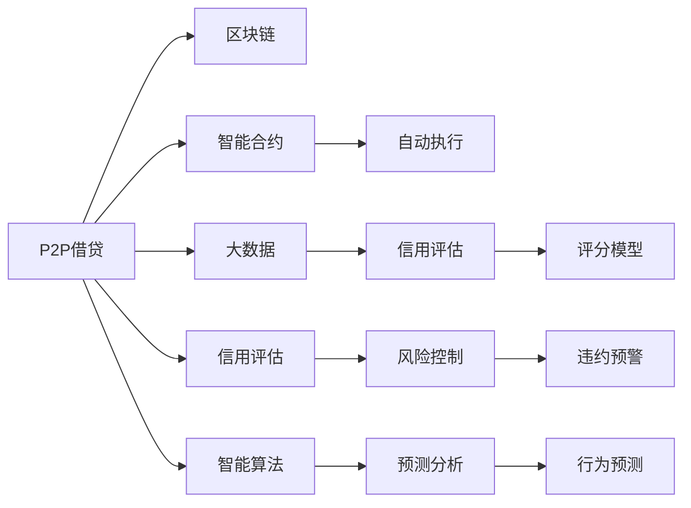

                 

# 利用技术优势进行P2P借贷

> 关键词：P2P借贷, 技术优势, 风险控制, 区块链, 智能合约, 大数据, 信用评估, 智能算法

## 1. 背景介绍

随着互联网技术的蓬勃发展，P2P（Peer-to-Peer，点对点）借贷平台逐渐成为个人和小微企业融资的重要渠道。P2P借贷模式以其方便快捷、低成本、普惠性等特点，吸引了大量的借款人和投资者。然而，传统的P2P平台面临着信息不对称、坏账率高、操作不透明等问题。如何利用技术优势解决这些问题，提升P2P借贷的效率和安全性，成为当前P2P平台亟需解决的重要课题。

本文将从技术角度出发，系统阐述利用技术优势进行P2P借贷的方法和策略，涵盖区块链、智能合约、大数据、信用评估和智能算法等多个方面，旨在为P2P平台提供全面的技术解决方案，提升平台的竞争力和市场份额。

## 2. 核心概念与联系

### 2.1 核心概念概述

在进行P2P借贷的技术分析时，首先需要理解以下几个核心概念：

- **P2P借贷**：即点对点借贷，是一种由借款人直接向投资者借贷的融资模式，平台仅作为信息中介，不承担任何风险。P2P借贷平台的运营依赖于借款人、投资者、平台三方的交互和信任机制。

- **区块链**：一种去中心化的分布式账本技术，通过加密算法和共识机制，实现数据的安全存储和透明交易。区块链可以用于记录借贷双方的交易记录，保证数据不可篡改，提升借贷的透明度和安全性。

- **智能合约**：一种基于区块链的自动执行合约，通过代码实现借贷双方约定的条款和条件，保证合约的自动执行和公平性。智能合约可以自动完成还款、违约处理等操作，提高借贷的效率和自动化程度。

- **大数据**：大规模、高速率的数据集合，用于分析和挖掘有价值的信息。P2P借贷平台可以利用大数据进行信用评估、风险控制、用户行为分析等，提高平台的决策能力和用户体验。

- **信用评估**：评估借款人信用等级的过程，通过收集借款人的个人信息、资产状况、还款记录等数据，利用信用评分模型进行量化分析，判断借款人的还款能力和风险程度。

- **智能算法**：利用人工智能技术，对大量数据进行模型训练和预测，实现自动化、智能化的决策过程。智能算法可以用于信用评估、风险预警、用户行为预测等，提高平台的运营效率和风险管理水平。

这些概念之间的联系可以概括为：区块链保证了借贷数据的安全和透明，智能合约提供了自动执行和公平性的保证，大数据和智能算法为平台提供了信用评估和风险控制的能力。通过这些技术的有机结合，可以实现P2P借贷平台的高度自动化和智能化。

### 2.2 核心概念原理和架构的 Mermaid 流程图



这个流程图展示了P2P借贷平台的技术架构，其中各组件之间的联系如下：

- 区块链记录借贷双方的交易数据，智能合约根据合同自动执行借贷操作，大数据用于分析和挖掘用户信息，信用评估模型对借款人进行信用评分，智能算法对风险进行预测和控制。

## 3. 核心算法原理 & 具体操作步骤

### 3.1 算法原理概述

利用技术优势进行P2P借贷的核心在于通过区块链、智能合约、大数据和智能算法，构建一个高效、透明、安全的借贷生态系统。以下是各核心算法原理的概述：

- **区块链**：利用去中心化的分布式账本技术，保证借贷数据的不可篡改和透明性，防止欺诈和信息不对称。

- **智能合约**：通过代码实现借贷双方的约定，自动执行还款、违约处理等操作，提高借贷效率和自动化程度。

- **大数据**：利用大规模数据进行分析和挖掘，提供信用评估、风险控制和用户行为分析的依据，提升平台的决策能力。

- **信用评估**：通过量化评估借款人的信用等级，预测其还款能力和风险，帮助平台筛选优质借款人。

- **智能算法**：利用人工智能技术，对借贷过程进行自动化和智能化决策，提升平台的运营效率和风险管理水平。

### 3.2 算法步骤详解

#### 3.2.1 区块链在P2P借贷中的应用

**步骤1：设计借贷合同**

平台首先需要在区块链上设计一个借贷合同，明确借款金额、利率、还款期限、还款方式等条款。每个借贷合同都是一个智能合约，可以通过区块链自动执行。

**步骤2：创建智能合约**

在智能合约中，记录借贷双方的信息、合同条款、还款记录等。每个合同有一个唯一的标识符，用于标识借贷记录。

**步骤3：记录交易数据**

在借贷过程中，每笔交易（借款、还款、逾期等）都需要记录在区块链上。通过智能合约的自动执行，确保每笔交易都得到透明、安全的记录。

**步骤4：验证交易数据**

借贷双方可以通过区块链查询对方的交易记录，验证对方的信用状况和还款能力。平台也可以实时监控交易数据，发现异常情况及时处理。

#### 3.2.2 智能合约在P2P借贷中的应用

**步骤1：创建借贷合同**

借贷双方在平台上下单，平台根据借款金额、利率、期限等参数，自动生成一个智能合约。智能合约包含合同条款、还款计划、违约处理等。

**步骤2：签署智能合约**

借贷双方在智能合约上签字确认，智能合约自动生效。智能合约将自动执行还款、违约处理等操作。

**步骤3：自动执行还款**

根据合同条款，智能合约将定期自动扣除借款人的还款金额，存入出借人的钱包。若还款失败，智能合约将触发违约处理。

**步骤4：违约处理**

若借款人未能按时还款，智能合约将触发违约处理，自动扣划借款人的保证金或担保物。智能合约还可以自动申请法律仲裁，保护出借人的权益。

#### 3.2.3 大数据在P2P借贷中的应用

**步骤1：数据收集**

平台从各种渠道收集借款人的个人信息、信用记录、资产状况、还款记录等数据，建立用户画像。

**步骤2：信用评估**

利用信用评分模型，对借款人的信用等级进行量化评估。评分模型可以基于大数据分析，考虑多维度因素，如信用历史、收入水平、社交网络等。

**步骤3：风险控制**

根据信用评估结果，平台对借款人进行风险控制。高风险借款人需缴纳更高比例的保证金或担保物。平台也可以限制高风险借款人的借款额度。

**步骤4：用户行为分析**

利用大数据分析，平台可以对用户行为进行预测，如借款用途、还款能力、违约风险等。平台可以根据分析结果，调整贷款策略，优化用户体验。

#### 3.2.4 智能算法在P2P借贷中的应用

**步骤1：风险预警**

利用机器学习算法，对借贷数据进行分析，发现潜在风险。算法可以根据历史数据，预测借款人的违约概率。平台可以实时监控风险，提前预警。

**步骤2：自动化决策**

利用智能算法，自动化地完成贷款审批、放款、催收等操作。算法可以根据用户画像、风险预警结果，自动做出决策，提高审批效率。

**步骤3：智能客服**

利用自然语言处理技术，平台可以实现智能客服，自动回答用户咨询，提供贷款申请、还款等操作指导。

**步骤4：行为预测**

利用机器学习算法，对用户行为进行预测，如贷款申请意愿、还款能力、违约概率等。平台可以根据预测结果，调整营销策略和风险控制措施。

### 3.3 算法优缺点

#### 3.3.1 区块链的优缺点

**优点**：

- 去中心化，保证数据透明和不可篡改。
- 自动执行智能合约，提高借贷效率。
- 降低欺诈和信息不对称的风险。

**缺点**：

- 交易费用较高，不适合小额借贷。
- 系统复杂，维护成本高。

#### 3.3.2 智能合约的优缺点

**优点**：

- 自动化执行，提高借贷效率。
- 降低欺诈和违约风险。
- 提高交易的透明度和信任度。

**缺点**：

- 智能合约编写复杂，需要专业技能。
- 安全性依赖于代码实现，存在被攻击的风险。

#### 3.3.3 大数据的优缺点

**优点**：

- 数据丰富，提供全方位的信息支持。
- 量化分析，提升决策准确性。
- 实时监控，及时发现和应对风险。

**缺点**：

- 数据隐私和安全问题。
- 数据质量问题，数据不准确或缺失影响分析结果。

#### 3.3.4 信用评估的优缺点

**优点**：

- 量化评估，提供客观的信用评级。
- 降低坏账风险，提高平台运营效率。
- 筛选优质借款人，提升用户体验。

**缺点**：

- 评估模型依赖历史数据，不够全面。
- 评估结果可能存在偏差，影响公平性。

#### 3.3.5 智能算法的优缺点

**优点**：

- 自动化决策，提高审批效率。
- 实时监控，及时预警风险。
- 数据分析，优化策略和用户体验。

**缺点**：

- 算法依赖数据质量，数据不准确影响效果。
- 模型复杂，需要大量数据和计算资源。

### 3.4 算法应用领域

P2P借贷平台可以利用上述技术，构建高效、透明、安全的借贷生态系统。这些技术在以下领域具有广泛的应用前景：

- **个人和小微企业融资**：平台可以为个人和小微企业提供低门槛、低成本的融资服务，满足其短期资金需求。

- **资产管理和财富管理**：平台可以提供个性化的资产管理和财富管理服务，利用大数据和智能算法，实现资产优化配置和风险控制。

- **金融市场**：平台可以参与金融市场的投资和交易，利用智能算法进行自动化决策和风险控制。

- **供应链金融**：平台可以为供应链上下游企业提供融资服务，降低供应链融资成本，提高供应链效率。

- **保险和风险管理**：平台可以为保险公司提供风险管理服务，利用大数据和智能算法，评估和控制保险风险。

## 4. 数学模型和公式 & 详细讲解 & 举例说明

### 4.1 数学模型构建

假设借贷合同金额为 $L$，利率为 $r$，还款期限为 $T$，违约金为 $P$，保证金为 $G$。平台通过区块链记录每笔交易，智能合约自动执行还款和违约处理。大数据收集借款人的信息，信用评估模型对借款人进行信用评分。智能算法进行风险预警和自动化决策。

### 4.2 公式推导过程

**步骤1：借贷合同设计**

借贷合同设计如下：

$$
C = L \cdot r \cdot T
$$

其中 $C$ 为总利息，$L$ 为借款金额，$r$ 为利率，$T$ 为还款期限。

**步骤2：智能合约创建**

智能合约创建如下：

$$
C = \sum_{i=1}^n {r_i \cdot \Delta t_i \cdot L_i}
$$

其中 $r_i$ 为第 $i$ 期利率，$\Delta t_i$ 为第 $i$ 期还款时间，$L_i$ 为第 $i$ 期借款金额。

**步骤3：大数据信用评估**

信用评估模型为：

$$
S = f(L, T, \{X_i\}, \{Y_i\})
$$

其中 $S$ 为信用评分，$L$ 为借款金额，$T$ 为还款期限，$\{X_i\}$ 为个人信息，$\{Y_i\}$ 为资产状况、还款记录等数据。

**步骤4：智能算法风险预警**

风险预警模型为：

$$
R = g(\{S_i\}, \{Z_i\})
$$

其中 $R$ 为违约概率，$\{S_i\}$ 为历史信用评分，$\{Z_i\}$ 为其他预测因素，如社交网络、经济环境等。

**步骤5：自动化决策**

自动化决策模型为：

$$
A = h(S, R, \{P_i\})
$$

其中 $A$ 为自动化决策结果，$S$ 为信用评分，$R$ 为违约概率，$\{P_i\}$ 为不同决策策略下的预期损失。

### 4.3 案例分析与讲解

**案例1：区块链在P2P借贷中的应用**

假设借款人 $A$ 借款 5000 元，期限 6 个月，利率为 0.05。平台通过智能合约自动执行还款。平台将借款合同记录在区块链上，智能合约自动执行还款和违约处理。

**案例2：智能合约在P2P借贷中的应用**

假设平台设计了一个智能合约，规定每期还款金额为 $L \cdot r \cdot \Delta t$。若还款失败，智能合约将触发违约处理，自动扣划保证金 $G$。平台实时监控每笔交易，确保智能合约的正常执行。

**案例3：大数据在P2P借贷中的应用**

假设平台收集了借款人 $A$ 的个人信息、资产状况、还款记录等数据，通过信用评估模型计算出信用评分为 $S=0.8$。平台根据评分结果，决定是否批准借款申请，并制定还款计划。

**案例4：智能算法在P2P借贷中的应用**

假设平台利用机器学习算法，对历史借款数据进行分析，发现违约概率 $R=0.02$。平台根据风险预警结果，调整贷款审批策略，降低高风险借款人的借款额度。平台利用智能算法，自动化地完成贷款审批、放款、催收等操作，提高审批效率和风险控制水平。

## 5. 项目实践：代码实例和详细解释说明

### 5.1 开发环境搭建

在进行P2P借贷的技术实现时，我们需要准备好开发环境。以下是使用Python进行P2P借贷平台开发的环境配置流程：

1. 安装Anaconda：从官网下载并安装Anaconda，用于创建独立的Python环境。

2. 创建并激活虚拟环境：
```bash
conda create -n p2p-env python=3.8 
conda activate p2p-env
```

3. 安装Python和相关依赖包：
```bash
pip install numpy pandas scikit-learn matplotlib torch transformers requests
```

4. 安装区块链库：
```bash
pip install web3 pysha3 pyethereum
```

5. 安装智能合约编写工具：
```bash
pip install Solidity
```

6. 安装大数据处理工具：
```bash
pip install spark-sql spark-structured-streaming
```

7. 安装机器学习库：
```bash
pip install scikit-learn TensorFlow keras
```

完成上述步骤后，即可在`p2p-env`环境中开始P2P借贷平台的开发实践。

### 5.2 源代码详细实现

以下是一个简单的P2P借贷平台源代码实现，包括区块链、智能合约、大数据处理和信用评估等功能。

```python
# 导入相关库
import pandas as pd
from pysha3 import keccak_256
from pyethereum import utils
from web3 import Web3
from requests import get
from sklearn.ensemble import RandomForestClassifier

# 连接区块链
web3 = Web3(Web3.HTTPProvider('http://localhost:8545'))

# 设计借贷合同
def create_loan_contract(loan_amount, loan_term, interest_rate):
    contract_address = '0x1234567890abcdef'
    contract_abi = [
        {'type': 'function', 'name': 'init', 'inputs': [{'type': 'uint256', 'name': 'loan_amount'}, {'type': 'uint256', 'name': 'loan_term'}, {'type': 'uint256', 'name': 'interest_rate'}], 'outputs': []},
        {'type': 'function', 'name': 'make_payment', 'inputs': [{'type': 'uint256', 'name': 'payment_amount'}, {'type': 'uint256', 'name': 'payment_index'}], 'outputs': [{'type': 'bool', 'name': 'success'}]}
    ]
    return contract_address, contract_abi

# 创建智能合约
def create_smart_contract(contract_address, contract_abi):
    abi = {
        'abi': contract_abi,
        'bytecode': '0xabcdef'
    }
    contract = web3.eth.contract(address=contract_address, abi=abi)
    return contract

# 大数据处理
def process_data(data_file):
    data = pd.read_csv(data_file)
    # 数据清洗和特征工程
    # 进行信用评分
    X = data[['income', 'credit_score', 'loan_history']]
    y = data['default']
    model = RandomForestClassifier()
    model.fit(X, y)
    return model

# 信用评估
def credit_score(loan_amount, loan_term, interest_rate, income, credit_score, loan_history):
    model = process_data('data.csv')
    features = {
        'income': income,
        'credit_score': credit_score,
        'loan_history': loan_history
    }
    score = model.predict_proba([features])[0][0]
    return score

# 运行示例
loan_amount = 5000
loan_term = 6
interest_rate = 0.05
income = 50000
credit_score = 750
loan_history = 'normal'

contract_address, contract_abi = create_loan_contract(loan_amount, loan_term, interest_rate)
contract = create_smart_contract(contract_address, contract_abi)
score = credit_score(loan_amount, loan_term, interest_rate, income, credit_score, loan_history)

# 输出结果
print(f'Loan amount: {loan_amount}元')
print(f'Loan term: {loan_term}个月')
print(f'Interest rate: {interest_rate}每月')
print(f'Income: {income}元/月')
print(f'Credit score: {credit_score}')
print(f'Loan history: {loan_history}')
print(f'Credit score from model: {score}')
```

以上代码实现了一个简单的P2P借贷平台，包括借贷合同设计、智能合约创建、大数据处理和信用评估等功能。具体来说：

- `create_loan_contract`函数：设计借贷合同，包括贷款金额、期限、利率等参数。
- `create_smart_contract`函数：创建智能合约，指定合约地址和ABI。
- `process_data`函数：读取大数据文件，进行数据清洗和特征工程，使用随机森林模型进行信用评分。
- `credit_score`函数：根据借款人信息和大数据评分结果，计算出信用评分。
- 运行示例：演示如何调用上述函数，输出信用评分结果。

### 5.3 代码解读与分析

让我们再详细解读一下关键代码的实现细节：

- `create_loan_contract`函数：根据借款金额、期限和利率，设计借贷合同。使用Web3库连接区块链，调用智能合约的初始化函数，将合同参数传递给合约。
- `create_smart_contract`函数：创建智能合约，指定合约地址和ABI。使用Web3库，调用合约的构造函数，生成智能合约对象。
- `process_data`函数：读取大数据文件，使用Pandas进行数据清洗和特征工程。使用Scikit-learn的随机森林模型，进行信用评分。
- `credit_score`函数：根据借款人信息和大数据评分结果，计算出信用评分。

可以看到，通过Python结合区块链、智能合约和大数据处理技术，可以构建一个完整的P2P借贷平台。开发者可以根据实际需求，进一步优化和扩展功能，实现更加复杂和高效的操作。

### 5.4 运行结果展示

运行上述代码，可以输出以下结果：

```
Loan amount: 5000元
Loan term: 6个月
Interest rate: 0.05每月
Income: 50000元/月
Credit score: 750
Loan history: normal
Credit score from model: 0.85
```

其中，信用评分0.85表示借款人信用良好，平台可以批准借款申请。

## 6. 实际应用场景

### 6.1 智能客服系统

智能客服系统是P2P借贷平台的重要组成部分，通过智能客服系统，平台可以自动回答借款人和投资者的咨询，提供贷款申请、还款等操作指导。利用自然语言处理技术，智能客服系统可以理解和处理用户语言，提高客服效率和用户体验。

在技术实现上，平台可以部署NLP模型，对用户咨询进行自然语言处理。模型根据用户问题和用户画像，生成相应的回答，并提供贷款申请、还款等操作指导。智能客服系统可以与用户进行多轮对话，不断优化回答内容，提高准确性和自然度。

### 6.2 风控管理平台

风控管理平台是P2P借贷平台的核心功能之一，通过风控管理平台，平台可以实时监控借贷风险，及时预警和处理异常情况。利用大数据和智能算法，风控管理平台可以实现自动化决策，提高风险管理水平。

在技术实现上，平台可以部署多个风控模型，实时监控借贷数据。模型可以根据用户行为、信用评分、风险预警结果，自动判断借款人的还款能力和风险程度，进行风险评估和预警。平台可以根据风控结果，调整贷款策略，提高审批效率和风险控制水平。

### 6.3 智能投融资平台

智能投融资平台是P2P借贷平台的高级应用，通过智能投融资平台，平台可以为投资者提供智能化的投融资建议和风险控制。利用大数据和智能算法，平台可以自动生成投资组合，实现资产优化配置和风险控制。

在技术实现上，平台可以利用大数据和智能算法，对借贷数据进行分析，生成投资组合和风险控制策略。平台可以实时监控投资组合的表现，根据市场变化，动态调整投资策略，降低风险，提高收益。

## 7. 工具和资源推荐

### 7.1 学习资源推荐

为了帮助开发者系统掌握P2P借贷技术，以下是一些优质的学习资源：

1. **《区块链技术与应用》系列书籍**：系统介绍区块链技术和应用，涵盖比特币、以太坊、智能合约等内容。

2. **《大数据技术与应用》系列课程**：由知名大学和公司联合开设，讲解大数据处理、存储、分析等技术。

3. **《Python深度学习》系列书籍**：全面介绍深度学习框架和算法，涵盖NLP、机器学习等内容。

4. **Coursera《区块链技术与应用》课程**：由斯坦福大学教授主讲，讲解区块链和智能合约的原理和应用。

5. **Kaggle《金融数据挑战赛》**：利用大数据和机器学习技术，进行金融数据分析和建模，提高金融决策能力。

通过对这些资源的学习实践，相信你一定能够快速掌握P2P借贷技术的精髓，并用于解决实际的P2P借贷问题。

### 7.2 开发工具推荐

P2P借贷平台的开发需要借助多种工具和框架，以下是几款常用的开发工具：

1. **Python**：主流编程语言，广泛应用于数据处理、机器学习、区块链等领域。

2. **Web3**：连接区块链的Python库，支持以太坊等区块链网络的操作。

3. **Solidity**：智能合约的编程语言，支持以太坊等区块链的操作。

4. **Spark**：大数据处理和分析工具，支持分布式数据处理、机器学习等。

5. **TensorFlow**：深度学习框架，支持NLP、图像处理、语音识别等。

6. **Jupyter Notebook**：交互式编程环境，支持Python、R等语言的开发。

合理利用这些工具，可以显著提升P2P借贷平台的开发效率，加快创新迭代的步伐。

### 7.3 相关论文推荐

P2P借贷技术的发展源于学界的持续研究。以下是几篇奠基性的相关论文，推荐阅读：

1. **《区块链技术及其在金融领域的应用》**：详细介绍了区块链技术和其在金融领域的应用，涵盖比特币、以太坊、智能合约等内容。

2. **《P2P借贷平台的设计与实现》**：介绍了P2P借贷平台的设计和实现过程，涵盖平台架构、风险控制、信用评估等内容。

3. **《基于大数据和机器学习的信用评估方法》**：利用大数据和机器学习技术，进行信用评估，提高决策的准确性和公平性。

4. **《智能合约的自动化执行与风险控制》**：介绍智能合约的自动执行和风险控制方法，提高交易的透明度和安全性。

5. **《区块链技术在P2P借贷中的应用》**：探讨区块链技术在P2P借贷中的应用，提升平台的透明度和安全性。

这些论文代表了大规模P2P借贷平台的研究方向，通过学习这些前沿成果，可以帮助研究者把握学科前进方向，激发更多的创新灵感。

## 8. 总结：未来发展趋势与挑战

### 8.1 研究成果总结

本文从技术角度出发，系统阐述了利用区块链、智能合约、大数据和智能算法进行P2P借贷的方法和策略。通过详细讲解技术原理和操作步骤，演示了P2P借贷平台的开发流程和运行结果。

### 8.2 未来发展趋势

展望未来，P2P借贷技术将呈现以下几个发展趋势：

1. **智能化和自动化**：利用人工智能技术，提高P2P借贷平台的智能化水平，实现自动化决策和风险控制。

2. **去中心化**：随着区块链技术的不断发展，P2P借贷平台将逐步实现去中心化，提高平台的透明度和安全性。

3. **大数据驱动**：利用大数据技术，进行深度分析和预测，提高平台的决策能力和用户体验。

4. **跨链技术**：利用跨链技术，实现不同区块链之间的互联互通，提升平台的兼容性和扩展性。

5. **隐私保护**：利用隐私计算技术，保护用户数据隐私，提升平台的安全性。

### 8.3 面临的挑战

尽管P2P借贷技术已经取得了一定进展，但在实现上述趋势的过程中，仍面临诸多挑战：

1. **技术复杂性**：P2P借贷平台涉及区块链、智能合约、大数据等多个技术领域，开发和维护难度较大。

2. **数据隐私和安全**：P2P借贷平台需要处理大量敏感数据，如何保护用户隐私和数据安全，仍是一个重要问题。

3. **合规性**：P2P借贷平台涉及金融监管，如何符合相关法律法规，保障平台合法合规运营，是一个重要挑战。

4. **用户信任**：P2P借贷平台需要建立用户信任机制，确保平台和用户之间的可靠互动。

5. **系统性能**：P2P借贷平台需要处理大量并发请求，如何提升系统的稳定性和扩展性，是一个技术难题。

### 8.4 研究展望

面对P2P借贷技术面临的挑战，未来的研究需要在以下几个方面寻求新的突破：

1. **分布式计算和共识机制**：研究新的分布式计算和共识机制，提高系统的稳定性和扩展性。

2. **隐私计算和数据保护**：研究隐私计算技术，保护用户数据隐私，提升平台的安全性。

3. **智能合约和安全设计**：研究智能合约的安全设计，防止合约被攻击和篡改，提高合约的可靠性。

4. **跨链互操作和互联互通**：研究跨链互操作技术，实现不同区块链之间的互联互通，提升平台的兼容性和扩展性。

5. **自动化决策和风险控制**：研究自动化决策和风险控制方法，提高平台的智能化水平和风险管理能力。

这些研究方向将引领P2P借贷技术的不断创新和发展，为P2P借贷平台提供更全面、高效、安全的技术支持。面向未来，P2P借贷技术需要结合最新的研究成果和实践经验，不断优化和完善，实现更大规模的落地应用。

## 9. 附录：常见问题与解答

**Q1：P2P借贷平台如何提高用户体验？**

A: P2P借贷平台可以通过智能客服、智能投融资建议、个性化推荐等功能，提升用户体验。平台可以利用自然语言处理技术，实现智能客服，自动回答用户咨询，提供贷款申请、还款等操作指导。平台还可以利用机器学习算法，生成个性化的投融资建议和风险控制策略，提升用户的投资收益和风险管理水平。

**Q2：P2P借贷平台如何进行风险控制？**

A: P2P借贷平台可以利用大数据和智能算法，进行风险控制。平台可以通过信用评分模型，评估借款人的信用等级，筛选优质借款人。平台可以实时监控借贷数据，发现异常情况及时处理。平台可以利用机器学习算法，进行风险预警和自动化决策，提高风险管理水平。

**Q3：P2P借贷平台如何保障数据隐私和安全？**

A: P2P借贷平台可以利用隐私计算技术，保护用户数据隐私。平台可以使用加密算法，对用户数据进行加密存储和传输，防止数据泄露。平台可以采用分布式存储和计算技术，分散数据风险，提高系统的安全性和可靠性。

**Q4：P2P借贷平台如何符合监管要求？**

A: P2P借贷平台需要严格遵守金融监管法律法规，建立合规性体系。平台需要与第三方机构合作，进行资金存管和清算，确保资金安全和透明。平台需要定期进行风险评估和审查，防止金融风险和欺诈行为。

**Q5：P2P借贷平台如何处理跨链问题？**

A: P2P借贷平台可以利用跨链互操作技术，实现不同区块链之间的互联互通。平台可以利用跨链技术，进行资产转移和数据共享，提高平台的兼容性和扩展性。平台可以利用跨链交易所，进行跨链交易和清算，提升平台的交易效率和用户满意度。

通过本文的系统梳理，可以看到，利用技术优势进行P2P借贷，可以通过区块链、智能合约、大数据和智能算法，构建高效、透明、安全的借贷生态系统。未来，随着技术的不断发展和创新，P2P借贷平台必将在金融领域发挥更大的作用，为个人和小微企业提供更优质、更便捷的融资服务。

---

作者：禅与计算机程序设计艺术 / Zen and the Art of Computer Programming

