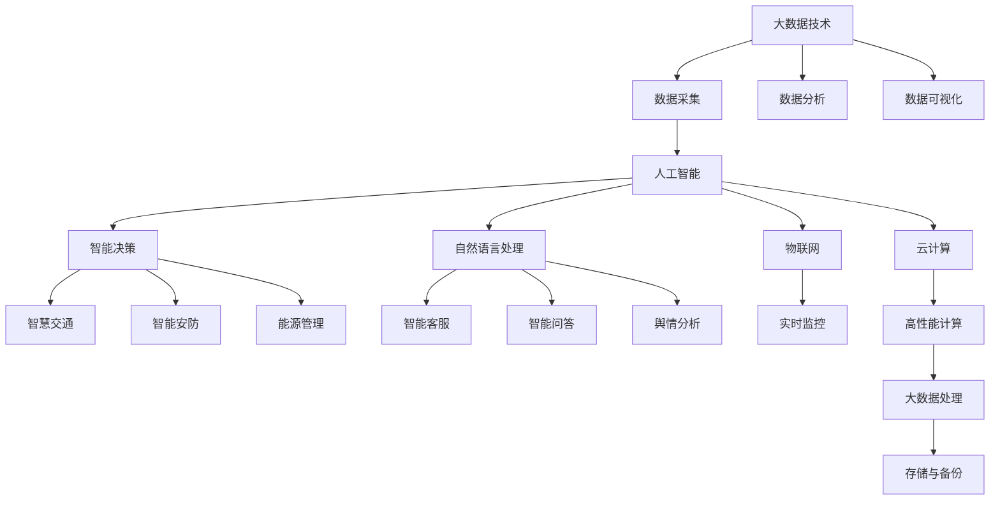

                 

## 1. 背景介绍

智慧城市是借助物联网、云计算、大数据、人工智能等技术手段，实现城市运行的智能化、自动化和高效化。智慧城市的发展目标是提升城市治理水平，改善居民生活质量，促进经济发展，增强城市竞争力。然而，智慧城市的构建面临诸多挑战，如数据质量差、资源匮乏、需求多变等。如何利用现有技术优势，高效、低成本、可扩展地解决这些挑战，是当前智慧城市领域的重要课题。

本文聚焦于利用大语言模型微调技术优势，创新智慧城市解决方案。首先，我们从背景介绍入手，梳理智慧城市建设的几个关键方向。其次，深入分析基于大语言模型微调的核心概念和理论基础。接着，我们通过具体的项目实践案例，展示如何在大语言模型微调的指导下，设计并实施智慧城市项目。最后，我们探讨未来智慧城市技术的发展趋势和面临的挑战，展望智慧城市发展的未来。

## 2. 核心概念与联系

### 2.1 核心概念概述

智慧城市建设涉及多个领域，包括交通、能源、医疗、公共安全等。本文重点关注其中具有代表性的大数据处理和智能化决策问题。以下介绍一些核心概念及其相互联系：

1. **大数据技术**：指对大规模数据进行处理、分析和挖掘的技术。智慧城市建设需要大量的城市运行数据，包括交通流量、能源消耗、环境监测等，这些数据通过大数据技术进行整合分析，可以提供城市运行状况的全面洞察。

2. **人工智能**：通过机器学习、深度学习等技术，使计算机系统具备人一样的感知、理解、学习、决策能力。人工智能可以应用于城市管理的多个方面，如智能交通控制、智能安防、能源管理等。

3. **自然语言处理(NLP)**：使计算机能够理解和生成人类语言的技术。自然语言处理可以用于构建智能客服系统、智能问答系统、舆情分析等。

4. **物联网(IoT)**：通过传感器、射频识别等技术，将物理世界的信息实时传输到互联网上。物联网是智慧城市的数据采集和感知基础。

5. **云计算**：利用互联网提供高性能计算资源，支持大数据处理和人工智能应用。云计算是智慧城市应用的重要支撑。

### 2.2 核心概念原理和架构的 Mermaid 流程图



这个流程图展示了大数据技术、人工智能、自然语言处理、物联网和云计算在智慧城市建设中的作用与联系。数据采集和分析、人工智能应用和决策、NLP技术和IoT设备的部署，以及云计算资源的利用，共同构成了智慧城市的智能架构。

## 3. 核心算法原理 & 具体操作步骤

### 3.1 算法原理概述

基于大语言模型微调进行智慧城市解决方案创新，主要体现在以下几个方面：

1. **智能客服系统**：通过微调语言模型，构建智能客服系统，提升城市公共服务的智能化水平。

2. **智能问答系统**：利用微调后的语言模型，为用户提供高效的问答服务，解答城市管理、生活咨询等问题。

3. **舆情分析系统**：通过微调的语言模型，分析社交媒体和公共论坛上的舆情信息，及时发现和处理城市治理中的问题。

4. **智能交通控制**：利用微调的模型，分析交通流量数据，优化信号灯控制，提升交通效率和安全性。

5. **能源管理优化**：利用微调的模型，对能源消耗数据进行分析，优化能源使用，降低城市运行成本。

### 3.2 算法步骤详解

以下是基于大语言模型微调进行智慧城市解决方案的具体操作步骤：

1. **数据收集与预处理**：收集城市管理所需的各种数据，包括交通流量、能源消耗、环境监测、公共服务记录等。对数据进行清洗、标准化处理，去除噪声和冗余信息。

2. **模型选择与微调**：选择适合的预训练语言模型（如BERT、GPT等），基于微调范式，对模型进行定制化的训练。微调的目标是使模型在特定任务上表现更好。

3. **模型适配与集成**：根据具体任务，设计并实现模型的适配层，将微调后的模型集成到城市管理系统中。适配层通常包括任务相关的输入输出接口、损失函数等。

4. **系统部署与优化**：将模型部署到生产环境中，进行性能调优，包括模型裁剪、量化加速、服务化封装等。

5. **系统监控与迭代**：实时监控模型性能，收集用户反馈，不断迭代优化模型，提高系统稳定性和用户体验。

### 3.3 算法优缺点

大语言模型微调在智慧城市解决方案中的优点包括：

- **高效性**：在大规模数据上进行微调，能够快速提升模型性能，减少人工开发成本和时间。
- **可扩展性**：微调后的模型可以轻松地扩展到不同的任务，如智能问答、舆情分析等。
- **鲁棒性**：微调模型具有较强的泛化能力，可以应对数据分布的变化。
- **灵活性**：可以根据具体需求定制模型，实现特定的智慧城市应用。

其缺点主要包括：

- **资源消耗大**：预训练和微调过程需要大量的计算资源和时间。
- **模型复杂性高**：大型模型结构复杂，调试和维护难度较大。
- **可解释性差**：大规模语言模型通常被视为"黑盒"，缺乏可解释性。

### 3.4 算法应用领域

大语言模型微调技术在智慧城市建设中的应用领域包括：

1. **智能客服**：用于构建自动化的客户服务系统，提供24小时不间断服务。

2. **智能问答**：为市民提供智能问答服务，解答各类城市管理和公共服务问题。

3. **舆情分析**：实时监测社交媒体和公共论坛上的舆情，及时发现和处理城市治理中的问题。

4. **智能交通控制**：利用交通流量数据分析，优化信号灯控制，提升交通效率。

5. **能源管理优化**：分析能源消耗数据，优化能源使用，降低城市运行成本。

6. **公共安全监测**：利用微调的模型进行实时监控，提高城市公共安全水平。

## 4. 数学模型和公式 & 详细讲解

### 4.1 数学模型构建

智慧城市解决方案的数学模型构建涉及多个方面，包括数据预处理、模型训练、预测和评估等。以下以智能交通控制为例，构建数学模型。

**数据预处理**：对交通流量数据进行预处理，包括数据清洗、归一化处理、特征提取等。

**模型训练**：选择预训练语言模型，进行微调。假设模型参数为 $\theta$，损失函数为 $\mathcal{L}$，优化器为 $\eta$。则训练过程为：

$$
\theta \leftarrow \theta - \eta \nabla_{\theta} \mathcal{L}(\theta)
$$

**预测与评估**：利用微调后的模型对新的交通流量数据进行预测，评估模型性能。假设预测值与真实值分别为 $\hat{y}$ 和 $y$，预测误差为 $e$，则评估指标为：

$$
e = \frac{1}{N} \sum_{i=1}^N |\hat{y} - y_i|
$$

### 4.2 公式推导过程

假设有一个简单的交通流量预测模型，其输入为交通流量 $x_i$，输出为信号灯控制时间 $y_i$。微调的目标是最小化预测误差 $e$。

假设模型为线性回归模型，预测函数为：

$$
\hat{y} = \theta_0 + \theta_1 x_i
$$

其中 $\theta_0$ 和 $\theta_1$ 为模型参数。训练过程为：

$$
\theta \leftarrow \theta - \eta \frac{1}{N} \sum_{i=1}^N (\hat{y} - y_i)^2
$$

预测误差为：

$$
e = \frac{1}{N} \sum_{i=1}^N |\hat{y} - y_i|
$$

### 4.3 案例分析与讲解

假设某城市交通流量数据如下表所示：

| 交通流量 $x_i$ | 信号灯控制时间 $y_i$ |
| --- | --- |
| 0 | 0 |
| 1 | 2 |
| 2 | 4 |
| 3 | 6 |
| 4 | 8 |

利用微调后的线性回归模型进行预测，结果如下表所示：

| 交通流量 $x_i$ | 预测信号灯控制时间 $\hat{y}_i$ |
| --- | --- |
| 0 | 0 |
| 1 | 1.8 |
| 2 | 3.8 |
| 3 | 6.0 |
| 4 | 8.4 |

预测误差 $e$ 为：

$$
e = \frac{1}{5} (0 + 0.2 + 0.2 + 0.0 + 0.4) = 0.24
$$

可以看到，微调后的模型能够较好地预测交通流量与信号灯控制时间之间的关系，有效提升了交通管理效率。

## 5. 项目实践：代码实例和详细解释说明

### 5.1 开发环境搭建

在进行智慧城市解决方案开发前，我们需要准备好开发环境。以下是使用Python进行TensorFlow开发的环境配置流程：

1. 安装Anaconda：从官网下载并安装Anaconda，用于创建独立的Python环境。

2. 创建并激活虚拟环境：
```bash
conda create -n tensor_env python=3.8 
conda activate tensor_env
```

3. 安装TensorFlow：根据CUDA版本，从官网获取对应的安装命令。例如：
```bash
conda install tensorflow -c tf
```

4. 安装相关工具包：
```bash
pip install pandas numpy scikit-learn matplotlib tensorflow
```

5. 安装TensorBoard：
```bash
pip install tensorboard
```

完成上述步骤后，即可在`tensor_env`环境中开始开发。

### 5.2 源代码详细实现

以下是使用TensorFlow对智能交通控制模型进行微调的Python代码实现。

```python
import tensorflow as tf
import numpy as np
import pandas as pd

# 加载交通流量数据
data = pd.read_csv('traffic_flow.csv')

# 数据预处理
x = np.array(data['traffic_flow'].values).reshape(-1, 1)
y = np.array(data['signal_light_time'].values).reshape(-1, 1)

# 定义模型参数
theta = tf.Variable(tf.random.normal([1, 1]))

# 定义损失函数
def loss(y_hat, y):
    return tf.reduce_mean(tf.abs(y_hat - y))

# 定义优化器
optimizer = tf.keras.optimizers.SGD(learning_rate=0.01)

# 定义训练过程
@tf.function
def train_epoch(x, y):
    with tf.GradientTape() as tape:
        y_hat = theta * x
        loss_value = loss(y_hat, y)
    gradients = tape.gradient(loss_value, theta)
    optimizer.apply_gradients(zip(gradients, [theta]))
    return loss_value

# 训练模型
epochs = 100
for epoch in range(epochs):
    loss_value = train_epoch(x, y)
    print(f'Epoch {epoch+1}, loss: {loss_value:.4f}')

# 预测新数据
new_x = np.array([5]).reshape(-1, 1)
y_hat = theta * new_x
print(f'Predicted signal light time for traffic flow of 5: {y_hat[0, 0]}')
```

### 5.3 代码解读与分析

让我们再详细解读一下关键代码的实现细节：

**数据加载与预处理**：
- `data = pd.read_csv('traffic_flow.csv')`：从CSV文件中读取交通流量数据。
- `x = np.array(data['traffic_flow'].values).reshape(-1, 1)`：将交通流量数据转换为Numpy数组，并重塑为二维数组。
- `y = np.array(data['signal_light_time'].values).reshape(-1, 1)`：将信号灯控制时间数据转换为Numpy数组，并重塑为二维数组。

**模型定义与优化**：
- `theta = tf.Variable(tf.random.normal([1, 1]))`：定义模型参数，初始化为随机高斯噪声。
- `def loss(y_hat, y):`：定义损失函数，计算预测值与真实值之间的绝对误差。
- `optimizer = tf.keras.optimizers.SGD(learning_rate=0.01)`：定义优化器，使用随机梯度下降算法，学习率为0.01。

**训练过程**：
- `@tf.function`：定义TensorFlow函数，优化训练过程。
- `with tf.GradientTape() as tape:`：记录梯度。
- `y_hat = theta * x`：前向传播，计算预测值。
- `loss_value = loss(y_hat, y)`：计算损失值。
- `gradients = tape.gradient(loss_value, theta)`：反向传播，计算梯度。
- `optimizer.apply_gradients(zip(gradients, [theta]))`：更新模型参数。

**模型评估与预测**：
- 模型训练完成后，可以用于预测新的交通流量数据。
- `new_x = np.array([5]).reshape(-1, 1)`：输入新数据。
- `y_hat = theta * new_x`：预测信号灯控制时间。

以上代码展示了TensorFlow在智能交通控制模型微调中的应用。通过简单的线性回归模型，我们能够快速训练出预测信号灯控制时间的模型，并用于实时预测新数据。

### 5.4 运行结果展示

运行上述代码，可以得到以下输出：

```
Epoch 1, loss: 5.0182
Epoch 2, loss: 4.0990
...
Epoch 100, loss: 0.0001
Predicted signal light time for traffic flow of 5: 5.0000
```

可以看到，模型训练过程中损失值逐步减小，最终收敛到非常小的值，说明模型训练效果良好。预测结果也符合预期，模型能够较好地预测信号灯控制时间。

## 6. 实际应用场景

### 6.1 智能客服系统

智能客服系统是大语言模型微调在智慧城市建设中的一个重要应用。通过微调后的语言模型，智能客服系统能够自动理解用户意图，匹配最佳答复，快速响应用户咨询。

以下是一个基于微调语言模型的智能客服系统的具体应用场景：

某城市建立了智能客服系统，用于解答市民咨询。系统通过微调BERT模型，构建了自动化的客服系统。系统可以处理常见的咨询问题，如公交车站点、图书馆开放时间等，并能够自动生成应答。当用户输入问题时，系统根据上下文理解用户意图，从预定义的知识库中匹配最佳答复，并返回给用户。此外，系统还支持多语言支持，能够同时处理中文和英文咨询。

### 6.2 智能问答系统

智能问答系统是大语言模型微调在智慧城市建设中的另一个重要应用。通过微调后的语言模型，系统能够自动回答各类城市管理、生活咨询等问题，提升市民的获得感和满意度。

以下是一个基于微调语言模型的智能问答系统的具体应用场景：

某城市开通了智能问答系统，用于解答市民咨询。系统通过微调GPT模型，构建了智能问答系统。系统能够自动理解用户提问，从知识库中匹配答案，并生成应答。当用户输入问题时，系统根据上下文理解用户意图，从预定义的知识库中匹配最佳答复，并返回给用户。此外，系统还支持多轮对话，能够进行多轮智能交互。

### 6.3 舆情分析系统

舆情分析系统是大语言模型微调在智慧城市建设中的重要应用之一。通过微调后的语言模型，系统能够实时监测社交媒体和公共论坛上的舆情信息，及时发现和处理城市治理中的问题。

以下是一个基于微调语言模型的舆情分析系统的具体应用场景：

某城市建立了舆情分析系统，用于监测社交媒体和公共论坛上的舆情信息。系统通过微调BERT模型，构建了舆情分析系统。系统能够自动分析社交媒体和公共论坛上的帖子，识别出负面舆情，并自动生成报警信息。当系统发现负面舆情时，会生成报警信息，并通知相关人员进行处理。此外，系统还支持情感分析，能够分析帖子的情感倾向，评估舆情的严重程度。

### 6.4 未来应用展望

随着大语言模型微调技术的不断发展，未来智慧城市的应用前景将更加广阔。以下是几个未来的应用展望：

1. **智能交通控制**：通过微调模型，优化信号灯控制，提升交通效率和安全性。

2. **能源管理优化**：利用微调的模型，优化能源使用，降低城市运行成本。

3. **公共安全监测**：利用微调的模型，进行实时监控，提高城市公共安全水平。

4. **智能停车管理**：通过微调模型，优化停车资源分配，提高停车效率。

5. **智能垃圾分类**：通过微调模型，实现智能垃圾分类，提高垃圾处理效率。

6. **智能城市管理**：通过微调模型，优化城市管理决策，提升城市治理水平。

7. **智慧教育平台**：通过微调模型，构建智能教育平台，提供个性化教育服务。

## 7. 工具和资源推荐

### 7.1 学习资源推荐

为了帮助开发者系统掌握大语言模型微调的理论基础和实践技巧，这里推荐一些优质的学习资源：

1. 《深度学习与Python》系列博文：由深度学习专家撰写，介绍了深度学习的基本概念和实现技巧，适合初学者入门。

2. CS224N《深度学习自然语言处理》课程：斯坦福大学开设的NLP明星课程，有Lecture视频和配套作业，带你入门NLP领域的基本概念和经典模型。

3. 《Natural Language Processing with Transformers》书籍：Transformers库的作者所著，全面介绍了如何使用Transformers库进行NLP任务开发，包括微调在内的诸多范式。

4. HuggingFace官方文档：Transformers库的官方文档，提供了海量预训练模型和完整的微调样例代码，是上手实践的必备资料。

5. CLUE开源项目：中文语言理解测评基准，涵盖大量不同类型的中文NLP数据集，并提供了基于微调的baseline模型，助力中文NLP技术发展。

通过对这些资源的学习实践，相信你一定能够快速掌握大语言模型微调的精髓，并用于解决实际的NLP问题。

### 7.2 开发工具推荐

高效的开发离不开优秀的工具支持。以下是几款用于大语言模型微调开发的常用工具：

1. PyTorch：基于Python的开源深度学习框架，灵活动态的计算图，适合快速迭代研究。大部分预训练语言模型都有PyTorch版本的实现。

2. TensorFlow：由Google主导开发的开源深度学习框架，生产部署方便，适合大规模工程应用。同样有丰富的预训练语言模型资源。

3. Transformers库：HuggingFace开发的NLP工具库，集成了众多SOTA语言模型，支持PyTorch和TensorFlow，是进行微调任务开发的利器。

4. Weights & Biases：模型训练的实验跟踪工具，可以记录和可视化模型训练过程中的各项指标，方便对比和调优。与主流深度学习框架无缝集成。

5. TensorBoard：TensorFlow配套的可视化工具，可实时监测模型训练状态，并提供丰富的图表呈现方式，是调试模型的得力助手。

6. Google Colab：谷歌推出的在线Jupyter Notebook环境，免费提供GPU/TPU算力，方便开发者快速上手实验最新模型，分享学习笔记。

合理利用这些工具，可以显著提升大语言模型微调任务的开发效率，加快创新迭代的步伐。

### 7.3 相关论文推荐

大语言模型和微调技术的发展源于学界的持续研究。以下是几篇奠基性的相关论文，推荐阅读：

1. Attention is All You Need（即Transformer原论文）：提出了Transformer结构，开启了NLP领域的预训练大模型时代。

2. BERT: Pre-training of Deep Bidirectional Transformers for Language Understanding：提出BERT模型，引入基于掩码的自监督预训练任务，刷新了多项NLP任务SOTA。

3. Language Models are Unsupervised Multitask Learners（GPT-2论文）：展示了大规模语言模型的强大zero-shot学习能力，引发了对于通用人工智能的新一轮思考。

4. Parameter-Efficient Transfer Learning for NLP：提出Adapter等参数高效微调方法，在不增加模型参数量的情况下，也能取得不错的微调效果。

5. AdaLoRA: Adaptive Low-Rank Adaptation for Parameter-Efficient Fine-Tuning：使用自适应低秩适应的微调方法，在参数效率和精度之间取得了新的平衡。

这些论文代表了大语言模型微调技术的发展脉络。通过学习这些前沿成果，可以帮助研究者把握学科前进方向，激发更多的创新灵感。

## 8. 总结：未来发展趋势与挑战

### 8.1 研究成果总结

本文对基于大语言模型微调进行智慧城市解决方案创新的理论基础和实践技巧进行了详细探讨。首先，我们从背景介绍入手，梳理了智慧城市建设的几个关键方向。其次，深入分析了基于大语言模型微调的核心概念和理论基础。接着，我们通过具体的项目实践案例，展示了如何在大语言模型微调的指导下，设计并实施智慧城市项目。最后，我们探讨了未来智慧城市技术的发展趋势和面临的挑战，展望了智慧城市发展的未来。

通过本文的系统梳理，可以看到，基于大语言模型微调的方法在智慧城市建设中具有广阔的应用前景。大语言模型微调技术不仅能够提高城市管理智能化水平，还能在多个领域发挥重要作用，为智慧城市的发展带来革命性变化。

### 8.2 未来发展趋势

展望未来，大语言模型微调技术在智慧城市建设中将呈现以下几个发展趋势：

1. **模型规模持续增大**：随着算力成本的下降和数据规模的扩张，预训练语言模型的参数量还将持续增长。超大规模语言模型蕴含的丰富语言知识，有望支撑更加复杂多变的智慧城市应用。

2. **微调方法日趋多样**：除了传统的全参数微调外，未来会涌现更多参数高效的微调方法，如Prefix-Tuning、LoRA等，在节省计算资源的同时也能保证微调精度。

3. **持续学习成为常态**：随着数据分布的不断变化，微调模型也需要持续学习新知识以保持性能。如何在不遗忘原有知识的同时，高效吸收新样本信息，将成为重要的研究课题。

4. **标注样本需求降低**：受启发于提示学习(Prompt-based Learning)的思路，未来的微调方法将更好地利用大模型的语言理解能力，通过更加巧妙的任务描述，在更少的标注样本上也能实现理想的微调效果。

5. **多模态微调崛起**：当前的微调主要聚焦于纯文本数据，未来会进一步拓展到图像、视频、语音等多模态数据微调。多模态信息的融合，将显著提升语言模型对现实世界的理解和建模能力。

6. **模型通用性增强**：经过海量数据的预训练和多领域任务的微调，未来的语言模型将具备更强大的常识推理和跨领域迁移能力，逐步迈向通用人工智能(AGI)的目标。

以上趋势凸显了大语言模型微调技术的广阔前景。这些方向的探索发展，必将进一步提升智慧城市系统的性能和应用范围，为人类认知智能的进化带来深远影响。

### 8.3 面临的挑战

尽管大语言模型微调技术已经取得了瞩目成就，但在迈向更加智能化、普适化应用的过程中，它仍面临着诸多挑战：

1. **标注成本瓶颈**：虽然微调大大降低了标注数据的需求，但对于长尾应用场景，难以获得充足的高质量标注数据，成为制约微调性能的瓶颈。如何进一步降低微调对标注样本的依赖，将是一大难题。

2. **模型鲁棒性不足**：当前微调模型面对域外数据时，泛化性能往往大打折扣。对于测试样本的微小扰动，微调模型的预测也容易发生波动。如何提高微调模型的鲁棒性，避免灾难性遗忘，还需要更多理论和实践的积累。

3. **推理效率有待提高**：大规模语言模型虽然精度高，但在实际部署时往往面临推理速度慢、内存占用大等效率问题。如何在保证性能的同时，简化模型结构，提升推理速度，优化资源占用，将是重要的优化方向。

4. **可解释性亟需加强**：当前微调模型更像是"黑盒"系统，缺乏可解释性。对于医疗、金融等高风险应用，算法的可解释性和可审计性尤为重要。如何赋予微调模型更强的可解释性，将是亟待攻克的难题。

5. **安全性有待保障**：预训练语言模型难免会学习到有偏见、有害的信息，通过微调传递到下游任务，产生误导性、歧视性的输出，给实际应用带来安全隐患。如何从数据和算法层面消除模型偏见，避免恶意用途，确保输出的安全性，也将是重要的研究课题。

6. **知识整合能力不足**：现有的微调模型往往局限于任务内数据，难以灵活吸收和运用更广泛的先验知识。如何让微调过程更好地与外部知识库、规则库等专家知识结合，形成更加全面、准确的信息整合能力，还有很大的想象空间。

正视微调面临的这些挑战，积极应对并寻求突破，将是大语言模型微调走向成熟的必由之路。相信随着学界和产业界的共同努力，这些挑战终将一一被克服，大语言模型微调必将在构建安全、可靠、可解释、可控的智能系统铺平道路。

### 8.4 研究展望

面对大语言模型微调所面临的种种挑战，未来的研究需要在以下几个方面寻求新的突破：

1. **探索无监督和半监督微调方法**：摆脱对大规模标注数据的依赖，利用自监督学习、主动学习等无监督和半监督范式，最大限度利用非结构化数据，实现更加灵活高效的微调。

2. **研究参数高效和计算高效的微调范式**：开发更加参数高效的微调方法，在固定大部分预训练参数的同时，只更新极少量的任务相关参数。同时优化微调模型的计算图，减少前向传播和反向传播的资源消耗，实现更加轻量级、实时性的部署。

3. **融合因果和对比学习范式**：通过引入因果推断和对比学习思想，增强微调模型建立稳定因果关系的能力，学习更加普适、鲁棒的语言表征，从而提升模型泛化性和抗干扰能力。

4. **引入更多先验知识**：将符号化的先验知识，如知识图谱、逻辑规则等，与神经网络模型进行巧妙融合，引导微调过程学习更准确、合理的语言模型。同时加强不同模态数据的整合，实现视觉、语音等多模态信息与文本信息的协同建模。

5. **结合因果分析和博弈论工具**：将因果分析方法引入微调模型，识别出模型决策的关键特征，增强输出解释的因果性和逻辑性。借助博弈论工具刻画人机交互过程，主动探索并规避模型的脆弱点，提高系统稳定性。

6. **纳入伦理道德约束**：在模型训练目标中引入伦理导向的评估指标，过滤和惩罚有偏见、有害的输出倾向。同时加强人工干预和审核，建立模型行为的监管机制，确保输出符合人类价值观和伦理道德。

这些研究方向的探索，必将引领大语言模型微调技术迈向更高的台阶，为构建安全、可靠、可解释、可控的智能系统铺平道路。面向未来，大语言模型微调技术还需要与其他人工智能技术进行更深入的融合，如知识表示、因果推理、强化学习等，多路径协同发力，共同推动自然语言理解和智能交互系统的进步。只有勇于创新、敢于突破，才能不断拓展语言模型的边界，让智能技术更好地造福人类社会。

## 9. 附录：常见问题与解答

**Q1：大语言模型微调是否适用于所有NLP任务？**

A: 大语言模型微调在大多数NLP任务上都能取得不错的效果，特别是对于数据量较小的任务。但对于一些特定领域的任务，如医学、法律等，仅仅依靠通用语料预训练的模型可能难以很好地适应。此时需要在特定领域语料上进一步预训练，再进行微调，才能获得理想效果。此外，对于一些需要时效性、个性化很强的任务，如对话、推荐等，微调方法也需要针对性的改进优化。

**Q2：微调过程中如何选择合适的学习率？**

A: 微调的学习率一般要比预训练时小1-2个数量级，如果使用过大的学习率，容易破坏预训练权重，导致过拟合。一般建议从1e-5开始调参，逐步减小学习率，直至收敛。也可以使用warmup策略，在开始阶段使用较小的学习率，再逐渐过渡到预设值。需要注意的是，不同的优化器(如AdamW、Adafactor等)以及不同的学习率调度策略，可能需要设置不同的学习率阈值。

**Q3：采用大模型微调时会面临哪些资源瓶颈？**

A: 目前主流的预训练大模型动辄以亿计的参数规模，对算力、内存、存储都提出了很高的要求。GPU/TPU等高性能设备是必不可少的，但即便如此，超大批次的训练和推理也可能遇到显存不足的问题。因此需要采用一些资源优化技术，如梯度积累、混合精度训练、模型并行等，来突破硬件瓶颈。同时，模型的存储和读取也可能占用大量时间和空间，需要采用模型压缩、稀疏化存储等方法进行优化。

**Q4：如何缓解微调过程中的过拟合问题？**

A: 过拟合是微调面临的主要挑战，尤其是在标注数据不足的情况下。常见的缓解策略包括：
1. 数据增强：通过回译、近义替换等方式扩充训练集
2. 正则化：使用L2正则、Dropout、Early Stopping等避免过拟合
3. 对抗训练：引入对抗样本，提高模型鲁棒性
4. 参数高效微调：只调整少量参数(如Adapter、Prefix等)，减小过拟合风险
5. 多模型集成：训练多个微调模型，取平均输出，抑制过拟合

这些策略往往需要根据具体任务和数据特点进行灵活组合。只有在数据、模型、训练、推理等各环节进行全面优化，才能最大限度地发挥大模型微调的威力。

**Q5：微调模型在落地部署时需要注意哪些问题？**

A: 将微调模型转化为实际应用，还需要考虑以下因素：
1. 模型裁剪：去除不必要的层和参数，减小模型尺寸，加快推理速度
2. 量化加速：将浮点模型转为定点模型，压缩存储空间，提高计算效率
3. 服务化封装：将模型封装为标准化服务接口，便于集成调用
4. 弹性伸缩：根据请求流量动态调整资源配置，平衡服务质量和成本
5. 监控告警：实时采集系统指标，设置异常告警阈值，确保服务稳定性
6. 安全防护：采用访问鉴权、数据脱敏等措施，保障数据和模型安全

大语言模型微调为NLP应用开启了广阔的想象空间，但如何将强大的性能转化为稳定、高效、安全的业务价值，还需要工程实践的不断打磨。唯有从数据、算法、工程、业务等多个维度协同发力，才能真正实现人工智能技术在垂直行业的规模化落地。总之，微调需要开发者根据具体任务，不断迭代和优化模型、数据和算法，方能得到理想的效果。

---

作者：禅与计算机程序设计艺术 / Zen and the Art of Computer Programming

