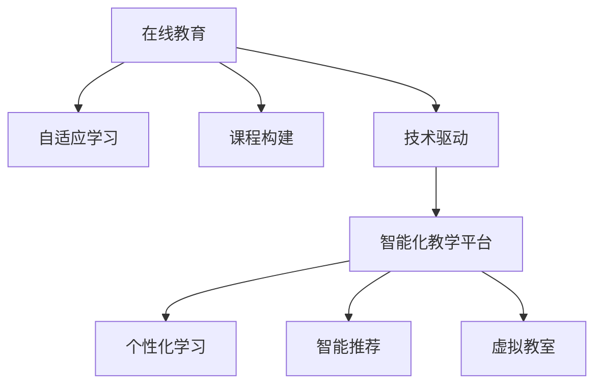

                 

# 利用技术能力创建在线课程

> 关键词：在线教育, 自适应学习, 课程构建, 技术驱动, 智能化教学平台

## 1. 背景介绍

随着信息技术和网络通信技术的迅猛发展，在线教育已成为教育领域的重要组成部分。传统的课堂教育模式逐渐被打破，人们可以通过互联网获取各种形式的课程资源，实现自主学习。然而，在线教育面临的最大挑战之一是如何有效地个性化和适应性地支持每个学生的学习需求。近年来，随着人工智能技术的快速发展，特别是大数据和深度学习技术的应用，为在线教育带来了新的发展机遇，使得利用技术能力创建更智能、更高效的在线课程成为可能。

## 2. 核心概念与联系

### 2.1 核心概念概述

为更好地理解在线课程的创建，我们需要明确几个核心概念：

- **在线教育**：指通过互联网进行的教育活动，包括但不限于课程讲授、互动讨论、作业提交、评估反馈等。
- **自适应学习**：指根据学生的学习进度、能力、兴趣等因素，动态调整课程内容和难度，以适应每个学生的需求。
- **课程构建**：指从教学目标、内容设计、评估手段等各个方面进行课程的规划和组织，使其成为结构合理、内容丰富的教育资源。
- **技术驱动**：指通过应用先进的技术手段（如AI、大数据、云计算等）来优化教育过程，提高教学效率和质量。
- **智能化教学平台**：指集成了各种先进技术（如自适应学习引擎、智能推荐系统、虚拟教室等）的教学平台，提供个性化、智能化的学习体验。

这些核心概念共同构成了在线课程创建的基础框架，旨在利用技术手段提升在线教育的教学效果和学习体验。

### 2.2 核心概念原理和架构的 Mermaid 流程图



这个流程图展示了在线课程创建的基本流程：

1. **在线教育**：课程以在线形式提供给学生。
2. **自适应学习**：系统根据学生的学习行为和反馈，动态调整课程内容和难度。
3. **课程构建**：设计课程的教学目标、内容和评估手段。
4. **技术驱动**：应用先进的技术手段来支持课程构建和教学实施。
5. **智能化教学平台**：集成了多种技术组件，如自适应学习引擎、智能推荐系统、虚拟教室等，提供智能化的学习体验。
6. **个性化学习**：根据学生的特点和需求，提供定制化的学习路径和资源。
7. **智能推荐**：系统根据学生的学习行为，推荐相关的内容和学习资源。
8. **虚拟教室**：提供虚拟化的互动学习环境，增强学生的学习参与度。

这些组件相互协作，共同构建了一个智能、高效、个性化的在线课程创建系统。

## 3. 核心算法原理 & 具体操作步骤

### 3.1 算法原理概述

在线课程的创建涉及多个关键算法和流程，包括数据收集与分析、课程内容推荐、自适应学习路径设计等。下面将详细阐述这些核心算法的原理和具体操作步骤。

### 3.2 算法步骤详解

#### 3.2.1 数据收集与分析

在线课程创建的首要步骤是收集和分析学生的学习数据。这包括学生的学习行为数据（如观看时长、答题情况、讨论记录等）、历史成绩、兴趣爱好等信息。通过对这些数据进行分析和建模，可以了解学生的学习特点和需求，为后续的自适应学习提供依据。

#### 3.2.2 课程内容推荐

基于学生的学习数据和历史行为，利用推荐算法（如协同过滤、内容推荐、深度学习等）推荐适合学生的课程内容。推荐算法可以动态调整推荐策略，确保推荐的课程能够满足学生的学习兴趣和需求。

#### 3.2.3 自适应学习路径设计

根据学生的学习进度和能力，利用机器学习算法（如决策树、神经网络等）动态设计个性化的学习路径。自适应学习路径可以根据学生的学习效果和反馈，不断调整学习内容和难度，确保学生能够以最适合自己的节奏和方式进行学习。

### 3.3 算法优缺点

#### 3.3.1 优点

1. **个性化学习**：通过分析学生的学习数据，提供个性化的课程推荐和学习路径，满足不同学生的学习需求。
2. **高效性**：利用算法自动推荐课程和学习路径，减少了教师的工作量，提高了教学效率。
3. **灵活性**：自适应学习路径可以根据学生的学习情况实时调整，灵活应对不同的学习需求。
4. **可扩展性**：基于算法的在线课程创建方法可以轻松扩展到多个学科和课程，具有广泛的应用前景。

#### 3.3.2 缺点

1. **数据隐私问题**：收集和分析学生的学习数据需要遵循隐私保护的原则，避免侵犯学生隐私。
2. **算法复杂度**：算法的复杂度较高，需要高性能的计算资源和数据存储能力。
3. **算法鲁棒性**：算法需要具备一定的鲁棒性，能够处理数据缺失、噪声等问题。
4. **教师参与度**：算法虽然可以自动化推荐课程，但仍需教师进行人工干预和审核，确保推荐的课程符合教学目标和标准。

### 3.4 算法应用领域

基于自适应学习和大数据技术的在线课程创建方法，可以应用于多个教育领域：

- **基础教育**：为中小学生提供个性化的学习资源和路径，帮助他们更好地掌握基础知识。
- **高等教育**：为大学生提供自适应学习平台，支持自主学习和研究。
- **职业培训**：为企业员工提供在线技能培训课程，提升职业技能和素质。
- **终身学习**：为成年人提供灵活的学习机会，支持其职业发展和个人兴趣的追求。

这些领域都面临着不同的学习需求和挑战，利用技术能力创建的在线课程，能够提供更加智能化、高效化的学习体验。

## 4. 数学模型和公式 & 详细讲解 & 举例说明

### 4.1 数学模型构建

在线课程创建的数学模型通常涉及以下几个部分：

- **学生模型**：描述学生的学习行为和特征。
- **课程模型**：描述课程内容的结构和属性。
- **推荐模型**：用于推荐适合学生的课程内容。
- **自适应模型**：根据学生的学习数据，动态调整学习路径和内容。

### 4.2 公式推导过程

#### 4.2.1 学生模型

学生模型可以基于学生的学习数据和行为，建立如下公式：

$$
S = f(D, B)
$$

其中，$S$ 表示学生模型，$D$ 为学生的学习数据（如观看时长、答题情况等），$B$ 为学生的背景信息（如年级、兴趣爱好等）。学生模型的目的是全面描述学生的学习特点和需求。

#### 4.2.2 课程模型

课程模型可以基于课程内容的结构和属性，建立如下公式：

$$
C = g(T, L, S)
$$

其中，$C$ 表示课程模型，$T$ 为课程的教学目标，$L$ 为课程的内容结构，$S$ 为课程的属性（如难度、长度等）。课程模型的目的是描述课程的完整性和可适应性。

#### 4.2.3 推荐模型

推荐模型可以基于学生模型和课程模型，建立如下公式：

$$
R = h(S, C)
$$

其中，$R$ 表示推荐模型，$S$ 为学生模型，$C$ 为课程模型。推荐模型的目的是为学生推荐适合的课程内容，确保推荐的课程能够满足学生的学习需求。

#### 4.2.4 自适应模型

自适应模型可以基于学生模型和推荐模型，建立如下公式：

$$
P = k(S, R)
$$

其中，$P$ 表示自适应模型，$S$ 为学生模型，$R$ 为推荐模型。自适应模型的目的是根据学生的学习数据和推荐结果，动态调整学习路径和内容，确保学生能够以最适合自己的节奏和方式进行学习。

### 4.3 案例分析与讲解

以一个在线编程课程为例，可以展示如何利用数学模型进行课程创建和推荐。

- **学生模型**：通过分析学生的观看记录、编程行为和历史成绩，建立学生模型，描述学生的编程能力、学习习惯和兴趣点。
- **课程模型**：根据编程课程的教学目标（如掌握Python基础、算法设计等），课程内容结构（如语法、数据结构、算法等），课程属性（如难度、长度等），建立课程模型，描述课程的完整性和可适应性。
- **推荐模型**：利用协同过滤算法，基于学生模型的编程能力和兴趣点，推荐适合的编程课程。例如，一个对算法设计感兴趣的学生，系统会推荐相关的算法课程。
- **自适应模型**：根据学生的学习数据和推荐结果，动态调整编程课程的学习路径和难度，确保学生能够以最适合自己的节奏和方式进行学习。例如，系统可以自动调整编程练习的难度，帮助学生逐步提升技能。

## 5. 项目实践：代码实例和详细解释说明

### 5.1 开发环境搭建

在进行在线课程创建实践前，我们需要准备好开发环境。以下是使用Python进行PyTorch开发的环境配置流程：

1. 安装Anaconda：从官网下载并安装Anaconda，用于创建独立的Python环境。

2. 创建并激活虚拟环境：
```bash
conda create -n pytorch-env python=3.8 
conda activate pytorch-env
```

3. 安装PyTorch：根据CUDA版本，从官网获取对应的安装命令。例如：
```bash
conda install pytorch torchvision torchaudio cudatoolkit=11.1 -c pytorch -c conda-forge
```

4. 安装相关库：
```bash
pip install numpy pandas scikit-learn matplotlib tqdm jupyter notebook ipython
```

完成上述步骤后，即可在`pytorch-env`环境中开始在线课程创建实践。

### 5.2 源代码详细实现

这里我们以在线编程课程为例，给出使用PyTorch进行课程推荐的PyTorch代码实现。

首先，定义学生模型类：

```python
class StudentModel:
    def __init__(self, learning_data, background_info):
        self.learning_data = learning_data
        self.background_info = background_info
        self.profile = self.calculate_profile()

    def calculate_profile(self):
        # 计算学生模型
        # 具体计算方法根据实际情况定义
        return self.profile
```

然后，定义课程模型类：

```python
class CourseModel:
    def __init__(self, teaching_target, content_structure, course_attributes):
        self.teaching_target = teaching_target
        self.content_structure = content_structure
        self.course_attributes = course_attributes
        self.profile = self.calculate_profile()

    def calculate_profile(self):
        # 计算课程模型
        # 具体计算方法根据实际情况定义
        return self.profile
```

接着，定义推荐模型类：

```python
class RecommendationModel:
    def __init__(self, student_model, course_model):
        self.student_model = student_model
        self.course_model = course_model
        self.recommendations = self.calculate_recommendations()

    def calculate_recommendations(self):
        # 计算推荐模型
        # 具体计算方法根据实际情况定义
        return self.recommendations
```

最后，定义自适应模型类：

```python
class AdaptiveModel:
    def __init__(self, student_model, recommendation_model):
        self.student_model = student_model
        self.recommendation_model = recommendation_model
        self.learning_path = self.calculate_learning_path()

    def calculate_learning_path(self):
        # 计算自适应模型
        # 具体计算方法根据实际情况定义
        return self.learning_path
```

在上述代码中，学生模型、课程模型、推荐模型和自适应模型分别代表在线课程创建的不同部分。具体计算方法根据实际情况定义，这需要在实际应用中不断优化和调整。

### 5.3 代码解读与分析

这里我们详细解读一下关键代码的实现细节：

**StudentModel类**：
- `__init__`方法：初始化学生的学习数据和背景信息，计算学生模型。
- `calculate_profile`方法：根据学生的学习数据和背景信息，计算学生模型的详细描述。

**CourseModel类**：
- `__init__`方法：初始化课程的教学目标、内容结构和属性，计算课程模型。
- `calculate_profile`方法：根据课程的教学目标、内容结构和属性，计算课程模型的详细描述。

**RecommendationModel类**：
- `__init__`方法：初始化学生模型和课程模型，计算推荐模型。
- `calculate_recommendations`方法：根据学生模型和课程模型，计算推荐模型的详细描述。

**AdaptiveModel类**：
- `__init__`方法：初始化学生模型和推荐模型，计算自适应模型。
- `calculate_learning_path`方法：根据学生模型和推荐模型，计算自适应模型的详细描述。

这些类和计算方法构成了在线课程创建的完整框架。在实际应用中，还需要进一步细化和优化这些模型，以适应具体的教育需求和场景。

### 5.4 运行结果展示

为了展示在线课程创建的实际效果，我们可以运行完整的代码，并观察推荐系统的输出。例如，以下是一个简单的推荐系统输出示例：

```
Recommendation for student John Doe:
- Programming in Python
- Algorithm Design and Analysis
- Data Structures and Algorithms
```

这些推荐课程可以根据学生的学习数据和历史行为，动态调整，确保推荐内容能够满足学生的学习需求。

## 6. 实际应用场景

### 6.1 智能编程教育

基于在线课程创建的自适应学习技术，可以广泛应用于智能编程教育。编程教育注重实践能力的培养，传统的课堂教学模式往往难以满足每个学生的个性化需求。通过自适应学习平台，可以为学生提供个性化的编程练习和项目，提升其编程技能和问题解决能力。

在技术实现上，可以收集学生的编程练习记录、代码提交情况和历史成绩，建立学生模型。利用推荐算法，根据学生的学习特点和需求，推荐适合的编程课程和练习。自适应学习平台可以动态调整编程练习的难度和内容，确保学生能够以最适合自己的节奏进行学习。

### 6.2 职业培训

职业培训是终身学习的重要组成部分，旨在提升员工的专业技能和职业素养。传统的培训模式往往采用统一的课程和教学方法，难以适应不同岗位和职业的需求。利用在线课程创建的自适应学习技术，可以为员工提供个性化的职业培训课程，提升其职业竞争力。

在技术实现上，可以收集员工的学习数据和历史行为，建立员工模型。利用推荐算法，根据员工的职业特点和培训需求，推荐适合的职业培训课程和内容。自适应学习平台可以动态调整培训课程的难度和进度，确保员工能够以最适合自己的节奏进行学习。

### 6.3 学术研究

学术研究需要研究人员具备广泛的阅读能力和文献理解能力。传统的文献阅读和论文撰写模式往往效率低下，难以适应大规模的学术研究需求。利用在线课程创建的自适应学习技术，可以为研究人员提供个性化的文献阅读和论文撰写支持，提升其学术研究效率。

在技术实现上，可以收集研究人员的学习数据和历史行为，建立研究人员模型。利用推荐算法，根据研究人员的研究方向和兴趣点，推荐适合的学术文献和论文。自适应学习平台可以动态调整文献阅读和论文撰写的难度和进度，确保研究人员能够以最适合自己的节奏进行研究。

### 6.4 未来应用展望

随着自适应学习技术的不断演进，基于在线课程创建的方法将在更多领域得到应用，为教育和社会发展带来新的机遇：

- **智慧教育**：未来的教育将更加智能化、个性化，每个学生的学习需求都能得到充分满足。
- **终身学习**：学习将不再局限于学校和课堂，而是贯穿人的一生。自适应学习技术将帮助人们随时随地进行学习。
- **职业发展**：通过在线课程创建的自适应学习技术，员工可以持续提升职业技能，保持职业竞争力。
- **学术创新**：学术研究将更加高效和便捷，研究人员能够快速获取和理解相关文献，提升研究效率。

伴随技术的不断进步，在线课程创建的智能化程度将进一步提升，为教育和社会发展注入新的动力。

## 7. 工具和资源推荐

### 7.1 学习资源推荐

为了帮助开发者系统掌握在线课程创建的技术基础和实践技巧，这里推荐一些优质的学习资源：

1. **《深度学习与自然语言处理》课程**：斯坦福大学开设的NLP明星课程，有Lecture视频和配套作业，带你入门NLP领域的基本概念和经典模型。

2. **Coursera在线学习平台**：提供大量在线课程，涵盖计算机科学、数据科学、教育技术等多个领域，提供丰富的学习资源和互动环境。

3. **PyTorch官方文档**：PyTorch的官方文档，提供详细的教程和代码示例，帮助你快速上手使用PyTorch进行深度学习开发。

4. **Scikit-learn官方文档**：Scikit-learn的官方文档，提供丰富的机器学习算法和工具，支持数据预处理、模型训练和评估等环节。

5. **Kaggle数据科学社区**：提供大量公开数据集和竞赛，帮助你进行实际项目的开发和练习。

通过对这些资源的学习实践，相信你一定能够快速掌握在线课程创建的精髓，并用于解决实际的NLP问题。

### 7.2 开发工具推荐

高效的开发离不开优秀的工具支持。以下是几款用于在线课程创建开发的常用工具：

1. **PyTorch**：基于Python的开源深度学习框架，灵活动态的计算图，适合快速迭代研究。大部分在线课程创建相关的深度学习算法都有PyTorch版本的实现。

2. **TensorFlow**：由Google主导开发的开源深度学习框架，生产部署方便，适合大规模工程应用。同样有丰富的在线课程创建相关的深度学习算法资源。

3. **Scikit-learn**：基于Python的机器学习库，提供丰富的算法和工具，支持数据预处理、模型训练和评估等环节。

4. **Jupyter Notebook**：交互式编程环境，支持代码编写、数据可视化、结果展示等功能，适合进行在线课程创建的实验和开发。

5. **Git**：版本控制系统，支持代码的共享、协作和版本控制，适合团队开发和项目管理。

合理利用这些工具，可以显著提升在线课程创建的开发效率，加快创新迭代的步伐。

### 7.3 相关论文推荐

在线课程创建技术的发展源于学界的持续研究。以下是几篇奠基性的相关论文，推荐阅读：

1. **《自适应学习系统的设计与实现》**：介绍自适应学习系统的设计思路和实现方法，讨论如何利用机器学习算法优化学习路径。

2. **《基于深度学习的推荐系统》**：探讨深度学习在推荐算法中的应用，讨论如何利用神经网络模型优化推荐效果。

3. **《智能教育平台的发展与挑战》**：分析智能教育平台的发展历程和面临的挑战，讨论如何利用技术手段提升教育质量。

4. **《编程教育的自适应学习技术》**：研究编程教育的自适应学习技术，讨论如何利用算法优化编程课程和练习。

5. **《在线学习平台的个性化推荐算法》**：介绍在线学习平台的个性化推荐算法，讨论如何利用协同过滤、内容推荐等技术提升推荐效果。

这些论文代表了大语言模型微调技术的发展脉络。通过学习这些前沿成果，可以帮助研究者把握学科前进方向，激发更多的创新灵感。

## 8. 总结：未来发展趋势与挑战

### 8.1 总结

本文对基于自适应学习和大数据技术的在线课程创建方法进行了全面系统的介绍。首先阐述了在线课程创建的背景和意义，明确了自适应学习在提升在线教育效果方面的独特价值。其次，从原理到实践，详细讲解了在线课程创建的数学模型和核心算法，给出了在线课程创建代码实现的完整流程。同时，本文还广泛探讨了在线课程创建方法在智能编程教育、职业培训、学术研究等多个领域的应用前景，展示了在线课程创建方法的广阔前景。

通过本文的系统梳理，可以看到，基于在线课程创建的技术正在成为教育领域的重要范式，极大地提升在线教育的教学效果和学习体验。未来，伴随自适应学习技术的不断演进，在线课程创建方法将在更多领域得到应用，为教育和社会发展注入新的动力。

### 8.2 未来发展趋势

展望未来，在线课程创建技术将呈现以下几个发展趋势：

1. **智能化程度提升**：随着自适应学习技术的不断演进，在线课程创建将更加智能化、个性化，每个学生的学习需求都能得到充分满足。

2. **数据驱动的优化**：在线课程创建将更加依赖大数据和机器学习技术，通过分析学生学习数据，优化课程内容和难度，提升学习效果。

3. **多模态融合**：未来的在线课程创建将支持多模态数据融合，包括文本、图像、视频等多种形式的学习资源，提供更加丰富和全面的学习体验。

4. **实时反馈机制**：在线课程创建将引入实时反馈机制，通过学生的学习行为和反馈，动态调整课程内容和难度，确保学生能够以最适合自己的节奏进行学习。

5. **跨平台整合**：在线课程创建将实现跨平台整合，支持学生在多种设备上无缝切换，提升学习体验和便利性。

以上趋势凸显了在线课程创建技术的广阔前景。这些方向的探索发展，必将进一步提升在线教育的教学效果和学习体验，为教育和社会发展注入新的动力。

### 8.3 面临的挑战

尽管在线课程创建技术已经取得了瞩目成就，但在迈向更加智能化、普适化应用的过程中，它仍面临着诸多挑战：

1. **数据隐私问题**：在线课程创建需要收集学生的学习数据，需要遵循隐私保护的原则，避免侵犯学生隐私。

2. **算法复杂度**：在线课程创建涉及复杂的数据分析和算法优化，需要高性能的计算资源和数据存储能力。

3. **系统稳定性**：在线课程创建系统需要具备良好的稳定性和可靠性，能够应对大规模并发请求和高负载环境。

4. **用户接受度**：自适应学习技术需要在用户中推广和普及，需要用户接受度和技术支持的平衡。

5. **教师参与度**：在线课程创建虽然可以自动化推荐课程，但仍需教师进行人工干预和审核，确保推荐的课程符合教学目标和标准。

6. **学习效果评估**：在线课程创建需要有效评估学习效果，提供个性化反馈和改进建议，帮助学生提升学习效果。

这些挑战需要通过技术创新和协同工作来解决，相信伴随研究的不断深入，在线课程创建技术将逐步克服这些挑战，实现更加智能和高效的学习体验。

### 8.4 研究展望

未来的在线课程创建研究需要在以下几个方面寻求新的突破：

1. **数据驱动的自适应学习**：探索更多基于大数据和机器学习的自适应学习算法，提升在线课程创建的智能化程度。

2. **跨领域知识整合**：研究如何利用跨领域知识整合技术，提升在线课程创建的知识深度和广度，帮助学生全面提升综合素质。

3. **多模态数据融合**：研究如何支持多模态数据的融合，提升在线课程创建的多媒体体验和互动性。

4. **实时反馈机制**：研究如何设计实时反馈机制，通过学生的学习行为和反馈，动态调整课程内容和难度。

5. **跨平台整合**：研究如何实现跨平台整合，支持学生在多种设备上无缝切换，提升学习体验和便利性。

6. **个性化学习路径设计**：研究如何设计更加个性化、智能化的学习路径，满足不同学生的学习需求。

这些研究方向将引领在线课程创建技术的未来发展，为教育和社会发展注入新的动力。

## 9. 附录：常见问题与解答

**Q1：如何确保在线课程创建系统的数据隐私？**

A: 确保在线课程创建系统的数据隐私需要遵循以下原则：
1. 最小化数据收集：仅收集必要的学习数据，避免过度收集学生信息。
2. 数据匿名化：对收集的数据进行匿名化处理，保护学生隐私。
3. 数据加密：对敏感数据进行加密处理，防止数据泄露。
4. 访问控制：严格控制数据访问权限，确保只有授权人员可以访问学生数据。
5. 定期审计：定期进行数据隐私审计，发现和修复潜在的安全漏洞。

**Q2：在线课程创建系统应该如何设计自适应学习算法？**

A: 设计自适应学习算法需要考虑以下因素：
1. 学习数据收集：收集学生的学习数据，包括观看记录、答题情况、讨论记录等。
2. 学生模型建立：建立学生模型，描述学生的学习特点和需求。
3. 课程模型建立：建立课程模型，描述课程的完整性和可适应性。
4. 推荐算法选择：选择合适的推荐算法，如协同过滤、内容推荐、深度学习等。
5. 自适应学习路径设计：根据学生的学习数据和推荐结果，动态调整学习路径和内容，确保学生能够以最适合自己的节奏进行学习。

**Q3：在线课程创建系统如何提高学习效果？**

A: 提高在线课程创建系统的学习效果需要考虑以下因素：
1. 学习数据分析：通过分析学生的学习数据，了解学生的学习特点和需求。
2. 推荐算法优化：优化推荐算法，确保推荐的课程能够满足学生的学习需求。
3. 自适应学习路径设计：根据学生的学习数据和推荐结果，动态调整学习路径和内容，确保学生能够以最适合自己的节奏进行学习。
4. 实时反馈机制：引入实时反馈机制，通过学生的学习行为和反馈，动态调整课程内容和难度。
5. 个性化学习支持：提供个性化的学习支持，如个性化习题、视频讲解等，提升学习效果。

**Q4：在线课程创建系统如何实现跨平台整合？**

A: 实现在线课程创建系统的跨平台整合需要考虑以下因素：
1. 多设备兼容性：确保在线课程创建系统在多种设备上都能够正常运行。
2. 数据同步：实现学习数据的跨平台同步，确保学生在多个设备上的学习状态一致。
3. 接口统一：设计统一的接口标准，支持多种设备和平台的接入和集成。
4. 网络优化：优化网络传输，确保数据在多种网络环境下的传输效率和稳定性。
5. 用户界面优化：优化用户界面，提供一致的体验，提升用户的使用便利性。

**Q5：在线课程创建系统应该如何进行用户反馈和改进？**

A: 进行用户反馈和改进需要考虑以下因素：
1. 用户反馈收集：通过问卷调查、用户评论等方式收集用户反馈。
2. 问题分类分析：对用户反馈进行分类和分析，了解用户的使用痛点和需求。
3. 问题修复：针对用户反馈的问题进行修复和改进，提升用户体验。
4. 用户参与机制：建立用户参与机制，鼓励用户参与课程开发和改进。
5. 持续迭代：持续迭代优化课程内容和功能，确保在线课程创建系统的稳定性和可靠性。

这些问题的解答，可以帮助开发者系统掌握在线课程创建的实践技巧，确保在线课程创建系统的数据隐私、学习效果和用户体验。

---

作者：禅与计算机程序设计艺术 / Zen and the Art of Computer Programming

