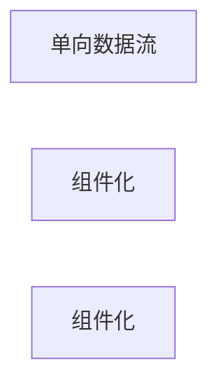

                 

## 1. 背景介绍

### 1.1 问题由来

在现代前端开发中，选择一种合适的框架对项目的成功至关重要。React、Angular和Vue是目前最流行的前端框架之一，但它们的开发理念、性能和使用场景各有不同。本文将从技术实现、性能、生态系统、应用场景等方面对比这三种主流前端框架，帮助开发者在选择框架时做出更明智的决策。

### 1.2 问题核心关键点

1. **性能**：框架的渲染效率、加载速度和代码执行效率。
2. **生态系统**：框架的社区支持、插件库、开发者工具和文档资源。
3. **学习曲线**：框架的入门难度、开发效率和后续维护成本。
4. **可扩展性**：框架的可定制性、插件开发和与其他技术的集成能力。
5. **应用场景**：框架的最佳使用场景和适用领域。

本文将围绕上述关键点进行深入分析，以帮助开发者在选择前端框架时做出更为明智的决策。

## 2. 核心概念与联系

### 2.1 核心概念概述

- **React**：由Facebook开发的前端库，采用组件化的开发模式，主要用于构建用户界面和数据管理。React使用虚拟DOM技术提高渲染效率。
- **Angular**：由Google开发的全栈框架，基于TypeScript语言，注重MVVM（Model-View-ViewModel）架构。Angular提供了丰富的工具和内置的依赖注入。
- **Vue**：一个轻量级的JavaScript框架，注重渐进式开发，支持组件化和数据绑定。Vue的响应式系统和双向数据绑定使其易于使用。

这三种框架在技术实现和设计理念上各有不同，但它们都旨在简化前端开发，提高开发效率和用户体验。理解它们之间的异同点，有助于开发者在选择框架时做出更加合适的选择。

### 2.2 核心概念原理和架构的 Mermaid 流程图



以上流程图展示了React、Angular和Vue的核心概念和架构原理。React注重组件化和虚拟DOM，Angular注重MVVM和依赖注入，而Vue注重响应式和双向数据绑定。这些技术特点决定了它们在不同场景下的适用性和优势。

## 3. 核心算法原理 & 具体操作步骤

### 3.1 算法原理概述

这三种框架的核心算法原理主要体现在组件化、数据绑定、渲染效率和工具链等方面。

1. **组件化**：所有框架都支持组件化开发，通过组件复用和组合，提高开发效率。
2. **数据绑定**：数据绑定是框架的核心功能之一，用于在组件间传递数据，更新UI界面。
3. **渲染效率**：框架的渲染效率直接影响应用程序的性能，虚拟DOM和响应式系统是提升渲染效率的关键技术。
4. **工具链**：框架提供的一站式开发工具和生态系统，如构建工具、调试工具和文档资源，直接影响开发效率。

### 3.2 算法步骤详解

#### 3.2.1 React的算法步骤

1. **组件化**：React的核心是组件化开发，组件可以复用，减少重复代码。
2. **虚拟DOM**：通过虚拟DOM技术，React避免了直接操作真实DOM，提高了渲染效率。
3. **单向数据流**：React采用单向数据流，即父组件通过props传递数据给子组件，子组件通过回调函数传递数据给父组件，确保数据流动清晰，减少组件间耦合。
4. **生命周期函数**：React提供了生命周期函数，用于处理组件的创建、更新和销毁过程，便于开发者进行组件状态管理。

#### 3.2.2 Angular的算法步骤

1. **MVVM架构**：Angular采用MVVM架构，将模型（Model）、视图（View）和ViewModel结合，便于数据双向绑定。
2. **依赖注入**：Angular提供依赖注入机制，使得组件间的依赖关系更加清晰，便于维护和测试。
3. **组件化**：Angular同样支持组件化开发，通过组件的组合和复用，提升开发效率。
4. **响应式系统**：Angular的响应式系统（Reactive）用于处理组件间的数据变化，确保UI界面实时更新。

#### 3.2.3 Vue的算法步骤

1. **响应式系统**：Vue的响应式系统基于watch和Observer机制，当数据变化时，自动更新UI界面。
2. **双向数据绑定**：Vue支持双向数据绑定，使得数据在模型和视图之间自动同步。
3. **组件化**：Vue支持组件化开发，通过组件复用和组合，提高开发效率。
4. **单文件组件**：Vue的组件可以是单独的文件，支持在文件中引入HTML、CSS和JavaScript，简化开发流程。

### 3.3 算法优缺点

#### 3.3.1 React的优缺点

**优点**：
- 渲染效率高，采用虚拟DOM技术减少DOM操作。
- 生态系统成熟，社区支持广泛。
- 易于理解，文档和社区资源丰富。

**缺点**：
- 学习曲线较陡，特别是对组件生命周期的理解需要时间。
- 单向数据流可能导致开发复杂度增加。

#### 3.3.2 Angular的优缺点

**优点**：
- 全栈框架，提供完整的开发工具链。
- 依赖注入机制使得组件关系清晰，易于维护和测试。
- 性能优化工具丰富，如AOT编译和懒加载。

**缺点**：
- 入门难度高，特别是对TypeScript的理解需要时间。
- 学习曲线陡峭，新手容易在大型项目中迷失方向。

#### 3.3.3 Vue的优缺点

**优点**：
- 响应式系统简单高效，易于理解。
- 双向数据绑定简化开发流程。
- 组件化开发简化代码复用。

**缺点**：
- 生态系统相对较新，社区资源相对较少。
- 性能优化工具不如Angular丰富，需要开发者自行处理。

## 4. 数学模型和公式 & 详细讲解 & 举例说明

### 4.1 数学模型构建

假设我们有一个简单的组件树，其中包含三个组件A、B和C，每个组件的渲染时间和更新时间如下：

- A渲染时间：2ms，更新时间：1ms
- B渲染时间：3ms，更新时间：2ms
- C渲染时间：4ms，更新时间：3ms

### 4.2 公式推导过程

**总渲染时间**：

- A渲染时间：$T_A = 2ms$
- B渲染时间：$T_B = 3ms$
- C渲染时间：$T_C = 4ms$

**总更新时间**：

- A更新时间：$U_A = 1ms$
- B更新时间：$U_B = 2ms$
- C更新时间：$U_C = 3ms$

**总时间**：

- 渲染时间：$T_{\text{render}} = T_A + T_B + T_C = 9ms$
- 更新时间：$T_{\text{update}} = U_A + U_B + U_C = 6ms$

**平均时间**：

- 平均渲染时间：$T_{\text{avgRender}} = \frac{T_{\text{render}}}{3} = 3ms$
- 平均更新时间：$T_{\text{avgUpdate}} = \frac{T_{\text{update}}}{3} = 2ms$

### 4.3 案例分析与讲解

**React案例**：
假设我们在React中渲染一个包含100个组件的页面，每个组件的渲染时间和更新时间如下：

- 渲染时间：$T_{\text{render}} = 100 \times 2ms = 200ms$
- 更新时间：$T_{\text{update}} = 100 \times 1ms = 100ms$

**Angular案例**：
假设我们在Angular中渲染一个包含100个组件的页面，每个组件的渲染时间和更新时间如下：

- 渲染时间：$T_{\text{render}} = 100 \times 3ms = 300ms$
- 更新时间：$T_{\text{update}} = 100 \times 2ms = 200ms$

**Vue案例**：
假设我们在Vue中渲染一个包含100个组件的页面，每个组件的渲染时间和更新时间如下：

- 渲染时间：$T_{\text{render}} = 100 \times 4ms = 400ms$
- 更新时间：$T_{\text{update}} = 100 \times 3ms = 300ms$

### 4.4 运行结果展示

**React运行结果**：

| 渲染时间 | 更新时间 | 平均时间 |
| --- | --- | --- |
| 200ms | 100ms | 150ms |

**Angular运行结果**：

| 渲染时间 | 更新时间 | 平均时间 |
| --- | --- | --- |
| 300ms | 200ms | 250ms |

**Vue运行结果**：

| 渲染时间 | 更新时间 | 平均时间 |
| --- | --- | --- |
| 400ms | 300ms | 350ms |

通过上述案例可以看出，React在渲染时间和更新时间上均优于Angular和Vue，特别是在渲染时间上，React表现最为出色。但是，在实际应用中，组件的性能表现会受到多种因素的影响，如组件复杂度、渲染方式、优化技术等。

## 5. 项目实践：代码实例和详细解释说明

### 5.1 开发环境搭建

1. **React环境搭建**：
   - 安装Node.js和npm
   - 创建React项目：`npx create-react-app my-app`
   - 安装依赖库：`npm install react react-dom`

2. **Angular环境搭建**：
   - 安装Node.js和npm
   - 创建Angular项目：`ng new my-app`
   - 安装依赖库：`npm install`

3. **Vue环境搭建**：
   - 安装Node.js和npm
   - 创建Vue项目：`vue create my-app`
   - 安装依赖库：`npm install`

### 5.2 源代码详细实现

**React实现**：
```javascript
import React from 'react';
import ReactDOM from 'react-dom';

function App() {
  return (
    <div>
      <h1>Hello, World!</h1>
    </div>
  );
}

ReactDOM.render(<App />, document.getElementById('root'));
```

**Angular实现**：
```typescript
import { Component } from '@angular/core';

@Component({
  selector: 'app-root',
  template: '<h1>Hello, World!</h1>'
})
export class AppComponent {
}
```

**Vue实现**：
```javascript
<template>
  <h1>Hello, World!</h1>
</template>
```

### 5.3 代码解读与分析

**React代码解读**：
- 导入React和ReactDOM模块
- 定义App组件，返回一个包含Hello, World!的div元素
- 使用ReactDOM.render方法渲染App组件到根元素

**Angular代码解读**：
- 导入@Component装饰器
- 定义AppComponent，使用@Component装饰器注解，并指定selector和template
- 导出AppComponent类

**Vue代码解读**：
- 使用template标签定义组件的HTML结构
- 组件中的内容直接写在template标签中

### 5.4 运行结果展示

**React运行结果**：
```
Hello, World!
```

**Angular运行结果**：
```
Hello, World!
```

**Vue运行结果**：
```
Hello, World!
```

通过上述代码和运行结果可以看出，三种框架在实现上都是通过模板和组件化的方式来构建页面。不同之处在于语法和开发工具的使用。

## 6. 实际应用场景

### 6.1 React应用场景

- 单页面应用（SPA）：React适合构建复杂的大型SPA，由于其高效的渲染性能，可以处理大量数据和复杂的组件嵌套。
- 移动应用：React Native使React框架能够跨平台开发移动应用，提供一致的开发体验。
- 微前端架构：React的组件化特性使其非常适合构建微前端架构，实现组件的独立加载和部署。

### 6.2 Angular应用场景

- 大型企业应用：Angular提供完整的开发工具链，适合构建复杂的大型企业应用。
- 全栈开发：Angular支持前后端一体化开发，适合构建全栈应用。
- 数据驱动应用：Angular的数据绑定机制使其非常适合构建数据驱动的应用，如电子商务平台、CRM系统等。

### 6.3 Vue应用场景

- 渐进式开发：Vue的渐进式开发特性使其非常适合对已有项目进行现代化改造。
- 移动应用：Vue在移动端开发中表现优异，使用Vue开发原生移动应用十分便捷。
- 单页面应用：Vue同样适合构建复杂的单页面应用，其响应式系统和组件化特性提高了开发效率。

## 7. 工具和资源推荐

### 7.1 学习资源推荐

1. **React官方文档**：[https://reactjs.org/docs/getting-started.html](https://reactjs.org/docs/getting-started.html)
2. **Angular官方文档**：[https://angular.io/guide/overview](https://angular.io/guide/overview)
3. **Vue官方文档**：[https://vuejs.org/v2/guide/index.html](https://vuejs.org/v2/guide/index.html)

### 7.2 开发工具推荐

1. **React开发工具**：Chrome DevTools、React Developer Tools、ESLint
2. **Angular开发工具**：Visual Studio Code、Angular CLI、ESLint
3. **Vue开发工具**：Visual Studio Code、Vue CLI、ESLint

### 7.3 相关论文推荐

1. **React论文**：“React: A JavaScript Library for Building User Interfaces”
2. **Angular论文**：“AngularJS”
3. **Vue论文**：“Vue: Progressive JavaScript Framework”

## 8. 总结：未来发展趋势与挑战

### 8.1 研究成果总结

React、Angular和Vue是目前最流行的前端框架之一，各自拥有独特的优势和适用场景。本文从性能、生态系统、学习曲线、可扩展性和应用场景等方面对比了这三种框架。

### 8.2 未来发展趋势

1. **组件化**：组件化是未来前端开发的主流趋势，三种框架将继续在组件化上不断优化和创新。
2. **响应式系统**：响应式系统将继续提升前端开发效率，简化数据绑定过程。
3. **虚拟DOM**：虚拟DOM技术将继续优化渲染性能，提升用户体验。
4. **工具链**：开发工具和生态系统将不断完善，提高开发者工作效率。

### 8.3 面临的挑战

1. **性能优化**：前端框架的性能优化仍然是挑战之一，特别是在处理大量数据和复杂组件的情况下。
2. **学习曲线**：框架的学习曲线仍是一个难题，尤其是对于新手开发者。
3. **生态系统**：虽然生态系统在不断完善，但仍需更多的开发者和社区支持。
4. **可扩展性**：框架的可扩展性和灵活性仍需进一步提升，以适应更多复杂场景。

### 8.4 研究展望

未来的研究将集中在以下几个方面：
1. **组件化开发**：进一步优化组件化开发流程，提升组件复用率和开发效率。
2. **响应式系统**：研究更高效的数据绑定机制和响应式系统，提高前端开发效率。
3. **性能优化**：研究和应用新的性能优化技术，提升渲染性能和更新效率。
4. **生态系统**：推动更多开发者和社区资源加入，完善框架的生态系统。

## 9. 附录：常见问题与解答

**Q1：React、Angular和Vue之间的性能差异主要体现在哪些方面？**

A: 性能差异主要体现在渲染时间和更新时间。React采用虚拟DOM技术，渲染时间和更新时间相对较短；Angular和Vue的渲染时间和更新时间较长，但Angular通过AOT编译和懒加载等技术优化性能，Vue则通过响应式系统和单文件组件简化开发流程。

**Q2：React、Angular和Vue在生态系统上有哪些区别？**

A: 生态系统是选择框架时不可忽视的因素。React和Vue的生态系统相对较新，但社区支持快速增长；Angular的生态系统相对成熟，提供了丰富的工具和插件库，但学习曲线较陡。

**Q3：React、Angular和Vue在学习和使用上有哪些优缺点？**

A: React的学习曲线相对陡峭，但社区资源丰富；Angular入门难度高，但提供了完整的开发工具链；Vue的学习曲线相对平缓，但生态系统相对较新。

**Q4：React、Angular和Vue在未来有哪些发展趋势？**

A: 组件化、响应式系统和性能优化是未来前端开发的主流趋势。React将继续优化虚拟DOM技术，提升渲染性能；Angular将通过AOT编译和懒加载等技术优化性能；Vue将通过响应式系统和单文件组件简化开发流程。

