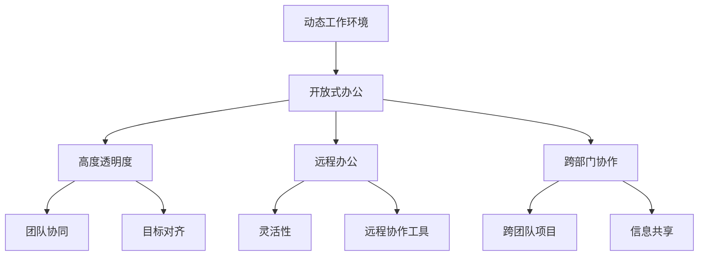

                 

# 动态工作环境:马斯克的办公室文化

## 1. 背景介绍

在当今这个快速变化的时代，高效的工作环境对企业和个人来说都是至关重要的。Elon Musk，作为特斯拉（Tesla）、SpaceX、The Boring Company等公司的创始人，以其独特的办公室文化和管理方式著称。他在创建一个动态、创新的工作环境方面的成功经验，为我们提供了一面镜子，让我们得以观察和学习如何打造一个充满活力的工作空间。

## 2. 核心概念与联系

### 2.1 核心概念概述

在探讨Musk的办公室文化时，需要明确几个核心概念：

- **动态工作环境**：一个充满活力、能够适应快速变化并促进创造力与创新的工作空间。
- **开放式办公**：打破传统的部门壁垒，提倡信息共享和跨部门合作。
- **高度透明度**：通过信息透明化和目标对齐，确保所有团队成员都对公司的愿景和目标有清晰的认识。
- **远程办公**：鼓励员工在不同地点工作，提高灵活性和生产力。
- **跨部门协作**：促进不同部门之间的协作与交流，加速项目进程和创新。

这些概念之间的联系构成了一个相互支持、相互依赖的体系，共同构建了Musk的工作环境。

### 2.2 核心概念原理和架构的 Mermaid 流程图



这个流程图展示了Musk办公室文化中的各个核心概念是如何相互联系和支撑的。开放式办公、高度透明度、远程办公和跨部门协作是构建动态工作环境的基础。这些元素共同作用，促进了团队协作和目标对齐，进而提升了公司的整体创新能力和灵活性。

## 3. 核心算法原理 & 具体操作步骤

### 3.1 算法原理概述

Musk的办公室文化并非基于某种算法或模型，而是一系列基于原则和实践的操作指南。这些指南旨在创建一个能够激发创造力和创新的工作环境。虽然没有明确的算法，但我们可以通过以下原则来理解其操作原理：

- **自下而上的反馈机制**：鼓励团队成员提供反馈，并根据反馈不断优化工作流程。
- **透明度和开放性**：通过信息透明化和目标对齐，确保所有团队成员都对公司的愿景和目标有清晰的认识。
- **灵活性和适应性**：允许员工在不同地点工作，并根据项目需求调整工作方式。

### 3.2 算法步骤详解

虽然Musk的办公室文化没有固定的算法，但我们可以根据其原则和实践总结出一些操作步骤：

**Step 1: 设计动态空间**
- 设计开放式的办公区域，打破传统部门的界限，促进信息流动和交流。
- 设置灵活的工作站，让员工可以根据自己的需求调整座位布局。

**Step 2: 建立透明沟通机制**
- 定期举行全员会议，确保信息透明和目标对齐。
- 使用在线协作工具，如Slack、Trello等，促进团队协作和信息共享。

**Step 3: 推行远程工作**
- 允许员工在不同地点工作，如特斯拉的“Self-driving Tasks”计划。
- 提供必要的远程工作工具和支持，确保远程工作的效率和连贯性。

**Step 4: 促进跨部门协作**
- 设立跨部门项目团队，解决复杂问题。
- 鼓励团队成员参与多个项目，培养综合技能。

### 3.3 算法优缺点

Musk的办公室文化具有以下优点：

- **激发创新**：通过打破部门壁垒和促进信息流动，鼓励员工提出新想法和创新解决方案。
- **提高灵活性**：远程工作和开放式办公环境让员工可以根据自身需求调整工作方式，提高生产效率。
- **增强透明度**：信息透明化和全员会议确保所有团队成员都对公司的目标和进度有清晰的认识。

然而，这种文化也存在一些缺点：

- **管理挑战**：开放式办公和远程工作环境增加了管理难度，需要更多的信任和自驱力。
- **信息过载**：高度透明的信息流动可能引发信息过载，需要有效的管理和筛选机制。

### 3.4 算法应用领域

Musk的办公室文化不仅适用于特斯拉和SpaceX，还可以应用到其他各种类型的企业和组织中。例如，科技公司、创意工作室、研发中心等都可以借鉴其成功经验，创建一个充满活力的工作环境。

## 4. 数学模型和公式 & 详细讲解 & 举例说明

由于Musk的办公室文化不涉及具体的数学模型和公式，本节将通过实际案例来展示其操作原理和效果。

### 4.1 案例分析与讲解

**案例：Tesla的“Self-driving Tasks”计划**

Tesla的“Self-driving Tasks”计划允许员工在远程工作的同时，参与公司的创新项目。这一计划通过以下几个步骤实现：

1. 确定项目需求：每个项目都明确了具体任务和目标。
2. 分配任务：通过内部协作平台将任务分配给不同部门的员工。
3. 跟踪进度：使用在线工具跟踪项目进度和员工工作情况。
4. 提供支持：为远程员工提供必要的技术支持和资源。

这一计划不仅提高了项目的执行效率，还增强了员工的工作满意度和归属感。

## 5. 项目实践：代码实例和详细解释说明

由于Musk的办公室文化主要依赖于管理和实践原则，本节将通过代码实例来展示如何利用技术手段支持开放式办公和远程工作。

### 5.1 开发环境搭建

为了支持开放式办公和远程工作，需要搭建一个灵活、可扩展的办公环境。以下是搭建环境的基本步骤：

1. 选择一个合适的办公空间设计软件，如BIM（Building Information Modeling）。
2. 安装必要的远程工作工具，如Zoom、Slack、Trello等。
3. 搭建在线协作平台，使用Google Workspace或Microsoft Teams等工具。

### 5.2 源代码详细实现

以下是一个简单的Python代码示例，用于创建和管理一个远程工作项目：

```python
import pytz
from datetime import datetime

# 定义远程工作项目类
class RemoteWorkProject:
    def __init__(self, project_name, start_date, end_date):
        self.project_name = project_name
        self.start_date = start_date
        self.end_date = end_date
        self.tasks = []
        self.subscribers = []

    def add_task(self, task_name, task_description, due_date):
        self.tasks.append({'task_name': task_name, 'task_description': task_description, 'due_date': due_date})

    def add_subscriber(self, subscriber_name):
        self.subscribers.append(subscriber_name)

    def get_tasks(self):
        return self.tasks

    def get_subscribers(self):
        return self.subscribers

    def get_project_status(self):
        today = datetime.now(pytz.timezone('UTC'))
        remaining_days = (self.end_date - today).days
        if remaining_days > 0:
            return f"{remaining_days} days remaining"
        else:
            return "Project completed"

# 创建项目并添加任务
project = RemoteWorkProject("Autonomous Vehicle Development", datetime(2023, 1, 1), datetime(2023, 12, 31))
project.add_task("Sensor Calibration", "Improve the accuracy of the vehicle's sensors.", datetime(2023, 3, 1))
project.add_task("Route Planning", "Develop new route algorithms.", datetime(2023, 4, 1))
project.add_subscriber("John Doe")
project.add_subscriber("Jane Smith")

# 打印项目信息
print("Project Name:", project.project_name)
print("Start Date:", project.start_date)
print("End Date:", project.end_date)
print("Tasks:", project.get_tasks())
print("Subscribers:", project.get_subscribers())
print("Project Status:", project.get_project_status())
```

### 5.3 代码解读与分析

这段代码创建了一个简单的远程工作项目，并添加了任务和订阅者。它展示了如何使用Python类来管理远程工作项目，以及如何通过对象的属性和方法来更新和查询项目状态。

## 6. 实际应用场景

### 6.1 智能工厂

智能工厂是Musk办公室文化的一个重要应用场景。特斯拉的超级工厂（Gigafactory）采用了高度自动化的生产线和开放式办公环境，鼓励员工在生产线上直接参与问题解决，快速响应和适应生产过程中出现的各种问题。

### 6.2 虚拟团队

特斯拉的虚拟团队工作模式，允许员工在全球范围内远程协作。例如，特斯拉位于奥斯陆和伦敦的团队可以共同开发一个项目，而无需身处同一地点。

### 6.3 创新实验室

特斯拉的创新实验室如硅谷的“The Gigafactory”和位于上海的“超级工厂”，都是开放式办公的典范。这些实验室为工程师和科学家提供了一个能够自由交流、协作和创新的空间。

## 7. 工具和资源推荐

### 7.1 学习资源推荐

为了更好地理解Musk的办公室文化，以下是一些推荐的资源：

1. 《Elon Musk: The Entrepreneurial Perspective》：这本书详细介绍了Musk的企业管理和领导风格。
2. 《Autonomous: The New Elon Musk》：深入探讨了Musk在特斯拉和SpaceX的工作方式和领导哲学。
3. 《Inside Tesla: The Secret History of the World's Most Secretly Obsessed Company》：这本书揭示了特斯拉内部的管理文化和工作环境。

### 7.2 开发工具推荐

为了支持开放式办公和远程工作，以下是一些推荐的工具：

1. Zoom：用于视频会议和远程协作。
2. Slack：用于内部沟通和信息共享。
3. Trello：用于项目管理与任务分配。
4. Google Workspace：用于在线文档协作和数据共享。

### 7.3 相关论文推荐

Musk的办公室文化虽然主要基于实践和经验，但也有一些相关的研究可以进一步了解：

1. "Collaborative Workspaces: A Literature Review and Analytical Framework"：回顾了多种协作工作空间的理论和实践。
2. "Remote Work and Its Impact on Organizational Productivity: A Systematic Review"：探讨了远程工作对组织生产力的影响。
3. "Managing Remote Teams: A Case Study on Tesla's Approach"：分析了特斯拉远程团队管理的成功经验。

## 8. 总结：未来发展趋势与挑战

### 8.1 研究成果总结

Musk的办公室文化已经成为许多公司学习和借鉴的对象，但也需要根据具体环境进行调整和优化。其成功在于打破部门壁垒、促进信息流动、提高灵活性和透明度等方面，这些原则可以适用于各种类型的企业和组织。

### 8.2 未来发展趋势

未来，随着技术的进步和市场的需求变化，Musk的办公室文化可能会进一步演变。以下趋势值得关注：

- **智能化办公**：使用AI和机器学习技术优化工作流程和资源分配。
- **虚拟现实**：通过虚拟现实技术创建沉浸式办公环境，提升协作效率。
- **个性化工作**：利用数据分析和人工智能，为每个员工定制最适合的工作环境。

### 8.3 面临的挑战

虽然Musk的办公室文化有很多优点，但在实施过程中也面临一些挑战：

- **文化适应性**：不同公司文化和员工背景可能会影响办公室文化的实施效果。
- **技术依赖**：过度依赖技术可能导致员工的工作效率下降。
- **信息安全**：高度透明的信息流动需要严格的信息安全和隐私保护措施。

### 8.4 研究展望

未来，需要在以下方面进行更多研究：

- **跨文化适应**：研究如何根据不同文化背景和员工特性调整办公室文化。
- **技术融合**：研究如何更好地融合人工智能和虚拟现实技术，提升办公效率和体验。
- **信息安全**：研究如何在信息透明化的同时，确保数据安全和隐私保护。

总之，Musk的办公室文化为现代企业提供了一个灵活、创新和高效的工作环境，其成功经验值得所有企业学习和借鉴。但也需要根据具体环境进行调整和优化，以实现最佳效果。

## 9. 附录：常见问题与解答

**Q1: 如何平衡开放式办公和信息透明化？**

A: 开放式办公和信息透明化需要谨慎实施，以避免信息过载和隐私泄露。建议采用分级管理策略，敏感信息仅对特定人员公开，同时提供有效的隐私保护措施。

**Q2: 如何确保远程工作的效率和连贯性？**

A: 为远程员工提供必要的工具和资源，定期举行全员会议，确保目标对齐和信息透明。同时，建立有效的项目管理系统，跟踪项目进度和员工工作情况。

**Q3: 如何在跨部门协作中避免沟通障碍？**

A: 设立跨部门项目团队，明确团队成员的角色和责任，使用在线协作工具促进信息共享和沟通。定期举行跨部门会议，解决沟通障碍，确保项目顺利进行。

---

作者：禅与计算机程序设计艺术 / Zen and the Art of Computer Programming

