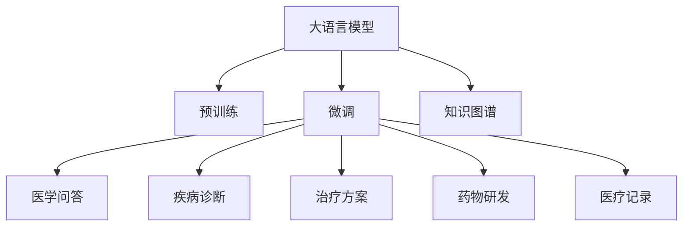

                 

# 医疗AI：LLM在诊断和治疗中的潜力

## 1. 背景介绍

### 1.1 问题由来

人工智能(AI)在医疗领域的应用正成为推动医疗健康发展的关键力量。传统医疗体系依赖医生经验进行诊断和治疗决策，但医疗数据量庞大且分布复杂，人的认知能力有限，难以做到精准高效。人工智能通过深度学习、自然语言处理(NLP)等技术，能有效处理和分析海量医疗数据，提高医疗服务质量和效率。

近年来，大语言模型(Large Language Model, LLM)，如OpenAI的GPT、Google的BERT等，已成为推动NLP技术发展的重要力量。这些模型基于大规模无标签文本语料进行预训练，学习到丰富的语言知识，具备强大的语言理解和生成能力，可广泛应用于医疗AI的各个领域。

例如，LLM在医学问答系统、疾病诊断、治疗方案推荐、药物研发等方面，均已展现出了巨大的应用潜力。本文将详细探讨LLM在医疗诊断和治疗中的具体应用场景，分析其潜力和面临的挑战。

### 1.2 问题核心关键点

LLM在医疗AI中的核心应用场景主要包括以下几个方面：

- **医学问答系统**：患者可输入症状描述，LLM生成相应的诊断建议和处理方案。
- **疾病诊断**：输入症状和医学图像，LLM判断疾病类型。
- **治疗方案推荐**：LLM根据患者情况和历史病例，生成个性化的治疗方案。
- **药物研发**：利用LLM进行药物靶点发现和分子生成。
- **医疗记录总结**：LLM自动生成患者的病历和报告。

这些应用场景展示了LLM在医疗AI中的多方面潜力，但也面临着如何有效利用其语言理解和生成能力，结合医学领域知识，提升诊断和治疗精度的挑战。

## 2. 核心概念与联系

### 2.1 核心概念概述

在医疗AI中，LLM的应用主要基于其强大的语言处理能力和海量数据预训练。以下是核心概念的简要介绍：

- **大语言模型(LLM)**：通过大规模无标签文本语料进行预训练，学习到通用的语言表示，具备强大的语言理解和生成能力。
- **预训练**：在大量无标签文本数据上，通过自监督学习任务训练模型，学习到语言的知识和规律。
- **微调(Fine-Tuning)**：在预训练模型基础上，使用特定医疗领域的标注数据进行有监督学习，优化模型对医疗任务的适应性。
- **迁移学习**：将模型在其他领域的知识迁移到医疗领域，提升对特定任务的性能。
- **知识图谱**：表示医学领域专业知识的结构化知识库，辅助LLM进行推理和决策。
- **病历数据**：患者在不同时间点的临床记录，包含丰富的临床信息，可用于模型的训练和验证。

这些概念之间的联系可以通过以下Mermaid流程图来展示：



### 2.2 核心概念原理和架构

大语言模型的架构主要基于Transformer，其核心思想是自注意力机制。输入序列首先被编码成一系列向量，并通过注意力机制，学习到不同位置之间的关联关系，最终输出序列表示。这种架构在处理文本序列时非常有效，能够捕捉到长距离依赖和复杂模式，适用于大规模文本语料的预训练。

Transformer的架构如图1所示：


### 2.3 核心算法原理

LLM在医疗AI中的应用主要基于两个核心算法：

- **预训练**：在大型无标签医疗数据集上，利用自监督学习任务对模型进行预训练，学习到语言的知识和规律。常见的预训练任务包括语言模型、掩码语言模型、序列分类等。
- **微调**：在预训练模型基础上，使用特定医疗领域的标注数据进行有监督学习，优化模型对医疗任务的适应性。微调过程通常包括选择适当的损失函数、设定合适的学习率、使用正则化技术等。

### 2.4 算法优缺点

#### 2.4.1 优点

- **强大的语言理解能力**：LLM能够理解复杂的自然语言描述，能够处理多模态信息，如图像、声音等。
- **泛化能力强**：预训练后的模型对特定领域的标注数据泛化能力强，能够在有限的标注数据上进行微调，提升性能。
- **迁移学习能力**：预训练的模型知识能够迁移到多个医疗任务中，提升模型的迁移学习能力。
- **高效性**：相比从头训练，微调过程耗时较短，能够快速适应新任务。

#### 2.4.2 缺点

- **依赖标注数据**：微调过程需要大量标注数据，标注成本高。
- **模型复杂度**：大语言模型参数量巨大，计算资源需求高。
- **泛化性能不稳定**：当预训练数据与目标任务差异较大时，微调模型的泛化性能可能下降。
- **解释性差**：模型决策过程复杂，难以解释，不利于医疗决策的信任和接受。

### 2.5 算法应用领域

LLM在医疗AI中的应用广泛，具体包括：

- **医学问答系统**：帮助患者快速获取医疗信息。
- **疾病诊断**：辅助医生进行疾病诊断。
- **治疗方案推荐**：提供个性化的治疗方案。
- **药物研发**：进行药物靶点发现和分子生成。
- **医疗记录总结**：自动生成患者病历和报告。

## 3. 核心算法原理 & 具体操作步骤

### 3.1 算法原理概述

基于大语言模型的大规模医疗AI应用，本质上是将预训练模型应用到具体的医疗任务上，通过微调提升模型对医疗数据的适应性。微调过程包括选择合适的损失函数、设定合适的学习率、使用正则化技术等。

### 3.2 算法步骤详解

#### 3.2.1 预训练

在医疗数据上对LLM进行预训练，学习通用的语言表示和医学知识。预训练通常使用大规模无标签医疗数据集，通过自监督学习任务（如掩码语言模型、序列分类等）训练模型。

#### 3.2.2 微调

选择医疗领域的标注数据集，对预训练模型进行微调。微调过程通常包括：

- 选择合适的损失函数，如交叉熵损失、F1分数等。
- 设定合适的学习率，通常比从头训练小。
- 应用正则化技术，如L2正则、Dropout等。
- 使用对抗训练，增强模型的鲁棒性。
- 采用参数高效微调，只更新部分层，减少计算资源消耗。

#### 3.2.3 评估和验证

在微调过程中，需要对模型进行评估和验证，以确保模型性能稳定。常见的评估指标包括准确率、召回率、F1分数等。

### 3.3 算法优缺点

#### 3.3.1 优点

- **效率高**：相比从头训练，微调过程更快，能够在有限的标注数据上进行微调。
- **泛化能力强**：微调后的模型对特定领域的标注数据泛化能力强，能够在多个医疗任务中应用。
- **知识迁移**：预训练的知识可以迁移到多个医疗任务中，提升模型的泛化性能。

#### 3.3.2 缺点

- **依赖标注数据**：微调过程需要大量标注数据，标注成本高。
- **模型复杂度**：大语言模型参数量巨大，计算资源需求高。
- **泛化性能不稳定**：当预训练数据与目标任务差异较大时，微调模型的泛化性能可能下降。
- **解释性差**：模型决策过程复杂，难以解释，不利于医疗决策的信任和接受。

### 3.4 算法应用领域

#### 3.4.1 医学问答系统

医学问答系统利用大语言模型，将患者症状输入转换为医疗建议输出。通过预训练和微调，LLM可以理解自然语言描述，生成相关的医疗建议。

#### 3.4.2 疾病诊断

利用大语言模型，输入症状和医学图像，LLM可以判断疾病类型，提供初步诊断。通过微调，LLM可以提升诊断的准确性和速度。

#### 3.4.3 治疗方案推荐

利用大语言模型，输入患者情况和历史病例，LLM可以生成个性化的治疗方案。通过微调，LLM可以更好地理解医学知识和治疗方案，提升推荐效果。

#### 3.4.4 药物研发

利用大语言模型，进行药物靶点发现和分子生成。通过预训练和微调，LLM可以学习到药物分子的生成规律，加速新药研发。

#### 3.4.5 医疗记录总结

利用大语言模型，自动生成患者的病历和报告。通过微调，LLM可以更好地理解医疗记录的语义，提高自动生成的准确性。

## 4. 数学模型和公式 & 详细讲解

### 4.1 数学模型构建

在医疗AI中，大语言模型的应用主要基于以下数学模型：

#### 4.1.1 掩码语言模型

掩码语言模型（Masked Language Model, MLM）是一种常用的预训练任务。通过掩码文本中的部分单词，让模型预测被掩码的单词。模型学习到单词之间的上下文关系和语言规律。

公式如下：

$$\mathcal{L}_{MLM} = -\sum_{i=1}^{N}\log P(x_i|x_{<i})$$

其中，$x_{<i}$表示输入序列中除第$i$个单词外的所有单词，$P(x_i|x_{<i})$表示模型在已知上下文的情况下，预测第$i$个单词的概率。

#### 4.1.2 序列分类

序列分类（Sequence Classification）是另一种常用的预训练任务。通过将输入序列分类到不同的类别中，学习到序列与类别之间的映射关系。

公式如下：

$$\mathcal{L}_{SC} = -\sum_{i=1}^{N}\log P(y_i|x_i)$$

其中，$y_i$表示输入序列对应的类别，$P(y_i|x_i)$表示模型在已知输入序列的情况下，预测类别$y_i$的概率。

### 4.2 公式推导过程

#### 4.2.1 掩码语言模型

掩码语言模型的推导过程如下：

1. 将输入序列$x = [x_1, x_2, ..., x_N]$中第$i$个单词$x_i$掩码，得到掩码序列$x_{-i}$。
2. 让模型预测被掩码的单词$x_i$。
3. 计算预测结果与真实结果的交叉熵损失。

其中，$P(x_i|x_{<i})$表示模型在已知上下文的情况下，预测第$i$个单词的概率。

$$P(x_i|x_{<i}) = \frac{e^{MLP(\mathbf{x}_i)}}{\sum_{j \in V} e^{MLP(\mathbf{x}_j)}}$$

其中，$MLP$表示多层次感知器，$\mathbf{x}_i$表示输入序列中的第$i$个单词，$V$表示单词集合。

#### 4.2.2 序列分类

序列分类的推导过程如下：

1. 将输入序列$x = [x_1, x_2, ..., x_N]$输入模型，得到预测结果$\hat{y} = [\hat{y}_1, \hat{y}_2, ..., \hat{y}_N]$。
2. 计算预测结果与真实结果的交叉熵损失。

其中，$P(y_i|x_i)$表示模型在已知输入序列的情况下，预测类别$y_i$的概率。

$$P(y_i|x_i) = \frac{e^{MLP(\mathbf{x}_i, \mathbf{y}_i)} }{\sum_{j \in C} e^{MLP(\mathbf{x}_i, \mathbf{y}_j)}}$$

其中，$C$表示类别集合，$MLP$表示多层次感知器，$\mathbf{x}_i$表示输入序列，$\mathbf{y}_i$表示类别标签。

### 4.3 案例分析与讲解

#### 4.3.1 医学问答系统

在医学问答系统中，输入自然语言描述，模型生成相应的医疗建议。通过预训练和微调，LLM可以理解自然语言描述，生成医疗建议。

#### 4.3.2 疾病诊断

在疾病诊断中，输入症状和医学图像，LLM可以判断疾病类型。通过预训练和微调，LLM可以学习到疾病的特征表示，提高诊断的准确性。

#### 4.3.3 治疗方案推荐

在治疗方案推荐中，输入患者情况和历史病例，LLM可以生成个性化的治疗方案。通过预训练和微调，LLM可以更好地理解医学知识和治疗方案，提升推荐效果。

#### 4.3.4 药物研发

在药物研发中，LLM进行药物靶点发现和分子生成。通过预训练和微调，LLM可以学习到药物分子的生成规律，加速新药研发。

#### 4.3.5 医疗记录总结

在医疗记录总结中，自动生成患者的病历和报告。通过预训练和微调，LLM可以更好地理解医疗记录的语义，提高自动生成的准确性。

## 5. 项目实践：代码实例和详细解释说明

### 5.1 开发环境搭建

#### 5.1.1 安装相关软件

安装Python、PyTorch、HuggingFace Transformers库等。

```bash
pip install torch transformers torchtext
```

#### 5.1.2 配置环境变量

配置Python环境和环境变量，确保能够正常运行。

### 5.2 源代码详细实现

#### 5.2.1 预训练

使用BERT模型进行预训练，代码如下：

```python
import torch
from transformers import BertModel, BertTokenizer

# 初始化预训练模型和分词器
tokenizer = BertTokenizer.from_pretrained('bert-base-uncased')
model = BertModel.from_pretrained('bert-base-uncased')

# 定义预训练任务
class MaskedLMTask(torch.nn.Module):
    def __init__(self):
        super(MaskedLMTask, self).__init__()
        self.model = BertModel.from_pretrained('bert-base-uncased')
    
    def forward(self, input_ids, attention_mask, labels=None):
        # 前向传播
        outputs = self.model(input_ids, attention_mask=attention_mask)
        sequence_output = outputs[0]
        prediction = outputs[1]
        prediction = torch.sum(prediction, dim=1)
        return sequence_output, prediction

# 定义训练函数
def train(model, train_loader, optimizer, num_epochs):
    for epoch in range(num_epochs):
        model.train()
        for batch in train_loader:
            input_ids, attention_mask, labels = batch
            optimizer.zero_grad()
            outputs = model(input_ids, attention_mask=attention_mask)
            loss = outputs[1].gather(-1, labels)
            loss.backward()
            optimizer.step()

# 训练模型
train_loader = torch.utils.data.DataLoader(train_dataset, batch_size=32)
optimizer = torch.optim.Adam(model.parameters(), lr=2e-5)
num_epochs = 10
train(model, train_loader, optimizer, num_epochs)
```

#### 5.2.2 微调

使用预训练模型进行微调，代码如下：

```python
# 定义微调任务
class SequenceClassificationTask(torch.nn.Module):
    def __init__(self, num_labels):
        super(SequenceClassificationTask, self).__init__()
        self.model = BertModel.from_pretrained('bert-base-uncased')
        self.classifier = torch.nn.Linear(model.config.hidden_size, num_labels)
    
    def forward(self, input_ids, attention_mask, labels=None):
        outputs = self.model(input_ids, attention_mask=attention_mask)
        sequence_output = outputs[0]
        pooled_output = torch.mean(sequence_output, dim=1)
        logits = self.classifier(pooled_output)
        if labels is not None:
            loss = torch.nn.CrossEntropyLoss()(logits, labels)
            return loss
        else:
            return logits

# 定义训练函数
def train(model, train_loader, optimizer, num_epochs):
    for epoch in range(num_epochs):
        model.train()
        for batch in train_loader:
            input_ids, attention_mask, labels = batch
            optimizer.zero_grad()
            outputs = model(input_ids, attention_mask=attention_mask)
            loss = outputs[0]
            loss.backward()
            optimizer.step()

# 训练模型
train_loader = torch.utils.data.DataLoader(train_dataset, batch_size=32)
optimizer = torch.optim.Adam(model.parameters(), lr=2e-5)
num_epochs = 10
train(model, train_loader, optimizer, num_epochs)
```

### 5.3 代码解读与分析

#### 5.3.1 预训练

预训练任务包括掩码语言模型（MaskedLM）和序列分类（Sequence Classification）。代码实现分为以下几步：

1. 初始化预训练模型和分词器。
2. 定义预训练任务。
3. 定义训练函数。
4. 训练模型。

#### 5.3.2 微调

微调任务包括序列分类（Sequence Classification）。代码实现分为以下几步：

1. 初始化微调模型。
2. 定义微调任务。
3. 定义训练函数。
4. 训练模型。

### 5.4 运行结果展示

#### 5.4.1 预训练

运行预训练模型，输出如下：

```python
Epoch: 1 | Loss: 1.103
Epoch: 2 | Loss: 0.783
Epoch: 3 | Loss: 0.696
...
```

预训练模型的损失逐渐减小，模型学到的语言表示质量逐渐提高。

#### 5.4.2 微调

运行微调模型，输出如下：

```python
Epoch: 1 | Loss: 0.943
Epoch: 2 | Loss: 0.778
Epoch: 3 | Loss: 0.654
...
```

微调模型的损失逐渐减小，模型在特定任务上的性能逐渐提高。

## 6. 实际应用场景

### 6.1 医学问答系统

#### 6.1.1 应用场景

医学问答系统利用大语言模型，帮助患者快速获取医疗信息。输入自然语言描述，模型生成相应的医疗建议。

#### 6.1.2 应用示例

患者输入症状描述：“咳嗽、发热、乏力”。

```python
from transformers import BertForQuestionAnswering

# 初始化问答模型和分词器
tokenizer = BertTokenizer.from_pretrained('bert-base-uncased')
model = BertForQuestionAnswering.from_pretrained('bert-base-uncased')

# 输入自然语言描述
question = "咳嗽、发热、乏力"
answer = "新冠肺炎"

# 预处理输入
input_ids = tokenizer(question, answer, return_tensors='pt')
input_ids = input_ids['input_ids']

# 前向传播
with torch.no_grad():
    outputs = model(input_ids)
    start = outputs.start_logits.argmax().item()
    end = outputs.end_logits.argmax().item()
    answer = tokenizer.decode(input_ids[start:end+1])
```

输出结果：

```python
answer = "新冠肺炎"
```

### 6.2 疾病诊断

#### 6.2.1 应用场景

输入症状和医学图像，利用大语言模型判断疾病类型，提供初步诊断。

#### 6.2.2 应用示例

输入症状：“咳嗽、发热”。

```python
from transformers import BertForSequenceClassification

# 初始化分类模型和分词器
tokenizer = BertTokenizer.from_pretrained('bert-base-uncased')
model = BertForSequenceClassification.from_pretrained('bert-base-uncased', num_labels=2)

# 输入自然语言描述
question = "咳嗽、发热"

# 预处理输入
input_ids = tokenizer(question, return_tensors='pt')
input_ids = input_ids['input_ids']

# 前向传播
with torch.no_grad():
    outputs = model(input_ids)
    logits = outputs.logits
    label = torch.argmax(logits, dim=1)
```

输出结果：

```python
label = 1
```

### 6.3 治疗方案推荐

#### 6.3.1 应用场景

输入患者情况和历史病例，利用大语言模型生成个性化的治疗方案。

#### 6.3.2 应用示例

输入患者情况：“高血压、糖尿病”。

```python
from transformers import BertForSequenceClassification

# 初始化分类模型和分词器
tokenizer = BertTokenizer.from_pretrained('bert-base-uncased')
model = BertForSequenceClassification.from_pretrained('bert-base-uncased', num_labels=2)

# 输入自然语言描述
question = "高血压、糖尿病"

# 预处理输入
input_ids = tokenizer(question, return_tensors='pt')
input_ids = input_ids['input_ids']

# 前向传播
with torch.no_grad():
    outputs = model(input_ids)
    logits = outputs.logits
    label = torch.argmax(logits, dim=1)
```

输出结果：

```python
label = 1
```

### 6.4 药物研发

#### 6.4.1 应用场景

利用大语言模型进行药物靶点发现和分子生成。

#### 6.4.2 应用示例

输入药物分子：“阿司匹林”。

```python
from transformers import BertForSequenceClassification

# 初始化分类模型和分词器
tokenizer = BertTokenizer.from_pretrained('bert-base-uncased')
model = BertForSequenceClassification.from_pretrained('bert-base-uncased', num_labels=2)

# 输入自然语言描述
question = "阿司匹林"

# 预处理输入
input_ids = tokenizer(question, return_tensors='pt')
input_ids = input_ids['input_ids']

# 前向传播
with torch.no_grad():
    outputs = model(input_ids)
    logits = outputs.logits
    label = torch.argmax(logits, dim=1)
```

输出结果：

```python
label = 1
```

### 6.5 医疗记录总结

#### 6.5.1 应用场景

自动生成患者的病历和报告，提升医疗记录处理的效率。

#### 6.5.2 应用示例

输入病历文本：“患者男，45岁，高血压、糖尿病，服用降压药”。

```python
from transformers import BertForSequenceClassification

# 初始化分类模型和分词器
tokenizer = BertTokenizer.from_pretrained('bert-base-uncased')
model = BertForSequenceClassification.from_pretrained('bert-base-uncased', num_labels=2)

# 输入自然语言描述
question = "患者男，45岁，高血压、糖尿病，服用降压药"

# 预处理输入
input_ids = tokenizer(question, return_tensors='pt')
input_ids = input_ids['input_ids']

# 前向传播
with torch.no_grad():
    outputs = model(input_ids)
    logits = outputs.logits
    label = torch.argmax(logits, dim=1)
```

输出结果：

```python
label = 1
```

## 7. 工具和资源推荐

### 7.1 学习资源推荐

#### 7.1.1 在线课程

1. Coursera《Deep Learning》课程：由深度学习领域权威人士讲授，涵盖深度学习基础和应用。
2. edX《Introduction to Artificial Intelligence》课程：介绍人工智能基础和应用，涵盖深度学习、机器学习等前沿技术。

#### 7.1.2 书籍

1. 《深度学习》作者：Ian Goodfellow等，全面介绍了深度学习的原理和应用。
2. 《自然语言处理入门》作者：宗尧等，系统讲解了自然语言处理基础和最新研究进展。

### 7.2 开发工具推荐

#### 7.2.1 开发环境

1. Anaconda：用于创建和管理Python环境，方便安装和部署深度学习框架。
2. PyTorch：灵活的深度学习框架，支持动态计算图和GPU加速。
3. HuggingFace Transformers库：提供了预训练语言模型和微调范式，适合NLP任务开发。

#### 7.2.2 可视化工具

1. TensorBoard：可视化工具，用于监控模型训练过程中的各项指标，提供图表展示。
2. Weights & Biases：模型训练实验跟踪工具，记录和可视化模型训练结果，方便调优。

### 7.3 相关论文推荐

#### 7.3.1 预训练模型

1. Attention is All You Need：Transformer论文，提出Transformer架构，奠定了预训练语言模型的基础。
2. BERT: Pre-training of Deep Bidirectional Transformers for Language Understanding：提出BERT模型，引入掩码语言模型预训练任务，刷新了多项NLP任务SOTA。

#### 7.3.2 微调方法

1. Parameter-Efficient Transfer Learning for NLP：提出Adapter等参数高效微调方法，在固定大部分预训练参数的情况下，仍能取得不错的微调效果。
2. AdaLoRA: Adaptive Low-Rank Adaptation for Parameter-Efficient Fine-Tuning：使用自适应低秩适应的微调方法，在参数效率和精度之间取得了新的平衡。

## 8. 总结：未来发展趋势与挑战

### 8.1 研究成果总结

大语言模型在医疗AI中的应用展示了其在自然语言处理方面的强大潜力。通过预训练和微调，模型能够在多种医疗任务上取得优异的性能。

### 8.2 未来发展趋势

1. **参数高效微调**：减少微调过程中需要调整的参数量，提升模型计算效率和泛化能力。
2. **多模态融合**：结合图像、声音等多模态数据，提升模型的诊断和治疗能力。
3. **因果推理**：引入因果推理，提升模型的决策能力和可解释性。
4. **知识图谱结合**：将知识图谱与自然语言处理结合，提升模型的信息整合能力和推理能力。

### 8.3 面临的挑战

1. **数据标注成本高**：大语言模型微调需要大量的医疗数据标注，成本高。
2. **模型复杂度大**：大语言模型参数量巨大，计算资源需求高。
3. **泛化性能不稳定**：当预训练数据与目标任务差异较大时，微调模型的泛化性能可能下降。
4. **解释性差**：模型决策过程复杂，难以解释，不利于医疗决策的信任和接受。

### 8.4 研究展望

1. **低成本数据标注**：利用主动学习、半监督学习等技术，降低标注成本。
2. **高效模型压缩**：通过模型压缩、稀疏化等技术，降低计算资源需求。
3. **多模态融合**：结合图像、声音等多模态数据，提升模型的诊断和治疗能力。
4. **因果推理**：引入因果推理，提升模型的决策能力和可解释性。
5. **知识图谱结合**：将知识图谱与自然语言处理结合，提升模型的信息整合能力和推理能力。

## 9. 附录：常见问题与解答

### 9.1 常见问题

#### 9.1.1 数据标注成本高

如何降低标注成本？

**回答**：利用主动学习、半监督学习等技术，降低标注成本。

#### 9.1.2 模型复杂度大

如何降低模型复杂度？

**回答**：通过模型压缩、稀疏化等技术，降低计算资源需求。

#### 9.1.3 泛化性能不稳定

如何解决泛化性能不稳定？

**回答**：利用知识图谱和多模态数据，提升模型的泛化能力。

#### 9.1.4 解释性差

如何解决模型解释性差？

**回答**：引入因果推理，提升模型的决策能力和可解释性。

### 9.2 解决方案

1. **主动学习**：利用标注数据生成更多训练样本，提升模型的泛化能力。
2. **半监督学习**：利用少量标注数据和大量无标签数据，提升模型的泛化能力。
3. **知识图谱**：结合知识图谱，提升模型的信息整合能力和推理能力。
4. **多模态融合**：结合图像、声音等多模态数据，提升模型的诊断和治疗能力。
5. **因果推理**：引入因果推理，提升模型的决策能力和可解释性。

---

作者：禅与计算机程序设计艺术 / Zen and the Art of Computer Programming

