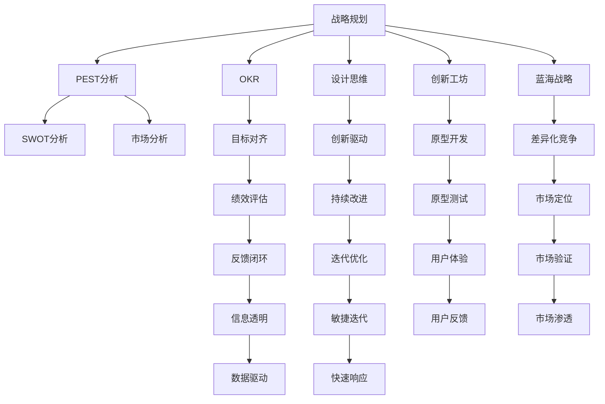

                 

# 卓越管理者的思维修炼之路

> 关键词：卓越管理者、思维模型、决策艺术、创新管理、企业文化、变革管理、敏捷领导、领导力发展

## 1. 背景介绍

### 1.1 问题由来

在现代复杂多变的商业环境中，企业的成功不仅仅依赖于技术和产品，更离不开卓越的管理者。他们能够洞察市场趋势，制定前瞻性战略，引领团队跨越难关，创造更大的商业价值。然而，成为卓越管理者并非易事，除了经验积累外，更需要通过系统化的思维训练和管理实践，提升自身的能力和素质。

本文旨在通过介绍一系列关键的思维模型和管理方法，帮助读者在管理实践中不断提升自我，成为一名卓越的管理者。这些方法涵盖战略规划、团队管理、创新思维、变革引导等多个方面，有助于管理者在实际工作中应对各种挑战，实现卓越业绩。

### 1.2 问题核心关键点

成为卓越管理者的关键在于持续学习和自我提升，以下是几个核心关键点：

- **战略规划**：制定前瞻性、可执行的战略，将企业带向成功。
- **团队管理**：激发团队潜能，建立高效的团队文化。
- **创新思维**：鼓励创新和持续改进，保持企业的竞争力。
- **变革管理**：在变革过程中，领导团队实现平稳过渡，确保变革成功。
- **领导力发展**：不断提升自身的领导力，引领团队前进。

本文将从这些关键点出发，详细介绍卓越管理者的思维方式和具体操作方法，帮助管理者在实际工作中取得更大的成功。

## 2. 核心概念与联系

### 2.1 核心概念概述

卓越管理者的成功不仅依赖于单一的技能，更需要综合运用一系列的思维模型和管理方法。以下是几个关键概念及其相互联系：

- **战略规划**：通过PEST分析（政治、经济、社会、技术）、SWOT分析（优势、劣势、机会、威胁）等方法，制定符合企业实际情况的战略。
- **团队管理**：运用SMART目标设定、OKR（Objectives and Key Results）、反馈循环（Feedback Loop）等方法，激发团队潜力，提高团队执行力。
- **创新思维**：采用设计思维（Design Thinking）、创新工坊（Innovation Workshop）、蓝海战略（Blue Ocean Strategy）等方法，鼓励创新，应对市场变化。
- **变革管理**：运用变革管理框架（如Kotter的变革8步骤）、变革沟通策略（如变革的阶段性沟通），引导组织平稳过渡。
- **领导力发展**：通过自我反思、领导力训练、导师制（Mentorship）等方法，提升领导者的综合素质。

这些概念之间相互联系，形成了一套系统化的思维模型，指导管理者在实际工作中不断优化和提升。

### 2.2 核心概念原理和架构的 Mermaid 流程图(Mermaid 流程节点中不要有括号、逗号等特殊字符)



这张流程图展示了从战略规划到团队管理，再到变革管理、领导力发展的全过程。每个概念和模型之间相互连接，形成了系统的思维修炼之路。

## 3. 核心算法原理 & 具体操作步骤

### 3.1 算法原理概述

卓越管理者的思维修炼过程，本质上是一种基于科学的、系统的决策过程。其核心在于通过多种方法和模型，收集信息、分析问题、制定决策、实施执行，并不断反馈和改进。

以下是核心算法原理的概述：

1. **数据收集**：通过多种渠道收集市场、客户、竞争对手等相关信息，为决策提供数据支持。
2. **问题分析**：运用PEST、SWOT等模型，对收集到的数据进行分析，明确问题的本质和影响因素。
3. **目标设定**：使用SMART、OKR等方法，设定明确、可衡量的目标，指导后续的决策和执行。
4. **方案制定**：运用设计思维、创新工坊、蓝海战略等方法，提出多种解决方案，并进行优选。
5. **决策实施**：选择最优方案后，制定详细的实施计划，并分配资源和责任。
6. **执行监控**：通过关键绩效指标（KPI）和反馈机制，实时监控执行过程，确保目标达成。
7. **持续改进**：根据反馈信息，不断优化决策和执行过程，实现持续改进。

### 3.2 算法步骤详解

以下详细介绍每个步骤的详细步骤：

#### 数据收集
数据收集是决策的基础，通过以下方法进行：

1. **市场调研**：通过问卷调查、访谈、焦点小组等方式，收集市场和客户的需求和反馈。
2. **竞争分析**：分析竞争对手的产品、市场份额、优势劣势等信息。
3. **内部数据分析**：分析企业的财务报表、销售数据、客户行为等内部数据。

#### 问题分析
通过PEST、SWOT等模型分析问题：

1. **PEST分析**：分析政治、经济、社会、技术等宏观因素对企业的影响。
2. **SWOT分析**：分析企业的优势、劣势、机会、威胁。

#### 目标设定
目标设定是决策的核心，使用SMART、OKR等方法：

1. **SMART目标**：目标要具体（Specific）、可衡量（Measurable）、可达成（Achievable）、相关性（Relevant）、时限性（Time-bound）。
2. **OKR**：设置关键结果（Objectives）和关键指标（Key Results），明确目标和衡量标准。

#### 方案制定
运用设计思维、创新工坊、蓝海战略等方法，提出多种解决方案：

1. **设计思维**：通过用户研究和原型开发，不断迭代解决方案，提高用户满意度。
2. **创新工坊**：组织跨职能团队，通过头脑风暴、原型设计等活动，提出创新的解决方案。
3. **蓝海战略**：通过市场分析，寻找新的市场空间，避免红海竞争，实现差异化竞争。

#### 决策实施
选择最优方案后，制定详细的实施计划，并分配资源和责任：

1. **资源分配**：根据方案需求，分配人力、物力、财力等资源。
2. **责任分工**：明确各部门的职责和任务，建立高效的执行团队。

#### 执行监控
通过关键绩效指标（KPI）和反馈机制，实时监控执行过程，确保目标达成：

1. **KPI设定**：设定关键绩效指标，如销售额、市场份额、客户满意度等。
2. **反馈机制**：建立定期反馈和评估机制，及时发现问题，调整执行策略。

#### 持续改进
根据反馈信息，不断优化决策和执行过程，实现持续改进：

1. **反馈分析**：分析反馈信息，识别问题和改进点。
2. **优化方案**：根据分析结果，优化解决方案和执行策略。
3. **迭代优化**：通过不断的迭代和改进，提升决策和执行效率。

### 3.3 算法优缺点

卓越管理者的思维修炼过程具有以下优点：

1. **系统化**：通过一系列的模型和方法，系统化地收集信息、分析问题和制定决策。
2. **数据驱动**：强调基于数据的决策，减少主观偏见。
3. **持续改进**：通过反馈和优化机制，不断提升决策和执行效果。

但同时也存在一些缺点：

1. **复杂性**：模型和方法较多，需要管理者具备较强的系统思维和综合能力。
2. **时间成本**：收集和分析数据、制定和实施决策需要较多时间和精力。
3. **资源消耗**：执行和监控需要资源支持，可能带来额外的成本。

尽管存在这些缺点，但卓越管理者的思维修炼过程仍然是一种科学、系统、高效的决策方式，值得广大管理者学习和实践。

### 3.4 算法应用领域

卓越管理者的思维修炼方法不仅适用于企业决策，还适用于各种组织管理、项目管理、创新创业等领域。

- **企业决策**：通过PEST、SWOT等模型，制定企业战略和经营决策。
- **项目管理**：通过OKR、KPI等方法，管理项目进度和绩效。
- **创新创业**：通过设计思维、创新工坊等方法，推动产品和服务的创新。
- **组织管理**：通过团队建设和领导力发展，提升组织协同和执行力。

## 4. 数学模型和公式 & 详细讲解 & 举例说明

### 4.1 数学模型构建

卓越管理者的思维修炼过程，可以构建为以下数学模型：

1. **数据收集模型**：$D = f(X, C, P)$，其中 $D$ 表示收集到的数据，$X$ 为市场调研数据，$C$ 为竞争分析数据，$P$ 为内部数据分析。
2. **问题分析模型**：$A = PEST \oplus SWOT$，其中 $A$ 为问题分析结果，$PEST$ 为PEST分析结果，$SWOT$ 为SWOT分析结果。
3. **目标设定模型**：$G = SMART \oplus OKR$，其中 $G$ 为目标设定结果，$SMART$ 为SMART目标，$OKR$ 为OKR目标。
4. **方案制定模型**：$M = DTM \oplus CIW \oplus BO$，其中 $M$ 为方案制定结果，$DTM$ 为设计思维，$CIW$ 为创新工坊，$BO$ 为蓝海战略。
5. **决策实施模型**：$I = R \oplus T$，其中 $I$ 为决策实施结果，$R$ 为资源分配，$T$ 为责任分工。
6. **执行监控模型**：$E = KPI \oplus F$，其中 $E$ 为执行监控结果，$KPI$ 为关键绩效指标，$F$ 为反馈机制。
7. **持续改进模型**：$C = FEA \oplus IFO \oplus IO$，其中 $C$ 为持续改进结果，$FEA$ 为反馈分析，$IFO$ 为优化方案，$IO$ 为迭代优化。

### 4.2 公式推导过程

以下详细介绍每个模型的公式推导过程：

#### 数据收集模型
数据收集模型 $D = f(X, C, P)$ 的推导如下：

1. **市场调研数据**：$X = \{x_i\}_{i=1}^n$，其中 $x_i$ 为市场调研结果。
2. **竞争分析数据**：$C = \{c_j\}_{j=1}^m$，其中 $c_j$ 为竞争分析结果。
3. **内部数据分析**：$P = \{p_k\}_{k=1}^o$，其中 $p_k$ 为内部分析结果。
4. **数据收集函数**：$D = F(X, C, P) = \bigcup(x_i, c_j, p_k)$，表示将市场调研、竞争分析、内部分析的数据合并为总体数据集。

#### 问题分析模型
问题分析模型 $A = PEST \oplus SWOT$ 的推导如下：

1. **PEST分析**：$A_{PEST} = P \oplus E \oplus S \oplus T$，其中 $P$ 为政治因素，$E$ 为经济因素，$S$ 为社会因素，$T$ 为技术因素。
2. **SWOT分析**：$A_{SWOT} = S \oplus W \oplus O \oplus T$，其中 $S$ 为优势，$W$ 为劣势，$O$ 为机会，$T$ 为威胁。
3. **问题分析函数**：$A = P \oplus S = A_{PEST} \oplus A_{SWOT}$，表示将PEST分析和SWOT分析的结果合并为总体问题分析结果。

#### 目标设定模型
目标设定模型 $G = SMART \oplus OKR$ 的推导如下：

1. **SMART目标**：$G_{SMART} = \{g_{i}\}_{i=1}^n$，其中 $g_i$ 为SMART目标。
2. **OKR目标**：$G_{OKR} = \{k_j\}_{j=1}^m$，其中 $k_j$ 为OKR目标。
3. **目标设定函数**：$G = G_{SMART} \oplus G_{OKR}$，表示将SMART目标和OKR目标合并为总体目标设定结果。

#### 方案制定模型
方案制定模型 $M = DTM \oplus CIW \oplus BO$ 的推导如下：

1. **设计思维**：$M_{DTM} = \{m_{i}\}_{i=1}^n$，其中 $m_i$ 为设计思维方案。
2. **创新工坊**：$M_{CIW} = \{c_{j}\}_{j=1}^m$，其中 $c_j$ 为创新工坊方案。
3. **蓝海战略**：$M_{BO} = \{b_{k}\}_{k=1}^o$，其中 $b_k$ 为蓝海战略方案。
4. **方案制定函数**：$M = M_{DTM} \oplus M_{CIW} \oplus M_{BO}$，表示将设计思维、创新工坊、蓝海战略的方案合并为总体方案制定结果。

#### 决策实施模型
决策实施模型 $I = R \oplus T$ 的推导如下：

1. **资源分配**：$R = \{r_{i}\}_{i=1}^n$，其中 $r_i$ 为资源分配结果。
2. **责任分工**：$T = \{t_{j}\}_{j=1}^m$，其中 $t_j$ 为责任分工结果。
3. **决策实施函数**：$I = R \oplus T$，表示将资源分配和责任分工合并为总体决策实施结果。

#### 执行监控模型
执行监控模型 $E = KPI \oplus F$ 的推导如下：

1. **关键绩效指标**：$KPI = \{k_{i}\}_{i=1}^n$，其中 $k_i$ 为关键绩效指标。
2. **反馈机制**：$F = \{f_{j}\}_{j=1}^m$，其中 $f_j$ 为反馈机制。
3. **执行监控函数**：$E = KPI \oplus F$，表示将关键绩效指标和反馈机制合并为总体执行监控结果。

#### 持续改进模型
持续改进模型 $C = FEA \oplus IFO \oplus IO$ 的推导如下：

1. **反馈分析**：$FEA = F \oplus E$，其中 $F$ 为反馈，$E$ 为执行监控结果。
2. **优化方案**：$IFO = FEA \oplus I$，其中 $IFO$ 为优化方案。
3. **迭代优化**：$IO = IFO \oplus C$，其中 $IO$ 为迭代优化结果。
4. **持续改进函数**：$C = FEA \oplus IFO \oplus IO$，表示将反馈分析、优化方案、迭代优化合并为总体持续改进结果。

### 4.3 案例分析与讲解

#### 案例1：企业的战略规划

某高科技企业希望进军新市场，运用PEST和SWOT模型进行战略规划：

1. **PEST分析**：识别政治、经济、社会、技术因素，如新市场的政策环境、经济增长趋势、消费习惯变化、技术创新等。
2. **SWOT分析**：分析企业的优势、劣势、机会、威胁，如技术领先优势、品牌知名度、资金充裕、竞争对手强大等。
3. **战略制定**：根据分析结果，制定进入新市场的战略，如与当地企业合作、品牌定位、产品创新等。

#### 案例2：团队的绩效管理

某创业公司需要提高团队绩效，使用OKR和KPI进行绩效管理：

1. **OKR设定**：设定关键结果，如产品开发进度、市场份额增长等，明确目标和衡量标准。
2. **KPI设定**：设定关键绩效指标，如产品开发周期、市场反馈满意度等，实时监控执行过程。
3. **反馈循环**：定期反馈和评估，调整执行策略，如优化项目流程、加强团队沟通等。

## 5. 项目实践：代码实例和详细解释说明

### 5.1 开发环境搭建

在进行管理实践前，我们需要准备好开发环境。以下是使用Python进行项目管理的环境配置流程：

1. 安装Anaconda：从官网下载并安装Anaconda，用于创建独立的Python环境。

2. 创建并激活虚拟环境：
```bash
conda create -n project-env python=3.8 
conda activate project-env
```

3. 安装相关库：
```bash
pip install pandas numpy matplotlib jupyter notebook
```

4. 配置Jupyter Notebook：
```bash
jupyter notebook --pylab inline
```

完成上述步骤后，即可在`project-env`环境中开始项目管理实践。

### 5.2 源代码详细实现

以下是一个使用Python进行项目管理的目标设定和监控的代码实现：

```python
import pandas as pd

# 目标设定
class OKR:
    def __init__(self, objective, key_results):
        self.objective = objective
        self.key_results = key_results

    def set_objective(self, objective):
        self.objective = objective

    def set_key_results(self, key_results):
        self.key_results = key_results

    def display(self):
        print(f"Objective: {self.objective}")
        print("Key Results:")
        for i, result in enumerate(self.key_results):
            print(f"Result {i+1}: {result}")

# 绩效监控
class KPI:
    def __init__(self, kpi_name, target_value):
        self.kpi_name = kpi_name
        self.target_value = target_value
        self.current_value = None

    def set_current_value(self, current_value):
        self.current_value = current_value

    def display(self):
        print(f"{self.kpi_name}: {self.current_value}")
        if self.current_value < self.target_value:
            print("Warning: Not reaching target")

# 创建OKR和KPI实例
okr1 = OKR("Product Launch", ["Product Features", "Market Penetration"])
okr1.set_objective("Launch innovative product")
okr1.set_key_results(["Complete feature set", "Market share 10%"])

kpi1 = KPI("Product Development Time", 60)
kpi1.set_current_value(50)
kpi1.display()
okr1.display()
```

### 5.3 代码解读与分析

让我们再详细解读一下关键代码的实现细节：

**OKR类**：
- `__init__`方法：初始化OKR对象，包括目标和关键结果。
- `set_objective`方法：设置OKR目标。
- `set_key_results`方法：设置OKR关键结果。
- `display`方法：显示OKR的目标和关键结果。

**KPI类**：
- `__init__`方法：初始化KPI对象，包括指标名称和目标值。
- `set_current_value`方法：设置当前指标值。
- `display`方法：显示KPI的当前值，并判断是否达到目标。

**实例创建**：
- 创建OKR实例，并设置目标和关键结果。
- 创建KPI实例，并设置当前指标值和目标值，然后输出。

可以看到，通过Python实现项目管理的目标设定和监控，可以方便地设定和监控OKR和KPI，帮助团队保持高效和目标一致。

## 6. 实际应用场景

### 6.1 公司的战略规划

公司可以通过PEST和SWOT模型进行战略规划，具体步骤如下：

1. **PEST分析**：通过调研收集市场和政治、经济、社会、技术因素数据。
2. **SWOT分析**：分析企业优势、劣势、机会、威胁，形成战略方案。
3. **战略制定**：制定具体战略措施，如市场进入策略、产品开发计划等。

### 6.2 团队的绩效管理

团队可以通过OKR和KPI进行绩效管理，具体步骤如下：

1. **OKR设定**：设定关键结果，明确目标和衡量标准。
2. **KPI设定**：设定关键绩效指标，实时监控执行过程。
3. **反馈循环**：定期反馈和评估，调整执行策略。

### 6.3 创新项目的实施

创新项目可以通过设计思维和创新工坊进行方案制定，具体步骤如下：

1. **设计思维**：通过用户研究和原型开发，不断迭代解决方案。
2. **创新工坊**：组织跨职能团队，通过头脑风暴、原型设计等活动，提出创新的解决方案。
3. **方案评估**：评估方案的可行性和创新性，选择最优方案。

### 6.4 变革管理

公司可以通过变革管理框架进行变革管理，具体步骤如下：

1. **变革分析**：分析变革的原因和影响，明确变革目标。
2. **变革沟通**：制定变革沟通计划，逐步引导员工接受变革。
3. **变革实施**：制定详细的变革实施计划，并分配资源和责任。
4. **变革监控**：实时监控变革过程，确保目标达成。

## 7. 工具和资源推荐

### 7.1 学习资源推荐

为了帮助管理者系统掌握卓越管理者的思维模型和管理方法，这里推荐一些优质的学习资源：

1. 《管理的实践》（Peter F. Drucker）：经典管理著作，阐述了管理的基本原则和方法。
2. 《变革的力量》（John P. Kotter）：变革管理专家，提出了变革管理的8步骤。
3. 《创新者的窘境》（Clayton M. Christensen）：探讨了创新管理的复杂性。
4. 《设计思维》（Tim Brown）：介绍设计思维的基本流程和方法。
5. Coursera的“数据驱动决策”课程：通过数据分析和可视化工具，提升决策能力。
6. Harvard Business Review的文章：涵盖了各种管理领域的最新研究成果。

通过对这些资源的学习实践，相信你一定能够系统掌握卓越管理者的思维模型和管理方法，并在实际工作中不断提升自我。

### 7.2 开发工具推荐

高效的开发离不开优秀的工具支持。以下是几款用于项目管理开发的常用工具：

1. JIRA：用于任务管理、故障跟踪和项目协作的综合性项目管理工具。
2. Trello：基于看板的项目管理工具，适用于敏捷开发。
3. Asana：灵活的项目管理工具，支持任务分配和进度跟踪。
4. Microsoft Project：全面的项目管理工具，支持资源分配和甘特图展示。
5. Smartsheet：企业级项目管理工具，支持协作和自动化。
6. GitHub：版本控制和协作开发平台，适用于代码管理和团队协作。

合理利用这些工具，可以显著提升项目管理的工作效率，加快创新迭代的步伐。

### 7.3 相关论文推荐

卓越管理者的思维修炼过程源于学界的持续研究。以下是几篇奠基性的相关论文，推荐阅读：

1. “The Management of Innovation” by William Ouchi：探讨了创新管理的基本原则和方法。
2. “The Logic of Corporate Strategy” by Michael E. Porter：提出了战略管理的基本框架。
3. “Creating Shared Value” by Michael E. Porter and Mark R. Kramer：提出了共创价值的管理理念。
4. “Blue Ocean Strategy” by W. Chan Kim and Renée Mauborgne：提出了蓝海战略，寻找新的市场空间。
5. “Design Thinking: Understanding Artifacts and Processes” by Robin Williams：介绍了设计思维的基本流程和方法。

这些论文代表了大管理思维修炼的研究进展，通过学习这些前沿成果，可以帮助管理者更好地理解和应用卓越管理者的思维模型。

## 8. 总结：未来发展趋势与挑战

### 8.1 研究成果总结

本文详细介绍了卓越管理者的思维模型和管理方法，涵盖战略规划、团队管理、创新思维、变革管理、领导力发展等多个方面。通过PEST、SWOT、SMART、OKR、设计思维、创新工坊等方法，帮助管理者在实际工作中提升决策能力和执行效率。

### 8.2 未来发展趋势

卓越管理者的思维修炼过程将呈现以下几个发展趋势：

1. **数据驱动**：通过大数据和人工智能技术，提升决策的科学性和准确性。
2. **跨职能协作**：通过设计思维和创新工坊等方法，促进跨职能团队的协作。
3. **敏捷管理**：通过敏捷开发和OKR等方法，提高项目执行的灵活性和高效性。
4. **持续改进**：通过PDCA循环（计划、执行、检查、改进），不断优化管理过程。
5. **全球化管理**：通过跨文化管理方法和全球化战略，拓展企业在全球市场的影响力。

### 8.3 面临的挑战

尽管卓越管理者的思维修炼方法取得了显著成效，但在实际应用中仍面临以下挑战：

1. **资源限制**：资源配置不当可能导致项目管理效率低下。
2. **人员管理**：团队协作和沟通不当可能影响团队凝聚力。
3. **变革难度**：企业变革过程中可能遇到员工抵触和利益冲突。
4. **创新风险**：创新过程中可能遇到技术不成熟和市场需求不足的问题。
5. **外部环境变化**：市场和政策环境的快速变化可能影响战略规划和执行。

### 8.4 研究展望

面对管理实践中的挑战，未来的研究需要在以下几个方面寻求新的突破：

1. **多模态管理**：将数据、模型、人机交互等多模态信息融合，提升决策的全面性和准确性。
2. **模型优化**：通过优化管理模型和方法，提高执行效率和效果。
3. **新兴技术应用**：将新兴技术（如区块链、AI、大数据等）应用于管理实践，提升管理水平。
4. **知识管理**：通过知识管理系统，提升组织内部知识的共享和利用效率。
5. **人本管理**：关注员工的发展和福利，构建和谐的人际关系和工作环境。

这些研究方向的探索，必将引领卓越管理者的思维修炼过程迈向更高的台阶，为管理者提供更科学、更高效的管理工具和方法。

## 9. 附录：常见问题与解答

**Q1：管理思维模型真的有效吗？**

A: 管理思维模型是基于实践经验的系统化总结，通过科学的方法指导管理实践。例如，PEST、SWOT、OKR等模型在众多企业中已经取得了显著效果，被广泛认可和应用。

**Q2：如何选择适合的管理模型？**

A: 根据企业的实际情况和需要解决的问题，选择合适的管理模型。例如，PEST模型适用于企业战略规划，OKR模型适用于项目管理，设计思维适用于创新管理。

**Q3：如何进行管理模型的有效应用？**

A: 建立跨职能团队，结合具体问题，制定详细的实施计划和反馈机制。持续优化和改进，确保管理模型的有效应用。

**Q4：如何提升领导力？**

A: 通过自我反思、领导力培训、导师制等方法，不断提升自身的领导力和管理能力。

**Q5：如何应对复杂的管理挑战？**

A: 通过系统化的思维模型和管理方法，科学分析和解决问题。保持灵活性，不断调整和优化管理策略。

本文通过详细介绍卓越管理者的思维模型和管理方法，希望帮助管理者在实际工作中提升自我，实现卓越业绩。未来，随着管理理论和方法的不断进步，卓越管理者的思维修炼之路将越走越宽广，引领企业在复杂多变的市场环境中取得更大的成功。

---

作者：禅与计算机程序设计艺术 / Zen and the Art of Computer Programming

