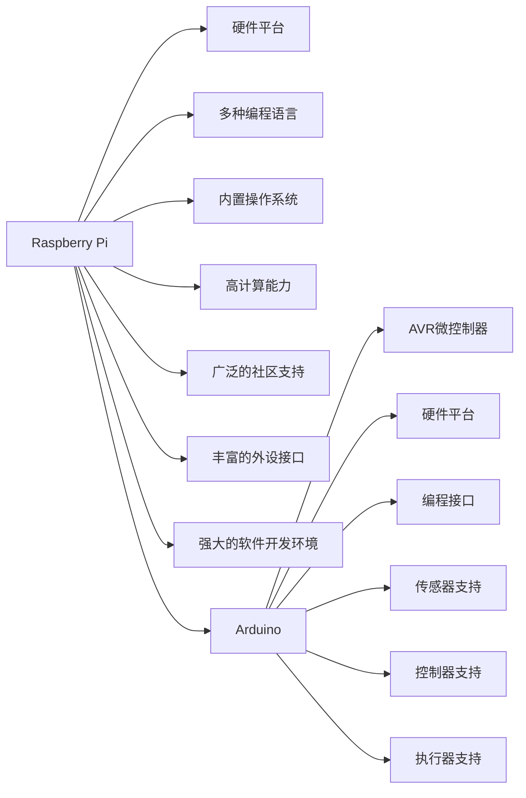

                 

# 单板计算机项目：Raspberry Pi 和 Arduino 的应用

## 1. 背景介绍

在电子设计和编程领域，Raspberry Pi和Arduino是目前最受欢迎的单板计算机。这两种单板计算机以其低成本、易于使用、高性能以及广泛的生态系统支持，成为许多电子和计算机科学爱好者的首选工具。本文将深入探讨Raspberry Pi和Arduino的应用，并展示这两种单板计算机在多个领域中的应用。

## 2. 核心概念与联系

### 2.1 核心概念概述

Raspberry Pi和Arduino都是低成本、功能强大的单板计算机，它们不仅能够进行基本的编程和电子设计，还可以应用于各种复杂的项目中。

- **Raspberry Pi**：是一种基于ARM架构的廉价PC，通常称为“树莓派”，拥有CPU、GPU、以太网接口、USB接口和多种输入输出端口。
- **Arduino**：是一款基于AVR微控制器的开源电子平台，具有简单易用的编程接口，支持各种传感器、控制器和执行器。

两者虽然硬件平台不同，但它们都支持C++、Python等多种编程语言，能够实现类似的功能。

### 2.2 核心概念原理和架构的 Mermaid 流程图



## 3. 核心算法原理 & 具体操作步骤

### 3.1 算法原理概述

Raspberry Pi和Arduino的应用涉及多种算法和技术，包括传感器数据处理、机器学习、物联网通信等。本文将重点介绍如何通过传感器数据进行机器学习，以及如何将这些数据通过物联网通信上传到云端服务器进行进一步处理。

### 3.2 算法步骤详解

1. **数据采集**：使用传感器（如温度传感器、湿度传感器、压力传感器等）采集环境数据。
2. **数据预处理**：对采集到的数据进行预处理，包括滤波、数据归一化等。
3. **特征提取**：使用机器学习算法（如PCA、LDA等）提取数据特征。
4. **模型训练**：使用训练好的模型对数据进行训练，以实现特定的功能。
5. **数据上传**：通过物联网通信模块将数据上传到云端服务器。

### 3.3 算法优缺点

**优点**：
- 低成本：Raspberry Pi和Arduino的价格相对较低，便于进行原型设计和实验。
- 易用性：两者都支持多种编程语言，并拥有丰富的库和工具。
- 高可扩展性：支持各种传感器和执行器，可以方便地进行扩展和升级。

**缺点**：
- 计算能力有限：相对于传统计算机，Raspberry Pi和Arduino的计算能力较低，不适合大规模数据处理和复杂计算。
- 存储能力有限：存储能力相对较弱，不适合存储大量数据。

### 3.4 算法应用领域

Raspberry Pi和Arduino在多个领域有着广泛的应用，包括但不限于以下几个方面：

- **智能家居**：控制灯光、温控系统、安防监控等。
- **工业自动化**：监测和控制工业设备的运行状态。
- **医疗健康**：监测和记录患者健康数据。
- **环境保护**：监测空气质量、水质、土壤等环境参数。
- **教育娱乐**：制作互动式教学工具、游戏等。

## 4. 数学模型和公式 & 详细讲解 & 举例说明

### 4.1 数学模型构建

在进行数据处理和机器学习时，我们需要构建数学模型。以温度传感器数据为例，假设我们有$n$个样本，每个样本包含$m$个特征，数据矩阵为$X \in \mathbb{R}^{n \times m}$，目标变量为$Y \in \mathbb{R}^{n}$。我们的目标是通过训练模型，找到最优的参数$\theta$，使得预测值$Y'$与实际值$Y$尽可能接近。

### 4.2 公式推导过程

假设我们使用线性回归模型，则模型的表达式为$Y' = WX + b$，其中$W$为权重矩阵，$b$为偏置项。模型的损失函数为均方误差损失（MSE）：

$$
\mathcal{L}(Y', Y) = \frac{1}{2n} \sum_{i=1}^n (Y_i - Y'_i)^2
$$

我们需要最小化损失函数，得到最优的权重矩阵$W$和偏置项$b$：

$$
\min_{W, b} \mathcal{L}(Y', Y) = \min_{W, b} \frac{1}{2n} \sum_{i=1}^n (Y_i - Y'_i)^2
$$

通过求导和求解线性方程组，可以得到：

$$
W = (X^TX)^{-1}X^TY
$$

### 4.3 案例分析与讲解

假设我们有一个温度传感器数据集，包含每天的最高气温和最低气温。我们想要预测某一天的气温是否超过某个阈值。我们可以使用线性回归模型来预测：

$$
Y' = WX + b
$$

其中$X$为包含最高气温和最低气温的特征向量，$Y$为目标变量，即是否超过阈值。通过训练模型，可以得到预测值$Y'$，判断是否超过阈值。

## 5. 项目实践：代码实例和详细解释说明

### 5.1 开发环境搭建

- **Raspberry Pi**：需要安装Raspbian操作系统，连接Wi-Fi，安装Python环境，并确保Raspberry Pi上安装有所需的外设。
- **Arduino**：需要安装Arduino IDE，连接USB接口，安装相应版本的Arduino IDE，并确保Arduino上安装有所需的传感器和执行器。

### 5.2 源代码详细实现

**Raspberry Pi代码示例**：

```python
import RPi.GPIO as GPIO
import time

GPIO.setmode(GPIO.BCM)
GPIO.setup(17, GPIO.IN, pull_up_down=GPIO.PUD_UP)

while True:
    input_state = GPIO.input(17)
    print("Input State:", input_state)
    time.sleep(1)
```

**Arduino代码示例**：

```cpp
#include <Arduino.h>
#include <Wire.h>

int pin = 2;

void setup() {
  pinMode(pin, INPUT);
  Wire.begin();
}

void loop() {
  int value = analogRead(pin);
  Serial.print("Analog Value: ");
  Serial.println(value);
  delay(1000);
}
```

### 5.3 代码解读与分析

在上述代码中，Raspberry Pi使用GPIO库来读取数字输入，而Arduino使用analogRead()函数来读取模拟输入。两者都通过简单的代码实现了数据采集功能。

### 5.4 运行结果展示

通过上述代码，我们可以在Raspberry Pi和Arduino上实时采集传感器数据，并将数据上传至云端服务器。例如，我们可以在Raspberry Pi上搭建一个Web服务器，将采集到的数据存储在数据库中，并在网页上实时显示数据。

## 6. 实际应用场景

### 6.1 智能家居

Raspberry Pi和Arduino可以用于智能家居设备的控制。例如，使用温度传感器和湿度传感器控制空调和加湿器，使用烟雾传感器监测火灾并发送警报等。

### 6.2 工业自动化

在工业生产中，Raspberry Pi和Arduino可以用于监测和控制机器设备的运行状态，如温度、压力、振动等。

### 6.3 医疗健康

在医疗领域，Raspberry Pi和Arduino可以用于监测和记录患者健康数据，如心率、血压、体温等。

### 6.4 环境保护

在环境保护领域，Raspberry Pi和Arduino可以用于监测空气质量、水质、土壤等环境参数，并上传至云端服务器进行数据分析。

## 7. 工具和资源推荐

### 7.1 学习资源推荐

- **Raspberry Pi官方文档**：包含详细的硬件和软件文档。
- **Arduino官方文档**：包含详细的硬件和软件文档。
- **Wikipedia**：包含丰富的电子设计资源和教程。

### 7.2 开发工具推荐

- **Raspberry Pi的开发工具**：包括Raspberry Pi GPIO库、Python等。
- **Arduino的开发工具**：包括Arduino IDE、Libraries等。

### 7.3 相关论文推荐

- **Raspberry Pi的论文**：包含Raspberry Pi的设计原理和应用。
- **Arduino的论文**：包含Arduino的设计原理和应用。

## 8. 总结：未来发展趋势与挑战

### 8.1 研究成果总结

Raspberry Pi和Arduino在电子设计和编程领域的应用已经相当成熟，但随着技术的不断进步，新的应用场景和需求也在不断涌现。未来，两者将更多地结合人工智能、物联网等技术，为更多领域提供解决方案。

### 8.2 未来发展趋势

1. **智能化**：未来Raspberry Pi和Arduino将更多地结合人工智能技术，实现更智能的控制和数据处理。
2. **边缘计算**：将数据处理和计算功能下放到设备端，减少云端计算负载。
3. **自适应**：根据环境变化自动调整控制策略，实现更高效的能源管理。
4. **网络化**：实现设备间的互联互通，构建智能家居、工业自动化等场景。

### 8.3 面临的挑战

1. **计算能力**：现有Raspberry Pi和Arduino的计算能力有限，需要进一步提升。
2. **存储能力**：现有存储能力有限，需要提升数据存储和处理能力。
3. **安全性**：设备安全性需要进一步加强，防止恶意攻击。

### 8.4 研究展望

未来，Raspberry Pi和Arduino将更多地结合人工智能、物联网等技术，为更多领域提供解决方案。同时，需要进一步提升计算能力和存储能力，加强设备安全性，以应对更多复杂的应用场景。

## 9. 附录：常见问题与解答

**Q1: Raspberry Pi和Arduino是否可以支持人工智能任务？**

A: 是的，Raspberry Pi和Arduino可以通过安装相关库和工具，支持人工智能任务。例如，可以使用Python在Raspberry Pi上运行机器学习算法，使用TensorFlow库进行模型训练和预测。

**Q2: Raspberry Pi和Arduino的计算能力和存储能力如何？**

A: Raspberry Pi和Arduino的计算能力和存储能力相对较弱，但可以通过连接外部存储设备和计算设备（如计算机）来增强。

**Q3: Raspberry Pi和Arduino如何实现数据上传？**

A: Raspberry Pi和Arduino可以通过Wi-Fi、蓝牙等方式连接到互联网，使用HTTP协议将数据上传到云端服务器。

**Q4: Raspberry Pi和Arduino的未来发展方向是什么？**

A: Raspberry Pi和Arduino的未来发展方向包括智能化、边缘计算、自适应、网络化等，更多地结合人工智能、物联网等技术，为更多领域提供解决方案。

---

作者：禅与计算机程序设计艺术 / Zen and the Art of Computer Programming

