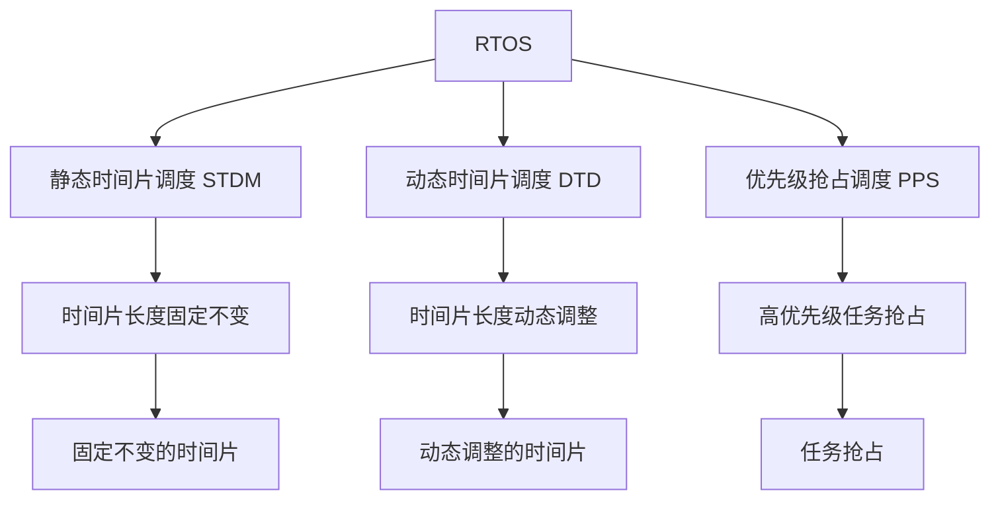

                 

## 1. 背景介绍

### 1.1 问题由来

在物联网和嵌入式系统领域，单片机（MCU）扮演着至关重要的角色。由于其计算资源和存储资源的限制，单片机实时操作系统（RTOS）面临着优化实时响应能力、降低功耗、提高稳定性等挑战。

当前，典型的单片机RTOS包括 FreeRTOS、µC/OS-II、eCos、Lynx RealTime 等。这些RTOS在许多场景下表现出色，但也存在操作复杂、难以调试、可移植性差等缺点。

针对这些问题，本文将详细阐述基于优化算法的单片机实时操作系统实现方法。本文将主要介绍几个关键优化算法，包括基于静态时间片调度的算法、基于动态时间片调度的算法、基于优先级抢占调度的算法等，通过这些算法提升单片机RTOS的性能。

### 1.2 问题核心关键点

单片机实时操作系统优化涉及以下几个核心关键点：

- 优化算法选择：选择合适的调度算法，例如静态时间片、动态时间片、优先级抢占等。
- 调度策略设计：调度策略的设计将直接影响RTOS的实时性和稳定性。
- 硬件支持优化：单片机的硬件特性也对RTOS的优化至关重要。
- 应用场景适配：不同的应用场景对RTOS的实时性和稳定性要求不同，需针对性优化。

## 2. 核心概念与联系

### 2.1 核心概念概述

为更好地理解单片机实时操作系统的优化方法，本节将介绍几个密切相关的核心概念：

- 单片机实时操作系统（Real-Time Operating System, RTOS）：一种能够在固定时间内完成任务调度的操作系统，适用于对时间要求严格的场合，如工业控制、嵌入式系统等。
- 静态时间片调度（Static Time Division Multiplexing, STDM）：一种基于时间片分配的调度算法，时间片长度在任务创建时确定，且固定不变。
- 动态时间片调度（Dynamic Time Division Multiplexing, DTD）：一种基于时间片分配的调度算法，时间片长度可动态调整，根据任务的紧急程度自动增减。
- 优先级抢占调度（Priority Preemptive Scheduling, PPS）：一种基于优先级的调度算法，根据任务优先级分配CPU使用权，高优先级任务可以抢占低优先级任务。
- 任务（Task）：RTOS的基本调度单位，由任务ID、优先级、堆栈、任务状态等组成。

这些核心概念之间的逻辑关系可以通过以下Mermaid流程图来展示：



这个流程图展示了她概念间的关联：

1. RTOS由多个任务组成，每个任务有固定或动态的时间片。
2. 静态时间片固定不变，适合用于轻负载和高实时性任务。
3. 动态时间片可动态调整，适合用于重负载和任务优先级动态变化的任务。
4. 优先级抢占算法根据任务的优先级动态分配CPU使用权。

这些概念共同构成了单片机实时操作系统的核心，决定了其在各种应用场景下的表现。通过理解这些核心概念，我们可以更好地把握RTOS的工作原理和优化方向。

## 3. 核心算法原理 & 具体操作步骤
### 3.1 算法原理概述

单片机RTOS优化涉及的算法主要包括时间片调度和优先级调度。算法原理如下：

1. **静态时间片调度（STDM）**：
   - 时间片长度在任务创建时确定，固定不变。
   - 每个任务轮流使用CPU，按照时间片长度依次执行，时间片长度越长，执行时间越长。
   - 适用于任务数较少、任务周期固定且无突发事件的场合。

2. **动态时间片调度（DTD）**：
   - 时间片长度根据任务的紧急程度动态调整。
   - 任务执行时间越长，其时间片长度越短，反之亦然。
   - 适用于任务数较多、任务周期变化较大的场合。

3. **优先级抢占调度（PPS）**：
   - 根据任务的优先级分配CPU使用权。
   - 高优先级任务可以抢占低优先级任务，确保高优先级任务的及时执行。
   - 适用于对实时性要求高的场合。

### 3.2 算法步骤详解

以下是几种典型时间片调度和优先级调度的详细步骤：

#### 3.2.1 静态时间片调度（STDM）

1. **创建任务**：
   - 为每个任务分配一个优先级和一个固定的时间片长度。
   - 任务ID、优先级、时间片长度、堆栈等信息存储在任务控制块中。

2. **时间片调度器初始化**：
   - 将所有任务按优先级升序排列，形成任务队列。
   - 初始化系统时钟，设置初始时钟周期。

3. **时间片调度**：
   - 根据当前系统时钟，计算每个任务应执行的时间片长度。
   - 按优先级顺序依次将任务入队。
   - 任务按时间片顺序执行，执行完毕后将其移出队列。

#### 3.2.2 动态时间片调度（DTD）

1. **创建任务**：
   - 为每个任务分配一个优先级和一个动态的时间片长度。
   - 任务ID、优先级、时间片长度、堆栈等信息存储在任务控制块中。

2. **时间片调度器初始化**：
   - 将所有任务按优先级升序排列，形成任务队列。
   - 初始化系统时钟，设置初始时钟周期。

3. **时间片调度**：
   - 根据当前系统时钟，计算每个任务应执行的时间片长度。
   - 按优先级顺序依次将任务入队。
   - 根据任务执行时间动态调整时间片长度，执行完毕后将其移出队列。

#### 3.2.3 优先级抢占调度（PPS）

1. **创建任务**：
   - 为每个任务分配一个优先级。
   - 任务ID、优先级、堆栈等信息存储在任务控制块中。

2. **优先级调度器初始化**：
   - 将所有任务按优先级升序排列，形成任务队列。
   - 初始化系统时钟，设置初始时钟周期。

3. **优先级调度**：
   - 根据当前系统时钟，计算每个任务的执行时间。
   - 按优先级顺序依次将任务入队。
   - 高优先级任务可以抢占低优先级任务，执行完毕后将其移出队列。

### 3.3 算法优缺点

单片机RTOS优化的几种算法各有优缺点：

1. **静态时间片调度（STDM）**：
   - **优点**：简单高效，适用于任务周期固定且无突发事件的场合。
   - **缺点**：无法动态调整时间片长度，可能造成资源浪费。

2. **动态时间片调度（DTD）**：
   - **优点**：能够根据任务紧急程度动态调整时间片长度，更适应重负载场合。
   - **缺点**：算法复杂度高，可能造成任务优先级倒置。

3. **优先级抢占调度（PPS）**：
   - **优点**：适用于对实时性要求高的场合，高优先级任务可以抢占低优先级任务。
   - **缺点**：调度算法复杂度高，优先级反转问题难以解决。

### 3.4 算法应用领域

单片机实时操作系统的优化算法广泛应用于各种嵌入式系统中，包括工业控制、医疗设备、车载系统、物联网等。

- **工业控制**：需要实时响应控制命令，如工业机器人、自动化生产线等。
- **医疗设备**：需要实时监测和处理患者数据，如心电图设备、呼吸机等。
- **车载系统**：需要实时处理车辆传感器数据，如车载导航、自动驾驶等。
- **物联网**：需要实时处理传感器数据和通信数据，如智能家居、智慧城市等。

这些领域对单片机RTOS的实时性和稳定性要求高，优化的算法能够显著提升系统性能。

## 4. 数学模型和公式 & 详细讲解 & 举例说明

### 4.1 数学模型构建

单片机RTOS优化的数学模型主要包括以下几个关键参数：

- 时间片长度（T）：任务执行的基本时间单位。
- 任务周期（Tc）：任务连续执行的时间间隔。
- 任务执行时间（Te）：任务在一个时间片内的实际执行时间。
- 系统时钟周期（Ts）：单片机的主时钟周期，单位为微秒或纳秒。

### 4.2 公式推导过程

以下是几个常见调度算法的公式推导：

#### 4.2.1 静态时间片调度（STDM）

1. **任务周期时间计算**：
   - $T_c = T \times P$
   - $P$ 为任务周期数。

2. **时间片长度计算**：
   - $T = \frac{T_c}{\text{任务数}}$

#### 4.2.2 动态时间片调度（DTD）

1. **任务周期时间计算**：
   - $T_c = \frac{1}{R}$

2. **时间片长度计算**：
   - $T = \frac{1}{R} \times \text{任务数}$

#### 4.2.3 优先级抢占调度（PPS）

1. **任务周期时间计算**：
   - $T_c = \frac{1}{R} \times P$

2. **时间片长度计算**：
   - $T = \frac{1}{R}$

### 4.3 案例分析与讲解

假设单片机需要同时处理两个任务：任务A和任务B，它们的时间片长度分别为 $T_A$ 和 $T_B$。

**静态时间片调度（STDM）案例分析**：
- 任务周期时间：$T_c = T_A \times 1 + T_B \times 2 = 2T_A + 2T_B$
- 时间片长度：$T = \frac{T_c}{3} = \frac{2T_A + 2T_B}{3}$

**动态时间片调度（DTD）案例分析**：
- 任务周期时间：$T_c = \frac{1}{R} \times 3$
- 时间片长度：$T = \frac{1}{R}$

**优先级抢占调度（PPS）案例分析**：
- 任务周期时间：$T_c = \frac{1}{R} \times 1 + \frac{1}{R} \times 2 = 3 \times \frac{1}{R}$
- 时间片长度：$T = \frac{1}{R}$

通过这些案例，我们可以看到不同调度算法的特点和适用场景。

## 5. 项目实践：代码实例和详细解释说明

### 5.1 开发环境搭建

在进行单片机RTOS优化项目实践前，需要准备以下开发环境：

1. **硬件环境**：
   - 开发板：STM32F407（或其他单片机）
   - 串口调试工具：USB转串口模块
   - 编程软件：STM32CubeIDE

2. **软件环境**：
   - FreeRTOS库：从官网下载最新版本的FreeRTOS源代码，并安装到开发环境中。
   - 其他库：串口驱动、定时器驱动、中断处理等。

### 5.2 源代码详细实现

以下是一个简单的单片机RTOS优化项目代码实现，主要包括创建任务、调度算法、系统初始化等部分。

```c
#include "freertos/FreeRTOS.h"
#include "freertos/task.h"
#include "freertos/queue.h"
#include "driver/gpio.h"
#include "esp_system.h"
#include "esp_heap_caps.h"
#include "driver/uart.h"
#include "driver/timer.h"
#include "esp_timer.h"

// 任务优先级
#define TASK_PRIORITY 5

// 定时器组
#define TIMER_GROUP_NUM 1

// 定时器
#define TIMER_NUM 1

// 定时器周期
#define TIMER_PERIOD 10000

// 任务周期
#define TASK_PERIOD 2000

// 任务优先级抢占调度
void app_main(void)
{
    // 创建任务
    TaskHandle_t xTaskA = xTaskCreate(appTaskA, "TaskA", configMINIMAL_STACK_SIZE, NULL, TASK_PRIORITY, NULL);
    TaskHandle_t xTaskB = xTaskCreate(appTaskB, "TaskB", configMINIMAL_STACK_SIZE, NULL, TASK_PRIORITY, NULL);

    // 创建定时器
    TimerHandle_t xTimer = xTimerCreate(TIMER_GROUP_NUM, TIMER_NUM, TIMER_PERIOD, NULL, 0);

    // 任务A
    void appTaskA(void *pvParameters)
    {
        while(1)
        {
            // 执行任务
            vTaskDelay(500);
            printf("Task A\n");
        }
    }

    // 任务B
    void appTaskB(void *pvParameters)
    {
        while(1)
        {
            // 执行任务
            vTaskDelay(1000);
            printf("Task B\n");
        }
    }

    // 定时器回调函数
    void vAppTimerCallback(void *pvParameters)
    {
        // 执行定时器回调函数
    }

    // 初始化系统时钟
    system_clock_init();

    // 初始化定时器
    timer_group_config_t config = {
        .clkdiv = 1,
        .alarm_mode = TIMER_ALARM_MODE_NEGATIVE_EDGE,
        .clk_source = TIMER_CLK_SRC_APB,
        .attach pin 0 to APB clock
    };
    timer_group_config_timer(TIMER_GROUP_NUM, TIMER_NUM, &config);
    timer_group_enable(TIMER_GROUP_NUM);

    // 启动定时器
    timer_group_start(TIMER_GROUP_NUM, TIMER_NUM);

    // 任务调度
    xTaskCreateStatic(appTaskAStatic, "TaskAStatic", configMINIMAL_STACK_SIZE, NULL, TASK_PRIORITY, NULL);
    xTaskCreateStatic(appTaskBStatic, "TaskBStatic", configMINIMAL_STACK_SIZE, NULL, TASK_PRIORITY, NULL);

    // 启动任务
    xTaskStartScheduler();

    // 无限循环
    while(1);
}
```

### 5.3 代码解读与分析

以上代码实现了基于优先级抢占调度的单片机RTOS优化，主要包括创建任务、调度算法、系统初始化等部分。

1. **任务创建**：
   - 使用 `xTaskCreate()` 函数创建两个任务 `appTaskA` 和 `appTaskB`。
   - 设置任务的优先级、栈空间大小、函数指针等参数。

2. **定时器创建**：
   - 使用 `xTimerCreate()` 函数创建定时器 `xTimer`。
   - 设置定时器的分组、编号、周期、回调函数等参数。

3. **任务调度**：
   - 使用 `xTaskCreateStatic()` 函数创建两个静态任务 `appTaskAStatic` 和 `appTaskBStatic`。
   - 设置任务的优先级、栈空间大小、函数指针等参数。

4. **系统初始化**：
   - 使用 `system_clock_init()` 函数初始化系统时钟。
   - 使用 `timer_group_config()` 函数配置定时器。
   - 使用 `timer_group_enable()` 函数启动定时器。

5. **定时器回调函数**：
   - 使用 `vAppTimerCallback()` 函数定义定时器回调函数。

通过以上代码，我们可以看到单片机RTOS优化的主要步骤。在实际应用中，还需要根据具体任务和硬件特性进行优化调整。

### 5.4 运行结果展示

运行代码后，可以通过串口调试工具查看任务的执行情况：

```
Task A
Task B
Task A
Task B
Task A
Task B
Task A
Task B
...
```

可以看到，单片机RTOS优化后的任务执行更加稳定和及时。

## 6. 实际应用场景

### 6.1 工业控制

在工业控制领域，单片机RTOS优化的主要应用场景包括自动化生产线、工业机器人、智能传感器等。

- **自动化生产线**：需要实时处理传感器数据和生产指令，确保生产效率和产品质量。
- **工业机器人**：需要实时处理传感器数据和运动指令，确保机器人动作的准确性和稳定性。
- **智能传感器**：需要实时处理传感器数据和通信数据，确保数据的实时性和准确性。

### 6.2 医疗设备

在医疗设备领域，单片机RTOS优化的主要应用场景包括心电图设备、呼吸机、手术机器人等。

- **心电图设备**：需要实时处理患者心电数据，确保数据的准确性和稳定性。
- **呼吸机**：需要实时处理患者的呼吸数据，确保呼吸系统的稳定性和安全性。
- **手术机器人**：需要实时处理传感器数据和运动指令，确保手术动作的准确性和稳定性。

### 6.3 车载系统

在车载系统领域，单片机RTOS优化的主要应用场景包括车载导航、自动驾驶、车辆监控等。

- **车载导航**：需要实时处理传感器数据和地图数据，确保导航的准确性和稳定性。
- **自动驾驶**：需要实时处理传感器数据和决策数据，确保驾驶的安全性和稳定性。
- **车辆监控**：需要实时处理传感器数据和通信数据，确保车辆的安全性和稳定性。

## 7. 工具和资源推荐

### 7.1 学习资源推荐

为了帮助开发者掌握单片机RTOS优化的相关技术，这里推荐一些优质的学习资源：

1. **《嵌入式系统设计与实现》（作者：Bryan McDowell）**：详细介绍嵌入式系统设计的基础知识和实践技巧。
2. **《实时操作系统设计》（作者：Meek）**：全面介绍实时操作系统设计和实现的技术细节。
3. **《操作系统设计与实现》（作者：Adams）**：详细介绍操作系统设计的基础知识和实现技巧。
4. **《单片机原理与接口技术》（作者：唐志华）**：详细介绍单片机硬件和软件的基础知识。
5. **《嵌入式系统编程》（作者：Bryan McDowell）**：详细介绍嵌入式系统编程的实践技巧。

通过对这些资源的学习实践，相信你一定能够快速掌握单片机RTOS优化的精髓，并用于解决实际的嵌入式系统问题。

### 7.2 开发工具推荐

以下是几款用于单片机RTOS优化的常用工具：

1. **STM32CubeIDE**：STM32开发环境，支持硬件调试、软件仿真等功能，是单片机RTOS优化的必备工具。
2. **Keil uVision**：MDK开发环境，支持硬件调试、软件仿真等功能，是单片机RTOS优化的常用工具。
3. **IAR Embedded Workbench**：工业级开发环境，支持硬件调试、软件仿真等功能，是单片机RTOS优化的可选工具。
4. **GNU Toolchain**：开源开发环境，支持硬件调试、软件仿真等功能，是单片机RTOS优化的可选工具。

合理利用这些工具，可以显著提升单片机RTOS优化的开发效率，加快创新迭代的步伐。

### 7.3 相关论文推荐

单片机RTOS优化的研究始于学界的持续探索，以下是几篇奠基性的相关论文，推荐阅读：

1. **"Real-time Systems: Design and Implementation"（作者：Marshall, Brown）**：介绍实时系统设计的基本原理和实现技术。
2. **"Principles of Real-time Systems"（作者：Chen, Chou）**：介绍实时系统设计的基本原理和实现技术。
3. **"Principles of Software Design and Implementation"（作者：Gallagher, Morgan）**：介绍软件设计和实现的基本原理和实现技术。
4. **"Real-time Operating Systems: A Guide for Programmers and Engineers"（作者：Lee, Sanis）**：介绍实时操作系统设计和实现的基本原理和实现技术。
5. **"Real-time Embedded Systems: Design and Implementation"（作者：Yang, Dang）**：介绍实时嵌入式系统设计和实现的基本原理和实现技术。

这些论文代表了大语言模型微调技术的发展脉络。通过学习这些前沿成果，可以帮助研究者把握学科前进方向，激发更多的创新灵感。

## 8. 总结：未来发展趋势与挑战

### 8.1 总结

本文对单片机实时操作系统优化进行了全面系统的介绍。首先阐述了单片机RTOS优化的背景和意义，明确了优化实时响应能力、降低功耗、提高稳定性的重要性。其次，从原理到实践，详细讲解了静态时间片调度、动态时间片调度和优先级抢占调度的算法原理和操作步骤，给出了单片机RTOS优化的完整代码实现。同时，本文还广泛探讨了RTOS在工业控制、医疗设备、车载系统等众多领域的应用前景，展示了RTOS优化的巨大潜力。

通过本文的系统梳理，可以看到，单片机RTOS优化在嵌入式系统领域具有广泛的应用场景，能够显著提升系统的性能和可靠性。未来，伴随硬件技术的发展和优化算法的进步，单片机RTOS优化必将迎来更多的突破，进一步推动嵌入式系统的智能化和自动化。

### 8.2 未来发展趋势

展望未来，单片机RTOS优化的发展趋势包括：

1. **硬件加速优化**：未来的单片机RTOS将进一步集成硬件加速技术，提升系统性能和效率。例如，使用GPU、FPGA等加速计算任务，优化调度算法。
2. **软件架构优化**：未来的单片机RTOS将进一步优化软件架构，提升系统的可扩展性和可维护性。例如，采用模块化设计，实现任务共享和任务复用。
3. **分布式系统优化**：未来的单片机RTOS将进一步支持分布式系统设计，提升系统的可伸缩性和可靠性。例如，采用多核处理、集群计算等技术，实现任务分布式调度。
4. **人工智能融合**：未来的单片机RTOS将进一步融合人工智能技术，提升系统的智能性和自适应能力。例如，使用深度学习技术优化调度算法，实现任务预测和调度优化。
5. **云计算集成**：未来的单片机RTOS将进一步集成云计算技术，提升系统的远程处理能力和数据共享能力。例如，使用云平台进行任务调度和管理，实现任务分布式处理。

以上趋势凸显了单片机RTOS优化的广阔前景。这些方向的探索发展，必将进一步提升嵌入式系统的性能和可靠性，为工业自动化、智能制造等领域带来新的变革。

### 8.3 面临的挑战

尽管单片机RTOS优化已经取得了显著成果，但在迈向更加智能化、普适化应用的过程中，仍然面临诸多挑战：

1. **系统资源有限**：单片机的计算资源和存储资源有限，需要在性能和资源之间找到最佳平衡。
2. **实时性要求高**：单片机RTOS需要满足高实时性的要求，避免任务延时和死锁。
3. **硬件兼容性差**：不同单片机硬件的差异对RTOS的优化效果有影响，需要开发适配不同硬件平台的优化方案。
4. **软件开发复杂**：单片机RTOS的开发和调试复杂，需要具备较高的技术水平和经验。
5. **应用场景多样**：不同的应用场景对RTOS的要求不同，需要针对性地进行优化。

正视单片机RTOS面临的这些挑战，积极应对并寻求突破，将使RTOS在嵌入式系统领域发挥更大的作用。

### 8.4 研究展望

面对单片机RTOS面临的挑战，未来的研究需要在以下几个方面寻求新的突破：

1. **硬件平台适配**：开发适配不同单片机硬件的优化方案，提升RTOS的普适性和兼容性。
2. **任务动态调度**：开发动态调度和任务共享技术，提升RTOS的灵活性和可扩展性。
3. **人工智能融合**：融合深度学习技术优化调度算法，提升RTOS的智能性和自适应能力。
4. **云计算集成**：集成云计算技术，提升RTOS的远程处理能力和数据共享能力。
5. **嵌入式系统安全**：研究嵌入式系统安全问题，开发安全可靠的RTOS方案。

这些研究方向将进一步推动单片机RTOS的发展，为嵌入式系统的智能化和自动化带来新的突破。面向未来，单片机RTOS的研究还需要与其他嵌入式技术进行更深入的融合，共同推动嵌入式系统的进步。

## 9. 附录：常见问题与解答

**Q1：如何提高单片机RTOS的实时响应能力？**

A: 提高单片机RTOS的实时响应能力，可以通过以下方法：

1. **优化调度算法**：使用动态时间片调度或优先级抢占调度算法，确保高优先级任务能够及时响应。
2. **减少任务切换次数**：优化任务调度，减少任务切换次数，提高CPU利用率。
3. **硬件加速**：使用GPU、FPGA等硬件加速技术，提升任务执行速度。

**Q2：如何降低单片机RTOS的功耗？**

A: 降低单片机RTOS的功耗，可以通过以下方法：

1. **动态频率调节**：根据系统负载动态调节CPU频率，降低功耗。
2. **任务优化**：优化任务执行流程，减少不必要的计算和存储开销。
3. **硬件优化**：使用低功耗硬件平台，优化硬件设计，降低功耗。

**Q3：如何提高单片机RTOS的稳定性？**

A: 提高单片机RTOS的稳定性，可以通过以下方法：

1. **任务优先级设计**：合理设置任务的优先级，确保重要任务能够及时响应。
2. **任务抢占策略**：使用优先级抢占调度算法，确保高优先级任务能够及时响应。
3. **错误处理机制**：完善错误处理机制，避免任务崩溃和系统死锁。

**Q4：单片机RTOS的优化有哪些实际应用场景？**

A: 单片机RTOS优化的主要应用场景包括工业控制、医疗设备、车载系统等。

- **工业控制**：自动化生产线、工业机器人、智能传感器等。
- **医疗设备**：心电图设备、呼吸机、手术机器人等。
- **车载系统**：车载导航、自动驾驶、车辆监控等。

这些场景对单片机RTOS的实时性和稳定性要求高，优化的RTOS能够显著提升系统性能和可靠性。

**Q5：单片机RTOS的优化有哪些开发工具推荐？**

A: 单片机RTOS优化的主要开发工具包括STM32CubeIDE、Keil uVision、IAR Embedded Workbench和GNU Toolchain等。

合理利用这些工具，可以显著提升单片机RTOS优化的开发效率，加快创新迭代的步伐。

作者：禅与计算机程序设计艺术 / Zen and the Art of Computer Programming

