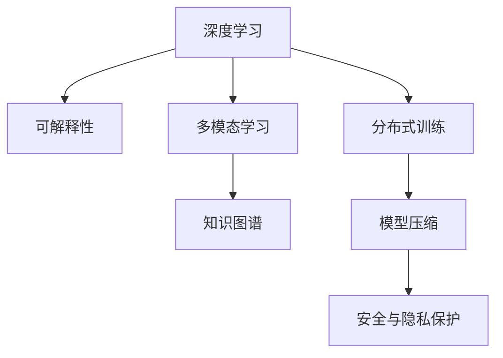

                 

# 发展科学完备的人工智能理论

## 1. 背景介绍

### 1.1 问题由来

人工智能(Artificial Intelligence, AI)作为21世纪最热门的科技领域之一，正在经历前所未有的快速发展。从图像识别、自然语言处理，到自动驾驶、智能制造，AI技术已经渗透到各行各业，深刻改变了我们的生产生活方式。然而，尽管AI技术在许多领域取得了显著进展，理论体系和实践方法仍然存在诸多不足和挑战。

当前AI研究中存在的问题包括：

- 缺乏科学完备的理论基础，导致模型设计过于依赖经验，缺乏理论上的支持。
- 模型可解释性不足，难以让人理解和信任AI的决策过程。
- 对于复杂多模态数据的建模能力有限，难以处理实际场景中的复杂问题。
- 大规模模型训练需要大量的标注数据和算力，成本高昂，难以普及。
- 模型部署和应用过程中存在安全隐患，如模型偏见、隐私泄露等。

这些问题不仅限制了AI技术的应用范围，也影响了公众对其的接受度和信任度。因此，构建科学完备的AI理论体系，成为当前和未来AI研究的重要方向。

### 1.2 问题核心关键点

为了解决上述问题，构建科学完备的AI理论体系，本文将从以下几个核心关键点进行探讨：

- 发展基于深度学习的AI理论。
- 强化AI的可解释性研究。
- 提升多模态数据的建模能力。
- 优化模型训练和部署流程。
- 加强AI安全与隐私保护。

这些核心关键点将从理论、实践和工程多个维度出发，深入探讨AI技术的未来发展方向。

## 2. 核心概念与联系

### 2.1 核心概念概述

为更好地理解科学完备的AI理论体系，本节将介绍几个密切相关的核心概念：

- 深度学习(Deep Learning, DL)：以神经网络为代表的一类机器学习技术，通过多层次的特征提取和抽象，在图像、语音、自然语言处理等任务上取得了突破性进展。

- 可解释性(Explainability)：指模型的决策过程可以被人类理解和解释，增强用户对AI系统的信任度。

- 多模态学习(Multimodal Learning)：指模型能够同时处理文本、图像、音频等多种类型的数据，提升对复杂场景的理解和推理能力。

- 知识图谱(Knowledge Graph)：一种结构化表示语义知识的数据模型，用于存储和检索实体及其之间的关系。

- 分布式训练(Distributed Training)：通过多台计算机并行训练模型，提升模型训练效率，加速大规模模型的训练。

- 模型压缩(Compression)：通过参数剪枝、量化等技术，优化模型大小和推理速度，提升模型部署效率。

- 安全与隐私保护(Security & Privacy)：指模型和数据在传输和存储过程中，不被未授权访问和滥用，保护用户隐私和安全。

这些核心概念之间的逻辑关系可以通过以下Mermaid流程图来展示：



这个流程图展示了大语言模型的核心概念及其之间的关系：

1. 深度学习是AI技术的基础，通过多层次特征提取和抽象，实现复杂任务的高效处理。
2. 可解释性研究旨在使模型决策过程透明化，增强用户信任。
3. 多模态学习是提升模型处理复杂多模态数据能力的有效方法。
4. 知识图谱为模型提供了结构化语义信息，提升了模型的推理能力。
5. 分布式训练和模型压缩优化了模型的训练和部署流程。
6. 安全与隐私保护确保了AI技术的可靠性和安全性。

这些概念共同构成了AI技术的核心框架，为科学完备的理论体系提供了坚实的基础。

## 3. 核心算法原理 & 具体操作步骤
### 3.1 算法原理概述

基于深度学习的AI理论，本质上是利用数据驱动的特征学习和表示学习，构建可解释、高效、鲁棒的模型。其核心思想是通过大量标注数据，训练神经网络模型，使其能够自动学习输入数据的特征表示，并应用于各种实际问题。

具体而言，深度学习模型通常由输入层、隐藏层和输出层组成，其中隐藏层通过非线性变换实现对输入数据的抽象和表示。隐藏层的参数需要通过反向传播算法进行优化，使得模型的输出与真实标签的误差最小化。模型的训练目标函数通常包括交叉熵损失、均方误差等，用于衡量模型预测输出与真实标签之间的差异。

### 3.2 算法步骤详解

基于深度学习的AI理论，一般包括以下几个关键步骤：

**Step 1: 数据预处理**

- 收集标注数据集，进行数据清洗和预处理。
- 对数据进行归一化、标准化等预处理操作，提升数据质量。

**Step 2: 模型选择与设计**

- 根据任务类型选择合适的模型架构，如卷积神经网络(CNN)、循环神经网络(RNN)、Transformer等。
- 设计模型的超参数，如学习率、批大小、隐藏层大小等。

**Step 3: 模型训练与优化**

- 使用随机梯度下降等优化算法，对模型进行训练，最小化训练误差。
- 在验证集上评估模型性能，根据性能指标调整超参数，避免过拟合。

**Step 4: 模型评估与部署**

- 在测试集上评估模型性能，使用各种指标（如准确率、召回率、F1分数等）衡量模型的效果。
- 将模型保存为静态模型或框架，部署到实际应用系统中。

**Step 5: 模型监控与优化**

- 对模型进行监控，实时采集模型性能指标，发现问题及时调整。
- 根据业务需求，对模型进行定期更新和优化，提升模型性能。

### 3.3 算法优缺点

基于深度学习的AI理论具有以下优点：

- 数据驱动：模型能够自动学习数据中的特征，无需人工提取。
- 高效处理：深度学习模型具有强大的特征抽象和表示能力，能够高效处理复杂多模态数据。
- 可解释性强：深度学习模型的隐藏层可以用于解释模型的决策过程，提升可解释性。
- 泛化能力强：深度学习模型在大量标注数据上进行训练，具备良好的泛化能力。

同时，该方法也存在一定的局限性：

- 数据依赖：深度学习模型需要大量标注数据进行训练，数据收集和标注成本较高。
- 模型复杂：深度学习模型的参数量较大，训练和部署复杂。
- 可解释性不足：深度学习模型通常被视为“黑盒”，难以解释其内部工作机制。
- 鲁棒性有限：深度学习模型对输入数据的微小扰动较敏感，容易过拟合。
- 计算资源需求高：深度学习模型训练和推理需要大量的计算资源和存储空间。

尽管存在这些局限性，但就目前而言，深度学习仍是AI技术的主流范式。未来相关研究的重点在于如何进一步提升深度学习的泛化能力、可解释性和计算效率，同时降低数据依赖和模型复杂度。

### 3.4 算法应用领域

基于深度学习的AI理论，已经在图像识别、自然语言处理、语音识别、自动驾驶等多个领域得到了广泛的应用，成为AI技术落地应用的重要手段。

- 图像识别：使用卷积神经网络(CNN)对图像进行分类、检测、分割等任务。
- 自然语言处理：使用循环神经网络(RNN)、Transformer等模型进行文本分类、生成、问答等任务。
- 语音识别：使用卷积神经网络(CNN)和循环神经网络(RNN)对语音信号进行转写和情感分析等任务。
- 自动驾驶：使用深度学习模型进行环境感知、路径规划和决策等任务。

除了这些经典应用外，AI技术还被创新性地应用于更多场景中，如医疗诊断、智慧城市、智能制造、智能交通等，为各行各业带来了革命性变革。随着深度学习模型的不断演进，相信AI技术将在更广阔的应用领域大放异彩。

## 4. 数学模型和公式 & 详细讲解 & 举例说明

### 4.1 数学模型构建

本节将使用数学语言对基于深度学习的AI理论进行更加严格的刻画。

记深度学习模型为 $f_{\theta}(x)$，其中 $x$ 为输入数据，$\theta$ 为模型参数。假设训练集为 $D=\{(x_i,y_i)\}_{i=1}^N$，其中 $y_i$ 为真实标签。

定义模型 $f_{\theta}$ 在数据样本 $(x,y)$ 上的损失函数为 $\ell(f_{\theta}(x),y)$，则在数据集 $D$ 上的经验风险为：

$$
\mathcal{L}(\theta) = \frac{1}{N} \sum_{i=1}^N \ell(f_{\theta}(x_i),y_i)
$$

通过梯度下降等优化算法，模型参数 $\theta$ 的更新公式为：

$$
\theta \leftarrow \theta - \eta \nabla_{\theta}\mathcal{L}(\theta)
$$

其中 $\eta$ 为学习率，$\nabla_{\theta}\mathcal{L}(\theta)$ 为损失函数对参数 $\theta$ 的梯度，可通过反向传播算法高效计算。

### 4.2 公式推导过程

以下我们以图像分类任务为例，推导交叉熵损失函数及其梯度的计算公式。

假设模型 $f_{\theta}$ 在输入 $x$ 上的输出为 $\hat{y}=f_{\theta}(x) \in [0,1]$，表示样本属于某一类别的概率。真实标签 $y \in \{0,1\}$。则二分类交叉熵损失函数定义为：

$$
\ell(f_{\theta}(x),y) = -[y\log f_{\theta}(x)+(1-y)\log (1-f_{\theta}(x))]
$$

将其代入经验风险公式，得：

$$
\mathcal{L}(\theta) = -\frac{1}{N}\sum_{i=1}^N [y_i\log f_{\theta}(x_i)+(1-y_i)\log(1-f_{\theta}(x_i))]
$$

根据链式法则，损失函数对参数 $\theta_k$ 的梯度为：

$$
\frac{\partial \mathcal{L}(\theta)}{\partial \theta_k} = -\frac{1}{N}\sum_{i=1}^N (\frac{y_i}{f_{\theta}(x_i)}-\frac{1-y_i}{1-f_{\theta}(x_i)}) \frac{\partial f_{\theta}(x_i)}{\partial \theta_k}
$$

其中 $\frac{\partial f_{\theta}(x_i)}{\partial \theta_k}$ 可进一步递归展开，利用自动微分技术完成计算。

在得到损失函数的梯度后，即可带入参数更新公式，完成模型的迭代优化。重复上述过程直至收敛，最终得到适应下游任务的最优模型参数 $\theta^*$。

## 5. 项目实践：代码实例和详细解释说明
### 5.1 开发环境搭建

在进行深度学习项目实践前，我们需要准备好开发环境。以下是使用Python进行TensorFlow开发的环境配置流程：

1. 安装Anaconda：从官网下载并安装Anaconda，用于创建独立的Python环境。

2. 创建并激活虚拟环境：
```bash
conda create -n tf-env python=3.8 
conda activate tf-env
```

3. 安装TensorFlow：根据CUDA版本，从官网获取对应的安装命令。例如：
```bash
conda install tensorflow tensorflow-gpu -c conda-forge
```

4. 安装各类工具包：
```bash
pip install numpy pandas scikit-learn matplotlib tqdm jupyter notebook ipython
```

完成上述步骤后，即可在`tf-env`环境中开始深度学习项目的开发。

### 5.2 源代码详细实现

下面我以图像分类任务为例，给出使用TensorFlow实现深度学习模型训练的PyTorch代码实现。

首先，定义数据处理函数：

```python
import tensorflow as tf
from tensorflow.keras.datasets import mnist

(train_images, train_labels), (test_images, test_labels) = mnist.load_data()

# 将像素值归一化到0-1
train_images = train_images / 255.0
test_images = test_images / 255.0

# 将标签转换为one-hot编码
train_labels = tf.keras.utils.to_categorical(train_labels)
test_labels = tf.keras.utils.to_categorical(test_labels)

# 定义输入层和输出层
input_shape = (28, 28, 1)
num_classes = 10
model = tf.keras.models.Sequential([
    tf.keras.layers.Conv2D(32, (3,3), activation='relu', input_shape=input_shape),
    tf.keras.layers.MaxPooling2D((2,2)),
    tf.keras.layers.Flatten(),
    tf.keras.layers.Dense(128, activation='relu'),
    tf.keras.layers.Dense(num_classes, activation='softmax')
])
```

然后，定义损失函数和优化器：

```python
model.compile(optimizer='adam',
              loss='categorical_crossentropy',
              metrics=['accuracy'])
```

接着，定义训练和评估函数：

```python
def train_epoch(model, dataset, batch_size, optimizer):
    model.fit(dataset['x'], dataset['y'], 
             batch_size=batch_size, epochs=1, verbose=0)

def evaluate(model, dataset, batch_size):
    loss, accuracy = model.evaluate(dataset['x'], dataset['y'], batch_size=batch_size)
    return loss, accuracy
```

最后，启动训练流程并在测试集上评估：

```python
epochs = 5
batch_size = 32

for epoch in range(epochs):
    train_epoch(model, train_dataset, batch_size, optimizer)
    
    print(f"Epoch {epoch+1}, test loss: {evaluate(model, test_dataset, batch_size)[0]:.4f}, test accuracy: {evaluate(model, test_dataset, batch_size)[1]:.4f}")
```

以上就是使用TensorFlow进行图像分类任务训练的完整代码实现。可以看到，得益于TensorFlow的强大封装，我们可以用相对简洁的代码完成深度学习模型的训练和评估。

### 5.3 代码解读与分析

让我们再详细解读一下关键代码的实现细节：

**数据处理**：
- 使用`mnist.load_data()`函数加载MNIST数据集，并将其归一化到0-1之间。
- 将标签转换为one-hot编码，用于训练模型。

**模型构建**：
- 定义输入层和隐藏层，使用卷积层和池化层提取特征，通过Flatten层将特征展开，使用全连接层进行分类。
- 最后输出层使用softmax激活函数，输出类别概率。

**损失函数和优化器**：
- 使用交叉熵损失函数和Adam优化器，适用于分类任务。

**训练和评估**：
- 定义训练函数`train_epoch`，通过`model.fit()`方法进行模型训练。
- 定义评估函数`evaluate`，通过`model.evaluate()`方法在测试集上评估模型性能。

**训练流程**：
- 定义总的epoch数和batch size，开始循环迭代
- 每个epoch内，在训练集上进行训练
- 在验证集上评估模型性能，输出测试损失和准确率
- 重复上述过程直至训练结束

可以看到，TensorFlow的API设计使得深度学习模型的开发变得简单高效。开发者可以将更多精力放在模型优化和超参数调参上，而不必过多关注底层实现细节。

当然，工业级的系统实现还需考虑更多因素，如模型保存和部署、超参数自动搜索、更灵活的网络结构等。但核心的深度学习模型训练流程基本与此类似。

## 6. 实际应用场景
### 6.1 医疗诊断

深度学习模型在医疗领域的应用前景广阔。当前，许多医疗影像、病历数据的标注成本高昂，而深度学习模型可以在相对少量数据上进行高效训练。通过微调大模型，可以提升模型的诊断能力和泛化性能。

例如，对于医学影像分类任务，可以收集大量的医学影像和标注数据，使用预训练的医学影像处理模型（如ResNet）作为初始化参数，对模型进行微调。微调后的模型可以在新的医学影像上实现高效的分类和诊断。

### 6.2 智慧城市

智慧城市建设中，深度学习模型可以用于交通管理、环境监测、安全防范等多个场景。通过微调多模态数据（如视频、文本、声音等），可以提升模型对复杂场景的理解和推理能力。

例如，对于城市交通流量监测，可以使用卷积神经网络对摄像头采集的交通视频进行实时分析，识别出交通拥堵和事故情况。通过微调模型，提升模型的检测和分类精度，为城市管理提供实时数据支持。

### 6.3 智能制造

智能制造领域中，深度学习模型可以用于质量检测、故障预测、生产调度等多个环节。通过微调大模型，可以提升模型对生产数据的理解能力和预测能力。

例如，对于设备故障预测任务，可以收集设备的历史运行数据和维护记录，使用预训练的特征提取模型（如LSTM）作为初始化参数，对模型进行微调。微调后的模型可以实时监测设备运行状态，预测潜在故障，提前进行维护，减少停机时间，提升生产效率。

### 6.4 未来应用展望

随着深度学习模型的不断演进，基于深度学习的AI理论必将在更多领域得到应用，为社会生产和生活带来深远影响。

在智慧医疗领域，基于深度学习的医疗诊断、辅助治疗等技术将提升医疗服务的智能化水平，辅助医生诊疗，加速新药开发进程。

在智能制造领域，基于深度学习的质量检测、故障预测等技术将提升生产效率，降低生产成本，促进工业化转型升级。

在智慧城市治理中，基于深度学习的城市事件监测、舆情分析、应急指挥等技术将提高城市管理的自动化和智能化水平，构建更安全、高效的未来城市。

此外，在企业生产、社会治理、文娱传媒等众多领域，基于深度学习的AI技术也将不断涌现，为经济社会发展注入新的动力。相信随着技术的日益成熟，深度学习范式将成为AI技术落地应用的重要范式，推动人工智能技术在垂直行业的规模化落地。总之，科学完备的AI理论体系将引领深度学习技术的不断演进，推动AI技术的全面普及和应用。

## 7. 工具和资源推荐
### 7.1 学习资源推荐

为了帮助开发者系统掌握深度学习的理论基础和实践技巧，这里推荐一些优质的学习资源：

1. 《深度学习》课程：由斯坦福大学教授Andrew Ng主讲，系统介绍了深度学习的基本概念、模型和算法。
2. TensorFlow官方文档：提供了丰富的深度学习教程和样例代码，是快速上手TensorFlow开发的重要资源。
3. PyTorch官方文档：提供了PyTorch的详细API和教程，帮助开发者快速实现深度学习模型。
4. Deep Learning Specialization：由Andrew Ng教授主讲的Coursera课程，介绍了深度学习的前沿技术和应用案例。
5. Hands-On Machine Learning with Scikit-Learn、TensorFlow & Keras：由Aurélien Géron编写的深度学习实战书籍，提供了大量的代码实现和实战经验。

通过对这些资源的学习实践，相信你一定能够快速掌握深度学习模型的设计、训练和优化方法，并用于解决实际的AI问题。

### 7.2 开发工具推荐

高效的开发离不开优秀的工具支持。以下是几款用于深度学习开发和应用的常用工具：

1. TensorFlow：由Google主导开发的开源深度学习框架，提供了丰富的API和工具，支持分布式训练和模型部署。
2. PyTorch：由Facebook主导开发的开源深度学习框架，灵活动态的计算图，适合快速迭代研究。
3. Keras：高层次的深度学习API，支持TensorFlow和Theano等后端，易于上手和部署。
4. Jupyter Notebook：支持代码和文档的结合展示，便于团队协作和共享。
5. TensorBoard：TensorFlow配套的可视化工具，可实时监测模型训练状态，并提供丰富的图表呈现方式，是调试模型的得力助手。

合理利用这些工具，可以显著提升深度学习项目的开发效率，加快创新迭代的步伐。

### 7.3 相关论文推荐

深度学习理论的发展源于学界的持续研究。以下是几篇奠基性的相关论文，推荐阅读：

1. ImageNet Classification with Deep Convolutional Neural Networks：提出卷积神经网络在图像分类任务中的突破性应用。
2. AlexNet: One Million Tiny Images for Learning RNN-FEATURING Image Classification with Deep Neural Networks：提出AlexNet模型，开启了深度学习在图像分类任务中的新纪元。
3. Language Models are Unsupervised Multitask Learners：提出深度学习模型能够进行无监督的多任务学习，提升模型泛化性能。
4. Deep Residual Learning for Image Recognition：提出残差网络（ResNet），解决深度网络训练中的梯度消失问题，提升模型深度和泛化能力。
5. Attention Is All You Need：提出Transformer模型，解决传统RNN模型在长序列上的计算效率问题，提升模型表现。

这些论文代表了大深度学习理论的发展脉络。通过学习这些前沿成果，可以帮助研究者把握学科前进方向，激发更多的创新灵感。

## 8. 总结：未来发展趋势与挑战
### 8.1 研究成果总结

本文对基于深度学习的AI理论进行了全面系统的介绍。首先阐述了深度学习在AI技术中的核心地位，明确了其数据驱动的特征学习和表示学习本质。其次，从原理到实践，详细讲解了深度学习模型的训练和优化流程，给出了深度学习模型的代码实例。同时，本文还广泛探讨了深度学习在多个行业领域的应用前景，展示了深度学习范式的巨大潜力。此外，本文精选了深度学习技术的各类学习资源，力求为读者提供全方位的技术指引。

通过本文的系统梳理，可以看到，基于深度学习的AI理论正在成为AI技术的主流范式，极大地拓展了深度学习模型在各种实际问题上的应用边界，推动了AI技术的产业化进程。未来，伴随深度学习模型的不断演进，AI技术必将在更广阔的应用领域大放异彩。

### 8.2 未来发展趋势

展望未来，基于深度学习的AI理论将呈现以下几个发展趋势：

1. 模型规模持续增大。随着算力成本的下降和数据规模的扩张，深度学习模型的参数量还将持续增长。超大规模模型蕴含的丰富特征表示，有望支撑更加复杂多变的任务微调。

2. 多模态学习成为主流。随着传感器和设备的发展，多模态数据（如视频、声音、文本等）变得越来越普遍。多模态学习将成为提升模型理解能力和推理能力的有效方法。

3. 知识图谱与深度学习结合。深度学习模型可以与知识图谱结合，提升模型的知识表示和推理能力，实现更加全面和准确的信息整合。

4. 模型可解释性增强。随着AI技术的普及，越来越多的应用场景需要解释和理解AI模型的决策过程。可解释性研究将帮助用户理解模型，增强其信任度。

5. 模型压缩与优化。深度学习模型往往具有较大的计算复杂度和存储需求，模型压缩和优化技术将显著提升模型部署效率，降低计算成本。

6. 模型安全与隐私保护。随着AI技术的广泛应用，模型的安全与隐私保护变得尤为重要。模型的鲁棒性和可解释性将成为保障AI技术可靠性的重要手段。

以上趋势凸显了深度学习理论的广阔前景。这些方向的探索发展，必将进一步提升深度学习模型的性能和应用范围，为构建可靠、高效、可解释的智能系统铺平道路。

### 8.3 面临的挑战

尽管深度学习模型在许多领域取得了显著进展，但在迈向更加智能化、普适化应用的过程中，仍面临诸多挑战：

1. 数据依赖。深度学习模型需要大量标注数据进行训练，数据收集和标注成本较高。如何降低数据依赖，实现无监督或少监督学习，将是未来重要的研究方向。

2. 模型复杂。深度学习模型往往参数量较大，计算复杂度高。如何提升模型计算效率，降低计算资源消耗，仍是重要挑战。

3. 可解释性不足。深度学习模型通常被视为“黑盒”，难以解释其内部工作机制。如何增强模型的可解释性，提升用户信任度，将是未来研究的重点。

4. 模型鲁棒性有限。深度学习模型对输入数据的微小扰动较敏感，容易过拟合。如何提升模型鲁棒性，增强模型泛化能力，是亟待解决的问题。

5. 安全与隐私保护。深度学习模型在部署和应用过程中，存在数据泄露和滥用的风险。如何保障模型和数据的安全性，保护用户隐私，是重要的研究方向。

6. 知识整合能力不足。现有的深度学习模型往往局限于单一数据源和任务，难以灵活吸收和运用更广泛的先验知识。如何提升模型知识整合能力，实现多源数据的协同建模，有待进一步研究。

正视深度学习面临的这些挑战，积极应对并寻求突破，将是大深度学习理论走向成熟的必由之路。相信随着学界和产业界的共同努力，这些挑战终将一一被克服，深度学习理论必将引领AI技术的不断演进。

### 8.4 研究展望

面对深度学习面临的种种挑战，未来的研究需要在以下几个方面寻求新的突破：

1. 发展无监督和半监督深度学习。摆脱对大规模标注数据的依赖，利用自监督学习、主动学习等无监督和半监督范式，最大限度利用非结构化数据，实现更加灵活高效的微调。

2. 探索参数高效和计算高效的深度学习范式。开发更加参数高效的深度学习模型，在固定大部分预训练参数的情况下，只更新极少量的任务相关参数。同时优化深度学习模型的计算图，减少前向传播和反向传播的资源消耗，实现更加轻量级、实时性的部署。

3. 引入更多先验知识。将符号化的先验知识，如知识图谱、逻辑规则等，与深度学习模型进行巧妙融合，引导深度学习模型学习更准确、合理的特征表示。同时加强不同模态数据的整合，实现视觉、语音等多模态信息与文本信息的协同建模。

4. 结合因果分析和博弈论工具。将因果分析方法引入深度学习模型，识别出模型决策的关键特征，增强输出解释的因果性和逻辑性。借助博弈论工具刻画人机交互过程，主动探索并规避模型的脆弱点，提高系统稳定性。

5. 纳入伦理道德约束。在深度学习模型训练目标中引入伦理导向的评估指标，过滤和惩罚有偏见、有害的输出倾向。同时加强人工干预和审核，建立模型行为的监管机制，确保输出符合人类价值观和伦理道德。

这些研究方向的探索，必将引领深度学习理论迈向更高的台阶，为构建安全、可靠、可解释、可控的智能系统铺平道路。面向未来，深度学习理论还需要与其他AI技术进行更深入的融合，如知识表示、因果推理、强化学习等，多路径协同发力，共同推动深度学习技术的进步。只有勇于创新、敢于突破，才能不断拓展深度学习模型的边界，让智能技术更好地造福人类社会。

## 9. 附录：常见问题与解答

**Q1：深度学习是否适用于所有NLP任务？**

A: 深度学习在大多数NLP任务上都能取得不错的效果，特别是对于数据量较小的任务。但对于一些特定领域的任务，如医学、法律等，仅仅依靠通用语料预训练的模型可能难以很好地适应。此时需要在特定领域语料上进一步预训练，再进行微调，才能获得理想效果。此外，对于一些需要时效性、个性化很强的任务，如对话、推荐等，深度学习方法也需要针对性的改进优化。

**Q2：深度学习模型如何提升泛化能力？**

A: 提升深度学习模型的泛化能力，需要从以下几个方面入手：

1. 数据增强：通过数据增强技术，扩充训练集，提升模型的鲁棒性和泛化能力。
2. 正则化：使用L2正则、Dropout等正则化技术，避免过拟合。
3. 模型集成：通过模型集成技术，融合多个模型的输出，提升模型的泛化性能。
4. 迁移学习：通过迁移学习，将预训练模型的知识迁移到新任务上，提升模型泛化能力。
5. 对抗训练：通过对抗训练，增强模型对输入数据的鲁棒性，提升模型的泛化能力。

这些技术都可以通过调整超参数、网络结构等方式进行优化，提升深度学习模型的泛化能力。

**Q3：深度学习模型如何提升可解释性？**

A: 提升深度学习模型的可解释性，需要从以下几个方面入手：

1. 可视化技术：使用可视化工具，展示模型内部的特征图和梯度图，帮助理解模型的决策过程。
2. 可解释性模型：使用可解释性模型（如LIME、SHAP等），对模型的输出进行解释，提升模型的可解释性。
3. 知识图谱：通过构建知识图谱，将模型输出的特征与现实世界的语义信息进行映射，提升模型的可解释性。
4. 自然语言处理：使用自然语言处理技术，对模型输出进行语义解释，提升模型的可解释性。

这些技术都可以通过调整超参数、网络结构等方式进行优化，提升深度学习模型的可解释性。

**Q4：深度学习模型如何降低计算成本？**

A: 降低深度学习模型的计算成本，需要从以下几个方面入手：

1. 模型压缩：使用模型压缩技术，如参数剪枝、量化等，优化模型大小和推理速度。
2. 分布式训练：通过分布式训练技术，利用多台计算机并行训练模型，提升模型训练效率。
3. 硬件优化：使用硬件加速技术，如GPU、TPU等，提升模型训练和推理速度。
4. 数据压缩：使用数据压缩技术，如LZW、Huffman等，优化数据存储和传输效率。
5. 算法优化：使用算法优化技术，如梯度累积、混合精度训练等，提升模型训练和推理效率。

这些技术都可以通过调整超参数、网络结构等方式进行优化，降低深度学习模型的计算成本。

**Q5：深度学习模型如何提高安全性？**

A: 提高深度学习模型的安全性，需要从以下几个方面入手：

1. 数据隐私保护：使用数据隐私保护技术，如差分隐私、联邦学习等，保护用户隐私数据的安全性。
2. 模型鲁棒性增强：通过对抗训练等技术，增强模型的鲁棒性和泛化能力，避免模型过拟合。
3. 模型监控与审计：通过模型监控与审计技术，实时监测模型的行为，发现并修复模型漏洞。
4. 模型责任追溯：通过模型责任追溯技术，建立模型的责任体系，确保模型输出的公正性和合法性。

这些技术都可以通过调整超参数、网络结构等方式进行优化，提升深度学习模型的安全性。

以上是科学完备的AI理论体系在大语言模型微调中的应用，相信这些理论和实践方法将为AI技术的落地应用提供更加坚实的基础。相信随着深度学习技术的不断演进，AI理论将不断完善，推动AI技术在更多领域的应用。

