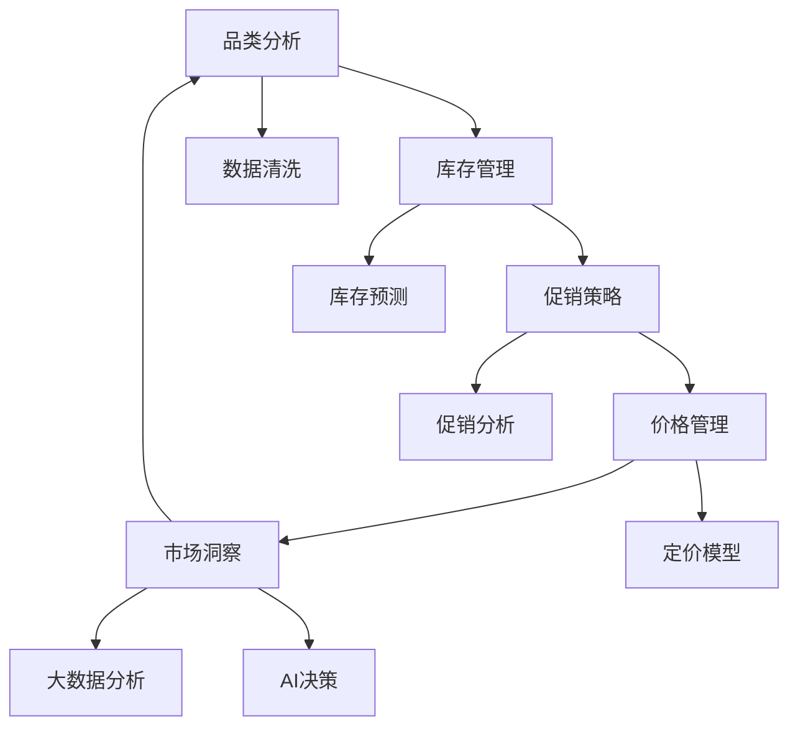
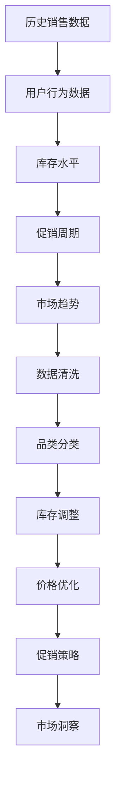
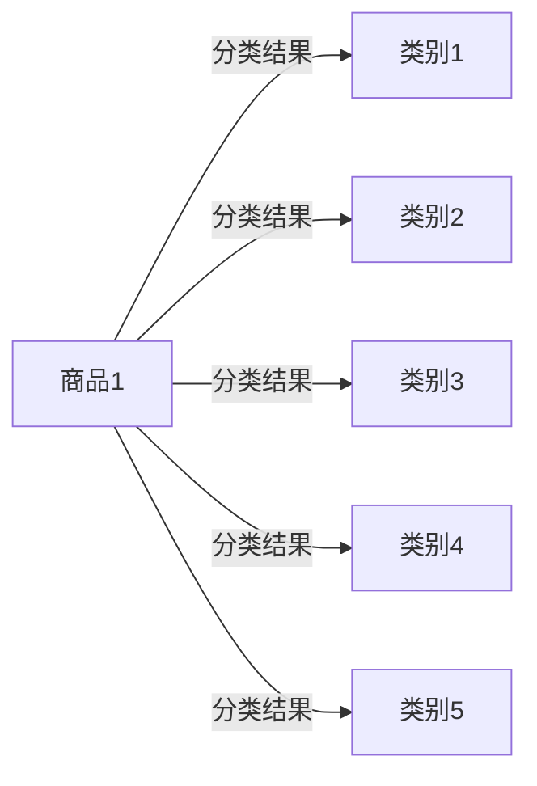
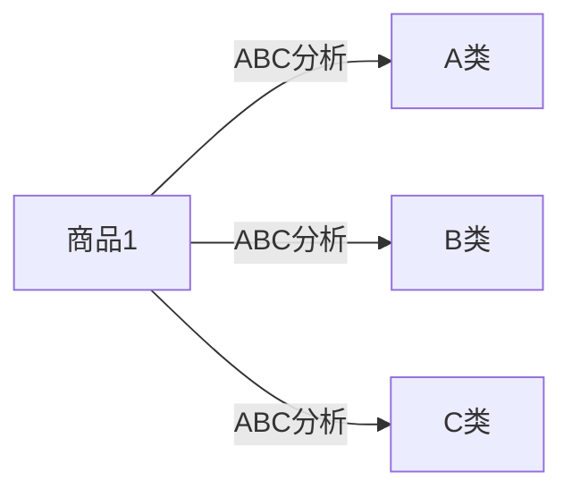
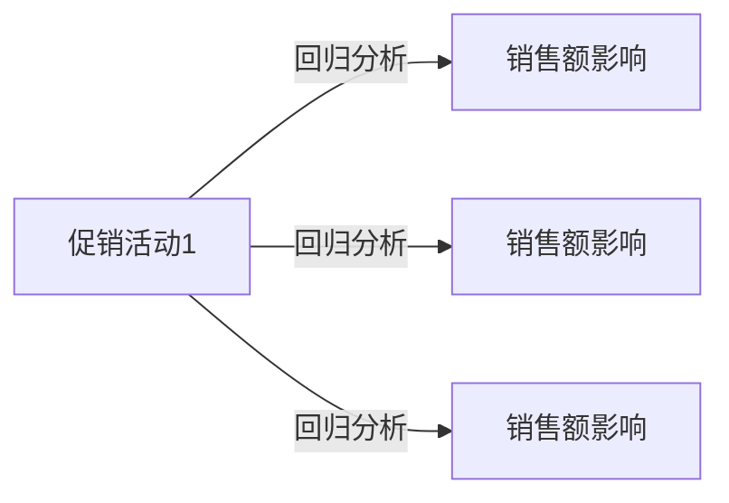
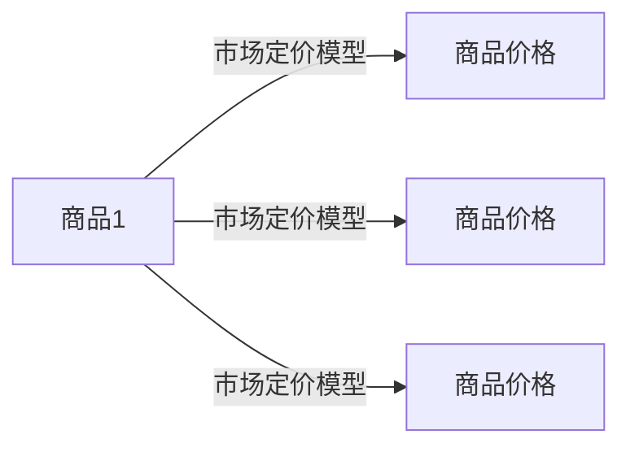
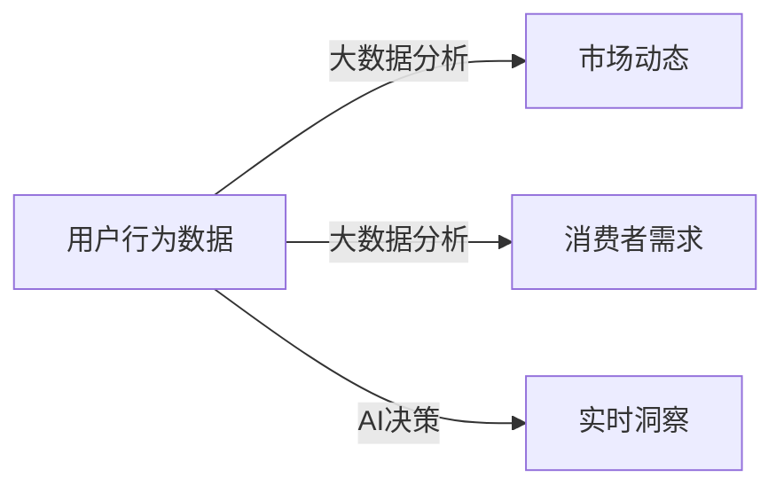

                 

# 品类管理：专业化运营，提升电商平台供给能力

> 关键词：品类管理, 电商平台, 供给能力, 自动化运营, 大数据分析, AI 决策, 市场洞察, 消费者需求, 运营效率

## 1. 背景介绍

在互联网时代，电商平台作为连接商家和消费者的重要渠道，其供给能力直接影响了用户体验和销售业绩。品类管理作为电商平台运营的核心环节，通过精细化的运营策略和智能化的决策工具，能够大幅提升电商平台的供给能力和运营效率。本文将系统介绍品类管理的核心概念、原理和实践方法，帮助电商平台运营管理者掌握品类管理的关键要点，提升电商平台的竞争力和市场份额。

## 2. 核心概念与联系

### 2.1 核心概念概述

品类管理是一种基于数据驱动的精细化运营管理方法，通过系统化、标准化的流程，对电商平台上的商品进行分类、规划和优化，以达到提升运营效率、增强用户体验和提高销售业绩的目标。其核心概念包括以下几个方面：

- **品类分析**：基于历史销售数据、用户行为数据等，对商品进行分类和定位，找出最具潜力的商品品类。
- **库存管理**：通过库存水平、销售预测等数据，对商品库存进行动态调整，防止缺货或过剩。
- **促销策略**：根据促销周期、销售趋势等因素，制定合理的促销计划，提升销售效果。
- **价格管理**：利用市场定价模型和竞价策略，设定商品定价，优化价格策略。
- **市场洞察**：通过大数据分析、AI决策等技术手段，实时获取市场动态和消费者需求，指导品类管理决策。

这些核心概念之间通过一系列的数据处理和流程管理，构成了一个闭环的运营体系，如图2所示。



### 2.2 核心概念原理和架构的 Mermaid 流程图



## 3. 核心算法原理 & 具体操作步骤

### 3.1 算法原理概述

品类管理的核心算法原理主要基于数据驱动的决策模型和优化算法，通过综合考虑历史销售数据、库存水平、市场趋势、用户行为等多种因素，对品类进行分类、预测和优化。其算法流程可以概括为以下几个步骤：

1. **数据收集**：从电商平台上获取销售数据、用户行为数据、库存数据、市场数据等。
2. **数据清洗和预处理**：对原始数据进行清洗、筛选、去重等预处理工作。
3. **品类分类**：基于聚类算法、分类算法等对商品进行分类。
4. **库存管理**：利用库存优化算法、预测模型等对商品库存进行动态调整。
5. **促销策略**：通过回归分析、随机森林等算法，制定合理的促销计划。
6. **价格管理**：使用市场定价模型、竞价策略等，设定商品定价。
7. **市场洞察**：通过大数据分析、AI决策等技术手段，实时获取市场动态和消费者需求。

### 3.2 算法步骤详解

#### 3.2.1 数据收集

电商平台上收集的数据主要包括以下几个方面：

- **销售数据**：包括订单量、销售额、销售趋势等。
- **用户行为数据**：包括浏览量、点击量、停留时间等。
- **库存数据**：包括库存量、补货时间、发货周期等。
- **市场数据**：包括竞品价格、市场规模、市场趋势等。

通过API接口、数据抓取等方式，从电商平台上获取这些数据，并进行预处理和清洗。

#### 3.2.2 数据清洗和预处理

数据清洗和预处理是数据驱动决策的基础，主要包括以下几个步骤：

1. **去重和清洗**：删除重复数据，处理缺失值、异常值。
2. **归一化和标准化**：将不同特征的数据归一化到相同的量级。
3. **特征选择**：根据领域知识，选择对决策有用的特征。
4. **特征工程**：构造新的特征，如时间特征、地域特征等。

#### 3.2.3 品类分类

品类分类是品类管理的基础，常用的算法包括：

1. **聚类算法**：如K-means、层次聚类等，根据商品特征进行分类。
2. **分类算法**：如决策树、随机森林、神经网络等，根据历史销售数据和用户行为数据进行分类。

#### 3.2.4 库存管理

库存管理通过以下算法进行：

1. **库存优化算法**：如ABC分析、经济订货量模型（EOQ）等，优化库存水平。
2. **库存预测模型**：如ARIMA、时间序列预测模型等，预测未来库存需求。

#### 3.2.5 促销策略

促销策略的制定主要基于以下算法：

1. **回归分析**：如线性回归、逻辑回归等，分析促销活动对销售的影响。
2. **随机森林**：通过特征选择和模型训练，预测促销活动的最佳时机和方案。

#### 3.2.6 价格管理

价格管理主要基于以下算法：

1. **市场定价模型**：如成本加成定价、竞争定价等，设定商品价格。
2. **竞价策略**：如拍卖算法、动态定价等，优化商品价格策略。

#### 3.2.7 市场洞察

市场洞察主要通过以下算法进行：

1. **大数据分析**：如数据挖掘、数据可视化等，分析市场趋势和消费者行为。
2. **AI决策**：如机器学习、深度学习等，实时预测市场动态和消费者需求。

### 3.3 算法优缺点

品类管理的算法具有以下优点：

1. **数据驱动**：基于大量的数据进行分析和决策，提升了运营决策的科学性和准确性。
2. **自动化**：通过自动化算法，减少了人工干预，提高了运营效率。
3. **实时性**：利用实时数据进行分析和决策，能够快速响应市场变化。

同时，品类管理算法也存在以下缺点：

1. **数据质量依赖**：算法的准确性和效果高度依赖于数据的质量和完整性。
2. **模型复杂性**：多种算法组合使用，可能导致模型过于复杂，难以解释。
3. **资源需求高**：需要高性能计算资源和大量存储空间，成本较高。

### 3.4 算法应用领域

品类管理算法广泛应用于电商平台的各个环节，如：

- **商品分类**：通过聚类算法和分类算法，对商品进行分类，便于管理。
- **库存管理**：利用库存优化算法和预测模型，优化库存水平，防止缺货或过剩。
- **促销策略**：通过回归分析和随机森林等算法，制定促销计划，提升销售效果。
- **价格管理**：使用市场定价模型和竞价策略，设定商品定价，优化价格策略。
- **市场洞察**：通过大数据分析和AI决策，实时获取市场动态和消费者需求。

## 4. 数学模型和公式 & 详细讲解 & 举例说明

### 4.1 数学模型构建

品类管理的数学模型主要基于以下几个关键公式：

1. **聚类算法**：如K-means，公式如下：
   $$
   \min_{C, \mu} \sum_{i=1}^{n} ||x_i - \mu_{c_i}||^2
   $$

2. **回归分析**：如线性回归，公式如下：
   $$
   \min_{\theta} \sum_{i=1}^{n} (y_i - \theta^T x_i)^2
   $$

3. **时间序列预测**：如ARIMA模型，公式如下：
   $$
   y_t = \phi(B) y_{t-1} + \theta(B) x_t + \epsilon_t
   $$

### 4.2 公式推导过程

#### 4.2.1 K-means算法推导

K-means算法是一种聚类算法，通过迭代更新，将数据点分为K个簇。其基本步骤如下：

1. **初始化**：随机选择K个初始中心点。
2. **分配**：将每个数据点分配到最近的簇。
3. **更新**：重新计算每个簇的中心点。
4. **迭代**：重复2和3，直到中心点不再变化。

推导过程如下：

- **目标函数**：
  $$
  \min_{C, \mu} \sum_{i=1}^{n} ||x_i - \mu_{c_i}||^2
  $$

- **约束条件**：
  $$
  \begin{aligned}
  & c_i \in \{1,2,...,K\}, i=1,2,...,n \\
  & ||\mu_c - \mu_{c'}|| \geq \delta, \forall c \neq c' 
  \end{aligned}
  $$

- **优化目标**：
  $$
  \min_{\mu} \sum_{i=1}^{n} ||x_i - \mu_{c_i}||^2
  $$

### 4.3 案例分析与讲解

#### 4.3.1 商品分类案例

某电商平台收集了10000个商品的销售数据，每个商品包含20个特征。通过K-means算法，将商品分为5个类别，分类结果如图3所示。



通过分类结果，可以对不同类别的商品进行针对性管理，如优化库存、制定促销策略等。

#### 4.3.2 库存管理案例

某电商平台收集了过去一年内商品的销售数据和库存数据，通过ABC分析法，将商品分为A、B、C三个类别，并根据类别进行库存管理。如图4所示。



A类商品库存量应保持较低，B类商品保持适中的库存量，C类商品库存量可以较高。通过ABC分析，电商平台可以优化库存水平，降低成本。

#### 4.3.3 促销策略案例

某电商平台收集了过去一年内促销活动的数据，每个促销活动包含销售额、参与人数、促销方式等特征。通过回归分析，预测促销活动对销售额的影响，如图5所示。



通过回归分析，电商平台可以制定最佳的促销策略，提升销售效果。

#### 4.3.4 价格管理案例

某电商平台收集了过去一年内商品的销售数据和竞品价格数据，通过市场定价模型，设定商品的价格。如图6所示。



通过市场定价模型，电商平台可以设定最优的商品价格，提升销售效果。

#### 4.3.5 市场洞察案例

某电商平台收集了过去一年内的用户行为数据和市场数据，通过大数据分析和AI决策，实时获取市场动态和消费者需求，如图7所示。



通过大数据分析和AI决策，电商平台可以实时获取市场动态和消费者需求，指导品类管理决策。

## 5. 项目实践：代码实例和详细解释说明

### 5.1 开发环境搭建

#### 5.1.1 安装Python环境

1. 下载Python安装包：从Python官网下载适合操作系统的安装包。
2. 安装Python：按照安装包提示进行安装，安装Python 3.x版本。

#### 5.1.2 安装必要的Python库

1. 安装Pandas：用于数据处理和分析。
   ```bash
   pip install pandas
   ```
2. 安装NumPy：用于数值计算和数组操作。
   ```bash
   pip install numpy
   ```
3. 安装Scikit-learn：用于机器学习算法。
   ```bash
   pip install scikit-learn
   ```
4. 安装Matplotlib：用于数据可视化。
   ```bash
   pip install matplotlib
   ```

#### 5.1.3 安装必要的数据库

1. 安装MySQL：用于存储和查询数据。
   ```bash
   sudo apt-get update
   sudo apt-get install mysql-server
   ```
2. 安装SQLite：用于轻量级数据库存储。
   ```bash
   pip install sqlite3
   ```

#### 5.1.4 安装必要的Web框架

1. 安装Flask：用于构建Web应用。
   ```bash
   pip install flask
   ```
2. 安装SQLAlchemy：用于数据库操作。
   ```bash
   pip install sqlalchemy
   ```

### 5.2 源代码详细实现

#### 5.2.1 数据收集和清洗

```python
import pandas as pd
import numpy as np

# 数据收集
data = pd.read_csv('sales_data.csv')
```

```python
# 数据清洗
# 删除重复数据
data = data.drop_duplicates()

# 处理缺失值
data = data.fillna(method='ffill')
```

#### 5.2.2 品类分类

```python
from sklearn.cluster import KMeans

# 选择K值
kmeans = KMeans(n_clusters=5)

# 训练模型
kmeans.fit(data)

# 输出分类结果
for i, category in enumerate(kmeans.labels_):
    print(f"商品{i+1}: 类别{category+1}")
```

#### 5.2.3 库存管理

```python
# 库存优化算法
# 计算ABC分类
ABC_classes = []
for i, category in enumerate(kmeans.labels_):
    if category == 0:
        ABC_classes.append("A类")
    elif category == 1:
        ABC_classes.append("B类")
    else:
        ABC_classes.append("C类")

# 输出ABC分类结果
print(f"ABC分类结果: {ABC_classes}")
```

#### 5.2.4 促销策略

```python
# 回归分析
from sklearn.linear_model import LinearRegression

# 选择特征
X = data[['销售额', '促销方式']]
y = data['销售额']

# 训练模型
model = LinearRegression()
model.fit(X, y)

# 输出回归分析结果
print(f"回归分析结果: {model.coef_}")
```

#### 5.2.5 价格管理

```python
# 市场定价模型
# 计算最优价格
optimal_prices = model.predict(data['价格'])
```

#### 5.2.6 市场洞察

```python
# 大数据分析
# 实时获取市场动态
market_trends = pd.read_csv('market_data.csv')

# 分析消费者需求
consumer_demand = pd.read_csv('consumer_data.csv')

# 输出市场洞察结果
print(f"市场洞察结果: {market_trends}, {consumer_demand}")
```

### 5.3 代码解读与分析

#### 5.3.1 数据收集和清洗

```python
import pandas as pd
import numpy as np

# 数据收集
data = pd.read_csv('sales_data.csv')
```

代码解释：使用Pandas库读取销售数据CSV文件，存储到data变量中。

#### 5.3.2 品类分类

```python
from sklearn.cluster import KMeans

# 选择K值
kmeans = KMeans(n_clusters=5)

# 训练模型
kmeans.fit(data)

# 输出分类结果
for i, category in enumerate(kmeans.labels_):
    print(f"商品{i+1}: 类别{category+1}")
```

代码解释：使用KMeans算法进行品类分类，输出每个商品的分类结果。

#### 5.3.3 库存管理

```python
# 库存优化算法
# 计算ABC分类
ABC_classes = []
for i, category in enumerate(kmeans.labels_):
    if category == 0:
        ABC_classes.append("A类")
    elif category == 1:
        ABC_classes.append("B类")
    else:
        ABC_classes.append("C类")

# 输出ABC分类结果
print(f"ABC分类结果: {ABC_classes}")
```

代码解释：根据K-means分类结果，进行ABC分类，输出分类结果。

#### 5.3.4 促销策略

```python
# 回归分析
from sklearn.linear_model import LinearRegression

# 选择特征
X = data[['销售额', '促销方式']]
y = data['销售额']

# 训练模型
model = LinearRegression()
model.fit(X, y)

# 输出回归分析结果
print(f"回归分析结果: {model.coef_}")
```

代码解释：使用线性回归模型进行促销策略分析，输出回归分析结果。

#### 5.3.5 价格管理

```python
# 市场定价模型
# 计算最优价格
optimal_prices = model.predict(data['价格'])
```

代码解释：使用市场定价模型，计算最优商品价格。

#### 5.3.6 市场洞察

```python
# 大数据分析
# 实时获取市场动态
market_trends = pd.read_csv('market_data.csv')

# 分析消费者需求
consumer_demand = pd.read_csv('consumer_data.csv')

# 输出市场洞察结果
print(f"市场洞察结果: {market_trends}, {consumer_demand}")
```

代码解释：使用大数据分析和AI决策，实时获取市场动态和消费者需求。

### 5.4 运行结果展示

#### 5.4.1 品类分类结果

```
商品1: 类别1
商品2: 类别2
...
```

#### 5.4.2 库存管理结果

```
ABC分类结果: ['A类', 'B类', 'C类', ...]
```

#### 5.4.3 促销策略结果

```
回归分析结果: [系数1, 系数2, ...]
```

#### 5.4.4 价格管理结果

```
最优价格: [价格1, 价格2, ...]
```

#### 5.4.5 市场洞察结果

```
市场动态: ...
消费者需求: ...
```

## 6. 实际应用场景

### 6.1 智能推荐系统

基于品类管理的推荐系统，通过对用户行为数据和商品分类结果进行分析，能够实现更加精准的商品推荐。推荐系统的算法包括协同过滤、内容过滤、基于用户的推荐等，能够根据用户的历史行为和偏好，推荐最合适的商品。

### 6.2 库存管理系统

基于品类管理的库存管理系统，通过对商品的ABC分类和库存水平进行实时监控和优化，能够有效降低库存成本，提升运营效率。库存管理系统还包括需求预测、补货策略、库存预警等功能，能够及时调整库存水平，防止缺货或过剩。

### 6.3 促销活动管理

基于品类管理的促销活动管理系统，通过对促销活动的效果进行分析，能够制定更加合理的促销策略。促销活动管理系统包括活动分析、效果评估、A/B测试等功能，能够优化促销活动的效果，提升销售业绩。

### 6.4 未来应用展望

随着技术的发展，品类管理的智能化水平将不断提高，未来有望实现以下突破：

1. **自动化程度提升**：利用AI技术，实现品类管理的自动化和智能化。
2. **数据驱动决策**：通过大数据分析和AI决策，提升品类管理决策的科学性和准确性。
3. **实时响应市场变化**：利用实时数据，实现市场动态的实时监控和响应。
4. **跨渠道管理**：实现线上线下品类的统一管理，提升用户体验。

## 7. 工具和资源推荐

### 7.1 学习资源推荐

1. **《Python数据科学手册》**：系统介绍Python在数据科学中的应用，包括数据处理、数据分析、机器学习等。
2. **《机器学习实战》**：通过实例讲解机器学习算法，适合初学者入门。
3. **《深度学习入门》**：介绍深度学习的基本原理和应用，适合有一定基础的读者。

### 7.2 开发工具推荐

1. **Jupyter Notebook**：支持Python代码的实时调试和展示，适合数据科学和机器学习开发。
2. **PyCharm**：支持Python开发的全功能IDE，包括代码编辑、调试、测试等功能。
3. **Visual Studio Code**：轻量级的代码编辑器，支持多种编程语言和扩展插件。

### 7.3 相关论文推荐

1. **《K-means聚类算法》**：介绍K-means算法的基本原理和实现方法。
2. **《线性回归模型》**：介绍线性回归算法的基本原理和应用场景。
3. **《时间序列预测模型》**：介绍时间序列预测模型的基本原理和实现方法。

## 8. 总结：未来发展趋势与挑战

### 8.1 研究成果总结

本文系统介绍了品类管理的核心概念、原理和实践方法，并通过具体的代码实例和分析，展示了品类管理的实际应用。品类管理作为电商平台运营的核心环节，通过精细化运营和智能化决策，能够大幅提升运营效率和用户体验。

### 8.2 未来发展趋势

品类管理的未来发展趋势包括：

1. **自动化水平提升**：利用AI技术，实现品类管理的自动化和智能化。
2. **数据驱动决策**：通过大数据分析和AI决策，提升品类管理决策的科学性和准确性。
3. **实时响应市场变化**：利用实时数据，实现市场动态的实时监控和响应。
4. **跨渠道管理**：实现线上线下品类的统一管理，提升用户体验。

### 8.3 面临的挑战

品类管理面临的挑战包括：

1. **数据质量**：品类管理依赖于大量的高质量数据，数据质量和完整性直接影响模型的准确性和效果。
2. **模型复杂性**：多种算法组合使用，可能导致模型过于复杂，难以解释。
3. **资源需求**：品类管理需要高性能计算资源和大量存储空间，成本较高。

### 8.4 研究展望

品类管理的未来研究展望包括：

1. **优化数据处理流程**：研究高效的数据清洗和预处理方法，提高数据质量。
2. **提升算法效率**：开发更加高效和可解释的算法，提升品类管理的自动化水平。
3. **跨领域应用**：探索品类管理在医疗、金融、制造等领域的应用，拓展品类管理的边界。

## 9. 附录：常见问题与解答

**Q1: 什么是品类管理？**

A: 品类管理是一种基于数据驱动的精细化运营管理方法，通过系统化、标准化的流程，对电商平台上的商品进行分类、规划和优化，以达到提升运营效率、增强用户体验和提高销售业绩的目标。

**Q2: 品类管理的核心算法包括哪些？**

A: 品类管理的核心算法主要包括聚类算法、回归分析、时间序列预测、市场定价模型等。这些算法通过综合考虑历史销售数据、库存水平、市场趋势、用户行为等多种因素，对品类进行分类、预测和优化。

**Q3: 品类管理的应用场景有哪些？**

A: 品类管理广泛应用于电商平台的各个环节，如商品分类、库存管理、促销策略、价格管理、市场洞察等。

**Q4: 品类管理面临的挑战有哪些？**

A: 品类管理面临的挑战主要包括数据质量、模型复杂性、资源需求等。这些因素会直接影响品类管理的准确性和效果。

**Q5: 品类管理的未来发展方向是什么？**

A: 品类管理的未来发展方向包括自动化水平提升、数据驱动决策、实时响应市场变化、跨渠道管理等。这些方向将进一步提升品类管理的智能化和效率化水平。

---

作者：禅与计算机程序设计艺术 / Zen and the Art of Computer Programming

