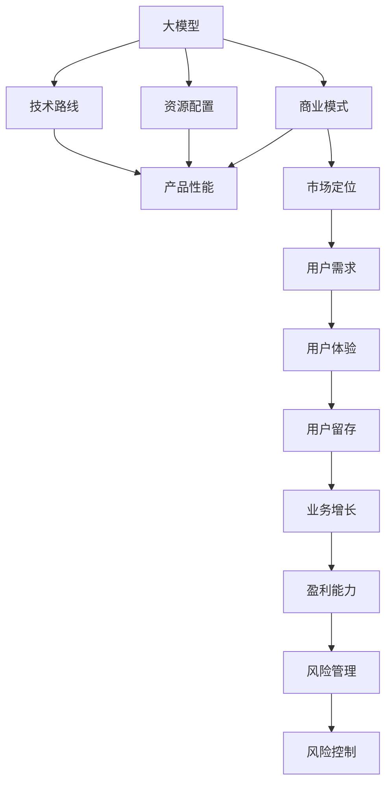

                 

# 商业模式选择：大模型创业的路线选择

> 关键词：大模型创业, 商业策略, 市场分析, 技术路线, 资源配置, 风险管理

## 1. 背景介绍

### 1.1 问题由来

随着人工智能技术的快速发展，特别是在大模型领域，如BERT、GPT-3等模型的问世，给企业和创业团队提供了前所未有的机遇。大模型在自然语言处理、计算机视觉等领域的卓越表现，让人们看到了AI技术的巨大潜力。然而，在大模型创业的道路上，如何选择合适的商业模式，充分利用技术优势，最大化商业价值，是一个值得深入探讨的问题。

### 1.2 问题核心关键点

商业模式选择对于大模型创业来说至关重要。正确的商业模式不仅能够最大化技术价值，还能有效规避市场和运营风险。本文将从多个角度，深入分析大模型创业的常见商业模式及其优缺点，为企业和创业者提供有价值的参考。

## 2. 核心概念与联系

### 2.1 核心概念概述

在大模型创业中，以下几个关键概念尤为关键：

- **大模型（Large Model）**：指在特定领域具有大规模参数量的模型，如BERT、GPT-3等。这些模型通过大量的数据训练，具备强大的泛化能力和理解能力。
- **商业模式（Business Model）**：指企业如何通过产品或服务创造和实现价值，并获取利润的方式。在大模型领域，商业模式的选择直接影响企业的盈利能力和市场竞争地位。
- **技术路线（Technology Path）**：指企业采用何种技术手段来实现商业目标。在大模型创业中，技术路线的选择关系到产品性能、资源投入和市场竞争力。
- **资源配置（Resource Allocation）**：指企业如何分配资金、人才、时间等资源，以支持商业模式和技术路线的实施。在大模型创业中，合理配置资源是成功的关键。
- **风险管理（Risk Management）**：指企业识别、评估和控制商业和运营风险的过程。在大模型创业中，风险管理尤为重要，特别是在数据隐私、模型安全和市场变化等方面。

这些概念之间相互关联，共同构成了大模型创业的核心。通过理解这些概念，我们可以更好地把握大模型创业的商业模式选择。

### 2.2 核心概念原理和架构的 Mermaid 流程图



该图展示了大模型创业中各个概念之间的关系。大模型是基础，通过选择合适的商业模式、技术路线和资源配置，构建具备产品性能、满足用户需求的产品，最终实现用户留存、业务增长和盈利能力。同时，风险管理贯穿整个过程，确保企业可持续发展。

## 3. 核心算法原理 & 具体操作步骤

### 3.1 算法原理概述

大模型创业的商业模式选择是一个复杂的多目标优化问题。其核心在于如何平衡技术投入、市场潜力、资源配置和风险管理，以实现最优的商业价值。以下是选择大模型创业模式的几个关键算法原理：

1. **市场机会评估**：通过市场调研和数据分析，评估目标市场的需求规模、增长潜力和竞争格局。
2. **技术路线优化**：根据市场需求和技术趋势，选择合适的技术路线，以最大化产品性能和用户体验。
3. **资源配置策略**：根据商业模式和技术路线，合理分配资金、人才和时间等资源，确保高效运营。
4. **风险管理框架**：建立风险评估和控制机制，识别并应对数据隐私、模型安全和市场变化等风险。

### 3.2 算法步骤详解

以下是大模型创业模式选择的详细步骤：

**Step 1: 市场机会评估**

1. **需求调研**：通过问卷调查、访谈和市场分析，了解目标用户的需求、痛点和期望。
2. **竞争分析**：分析市场上现有解决方案的优势和劣势，识别市场空缺。
3. **趋势预测**：结合技术发展趋势和行业报告，预测未来市场需求。

**Step 2: 技术路线选择**

1. **技术筛选**：根据市场需求，筛选适合的预训练模型和微调方法。
2. **性能评估**：对筛选出的技术路线进行实验和评估，确保其满足用户需求。
3. **迭代优化**：根据实验结果和用户反馈，不断优化技术路线。

**Step 3: 资源配置**

1. **资金规划**：制定详细的资金预算，包括研发、市场、运营等各个环节。
2. **人才招聘**：根据技术路线和市场目标，招聘合适的技术和管理人才。
3. **时间管理**：制定详细的项目时间表，确保各环节按计划进行。

**Step 4: 风险管理**

1. **风险识别**：识别潜在的市场、技术和运营风险。
2. **风险评估**：量化风险对企业的影响，确定风险优先级。
3. **风险控制**：制定风险应对策略，建立风险监控机制。

### 3.3 算法优缺点

大模型创业模式选择的算法具有以下优点：

1. **系统性**：通过综合考虑市场、技术、资源和风险等因素，制定全面且系统的商业模式。
2. **灵活性**：根据市场变化和技术发展，动态调整商业模式和技术路线。
3. **效率性**：通过优化资源配置和风险管理，最大化资源利用率和运营效率。

同时，也存在一些缺点：

1. **复杂性**：商业模式选择涉及多个因素，需要综合考虑，增加了决策难度。
2. **不确定性**：市场需求和技术趋势具有不确定性，难以准确预测。
3. **执行难度**：商业模式和资源配置的实施需要严格执行和监控，容易出现偏差。

### 3.4 算法应用领域

大模型创业模式选择的算法广泛应用于各种创业场景，特别是在以下几个领域：

1. **自然语言处理（NLP）**：如智能客服、文本分类、问答系统等。
2. **计算机视觉（CV）**：如图像识别、视频分析、自动驾驶等。
3. **医疗健康**：如医学影像分析、疾病预测、电子病历管理等。
4. **金融科技**：如信用评估、智能投顾、反欺诈检测等。
5. **智能制造**：如工业预测维护、自动化流程优化、供应链管理等。

这些领域的应用展示了大模型创业的广阔前景，为企业的商业成功提供了方向。

## 4. 数学模型和公式 & 详细讲解

### 4.1 数学模型构建

大模型创业模式选择的数学模型可以建模为如下优化问题：

$$
\min_{\theta} \left\{ \begin{aligned}
&\text{MarketOpportunity} + \text{TechnologyRoute} + \text{ResourceAllocation} + \text{RiskManagement} \\
&\text{Subject to constraints:} \\
&\text{Revenue} \geq \text{Cost} \\
&\text{ROI} \geq \text{Threshold} \\
&\text{RiskProbability} \leq \text{Tolerance}
\end{aligned} \right.
$$

其中，$\theta$ 代表商业模式和资源配置的决策变量，$\text{MarketOpportunity}$ 为市场机会评估得分，$\text{TechnologyRoute}$ 为技术路线优化得分，$\text{ResourceAllocation}$ 为资源配置得分，$\text{RiskManagement}$ 为风险管理得分。约束条件确保商业模式能够实现盈利并控制风险。

### 4.2 公式推导过程

1. **市场机会评估得分（$\text{MarketOpportunity}$）**：
   - 需求调研：$D = \sum_{i=1}^n D_i$
   - 竞争分析：$C = \sum_{i=1}^n C_i$
   - 趋势预测：$T = \sum_{i=1}^n T_i$

2. **技术路线优化得分（$\text{TechnologyRoute}$）**：
   - 性能评估：$P = \sum_{i=1}^m P_i$
   - 迭代优化：$I = \sum_{i=1}^m I_i$

3. **资源配置得分（$\text{ResourceAllocation}$）**：
   - 资金规划：$R_{\text{资金}} = \sum_{i=1}^k R_{i\text{资金}}$
   - 人才招聘：$R_{\text{人才}} = \sum_{i=1}^k R_{i\text{人才}}$
   - 时间管理：$R_{\text{时间}} = \sum_{i=1}^k R_{i\text{时间}}$

4. **风险管理得分（$\text{RiskManagement}$）**：
   - 风险识别：$S_{\text{风险}} = \sum_{i=1}^l S_{i\text{风险}}$
   - 风险评估：$E_{\text{风险}} = \sum_{i=1}^l E_{i\text{风险}}$
   - 风险控制：$C_{\text{风险}} = \sum_{i=1}^l C_{i\text{风险}}$

### 4.3 案例分析与讲解

以智能客服系统为例，分析其商业模式选择过程：

**Step 1: 市场机会评估**

- 需求调研：通过在线问卷和客服热线收集用户反馈，发现用户对智能客服的需求强烈。
- 竞争分析：分析市场上现有的智能客服解决方案，发现大多存在响应时间长、对话质量差等问题。
- 趋势预测：根据技术发展趋势和市场报告，预测未来智能客服市场将快速增长。

**Step 2: 技术路线选择**

- 技术筛选：选择BERT模型作为智能客服的预训练模型。
- 性能评估：在测试集上评估模型的对话生成效果，发现模型能够准确理解和生成自然语言。
- 迭代优化：根据用户反馈，对模型进行微调和优化，提升对话质量。

**Step 3: 资源配置**

- 资金规划：预算200万美元用于模型研发、市场推广和运营支持。
- 人才招聘：招聘20名数据科学家和10名软件开发工程师。
- 时间管理：制定6个月的项目时间表，按月进行阶段性评估和优化。

**Step 4: 风险管理**

- 风险识别：识别数据隐私泄露、模型泛化不足等潜在风险。
- 风险评估：通过模拟攻击和实验评估，量化风险概率和影响。
- 风险控制：建立数据加密机制、定期更新模型、引入用户监督机制等风险控制措施。

## 5. 项目实践：代码实例和详细解释说明

### 5.1 开发环境搭建

1. **环境准备**：
   - 安装Python 3.8及以上版本。
   - 安装pip依赖库，如numpy、pandas、scikit-learn等。
   - 安装Google Colab或Jupyter Notebook等开发环境。

2. **模型库选择**：
   - 选择开源预训练模型库，如TensorFlow Hub、PyTorch Hub等。
   - 安装本地或远程模型，使用预训练模型进行微调。

3. **数据准备**：
   - 准备标注数据集，如智能客服对话记录。
   - 使用Pandas进行数据预处理和分析。

### 5.2 源代码详细实现

以下是智能客服系统的大模型微调代码示例：

```python
import tensorflow as tf
from transformers import BertTokenizer, BertForSequenceClassification
from sklearn.model_selection import train_test_split

# 数据加载和预处理
train_dataset, test_dataset = train_test_split(data, test_size=0.2)
tokenizer = BertTokenizer.from_pretrained('bert-base-cased')
train_encodings = tokenizer(train_dataset, max_length=512, padding='max_length', truncation=True)
test_encodings = tokenizer(test_dataset, max_length=512, padding='max_length', truncation=True)

# 模型定义和微调
model = BertForSequenceClassification.from_pretrained('bert-base-cased', num_labels=num_labels)
train_dataset = tf.data.Dataset.from_tensor_slices(train_encodings).shuffle(buffer_size=1024).batch(batch_size)
test_dataset = tf.data.Dataset.from_tensor_slices(test_encodings).batch(batch_size)

optimizer = tf.keras.optimizers.Adam(learning_rate=2e-5)
loss = tf.keras.losses.SparseCategoricalCrossentropy(from_logits=True)
metric = tf.keras.metrics.SparseCategoricalAccuracy('accuracy')

model.compile(optimizer=optimizer, loss=loss, metrics=[metric])
model.fit(train_dataset, epochs=num_epochs, validation_data=test_dataset)
```

### 5.3 代码解读与分析

**数据准备**：
- `train_dataset` 和 `test_dataset` 是智能客服对话的文本数据集，通过 `train_test_split` 方法进行数据划分。
- `BertTokenizer` 用于将文本转换为模型可接受的输入格式，包括分词和编码。

**模型定义和微调**：
- `BertForSequenceClassification` 是Bert模型在序列分类任务上的封装，适合于智能客服系统的对话生成任务。
- `Adam` 优化器用于更新模型参数，`learning_rate` 设置学习率，`num_labels` 设置分类标签数量。
- `SparseCategoricalCrossentropy` 损失函数用于计算交叉熵损失，`SparseCategoricalAccuracy` 评价指标用于计算准确率。

**训练过程**：
- `model.fit` 方法用于模型训练，`train_dataset` 是训练数据集，`num_epochs` 设置训练轮数，`validation_data` 是验证数据集。

### 5.4 运行结果展示

训练结束后，在测试集上评估模型性能：

```python
test_loss, test_accuracy = model.evaluate(test_dataset)
print(f"Test loss: {test_loss:.4f}")
print(f"Test accuracy: {test_accuracy:.4f}")
```

以上代码展示了智能客服系统的大模型微调过程，通过预训练模型进行微调，并得到在测试集上的性能评估结果。

## 6. 实际应用场景

### 6.1 智能客服系统

智能客服系统是大模型创业的典型应用场景之一。通过大模型微调，可以显著提升客服系统的响应速度和对话质量，提升用户体验和满意度。具体应用包括：

- 客户引导：智能客服系统根据用户输入，提供精准的指引和问题解决方案。
- 语音交互：结合语音识别和理解技术，实现语音客服系统。
- 情感分析：对用户情感进行实时监测和分析，优化客服策略。

### 6.2 医疗健康

在医疗健康领域，大模型可以应用于医学影像分析、疾病预测和电子病历管理等任务。具体应用包括：

- 医学影像识别：使用大模型识别X光片、CT扫描等影像中的病变区域。
- 疾病预测：通过分析电子病历，预测患者可能患有的疾病。
- 电子病历管理：自动化处理和分析电子病历数据，提升医院工作效率。

### 6.3 金融科技

在金融科技领域，大模型可以应用于信用评估、智能投顾和反欺诈检测等任务。具体应用包括：

- 信用评估：分析用户行为和信用记录，预测用户信用风险。
- 智能投顾：通过自然语言处理技术，实现智能理财咨询和投资建议。
- 反欺诈检测：实时分析交易记录，识别异常行为和欺诈风险。

### 6.4 未来应用展望

未来，大模型创业将在更多领域得到应用，为各行各业带来变革性影响。例如：

- **智慧城市**：通过大模型分析城市数据，优化交通、环境管理等。
- **智能制造**：结合工业物联网数据，实现预测性维护和智能生产。
- **教育培训**：使用大模型进行自然语言理解和生成，提供个性化教育解决方案。
- **金融服务**：通过自然语言处理技术，提升客户服务质量和金融产品推荐精准度。

## 7. 工具和资源推荐

### 7.1 学习资源推荐

1. **《自然语言处理综述与前沿》**：全面介绍自然语言处理的基本概念和最新技术进展。
2. **《深度学习框架实战》**：详细介绍TensorFlow和PyTorch等深度学习框架的使用。
3. **《人工智能伦理与法律》**：探讨人工智能技术的伦理和法律问题，强调其在应用中的道德和责任。
4. **《商业模式设计与创新》**：详细介绍商业模式设计的基本原理和创新方法。
5. **《创业公司运营管理》**：介绍创业公司的日常运营管理和风险管理。

### 7.2 开发工具推荐

1. **TensorFlow Hub**：提供预训练模型的下载和微调服务。
2. **PyTorch Hub**：提供丰富的预训练模型和工具。
3. **HuggingFace Transformers**：提供强大的NLP模型库，支持微调和推理。
4. **Google Colab**：免费的云端开发环境，支持GPU计算。
5. **Jupyter Notebook**：支持数据处理、模型训练和结果展示。

### 7.3 相关论文推荐

1. **《Transformer架构》**：详细阐述Transformer模型的工作原理和应用。
2. **《大规模语言模型的应用研究》**：探讨大模型在自然语言处理中的广泛应用。
3. **《人工智能商业化》**：介绍人工智能技术在各行业中的商业应用和成功案例。
4. **《可解释人工智能》**：研究如何使人工智能模型具有更好的可解释性和透明度。
5. **《大数据与人工智能》**：探讨大数据技术如何助力人工智能的发展。

## 8. 总结：未来发展趋势与挑战

### 8.1 研究成果总结

本文从大模型创业的商业模式选择出发，系统介绍了市场机会评估、技术路线选择、资源配置和风险管理等关键步骤，并通过智能客服系统的案例详细讲解了微调过程。本文还探讨了大模型在医疗健康、金融科技等多个领域的应用前景，并推荐了相关学习资源和开发工具。

### 8.2 未来发展趋势

未来，大模型创业将在更多领域得到应用，展现出广阔的市场潜力和应用前景。具体趋势包括：

1. **技术突破**：随着大模型的进一步发展，将出现更加强大的语言模型和微调方法。
2. **行业应用**：大模型将在更多行业得到广泛应用，提升各行业的智能化水平。
3. **用户驱动**：用户需求和反馈将成为大模型创业的重要推动力，推动模型的不断优化和迭代。
4. **伦理合规**：大模型的伦理和安全问题将受到更多关注，规范和合规将成为重要课题。
5. **国际合作**：各国在人工智能领域的合作将不断加强，大模型创业将受益于全球资源和技术共享。

### 8.3 面临的挑战

尽管大模型创业前景广阔，但仍面临诸多挑战：

1. **技术复杂性**：大模型的训练和微调涉及多个环节，技术复杂度较高。
2. **数据获取难**：高质量标注数据获取难度大，数据隐私和安全问题亟需解决。
3. **成本高**：大模型的训练和部署需要大量计算资源和人力投入。
4. **市场竞争激烈**：大模型创业领域竞争激烈，需要制定有效的市场策略。
5. **伦理和法律问题**：大模型在应用中可能面临伦理和法律问题，需引起重视。

### 8.4 研究展望

未来，大模型创业需要在技术创新、市场策略、伦理合规等方面进行深入研究，寻求新的突破。具体展望包括：

1. **技术创新**：研发更加高效、鲁棒的预训练和微调方法，提升模型性能和可解释性。
2. **市场策略**：通过数据驱动的市场调研和用户反馈，优化商业模式和市场定位。
3. **伦理合规**：建立数据隐私和安全保障机制，确保人工智能技术的公平、透明和可解释。
4. **国际合作**：加强国际间的合作与交流，共同推动大模型技术的全球化发展。

## 9. 附录：常见问题与解答

**Q1: 如何选择适合的大模型进行微调？**

A: 选择适合的大模型需要综合考虑以下几个因素：
1. 目标任务：选择与目标任务最匹配的预训练模型。
2. 数据规模：选择适合数据规模的模型，避免过大或过小。
3. 计算资源：评估模型的计算资源需求，确保资源匹配。
4. 性能表现：通过实验评估模型在不同任务上的表现，选择最优模型。

**Q2: 大模型微调过程中的常见问题有哪些？**

A: 大模型微调过程中常见的问题包括：
1. 过拟合：模型在训练集上过拟合，导致泛化能力差。
2. 数据偏见：模型学习到了训练数据中的偏见，导致输出结果不公。
3. 模型复杂性：模型过于复杂，导致计算资源不足。
4. 模型不透明：模型难以解释其决策过程，缺乏可解释性。

**Q3: 如何提高大模型微调的效率？**

A: 提高大模型微调效率需要从以下几个方面入手：
1. 数据增强：使用数据增强技术，扩大训练集规模。
2. 正则化：应用正则化技术，如L2正则、Dropout等，避免过拟合。
3. 优化器选择：选择适合的优化器，如Adam、SGD等，优化模型参数更新。
4. 参数裁剪：只更新部分参数，减少计算资源消耗。
5. 硬件加速：使用GPU、TPU等高性能硬件，加速模型训练和推理。

**Q4: 大模型创业面临的主要风险有哪些？**

A: 大模型创业面临的主要风险包括：
1. 数据隐私：大量数据收集和处理过程中可能侵犯用户隐私。
2. 模型泛化：模型在大规模测试集上表现良好，但在实际应用中泛化性能差。
3. 市场竞争：激烈的市场竞争可能导致资源分散和利润下降。
4. 伦理问题：模型可能输出歧视性或有害结果，引发伦理争议。

**Q5: 如何构建大模型创业的商业生态？**

A: 构建大模型创业的商业生态需要从以下几个方面入手：
1. 合作伙伴：与技术供应商、数据提供商等建立合作关系。
2. 用户社区：建立用户社区，吸引用户参与模型优化和迭代。
3. 市场推广：通过市场推广活动，提升品牌知名度和用户信任度。
4. 开放平台：提供开放平台，允许开发者使用模型进行二次开发和创新。
5. 标准化规范：制定行业标准和规范，提升行业整体水平。

---

作者：禅与计算机程序设计艺术 / Zen and the Art of Computer Programming

