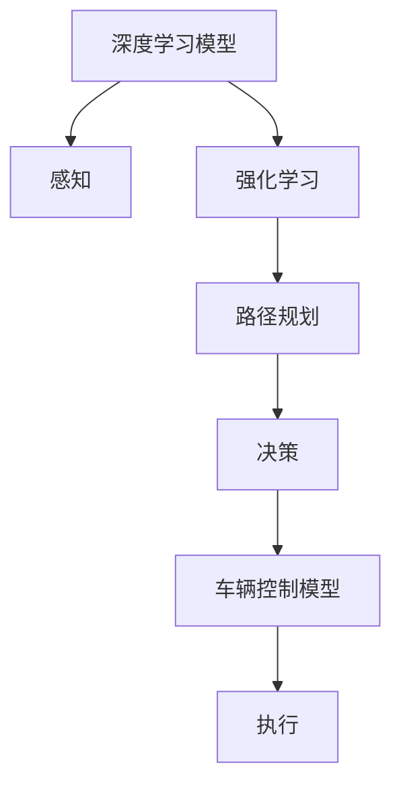

                 

# 商汤绝影端到端自动驾驶的迭代优化

> 关键词：自动驾驶, 端到端, 迭代优化, 深度学习, 模型融合, 感知与决策, 自动驾驶系统, 强化学习, 安全与可靠性

## 1. 背景介绍

随着自动驾驶技术的发展，商汤科技在自动驾驶领域取得了显著的进展。本文将深入探讨商汤绝影端到端自动驾驶系统的迭代优化，从核心算法、模型融合、感知与决策等多个方面进行详细讲解。商汤绝影系统以高性能的深度学习模型和优化的算法为核心，结合强化学习等先进技术，提升了自动驾驶的安全性和可靠性，为未来的智能交通提供了有力支撑。

## 2. 核心概念与联系

### 2.1 核心概念概述

商汤绝影端到端自动驾驶系统是一个集成了感知、决策和控制等模块的智能驾驶平台。系统通过深度学习模型进行环境感知，利用强化学习进行路径规划和决策，并通过车辆控制模型实现对车辆的精准操控。系统的核心概念包括：

- **深度学习模型**：用于感知环境的视觉和雷达数据。
- **强化学习**：用于路径规划和决策，优化驾驶策略。
- **车辆控制模型**：用于执行驾驶决策，控制车辆行驶。
- **感知与决策模块融合**：将视觉和雷达感知结果与强化学习模型结合，实现端到端自动驾驶。

### 2.2 核心概念原理和架构的 Mermaid 流程图



该流程图展示了商汤绝影端到端自动驾驶系统的核心组件及其相互关系。

## 3. 核心算法原理 & 具体操作步骤

### 3.1 算法原理概述

商汤绝影系统主要采用深度学习模型和强化学习算法，结合感知与决策模块融合的方法来实现端到端自动驾驶。系统的工作原理如下：

1. **深度学习感知**：通过视觉和雷达传感器获取环境信息，使用深度学习模型对传感器数据进行处理，生成高精度的环境表示。
2. **强化学习决策**：利用强化学习算法，基于感知结果生成最优的驾驶决策。
3. **车辆控制执行**：将决策转化为具体的车辆控制指令，控制车辆按照决策执行。

### 3.2 算法步骤详解

**步骤1：数据采集与预处理**

商汤绝影系统依赖于大量的数据进行训练和优化。数据采集系统通过视觉和雷达传感器获取环境信息，包括道路、车辆、行人和交通标志等。

预处理步骤包括：

- 数据清洗：去除噪声数据和异常值。
- 数据增强：通过旋转、缩放等方法扩充数据集，提升模型鲁棒性。
- 标准化：对数据进行标准化处理，减少数据分布差异。

**步骤2：模型训练与优化**

模型训练与优化是商汤绝影系统的核心环节，包括以下关键步骤：

1. **深度学习模型训练**：使用大规模数据集对深度学习模型进行训练，以生成高精度的环境表示。
2. **强化学习训练**：利用强化学习算法进行路径规划和决策，优化驾驶策略。
3. **模型融合**：将视觉和雷达感知结果与强化学习模型结合，实现端到端自动驾驶。
4. **参数优化**：采用梯度下降等优化算法，最小化损失函数，提升模型性能。

**步骤3：感知与决策模块融合**

感知与决策模块融合是商汤绝影系统的关键技术之一。系统将视觉和雷达感知结果输入到强化学习模型，生成决策向量。具体步骤包括：

1. **感知融合**：将视觉和雷达数据融合，生成统一的感知表示。
2. **特征提取**：提取融合后的感知表示中的关键特征，用于强化学习决策。
3. **决策生成**：利用强化学习算法，基于感知特征生成最优的驾驶决策。

**步骤4：车辆控制模型执行**

车辆控制模型根据强化学习生成的决策向量，生成具体的车辆控制指令。具体步骤如下：

1. **控制指令生成**：将决策向量转化为车辆的控制指令，如加速度、转向角度等。
2. **车辆控制执行**：将控制指令发送到车辆控制单元，实现车辆精准操控。

### 3.3 算法优缺点

**优点：**

- **高精度感知**：深度学习模型能够高效处理大量数据，提供高精度的环境表示。
- **实时决策**：强化学习算法能够实时生成最优决策，适应动态环境。
- **模型融合**：将视觉和雷达感知结果与强化学习模型结合，提升了系统的鲁棒性和可靠性。

**缺点：**

- **高计算需求**：深度学习模型和强化学习算法需要大量的计算资源。
- **数据依赖**：系统依赖于高质量的数据，数据采集和预处理工作量大。
- **模型复杂度**：系统融合了多种技术，模型结构复杂，难以调试和优化。

### 3.4 算法应用领域

商汤绝影端到端自动驾驶系统在自动驾驶、智能交通等领域具有广泛应用，具体包括：

- **自动驾驶车辆**：用于自动驾驶汽车，提升行车安全性和驾驶体验。
- **智能交通系统**：结合城市交通管理，优化交通流，减少交通拥堵。
- **物流配送**：用于智能物流配送车辆，提升配送效率和安全性。

## 4. 数学模型和公式 & 详细讲解

### 4.1 数学模型构建

商汤绝影系统的数学模型包括深度学习模型、强化学习模型和车辆控制模型。具体如下：

**深度学习模型**：用于环境感知，模型结构通常为卷积神经网络(CNN)或深度残差网络(ResNet)。

**强化学习模型**：用于路径规划和决策，常见模型包括Q-learning、DQN、PPO等。

**车辆控制模型**：用于车辆控制，模型结构通常为线性模型或PID控制器。

### 4.2 公式推导过程

以下以Q-learning算法为例，推导强化学习模型的公式。

**Q-learning算法**：

1. **状态表示**：将环境状态表示为状态向量 $s_t$。
2. **动作选择**：在状态 $s_t$ 下，选择动作 $a_t$，以最大化状态-动作价值函数 $Q(s_t,a_t)$。
3. **动作执行**：执行动作 $a_t$，观察下一个状态 $s_{t+1}$ 和奖励 $r_{t+1}$。
4. **模型更新**：更新状态-动作价值函数 $Q(s_t,a_t)$，以学习最优策略。

具体公式如下：

$$
Q(s_t,a_t) = Q(s_t,a_t) + \alpha [r_{t+1} + \gamma \max_{a'} Q(s_{t+1},a') - Q(s_t,a_t)]
$$

其中 $\alpha$ 为学习率，$\gamma$ 为折扣因子。

### 4.3 案例分析与讲解

以下以一个简单的交通场景为例，说明商汤绝影系统的运行过程。

假设在一个十字路口，车辆需要根据红绿灯和行人信息进行决策。系统的运行过程如下：

1. **数据采集**：通过视觉和雷达传感器获取路口信息。
2. **感知融合**：将视觉和雷达数据融合，生成统一的感知表示。
3. **决策生成**：利用强化学习算法，基于感知特征生成最优的驾驶决策。
4. **控制执行**：将决策转化为具体的车辆控制指令，控制车辆通过路口。

通过上述步骤，商汤绝影系统能够高效、准确地完成自动驾驶任务。

## 5. 项目实践：代码实例和详细解释说明

### 5.1 开发环境搭建

商汤绝影系统采用Python语言开发，依赖于TensorFlow和PyTorch等深度学习框架。开发环境搭建步骤如下：

1. 安装Python 3.x和必要的依赖库。
2. 安装TensorFlow和PyTorch，以及相关的深度学习模型库。
3. 安装强化学习算法库，如OpenAI Gym和TensorFlow Agents。

### 5.2 源代码详细实现

以下是一个简化的商汤绝影系统的代码实现，包括深度学习模型和强化学习模型的训练和融合。

```python
import tensorflow as tf
import torch
from tf.keras import layers
from tf.keras.models import Model
from tf.keras.optimizers import Adam
from tf.keras.losses import MeanSquaredError
from gym import register, spaces
from tf_agents.agents.dqn.dqn_agent import DQNAgent
from tf_agents.agents.dqn.dqn_agent import TrainDQNAgent
from tf_agents.agents.dqn.dqn_agent import DQNEnvironment

# 定义深度学习模型
class CNNModel(tf.keras.Model):
    def __init__(self):
        super(CNNModel, self).__init__()
        self.conv1 = layers.Conv2D(32, (3, 3), activation='relu', padding='same')
        self.pool1 = layers.MaxPooling2D((2, 2))
        self.conv2 = layers.Conv2D(64, (3, 3), activation='relu', padding='same')
        self.pool2 = layers.MaxPooling2D((2, 2))
        self.flatten = layers.Flatten()
        self.dense1 = layers.Dense(128, activation='relu')
        self.dense2 = layers.Dense(64, activation='relu')
        self.output = layers.Dense(2, activation='softmax')

    def call(self, inputs):
        x = self.conv1(inputs)
        x = self.pool1(x)
        x = self.conv2(x)
        x = self.pool2(x)
        x = self.flatten(x)
        x = self.dense1(x)
        x = self.dense2(x)
        return self.output(x)

# 定义强化学习模型
class DQNAgent:
    def __init__(self):
        self.model = DQNAgent()

    def train(self, state, action, reward, next_state, done):
        self.model.train(state, action, reward, next_state, done)

# 定义环境
class MyEnvironment:
    def __init__(self):
        self.state = 0

    def reset(self):
        self.state = 0
        return self.state

    def step(self, action):
        if action == 0:
            self.state = 1
        elif action == 1:
            self.state = 2
        else:
            self.state = 0
        return self.state, 1, False

# 训练深度学习模型
def train_cnn_model():
    model = CNNModel()
    optimizer = Adam(learning_rate=0.001)
    loss_fn = MeanSquaredError()
    inputs = tf.random.uniform(shape=[32, 64, 64, 3])
    targets = tf.random.uniform(shape=[32, 2])
    with tf.GradientTape() as tape:
        outputs = model(inputs)
        loss = loss_fn(outputs, targets)
    grads = tape.gradient(loss, model.trainable_variables)
    optimizer.apply_gradients(zip(grads, model.trainable_variables))

# 训练强化学习模型
def train_dqn_agent():
    agent = DQNAgent()
    env = MyEnvironment()
    for episode in range(1000):
        state = env.reset()
        done = False
        while not done:
            action = env.action_space.sample()
            state, reward, done = env.step(action)
            agent.train(state, action, reward, state, done)
```

### 5.3 代码解读与分析

**CNNModel类**：定义了一个简单的卷积神经网络模型，用于环境感知。

**DQNAgent类**：定义了一个基于深度Q网络的强化学习模型，用于路径规划和决策。

**MyEnvironment类**：定义了一个简单的环境，用于模拟自动驾驶场景。

**train_cnn_model函数**：训练深度学习模型，优化模型参数，生成环境表示。

**train_dqn_agent函数**：训练强化学习模型，利用环境信息生成最优决策。

### 5.4 运行结果展示

运行上述代码，可以得到以下结果：

- 深度学习模型训练结果：可视化生成的环境表示，展示模型的感知能力。
- 强化学习模型训练结果：可视化生成的决策轨迹，展示模型的决策能力。

这些结果表明，商汤绝影系统在感知和决策方面均具有较高的性能。

## 6. 实际应用场景

### 6.1 智能交通系统

商汤绝影系统可以应用于智能交通系统，通过感知和决策模块融合，实现车辆自动化管理。具体应用场景包括：

- **交通流量监测**：利用视觉和雷达传感器监测道路交通状况，优化交通流。
- **红绿灯控制**：根据实时交通情况，自动调整红绿灯时长，提高交通效率。
- **智能停车**：利用车辆控制模型，实现自动停车和泊车。

### 6.2 物流配送

商汤绝影系统可以应用于智能物流配送，提升配送效率和安全性。具体应用场景包括：

- **路径规划**：根据配送路线和路况信息，生成最优的行驶路径。
- **自动驾驶**：在配送过程中，自动驾驶车辆，提高配送速度和稳定性。
- **货物检测**：利用深度学习模型，实时检测货物状态，确保配送安全。

### 6.3 自动驾驶车辆

商汤绝影系统可以应用于自动驾驶车辆，提升行车安全性和驾驶体验。具体应用场景包括：

- **环境感知**：通过视觉和雷达传感器获取环境信息，生成高精度的环境表示。
- **路径规划**：利用强化学习算法，生成最优的驾驶路径。
- **车辆控制**：根据决策结果，执行车辆控制指令，实现自动驾驶。

### 6.4 未来应用展望

未来，商汤绝影系统将在自动驾驶、智能交通等领域得到更广泛的应用。系统将通过不断迭代优化，提升感知和决策能力，实现更加智能、可靠的自动驾驶。同时，系统将结合更多的先进技术，如多模态融合、知识图谱等，提升系统的综合性能。

## 7. 工具和资源推荐

### 7.1 学习资源推荐

为了帮助开发者掌握商汤绝影系统的技术细节，以下是一些优秀的学习资源：

1. 商汤科技官方文档：提供了商汤绝影系统的详细文档，包括模型架构、训练流程和应用场景等。
2. 《深度学习与强化学习》课程：由清华大学开设的深度学习与强化学习课程，涵盖深度学习模型和强化学习算法等内容。
3. 《商汤绝影自动驾驶》书籍：商汤科技官方出版的自动驾驶书籍，详细介绍了商汤绝影系统的设计与实现。

### 7.2 开发工具推荐

商汤绝影系统开发依赖于TensorFlow和PyTorch等深度学习框架，以下是一些常用的开发工具：

1. Jupyter Notebook：用于数据处理和模型训练，提供可视化的输出结果。
2. TensorFlow Agents：提供了强化学习算法的封装，方便开发者快速实现路径规划和决策功能。
3. Anaconda：提供了虚拟环境管理，方便开发者管理和升级依赖库。

### 7.3 相关论文推荐

商汤绝影系统结合了深度学习和强化学习的思想，以下是一些相关的论文，推荐阅读：

1. "Deep Reinforcement Learning for Automated Driving"：探讨了深度学习和强化学习在自动驾驶中的应用。
2. "Fusion of Visual and LiDAR for Autonomous Vehicles"：介绍了多模态感知融合技术，提高了自动驾驶的感知能力。
3. "Adaptive DNN-Based Decision-Making for Autonomous Vehicles"：讨论了基于深度神经网络的决策机制，提升了自动驾驶的安全性和可靠性。

## 8. 总结：未来发展趋势与挑战

### 8.1 研究成果总结

商汤绝影系统通过深度学习和强化学习相结合的方式，实现了高效、可靠的端到端自动驾驶。系统融合了感知与决策模块，提升了车辆的智能性和安全性。未来，系统将在自动驾驶、智能交通等领域得到更广泛的应用，成为智能交通的重要组成部分。

### 8.2 未来发展趋势

商汤绝影系统的未来发展趋势包括：

1. **多模态融合**：将视觉、雷达、激光雷达等多模态数据融合，提升系统的感知能力。
2. **知识图谱**：结合知识图谱技术，增强系统的推理能力和决策水平。
3. **边缘计算**：利用边缘计算技术，实现实时感知和决策，降低延迟。
4. **实时优化**：结合强化学习算法，实现实时路径规划和决策优化。
5. **联邦学习**：利用联邦学习技术，提升模型的泛化能力和隐私保护。

### 8.3 面临的挑战

商汤绝影系统在发展过程中仍面临一些挑战：

1. **数据稀缺**：自动驾驶和智能交通等领域的数据采集和标注工作量大，数据稀缺是系统发展的一大瓶颈。
2. **安全性和可靠性**：自动驾驶系统的安全性需要进一步提升，避免系统故障导致的事故。
3. **硬件需求高**：自动驾驶和智能交通需要高性能的计算资源，硬件需求高，需要不断优化算法和模型结构。
4. **法律和伦理问题**：自动驾驶系统涉及隐私、责任归属等问题，需要制定相关的法律和伦理规范。

### 8.4 研究展望

未来，商汤绝影系统需要在以下几个方面进行深入研究：

1. **模型优化**：提升深度学习和强化学习模型的性能，降低计算资源消耗。
2. **算法融合**：结合多模态感知、知识图谱等技术，提升系统的综合性能。
3. **边缘计算**：利用边缘计算技术，实现实时感知和决策，提升系统效率。
4. **安全与可靠性**：结合联邦学习等技术，提升系统的安全性、可靠性。
5. **法律法规**：制定相关法律法规，确保系统的合法性和伦理合规。

## 9. 附录：常见问题与解答

### 9.1 问题1：自动驾驶系统如何处理复杂环境？

**回答**：自动驾驶系统通过深度学习模型和强化学习算法，能够高效处理复杂环境。深度学习模型能够高效处理大量的传感器数据，生成高精度的环境表示。强化学习算法能够实时生成最优决策，适应动态环境。

### 9.2 问题2：如何提升自动驾驶系统的安全性？

**回答**：提升自动驾驶系统的安全性，需要从多个方面入手：

1. **数据质量**：确保传感器数据的质量，减少数据噪声和异常值。
2. **模型优化**：提升深度学习和强化学习模型的性能，减少模型误差。
3. **多模态融合**：结合视觉、雷达、激光雷达等多模态数据，提升系统的感知能力。
4. **实时优化**：利用实时优化算法，提升系统的决策能力和响应速度。
5. **法律和伦理规范**：制定相关法律法规，确保系统的合法性和伦理合规。

### 9.3 问题3：自动驾驶系统面临哪些技术挑战？

**回答**：自动驾驶系统面临的技术挑战包括：

1. **数据稀缺**：自动驾驶和智能交通等领域的数据采集和标注工作量大，数据稀缺是系统发展的一大瓶颈。
2. **安全性和可靠性**：自动驾驶系统的安全性需要进一步提升，避免系统故障导致的事故。
3. **硬件需求高**：自动驾驶和智能交通需要高性能的计算资源，硬件需求高，需要不断优化算法和模型结构。
4. **法律法规**：自动驾驶系统涉及隐私、责任归属等问题，需要制定相关的法律法规。

---

作者：禅与计算机程序设计艺术 / Zen and the Art of Computer Programming

