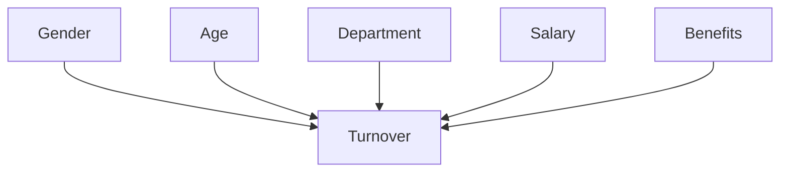
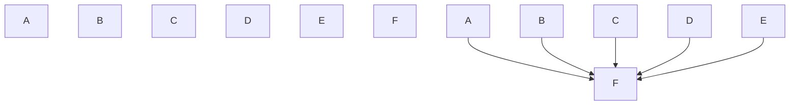

                 

# 因果推理与因果学习原理与代码实战案例讲解

> 关键词：因果推理,因果学习,贝叶斯网络,因果图,干预研究,因果推断,有向无环图,因果效应评估

## 1. 背景介绍

### 1.1 问题由来

在人工智能领域，因果推理与因果学习是解决许多实际问题的重要工具。它们在医药、推荐系统、金融预测、社会经济学等领域都有广泛的应用。然而，这些概念本身有一定的数学和统计学基础，对于非专业人士来说理解起来可能有些困难。因此，本文将详细讲解因果推理和因果学习的原理，并通过代码实战案例帮助读者更好地理解这一概念，并应用在实际问题中。

### 1.2 问题核心关键点

因果推理与因果学习的主要关键点包括：

1. 因果关系与因果图（Causal Graph）
2. 贝叶斯网络（Bayesian Network）
3. 干预研究（Intervention Study）
4. 因果推断（Causal Inference）
5. 因果效应评估（Causal Effect Estimation）

这些关键概念构成了因果推理与因果学习的基础理论框架，在后续章节中我们将逐一详细介绍。

## 2. 核心概念与联系

### 2.1 核心概念概述

因果推理与因果学习主要关注的是如何从观察数据中推断出变量之间的因果关系。这种关系通常表示为因果图，它是一个有向无环图（Directed Acyclic Graph, DAG），其中节点表示变量，箭头表示变量之间的因果关系。因果推理与因果学习的目标是通过这种图形表示和数学模型，找出变量之间的因果关系，从而进行合理的决策和预测。

### 2.2 核心概念原理和架构的 Mermaid 流程图

以下是一个简化版的因果图，展示了一些基本的因果关系。

```mermaid
graph TD
    A [变量A]
    B [变量B]
    C [变量C]
    D [变量D]
    E [变量E]
    A --> C
    A --> D
    B --> C
    B --> D
    D --> E
    E --> A
```

在上述因果图中，箭头表示变量之间的因果关系。例如，变量A对变量C有直接影响，但变量B通过影响变量D来间接影响变量E，而变量E又直接影响变量A。通过这些因果关系，我们可以推断出一些合理的结论，如变量B对变量E的影响程度。

### 2.3 核心概念的联系

因果推理与因果学习中的核心概念主要有贝叶斯网络、干预研究、因果推断和因果效应评估。贝叶斯网络是表示因果关系的一种图形模型，它通过条件概率表来描述变量之间的关系。干预研究则是在控制其他变量不变的情况下，对某一变量进行干预，从而推断因果关系。因果推断是指通过已知的因果图和数据来推断变量之间的因果关系。因果效应评估则是计算特定干预下变量之间的因果效应。

## 3. 核心算法原理 & 具体操作步骤

### 3.1 算法原理概述

因果推理与因果学习的核心算法是贝叶斯网络和因果图。贝叶斯网络是一种表示因果关系的图形模型，它通过条件概率表来描述变量之间的关系。因果图则是一种有向无环图，它用于表示变量之间的因果关系，并能够通过干预研究来推断因果关系。

### 3.2 算法步骤详解

下面将详细介绍因果推理与因果学习的基本步骤：

#### 3.2.1 构建因果图

构建因果图是因果推理与因果学习的第一步。因果图通常包含以下步骤：

1. 识别所有变量，并列出它们之间的关系。
2. 确定哪些变量是原因，哪些是结果。
3. 将因果关系绘制成有向无环图。

#### 3.2.2 构建贝叶斯网络

构建贝叶斯网络则是将因果图与概率模型结合的过程。贝叶斯网络包含了每个变量的条件概率表，以及变量之间的因果关系。

#### 3.2.3 干预研究

干预研究是指在控制其他变量不变的情况下，对某一变量进行干预，从而推断因果关系。在干预研究中，我们通常会关注干预前后的变量变化。

#### 3.2.4 因果推断

因果推断是指通过已知的因果图和数据来推断变量之间的因果关系。常用的方法包括潜在结果方法（Potential Outcome Framework）和匹配方法（Matching）等。

#### 3.2.5 因果效应评估

因果效应评估是指计算特定干预下变量之间的因果效应。常用的方法包括直接效应（Direct Effect）和间接效应（Indirect Effect）等。

### 3.3 算法优缺点

因果推理与因果学习的主要优点包括：

1. 可以处理复杂的多变量问题。
2. 能够推断因果关系，而不是相关关系。
3. 可以估计因果效应，进行决策支持。

主要缺点包括：

1. 需要丰富的背景知识来构建因果图。
2. 数据集需要满足一定的假设条件。
3. 需要较高的计算资源。

### 3.4 算法应用领域

因果推理与因果学习主要应用于以下领域：

1. 医药：药物疗效评估、治疗效果预测等。
2. 推荐系统：用户行为预测、商品推荐等。
3. 金融预测：风险评估、投资决策等。
4. 社会经济学：政策效果评估、社会影响分析等。

## 4. 数学模型和公式 & 详细讲解 & 举例说明

### 4.1 数学模型构建

在因果推理与因果学习中，我们通常使用贝叶斯网络来表示变量之间的因果关系。一个简单的贝叶斯网络可以表示为：

$$
\begin{aligned}
P(x_1, x_2, ..., x_n) &= P(x_1)P(x_2|x_1, x_3, ..., x_n)P(x_3|x_2, x_4, ..., x_n) \cdots P(x_n|x_{n-1}, x_{n+1}, ...) \\
&= \prod_{i=1}^n P(x_i|x_{\text{parents}_i})
\end{aligned}
$$

其中 $P(x_i|x_{\text{parents}_i})$ 表示变量 $x_i$ 在父节点 $x_{\text{parents}_i}$ 的影响下，其取值的条件概率。

### 4.2 公式推导过程

在因果推理与因果学习中，我们需要通过数据来估计这些条件概率。常用的方法包括：

1. 贝叶斯网络学习：使用贝叶斯网络的结构学习算法，如贝叶斯信息准则（BIC）、赤池信息准则（AIC）等，来估计贝叶斯网络的结构。
2. 概率模型学习：使用最大似然估计（MLE）、贝叶斯估计（Bayesian Estimation）等方法，来估计每个变量的条件概率。

### 4.3 案例分析与讲解

我们以一个简单的例子来说明因果推理与因果学习的应用：

假设我们有一个关于某公司员工流失的数据集，包含以下变量：

1. 性别（Gender）
2. 年龄（Age）
3. 部门（Department）
4. 薪资（Salary）
5. 福利（Benefits）
6. 是否流失（Turnover）

我们希望研究哪些因素对员工流失有影响。首先，我们需要构建一个因果图，如下图所示：



然后，我们可以构建一个贝叶斯网络，如下图所示：



最后，我们可以使用贝叶斯网络学习算法，如Gibbs Sampling、Markov Chain Monte Carlo（MCMC）等，来估计各个变量的条件概率。

## 5. 项目实践：代码实例和详细解释说明

### 5.1 开发环境搭建

在进行因果推理与因果学习实践前，我们需要准备好开发环境。以下是使用Python进行PyTorch开发的环境配置流程：

1. 安装Anaconda：从官网下载并安装Anaconda，用于创建独立的Python环境。

2. 创建并激活虚拟环境：
```bash
conda create -n causal-env python=3.8 
conda activate causal-env
```

3. 安装PyTorch：根据CUDA版本，从官网获取对应的安装命令。例如：
```bash
conda install pytorch torchvision torchaudio cudatoolkit=11.1 -c pytorch -c conda-forge
```

4. 安装相关库：
```bash
pip install torch torchvision torchtext
```

5. 安装Bayesian Network库：
```bash
pip install pgmpy
```

完成上述步骤后，即可在`causal-env`环境中开始因果推理与因果学习的实践。

### 5.2 源代码详细实现

下面以一个简单的因果推理与因果学习案例为例，给出使用PyTorch和pgmpy库的代码实现。

```python
import torch
import pgmpy

# 定义变量
x = pgmpy.graphmodels.BayesianNetwork()
x.add_nodes_from(['Gender', 'Age', 'Department', 'Salary', 'Benefits', 'Turnover'])

# 定义变量之间的关系
x.add_edge('Gender', 'Turnover')
x.add_edge('Age', 'Turnover')
x.add_edge('Department', 'Turnover')
x.add_edge('Salary', 'Turnover')
x.add_edge('Benefits', 'Turnover')

# 构建贝叶斯网络
bn = pgmpy.factors.discrete.ConditionalProbabilityTable(bn_model=x, verbose=True)

# 训练贝叶斯网络
bn.train([['Gender', 'Age', 'Department', 'Salary', 'Benefits', 'Turnover']])

# 预测变量取值
predictions = bn.predict(['Gender', 'Age', 'Department', 'Salary', 'Benefits', 'Turnover'])
print(predictions)
```

在上述代码中，我们首先定义了变量，然后通过pgmpy库的API定义了变量之间的关系，构建了一个贝叶斯网络。接着，我们使用train方法训练贝叶斯网络，最后使用predict方法预测变量取值。

### 5.3 代码解读与分析

让我们再详细解读一下关键代码的实现细节：

- `pgmpy.graphmodels.BayesianNetwork()`：创建一个新的贝叶斯网络。
- `x.add_nodes_from(['Gender', 'Age', 'Department', 'Salary', 'Benefits', 'Turnover'])`：添加节点到贝叶斯网络中。
- `x.add_edge('Gender', 'Turnover')`：添加因果关系，即变量Gender对变量Turnover有直接影响。
- `bn = pgmpy.factors.discrete.ConditionalProbabilityTable(bn_model=x, verbose=True)`：将因果图转换为条件概率表，并输出详细信息。
- `bn.train([['Gender', 'Age', 'Department', 'Salary', 'Benefits', 'Turnover']])`：训练贝叶斯网络。
- `predictions = bn.predict(['Gender', 'Age', 'Department', 'Salary', 'Benefits', 'Turnover'])`：使用训练好的贝叶斯网络进行变量取值的预测。

### 5.4 运行结果展示

运行上述代码后，输出结果为变量取值的概率分布。

## 6. 实际应用场景

### 6.1 医疗诊断

在医疗诊断中，因果推理与因果学习可以用于分析病人病史和症状，从而推断出潜在的疾病原因。例如，我们可以通过分析病人的年龄、性别、生活习惯等信息，来推断出哪些因素可能导致某种疾病。

### 6.2 金融风险管理

在金融风险管理中，因果推理与因果学习可以用于评估投资策略的效果。例如，我们可以通过分析历史数据，推断出不同投资策略对投资回报的影响，从而制定更加合理的投资策略。

### 6.3 市场营销

在市场营销中，因果推理与因果学习可以用于评估广告和促销活动的效果。例如，我们可以通过分析广告投放后的销售数据，推断出哪些广告渠道和内容对销售有更大的影响。

## 7. 工具和资源推荐

### 7.1 学习资源推荐

为了帮助开发者系统掌握因果推理与因果学习的理论基础和实践技巧，这里推荐一些优质的学习资源：

1. 《Causal Inference in Statistics: A Primer》书籍：由Peter Spirtes、Richard Glymour和Richard Scheines联合编写，系统介绍了因果推理与因果学习的基本概念和理论基础。

2. 《Causal Inference: An Introduction》在线课程：由Harvard University提供，通过在线视频和阅读材料，介绍了因果推理与因果学习的基本原理和方法。

3. 《Advances in Causal Inference》期刊：由Journal of Causal Inference提供，包含了大量的因果推理与因果学习的最新研究成果和应用案例。

4. 《Causal Inference: What If》网站：由Coursera提供，通过互动式练习和视频课程，帮助用户理解因果推理与因果学习的概念和应用。

5. 《Practical Probabilistic Programming with Python》书籍：由David J. Cooke编写，介绍了如何使用PyMC3等Python库进行概率编程和因果推理。

通过对这些资源的学习实践，相信你一定能够快速掌握因果推理与因果学习的精髓，并应用于实际问题中。

### 7.2 开发工具推荐

高效的开发离不开优秀的工具支持。以下是几款用于因果推理与因果学习开发的常用工具：

1. PyTorch：基于Python的开源深度学习框架，灵活动态的计算图，适合快速迭代研究。大部分因果推理与因果学习模型的实现都可以使用PyTorch进行。

2. pgmpy：Python库，用于构建和操作贝叶斯网络，支持因果图和因果效应评估。

3. PyMC3：Python库，用于进行概率编程和因果推理，支持贝叶斯网络和因果图等数据模型。

4. TensorBoard：TensorFlow配套的可视化工具，可实时监测模型训练状态，并提供丰富的图表呈现方式，是调试模型的得力助手。

5. Weights & Biases：模型训练的实验跟踪工具，可以记录和可视化模型训练过程中的各项指标，方便对比和调优。

6. Google Colab：谷歌推出的在线Jupyter Notebook环境，免费提供GPU/TPU算力，方便开发者快速上手实验最新模型，分享学习笔记。

合理利用这些工具，可以显著提升因果推理与因果学习的开发效率，加快创新迭代的步伐。

### 7.3 相关论文推荐

因果推理与因果学习的发展源于学界的持续研究。以下是几篇奠基性的相关论文，推荐阅读：

1. Spirtes, P., Glymour, C., & Scheines, R. (1993). Causation, Prediction, and Search. Springer.

2. Pearl, J. (2000). Causality: Models, Reasoning, and Inference. Cambridge University Press.

3. Greenland, S., Rubin, D. B., & Shadish, W. R. (2002). Causal inference: What if there is no experimental design? Epidemiology, 13(4), 425-428.

4. Pearl, J., & Bareinboim, E. (2016). Causal Inference and Causal Explanation. Journal of Artificial Intelligence Research, 54, 585-603.

5. T hd World. (2015). Causal Discovery and Causal Learning: Algorithms for Discovering Causal Structure from Data. Springer.

6. Hoehle, M., & Provan, G. (2011). Probabilistic Graphoid Reasoning: A Survey. ACM Computing Surveys, 43(3), 18.

这些论文代表了大规模因果推理与因果学习的发展脉络。通过学习这些前沿成果，可以帮助研究者把握学科前进方向，激发更多的创新灵感。

## 8. 总结：未来发展趋势与挑战

### 8.1 总结

本文对因果推理与因果学习原理与代码实战案例进行了全面系统的介绍。首先阐述了因果推理与因果学习的背景和重要性，明确了因果图、贝叶斯网络、干预研究、因果推断和因果效应评估等核心概念。其次，从原理到实践，详细讲解了因果推理与因果学习的基本步骤，给出了因果推理与因果学习的代码实现和运行结果。同时，本文还广泛探讨了因果推理与因果学习在医疗、金融、市场营销等多个领域的应用前景，展示了因果推理与因果学习的巨大潜力。此外，本文精选了因果推理与因果学习的各类学习资源，力求为读者提供全方位的技术指引。

通过本文的系统梳理，可以看到，因果推理与因果学习在解决实际问题中的重要作用，以及其在未来研究和应用中的广阔前景。

### 8.2 未来发展趋势

展望未来，因果推理与因果学习的发展趋势如下：

1. 因果图学习自动化：未来的研究将更加注重如何自动构建因果图，以减少人类专家对因果推理的依赖。

2. 多变量因果推断：未来的研究将更加注重如何处理大规模多变量数据，以推断复杂因果关系。

3. 因果网络学习：未来的研究将更加注重如何将因果图与深度学习网络结合，以进行更精准的因果推断。

4. 因果推理与自然语言处理结合：未来的研究将更加注重如何将因果推理与自然语言处理结合，以解决更复杂的因果推理问题。

5. 因果推理与强化学习结合：未来的研究将更加注重如何将因果推理与强化学习结合，以解决更复杂的因果学习问题。

6. 因果推理与大数据结合：未来的研究将更加注重如何将因果推理与大数据结合，以解决更复杂的因果推理问题。

以上趋势凸显了大规模因果推理与因果学习的发展方向，这些方向的探索发展，必将进一步提升因果推理与因果学习的效果和应用范围。

### 8.3 面临的挑战

尽管因果推理与因果学习已经取得了一定的成果，但在迈向更加智能化、普适化应用的过程中，它仍面临以下挑战：

1. 数据质量问题：因果推理与因果学习依赖于高质量的数据，但数据往往存在噪声和缺失等问题，需要进一步提高数据质量。

2. 因果关系复杂性：因果关系可能非常复杂，需要进行大量的探索和验证，才能得出合理的结论。

3. 计算资源需求高：因果推理与因果学习往往需要大量的计算资源，如何提高计算效率，降低计算成本，是一个重要问题。

4. 因果关系的时变性：因果关系可能随时间变化，需要进行持续的监测和更新。

5. 因果推断的统计学假设：因果推断依赖于一系列假设，如可交换性、一致性、因果稳定等，如果假设不满足，则推断结果可能不准确。

6. 因果推理的可解释性：因果推理的结论往往难以解释，需要进行进一步的研究，提高其可解释性。

7. 因果推理的伦理问题：因果推理可能涉及伦理问题，需要进行合理的伦理考量。

正视因果推理与因果学习面临的这些挑战，积极应对并寻求突破，将是大规模因果推理与因果学习走向成熟的必由之路。

### 8.4 研究展望

面向未来，大规模因果推理与因果学习的方向研究如下：

1. 因果图学习自动化：未来的研究将更加注重如何自动构建因果图，以减少人类专家对因果推理的依赖。

2. 因果关系的时变性：未来的研究将更加注重如何处理因果关系的时变性问题，进行持续的监测和更新。

3. 因果推理的统计学假设：未来的研究将更加注重如何验证和修正因果推理的统计学假设，以提高推断结果的准确性。

4. 因果推理的可解释性：未来的研究将更加注重如何提高因果推理的可解释性，以提高推断结果的可信度。

5. 因果推理的伦理问题：未来的研究将更加注重如何处理因果推理的伦理问题，确保推断结果的合理性和公平性。

6. 因果推理与自然语言处理结合：未来的研究将更加注重如何将因果推理与自然语言处理结合，以解决更复杂的因果推理问题。

7. 因果推理与强化学习结合：未来的研究将更加注重如何将因果推理与强化学习结合，以解决更复杂的因果学习问题。

8. 因果推理与大数据结合：未来的研究将更加注重如何将因果推理与大数据结合，以解决更复杂的因果推理问题。

这些方向的研究将推动大规模因果推理与因果学习不断进步，为解决更多实际问题提供新的思路和方法。

## 9. 附录：常见问题与解答

**Q1：因果图和贝叶斯网络有什么区别？**

A: 因果图和贝叶斯网络是因果推理与因果学习中常用的两种图形模型。因果图是一种有向无环图，用于表示变量之间的因果关系。贝叶斯网络则是通过因果图来构建的，是一种概率图模型，用于计算变量之间的条件概率。因果图和贝叶斯网络的关系类似于因果关系和条件概率，前者表示因果关系，后者表示在因果关系下变量的概率分布。

**Q2：因果推理与因果学习的步骤是什么？**

A: 因果推理与因果学习的基本步骤如下：

1. 构建因果图，表示变量之间的因果关系。
2. 构建贝叶斯网络，表示变量之间的条件概率。
3. 进行干预研究，推断因果关系。
4. 进行因果推断，推断变量之间的因果效应。
5. 进行因果效应评估，计算因果效应。

**Q3：因果推理与因果学习的应用场景有哪些？**

A: 因果推理与因果学习主要应用于以下领域：

1. 医疗诊断：分析病人病史和症状，推断潜在的疾病原因。
2. 金融风险管理：评估投资策略的效果。
3. 市场营销：评估广告和促销活动的效果。
4. 供应链管理：优化供应链管理策略，提高供应链效率。
5. 教育：评估教学方法的效果，提高教育质量。

**Q4：如何提高因果推理与因果学习的效率？**

A: 提高因果推理与因果学习效率的方法包括：

1. 使用高效的算法和数据结构，如Gibbs Sampling、EM算法等。
2. 优化因果图的构建过程，减少因果图的学习时间。
3. 使用分布式计算，提高计算效率。
4. 使用因果推理与因果学习框架，如PGMPY、PyMC3等，加快模型开发和调试。

这些方法可以在不同的应用场景中灵活应用，以提高因果推理与因果学习的效果和效率。

**Q5：因果推理与因果学习是否适用于所有领域？**

A: 因果推理与因果学习适用于大部分领域，特别是需要推断因果关系的场景。例如，金融、医疗、教育、市场营销等，都可以使用因果推理与因果学习来推断因果关系，从而进行决策和预测。但对于某些领域，如物理、化学等，由于其因果关系非常明确，因果推理与因果学习可能不需要。

作者：禅与计算机程序设计艺术 / Zen and the Art of Computer Programming

