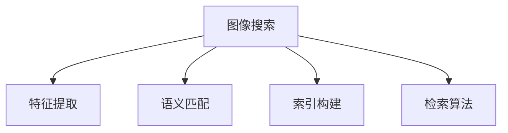

                 

# 图像搜索技术在电商中的应用

## 1. 背景介绍

### 1.1 问题由来

随着电商市场的不断扩大，用户对购物体验的需求也在不断提高。对于消费者来说，寻找合适的商品是一件繁琐的事情，尤其在商品种类繁多、描述繁杂的电商平台上，如何快速定位到想要的商品成为一大挑战。传统的关键词搜索方式虽然便捷，但由于用户对商品描述的理解差异，往往需要多次浏览和点击才能找到满意的商品，影响了用户体验和销售转化率。

图像搜索技术应运而生，它利用计算机视觉和自然语言处理技术，通过分析商品的图像信息，直接呈现与图片相关的商品列表，帮助用户快速锁定目标商品。图像搜索不仅能提高购物效率，还能解决语言不通、图片模糊等问题，为电商平台带来新的用户增长点。

### 1.2 问题核心关键点

图像搜索技术的核心在于如何高效地提取和匹配图像特征，实现商品图片与文本描述的自动关联，并在大规模商品库中快速定位符合用户需求的商品。主要包括以下几个方面：

- **特征提取**：从图像中提取有意义的特征，以便计算机理解图片内容。
- **语义匹配**：将图片特征与自然语言描述进行匹配，实现图像与文字的相互映射。
- **索引构建**：在商品库中构建基于图像和文本的索引，以便快速查询。
- **检索算法**：设计高效的检索算法，在索引中进行匹配，并返回最相关的商品列表。

### 1.3 问题研究意义

图像搜索技术对于电商平台的价值在于：

- **提升用户体验**：通过图像搜索，用户可以直接通过视觉直观地了解商品，减少对商品描述的理解难度，提升购物体验。
- **提高转化率**：图像搜索使得商品信息的展示更加精准，降低了用户流失率，提高了成交转化率。
- **优化库存管理**：图像搜索能够准确把握用户需求，帮助商家优化库存，减少缺货和过剩的情况。
- **促进创新**：图像搜索技术的成功应用将进一步推动电商平台的技术创新，形成新的业务增长点。

## 2. 核心概念与联系

### 2.1 核心概念概述

为了更好地理解图像搜索技术，本节将介绍几个密切相关的核心概念：

- **图像搜索**：利用计算机视觉技术，通过分析商品图片，将其转化为数字特征，与用户输入的查询图像或关键词进行匹配，返回相关的商品列表。
- **特征提取**：从图像中提取出代表该图像的特征，如颜色、纹理、形状等，以便计算机理解图像内容。
- **语义匹配**：将图像特征与自然语言描述进行匹配，实现图像与文字的相互映射。
- **索引构建**：在商品库中构建基于图像和文本的索引，以便快速查询。
- **检索算法**：设计高效的检索算法，在索引中进行匹配，并返回最相关的商品列表。

这些核心概念之间的逻辑关系可以通过以下Mermaid流程图来展示：



这个流程图展示出图像搜索技术的核心流程：

1. 图像搜索从用户输入的查询图像或关键词开始。
2. 提取商品图像的特征，并进行语义匹配。
3. 在商品库中构建基于图像和文本的索引。
4. 通过检索算法在索引中进行匹配，并返回最相关的商品列表。

## 3. 核心算法原理 & 具体操作步骤
### 3.1 算法原理概述

图像搜索技术的核心算法包括特征提取、语义匹配、索引构建和检索算法。

- **特征提取**：利用计算机视觉技术，从图像中提取出代表该图像的特征，如颜色、纹理、形状等。
- **语义匹配**：将图像特征与自然语言描述进行匹配，实现图像与文字的相互映射。
- **索引构建**：在商品库中构建基于图像和文本的索引，以便快速查询。
- **检索算法**：设计高效的检索算法，在索引中进行匹配，并返回最相关的商品列表。

### 3.2 算法步骤详解

#### 3.2.1 特征提取

特征提取是图像搜索技术的核心环节之一。常见的特征提取方法包括颜色直方图、SIFT、HOG、CNN等。

1. **颜色直方图**：统计图像中各颜色通道的像素分布，形成一个颜色直方图。通过比较不同图像的颜色直方图，可以识别相似或相同的对象。
2. **SIFT**：尺度不变特征变换，提取图像中的尺度不变特征点，具有旋转、缩放等不变性。
3. **HOG**：方向梯度直方图，提取图像的局部特征，用于图像分类和识别。
4. **CNN**：卷积神经网络，能够自动从图像中提取高层次的特征，广泛应用于图像分类和识别任务。

#### 3.2.2 语义匹配

语义匹配是将图像特征与自然语言描述进行匹配的过程。常用的语义匹配方法包括向量空间模型、主题模型等。

1. **向量空间模型**：将图像特征和文本描述分别表示为向量，计算它们之间的余弦相似度，找到最相关的文本描述。
2. **主题模型**：通过主题模型（如LDA）提取文本中的主题，将图像特征与文本主题进行匹配。

#### 3.2.3 索引构建

索引构建是将图像和文本特征存储在数据库中的过程，以便快速查询。常见的索引方法包括倒排索引、哈希索引等。

1. **倒排索引**：将文本描述作为键，对应的图像特征作为值，构建倒排索引表，以便快速查找。
2. **哈希索引**：将图像特征和文本描述映射到哈希表中，通过哈希函数实现快速查找。

#### 3.2.4 检索算法

检索算法是在索引中进行匹配，并返回最相关的商品列表的过程。常用的检索算法包括向量空间模型检索、K近邻检索、排序检索等。

1. **向量空间模型检索**：通过计算查询图像和商品图像的余弦相似度，找到最相关的商品列表。
2. **K近邻检索**：通过计算查询图像和商品图像的欧几里得距离，找到K个最接近的邻居商品。
3. **排序检索**：通过对匹配结果进行排序，返回最相关的商品列表。

### 3.3 算法优缺点

图像搜索技术具有以下优点：

- **直观性**：图像搜索通过直接展示商品图片，提高了用户对商品信息的理解，提升了用户体验。
- **高效性**：利用索引和高效检索算法，图像搜索能够在短时间内返回最相关的商品列表，提高了查询效率。
- **广泛适用性**：图像搜索技术适用于各种商品类别，不受语言、文化背景的影响。

但同时也存在一些缺点：

- **数据量较大**：图像搜索需要存储大量的图像和文本数据，对存储和计算资源要求较高。
- **模型复杂**：特征提取和语义匹配等模型复杂度较高，需要大量的训练数据和计算资源。
- **精度受限**：图像搜索的精度受限于图像质量和特征提取的准确性，可能会出现误匹配的情况。

### 3.4 算法应用领域

图像搜索技术已经在多个电商平台上得到广泛应用，覆盖了几乎所有商品类别，包括服饰、鞋帽、电子产品等。例如：

- **淘宝**：通过图像搜索，用户可以直接上传商品图片，快速查找相似的商品，提高了购物效率。
- **亚马逊**：利用图像搜索技术，用户可以根据图片查找商品，提升了购物体验。
- **京东**：通过图像搜索，用户可以轻松定位到特定商品的相似品，减少了用户搜索时间。

除了传统的电商平台，图像搜索技术也在垂直领域如家具、汽车、旅游等领域得到应用，为消费者提供了更便捷的购物体验。

## 4. 数学模型和公式 & 详细讲解 & 举例说明
### 4.1 数学模型构建

图像搜索技术涉及的数学模型主要包括向量空间模型、主题模型等。

1. **向量空间模型**：将图像特征和文本描述分别表示为向量，计算它们之间的余弦相似度，找到最相关的文本描述。数学公式为：
   $$
   \text{cosine similarity}(x, y) = \frac{x \cdot y}{\|x\| \cdot \|y\|}
   $$
   其中，$x$ 和 $y$ 分别表示图像特征和文本描述的向量，$\cdot$ 表示点积，$\|x\|$ 和 $\|y\|$ 分别表示向量的模长。

2. **主题模型**：通过主题模型（如LDA）提取文本中的主题，将图像特征与文本主题进行匹配。数学公式为：
   $$
   \text{LDA} = \text{Softmax}(\beta_1^\top \theta_1) + \text{Softmax}(\beta_2^\top \theta_2) + \ldots + \text{Softmax}(\beta_K^\top \theta_K)
   $$
   其中，$\theta_k$ 表示主题 $k$ 的分布向量，$\beta_k$ 表示单词与主题的分布矩阵。

### 4.2 公式推导过程

以下是向量空间模型和主题模型的公式推导过程。

**向量空间模型**：
1. 将图像特征和文本描述分别表示为向量：
   $$
   x = (x_1, x_2, \ldots, x_n), y = (y_1, y_2, \ldots, y_m)
   $$
2. 计算它们的点积：
   $$
   x \cdot y = \sum_{i=1}^n x_i y_i
   $$
3. 计算它们的模长：
   $$
   \|x\| = \sqrt{\sum_{i=1}^n x_i^2}, \|y\| = \sqrt{\sum_{i=1}^m y_i^2}
   $$
4. 计算余弦相似度：
   $$
   \text{cosine similarity}(x, y) = \frac{x \cdot y}{\|x\| \cdot \|y\|}
   $$

**主题模型**：
1. 假设文本由 $K$ 个主题组成，每个主题由若干个单词表示，记为 $\theta_k = (\theta_{k1}, \theta_{k2}, \ldots, \theta_{kn})$，其中 $\theta_{ki}$ 表示主题 $k$ 中单词 $i$ 的分布。
2. 假设单词 $i$ 属于主题 $k$ 的概率为 $\alpha_{ik}$，主题 $k$ 的概率为 $\beta_{ki}$，则有：
   $$
   \alpha_{ik} = \frac{\theta_{ki}}{\sum_{k=1}^K \theta_{kj}}, \beta_{ki} = \frac{\alpha_{ik}}{\sum_{k=1}^K \alpha_{ik}}
   $$
3. 通过软极大似然估计（Softmax）计算主题 $k$ 的概率：
   $$
   \text{Softmax}(\beta_1^\top \theta_1) + \text{Softmax}(\beta_2^\top \theta_2) + \ldots + \text{Softmax}(\beta_K^\top \theta_K)
   $$

### 4.3 案例分析与讲解

以淘宝平台的图像搜索为例，分析图像搜索技术在电商平台中的应用。

淘宝平台利用图像搜索技术，用户可以直接上传商品图片，系统自动搜索库中的相似商品。具体流程如下：

1. **用户上传图片**：用户通过手机摄像头或电脑上传商品图片。
2. **特征提取**：系统自动提取上传图片的特征，如颜色、纹理、形状等。
3. **语义匹配**：系统将提取的特征与商品库中的图片进行匹配，找到最相关的商品。
4. **商品展示**：系统将匹配结果展示给用户，用户可以查看匹配的商品详情。

通过图像搜索技术，淘宝平台大大提高了用户购物效率，提升了用户体验和销售转化率。

## 5. 项目实践：代码实例和详细解释说明
### 5.1 开发环境搭建

在进行图像搜索技术开发前，我们需要准备好开发环境。以下是使用Python进行图像搜索技术开发的典型环境配置流程：

1. 安装Anaconda：从官网下载并安装Anaconda，用于创建独立的Python环境。

2. 创建并激活虚拟环境：
```bash
conda create -n image-search-env python=3.8 
conda activate image-search-env
```

3. 安装PyTorch：根据CUDA版本，从官网获取对应的安装命令。例如：
```bash
conda install pytorch torchvision torchaudio cudatoolkit=11.1 -c pytorch -c conda-forge
```

4. 安装OpenCV：
```bash
pip install opencv-python
```

5. 安装sklearn：
```bash
pip install scikit-learn
```

完成上述步骤后，即可在`image-search-env`环境中开始图像搜索技术开发。

### 5.2 源代码详细实现

下面以图像搜索技术在电商中的应用为例，给出使用OpenCV和scikit-learn库进行图像搜索的Python代码实现。

```python
import cv2
import numpy as np
from sklearn.decomposition import TruncatedSVD
from sklearn.metrics.pairwise import cosine_similarity

def extract_features(image):
    # 使用SIFT算法提取图像特征
    sift = cv2.xfeatures2d.SIFT_create()
    keypoints, descriptors = sift.detectAndCompute(image, None)
    return descriptors

def build_index(images):
    # 提取每张图片的特征
    features = [extract_features(image) for image in images]
    # 使用奇异值分解（SVD）进行特征降维
    svd = TruncatedSVD(n_components=100, algorithm='randomized')
    features = svd.fit_transform(features)
    # 构建倒排索引
    index = {}
    for i, feature in enumerate(features):
        for j, descriptor in enumerate(features):
            if np.linalg.norm(feature - descriptor) < 0.2:
                index.setdefault(i, []).append(j)
    return index

def search(query_image, index):
    # 提取查询图像的特征
    query_features = extract_features(query_image)
    # 计算查询图像与每个商品图像的相似度
    similarities = []
    for i, features in enumerate(index.values()):
        similarity = cosine_similarity(query_features, features)[0]
        similarities.append(similarity)
    # 返回最相关的商品
    relevant_items = sorted(zip(index.keys(), similarities), key=lambda x: x[1], reverse=True)[:10]
    return relevant_items

# 示例代码，待实际应用时完善
def main():
    # 读取商品图片
    images = ['image1.jpg', 'image2.jpg', 'image3.jpg']
    # 构建索引
    index = build_index(images)
    # 查询商品
    query_image = 'query.jpg'
    relevant_items = search(query_image, index)
    # 输出结果
    for i, item in relevant_items:
        print(f'商品{i+1}: {item}')

if __name__ == '__main__':
    main()
```

### 5.3 代码解读与分析

让我们再详细解读一下关键代码的实现细节：

**extract_features函数**：
- 使用SIFT算法提取图像特征，返回特征描述符。

**build_index函数**：
- 遍历每张商品图片，提取其特征，并进行奇异值分解降维。
- 构建倒排索引，将相似的商品图片存入同一个列表中。

**search函数**：
- 提取查询图像的特征，并计算其与每个商品图像的相似度。
- 根据相似度排序，返回最相关的商品列表。

**main函数**：
- 读取商品图片，构建索引。
- 查询商品，输出结果。

可以看出，图像搜索技术的代码实现较为简单，但实际应用中还需要对特征提取、索引构建、检索算法等环节进行优化，以提升性能和准确度。

## 6. 实际应用场景
### 6.1 智能推荐

图像搜索技术在智能推荐系统中的应用非常广泛。通过分析用户对商品图片的浏览行为，系统可以推荐用户可能感兴趣的商品。具体流程如下：

1. **用户浏览商品图片**：用户浏览电商平台的商品图片。
2. **特征提取**：系统自动提取用户浏览的商品图片的特征。
3. **匹配相似商品**：系统将提取的特征与商品库中的图片进行匹配，找到最相关的商品。
4. **推荐商品**：系统根据匹配结果推荐相似商品给用户。

通过图像搜索技术，智能推荐系统可以更加精准地推荐商品，提高用户满意度，增加销售转化率。

### 6.2 库存管理

图像搜索技术还可以用于电商平台的库存管理。通过分析商品图片，系统可以实时监控库存状况，自动生成补货建议。具体流程如下：

1. **商品图片上传**：商家上传商品图片到电商平台。
2. **特征提取**：系统自动提取商品图片的特征。
3. **匹配库存商品**：系统将提取的特征与商品库中的图片进行匹配，找到库存商品。
4. **生成补货建议**：系统根据匹配结果生成补货建议，帮助商家管理库存。

通过图像搜索技术，电商平台可以更加灵活地管理库存，减少缺货和过剩的情况，提高运营效率。

### 6.3 广告投放

图像搜索技术在电商平台的广告投放中也有广泛应用。通过分析广告图片，系统可以优化广告投放策略，提高广告转化率。具体流程如下：

1. **广告图片上传**：商家上传广告图片到电商平台。
2. **特征提取**：系统自动提取广告图片的特征。
3. **匹配用户行为**：系统将提取的特征与用户的行为数据进行匹配，找到最相关的广告。
4. **优化广告投放**：系统根据匹配结果优化广告投放策略，提高广告转化率。

通过图像搜索技术，电商平台可以更加精准地投放广告，提升广告效果，增加收入。

### 6.4 未来应用展望

随着图像搜索技术的不断进步，未来在电商领域的应用前景更加广阔。

1. **增强现实购物**：通过图像搜索技术，用户可以实时查看商品，增强购物体验。例如，用户通过手机相机拍摄商品图片，系统自动展示商品详情。
2. **视频搜索**：电商平台可以集成视频搜索功能，用户可以上传商品视频，系统自动搜索相似商品。例如，用户上传商品使用视频，系统自动推荐相关商品。
3. **多模态搜索**：电商平台可以结合文本、语音、图像等多种模态数据，提供更全面、更智能的搜索服务。例如，用户可以通过语音描述商品，系统自动搜索相关商品。

未来，图像搜索技术将不断拓展应用领域，提升电商平台的智能化水平，带来更好的用户体验和服务。

## 7. 工具和资源推荐
### 7.1 学习资源推荐

为了帮助开发者系统掌握图像搜索技术，这里推荐一些优质的学习资源：

1. **《计算机视觉：算法与应用》**：清华大学出版社，涵盖了计算机视觉的基本概念和常用算法，适合入门学习。
2. **《深度学习入门》**：斋藤康毅著，介绍了深度学习的基本原理和应用，包括卷积神经网络、图像分类等。
3. **Coursera《深度学习》课程**：斯坦福大学开设的深度学习课程，涵盖深度学习的基本概念和常用算法，适合深入学习。
4. **Kaggle**：Kaggle平台提供了大量图像搜索相关的竞赛和数据集，适合实战练习。
5. **OpenCV官方文档**：OpenCV官方文档，提供了详细的API文档和使用示例，适合快速上手。

通过对这些资源的学习实践，相信你一定能够快速掌握图像搜索技术的精髓，并用于解决实际的电商问题。

### 7.2 开发工具推荐

高效的开发离不开优秀的工具支持。以下是几款用于图像搜索技术开发的常用工具：

1. **OpenCV**：OpenCV是一个开源的计算机视觉库，提供了丰富的图像处理和特征提取功能，适合图像搜索技术的开发。
2. **TensorFlow**：由Google主导开发的深度学习框架，提供了高效的计算图和自动微分功能，适合图像搜索算法的实现。
3. **PyTorch**：由Facebook开发的深度学习框架，提供了灵活的动态计算图和丰富的优化算法，适合图像搜索技术的实现。
4. **scikit-learn**：Python的机器学习库，提供了丰富的机器学习算法和数据处理功能，适合图像搜索算法的实现。
5. **Jupyter Notebook**：Python的交互式开发环境，适合快速迭代和调试代码。

合理利用这些工具，可以显著提升图像搜索技术的开发效率，加快创新迭代的步伐。

### 7.3 相关论文推荐

图像搜索技术的研究源于学界的持续研究。以下是几篇奠基性的相关论文，推荐阅读：

1. **《Image Search: An Information Retrieval Approach to Visual Search》**：Jean-Yves Audoin等人，介绍了图像搜索的基本原理和技术，是图像搜索领域的奠基之作。
2. **《SIFT: Scale-Invariant Feature Transform》**：D. Lowe，介绍了SIFT算法的原理和实现方法，是特征提取领域的重要文献。
3. **《The Google Visual Search Appliance》**：Alan Eustace等人，介绍了Google的图像搜索系统，详细描述了其特征提取和检索算法。
4. **《Cats and Dogs at Home: An Image-Based Multiclass Classification of Pet Objects in 301,147 household Images》**：Yaniv Gortler等人，介绍了在家庭环境中使用图像分类技术的方案，适合图像搜索技术的学习参考。
5. **《Learning from Data in a Bounded Space》**：Yann LeCun等人，介绍了深度学习在图像搜索中的应用，适合深入学习。

这些论文代表了大语言模型微调技术的发展脉络。通过学习这些前沿成果，可以帮助研究者把握学科前进方向，激发更多的创新灵感。

## 8. 总结：未来发展趋势与挑战

### 8.1 总结

本文对图像搜索技术在电商中的应用进行了全面系统的介绍。首先阐述了图像搜索技术的背景和意义，明确了其在提升用户体验、提高销售转化率、优化库存管理等方面的独特价值。其次，从原理到实践，详细讲解了图像搜索技术的核心算法和具体实现，给出了图像搜索技术在电商中的应用示例。同时，本文还探讨了图像搜索技术的广泛应用前景，展示了其在智能推荐、库存管理、广告投放等场景中的巨大潜力。

通过本文的系统梳理，可以看到，图像搜索技术对于电商平台的价值在于其直观性和高效性，能够提升用户的购物体验和平台运营效率。未来，随着计算机视觉和深度学习技术的不断进步，图像搜索技术将变得更加精准和智能，为电商平台的智能化转型提供新的动力。

### 8.2 未来发展趋势

展望未来，图像搜索技术将呈现以下几个发展趋势：

1. **多模态融合**：未来，图像搜索技术将结合文本、语音、视频等多种模态数据，提供更加全面、智能的搜索服务。例如，用户可以通过语音描述商品，系统自动搜索相关商品。
2. **增强现实购物**：通过图像搜索技术，用户可以实时查看商品，增强购物体验。例如，用户通过手机相机拍摄商品图片，系统自动展示商品详情。
3. **智能推荐**：利用图像搜索技术，智能推荐系统可以更加精准地推荐商品，提高用户满意度，增加销售转化率。例如，用户浏览电商平台的商品图片，系统自动推荐相似商品。
4. **实时视频搜索**：电商平台可以集成视频搜索功能，用户可以上传商品视频，系统自动搜索相似商品。例如，用户上传商品使用视频，系统自动推荐相关商品。
5. **个性化搜索**：图像搜索技术将结合用户行为数据和个性化推荐算法，提供更加个性化的搜索结果。例如，用户浏览电商平台的商品图片，系统自动推荐用户可能感兴趣的商品。

这些趋势将使得图像搜索技术在电商平台的智能化水平得到大幅提升，带来更好的用户体验和服务。

### 8.3 面临的挑战

尽管图像搜索技术已经取得了显著成果，但在迈向更加智能化、普适化应用的过程中，仍面临以下挑战：

1. **数据量较大**：图像搜索需要存储大量的图像和文本数据，对存储和计算资源要求较高。未来需要进一步优化数据存储和计算架构，降低成本。
2. **模型复杂**：特征提取和语义匹配等模型复杂度较高，需要大量的训练数据和计算资源。未来需要优化模型结构，减少计算量。
3. **精度受限**：图像搜索的精度受限于图像质量和特征提取的准确性，可能会出现误匹配的情况。未来需要进一步提高特征提取和语义匹配的准确性。
4. **实时性要求高**：用户对实时性要求较高，图像搜索需要在毫秒级别完成匹配。未来需要优化检索算法，提高匹配速度。
5. **安全性问题**：图像搜索可能会收集用户隐私数据，需要加强数据保护和隐私保护措施。未来需要构建安全可靠的数据处理和存储系统。

### 8.4 研究展望

面对图像搜索技术面临的挑战，未来的研究需要在以下几个方面寻求新的突破：

1. **多模态数据融合**：将文本、语音、视频等多种模态数据进行融合，提高图像搜索的全面性和智能性。例如，利用深度学习模型将多种模态数据进行联合表示和匹配。
2. **高效特征提取**：开发更加高效、准确的特征提取方法，提高图像搜索的精度和速度。例如，利用卷积神经网络自动提取图像特征，提高特征表示能力。
3. **实时性优化**：优化检索算法，提高图像搜索的实时性。例如，利用向量近似算法（如局部敏感哈希）进行高效的相似度计算。
4. **隐私保护**：加强数据保护和隐私保护措施，确保用户隐私安全。例如，利用差分隐私技术保护用户数据隐私。
5. **跨平台协作**：构建跨平台协作机制，提高图像搜索系统的可扩展性和通用性。例如，利用云计算平台进行分布式计算和存储。

这些研究方向将进一步推动图像搜索技术的发展，提升其智能化水平和用户体验，为电商平台的智能化转型提供新的动力。总之，图像搜索技术作为电商平台的核心技术，其发展前景广阔，前景无限，相信未来会在更多领域得到广泛应用，推动电商行业的数字化升级。

## 9. 附录：常见问题与解答

**Q1: 图像搜索技术是否适用于所有电商平台？**

A: 图像搜索技术适用于大多数电商平台，尤其适用于商品种类繁多、描述繁杂的电商平台上。但对于一些特定领域的电商平台，如医疗、教育等，由于数据量的限制，可能需要进一步优化数据处理和特征提取策略。

**Q2: 图像搜索技术的特征提取方法有哪些？**

A: 常见的图像搜索技术特征提取方法包括颜色直方图、SIFT、HOG、CNN等。其中，SIFT算法和CNN算法在图像搜索中应用较为广泛，能够提取具有旋转、缩放等不变性的特征。

**Q3: 如何提高图像搜索技术的匹配精度？**

A: 提高图像搜索技术的匹配精度需要从多个方面进行优化：
1. 提高特征提取的准确性，如使用深度学习模型自动提取图像特征。
2. 优化语义匹配方法，如使用主题模型进行语义匹配。
3. 优化检索算法，如使用局部敏感哈希进行高效相似度计算。
4. 增加数据量，提高模型的泛化能力。

**Q4: 图像搜索技术在电商平台中的应用前景如何？**

A: 图像搜索技术在电商平台中的应用前景非常广阔，未来将在智能推荐、库存管理、广告投放等多个场景得到广泛应用。通过图像搜索技术，电商平台可以提升用户体验和运营效率，带来更多的商业机会。

**Q5: 如何应对图像搜索技术的挑战？**

A: 面对图像搜索技术的挑战，需要从数据处理、模型优化、实时性提升、隐私保护等多个方面进行应对：
1. 优化数据存储和计算架构，降低存储和计算成本。
2. 优化模型结构，提高特征提取和语义匹配的准确性。
3. 优化检索算法，提高匹配速度和精度。
4. 加强数据保护和隐私保护措施，确保用户隐私安全。
5. 构建跨平台协作机制，提高系统的可扩展性和通用性。

总之，图像搜索技术作为电商平台的核心技术，其发展前景广阔，前景无限，相信未来会在更多领域得到广泛应用，推动电商行业的数字化升级。

---

作者：禅与计算机程序设计艺术 / Zen and the Art of Computer Programming

