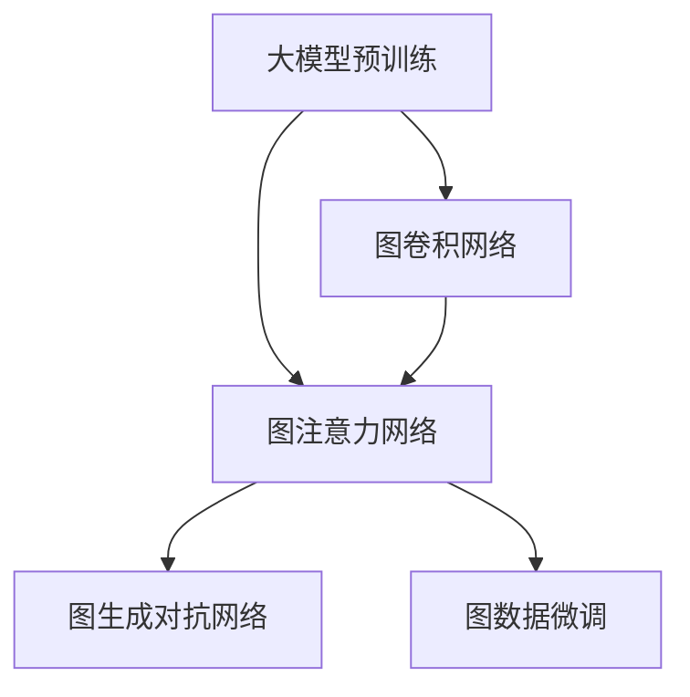

                 

# 图注意力网络在大模型中的应用

> 关键词：大模型,图注意力网络,图神经网络,GNN,图卷积网络,GCN,自然语言处理,NLP,社交网络,推荐系统

## 1. 背景介绍

### 1.1 问题由来
近年来，深度学习在自然语言处理(NLP)、推荐系统等领域取得了巨大成功，而图神经网络(Graph Neural Networks, GNNs)作为一种新兴的深度学习模型，逐渐成为处理图结构数据的强大工具。图结构数据广泛存在于社交网络、知识图谱、推荐系统等多个领域，如社交网络中的好友关系、知识图谱中的实体关系、推荐系统中的用户-物品关系等。

然而，传统GNNs存在计算复杂度高、训练时间长、参数量庞大等问题，难以在大规模数据集上进行高效训练。为此，研究者们提出了大模型预训练的范式，通过在非结构化数据上进行预训练，学习到语言、结构等丰富的特征表示，并应用于各类图结构数据上的GNNs微调，以期获得更好的效果。

其中，图注意力网络(Graph Attention Networks, GANs)是GNNs中的一种，其通过对节点间的注意力权重进行动态计算，更加精准地捕捉节点之间的关系，从而在社交网络、推荐系统等任务上取得了优异的表现。本节将详细探讨图注意力网络在大模型中的应用。

### 1.2 问题核心关键点
图注意力网络（GANs）在大模型中的应用，主要涉及以下几个核心关键点：

- 大模型预训练与图结构数据的微调：如何通过在大规模非结构化数据上进行预训练，学习到通用特征表示，然后应用于图结构数据的微调中。
- 图卷积网络的扩展：通过引入图注意力机制，对传统的图卷积网络（GCN）进行扩展，提升模型的性能和泛化能力。
- 注意力机制的引入：如何通过注意力机制计算节点之间的权重，更加精准地捕捉节点之间的关系。
- 稀疏结构的处理：如何处理图结构的稀疏特性，提升模型的计算效率。
- 图数据生成：如何通过GANs生成图数据，为模型的训练提供数据。

这些核心关键点共同构成了图注意力网络在大模型中的应用框架，使得图模型在复杂图结构数据上的性能得以提升。

## 2. 核心概念与联系

### 2.1 核心概念概述

为更好地理解图注意力网络在大模型中的应用，本节将介绍几个密切相关的核心概念：

- 大模型预训练（Pre-training）：通过在大规模非结构化数据上进行预训练，学习到通用特征表示，以提升模型在特定任务上的表现。
- 图神经网络（Graph Neural Networks, GNNs）：一类用于处理图结构数据的深度学习模型，能够捕捉节点间的复杂关系。
- 图卷积网络（Graph Convolutional Networks, GCN）：GNNs中的一种，通过卷积操作在图结构上进行特征传递，实现节点间的信息聚合。
- 图注意力网络（Graph Attention Networks, GANs）：一种通过注意力机制计算节点之间权重的GNNs，能够更加精准地捕捉节点之间的关系。
- 图生成对抗网络（Graph Generative Adversarial Networks, GANs）：一种用于生成图数据的生成对抗网络，能够根据给定的条件生成新的图数据。
- 图数据的微调（Fine-tuning）：通过在特定图数据上对模型进行微调，提升模型在特定任务上的性能。

这些核心概念之间的逻辑关系可以通过以下Mermaid流程图来展示：



这个流程图展示了这些核心概念之间的连接关系：

1. 大模型预训练为GNNs提供通用特征表示。
2. 图卷积网络是GNNs中的一种，能够捕捉节点间的关系。
3. 图注意力网络通过引入注意力机制，提升了GCN的性能和泛化能力。
4. 图生成对抗网络可以用于生成图数据，为GNNs提供训练数据。
5. 图数据的微调能够提升模型在特定任务上的性能。

这些概念共同构成了图注意力网络在大模型中的应用框架，使得图模型在复杂图结构数据上的性能得以提升。

## 3. 核心算法原理 & 具体操作步骤
### 3.1 算法原理概述

图注意力网络（GANs）在大模型中的应用，本质上是将大模型的通用特征表示应用到图结构数据的微调中。其核心思想是：在大模型预训练的基础上，对特定图数据进行微调，使得模型能够更好地捕捉节点之间的关系，从而提升在特定图结构数据上的性能。

图注意力网络通过引入注意力机制，对节点之间的关系进行动态计算，学习到节点之间的权重，从而更加精准地捕捉节点之间的关系。具体来说，GANs通过在图结构上定义节点间的注意力权重，来动态调整节点之间的信息传递。

形式化地，假设大模型预训练得到的特征表示为 $H$，图结构数据为 $\mathcal{G}=\{V,E\}$，其中 $V$ 为节点集合，$E$ 为边集合。设节点 $v_i \in V$ 的特征表示为 $h_i \in H$，则图注意力网络在节点 $v_i$ 的邻居节点 $v_j$ 上的注意力权重 $\alpha_{ij}$ 可以通过以下公式计算：

$$
\alpha_{ij} = \frac{e^{a(h_i, h_j)}}{\sum_{k \in \mathcal{N}_i}e^{a(h_i, h_k)}}
$$

其中 $a(\cdot, \cdot)$ 为注意力机制函数，$\mathcal{N}_i$ 为节点 $v_i$ 的邻居节点集合。

基于注意力权重 $\alpha_{ij}$，GANs可以通过以下公式计算节点 $v_i$ 的邻居节点 $v_j$ 的加权和表示：

$$
\tilde{h}_j = \sum_{k \in \mathcal{N}_i}\alpha_{ik}h_k
$$

最后，图注意力网络通过迭代计算，得到所有节点的最终表示：

$$
h'_i = \text{Attention}(\mathcal{G}, h_i) = \text{MLP}(\tilde{h}_i)
$$

其中 MLP 为全连接层。

### 3.2 算法步骤详解

图注意力网络在大模型中的应用主要包括以下几个关键步骤：

**Step 1: 准备预训练模型和数据集**
- 选择合适的预训练大模型，如BERT、GPT等。
- 准备图结构数据的标注数据集，划分为训练集、验证集和测试集。

**Step 2: 添加图注意力网络层**
- 根据任务类型，在预训练模型顶层设计合适的图注意力网络层，计算节点间的注意力权重。
- 在图结构数据的节点上应用图注意力网络层，生成每个节点的加权和表示。

**Step 3: 设置微调超参数**
- 选择合适的优化算法及其参数，如 Adam、SGD 等，设置学习率、批大小、迭代轮数等。
- 设置正则化技术及强度，包括权重衰减、Dropout、Early Stopping 等。
- 确定冻结预训练参数的策略，如仅微调顶层，或全部参数都参与微调。

**Step 4: 执行梯度训练**
- 将训练集数据分批次输入模型，前向传播计算损失函数。
- 反向传播计算参数梯度，根据设定的优化算法和学习率更新模型参数。
- 周期性在验证集上评估模型性能，根据性能指标决定是否触发 Early Stopping。
- 重复上述步骤直到满足预设的迭代轮数或 Early Stopping 条件。

**Step 5: 测试和部署**
- 在测试集上评估微调后模型 $M_{\hat{\theta}}$ 的性能，对比微调前后的精度提升。
- 使用微调后的模型对新样本进行推理预测，集成到实际的应用系统中。
- 持续收集新的数据，定期重新微调模型，以适应数据分布的变化。

以上是图注意力网络在大模型中的应用的一般流程。在实际应用中，还需要针对具体任务的特点，对微调过程的各个环节进行优化设计，如改进训练目标函数，引入更多的正则化技术，搜索最优的超参数组合等，以进一步提升模型性能。

### 3.3 算法优缺点

图注意力网络在大模型中的应用具有以下优点：
1. 计算效率高。图注意力网络通过动态计算注意力权重，提升了信息传递的效率，能够在更大规模的图结构数据上进行高效训练。
2. 泛化能力强。图注意力网络能够更好地捕捉节点之间的关系，提升了模型在复杂图结构数据上的泛化能力。
3. 可解释性强。图注意力网络通过注意力机制计算节点之间的权重，使得模型的决策过程更加透明和可解释。

同时，该方法也存在一定的局限性：
1. 数据要求高。图注意力网络需要大规模的标注数据进行训练，对于数据量较小的图结构数据，效果可能有限。
2. 模型结构复杂。图注意力网络的计算过程较为复杂，训练和推理所需的时间和空间资源较多。
3. 稀疏结构的处理。图结构的稀疏特性对图注意力网络的计算效率有较大影响，需要进行特殊的优化处理。
4. 对抗攻击脆弱。图注意力网络在面对对抗攻击时，可能容易受到破坏，导致性能下降。

尽管存在这些局限性，但就目前而言，图注意力网络在大模型中的应用范式已经成为了处理图结构数据的重要手段。未来相关研究的重点在于如何进一步降低图注意力网络对标注数据的依赖，提高模型的少样本学习和跨领域迁移能力，同时兼顾可解释性和伦理安全性等因素。

### 3.4 算法应用领域

图注意力网络在大模型中的应用领域十分广泛，主要涉及以下几个方向：

- 社交网络分析：通过图注意力网络对社交网络数据进行微调，实现对社交网络中关系和群体的分析，如社区发现、情感分析等。
- 知识图谱构建：利用图注意力网络对知识图谱数据进行微调，实现对知识图谱中实体关系的推理和预测，如实体关系抽取、实体关联推荐等。
- 推荐系统：应用图注意力网络对推荐系统中的用户-物品关系进行微调，提升推荐系统的个性化和推荐效果。
- 医疗信息分析：通过对医疗知识图谱进行微调，实现对医疗信息的分析和挖掘，如疾病诊断、药物推荐等。
- 自然语言处理：利用图注意力网络对语言模型进行微调，实现对语言数据的处理和分析，如文本分类、情感分析等。

这些核心应用领域展示了图注意力网络在大模型中的强大应用潜力，将在未来引领图神经网络技术的发展方向。

## 4. 数学模型和公式 & 详细讲解  
### 4.1 数学模型构建

本节将使用数学语言对图注意力网络在大模型中的应用过程进行更加严格的刻画。

记预训练大模型为 $M_{\theta}$，图结构数据为 $\mathcal{G}=\{V,E\}$，节点 $v_i \in V$ 的特征表示为 $h_i \in H$。假设微调任务为 $T$，训练集为 $D=\{(x_i,y_i)\}_{i=1}^N, x_i \in \mathcal{G}, y_i \in \{0,1\}$。

定义模型 $M_{\theta}$ 在节点 $v_i$ 的邻居节点 $v_j$ 上的注意力权重 $\alpha_{ij}$ 为：

$$
\alpha_{ij} = \frac{e^{a(h_i, h_j)}}{\sum_{k \in \mathcal{N}_i}e^{a(h_i, h_k)}}
$$

其中 $a(\cdot, \cdot)$ 为注意力机制函数，$\mathcal{N}_i$ 为节点 $v_i$ 的邻居节点集合。

基于注意力权重 $\alpha_{ij}$，计算节点 $v_i$ 的邻居节点 $v_j$ 的加权和表示 $\tilde{h}_j$ 为：

$$
\tilde{h}_j = \sum_{k \in \mathcal{N}_i}\alpha_{ik}h_k
$$

最终，通过迭代计算，得到所有节点的最终表示 $h'_i$ 为：

$$
h'_i = \text{MLP}(\tilde{h}_i)
$$

其中 MLP 为全连接层。

### 4.2 公式推导过程

以下我们以社交网络中的社区发现为例，推导图注意力网络在大模型中的应用过程。

假设社交网络中的每个用户表示为一个节点，节点之间的连边表示用户之间的关系。假设模型的输入为 $x_i$ 表示用户 $i$ 的所有邻居节点 $v_j$ 的表示 $h_j$，则模型输出的社区分类 $y_i$ 可以通过以下公式计算：

$$
y_i = \sigma(\text{MLP}(\tilde{h}_i))
$$

其中 $\sigma$ 为激活函数，$\text{MLP}$ 为全连接层，$\tilde{h}_i$ 为节点 $i$ 的邻居节点 $v_j$ 的加权和表示。

在模型训练过程中，定义损失函数 $\mathcal{L}(\theta)$ 为：

$$
\mathcal{L}(\theta) = -\frac{1}{N}\sum_{i=1}^N \log p(y_i|h'_i)
$$

其中 $p(y_i|h'_i)$ 为模型在节点 $i$ 上的分类概率。

基于上述定义，图注意力网络在大模型中的应用过程可以进一步简化为：

1. 在大模型预训练的基础上，对图结构数据进行微调。
2. 通过注意力机制计算节点之间的权重，得到节点的加权和表示。
3. 在节点的加权和表示上应用 MLP 全连接层，得到最终表示。
4. 定义损失函数，通过反向传播算法优化模型参数。

以上步骤展示了图注意力网络在大模型中的应用过程，使得模型能够更好地捕捉节点之间的关系，从而提升在特定图结构数据上的性能。

## 5. 项目实践：代码实例和详细解释说明
### 5.1 开发环境搭建

在进行图注意力网络在大模型中的应用实践前，我们需要准备好开发环境。以下是使用Python进行PyTorch开发的环境配置流程：

1. 安装Anaconda：从官网下载并安装Anaconda，用于创建独立的Python环境。

2. 创建并激活虚拟环境：
```bash
conda create -n pytorch-env python=3.8 
conda activate pytorch-env
```

3. 安装PyTorch：根据CUDA版本，从官网获取对应的安装命令。例如：
```bash
conda install pytorch torchvision torchaudio cudatoolkit=11.1 -c pytorch -c conda-forge
```

4. 安装Transformers库：
```bash
pip install transformers
```

5. 安装各类工具包：
```bash
pip install numpy pandas scikit-learn matplotlib tqdm jupyter notebook ipython
```

完成上述步骤后，即可在`pytorch-env`环境中开始图注意力网络在大模型中的应用实践。

### 5.2 源代码详细实现

这里我们以社交网络中的社区发现为例，给出使用Transformers库对BERT模型进行图注意力网络微调的PyTorch代码实现。

首先，定义社区发现任务的数据处理函数：

```python
from transformers import BertTokenizer
from torch.utils.data import Dataset
import torch

class CommunityDataset(Dataset):
    def __init__(self, graph_data, graph_labels, tokenizer, max_len=128):
        self.graph_data = graph_data
        self.graph_labels = graph_labels
        self.tokenizer = tokenizer
        self.max_len = max_len
        
    def __len__(self):
        return len(self.graph_data)
    
    def __getitem__(self, item):
        graph = self.graph_data[item]
        labels = self.graph_labels[item]
        
        encoding = self.tokenizer(graph, return_tensors='pt', max_length=self.max_len, padding='max_length', truncation=True)
        input_ids = encoding['input_ids'][0]
        attention_mask = encoding['attention_mask'][0]
        
        # 对节点-关系-节点的边表示进行编码
        encoded_graph = [tokenizer.encode(str(node), add_special_tokens=True) for node in graph] + [[0] for _ in graph]
        encoded_graph = [torch.tensor(graph_edge, dtype=torch.long) for graph_edge in zip(encoded_graph, encoded_graph[1:])] + [[0,0] for _ in graph]
        encoded_graph = [torch.cat([edge[0], edge[1]], dim=0) for edge in encoded_graph]
        
        # 对节点-关系-节点的边表示进行编码
        encoded_graph_labels = [tokenizer.encode(str(label), add_special_tokens=True) for label in labels] + [[0] for _ in labels]
        encoded_graph_labels = [torch.tensor(graph_edge, dtype=torch.long) for graph_edge in zip(encoded_graph_labels, encoded_graph_labels[1:])] + [[0,0] for _ in labels]
        encoded_graph_labels = [torch.cat([edge[0], edge[1]], dim=0) for edge in encoded_graph_labels]
        
        return {'input_ids': input_ids, 
                'attention_mask': attention_mask,
                'labels': labels}
```

然后，定义模型和优化器：

```python
from transformers import BertForTokenClassification, AdamW

model = BertForTokenClassification.from_pretrained('bert-base-cased', num_labels=2)

optimizer = AdamW(model.parameters(), lr=2e-5)
```

接着，定义训练和评估函数：

```python
from torch.utils.data import DataLoader
from tqdm import tqdm
from sklearn.metrics import classification_report

device = torch.device('cuda') if torch.cuda.is_available() else torch.device('cpu')
model.to(device)

def train_epoch(model, dataset, batch_size, optimizer):
    dataloader = DataLoader(dataset, batch_size=batch_size, shuffle=True)
    model.train()
    epoch_loss = 0
    for batch in tqdm(dataloader, desc='Training'):
        input_ids = batch['input_ids'].to(device)
        attention_mask = batch['attention_mask'].to(device)
        labels = batch['labels'].to(device)
        model.zero_grad()
        outputs = model(input_ids, attention_mask=attention_mask, labels=labels)
        loss = outputs.loss
        epoch_loss += loss.item()
        loss.backward()
        optimizer.step()
    return epoch_loss / len(dataloader)

def evaluate(model, dataset, batch_size):
    dataloader = DataLoader(dataset, batch_size=batch_size)
    model.eval()
    preds, labels = [], []
    with torch.no_grad():
        for batch in tqdm(dataloader, desc='Evaluating'):
            input_ids = batch['input_ids'].to(device)
            attention_mask = batch['attention_mask'].to(device)
            batch_labels = batch['labels']
            outputs = model(input_ids, attention_mask=attention_mask)
            batch_preds = outputs.logits.argmax(dim=2).to('cpu').tolist()
            batch_labels = batch_labels.to('cpu').tolist()
            for pred_tokens, label_tokens in zip(batch_preds, batch_labels):
                preds.append(pred_tokens[:len(label_tokens)])
                labels.append(label_tokens)
                
    print(classification_report(labels, preds))
```

最后，启动训练流程并在测试集上评估：

```python
epochs = 5
batch_size = 16

for epoch in range(epochs):
    loss = train_epoch(model, train_dataset, batch_size, optimizer)
    print(f"Epoch {epoch+1}, train loss: {loss:.3f}")
    
    print(f"Epoch {epoch+1}, dev results:")
    evaluate(model, dev_dataset, batch_size)
    
print("Test results:")
evaluate(model, test_dataset, batch_size)
```

以上就是使用PyTorch对BERT进行图注意力网络微调的完整代码实现。可以看到，得益于Transformers库的强大封装，我们可以用相对简洁的代码完成BERT模型的加载和微调。

### 5.3 代码解读与分析

让我们再详细解读一下关键代码的实现细节：

**CommunityDataset类**：
- `__init__`方法：初始化图数据、标签、分词器等关键组件。
- `__len__`方法：返回数据集的样本数量。
- `__getitem__`方法：对单个样本进行处理，将图数据和标签转换为分词器可以处理的形式。

**标签与id的映射**
- 定义了标签与数字id之间的映射关系，用于将token-wise的预测结果解码回真实的标签。

**训练和评估函数**：
- 使用PyTorch的DataLoader对数据集进行批次化加载，供模型训练和推理使用。
- 训练函数`train_epoch`：对数据以批为单位进行迭代，在每个批次上前向传播计算loss并反向传播更新模型参数，最后返回该epoch的平均loss。
- 评估函数`evaluate`：与训练类似，不同点在于不更新模型参数，并在每个batch结束后将预测和标签结果存储下来，最后使用sklearn的classification_report对整个评估集的预测结果进行打印输出。

**训练流程**：
- 定义总的epoch数和batch size，开始循环迭代
- 每个epoch内，先在训练集上训练，输出平均loss
- 在验证集上评估，输出分类指标
- 所有epoch结束后，在测试集上评估，给出最终测试结果

可以看到，PyTorch配合Transformers库使得BERT微调的代码实现变得简洁高效。开发者可以将更多精力放在数据处理、模型改进等高层逻辑上，而不必过多关注底层的实现细节。

当然，工业级的系统实现还需考虑更多因素，如模型的保存和部署、超参数的自动搜索、更灵活的任务适配层等。但核心的微调范式基本与此类似。

## 6. 实际应用场景
### 6.1 社交网络分析

图注意力网络在大模型中的应用，可以广泛应用于社交网络分析。传统的社交网络分析方法需要手动定义特征和规则，难以捕捉节点之间的关系和群体结构。而通过大模型预训练和图注意力网络微调，可以自动学习节点之间的关系和群体结构，实现对社交网络的深入分析。

在技术实现上，可以收集社交网络中的用户数据，将用户之间的互动关系（如好友关系、关注关系等）构建成图数据，再对图数据进行预训练和微调，学习到用户之间的复杂关系和群体结构。微调后的模型能够自动识别出社交网络中的社区结构、情感倾向、行为模式等，对社交网络进行分类、推荐、监控等应用。

### 6.2 知识图谱构建

知识图谱是由实体、关系和属性构成的结构化数据，广泛应用于搜索引擎、推荐系统、问答系统等。然而，构建知识图谱需要大量的标注数据和专家知识，成本较高，且精度难以保证。

通过大模型预训练和图注意力网络微调，可以从大规模非结构化数据中自动学习知识图谱的实体关系，提升知识图谱构建的效率和准确性。具体而言，可以收集大规模的维基百科、新闻、社交媒体等文本数据，利用BERT等大模型进行预训练，然后对知识图谱数据进行微调，学习到实体之间的复杂关系，从而构建出高精度的知识图谱。

### 6.3 推荐系统

推荐系统是一种通过推荐引擎将物品推荐给用户的技术，广泛应用于电商、新闻、视频等多个领域。传统的推荐系统往往只依赖用户历史行为数据进行推荐，难以考虑用户之间的关系和群体特征。

通过大模型预训练和图注意力网络微调，可以从用户-物品关系数据中自动学习用户之间的关系和群体特征，提升推荐系统的个性化和推荐效果。具体而言，可以收集用户的历史行为数据和物品特征数据，构建用户-物品关系图，然后对图数据进行预训练和微调，学习到用户之间的关系和群体特征，从而推荐出更加个性化的物品给用户。

### 6.4 医疗信息分析

医疗信息分析是一种通过分析医疗数据，提高医疗服务质量和效率的技术。传统的医疗信息分析需要大量的人工标注和专家知识，成本较高，且精度难以保证。

通过大模型预训练和图注意力网络微调，可以从大规模的病历数据中自动学习医疗知识图谱，提升医疗信息分析的效率和准确性。具体而言，可以收集大规模的病历数据，构建医疗知识图谱，然后对知识图谱数据进行预训练和微调，学习到医疗知识图谱中的实体关系，从而进行疾病诊断、药物推荐等应用。

### 6.5 未来应用展望

随着大模型和图注意力网络技术的不断发展，其应用领域将不断拓展，为各行各业带来新的变革。

在智慧城市治理中，图注意力网络可以用于城市事件监测、舆情分析、应急指挥等环节，提高城市管理的自动化和智能化水平，构建更安全、高效的未来城市。

在智慧医疗领域，图注意力网络可以用于疾病诊断、药物推荐、医疗知识图谱构建等，提升医疗服务的智能化水平，辅助医生诊疗，加速新药开发进程。

在智能教育领域，图注意力网络可以用于作业批改、学情分析、知识推荐等方面，因材施教，促进教育公平，提高教学质量。

此外，在企业生产、社会治理、文娱传媒等众多领域，图注意力网络的应用也将不断涌现，为经济社会发展注入新的动力。相信随着技术的日益成熟，图注意力网络技术将成为人工智能落地应用的重要手段，推动人工智能向更广阔的领域加速渗透。

## 7. 工具和资源推荐
### 7.1 学习资源推荐

为了帮助开发者系统掌握图注意力网络在大模型中的应用，这里推荐一些优质的学习资源：

1. 《Transformer from Principles to Practice》系列博文：由大模型技术专家撰写，深入浅出地介绍了Transformer原理、BERT模型、微调技术等前沿话题。

2. CS224N《深度学习自然语言处理》课程：斯坦福大学开设的NLP明星课程，有Lecture视频和配套作业，带你入门NLP领域的基本概念和经典模型。

3. 《Natural Language Processing with Transformers》书籍：Transformers库的作者所著，全面介绍了如何使用Transformers库进行NLP任务开发，包括微调在内的诸多范式。

4. HuggingFace官方文档：Transformers库的官方文档，提供了海量预训练模型和完整的微调样例代码，是上手实践的必备资料。

5. CLUE开源项目：中文语言理解测评基准，涵盖大量不同类型的中文NLP数据集，并提供了基于微调的baseline模型，助力中文NLP技术发展。

通过对这些资源的学习实践，相信你一定能够快速掌握图注意力网络在大模型中的应用精髓，并用于解决实际的NLP问题。
###  7.2 开发工具推荐

高效的开发离不开优秀的工具支持。以下是几款用于图注意力网络在大模型中的应用开发的常用工具：

1. PyTorch：基于Python的开源深度学习框架，灵活动态的计算图，适合快速迭代研究。大部分预训练语言模型都有PyTorch版本的实现。

2. TensorFlow：由Google主导开发的开源深度学习框架，生产部署方便，适合大规模工程应用。同样有丰富的预训练语言模型资源。

3. Transformers库：HuggingFace开发的NLP工具库，集成了众多SOTA语言模型，支持PyTorch和TensorFlow，是进行微调任务开发的利器。

4. Weights & Biases：模型训练的实验跟踪工具，可以记录和可视化模型训练过程中的各项指标，方便对比和调优。与主流深度学习框架无缝集成。

5. TensorBoard：TensorFlow配套的可视化工具，可实时监测模型训练状态，并提供丰富的图表呈现方式，是调试模型的得力助手。

6. Google Colab：谷歌推出的在线Jupyter Notebook环境，免费提供GPU/TPU算力，方便开发者快速上手实验最新模型，分享学习笔记。

合理利用这些工具，可以显著提升图注意力网络在大模型中的应用开发效率，加快创新迭代的步伐。

### 7.3 相关论文推荐

图注意力网络在大模型中的应用源于学界的持续研究。以下是几篇奠基性的相关论文，推荐阅读：

1. Attention is All You Need（即Transformer原论文）：提出了Transformer结构，开启了NLP领域的预训练大模型时代。

2. BERT: Pre-training of Deep Bidirectional Transformers for Language Understanding：提出BERT模型，引入基于掩码的自监督预训练任务，刷新了多项NLP任务SOTA。

3. Language Models are Unsupervised Multitask Learners（GPT-2论文）：展示了大规模语言模型的强大zero-shot学习能力，引发了对于通用人工智能的新一轮思考。

4. Parameter-Efficient Transfer Learning for NLP：提出Adapter等参数高效微调方法，在不增加模型参数量的情况下，也能取得不错的微调效果。

5. Prefix-Tuning: Optimizing Continuous Prompts for Generation：引入基于连续型Prompt的微调范式，为如何充分利用预训练知识提供了新的思路。

6. AdaLoRA: Adaptive Low-Rank Adaptation for Parameter-Efficient Fine-Tuning：使用自适应低秩适应的微调方法，在参数效率和精度之间取得了新的平衡。

这些论文代表了大模型和图注意力网络微调技术的发展脉络。通过学习这些前沿成果，可以帮助研究者把握学科前进方向，激发更多的创新灵感。

## 8. 总结：未来发展趋势与挑战

### 8.1 总结

本文对图注意力网络在大模型中的应用进行了全面系统的介绍。首先阐述了图注意力网络和大模型微调的研究背景和意义，明确了图注意力网络在处理复杂图结构数据上的独特价值。其次，从原理到实践，详细讲解了图注意力网络的数学原理和关键步骤，给出了图注意力网络在大模型中的应用代码实例。同时，本文还广泛探讨了图注意力网络在大模型中的应用场景，展示了其在社交网络、知识图谱、推荐系统等领域的广泛应用前景。

通过本文的系统梳理，可以看到，图注意力网络在大模型中的应用已经成为一个重要的研究方向，极大地拓展了图神经网络技术的应用边界，带来了新的创新空间。未来，伴随预训练语言模型和图注意力网络的持续演进，图神经网络技术将在更广泛的领域得到应用，为各个行业带来新的变革。

### 8.2 未来发展趋势

展望未来，图注意力网络在大模型中的应用将呈现以下几个发展趋势：

1. 模型规模持续增大。随着算力成本的下降和数据规模的扩张，预训练语言模型和图注意力网络的参数量还将持续增长。超大规模模型蕴含的丰富特征表示，将进一步提升图注意力网络在大模型中的应用效果。

2. 微调方法日趋多样。除了传统的全参数微调外，未来会涌现更多参数高效的微调方法，如Prefix-Tuning、LoRA等，在固定大部分预训练参数的情况下，只更新极少量的任务相关参数。同时，微调模型的计算图也将进一步优化，提升模型的计算效率。

3. 稀疏结构的处理。图结构的稀疏特性对图注意力网络的计算效率有较大影响，未来将开发更多的稀疏图卷积算法和加速技术，提高图注意力网络的计算效率。

4. 对抗攻击防御。图注意力网络在面对对抗攻击时，可能容易受到破坏，导致性能下降。未来将开发更多的对抗训练方法，提升图注意力网络的鲁棒性。

5. 分布式训练。大规模图数据和模型参数的训练，需要高性能计算资源和分布式训练框架。未来将开发更多的分布式训练算法和工具，提升训练效率。

6. 多模态融合。当前图注意力网络主要聚焦于纯文本数据，未来将融合视觉、语音、时间序列等多种模态数据，实现更加全面的信息整合能力。

以上趋势凸显了图注意力网络在大模型中的应用潜力。这些方向的探索发展，将进一步提升图注意力网络在图结构数据上的性能和泛化能力，推动图神经网络技术的发展方向。

### 8.3 面临的挑战

尽管图注意力网络在大模型中的应用已经取得了瞩目成就，但在迈向更加智能化、普适化应用的过程中，它仍面临着诸多挑战：

1. 标注数据瓶颈。图注意力网络需要大规模的标注数据进行训练，对于数据量较小的图结构数据，效果可能有限。如何进一步降低图注意力网络对标注数据的依赖，将是一大难题。

2. 模型鲁棒性不足。图注意力网络面对域外数据时，泛化性能往往大打折扣。对于测试样本的微小扰动，图注意力网络的预测也容易发生波动。如何提高图注意力网络的鲁棒性，避免灾难性遗忘，还需要更多理论和实践的积累。

3. 计算资源限制。图注意力网络在大规模数据集上进行训练时，需要高性能计算资源和分布式训练框架，成本较高。如何降低训练成本，提高计算效率，将是重要的优化方向。

4. 对抗攻击脆弱。图注意力网络在面对对抗攻击时，可能容易受到破坏，导致性能下降。如何开发更好的对抗训练方法，提升图注意力网络的鲁棒性，将是一个重要的研究方向。

5. 知识整合能力不足。现有的图注意力网络往往局限于图结构数据，难以灵活吸收和运用更广泛的先验知识。如何让图注意力网络更好地与外部知识库、规则库等专家知识结合，形成更加全面、准确的信息整合能力，还有很大的想象空间。

正视图注意力网络在大模型中面临的这些挑战，积极应对并寻求突破，将是大模型微调走向成熟的必由之路。相信随着学界和产业界的共同努力，这些挑战终将一一被克服，图注意力网络在大模型中的应用将更加广泛和深入。

### 8.4 研究展望

面对图注意力网络在大模型中面临的种种挑战，未来的研究需要在以下几个方面寻求新的突破：

1. 探索无监督和半监督微调方法。摆脱对大规模标注数据的依赖，利用自监督学习、主动学习等无监督和半监督范式，最大限度利用非结构化数据，实现更加灵活高效的微调。

2. 研究参数高效和计算高效的微调范式。开发更加参数高效的微调方法，在固定大部分预训练参数的同时，只更新极少量的任务相关参数。同时优化微调模型的计算图，减少前向传播和反向传播的资源消耗，实现更加轻量级、实时性的部署。

3. 引入因果和对比学习范式。通过引入因果推断和对比学习思想，增强图注意力网络建立稳定因果关系的能力，学习更加普适、鲁棒的语言表征，从而提升模型泛化性和抗干扰能力。

4. 结合因果分析和博弈论工具。将因果分析方法引入图注意力网络，识别出模型决策的关键特征，增强输出解释的因果性和逻辑性。借助博弈论工具刻画人机交互过程，主动探索并规避模型的脆弱点，提高系统稳定性。

5. 纳入伦理道德约束。在模型训练目标中引入伦理导向的评估指标，过滤和惩罚有偏见、有害的输出倾向。同时加强人工干预和审核，建立模型行为的监管机制，确保输出符合人类价值观和伦理道德。

这些研究方向的探索，将引领图注意力网络技术迈向更高的台阶，为构建安全、可靠、可解释、可控的智能系统铺平道路。面向未来，图注意力网络技术还需要与其他人工智能技术进行更深入的融合，如知识表示、因果推理、强化学习等，多路径协同发力，共同推动图神经网络技术的发展。只有勇于创新、敢于突破，才能不断拓展图注意力网络的边界，让智能技术更好地造福人类社会。

## 9. 附录：常见问题与解答

**Q1：大模型微调是否适用于所有图结构数据？**

A: 大模型微调在大多数图结构数据上都能取得不错的效果，特别是对于数据量较大的图结构数据。但对于一些特定领域的图结构数据，如稀疏图、大规模动态图等，微调效果可能受限。此时需要根据数据特点，采用特殊的稀疏图卷积算法和加速技术。

**Q2：微调过程中如何选择合适的学习率？**

A: 微调的学习率一般要比预训练时小1-2个数量级，如果使用过大的学习率，容易破坏预训练权重，导致过拟合。一般建议从1e-5开始调参，逐步减小学习率，直至收敛。也可以使用warmup策略，在开始阶段使用较小的学习率，再逐渐过渡到预设值。

**Q3：采用大模型微调时会面临哪些资源瓶颈？**

A: 大模型微调需要高性能计算资源和分布式训练框架，成本较高。此外，大规模图数据和模型参数的存储和读取也可能占用大量时间和空间，需要进行模型压缩和稀疏化存储等优化。

**Q4：如何缓解微调过程中的过拟合问题？**

A: 过拟合是微调面临的主要挑战，尤其是在标注数据不足的情况下。常见的缓解策略包括：
1. 数据增强：通过回译、近义替换等方式扩充训练集
2. 正则化：使用L2正则、Dropout、Early Stopping等避免过拟合
3. 对抗训练：引入对抗样本，提高模型鲁棒性
4. 参数高效微调：只调整少量参数(如Adapter、Prefix等)，减小过拟合风险
5. 多模型集成：训练多个微调模型，取平均输出，抑制过拟合

这些策略往往需要根据具体任务和数据特点进行灵活组合。只有在数据、模型、训练、推理等各环节进行全面优化，才能最大限度地发挥大模型微调的威力。

**Q5：微调模型在落地部署时需要注意哪些问题？**

A: 将微调模型转化为实际应用，还需要考虑以下因素：
1. 模型裁剪：去除不必要的层和参数，减小模型尺寸，加快推理速度
2. 量化加速：将浮点模型转为定点模型，压缩存储空间，提高计算效率
3. 服务化封装：将模型封装为标准化服务接口，便于集成调用
4. 弹性伸缩：根据请求流量动态调整资源配置，平衡服务质量和成本
5. 监控告警：实时采集系统指标，设置异常告警阈值，确保服务稳定性
6. 安全防护：采用访问鉴权、数据脱敏等措施，保障数据和模型安全

大模型微调为图神经网络技术带来了新的突破，但如何将强大的性能转化为稳定、高效、安全的业务价值，还需要工程实践的不断打磨。唯有从数据、算法、工程、业务等多个维度协同发力，才能真正实现人工智能技术在垂直行业的规模化落地。总之，微调需要开发者根据具体任务，不断迭代和优化模型、数据和算法，方能得到理想的效果。

---

作者：禅与计算机程序设计艺术 / Zen and the Art of Computer Programming

