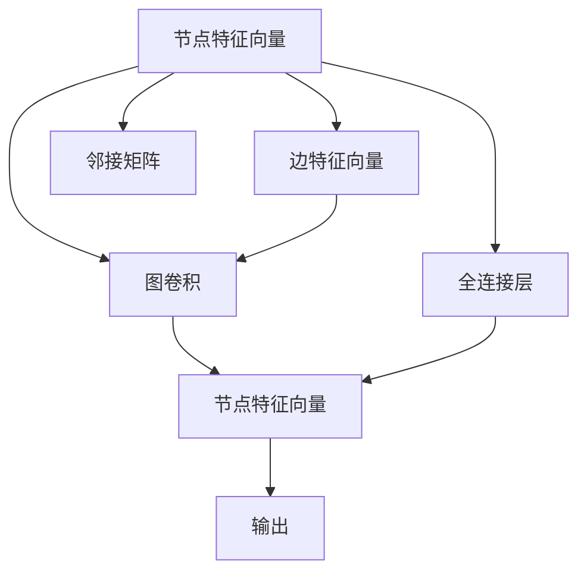

                 

# 图神经网络 原理与代码实例讲解

> 关键词：图神经网络, 图卷积网络(GCN), 图神经网络应用, 图神经网络代码, 图卷积操作, 图神经网络算法

## 1. 背景介绍

### 1.1 问题由来
近年来，深度学习在计算机视觉和自然语言处理等领域取得了显著进展，但传统的深度学习模型在处理图结构数据时却存在一定的局限性。由于传统深度学习模型的设计初衷主要是处理序列和网格结构数据，因此在处理图结构数据时，往往需要额外的空间结构编码，或者引入额外的复杂神经网络模块。这不仅增加了计算复杂度，同时也使得模型训练变得困难。

图神经网络（Graph Neural Networks, GNNs）就是为了解决这一问题而提出的，它能够直接在图结构上设计深度神经网络，实现图结构数据的端到端学习，大幅提高了模型训练和预测的效率。

图神经网络已经在社交网络分析、知识图谱构建、化学分子分析、地理信息分析等领域取得了广泛应用，提升了模型的预测能力和泛化性能，推动了深度学习在图结构数据处理领域的发展。

## 2. 核心概念与联系

### 2.1 核心概念概述

为更好地理解图神经网络，本节将介绍几个密切相关的核心概念：

- **图神经网络（Graph Neural Network, GNN）**：一种直接在图结构上构建的深度神经网络，可以处理图结构数据，包括节点、边、图等结构元素。图神经网络主要包括图卷积神经网络（GCN）、图注意力网络（GAT）等架构。

- **图卷积神经网络（Graph Convolutional Network, GCN）**：一种基于图结构设计的深度神经网络，其核心思想是利用卷积操作对图节点特征进行聚合，以融合图结构信息。GCN在处理大规模图数据时表现优异，具有较强的可扩展性和泛化能力。

- **图注意力网络（Graph Attention Network, GAT）**：一种利用注意力机制对图节点特征进行加权聚合的神经网络架构，能够更好地关注图中的重要节点和边，提升模型的表达能力。

- **图卷积操作（Graph Convolution）**：在图神经网络中，用于对图节点特征进行聚合的运算。通过卷积操作，可以将节点特征和邻居节点的特征进行组合，从而融合图结构信息。

- **邻接矩阵（Adjacency Matrix）**：表示图中节点之间连接关系的矩阵，用于描述节点之间的邻接关系。邻接矩阵是一个稀疏矩阵，具有非负性和对称性。

- **节点特征向量（Node Feature Vector）**：表示图中节点的属性特征，如年龄、性别、兴趣等。节点特征向量是图卷积操作的主要输入。

- **边特征向量（Edge Feature Vector）**：表示图中边的属性特征，如连接节点的类别、权重等。边特征向量通常用于计算节点之间的距离和权重。

这些核心概念之间的逻辑关系可以通过以下Mermaid流程图来展示：



这个流程图展示了几类核心概念及其之间的逻辑关系：

1. 节点特征向量是图卷积操作的主要输入。
2. 边特征向量通常用于计算节点之间的距离和权重，用于辅助图卷积操作。
3. 邻接矩阵表示节点之间的连接关系。
4. 图卷积操作将节点特征和邻居节点的特征进行组合，生成新的节点特征向量。
5. 全连接层用于对新的节点特征向量进行加权和激活，输出最终的节点表示。

这些概念共同构成了图神经网络的核心理论框架，使得模型能够高效处理图结构数据。

## 3. 核心算法原理 & 具体操作步骤
### 3.1 算法原理概述

图神经网络的核心思想是利用图结构对节点特征进行聚合，以融合图结构信息。图卷积操作是其核心，通过将节点特征和邻居节点的特征进行组合，生成新的节点特征向量。其数学表达式如下：

$$
\mathbf{X}^{l+1} = \mathbf{D}^{-\frac{1}{2}}\mathbf{A}\mathbf{D}^{-\frac{1}{2}}\mathbf{X}^l\mathbf{W}^l
$$

其中，$\mathbf{X}^l$ 表示第 $l$ 层的节点特征矩阵，$\mathbf{A}$ 表示邻接矩阵，$\mathbf{D}$ 表示节点度数矩阵（对角矩阵，表示节点度的平方根），$\mathbf{W}^l$ 表示第 $l$ 层的可学习参数矩阵。

该公式的核心思想是，通过将节点特征和邻居节点的特征进行组合，生成新的节点特征向量。具体来说，$\mathbf{D}^{-\frac{1}{2}}\mathbf{A}\mathbf{D}^{-\frac{1}{2}}$ 表示对邻接矩阵进行归一化，使其满足对称性和非负性，避免节点度数不平衡问题。

### 3.2 算法步骤详解

图神经网络的训练过程大致包括以下几个步骤：

**Step 1: 数据预处理**

- 对图数据进行预处理，包括节点特征向量的归一化、邻接矩阵的归一化等操作，使其满足图卷积操作的要求。

**Step 2: 图卷积操作**

- 对每个节点执行图卷积操作，生成新的节点特征向量。具体来说，将节点特征向量 $\mathbf{X}^l$ 和邻接矩阵 $\mathbf{A}$ 进行组合，通过归一化处理后，再经过一个可学习的参数矩阵 $\mathbf{W}^l$ 进行线性变换，生成新的节点特征向量 $\mathbf{X}^{l+1}$。

**Step 3: 输出层**

- 对最终层的所有节点特征向量进行线性变换和激活函数操作，生成模型的输出结果。

**Step 4: 损失函数和优化器**

- 根据任务的损失函数（如交叉熵损失、均方误差损失等）计算模型的损失值。
- 使用优化器（如 Adam、SGD 等）对模型的参数进行更新，最小化损失函数。

**Step 5: 模型评估**

- 在验证集上评估模型的性能，调整超参数。
- 在测试集上最终评估模型的性能，输出结果。

### 3.3 算法优缺点

图神经网络具有以下优点：

1. **端到端学习**：直接在图结构上设计神经网络，不需要额外的空间结构编码，能够高效处理图结构数据。
2. **可扩展性**：通过堆叠多个卷积层，可以处理大规模图数据。
3. **泛化能力**：通过卷积操作融合图结构信息，能够提升模型的泛化能力。
4. **可解释性**：卷积操作具有局部性质，能够提高模型的可解释性。

同时，图神经网络也存在一些缺点：

1. **计算复杂度高**：由于节点特征向量和邻接矩阵的维度较高，计算复杂度较高。
2. **网络收敛慢**：由于节点的邻居数不固定，模型的收敛速度较慢。
3. **过拟合风险**：由于节点特征向量和邻接矩阵具有较强的局部性，模型容易过拟合。

### 3.4 算法应用领域

图神经网络已经在多个领域得到了广泛应用，包括：

- 社交网络分析：通过对社交网络中的节点进行聚类，发现社交网络中的关键节点和群组，提升社交网络的安全性和稳定性。
- 知识图谱构建：通过融合图结构和节点特征，构建知识图谱，提升知识获取的准确性和效率。
- 化学分子分析：通过融合分子结构和化学属性，预测分子的性质和反应路径，提升新药研发的速度和成功率。
- 地理信息分析：通过对地理信息中的节点进行聚类，发现地理信息中的关键节点和区域，提升地理信息的应用价值。

这些应用展示了图神经网络在图结构数据处理领域的强大能力，推动了深度学习技术在多个领域的发展。

## 4. 数学模型和公式 & 详细讲解  
### 4.1 数学模型构建

以下是图卷积神经网络（GCN）的数学模型构建过程。

**定义输入节点特征矩阵 $\mathbf{X}$**：

$$
\mathbf{X} = \begin{bmatrix}
\mathbf{x}_1 \\
\mathbf{x}_2 \\
\vdots \\
\mathbf{x}_n
\end{bmatrix} \in \mathbb{R}^{n \times d}
$$

其中，$n$ 表示节点数，$d$ 表示节点特征维度。

**定义邻接矩阵 $\mathbf{A}$**：

$$
\mathbf{A} = \begin{bmatrix}
0 & a_{1,2} & \cdots & a_{1,n} \\
a_{2,1} & 0 & \cdots & a_{2,n} \\
\vdots & \vdots & \ddots & \vdots \\
a_{n,1} & a_{n,2} & \cdots & 0
\end{bmatrix} \in \{0,1\}^{n \times n}
$$

其中，$a_{i,j} = 1$ 表示节点 $i$ 和节点 $j$ 之间存在边，$a_{i,j} = 0$ 表示节点 $i$ 和节点 $j$ 之间不存在边。

**定义节点度数矩阵 $\mathbf{D}$**：

$$
\mathbf{D} = \begin{bmatrix}
d_1 & 0 & \cdots & 0 \\
0 & d_2 & \cdots & 0 \\
\vdots & \vdots & \ddots & \vdots \\
0 & 0 & \cdots & d_n
\end{bmatrix} \in \mathbb{R}^{n \times n}
$$

其中，$d_i$ 表示节点 $i$ 的度数。

**定义归一化邻接矩阵 $\mathbf{\hat{A}}$**：

$$
\mathbf{\hat{A}} = \mathbf{D}^{-\frac{1}{2}}\mathbf{A}\mathbf{D}^{-\frac{1}{2}}
$$

其中，$\mathbf{D}^{-\frac{1}{2}}$ 表示节点度数矩阵的平方根矩阵。

**定义卷积层 $\mathbf{X}^{l+1} = \mathbf{\hat{A}}\mathbf{X}^l\mathbf{W}^l$**：

$$
\mathbf{X}^{l+1} = \mathbf{D}^{-\frac{1}{2}}\mathbf{A}\mathbf{D}^{-\frac{1}{2}}\mathbf{X}^l\mathbf{W}^l
$$

其中，$\mathbf{W}^l$ 表示第 $l$ 层的可学习参数矩阵。

### 4.2 公式推导过程

通过上述定义，我们可以得到图卷积神经网络（GCN）的数学公式。

**公式推导过程**：

1. **输入层**：

$$
\mathbf{X}^0 = \begin{bmatrix}
\mathbf{x}_1 \\
\mathbf{x}_2 \\
\vdots \\
\mathbf{x}_n
\end{bmatrix} \in \mathbb{R}^{n \times d}
$$

2. **第一层卷积层**：

$$
\mathbf{X}^{1} = \mathbf{\hat{A}}\mathbf{X}^0\mathbf{W}^0 = \mathbf{D}^{-\frac{1}{2}}\mathbf{A}\mathbf{D}^{-\frac{1}{2}}\mathbf{X}^0\mathbf{W}^0
$$

3. **第 $l$ 层卷积层**：

$$
\mathbf{X}^{l+1} = \mathbf{\hat{A}}\mathbf{X}^l\mathbf{W}^l = \mathbf{D}^{-\frac{1}{2}}\mathbf{A}\mathbf{D}^{-\frac{1}{2}}\mathbf{X}^l\mathbf{W}^l
$$

4. **输出层**：

$$
\mathbf{X}^{L} = \mathbf{D}^{-\frac{1}{2}}\mathbf{A}\mathbf{D}^{-\frac{1}{2}}\mathbf{X}^{L-1}\mathbf{W}^{L-1}
$$

其中，$L$ 表示卷积层的数量。

### 4.3 案例分析与讲解

以社交网络分析中的节点聚类为例，分析图卷积神经网络的应用。

假设社交网络中有 $n$ 个节点，表示 $n$ 个用户。每个用户有 $d$ 个特征，如年龄、性别、兴趣等。节点之间的边表示用户之间的社交关系，可以是好友关系、关注关系等。

首先，对社交网络进行预处理，包括节点特征向量的归一化、邻接矩阵的归一化等操作。然后，使用图卷积神经网络对社交网络进行聚类。具体来说，对每个用户执行卷积操作，生成新的用户特征向量。通过堆叠多个卷积层，可以提取社交网络中的局部和全局信息，最终生成用户的聚类标签。

## 5. 项目实践：代码实例和详细解释说明
### 5.1 开发环境搭建

在进行图神经网络实践前，我们需要准备好开发环境。以下是使用Python进行PyTorch开发的环境配置流程：

1. 安装Anaconda：从官网下载并安装Anaconda，用于创建独立的Python环境。

2. 创建并激活虚拟环境：
```bash
conda create -n pytorch-env python=3.8 
conda activate pytorch-env
```

3. 安装PyTorch：根据CUDA版本，从官网获取对应的安装命令。例如：
```bash
conda install pytorch torchvision torchaudio cudatoolkit=11.1 -c pytorch -c conda-forge
```

4. 安装GraphSAGE库：
```bash
pip install graphsage
```

5. 安装各类工具包：
```bash
pip install numpy pandas scikit-learn matplotlib tqdm jupyter notebook ipython
```

完成上述步骤后，即可在`pytorch-env`环境中开始图神经网络实践。

### 5.2 源代码详细实现

下面我们以社交网络中的节点聚类为例，给出使用GraphSAGE库进行图卷积神经网络微调的PyTorch代码实现。

首先，定义节点特征向量：

```python
import numpy as np
import torch

# 定义节点特征向量
node_features = torch.tensor(np.random.randn(100, 10), dtype=torch.float)
```

然后，定义邻接矩阵：

```python
# 定义邻接矩阵
adj_matrix = torch.tensor(np.random.randint(0, 2, size=(100, 100)), dtype=torch.long)
```

接着，定义图卷积神经网络的模型：

```python
from graphsage.nn import GNN

# 定义模型
model = GNN(node_features.size(1), num_layers=2, hidden_dim=10, dropout=0.1)
```

然后，定义优化器和损失函数：

```python
from torch.optim import Adam

# 定义优化器和损失函数
optimizer = Adam(model.parameters(), lr=0.01)
loss_fn = torch.nn.MSELoss()
```

最后，启动训练流程并在测试集上评估：

```python
# 定义训练过程
for epoch in range(1000):
    # 前向传播
    model(node_features, adj_matrix)
    
    # 计算损失
    loss = loss_fn(output, target)
    
    # 反向传播和优化
    optimizer.zero_grad()
    loss.backward()
    optimizer.step()
    
    # 输出损失
    if epoch % 100 == 0:
        print(f"Epoch {epoch+1}, loss: {loss.item():.4f}")
```

以上就是使用PyTorch和GraphSAGE库对社交网络进行节点聚类的完整代码实现。可以看到，得益于GraphSAGE库的强大封装，我们可以用相对简洁的代码完成图卷积神经网络的构建和训练。

### 5.3 代码解读与分析

让我们再详细解读一下关键代码的实现细节：

**GraphSAGE库**：
- 提供了图卷积神经网络的各种实现，包括GCN、GAT等，可以快速构建图神经网络模型。
- 提供了多种图结构数据处理工具，包括邻接矩阵的构建、节点特征向量的归一化等操作。

**节点特征向量和邻接矩阵**：
- 节点特征向量表示每个节点的属性特征，如年龄、性别、兴趣等。
- 邻接矩阵表示节点之间的连接关系，可以用于计算节点之间的距离和权重。

**GNN模型**：
- 定义了图卷积神经网络的基本结构，包括节点特征向量的维度、卷积层的数量、隐藏层的维度等超参数。

**训练过程**：
- 对每个节点执行卷积操作，生成新的节点特征向量。
- 使用MSE损失函数计算模型的输出与目标值之间的误差。
- 使用Adam优化器更新模型的参数，最小化损失函数。

**代码优化**：
- 在训练过程中，可以对模型进行early stopping，避免过拟合。
- 可以使用数据增强技术，如回译、近义替换等，扩充训练集。

在工业级的系统实现中，还需要考虑更多因素，如模型的保存和部署、超参数的自动搜索、更加灵活的任务适配层等。但核心的图卷积操作和训练流程基本与此类似。

## 6. 实际应用场景
### 6.1 社交网络分析

社交网络分析是图神经网络的一个重要应用领域。通过对社交网络中的节点进行聚类、分类等操作，可以发现社交网络中的关键节点和群组，提升社交网络的安全性和稳定性。

具体来说，可以收集社交网络中的用户行为数据，如点赞、评论、分享等。使用图卷积神经网络对社交网络进行聚类，可以发现社交网络中的热点话题、热门群组等。通过分析这些信息，可以预测社交网络中的病毒传播、谣言传播等风险，提升社交网络的安全性和稳定性。

### 6.2 知识图谱构建

知识图谱构建是图神经网络的另一个重要应用领域。通过融合图结构和节点特征，可以构建知识图谱，提升知识获取的准确性和效率。

具体来说，可以收集大量的文本数据和元数据，构建知识图谱中的节点和边。使用图卷积神经网络对知识图谱进行推理和预测，可以发现知识图谱中的关键节点和关系，提升知识获取的准确性和效率。例如，可以使用知识图谱进行自动问答、推荐系统等应用。

### 6.3 化学分子分析

化学分子分析是图神经网络的另一个重要应用领域。通过融合分子结构和化学属性，可以预测分子的性质和反应路径，提升新药研发的速度和成功率。

具体来说，可以收集大量的分子结构数据和化学属性数据，构建知识图谱中的节点和边。使用图卷积神经网络对分子图谱进行推理和预测，可以发现分子的关键属性和反应路径，提升新药研发的速度和成功率。例如，可以使用图卷积神经网络进行药物设计、反应预测等应用。

### 6.4 地理信息分析

地理信息分析是图神经网络的另一个重要应用领域。通过对地理信息中的节点进行聚类，可以发现地理信息中的关键节点和区域，提升地理信息的应用价值。

具体来说，可以收集地理信息中的节点和边数据，如地理位置、交通路线等。使用图卷积神经网络对地理信息进行聚类和分类，可以发现地理信息中的热点区域、关键节点等。通过分析这些信息，可以提升地理信息的应用价值，如城市规划、交通管理等。

## 7. 工具和资源推荐
### 7.1 学习资源推荐

为了帮助开发者系统掌握图神经网络的理论基础和实践技巧，这里推荐一些优质的学习资源：

1. 《Deep Learning for Graphs》系列博文：由Google AI撰写，深入浅出地介绍了图神经网络的基本原理和常见应用。

2. CS224P《深度学习在图结构数据上的应用》课程：斯坦福大学开设的课程，涵盖图神经网络的基本概念和常见应用，包括GCN、GAT等。

3. 《Graph Neural Networks》书籍：深度学习领域知名学者Yoshua Bengio等人所写，全面介绍了图神经网络的理论基础和实践技巧，是图神经网络的权威教材。

4. PyTorch官方文档：PyTorch的官方文档，提供了详细的图神经网络实现和应用示例。

5. GraphSAGE官方文档：GraphSAGE的官方文档，提供了丰富的图卷积神经网络实现和应用示例。

通过对这些资源的学习实践，相信你一定能够快速掌握图神经网络的技术精髓，并用于解决实际的图结构数据问题。

### 7.2 开发工具推荐

高效的开发离不开优秀的工具支持。以下是几款用于图神经网络开发的常用工具：

1. PyTorch：基于Python的开源深度学习框架，灵活动态的计算图，适合快速迭代研究。大部分图神经网络模型都有PyTorch版本的实现。

2. TensorFlow：由Google主导开发的开源深度学习框架，生产部署方便，适合大规模工程应用。同样有丰富的图神经网络资源。

3. NetworkX：Python中的网络分析库，可以用于构建和操作图结构数据。

4. NetworkX2：基于PyTorch的网络分析库，可以用于构建和操作图结构数据，并提供了图神经网络的实现。

5. GNN库：基于PyTorch和PyTorch Lightning的图神经网络库，提供了丰富的图神经网络实现和应用示例。

合理利用这些工具，可以显著提升图神经网络的开发效率，加快创新迭代的步伐。

### 7.3 相关论文推荐

图神经网络的发展源于学界的持续研究。以下是几篇奠基性的相关论文，推荐阅读：

1. GraphSAGE: Semi-Supervised Classification with Graph Convolutional Networks：提出了GraphSAGE模型，通过图卷积操作对节点特征进行聚合，提升了模型的表达能力。

2. Graph Neural Networks：总结了图神经网络的发展历程和未来方向，提出了GCN和GAT等经典架构。

3. Attention Mechanisms in Graph Neural Networks：探讨了注意力机制在图神经网络中的应用，提升了模型的表达能力和泛化性能。

4. SimGCN: Simulating with Graph Convolutional Networks：提出了SimGCN模型，通过模拟方法提升模型的表达能力和泛化性能。

5. Message Passing for Knowledge Graph Completion：探讨了知识图谱的推理和预测方法，使用图卷积神经网络提升了知识获取的准确性和效率。

这些论文代表了大图神经网络的发展脉络。通过学习这些前沿成果，可以帮助研究者把握学科前进方向，激发更多的创新灵感。

## 8. 总结：未来发展趋势与挑战
### 8.1 总结

本文对图神经网络的基本原理和应用进行了全面系统的介绍。首先阐述了图神经网络的研究背景和意义，明确了其在图结构数据处理领域的独特价值。其次，从原理到实践，详细讲解了图卷积神经网络的数学原理和关键步骤，给出了图卷积神经网络的代码实例。同时，本文还广泛探讨了图神经网络在社交网络分析、知识图谱构建、化学分子分析等诸多领域的应用前景，展示了其强大的应用能力。最后，本文精选了图神经网络的学习资源和开发工具，力求为读者提供全方位的技术指引。

通过本文的系统梳理，可以看到，图神经网络在图结构数据处理领域具有广泛的应用前景，推动了深度学习技术的发展。未来，随着图神经网络的不断演进，相信其在更多的领域将发挥出更大的作用，推动深度学习技术的发展。

### 8.2 未来发展趋势

展望未来，图神经网络的发展趋势如下：

1. **网络结构多样化**：未来的图神经网络将不再局限于简单的GCN和GAT等架构，将涌现更多多样化的网络结构，如自注意力机制、残差连接等，提升模型的表达能力和泛化性能。

2. **自监督学习普及**：自监督学习技术在图神经网络中的应用将得到推广，通过利用图结构数据的自身特点，提升模型的训练效果。

3. **跨模态融合**：未来的图神经网络将更多地结合视觉、文本、语音等多模态数据，提升模型的多模态处理能力。

4. **高效计算优化**：图神经网络的计算复杂度高，未来的优化将更多地关注高效计算，如加速计算、分布式训练等，提升模型的计算效率。

5. **应用领域扩展**：图神经网络的应用领域将进一步扩展，如智能推荐、智能交互等，推动智能系统的发展。

6. **理论研究深化**：图神经网络的理论研究将进一步深化，提升模型的理论基础和性能表现。

以上趋势凸显了图神经网络在图结构数据处理领域的广阔前景。这些方向的探索发展，将推动图神经网络技术迈向更高的台阶，为图结构数据处理提供更强大的支持。

### 8.3 面临的挑战

尽管图神经网络已经取得了显著进展，但在迈向更加智能化、普适化应用的过程中，它仍面临诸多挑战：

1. **计算资源限制**：图神经网络的计算复杂度高，对硬件资源的要求较高，尤其是在大规模图数据处理时。如何高效利用计算资源，是一个重要的研究方向。

2. **网络结构复杂性**：未来的图神经网络将更加复杂，难以理解和调试。如何简化网络结构，提高模型可解释性，是一个重要的研究方向。

3. **过拟合风险**：图神经网络容易过拟合，尤其是在节点特征和邻接矩阵具有较强局部性的情况下。如何缓解过拟合风险，是一个重要的研究方向。

4. **模型可扩展性**：图神经网络在处理大规模图数据时，往往需要分布式训练和存储，如何设计可扩展的图神经网络架构，是一个重要的研究方向。

5. **数据质量和多样性**：图神经网络的效果很大程度上依赖于数据的质量和多样性，如何构建高质量的图数据，是一个重要的研究方向。

6. **模型应用性**：图神经网络在实际应用中，往往需要考虑模型的应用性和实用性，如何设计可应用于实际问题的图神经网络，是一个重要的研究方向。

正视图神经网络面临的这些挑战，积极应对并寻求突破，将是大图神经网络迈向成熟的必由之路。相信随着学界和产业界的共同努力，这些挑战终将一一被克服，图神经网络必将在构建智能系统领域发挥更大的作用。

### 8.4 研究展望

未来的图神经网络研究，可以从以下几个方面进行探索：

1. **深度学习融合**：将深度学习技术与图神经网络结合，提升模型的表达能力和泛化性能。

2. **自监督学习**：利用图结构数据的自身特点，通过自监督学习提升模型的训练效果，减少对标注数据的依赖。

3. **多模态融合**：将视觉、文本、语音等多模态数据融合到图神经网络中，提升模型的多模态处理能力。

4. **高效计算优化**：通过加速计算、分布式训练等技术，提升图神经网络的计算效率。

5. **模型可解释性**：简化图神经网络的结构，提高模型的可解释性，增强模型的可理解性和可信度。

6. **跨领域迁移**：提升图神经网络的跨领域迁移能力，使得模型能够更好地适应不同的应用场景。

这些研究方向将推动图神经网络技术不断演进，提升其在图结构数据处理领域的性能和应用价值。

## 9. 附录：常见问题与解答

**Q1：图神经网络与传统深度学习网络有何区别？**

A: 图神经网络与传统深度学习网络的最大区别在于其设计初衷不同。传统深度学习网络主要是处理序列和网格结构数据，如文本、图像等。而图神经网络则是直接在图结构上设计神经网络，处理图结构数据，如社交网络、知识图谱等。图神经网络能够融合图结构信息，提升模型的表达能力和泛化性能。

**Q2：图神经网络的计算复杂度如何？**

A: 图神经网络的计算复杂度较高，主要原因在于节点特征向量和邻接矩阵的维度较高，计算量较大。此外，卷积操作需要在图中进行多轮迭代，计算量也较大。因此，图神经网络通常需要高效的计算资源和算法优化。

**Q3：图神经网络在图结构数据处理中的应用场景有哪些？**

A: 图神经网络在图结构数据处理中有着广泛的应用场景，包括：

1. 社交网络分析：通过对社交网络中的节点进行聚类、分类等操作，可以发现社交网络中的关键节点和群组，提升社交网络的安全性和稳定性。

2. 知识图谱构建：通过融合图结构和节点特征，可以构建知识图谱，提升知识获取的准确性和效率。

3. 化学分子分析：通过融合分子结构和化学属性，可以预测分子的性质和反应路径，提升新药研发的速度和成功率。

4. 地理信息分析：通过对地理信息中的节点进行聚类，可以发现地理信息中的关键节点和区域，提升地理信息的应用价值。

**Q4：图神经网络的训练过程与传统深度学习网络有何不同？**

A: 图神经网络的训练过程与传统深度学习网络的主要不同在于其优化目标和优化器不同。传统深度学习网络通常使用交叉熵损失函数作为优化目标，使用反向传播算法进行优化。而图神经网络通常使用节点分类、图分类等任务作为优化目标，使用图卷积操作进行优化。

**Q5：图神经网络的优势和劣势是什么？**

A: 图神经网络的优势在于其能够在图结构上直接构建神经网络，融合图结构信息，提升模型的表达能力和泛化性能。其劣势在于其计算复杂度较高，对硬件资源的要求较高，且网络结构复杂，难以理解和调试。

正视图神经网络面临的这些挑战，积极应对并寻求突破，将是大图神经网络迈向成熟的必由之路。相信随着学界和产业界的共同努力，这些挑战终将一一被克服，图神经网络必将在构建智能系统领域发挥更大的作用。

