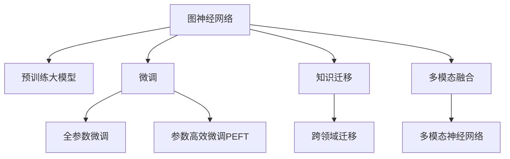

                 

## 1. 背景介绍

### 1.1 问题由来

随着深度学习技术的快速发展，图神经网络（Graph Neural Networks, GNNs）作为一种新颖的神经网络模型，已经在图结构数据处理和分析领域取得了显著的进展。传统的神经网络主要面向非结构化数据（如文本、图像）进行处理，而对于结构化数据（如社交网络、分子结构），传统的神经网络往往难以捕捉其特有的图结构关系。图神经网络正是为了解决这一问题而提出的，它通过模拟图结构信息的传递和聚合，使神经网络能够对图结构数据进行有效的处理和分析。

近年来，图神经网络在推荐系统、社交网络分析、分子图形分析等众多领域都展现了强大的应用潜力，逐渐成为数据科学和人工智能研究的热点。同时，大模型（如BERT、GPT等）也由于其在大规模无标签数据上进行预训练所获得的丰富语言知识和常识，被广泛应用于自然语言处理（NLP）、计算机视觉（CV）等多个领域，显著提升了下游任务的性能。因此，结合图神经网络和预训练大模型的优势，推动了图神经网络在大模型中的应用研究，为图结构数据处理和分析提供了新的方法论和实现途径。

### 1.2 问题核心关键点

图神经网络在大模型中的应用主要体现在以下几个方面：
1. **图结构信息捕获**：图神经网络能够有效捕获图结构数据中的节点关系和边特征，这些信息在许多下游任务中具有重要意义。例如，社交网络分析中，节点之间的关系能够反映用户之间的社交网络结构，而边特征（如边的权重）则能够体现节点之间的连接强度和互动频率。
2. **知识融合与迁移**：通过将大模型的预训练知识与图神经网络的结构信息融合，可以实现跨领域知识迁移，提升模型在特定任务上的泛化能力。例如，在分子图形分析中，将预训练大模型的语言知识与图神经网络融合，可以提高模型对新分子图形的识别和预测能力。
3. **高效计算与推理**：图神经网络通过邻居聚合方式进行信息传递和计算，可以有效降低计算复杂度，提升推理效率。结合大模型的高计算能力，可以处理更大规模的图结构数据，实现更高效的数据分析与处理。
4. **低标注样本微调**：在实际应用中，标注样本往往稀缺且成本高昂。通过将图神经网络与预训练大模型结合，可以在少样本条件下进行微调，提升模型的泛化能力和鲁棒性。

### 1.3 问题研究意义

图神经网络在大模型中的应用，对于拓展图结构数据的处理和分析范围，提升图结构任务的效果，加速图结构数据的产业化进程，具有重要意义：

1. **降低数据标注成本**：图神经网络可以在低标注样本条件下进行微调，显著降低数据标注成本，为图结构数据的自动化处理提供可能。
2. **提升模型效果**：通过图神经网络与大模型的结合，可以充分利用大模型预训练的知识，提升模型在特定图结构任务上的表现。
3. **加速模型开发**：结合图神经网络与大模型，可以实现图结构数据的快速处理和分析，加速图结构任务的应用开发周期。
4. **促进知识迁移**：图神经网络可以学习图结构信息，结合大模型的预训练知识，实现跨领域知识迁移，推动图结构数据分析技术的跨越式发展。
5. **赋能产业升级**：图神经网络与大模型的结合，为图结构数据分析在各个行业中的应用提供了新的技术支持，推动图结构数据分析技术的普及和应用。

## 2. 核心概念与联系

### 2.1 核心概念概述

为了更好地理解图神经网络在大模型中的应用，本节将介绍几个密切相关的核心概念：

- **图神经网络（Graph Neural Network, GNN）**：一种专门用于处理图结构数据的新型神经网络模型，通过模拟图结构信息的传递和聚合，实现对节点属性和关系信息的有效处理。常见的图神经网络包括GCN、GAT、GraphSAGE等。
- **预训练大模型（Pre-trained Large Models）**：以自回归（如GPT）或自编码（如BERT）模型为代表的大规模预训练语言模型，通过在大规模无标签文本数据上进行预训练，学习通用的语言知识和常识，具备强大的语言理解和生成能力。
- **微调（Fine-tuning）**：指在预训练模型的基础上，使用下游任务的少量标注数据，通过有监督地训练优化模型在特定任务上的性能。通常只需要调整顶层分类器或解码器，并以较小的学习率更新全部或部分的模型参数。
- **知识迁移（Knowledge Transfer）**：指将一个领域学习到的知识，迁移到另一个不同但相关的领域的学习范式。图神经网络结合大模型的知识迁移，可以实现跨领域知识融合，提升模型在新领域上的表现。
- **多模态融合（Multi-modal Fusion）**：指将不同模态的数据（如文本、图像、音频）进行融合，构建多模态神经网络模型，提升模型的综合处理能力。结合大模型的多模态知识，可以实现更为全面和精确的数据分析。

这些核心概念之间的逻辑关系可以通过以下Mermaid流程图来展示：



这个流程图展示了大模型、图神经网络、微调和知识迁移等概念之间的联系：

1. 图神经网络通过模拟图结构信息的传递和聚合，实现对图结构数据的有效处理。
2. 预训练大模型通过在大规模无标签数据上进行预训练，学习通用的语言知识和常识。
3. 微调范式可以将预训练大模型的通用知识迁移到特定任务上，提升模型在特定任务上的表现。
4. 知识迁移范式可以跨领域应用大模型的知识，推动图神经网络在其他领域的应用。
5. 多模态融合范式可以将不同模态的数据进行融合，提升模型的综合处理能力。

这些概念共同构成了图神经网络在大模型中的应用框架，使其能够在各种图结构数据处理和分析任务中发挥重要作用。通过理解这些核心概念，我们可以更好地把握图神经网络与大模型结合的精髓，探索更多新的应用场景。

## 3. 核心算法原理 & 具体操作步骤

### 3.1 算法原理概述

图神经网络在大模型中的应用，本质上是一个图结构数据的预训练-微调过程。其核心思想是：将大模型视为一个强大的图结构信息提取器，通过在大规模图结构数据上进行预训练，学习通用的图结构表示，再通过微调范式优化模型在特定图结构任务上的性能。

具体来说，假设图结构数据集为 $G=\{V,E\}$，其中 $V$ 为节点集，$E$ 为边集。在大模型上进行预训练时，将其视为一个图结构数据集，节点为语言词汇表中的词向量，边为语言模型中的依赖关系或上下文信息。通过在大量的无标签图结构数据上预训练大模型，使其学习到图结构数据的通用表示。

在微调过程中，选择图结构任务 $T$ 的少量标注数据 $D=\{(G_i,y_i)\}_{i=1}^N$，将预训练大模型作为初始化参数，通过有监督地训练优化模型在特定图结构任务上的性能。微调的目标是找到新的模型参数 $\hat{\theta}$，使得模型在任务 $T$ 上的表现达到最佳。

### 3.2 算法步骤详解

图神经网络在大模型中的应用，一般包括以下几个关键步骤：

**Step 1: 准备图结构数据和大模型**

- 收集并处理图结构数据集 $G=\{V,E\}$，确保数据的完整性和一致性。
- 选择合适的预训练大模型 $M_{\theta}$，如BERT、GPT等，并加载预训练权重。

**Step 2: 构建图神经网络**

- 根据图结构数据的特性，选择合适的图神经网络模型，如GCN、GAT等。
- 设计图神经网络的结构，包括节点和边的表示、邻居聚合方式、图卷积操作等。

**Step 3: 添加任务适配层**

- 根据图结构任务的性质，在图神经网络的基础上添加适当的任务适配层。
- 对于分类任务，通常添加分类器层，如全连接层或线性回归层。
- 对于生成任务，通常使用解码器输出概率分布，并以负对数似然为损失函数。

**Step 4: 设置微调超参数**

- 选择合适的优化算法及其参数，如 AdamW、SGD 等，设置学习率、批大小、迭代轮数等。
- 设置正则化技术及强度，包括权重衰减、Dropout、Early Stopping 等。
- 确定冻结预训练参数的策略，如仅微调顶层，或全部参数都参与微调。

**Step 5: 执行梯度训练**

- 将图结构数据分批次输入模型，前向传播计算损失函数。
- 反向传播计算参数梯度，根据设定的优化算法和学习率更新模型参数。
- 周期性在验证集上评估模型性能，根据性能指标决定是否触发 Early Stopping。
- 重复上述步骤直到满足预设的迭代轮数或 Early Stopping 条件。

**Step 6: 测试和部署**

- 在测试集上评估微调后模型 $M_{\hat{\theta}}$ 的性能，对比微调前后的精度提升。
- 使用微调后的模型对新图结构数据进行推理预测，集成到实际的应用系统中。
- 持续收集新的图结构数据，定期重新微调模型，以适应数据分布的变化。

以上是图神经网络在大模型中的应用的一般流程。在实际应用中，还需要针对具体图结构任务的特点，对微调过程的各个环节进行优化设计，如改进训练目标函数，引入更多的正则化技术，搜索最优的超参数组合等，以进一步提升模型性能。

### 3.3 算法优缺点

图神经网络在大模型中的应用，具有以下优点：

1. **高效计算与推理**：图神经网络通过邻居聚合方式进行信息传递和计算，可以有效降低计算复杂度，提升推理效率。结合大模型的高计算能力，可以处理更大规模的图结构数据，实现更高效的数据分析与处理。
2. **丰富的语义信息**：大模型通过大规模无标签数据的预训练，学习到丰富的语言知识和常识，这些知识可以与图神经网络的结构信息结合，增强模型对图结构数据的理解能力。
3. **低标注样本微调**：在实际应用中，标注样本往往稀缺且成本高昂。通过将图神经网络与预训练大模型结合，可以在少样本条件下进行微调，提升模型的泛化能力和鲁棒性。
4. **跨领域知识迁移**：图神经网络可以学习图结构信息，结合大模型的预训练知识，实现跨领域知识迁移，推动图结构数据分析技术的跨越式发展。

同时，该方法也存在一定的局限性：

1. **图结构数据的获取难度**：图结构数据的获取和处理通常比非结构化数据更为复杂，需要大量的时间和资源。
2. **模型复杂度**：图神经网络的结构相对复杂，训练和推理过程可能比传统神经网络耗时更久。
3. **过拟合风险**：在大模型的微调过程中，如果标注数据不足或质量不高，模型可能面临过拟合的风险。
4. **可解释性不足**：图神经网络的结构复杂，难以解释其内部工作机制和决策逻辑。

尽管存在这些局限性，但就目前而言，图神经网络与大模型结合的应用方法仍然是大规模图结构数据分析的重要方向。未来相关研究的重点在于如何进一步降低图结构数据的获取难度，提高模型的泛化能力和可解释性，同时兼顾计算效率和推理速度。

### 3.4 算法应用领域

图神经网络结合大模型的应用，已经在多个领域取得了显著的应用成果：

1. **推荐系统**：利用社交网络关系和用户行为数据，构建推荐图，通过图神经网络学习用户和物品之间的潜在关系，结合大模型的知识，提升推荐系统的推荐效果。
2. **分子图形分析**：将分子图形数据转化为图结构数据，利用图神经网络学习分子结构和功能之间的关系，结合大模型的语言知识，预测分子的性质和活性。
3. **社交网络分析**：分析社交网络中的关系和行为数据，构建社交网络图，通过图神经网络学习用户之间的关系和影响力，结合大模型的知识，挖掘社交网络中的潜在信息和趋势。
4. **医疗数据分析**：利用患者和疾病的图结构数据，构建医疗知识图，通过图神经网络学习知识图中的关系和规则，结合大模型的知识，辅助医生的诊断和治疗决策。
5. **城市规划与交通管理**：利用城市中的交通和基础设施数据，构建城市网络图，通过图神经网络学习城市中的交通流动和资源分配，结合大模型的知识，优化城市规划和交通管理策略。

除了上述这些经典应用外，图神经网络与大模型的结合，还在更多领域展示出其强大的应用潜力，如金融风险管理、物流优化、网络安全等，推动了图结构数据分析技术的深入发展和广泛应用。

## 4. 数学模型和公式 & 详细讲解 & 举例说明

### 4.1 数学模型构建

本节将使用数学语言对图神经网络在大模型中的应用过程进行更加严格的刻画。

假设预训练大模型为 $M_{\theta}:\mathcal{X} \rightarrow \mathcal{Y}$，其中 $\mathcal{X}$ 为输入空间，$\mathcal{Y}$ 为输出空间，$\theta \in \mathbb{R}^d$ 为模型参数。假设微调任务的图结构数据集为 $G=\{V,E\}$，其中 $V$ 为节点集，$E$ 为边集。

定义模型 $M_{\theta}$ 在图结构数据 $G$ 上的损失函数为 $\ell(M_{\theta}(G),y)$，则在图结构数据集 $G$ 上的经验风险为：

$$
\mathcal{L}(\theta) = \frac{1}{N}\sum_{i=1}^N \ell(M_{\theta}(G_i),y_i)
$$

其中 $\ell$ 为针对图结构任务设计的损失函数，用于衡量模型预测输出与真实标签之间的差异。常见的损失函数包括交叉熵损失、均方误差损失等。

微调的优化目标是最小化经验风险，即找到最优参数：

$$
\theta^* = \mathop{\arg\min}_{\theta} \mathcal{L}(\theta)
$$

在实践中，我们通常使用基于梯度的优化算法（如SGD、Adam等）来近似求解上述最优化问题。设 $\eta$ 为学习率，$\lambda$ 为正则化系数，则参数的更新公式为：

$$
\theta \leftarrow \theta - \eta \nabla_{\theta}\mathcal{L}(\theta) - \eta\lambda\theta
$$

其中 $\nabla_{\theta}\mathcal{L}(\theta)$ 为损失函数对参数 $\theta$ 的梯度，可通过反向传播算法高效计算。

### 4.2 公式推导过程

以下我们以二分类任务为例，推导交叉熵损失函数及其梯度的计算公式。

假设模型 $M_{\theta}$ 在输入 $x$ 上的输出为 $\hat{y}=M_{\theta}(x) \in [0,1]$，表示样本属于正类的概率。真实标签 $y \in \{0,1\}$。则二分类交叉熵损失函数定义为：

$$
\ell(M_{\theta}(x),y) = -[y\log \hat{y} + (1-y)\log (1-\hat{y})]
$$

将其代入经验风险公式，得：

$$
\mathcal{L}(\theta) = -\frac{1}{N}\sum_{i=1}^N [y_i\log M_{\theta}(G_i)+(1-y_i)\log(1-M_{\theta}(G_i))]
$$

根据链式法则，损失函数对参数 $\theta_k$ 的梯度为：

$$
\frac{\partial \mathcal{L}(\theta)}{\partial \theta_k} = -\frac{1}{N}\sum_{i=1}^N (\frac{y_i}{M_{\theta}(G_i)}-\frac{1-y_i}{1-M_{\theta}(G_i)}) \frac{\partial M_{\theta}(G_i)}{\partial \theta_k}
$$

其中 $\frac{\partial M_{\theta}(G_i)}{\partial \theta_k}$ 可进一步递归展开，利用自动微分技术完成计算。

在得到损失函数的梯度后，即可带入参数更新公式，完成模型的迭代优化。重复上述过程直至收敛，最终得到适应图结构任务的最优模型参数 $\theta^*$。

### 4.3 案例分析与讲解

下面以社交网络分析为例，说明图神经网络与大模型结合的微调过程。

假设我们要对社交网络中的用户关系进行分析，构建社交网络图 $G=(V,E)$，其中 $V$ 为用户集合，$E$ 为边集合，表示用户之间的关注关系。给定训练集 $D=\{(G_i,y_i)\}_{i=1}^N$，其中 $G_i$ 为社交网络图，$y_i$ 为图分类标签。

在预训练大模型上进行微调的步骤如下：

1. **准备数据和模型**：收集社交网络数据，并构建社交网络图。选择BERT或GPT等预训练大模型，并加载预训练权重。

2. **添加任务适配层**：在预训练大模型的顶层添加图分类器，如全连接层或线性回归层。

3. **设置微调超参数**：选择合适的优化算法（如AdamW、SGD等），设置学习率、批大小、迭代轮数等。

4. **执行梯度训练**：将社交网络数据分批次输入模型，前向传播计算损失函数。反向传播计算参数梯度，根据设定的优化算法和学习率更新模型参数。

5. **测试和部署**：在测试集上评估微调后模型 $M_{\hat{\theta}}$ 的性能，对比微调前后的精度提升。使用微调后的模型对新社交网络数据进行推理预测，集成到实际的应用系统中。

通过这一过程，我们可以将大模型的语言知识与社交网络图的数据结构相结合，利用大模型的丰富语义信息，增强图神经网络对社交网络数据的理解和分析能力。

## 5. 项目实践：代码实例和详细解释说明

### 5.1 开发环境搭建

在进行微调实践前，我们需要准备好开发环境。以下是使用Python进行PyTorch开发的环境配置流程：

1. 安装Anaconda：从官网下载并安装Anaconda，用于创建独立的Python环境。

2. 创建并激活虚拟环境：
```bash
conda create -n pytorch-env python=3.8 
conda activate pytorch-env
```

3. 安装PyTorch：根据CUDA版本，从官网获取对应的安装命令。例如：
```bash
conda install pytorch torchvision torchaudio cudatoolkit=11.1 -c pytorch -c conda-forge
```

4. 安装Transformers库：
```bash
pip install transformers
```

5. 安装各类工具包：
```bash
pip install numpy pandas scikit-learn matplotlib tqdm jupyter notebook ipython
```

完成上述步骤后，即可在`pytorch-env`环境中开始微调实践。

### 5.2 源代码详细实现

这里我们以社交网络分析为例，给出使用Transformers库对BERT模型进行微调的PyTorch代码实现。

首先，定义社交网络分析任务的数据处理函数：

```python
from transformers import BertTokenizer, BertForGraphClassification
from torch.utils.data import Dataset, DataLoader
import torch

class SocialNetworkDataset(Dataset):
    def __init__(self, graph_data, graph_labels, tokenizer, max_len=128):
        self.graph_data = graph_data
        self.graph_labels = graph_labels
        self.tokenizer = tokenizer
        self.max_len = max_len
        
    def __len__(self):
        return len(self.graph_data)
    
    def __getitem__(self, item):
        graph = self.graph_data[item]
        label = self.graph_labels[item]
        
        encoding = self.tokenizer(graph, return_tensors='pt', max_length=self.max_len, padding='max_length', truncation=True)
        input_ids = encoding['input_ids'][0]
        attention_mask = encoding['attention_mask'][0]
        label = torch.tensor(label, dtype=torch.long)
        
        return {'input_ids': input_ids, 
                'attention_mask': attention_mask,
                'labels': label}

# 标签与id的映射
label2id = {0: 'neg', 1: 'pos'}
id2label = {v: k for k, v in label2id.items()}

# 创建dataset
tokenizer = BertTokenizer.from_pretrained('bert-base-cased')

train_dataset = SocialNetworkDataset(train_graph_data, train_graph_labels, tokenizer)
dev_dataset = SocialNetworkDataset(dev_graph_data, dev_graph_labels, tokenizer)
test_dataset = SocialNetworkDataset(test_graph_data, test_graph_labels, tokenizer)
```

然后，定义模型和优化器：

```python
from transformers import BertForGraphClassification, AdamW

model = BertForGraphClassification.from_pretrained('bert-base-cased', num_labels=len(label2id))

optimizer = AdamW(model.parameters(), lr=2e-5)
```

接着，定义训练和评估函数：

```python
from tqdm import tqdm
from sklearn.metrics import accuracy_score

device = torch.device('cuda') if torch.cuda.is_available() else torch.device('cpu')
model.to(device)

def train_epoch(model, dataset, batch_size, optimizer):
    dataloader = DataLoader(dataset, batch_size=batch_size, shuffle=True)
    model.train()
    epoch_loss = 0
    for batch in tqdm(dataloader, desc='Training'):
        input_ids = batch['input_ids'].to(device)
        attention_mask = batch['attention_mask'].to(device)
        labels = batch['labels'].to(device)
        model.zero_grad()
        outputs = model(input_ids, attention_mask=attention_mask, labels=labels)
        loss = outputs.loss
        epoch_loss += loss.item()
        loss.backward()
        optimizer.step()
    return epoch_loss / len(dataloader)

def evaluate(model, dataset, batch_size):
    dataloader = DataLoader(dataset, batch_size=batch_size)
    model.eval()
    preds, labels = [], []
    with torch.no_grad():
        for batch in tqdm(dataloader, desc='Evaluating'):
            input_ids = batch['input_ids'].to(device)
            attention_mask = batch['attention_mask'].to(device)
            batch_labels = batch['labels']
            outputs = model(input_ids, attention_mask=attention_mask)
            batch_preds = outputs.logits.argmax(dim=2).to('cpu').tolist()
            batch_labels = batch_labels.to('cpu').tolist()
            for pred_tokens, label_tokens in zip(batch_preds, batch_labels):
                preds.append(pred_tokens[:len(label_tokens)])
                labels.append(label_tokens)
                
    print(f'Accuracy: {accuracy_score(labels, preds)}')
```

最后，启动训练流程并在测试集上评估：

```python
epochs = 5
batch_size = 16

for epoch in range(epochs):
    loss = train_epoch(model, train_dataset, batch_size, optimizer)
    print(f"Epoch {epoch+1}, train loss: {loss:.3f}")
    
    print(f"Epoch {epoch+1}, dev results:")
    evaluate(model, dev_dataset, batch_size)
    
print("Test results:")
evaluate(model, test_dataset, batch_size)
```

以上就是使用PyTorch对BERT进行社交网络分析任务微调的完整代码实现。可以看到，得益于Transformers库的强大封装，我们可以用相对简洁的代码完成BERT模型的加载和微调。

### 5.3 代码解读与分析

让我们再详细解读一下关键代码的实现细节：

**SocialNetworkDataset类**：
- `__init__`方法：初始化社交网络数据、标签、分词器等关键组件。
- `__len__`方法：返回数据集的样本数量。
- `__getitem__`方法：对单个样本进行处理，将社交网络数据输入编码为token ids，将标签编码为数字，并对其进行定长padding，最终返回模型所需的输入。

**label2id和id2label字典**：
- 定义了标签与数字id之间的映射关系，用于将模型预测结果解码为真实的标签。

**训练和评估函数**：
- 使用PyTorch的DataLoader对数据集进行批次化加载，供模型训练和推理使用。
- 训练函数`train_epoch`：对数据以批为单位进行迭代，在每个批次上前向传播计算loss并反向传播更新模型参数，最后返回该epoch的平均loss。
- 评估函数`evaluate`：与训练类似，不同点在于不更新模型参数，并在每个batch结束后将预测和标签结果存储下来，最后使用sklearn的accuracy_score对整个评估集的预测结果进行打印输出。

**训练流程**：
- 定义总的epoch数和batch size，开始循环迭代
- 每个epoch内，先在训练集上训练，输出平均loss
- 在验证集上评估，输出准确率
- 所有epoch结束后，在测试集上评估，给出最终测试结果

可以看到，PyTorch配合Transformers库使得BERT微调的代码实现变得简洁高效。开发者可以将更多精力放在数据处理、模型改进等高层逻辑上，而不必过多关注底层的实现细节。

当然，工业级的系统实现还需考虑更多因素，如模型的保存和部署、超参数的自动搜索、更灵活的任务适配层等。但核心的微调范式基本与此类似。

## 6. 实际应用场景

### 6.1 智能客服系统

基于大模型和图神经网络的智能客服系统，可以提供7x24小时不间断服务，快速响应客户咨询，以自然流畅的语言解答各类常见问题。

在技术实现上，可以收集企业内部的历史客服对话记录，将问题和最佳答复构建成监督数据，在此基础上对预训练模型进行微调。微调后的对话模型能够自动理解用户意图，匹配最合适的答案模板进行回复。对于客户提出的新问题，还可以接入检索系统实时搜索相关内容，动态组织生成回答。如此构建的智能客服系统，能大幅提升客户咨询体验和问题解决效率。

### 6.2 金融舆情监测

金融机构需要实时监测市场舆论动向，以便及时应对负面信息传播，规避金融风险。传统的人工监测方式成本高、效率低，难以应对网络时代海量信息爆发的挑战。基于大模型和图神经网络的文本分类和情感分析技术，为金融舆情监测提供了新的解决方案。

具体而言，可以收集金融领域相关的新闻、报道、评论等文本数据，并对其进行主题标注和情感标注。在此基础上对预训练语言模型进行微调，使其能够自动判断文本属于何种主题，情感倾向是正面、中性还是负面。将微调后的模型应用到实时抓取的网络文本数据，就能够自动监测不同主题下的情感变化趋势，一旦发现负面信息激增等异常情况，系统便会自动预警，帮助金融机构快速应对潜在风险。

### 6.3 个性化推荐系统

当前的推荐系统往往只依赖用户的历史行为数据进行物品推荐，无法深入理解用户的真实兴趣偏好。基于大模型和图神经网络的个性化推荐系统，可以更好地挖掘用户行为背后的语义信息，从而提供更精准、多样的推荐内容。

在实践中，可以收集用户浏览、点击、评论、分享等行为数据，提取和用户交互的物品标题、描述、标签等文本内容。将文本内容作为模型输入，用户的后续行为（如是否点击、购买等）作为监督信号，在此基础上微调预训练语言模型。微调后的模型能够从文本内容中准确把握用户的兴趣点。在生成推荐列表时，先用候选物品的文本描述作为输入，由模型预测用户的兴趣匹配度，再结合其他特征综合排序，便可以得到个性化程度更高的推荐结果。

### 6.4 未来应用展望

随着大模型和图神经网络的不断发展，基于微调范式将在更多领域得到应用，为图结构数据分析提供新的技术支持。

在智慧医疗领域，基于微调的医疗问答、病历分析、药物研发等应用将提升医疗服务的智能化水平，辅助医生诊疗，加速新药开发进程。

在智能教育领域，微调技术可应用于作业批改、学情分析、知识推荐等方面，因材施教，促进教育公平，提高教学质量。

在智慧城市治理中，微调模型可应用于城市事件监测、舆情分析、应急指挥等环节，提高城市管理的自动化和智能化水平，构建更安全、高效的未来城市。

此外，在企业生产、社会治理、文娱传媒等众多领域，基于大模型和图神经网络的微调方法也将不断涌现，为图结构数据分析在各个行业中的应用提供新的技术支持。相信随着技术的日益成熟，微调方法将成为图结构数据分析的重要范式，推动图结构数据分析技术的普及和应用。

## 7. 工具和资源推荐

### 7.1 学习资源推荐

为了帮助开发者系统掌握图神经网络在大模型中的应用理论基础和实践技巧，这里推荐一些优质的学习资源：

1. 《Graph Neural Networks: A Review of Methods and Applications》：一篇综述论文，系统介绍了图神经网络的理论基础和应用场景，适合入门学习。

2. CS231n《Convolutional Neural Networks for Visual Recognition》课程：斯坦福大学开设的计算机视觉课程，涵盖图神经网络等内容，提供丰富的学习材料和实践机会。

3. 《Networks of Neural Circuits》书籍：一本关于神经网络的经典教材，详细介绍了神经网络模型的基本原理和实际应用，对图神经网络也有涉及。

4. PyTorch官方文档：PyTorch的官方文档提供了丰富的API支持和代码示例，适合开发实践。

5. DGL库：一个用于图神经网络的Python库，提供了大量的图结构数据集和预训练模型，适合研究和学习。

通过对这些资源的学习实践，相信你一定能够快速掌握图神经网络在大模型中的应用精髓，并用于解决实际的图结构数据分析问题。

### 7.2 开发工具推荐

高效的开发离不开优秀的工具支持。以下是几款用于图神经网络和大模型结合开发常用的工具：

1. PyTorch：基于Python的开源深度学习框架，灵活动态的计算图，适合快速迭代研究。大多数图神经网络都有PyTorch版本的实现。

2. TensorFlow：由Google主导开发的开源深度学习框架，生产部署方便，适合大规模工程应用。同样有丰富的图神经网络资源。

3. DGL库：一个用于图神经网络的Python库，提供了大量的图结构数据集和预训练模型，适合研究和学习。

4. Jupyter Notebook：一个交互式的Python开发环境，方便开发者进行实验和分享学习笔记。

5. Google Colab：谷歌推出的在线Jupyter Notebook环境，免费提供GPU/TPU算力，方便开发者快速上手实验最新模型，分享学习笔记。

合理利用这些工具，可以显著提升图神经网络和大模型结合的开发效率，加快创新迭代的步伐。

### 7.3 相关论文推荐

图神经网络和大模型的发展源于学界的持续研究。以下是几篇奠基性的相关论文，推荐阅读：

1. Graph Convolutional Networks（GCN论文）：提出GCN模型，将图卷积操作引入神经网络中，成为图神经网络研究的经典之作。

2. Graph Attention Networks（GAT论文）：提出GAT模型，使用注意力机制进行邻居聚合，提升了图神经网络的性能。

3. NetworkX库：一个用于图结构数据处理的Python库，提供了丰富的图操作和算法，适合图神经网络的开发和研究。

4. Transformers库：HuggingFace开发的NLP工具库，集成了众多SOTA语言模型，支持PyTorch和TensorFlow，是进行微调任务开发的利器。

这些论文代表了大模型和图神经网络的最新研究成果。通过学习这些前沿成果，可以帮助研究者把握学科前进方向，激发更多的创新灵感。

## 8. 总结：未来发展趋势与挑战

### 8.1 总结

本文对图神经网络在大模型中的应用进行了全面系统的介绍。首先阐述了大模型和图神经网络的研究背景和意义，明确了两者结合的独特价值。其次，从原理到实践，详细讲解了图神经网络在大模型中的应用过程，给出了微调任务开发的完整代码实例。同时，本文还广泛探讨了图神经网络在大模型中的应用场景，展示了其广泛的应用前景。

通过本文的系统梳理，可以看到，图神经网络与大模型的结合，对于拓展图结构数据的处理和分析范围，提升图结构任务的效果，加速图结构数据的产业化进程，具有重要意义：

1. **降低数据标注成本**：图神经网络可以在低标注样本条件下进行微调，显著降低数据标注成本，为图结构数据的自动化处理提供可能。
2. **提升模型效果**：通过图神经网络与大模型的结合，可以充分利用大模型预训练的知识，提升模型在特定图结构任务上的表现。
3. **加速模型开发**：结合图神经网络与大模型，可以实现图结构数据的快速处理和分析，加速图结构任务的应用开发周期。
4. **促进知识迁移**：图神经网络可以学习图结构信息，结合大模型的预训练知识，实现跨领域知识迁移，推动图结构数据分析技术的跨越式发展。

### 8.2 未来发展趋势

展望未来，图神经网络在大模型中的应用将呈现以下几个发展趋势：

1. **模型规模持续增大**：随着算力成本的下降和数据规模的扩张，图神经网络的结构复杂度将不断提高，模型规模将持续增大。超大图结构数据的处理能力，将进一步提升图神经网络的应用范围和性能。
2. **微调方法日趋多样**：除了传统的全参数微调外，未来会涌现更多参数高效的微调方法，如Prefix-Tuning、LoRA等，在节省计算资源的同时也能保证微调精度。
3. **持续学习成为常态**：随着数据分布的不断变化，微调模型也需要持续学习新知识以保持性能。如何在不遗忘原有知识的同时，高效吸收新样本信息，将成为重要的研究课题。
4. **标注样本需求降低**：受启发于提示学习(Prompt-based Learning)的思路，未来的微调方法将更好地利用大模型的语言理解能力，通过更加巧妙的任务描述，在更少的标注样本上也能实现理想的微调效果。
5. **多模态微调崛起**：当前的微调主要聚焦于纯文本数据，未来会进一步拓展到图像、视频、语音等多模态数据微调。多模态信息的融合，将显著提升图神经网络对现实世界的理解和建模能力。
6. **模型通用性增强**：经过海量数据的预训练和多领域任务的微调，图神经网络将具备更强大的常识推理和跨领域迁移能力，逐步迈向通用人工智能(AGI)的目标。

以上趋势凸显了图神经网络在大模型中的应用潜力。这些方向的探索发展，必将进一步提升图神经网络在大规模图结构数据分析中的表现，推动图结构数据分析技术的深入发展和广泛应用。

### 8.3 面临的挑战

尽管图神经网络在大模型中的应用已经取得了显著的进展，但在迈向更加智能化、普适化应用的过程中，仍面临诸多挑战：

1. **图结构数据的获取难度**：图结构数据的获取和处理通常比非结构化数据更为复杂，需要大量的时间和资源。
2. **模型复杂度**：图神经网络的结构相对复杂，训练和推理过程可能比传统神经网络耗时更久。
3. **过拟合风险**：在大模型的微调过程中，如果标注数据不足或质量不高，模型可能面临过拟合的风险。
4. **可解释性不足**：图神经网络的结构复杂，难以解释其内部工作机制和决策逻辑。
5. **资源瓶颈**：图神经网络通常需要处理大规模的图结构数据，对计算资源和内存要求较高。

尽管存在这些挑战，但图神经网络与大模型结合的应用方法仍然是大规模图结构数据分析的重要方向。未来相关研究的重点在于如何进一步降低图结构数据的获取难度，提高模型的泛化能力和可解释性，同时兼顾计算效率和推理速度。

### 8.4 研究展望

面对图神经网络和大模型结合所面临的种种挑战，未来的研究需要在以下几个方面寻求新的突破：

1. **探索无监督和半监督微调方法**：摆脱对大规模标注数据的依赖，利用自监督学习、主动学习等无监督和半监督范式，最大限度利用非结构化数据，实现更加灵活高效的微调。
2. **研究参数高效和计算高效的微调范式**：开发更加参数高效的微调方法，在固定大部分预训练参数的同时，只更新极少量的任务相关参数。同时优化微调模型的计算图，减少前向传播和反向传播的资源消耗，实现更加轻量级、实时性的部署。
3. **融合因果和对比学习范式**：通过引入因果推断和对比学习思想，增强图神经网络建立稳定因果关系的能力，学习更加普适、鲁棒的语言表征，从而提升模型泛化性和抗干扰能力。
4. **引入更多先验知识**：将符号化的先验知识，如知识图谱、逻辑规则等，与神经网络模型进行巧妙融合，引导图神经网络学习更准确、合理的语言模型。同时加强不同模态数据的整合，实现视觉、语音等多模态信息与文本信息的协同建模。
5. **结合因果分析和博弈论工具**：将因果分析方法引入图神经网络，识别出模型决策的关键特征，增强输出解释的因果性和逻辑性。借助博弈论工具刻画人机交互过程，主动探索并规避模型的脆弱点，提高系统稳定性。
6. **纳入伦理道德约束**：在模型训练目标中引入伦理导向的评估指标，过滤和惩罚有偏见、有害的输出倾向。同时加强人工干预和审核，建立模型行为的监管机制，确保输出符合人类价值观和伦理道德。

这些研究方向的探索，必将引领图神经网络在大模型中的应用技术迈向更高的台阶，为构建安全、可靠、可解释、可控的智能系统铺平道路。面向未来，图神经网络与大模型的结合，还需要与其他人工智能技术进行更深入的融合，如知识表示、因果推理、强化学习等，多路径协同发力，共同推动图结构数据分析技术的进步。只有勇于创新、敢于突破，才能不断拓展图神经网络和大模型的边界，让智能技术更好地造福人类社会。

## 9. 附录：常见问题与解答

**Q1：大模型和图神经网络结合的微调方法是否适用于所有图结构数据分析任务？**

A: 大模型和图神经网络的结合在大多数图结构数据分析任务上都能取得不错的效果，特别是对于数据量较小的任务。但对于一些特定领域的任务，如图分子图形分析，可能需要进一步进行特定领域语料预训练，才能获得理想的效果。

**Q2：微调过程中如何选择合适的学习率？**

A: 图神经网络的微调学习率一般要比预训练时小1-2个数量级，如果使用过大的学习率，容易破坏预训练权重，导致过拟合。一般建议从1e-5开始调参，逐步减小学习率，直至收敛。也可以使用warmup策略，在开始阶段使用较小的学习率，再逐渐过渡到预设值。需要注意的是，不同的优化器(如AdamW、Adafactor等)以及不同的学习率调度策略，可能需要设置不同的学习率阈值。

**Q3：图神经网络在大模型中的应用是否需要大量的图结构数据？**

A: 图神经网络在大模型中的应用，对于图结构数据的获取和处理通常需要大量的时间和资源。然而，在实际应用中，标注样本往往稀缺且成本高昂。通过将图神经网络与预训练大模型结合，可以在少样本条件下进行微调，提升模型的泛化能力和鲁棒性。此外，图神经网络的模型复杂度相对较高，对于大规模数据的处理能力更强，适合处理复杂图结构数据。

**Q4：图神经网络在大模型中的应用是否需要考虑模型的可解释性？**

A: 图神经网络的结构复杂，难以解释其内部工作机制和决策逻辑。对于医疗、金融等高风险应用，算法的可解释性和可审计性尤为重要。因此，需要在模型设计中考虑可解释性，如引入注意力机制、可视化图结构信息等手段，增强模型的透明性和可信度。

**Q5：大模型和图神经网络结合的微调方法是否适合处理实时数据流？**

A: 大模型和图神经网络结合的微调方法可以处理实时数据流，但需要考虑模型的计算效率和推理速度。通常需要采用一些优化措施，如分布式计算、模型压缩、稀疏化存储等，以提高实时数据流的处理能力。此外，需要合理设计数据批次大小和超参数，确保模型在实时数据流上能够稳定运行。

**Q6：图神经网络在大模型中的应用是否需要考虑模型的迁移能力？**

A: 图神经网络在大模型中的应用，可以考虑模型的迁移能力。通过将图神经网络与预训练大模型结合，可以实现跨领域知识迁移，提升模型在特定任务上的泛化能力。因此，在设计图神经网络的结构时，可以考虑引入跨领域迁移能力，如多模态融合、注意力机制等，增强模型的通用性和适应性。

通过以上问题与解答，希望能够对大模型和图神经网络结合的微调方法有更深入的理解，并解决实际应用中的常见问题。

