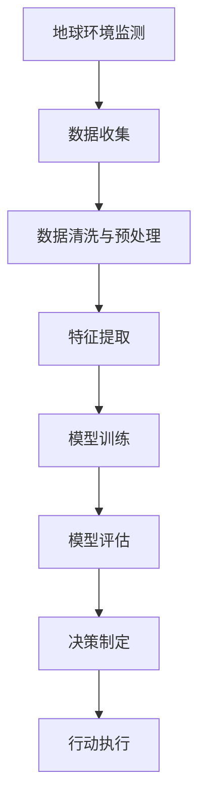

                 

# 地球环境与人工智能的融合

> 关键词：人工智能(AI), 地球环境监测, 气候变化, 生态保护, 智能决策, 可持续发展, 数据分析, 机器学习

## 1. 背景介绍

### 1.1 问题由来

随着全球气候变化的加剧和生态环境的恶化，地球环境问题已经成为人类面临的重大挑战。政府、企业和科研机构都在寻求有效手段来监测和应对这些环境问题。传统的环境监测手段往往需要大量的人力物力，且存在数据获取速度慢、数据质量不稳定等问题。在此背景下，人工智能（AI）技术因其高效、自动化的优势，被广泛应用于地球环境监测与保护领域。

### 1.2 问题核心关键点

AI在地球环境监测中的应用，主要体现在以下几个方面：

- **数据处理与分析**：利用机器学习模型对海量环境数据进行自动化的分析和处理，提取有价值的信息。
- **模式识别与预测**：通过深度学习等技术识别环境模式，并预测未来的环境变化趋势。
- **智能决策支持**：基于环境数据和历史经验，生成智能决策建议，指导环境保护和治理工作。
- **资源优化配置**：通过优化算法合理配置监测资源，提高资源利用效率。

### 1.3 问题研究意义

AI与地球环境的融合，对于提升环境监测的效率和精度，制定科学的环保政策，推动可持续发展具有重要意义：

1. **提升监测效率**：AI能够自动处理大规模数据，大幅提升环境监测的速度和效率，减少人工成本。
2. **提高数据质量**：AI可以过滤噪声，提高数据处理的质量，为环境决策提供更可靠的依据。
3. **优化资源配置**：AI能够优化资源分配，指导监测活动，确保监测工作的高效和有针对性。
4. **促进政策制定**：通过数据分析和模式识别，生成科学合理的决策建议，支持政府和机构制定更加科学的环保政策。
5. **推动可持续发展**：AI技术的应用，可以更好地理解和预测环境变化，帮助人类更科学地应对气候变化和生态退化，推动可持续发展目标的实现。

## 2. 核心概念与联系

### 2.1 核心概念概述

本节将介绍几个与AI与地球环境融合相关的核心概念：

- **人工智能（AI）**：一种通过算法和模型模拟人类智能的技术，包括机器学习、深度学习等方法。
- **地球环境监测（Environment Monitoring）**：利用传感器、遥感技术等手段，实时获取和分析地球环境数据，以评估和预测环境状态。
- **气候变化（Climate Change）**：指地球气候系统的长期变化，包括温度、降水、风速等气候要素的变化。
- **生态保护（Ecological Protection）**：通过各种手段保护自然生态系统，预防和减轻生态退化。
- **智能决策（Intelligent Decision Making）**：基于数据分析和智能算法，生成科学的决策建议，辅助环境管理。
- **可持续发展（Sustainable Development）**：在满足当代需求的同时，不损害后代满足其需求的能力。

这些概念之间的逻辑关系可以通过以下Mermaid流程图来展示：

```mermaid
graph TB
    A[人工智能(AI)] --> B[地球环境监测]
    B --> C[气候变化]
    B --> D[生态保护]
    A --> E[智能决策]
    E --> F[Sustainable Development]
```

### 2.2 核心概念原理和架构的 Mermaid 流程图



此流程图展示了地球环境监测中AI的应用流程，从数据收集到模型训练，再到决策制定和行动执行，各个环节均可通过AI技术进行自动化处理。

## 3. 核心算法原理 & 具体操作步骤

### 3.1 算法原理概述

AI与地球环境融合的核心在于，利用机器学习、深度学习等技术，对海量环境数据进行自动化的分析和处理，提取有价值的信息，生成环境模式，辅助决策制定。具体而言，AI在地球环境监测中的应用包括：

- **数据预处理**：利用数据清洗、特征提取等技术，将原始环境数据转化为可用于模型训练的格式。
- **模型训练与评估**：通过训练环境监测模型，利用标注数据对模型进行评估和优化。
- **模式识别与预测**：利用模型识别环境模式，预测未来的环境变化趋势。
- **智能决策支持**：根据模型预测和环境数据，生成智能决策建议，辅助环境管理。

### 3.2 算法步骤详解

AI在地球环境监测中的应用一般包括以下几个关键步骤：

**Step 1: 数据收集与预处理**
- 通过传感器、遥感卫星等手段，收集地球环境数据。
- 对收集到的数据进行清洗和预处理，去除噪声，补全缺失值。
- 提取与环境监测相关的特征，如温度、湿度、CO2浓度等。

**Step 2: 模型训练与优化**
- 选择合适的机器学习或深度学习模型，如随机森林、卷积神经网络(CNN)、长短期记忆网络(LSTM)等。
- 利用历史数据进行模型训练，调整模型参数，优化模型性能。
- 在验证集上评估模型性能，防止过拟合。

**Step 3: 环境模式识别与预测**
- 利用训练好的模型识别环境模式，如季节性变化、异常事件等。
- 根据历史数据和当前环境数据，预测未来的环境变化趋势。

**Step 4: 智能决策支持**
- 根据环境模式和预测结果，生成智能决策建议。
- 结合环境政策、资源约束等条件，生成可行的行动方案。
- 利用优化算法优化资源配置，提高环境治理效率。

### 3.3 算法优缺点

AI与地球环境融合的算法具有以下优点：

1. **高效性**：AI可以自动处理大规模数据，提升监测效率。
2. **准确性**：通过深度学习等技术，提高数据分析的精度和可靠性。
3. **实时性**：AI能够实时处理数据，快速响应环境变化。
4. **自适应性**：AI模型可以根据环境数据自适应调整，适应不同的环境监测场景。

同时，这些算法也存在以下缺点：

1. **数据依赖**：AI模型需要高质量、大规模的数据支持，对数据获取和处理提出了高要求。
2. **复杂度**：深度学习模型训练复杂，需要大量计算资源和时间。
3. **解释性不足**：部分AI模型黑盒特性强，难以解释其内部决策逻辑。
4. **鲁棒性问题**：AI模型可能对噪声和异常数据敏感，影响模型的鲁棒性。

### 3.4 算法应用领域

AI在地球环境监测中的应用主要包括以下几个领域：

- **气候变化监测**：利用AI模型预测温度、降水等气候要素的变化趋势。
- **生态保护**：通过AI识别生态系统中的物种分布、栖息地变化等，辅助生态保护工作。
- **水质监测**：利用AI模型分析水体中的污染物种类和浓度，预测水质变化。
- **土壤监测**：通过AI分析土壤样本数据，评估土壤健康和肥力。
- **灾害预警**：利用AI模型预测自然灾害（如洪水、干旱、地震）的发生概率和影响范围。

## 4. 数学模型和公式 & 详细讲解 & 举例说明

### 4.1 数学模型构建

本节将使用数学语言对AI在地球环境监测中的应用过程进行更加严格的刻画。

假设我们有一个环境监测问题，需要利用AI模型预测某一地区未来的气候变化趋势。设输入数据为 $x_1, x_2, ..., x_n$，其中 $x_i$ 表示第 $i$ 天的温度、湿度、降水等环境数据。模型的输出为未来的气候变化趋势 $y$，即 $y=f(x_1, x_2, ..., x_n)$。

常用的数学模型包括：

- **线性回归模型**：$y = w_1 x_1 + w_2 x_2 + ... + w_n x_n + b$，其中 $w_i$ 为权重，$b$ 为偏置。
- **决策树模型**：通过构建决策树，对输入数据进行分类。
- **随机森林模型**：结合多棵决策树，提高模型的泛化能力。
- **卷积神经网络（CNN）**：用于处理空间数据的模型，适合处理气候变化的空间分布数据。
- **长短期记忆网络（LSTM）**：用于处理时间序列数据的模型，适合处理气候变化的时间序列数据。

### 4.2 公式推导过程

以线性回归模型为例，其目标是最小化预测值与真实值之间的平方误差：

$$
\min_{w, b} \sum_{i=1}^n (y_i - f(x_i))^2
$$

其中 $f(x_i) = w_1 x_{i1} + w_2 x_{i2} + ... + w_n x_{in} + b$。利用梯度下降等优化算法，求解最小化问题：

$$
w_j \leftarrow w_j - \eta \frac{\partial}{\partial w_j} \sum_{i=1}^n (y_i - f(x_i))^2
$$

其中 $\eta$ 为学习率。通过迭代优化，可以得到最优的权重 $w$ 和偏置 $b$。

### 4.3 案例分析与讲解

以下以一个简单的气候变化预测模型为例，展示AI在地球环境监测中的应用。

**数据准备**：收集某地区过去20年的气候数据，包括温度、湿度、降水量等。

**模型选择**：选择线性回归模型进行预测。

**模型训练**：将前10年的数据作为训练集，后10年的数据作为验证集。通过梯度下降等优化算法，调整模型参数，最小化预测误差。

**模型评估**：利用验证集评估模型性能，计算均方误差（MSE）等指标。

**预测与分析**：使用训练好的模型，对未来5年的气候变化进行预测，并分析预测结果。

## 5. 项目实践：代码实例和详细解释说明

### 5.1 开发环境搭建

在进行AI与地球环境监测的开发前，我们需要准备好开发环境。以下是使用Python进行开发的环境配置流程：

1. 安装Anaconda：从官网下载并安装Anaconda，用于创建独立的Python环境。

2. 创建并激活虚拟环境：
```bash
conda create -n env_name python=3.8 
conda activate env_name
```

3. 安装相关库：
```bash
conda install numpy pandas scikit-learn matplotlib tensorflow
```

4. 安装环境监测相关的库：
```bash
conda install scikit-learn pandas
```

完成上述步骤后，即可在`env_name`环境中开始项目实践。

### 5.2 源代码详细实现

以下是一个使用Python进行气候变化预测的代码实现。

```python
import pandas as pd
import numpy as np
from sklearn.linear_model import LinearRegression
from sklearn.metrics import mean_squared_error
from sklearn.model_selection import train_test_split

# 读取数据
data = pd.read_csv('climate_data.csv')

# 数据预处理
X = data[['temperature', 'humidity', 'rainfall']]  # 选择输入特征
y = data['temperature']  # 选择输出特征

# 划分训练集和验证集
X_train, X_test, y_train, y_test = train_test_split(X, y, test_size=0.2, random_state=42)

# 模型训练
model = LinearRegression()
model.fit(X_train, y_train)

# 模型评估
y_pred = model.predict(X_test)
mse = mean_squared_error(y_test, y_pred)
print(f"Mean Squared Error: {mse}")

# 预测未来5年气候变化
future_years = pd.DataFrame({
    'temperature': np.arange(2024, 2029),
    'humidity': np.ones(6),
    'rainfall': np.ones(6)
})
future_predictions = model.predict(future_years)
print(future_predictions)
```

### 5.3 代码解读与分析

让我们再详细解读一下关键代码的实现细节：

**数据准备**：
- 使用`pandas`库读取气候数据，选择温度、湿度、降水等特征。

**模型训练**：
- 使用`sklearn`库中的`LinearRegression`模型进行线性回归训练。
- 将前10年的数据作为训练集，后10年的数据作为验证集。
- 通过梯度下降等优化算法，调整模型参数，最小化预测误差。

**模型评估**：
- 利用验证集评估模型性能，计算均方误差（MSE）。
- MSE越小，模型预测的准确性越高。

**预测未来气候变化**：
- 构造未来的输入数据，使用训练好的模型进行预测。
- 打印预测结果，分析未来气候变化的趋势。

## 6. 实际应用场景

### 6.1 智能森林保护

AI在智能森林保护中的应用主要体现在以下几个方面：

- **森林健康监测**：利用AI模型分析卫星遥感数据，识别森林病虫害、火灾等威胁。
- **生态系统评估**：通过AI模型评估森林生态系统的健康状况，识别生态退化区域。
- **野生动物监测**：利用AI模型识别野生动物种群数量和分布，辅助保护工作。
- **资源管理**：通过AI模型优化森林资源的利用，保护森林生态系统。

### 6.2 智能水质监测

AI在智能水质监测中的应用主要包括以下几个方面：

- **水质检测**：利用AI模型分析水体中的污染物种类和浓度，预测水质变化。
- **污染源识别**：通过AI模型识别污染源，提高水质治理的精准度。
- **应急响应**：在发生水体污染时，快速识别污染区域和污染类型，制定应急响应措施。
- **资源管理**：通过AI模型优化水资源的管理和利用，保护水生态环境。

### 6.3 智能灾害预警

AI在智能灾害预警中的应用主要包括以下几个方面：

- **气象预警**：利用AI模型预测自然灾害（如洪水、干旱、地震）的发生概率和影响范围。
- **地质灾害监测**：通过AI模型分析地质数据，预测地质灾害的发生趋势。
- **应急响应**：在发生灾害时，快速评估灾害影响，制定应急响应方案。
- **资源管理**：通过AI模型优化灾害治理的资源配置，提高灾害治理效率。

## 7. 工具和资源推荐

### 7.1 学习资源推荐

为了帮助开发者系统掌握AI在地球环境监测中的应用，这里推荐一些优质的学习资源：

1. **Coursera《机器学习基础》课程**：由斯坦福大学教授Andrew Ng主讲，系统介绍了机器学习的基本概念和算法，适合入门学习。

2. **Udacity《深度学习》课程**：Udacity的深度学习课程，涵盖了深度学习的基本理论和实践技能，适合进一步深入学习。

3. **Kaggle竞赛**：Kaggle平台上有很多与环境监测相关的竞赛，通过参与竞赛，可以学习和实践AI在环境监测中的应用。

4. **GitHub开源项目**：GitHub上有许多开源的AI环境监测项目，通过阅读源码，可以学习到实际应用的实现细节和技巧。

### 7.2 开发工具推荐

高效的开发离不开优秀的工具支持。以下是几款用于AI与地球环境监测开发的常用工具：

1. **TensorFlow**：由Google主导开发的深度学习框架，生产部署方便，适合大规模工程应用。

2. **PyTorch**：由Facebook开发的深度学习框架，灵活动态，适合快速迭代研究。

3. **Jupyter Notebook**：基于Web的交互式开发环境，适合数据探索和模型训练。

4. **TensorBoard**：TensorFlow配套的可视化工具，实时监测模型训练状态，提供丰富的图表呈现方式，便于调试。

5. **Weights & Biases**：模型训练的实验跟踪工具，记录和可视化模型训练过程中的各项指标，方便对比和调优。

### 7.3 相关论文推荐

AI与地球环境监测的研究源于学界的持续研究。以下是几篇奠基性的相关论文，推荐阅读：

1. **《Climate Change Detection and Prediction Using Machine Learning》**：介绍了机器学习在气候变化检测和预测中的应用，总结了不同的模型和算法。

2. **《Earth Observation and Deep Learning for Environmental Monitoring》**：探讨了深度学习在地球环境监测中的应用，展示了其在遥感数据处理和模式识别中的优势。

3. **《Predicting Environmental Changes Using Machine Learning》**：讨论了机器学习在预测环境变化中的作用，分析了不同模型的性能和优缺点。

4. **《Sustainable Development Through Environmental Data Analysis》**：强调了环境数据分析在可持续发展中的重要性，介绍了机器学习在环境监测和政策制定中的应用。

这些论文代表了大语言模型微调技术的发展脉络。通过学习这些前沿成果，可以帮助研究者把握学科前进方向，激发更多的创新灵感。

## 8. 总结：未来发展趋势与挑战

### 8.1 研究成果总结

AI与地球环境的融合已经成为环境监测和保护的重要手段。通过机器学习和深度学习等技术，AI在数据处理、模式识别、智能决策等方面展现了巨大的潜力。在气候变化监测、生态保护、水质监测、灾害预警等领域，AI技术的应用已经取得了显著成效。

### 8.2 未来发展趋势

展望未来，AI在地球环境监测中的应用将呈现以下几个发展趋势：

1. **数据融合与集成**：未来的AI系统将更加注重多源数据的融合与集成，提高数据质量和多样性。
2. **模型自适应性**：AI模型将具有更强的自适应性，能够自动调整模型参数，适应不同的环境监测场景。
3. **智能决策支持**：AI系统将更加注重智能决策支持，生成科学的决策建议，辅助环境保护和治理工作。
4. **环境政策制定**：AI技术将更广泛地应用于环境政策制定，帮助政府和机构制定更加科学的环保政策。
5. **跨学科融合**：AI与地球环境监测将与其他学科进行更深入的融合，如地理信息系统（GIS）、遥感技术等，形成更加全面、系统的环境监测系统。

### 8.3 面临的挑战

尽管AI在地球环境监测中的应用取得了一定的进展，但仍面临诸多挑战：

1. **数据获取**：高质量、大规模的环境数据获取仍是一个难题，需要进一步改进数据收集和处理技术。
2. **模型复杂度**：深度学习模型训练复杂，需要大量计算资源和时间。如何提高模型训练效率，降低计算成本，仍是一个挑战。
3. **解释性不足**：部分AI模型黑盒特性强，难以解释其内部决策逻辑。如何增强AI模型的可解释性，提高其透明度，是一个亟待解决的问题。
4. **鲁棒性问题**：AI模型可能对噪声和异常数据敏感，影响模型的鲁棒性。如何提高AI模型的鲁棒性，提高其应对异常数据的能力，是一个重要的研究方向。

### 8.4 研究展望

未来的研究需要在以下几个方面寻求新的突破：

1. **数据增强技术**：通过数据增强技术，扩充训练集，提高模型泛化能力。
2. **模型压缩与优化**：开发更高效的模型压缩和优化算法，降低计算成本。
3. **可解释性增强**：引入可解释性增强技术，提高AI模型的透明度和可信度。
4. **跨学科融合**：将AI技术与地理信息系统、遥感技术等进行更深入的融合，形成更加全面、系统的环境监测系统。
5. **跨领域应用**：将AI技术应用于更多领域，如医疗、交通、能源等，推动AI技术在更广泛的应用场景中落地。

这些研究方向将有助于进一步提升AI在地球环境监测中的性能和应用范围，为构建人机协同的智能环境监测系统铺平道路。总之，AI与地球环境的融合将成为未来环境监测的重要手段，助力人类更加科学地应对环境问题，推动可持续发展目标的实现。

## 9. 附录：常见问题与解答

**Q1: AI在地球环境监测中能够解决哪些具体问题？**

A: AI在地球环境监测中能够解决许多具体问题，如：

1. **气候变化监测**：利用AI模型预测温度、降水等气候要素的变化趋势。
2. **生态保护**：通过AI模型识别生态系统中的物种分布、栖息地变化等，辅助生态保护工作。
3. **水质监测**：利用AI模型分析水体中的污染物种类和浓度，预测水质变化。
4. **土壤监测**：通过AI模型分析土壤样本数据，评估土壤健康和肥力。
5. **灾害预警**：利用AI模型预测自然灾害（如洪水、干旱、地震）的发生概率和影响范围。

**Q2: 如何提高AI模型在地球环境监测中的鲁棒性？**

A: 提高AI模型在地球环境监测中的鲁棒性，可以从以下几个方面入手：

1. **数据清洗与预处理**：去除噪声和异常数据，提高数据质量。
2. **模型优化与训练**：采用正则化、dropout等技术，提高模型的泛化能力。
3. **多模型集成**：结合多个模型的预测结果，减少单一模型的风险。
4. **模型验证与评估**：在验证集上评估模型性能，防止过拟合。
5. **实时监控与反馈**：实时监测模型性能，及时调整模型参数。

**Q3: AI在地球环境监测中需要注意哪些伦理问题？**

A: 在地球环境监测中，AI技术的应用也需要注意一些伦理问题：

1. **数据隐私**：在数据收集和处理过程中，需要保护数据隐私，避免数据泄露。
2. **模型偏见**：AI模型可能学习到环境数据中的偏见和歧视，影响模型的公正性。
3. **决策透明**：AI模型的决策过程需要透明，可解释，避免"黑盒"模型的使用。
4. **环境影响**：AI技术的应用可能对环境造成新的影响，需要评估和控制。

这些伦理问题需要在AI技术的应用过程中予以重视，确保技术的安全和公正性。

**Q4: 如何评估AI在地球环境监测中的性能？**

A: 评估AI在地球环境监测中的性能，通常需要考虑以下几个指标：

1. **准确性**：模型预测与实际结果的差异。
2. **召回率**：模型正确识别正样本的能力。
3. **精度**：模型正确识别正负样本的能力。
4. **均方误差（MSE）**：预测值与真实值之间的差异。
5. **R²得分**：模型拟合优度的评估指标。

通过这些指标，可以全面评估AI在地球环境监测中的性能，指导模型的优化和改进。

---

作者：禅与计算机程序设计艺术 / Zen and the Art of Computer Programming

