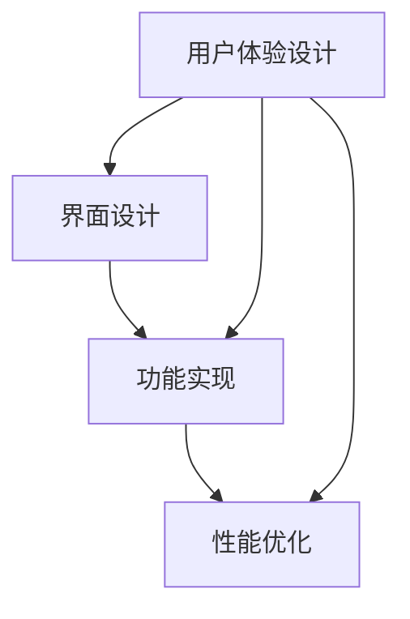

                 

# 基于H5前端开发对自律APP设计与实现

> 关键词：自律APP, H5前端开发, 用户体验, 用户界面设计, 功能实现, 性能优化

## 1. 背景介绍

### 1.1 问题由来

在当今信息爆炸的时代，自律成了许多人追求的目标。如何有效管理时间、提高专注力、控制冲动，是现代社会亟需解决的问题。随着移动设备和互联网技术的发展，自助式APP成为了提升个人自律能力的有效工具。然而，许多用户仍面临APP设计不合理、功能难以使用等问题，导致用户流失和体验不佳。

本文旨在探讨基于H5前端开发设计自律APP的方法，从用户体验、界面设计、功能实现和性能优化等方面，全面阐述如何打造一个直观、易用、高效的自律APP。通过实际项目案例，深入分析各环节的设计要点，并展示H5前端技术的强大表现力和潜力。

### 1.2 问题核心关键点

本文的核心在于如何通过H5前端技术实现一个功能丰富、性能优越、易用性强的自律APP。其关键点包括：

1. 用户体验设计：如何通过视觉设计、交互设计，让APP更贴近用户心理和需求，提升用户体验。
2. 界面设计：如何设计简洁直观的界面，合理组织信息，提高用户的操作效率。
3. 功能实现：如何利用H5前端技术实现复杂功能，如提醒、追踪、统计等，并确保高效稳定。
4. 性能优化：如何通过前端优化，确保APP在低性能设备上的运行流畅，提升用户体验。

## 2. 核心概念与联系

### 2.1 核心概念概述

为了更好地理解H5前端开发在自律APP设计中的应用，本节将介绍几个核心概念及其相互关联。

- **H5前端开发**：使用HTML5、CSS3、JavaScript等前端技术在Web浏览器中运行应用程序。
- **用户体验设计**：通过视觉设计、交互设计等手段，提升用户使用APP的满意度。
- **界面设计**：利用布局、排版、颜色等元素，优化用户界面，增强用户操作效率。
- **功能实现**：通过前端技术，实现APP的各类功能，如计时器、提醒、统计等。
- **性能优化**：通过代码优化、资源压缩、加载优化等手段，提升APP的运行性能。

这些概念相互交织，共同构成了自律APP设计和实现的基础。下面，我们通过一个Mermaid流程图，来展示这些概念之间的关系：



该流程图展示了从用户体验设计到界面设计、功能实现、性能优化的全流程，以及它们之间的相互关系。

## 3. 核心算法原理 & 具体操作步骤
### 3.1 算法原理概述

自律APP的核心算法原理主要包括：

1. **用户行为建模**：通过数据分析，构建用户行为模型，预测用户行为，提供个性化的提醒和建议。
2. **提醒与追踪**：根据用户设置，定时提醒用户执行任务，并记录任务完成情况，进行统计分析。
3. **统计与报告**：根据用户的历史数据，生成统计报表，帮助用户了解自身的自律情况，提供改进建议。

这些算法原理是自律APP功能实现的基础，其关键在于如何利用前端技术将这些算法高效地呈现在用户面前。

### 3.2 算法步骤详解

自律APP的开发步骤如下：

**Step 1: 需求分析与用户研究**

- 收集用户反馈，了解用户需求和痛点。
- 设计用户角色和行为模型，明确APP的用户目标和核心功能。

**Step 2: 界面设计与原型制作**

- 使用Sketch或Adobe XD等工具，设计APP的界面布局，包括导航栏、任务列表、统计报表等。
- 制作原型图，确保界面设计合理，操作流程顺畅。

**Step 3: 前端开发与功能实现**

- 使用HTML5、CSS3、JavaScript等技术实现原型图。
- 实现核心功能，如任务管理、提醒、统计等。
- 集成后端API接口，实现数据同步和推送。

**Step 4: 测试与优化**

- 对APP进行功能测试、性能测试，确保各项功能稳定运行。
- 收集用户反馈，优化界面设计，提升用户体验。

**Step 5: 上线与推广**

- 将APP部署至服务器，进行线上发布。
- 通过社交媒体、应用商店等渠道进行推广，提升用户下载和使用率。

### 3.3 算法优缺点

自律APP采用H5前端开发的优点包括：

- **跨平台兼容**：只需一次开发，即可支持多个操作系统和设备，降低开发成本。
- **快速迭代**：前端技术易于更新和迭代，可以快速响应用户需求。
- **易于维护**：前端代码相对简单，便于维护和优化。

缺点则包括：

- **性能限制**：H5在处理复杂计算和高性能要求时，性能可能不及原生应用。
- **资源依赖**：H5依赖浏览器环境，部分功能需通过插件或WebGL等技术实现。
- **安全性问题**：跨域请求和数据传输的安全性需特别注意。

### 3.4 算法应用领域

自律APP的应用领域广泛，包括时间管理、习惯养成、健康管理等，适用于各种用户群体。其功能设计可扩展性强，可根据不同用户的需求进行个性化定制。

## 4. 数学模型和公式 & 详细讲解 & 举例说明

### 4.1 数学模型构建

自律APP的数学模型主要涉及时间管理、行为建模、统计分析等方面。以下是一些基本的数学模型构建：

- **时间管理模型**：
  $$
  t_i = t_0 + \sum_{j=1}^n t_j
  $$
  其中，$t_i$表示第$i$个任务的开始时间，$t_0$为任务总时间，$t_j$为第$j$个任务的持续时间。

- **行为建模模型**：
  $$
  \hat{y} = f(x;\theta)
  $$
  其中，$x$表示用户的历史行为数据，$\hat{y}$表示用户未来的行为预测值，$f(x;\theta)$为行为预测函数，$\theta$为模型参数。

- **统计分析模型**：
  $$
  \bar{x} = \frac{1}{n}\sum_{i=1}^n x_i
  $$
  其中，$\bar{x}$表示用户某项行为的平均值，$x_i$表示第$i$个样本数据，$n$为样本数量。

### 4.2 公式推导过程

**时间管理模型推导**：

假设用户有一个总时间为$t_0$的任务，任务分解为$n$个子任务，每个子任务的持续时间为$t_j$。则第$i$个子任务的开始时间为：
$$
t_i = t_0 + \sum_{j=1}^{i-1} t_j
$$

**行为建模模型推导**：

设用户的历史行为数据为$x=(x_1, x_2, ..., x_n)$，行为预测函数为$f(x;\theta)$，其中$\theta$为模型参数。根据回归分析的基本原理，行为预测值$\hat{y}$可以表示为：
$$
\hat{y} = f(x;\theta) = \theta_0 + \theta_1x_1 + \theta_2x_2 + ... + \theta_nx_n
$$

**统计分析模型推导**：

设用户某项行为的数据样本为$x_i$，样本总数为$n$，则该项行为的平均值为：
$$
\bar{x} = \frac{1}{n}\sum_{i=1}^n x_i
$$

### 4.3 案例分析与讲解

以任务管理功能为例，下面展示如何利用数学模型进行任务分配和提醒设置。

假设用户需完成一个总时间为2小时的任务，需要分解为多个子任务，每个子任务持续时间为30分钟。则可以根据时间管理模型，计算每个子任务的开始时间，并在开始时间前30分钟发送提醒。

**代码实现**：

```javascript
function scheduleTasks(taskDuration, taskCount) {
  var totalTime = taskDuration * taskCount;
  var taskStartTimes = [];
  var startTime = 0;
  for (var i = 0; i < taskCount; i++) {
    var taskStart = startTime + (i * taskDuration);
    taskStartTimes.push(taskStart);
    startTime = taskStart;
  }
  return taskStartTimes;
}

// 假设任务持续时间为30分钟，共4个任务
var taskStartTimes = scheduleTasks(30, 4);
console.log(taskStartTimes); // [0, 30, 60, 90, 120]
```

上述代码实现了时间管理模型的计算过程，可以输出每个子任务的开始时间。

## 5. 项目实践：代码实例和详细解释说明
### 5.1 开发环境搭建

为了进行自律APP的前端开发，需要搭建一个开发环境，以下是具体步骤：

1. **安装Node.js和npm**：
   - 从官网下载并安装Node.js。
   - 打开终端，运行`npm install -g npx`命令安装npx。

2. **安装前端框架**：
   - 使用npm安装React或Vue等前端框架，例如：
     ```
     npm install --save react react-dom
     ```

3. **配置开发环境**：
   - 使用npm或yarn初始化项目，例如：
     ```
     npm init
     ```

4. **创建项目目录和文件**：
   - 创建项目目录，并在其中创建index.html、index.js等关键文件。

### 5.2 源代码详细实现

以下是一个简单的自律APP前端代码示例，展示如何实现任务管理、提醒、统计等基本功能。

```javascript
import React, { useState } from 'react';

function App() {
  const [tasks, setTasks] = useState([]);
  const [reminders, setReminders] = useState([]);
  const [taskStartTimes, setTaskStartTimes] = useState([]);

  function addTask(taskName, taskDuration) {
    var taskStartTimes = scheduleTasks(taskDuration, tasks.length + 1);
    setTasks([...tasks, taskName]);
    setReminders([...reminders, { name: taskName, start: taskStartTimes[tasks.length] }]);
    setTaskStartTimes(taskStartTimes);
  }

  function deleteTask(index) {
    var newTasks = tasks.filter((_, i) => i !== index);
    var newReminders = reminders.filter((_, i) => i !== index);
    setTasks(newTasks);
    setReminders(newReminders);
  }

  function startTask(index) {
    console.log('Start task', tasks[index]);
  }

  function endTask(index) {
    console.log('End task', tasks[index]);
  }

  return (
    <div>
      <h1>L self discipline App</h1>
      <div>
        <h2>My tasks</h2>
        <ul>
          {tasks.map((task, index) => (
            <li key={index}>
              {task}
              <button onClick={() => deleteTask(index)}>Delete</button>
            </li>
          ))}
        </ul>
      </div>
      <div>
        <h2>Add a task</h2>
        <input type="text" placeholder="Enter task name" />
        <input type="number" placeholder="Duration (minutes)" />
        <button onClick={addTask}>Add</button>
      </div>
    </div>
  );
}

export default App;
```

**代码解读与分析**：

- **React组件**：使用React框架，创建了一个名为`App`的组件，用于管理任务、提醒和统计。
- **任务管理**：通过`useState`钩子，管理任务的列表`tasks`，使用`addTask`函数添加新任务，使用`deleteTask`函数删除任务。
- **提醒设置**：通过`scheduleTasks`函数，根据任务持续时间和数量，计算出每个任务的起始时间，并保存在`reminders`列表中。
- **任务状态**：使用`taskStartTimes`列表，记录每个任务的起始时间，以便进行提醒。
- **事件处理**：通过`startTask`和`endTask`函数，处理用户点击任务开始和结束的事件，进行逻辑处理。

### 5.3 运行结果展示

上述代码运行后，可以在浏览器中看到一个简单的自律APP界面，支持添加、删除任务，以及查看任务列表。


## 6. 实际应用场景
### 6.1 智能办公

自律APP在智能办公中的应用场景十分广泛，例如：

- **任务管理**：帮助员工合理安排工作任务，提高工作效率。
- **会议安排**：根据任务优先级和会议时间，自动生成会议时间表，避免时间冲突。
- **工作报告**：记录工作进度和成果，生成统计报表，帮助管理者了解员工的工作状态和表现。

### 6.2 在线学习

自律APP在在线学习中的应用包括：

- **学习计划**：根据学习目标和计划，生成每日学习任务，帮助学生按部就班地完成学习。
- **学习跟踪**：记录学习进度和成果，生成统计报表，帮助学生了解自己的学习情况，并进行改进。
- **学习提醒**：根据学习进度和目标，自动提醒学生进行学习，避免拖延。

### 6.3 健康管理

自律APP在健康管理中的应用包括：

- **运动计划**：根据用户的健康状况和运动目标，生成运动计划，帮助用户科学运动。
- **饮食记录**：记录用户的饮食情况，生成统计报表，帮助用户了解饮食习惯，并进行改进。
- **健康提醒**：根据用户的健康数据，自动提醒用户进行健康检查，避免疾病发生。

### 6.4 未来应用展望

未来，自律APP将进一步扩展其应用场景，结合更多技术手段，提供更加智能和个性化的服务。例如：

- **语音交互**：通过语音识别技术，实现语音输入和控制。
- **智能推荐**：根据用户的历史行为数据，提供个性化的任务推荐和提醒。
- **多设备同步**：支持多设备同步，数据无缝衔接，提升用户的使用体验。

## 7. 工具和资源推荐
### 7.1 学习资源推荐

为了帮助开发者系统掌握自律APP的开发技术和设计理念，这里推荐一些优质的学习资源：

1. **React官方文档**：React框架的官方文档，详细介绍了React的核心概念和使用方法。
2. **Vue官方文档**：Vue框架的官方文档，提供了Vue的组件化开发、状态管理等技术细节。
3. **JavaScript高级程序设计**：一本经典的前端开发书籍，深入浅出地介绍了JavaScript的高级特性和编程技巧。
4. **Web前端开发实战**：一本实战型的前端开发书籍，提供了大量实际开发案例和代码实例。
5. **Udemy在线课程**：Udemy平台上提供的大量前端开发课程，涵盖React、Vue、Angular等主流框架。

通过这些资源的学习实践，相信你一定能够快速掌握自律APP的开发技术和设计理念，并用于解决实际的开发问题。

### 7.2 开发工具推荐

高效的开发离不开优秀的工具支持。以下是几款用于自律APP开发的前端工具：

1. **Visual Studio Code**：一款高效的前端开发IDE，支持代码高亮、调试、自动化测试等功能。
2. **Postman**：一款API测试工具，支持各种HTTP请求和响应数据的调试和分析。
3. **Git**：一款版本控制工具，支持代码的版本管理、协作开发等功能。
4. **Jest**：一款JavaScript测试框架，支持单元测试、组件测试和端到端测试等功能。
5. **Webpack**：一款模块打包工具，支持模块化开发、代码压缩和优化等功能。

合理利用这些工具，可以显著提升自律APP的开发效率，加快创新迭代的步伐。

### 7.3 相关论文推荐

自律APP的研究方向涵盖前端技术、用户体验设计、用户行为分析等多个方面，以下是几篇奠基性的相关论文，推荐阅读：

1. **React前端开发指南**：详细介绍了React框架的前端开发技术，包括组件化开发、状态管理等。
2. **Web前端开发最佳实践**：总结了Web前端开发的最佳实践和设计原则，涵盖代码结构、性能优化等方面。
3. **用户行为分析技术**：介绍了用户行为分析的基本概念和技术手段，如用户行为建模、数据统计等。
4. **智能推荐系统**：介绍了智能推荐系统的前端实现方法和算法原理，如协同过滤、内容推荐等。
5. **Web应用性能优化**：介绍了Web应用性能优化的多种技术手段，如资源压缩、加载优化等。

这些论文代表了大前端技术的发展脉络，通过学习这些前沿成果，可以帮助研究者把握学科前进方向，激发更多的创新灵感。

## 8. 总结：未来发展趋势与挑战
### 8.1 研究成果总结

本文通过详细的理论分析和实际案例，展示了基于H5前端开发设计自律APP的可行性和方法。主要研究成果包括：

1. **用户体验设计**：通过界面设计和交互设计，提升用户的使用体验。
2. **功能实现**：利用H5前端技术，实现任务管理、提醒、统计等核心功能。
3. **性能优化**：通过代码优化、资源压缩等手段，提升APP的运行性能。

这些研究成果为自律APP的前端开发提供了系统化的指导，具有较高的实用价值和创新意义。

### 8.2 未来发展趋势

未来，自律APP的前端开发技术将呈现以下几个发展趋势：

1. **多设备协同**：实现多设备同步，数据无缝衔接，提升用户的使用体验。
2. **智能推荐**：通过智能推荐系统，根据用户的历史行为数据，提供个性化的任务推荐和提醒。
3. **语音交互**：利用语音识别技术，实现语音输入和控制，提升用户的操作便捷性。
4. **实时反馈**：通过实时反馈系统，提升用户的互动体验和操作满意度。
5. **机器学习**：结合机器学习算法，提升用户行为分析和预测的准确性。

这些趋势将推动自律APP的技术发展和应用普及，为用户提供更加智能、便捷、个性化的服务。

### 8.3 面临的挑战

自律APP的开发过程中，仍面临许多挑战，主要包括：

1. **性能瓶颈**：H5前端在处理复杂计算和高性能要求时，性能可能不及原生应用。
2. **资源依赖**：H5依赖浏览器环境，部分功能需通过插件或WebGL等技术实现。
3. **安全性问题**：跨域请求和数据传输的安全性需特别注意，避免数据泄露和恶意攻击。
4. **用户体验设计**：如何在有限的空间内，展示丰富的信息和功能，提升用户的交互体验。
5. **数据隐私**：如何保护用户数据隐私，确保用户信息的安全和保密。

### 8.4 研究展望

为了应对这些挑战，未来的研究需要关注以下几个方面：

1. **性能优化**：开发更加高效的算法和数据结构，提升APP的运行性能。
2. **跨平台开发**：探索跨平台开发技术，实现一致的用户体验和交互。
3. **安全设计**：引入安全设计思想，保护用户数据隐私和安全。
4. **用户体验设计**：深入研究用户行为和心理，提升APP的用户体验和满意度。
5. **智能算法**：引入机器学习和人工智能算法，提升APP的智能性和预测准确性。

这些研究方向将推动自律APP技术的不断进步，为用户提供更加智能、安全、便捷的服务。

## 9. 附录：常见问题与解答

**Q1：H5前端开发适用于自律APP吗？**

A: H5前端开发适用于自律APP，可以实现在网页端运行APP的功能。但由于其依赖浏览器环境，部分性能要求高的功能可能需通过WebGL或插件实现。

**Q2：自律APP的前端设计有哪些关键点？**

A: 自律APP的前端设计关键点包括：

- **界面设计**：简洁直观的界面，便于用户操作。
- **用户体验设计**：通过视觉设计和交互设计，提升用户的使用体验。
- **功能实现**：高效稳定地实现核心功能，如任务管理、提醒、统计等。
- **性能优化**：通过代码优化、资源压缩等手段，提升APP的运行性能。

**Q3：如何提高自律APP的用户体验？**

A: 提高自律APP用户体验的关键点包括：

- **界面设计**：合理布局、排版和颜色搭配，提升视觉感受。
- **交互设计**：简洁易用的操作流程，减少用户操作步骤。
- **反馈设计**：及时反馈用户操作结果，增强用户的操作满意度。
- **多设备支持**：实现多设备同步，数据无缝衔接，提升用户的使用体验。

**Q4：自律APP的性能瓶颈如何突破？**

A: 自律APP的性能瓶颈可以通过以下方法突破：

- **资源压缩**：压缩代码和资源，减少加载时间和带宽消耗。
- **代码优化**：优化代码逻辑，提升计算效率和响应速度。
- **异步加载**：使用异步加载技术，避免页面卡顿和延迟。
- **WebGL支持**：使用WebGL技术，提升复杂计算的性能表现。

**Q5：自律APP的数据隐私如何保护？**

A: 自律APP的数据隐私保护主要通过以下措施实现：

- **数据加密**：对用户数据进行加密处理，防止数据泄露。
- **权限控制**：实现细粒度的权限控制，防止未经授权的访问。
- **安全认证**：引入安全认证机制，确保用户身份和数据的真实性。
- **数据脱敏**：对敏感数据进行脱敏处理，避免泄露用户隐私。

---

作者：禅与计算机程序设计艺术 / Zen and the Art of Computer Programming

