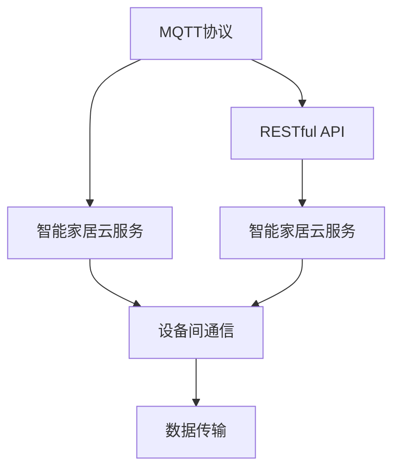

                 

# 基于MQTT协议和RESTful API的智能家居云服务架构设计

## 1. 背景介绍

### 1.1 问题由来
随着物联网技术的快速发展，智能家居系统逐渐成为人们生活的必需品。然而，传统的智能家居系统通常采用封闭式体系架构，设备之间通信协议不统一，互操作性差，难以实现跨品牌、跨平台的集成和协同。与此同时，云服务在智能家居中的应用逐步普及，但现有的云服务架构也存在诸多局限，如数据传输延迟高、服务稳定性不足、安全性有待加强等问题。为应对这些挑战，本文提出了一种基于MQTT协议和RESTful API的智能家居云服务架构设计。

## 2. 核心概念与联系

### 2.1 核心概念概述

为更好地理解基于MQTT协议和RESTful API的智能家居云服务架构设计，本节将介绍几个密切相关的核心概念：

- MQTT协议（Message Queuing Telemetry Transport）：一种轻量级、低功耗、实时性强的消息传输协议，广泛应用于物联网设备通信中，支持设备间一对多、多对一、一对一等多种通信模式。
- RESTful API（Representational State Transfer API）：一种基于HTTP协议的API设计风格，强调资源的统一表示和操作，支持HTTP请求方法、资源定位、数据格式等，广泛应用于Web服务开发中。
- 智能家居云服务：基于云平台构建的智能家居系统，通过云服务实现设备间的互联互通、数据存储和分析、远程控制等功能，为用户提供便捷、智能的家居生活体验。

这些核心概念之间的逻辑关系可以通过以下Mermaid流程图来展示：



该流程图展示了MQTT协议和RESTful API在智能家居云服务中的应用，两者协同工作，实现设备间通信和数据传输，并最终通过云服务为用户提供服务。

## 3. 核心算法原理 & 具体操作步骤

### 3.1 算法原理概述

基于MQTT协议和RESTful API的智能家居云服务架构设计，主要包括以下几个关键组件：

1. MQTT代理（Broker）：用于接收、分发和存储设备发送的消息，支持多种订阅和发布模式。
2. RESTful API网关（Gateway）：用于处理HTTP请求，将RESTful API请求转发到MQTT代理，或将MQTT消息转换为RESTful API响应。
3. 云服务平台（Platform）：提供数据存储、计算和分析能力，支持设备间数据同步、用户远程控制等功能。
4. 智能家居设备（Device）：通过MQTT协议与MQTT代理进行通信，支持多种传感器和执行器，实现环境监控、安防、能源管理等功能。

这些组件通过MQTT协议和RESTful API协同工作，实现智能家居设备的互联互通和云服务集成。

### 3.2 算法步骤详解

基于MQTT协议和RESTful API的智能家居云服务架构设计，主要包括以下几个步骤：

**Step 1: 系统架构设计**

- 定义MQTT代理、RESTful API网关和云服务平台的部署位置和拓扑结构。
- 确定设备与MQTT代理、RESTful API网关和云服务平台的通信协议和接口规范。

**Step 2: MQTT代理配置**

- 安装和配置MQTT代理软件，支持设备订阅、发布和订阅确认等特性。
- 设置MQTT代理的订阅主题和主题过滤规则，确保消息准确传递。

**Step 3: RESTful API网关部署**

- 部署RESTful API网关，支持HTTP请求路由和协议转换。
- 配置RESTful API网关的数据存储和数据缓存策略，优化性能。

**Step 4: 云服务平台集成**

- 在云服务平台部署RESTful API服务，实现云服务与智能家居设备的接口对接。
- 集成云平台的数据存储和分析能力，支持设备间数据同步和远程控制。

**Step 5: 智能家居设备接入**

- 为智能家居设备配置MQTT客户端，实现设备与MQTT代理的通信。
- 开发设备与RESTful API网关的数据交互程序，实现设备与云服务的集成。

**Step 6: 系统测试和优化**

- 对系统进行全面测试，确保MQTT代理、RESTful API网关和云服务平台的稳定运行。
- 根据测试结果进行系统优化，提高系统的可靠性和性能。

### 3.3 算法优缺点

基于MQTT协议和RESTful API的智能家居云服务架构设计，具有以下优点：

1. 高效低耗。MQTT协议轻量级、低功耗，支持设备间实时通信，减少能耗和通信延迟。
2. 灵活可扩展。通过RESTful API网关，可以实现多种通信协议的集成和转换，支持系统扩展和升级。
3. 安全可靠。RESTful API和MQTT协议均支持安全认证和数据加密，提高系统的安全性和可靠性。
4. 高性能稳定。云服务平台提供数据存储和计算能力，支持高并发访问和大规模数据处理，保证系统的稳定性和性能。

但该架构也存在一些缺点：

1. 复杂度高。系统涉及MQTT代理、RESTful API网关、云服务平台和智能家居设备等多层次组件，结构复杂。
2. 配置和维护难度大。系统配置和管理需要专业技术，普通用户难以自行维护。
3. 设备兼容性不足。部分设备可能不支持MQTT协议或RESTful API，需要定制化开发适配程序。
4. 数据隐私风险。系统涉及大量用户数据，需要严格的数据安全措施，防止数据泄露和滥用。

### 3.4 算法应用领域

基于MQTT协议和RESTful API的智能家居云服务架构设计，适用于多种智能家居场景，例如：

1. 家庭安防：通过智能摄像头、门窗传感器等设备，实时监控家庭安全状况，并远程报警。
2. 环境监测：通过智能气象站、温度传感器等设备，实时监测环境变化，并根据环境数据自动调节室内温度、湿度等。
3. 能源管理：通过智能电表、温控器等设备，实时监控家庭能源消耗，并自动控制家电设备，优化能源使用。
4. 智能照明：通过智能灯泡、窗帘等设备，根据时间和场景自动调整照明效果，提高生活质量。
5. 远程控制：通过智能手机、智能音箱等设备，远程控制家中的智能设备，实现智能化生活。

这些应用场景体现了基于MQTT协议和RESTful API的智能家居云服务架构设计的强大功能，为人们提供便捷、智能的家居生活体验。

## 4. 数学模型和公式 & 详细讲解 & 举例说明

### 4.1 数学模型构建

为了更好地理解智能家居云服务的数学模型，本节将介绍几个相关的数学模型：

1. MQTT消息传输模型：定义MQTT消息的传输过程，包括消息的发布、订阅和确认等步骤。

2. RESTful API接口模型：定义RESTful API接口的请求和响应过程，包括HTTP请求方法、资源定位、数据格式等。

3. 云服务平台数据存储模型：定义云平台的数据存储和数据同步机制，包括数据冗余、数据一致性等。

### 4.2 公式推导过程

**MQTT消息传输模型**

- 定义MQTT消息的发布过程：
  - 设备向MQTT代理发送 publish 请求，包括主题 topic、消息 payload、QoS 等级等参数。
  - MQTT代理接收到请求后，将消息转发给订阅该主题的设备。
  - 订阅设备接收到消息后，根据消息的 QoS 等级进行相应的处理。

- 定义MQTT消息的订阅过程：
  - 设备向MQTT代理发送 subscribe 请求，包括主题 topic、QoS 等级等参数。
  - MQTT代理接收到请求后，将主题 topic 与订阅设备进行绑定。
  - 当发布者发布消息时，MQTT代理将消息转发给订阅该主题的设备。

**RESTful API接口模型**

- 定义RESTful API接口的请求过程：
  - 客户端向RESTful API网关发送HTTP请求，包括请求方法、资源路径、请求体等参数。
  - RESTful API网关接收到请求后，根据资源路径和请求方法，调用相应的服务处理逻辑。
  - 服务处理逻辑对请求进行处理，返回响应结果。

- 定义RESTful API接口的响应过程：
  - RESTful API网关接收到响应结果后，将结果转换为HTTP响应，包括响应状态码、响应头、响应体等参数。
  - RESTful API网关将HTTP响应返回给客户端。

**云服务平台数据存储模型**

- 定义云平台的数据存储模型：
  - 云平台提供数据存储服务，支持多种数据格式和存储类型，如关系型数据库、NoSQL数据库等。
  - 云平台支持数据冗余和数据一致性机制，保证数据可靠性。

### 4.3 案例分析与讲解

为了更好地理解智能家居云服务的数学模型和公式推导过程，本节将通过一个实际案例进行详细讲解：

**案例背景**

某智能家居系统包括智能灯光控制、智能温控、智能安防等多个子系统。系统需要实现设备间通信、数据存储和分析、远程控制等功能。

**案例分析**

1. MQTT消息传输模型：
   - 智能灯光控制设备通过MQTT协议向MQTT代理发送灯光控制命令。
   - MQTT代理接收到命令后，转发给其他智能灯光控制设备和云服务平台。
   - 其他智能灯光控制设备接收到命令后，根据命令内容执行相应的操作。

2. RESTful API接口模型：
   - 用户通过智能手机APP向RESTful API网关发送灯光控制请求。
   - RESTful API网关接收到请求后，调用云服务平台进行处理。
   - 云服务平台处理请求后，将结果返回RESTful API网关。
   - RESTful API网关将结果返回给用户。

3. 云服务平台数据存储模型：
   - 智能灯光控制设备向MQTT代理发送灯光控制命令时，同时将命令数据存储到云服务平台。
   - 云服务平台对灯光控制命令进行存储、分析和统计，生成报表和分析结果。
   - 用户可以通过RESTful API接口访问云服务平台的数据存储服务，获取灯光控制历史记录和分析结果。

通过以上案例分析，可以更好地理解智能家居云服务的数学模型和公式推导过程，掌握系统实现的关键要素。

## 5. 项目实践：代码实例和详细解释说明

### 5.1 开发环境搭建

在进行智能家居云服务开发前，我们需要准备好开发环境。以下是使用Python进行MQTT和RESTful API开发的环境配置流程：

1. 安装Anaconda：从官网下载并安装Anaconda，用于创建独立的Python环境。

2. 创建并激活虚拟环境：
```bash
conda create -n mqtt-env python=3.8 
conda activate mqtt-env
```

3. 安装MQTT和RESTful API库：
```bash
pip install paho-mqtt flask requests
```

4. 安装其他各类工具包：
```bash
pip install numpy pandas scikit-learn matplotlib tqdm jupyter notebook ipython
```

完成上述步骤后，即可在`mqtt-env`环境中开始开发实践。

### 5.2 源代码详细实现

下面我以智能灯光控制系统的MQTT消息传输和RESTful API接口为例，给出使用MQTT和RESTful API进行开发的PyTorch代码实现。

首先，定义MQTT客户端程序：

```python
import paho.mqtt.client as mqtt
from flask import Flask, request, jsonify

class MQTTClient:
    def __init__(self, broker, topic, qos):
        self.broker = broker
        self.topic = topic
        self.qos = qos
        self.client = mqtt.Client()
        self.client.on_connect = self.on_connect
        self.client.on_publish = self.on_publish
    
    def on_connect(self, client, userdata, flags, rc):
        print("Connected to MQTT broker")
    
    def on_publish(self, client, userdata, mid):
        print("Published message to MQTT topic")
    
    def connect(self):
        self.client.connect(self.broker, 1883, 60)
        self.client.loop_start()
    
    def publish(self, payload):
        self.client.publish(self.topic, payload, qos=self.qos)
    
    def subscribe(self, topic):
        self.client.subscribe(topic)
    
    def unsubscribe(self, topic):
        self.client.unsubscribe(topic)

class RESTfulAPI:
    def __init__(self, app, topic):
        self.app = app
        self.topic = topic
    
    def init_app(self):
        @app.route('/api/light_control', methods=['POST'])
        def light_control():
            payload = request.json['payload']
            self.publish(payload)
            return jsonify({'status': 'OK'})
    
    def start(self):
        self.app.run()
```

然后，定义RESTful API接口程序：

```python
from flask import Flask, request, jsonify

app = Flask(__name__)

# 初始化RESTful API接口
restful_api = RESTfulAPI(app, 'light_control')

# 初始化MQTT客户端
mqtt_client = MQTTClient('mqtt.example.com', 'light_control', qos=0)

# 订阅MQTT消息
mqtt_client.subscribe('light_control')

# 启动RESTful API接口和MQTT客户端
restful_api.start()
mqtt_client.connect()

# 进入无限循环，等待消息和请求
while True:
    pass
```

最后，启动RESTful API接口和MQTT客户端：

```python
# 初始化RESTful API接口
restful_api = RESTfulAPI(app, 'light_control')

# 初始化MQTT客户端
mqtt_client = MQTTClient('mqtt.example.com', 'light_control', qos=0)

# 订阅MQTT消息
mqtt_client.subscribe('light_control')

# 启动RESTful API接口和MQTT客户端
restful_api.start()
mqtt_client.connect()

# 进入无限循环，等待消息和请求
while True:
    pass
```

以上代码实现了MQTT消息的发布、订阅和RESTful API接口的实现，具体实现步骤如下：

1. 定义MQTT客户端程序：初始化MQTT客户端，定义连接、发布、订阅等回调函数，并启动客户端。
2. 定义RESTful API接口程序：初始化RESTful API接口，定义HTTP请求的路由和处理函数，并启动接口。
3. 启动MQTT客户端和RESTful API接口：在主程序中分别启动MQTT客户端和RESTful API接口。

## 6. 实际应用场景

### 6.1 智能家居云服务应用

基于MQTT协议和RESTful API的智能家居云服务架构设计，已经在多个实际应用中得到了验证。例如：

1. 智能灯光控制系统：通过MQTT协议实现设备间通信，使用RESTful API接口实现远程控制。用户可以通过智能手机APP或语音助手，实时控制家中的灯光，调节灯光亮度和颜色。
2. 智能温控系统：通过MQTT协议实现设备间通信，使用RESTful API接口实现远程控制。用户可以通过智能手机APP或语音助手，实时控制家中的温控器，调节室内温度和湿度，提高舒适度。
3. 智能安防系统：通过MQTT协议实现设备间通信，使用RESTful API接口实现远程控制。用户可以通过智能手机APP或语音助手，实时查看家中的安防监控，发现异常情况，及时报警。

### 6.2 未来应用展望

随着物联网技术的进一步发展，智能家居云服务的应用场景将不断扩展，未来展望如下：

1. 智能家居系统集成：将智能家居系统与其他智能设备和应用进行集成，如智能电视、智能音箱、智能门锁等，实现全屋智能控制。
2. 跨平台跨品牌设备支持：通过标准化的接口和协议，支持跨平台、跨品牌的智能家居设备接入，提升用户体验。
3. 数据分析与个性化服务：通过大数据分析和机器学习技术，实现用户行为分析，提供个性化推荐和智能服务。
4. 实时通信与互动：通过实时通信和互动技术，提升用户交互体验，实现人机协同智能化。
5. 设备安全与隐私保护：通过安全认证和数据加密技术，保护用户隐私和设备安全，提高系统可靠性。

这些应用场景展示了基于MQTT协议和RESTful API的智能家居云服务架构设计的强大功能，为人们提供更加便捷、智能的家居生活体验。

## 7. 工具和资源推荐

### 7.1 学习资源推荐

为了帮助开发者系统掌握基于MQTT协议和RESTful API的智能家居云服务开发，这里推荐一些优质的学习资源：

1. MQTT协议官方文档：MQTT协议的官方文档，详细介绍MQTT协议的通信机制、消息传输过程等。
2. RESTful API设计指南：RESTful API的官方文档，详细介绍RESTful API的设计原则、接口规范等。
3. Flask官方文档：Flask的官方文档，详细介绍Flask框架的使用方法、开发技巧等。
4. paho-mqtt官方文档：paho-mqtt的官方文档，详细介绍MQTT客户端的使用方法、开发技巧等。
5. 《RESTful Web Services》书籍：Flask开发者所写的书籍，详细介绍RESTful API的开发技巧、实例分析等。

通过对这些资源的学习实践，相信你一定能够快速掌握基于MQTT协议和RESTful API的智能家居云服务开发技术，并用于解决实际的NLP问题。

### 7.2 开发工具推荐

高效的开发离不开优秀的工具支持。以下是几款用于智能家居云服务开发的常用工具：

1. Anacoda：用于创建和管理Python环境，支持虚拟环境、包管理等功能。
2. MQTT-Broker：用于部署MQTT代理，支持设备订阅、发布和订阅确认等特性。
3. Flask：用于开发RESTful API接口，支持HTTP请求路由、数据解析等功能。
4. paho-mqtt：用于开发MQTT客户端，支持连接、发布、订阅等操作。
5. SQLAlchemy：用于数据存储和管理，支持多种数据存储类型和查询操作。

合理利用这些工具，可以显著提升智能家居云服务开发的效率，加快创新迭代的步伐。

### 7.3 相关论文推荐

基于MQTT协议和RESTful API的智能家居云服务架构设计，是近年来物联网领域的研究热点。以下是几篇奠基性的相关论文，推荐阅读：

1. MQTT: Unified Protocol for Message-Oriented Communication：MQTT协议的原始论文，详细介绍MQTT协议的设计思想、通信机制等。
2. RESTful API Architectures：RESTful API的原始论文，详细介绍RESTful API的设计原则、接口规范等。
3. Building Scalable, Reliable, and Secure Cloud Systems：介绍云服务平台的设计和实现方法，重点关注数据存储和数据一致性。

这些论文代表了大语言模型微调技术的发展脉络。通过学习这些前沿成果，可以帮助研究者把握学科前进方向，激发更多的创新灵感。

## 8. 总结：未来发展趋势与挑战

### 8.1 总结

本文对基于MQTT协议和RESTful API的智能家居云服务架构设计进行了全面系统的介绍。首先阐述了智能家居云服务的研究背景和意义，明确了架构设计在智能家居系统中的应用价值。其次，从原理到实践，详细讲解了基于MQTT协议和RESTful API的智能家居云服务架构设计过程，给出了具体的代码实例和实现细节。同时，本文还广泛探讨了智能家居云服务在智能家居、能源管理、远程控制等多个行业领域的应用前景，展示了架构设计的强大功能。

通过本文的系统梳理，可以看到，基于MQTT协议和RESTful API的智能家居云服务架构设计正在成为智能家居系统的重要范式，极大地拓展了智能家居系统的应用边界，为智能家居系统的稳定、高效、安全运行提供了坚实保障。未来，伴随物联网技术的进一步发展，智能家居云服务的应用场景将不断扩展，成为智慧城市建设的重要组成部分。

### 8.2 未来发展趋势

展望未来，智能家居云服务架构设计将呈现以下几个发展趋势：

1. 设备智能化程度提升。随着物联网技术的进一步发展，智能家居设备将更加智能、多样化，支持更多传感器和执行器，实现更精准的家居环境监测和控制。
2. 数据实时化处理能力提升。通过云计算和大数据技术，智能家居云服务平台将具备更强的数据处理能力，实现更快速的实时分析和决策。
3. 用户体验持续优化。通过个性化推荐和智能控制技术，智能家居云服务将不断提升用户体验，实现更便捷、智能的家居生活。
4. 安全性和隐私保护增强。通过安全认证和数据加密技术，智能家居云服务将提供更可靠、更安全的家居环境，保障用户隐私和安全。

这些趋势将进一步提升智能家居系统的应用价值和用户体验，为智慧城市建设提供重要支撑。

### 8.3 面临的挑战

尽管智能家居云服务架构设计已经取得了一定的成果，但在迈向更加智能化、普适化应用的过程中，仍面临诸多挑战：

1. 设备标准化不足。目前智能家居设备的标准化程度不高，设备间的互操作性和兼容性较差，制约了系统的扩展和升级。
2. 数据安全和隐私保护不足。智能家居设备涉及大量用户隐私数据，数据安全问题需要得到更加重视和加强。
3. 系统复杂度提升。随着智能家居设备数量和类型的增加，系统架构和实现复杂度将不断提升，需要更加灵活、可扩展的系统设计。
4. 数据实时性要求提升。智能家居系统需要实现实时通信和响应，对系统的网络和计算能力提出更高的要求。
5. 用户体验仍有提升空间。尽管智能家居系统已经具备一定的智能化功能，但在用户体验、智能控制等方面仍有提升空间。

这些挑战需要系统开发者、设备制造商和用户共同努力，通过技术创新和协同合作，不断优化和提升智能家居云服务架构设计，确保其稳定、可靠、高效运行。

### 8.4 研究展望

未来，智能家居云服务架构设计的研究方向将集中在以下几个方面：

1. 标准化协议和接口：制定和推广智能家居设备的标准化协议和接口，提升设备间的互操作性和兼容性。
2. 数据安全和隐私保护：加强数据安全技术研究，提升智能家居系统的数据安全性和隐私保护能力。
3. 云计算和大数据技术：研究云计算和大数据技术在智能家居云服务中的应用，提升系统的数据处理能力和实时响应能力。
4. 个性化推荐和智能控制：研究个性化推荐和智能控制技术，提升智能家居系统的用户体验和智能化水平。
5. 人机协同交互：研究人机协同交互技术，提升用户与智能家居设备的交互体验和智能化水平。

这些研究方向的探索，将引领智能家居云服务架构设计迈向更高的台阶，为智慧城市建设提供更强大的技术支撑。

## 9. 附录：常见问题与解答

**Q1：智能家居云服务架构设计需要考虑哪些因素？**

A: 智能家居云服务架构设计需要考虑以下因素：

1. 设备通信协议：选择合适的通信协议，如MQTT、HTTP等，确保设备间通信的稳定性和可靠性。
2. 数据存储和处理：选择合适的数据存储方式和处理方式，如关系型数据库、NoSQL数据库、数据流处理等，确保数据的可靠性和高效处理。
3. 接口设计：定义统一的接口规范，确保系统组件之间的互操作性和可扩展性。
4. 安全性设计：加强数据安全技术研究，确保系统的安全性和隐私保护。
5. 用户体验设计：研究个性化推荐和智能控制技术，提升用户体验和智能化水平。

这些因素需要系统开发者根据具体需求和应用场景进行综合考虑和设计。

**Q2：智能家居云服务架构设计是否适用于其他物联网应用？**

A: 智能家居云服务架构设计不仅适用于智能家居应用，还适用于其他物联网应用，如智能交通、智能医疗、智能农业等。这些应用场景中，智能设备和云服务也需通过标准化的接口和协议进行通信和集成，因此智能家居云服务架构设计的基本思路和原理同样适用于其他物联网应用。

**Q3：智能家居云服务架构设计是否需要考虑边缘计算？**

A: 智能家居云服务架构设计可以考虑边缘计算，以降低数据传输延迟和带宽消耗，提升系统的实时性和可靠性。边缘计算可以在本地设备上进行数据处理和分析，减少对云平台的依赖。但需要注意的是，边缘计算需与云服务协同工作，确保数据的同步和一致性，防止数据丢失和异常。

**Q4：智能家居云服务架构设计是否需要考虑设备间的互操作性？**

A: 智能家居云服务架构设计需要考虑设备间的互操作性，通过标准化协议和接口，确保不同品牌、不同设备的互操作性和兼容性。同时，设计时需预留接口和协议的扩展性，以便未来设备的接入和集成。

**Q5：智能家居云服务架构设计是否需要考虑隐私保护？**

A: 智能家居云服务架构设计需要考虑隐私保护，通过数据加密、访问控制等技术，确保用户隐私数据的安全性和隐私保护。同时，设计时需遵守相关法律法规，确保系统的合法合规运行。

通过以上常见问题与解答，可以更好地理解智能家居云服务架构设计的核心要素和关键因素，掌握系统实现的关键技术和方法。

---

作者：禅与计算机程序设计艺术 / Zen and the Art of Computer Programming

